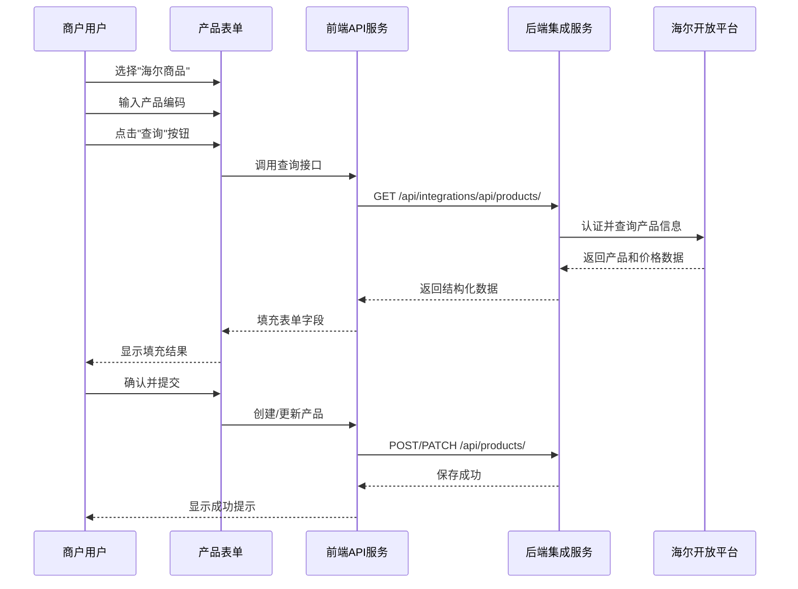
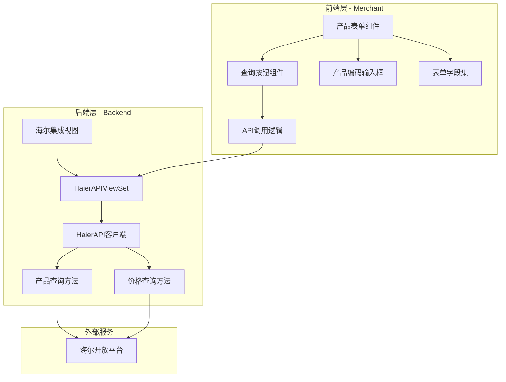
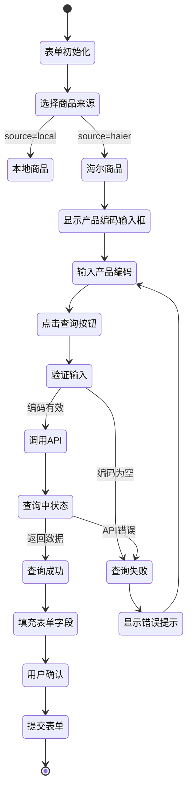
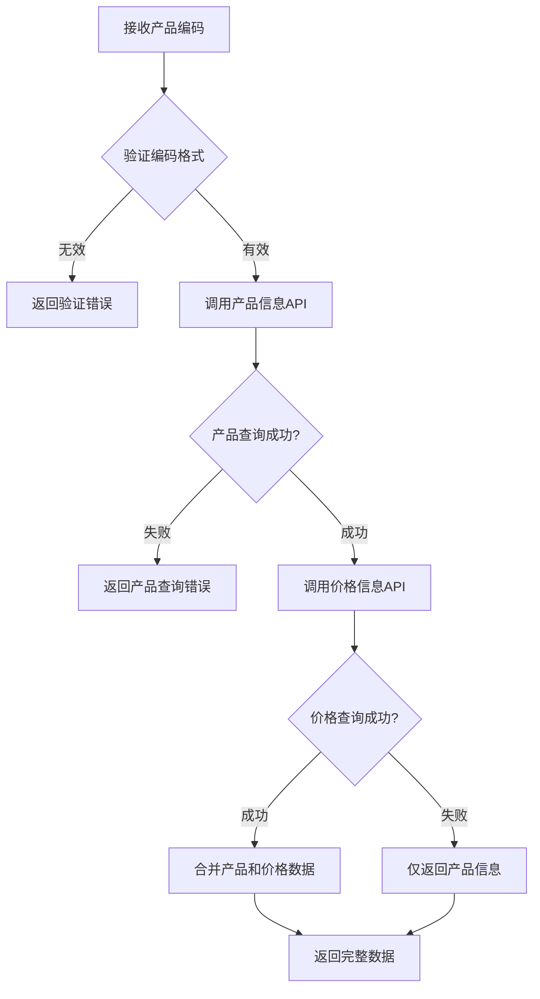

# 海尔产品表单自动填充功能设计

## 需求概述

为商户管理后台的产品表单添加海尔产品信息自动填充功能。当用户选择"海尔商品"来源并输入海尔产品编码后，系统自动调用海尔API查询产品详细信息并填充到表单对应字段中，减少手工录入工作量并确保数据准确性。

## 功能目标

- 支持在产品表单中通过产品编码快速查询海尔产品信息
- 自动填充产品名称、型号、分类、价格、图片等核心字段
- 提供加载状态反馈和错误提示
- 保持现有表单验证逻辑和提交流程

## 系统架构

### 数据流向

### 功能组件

## 前端设计

### 页面修改范围

修改文件：merchant/src/pages/Products/index.tsx

### 表单字段扩展

在"海尔产品信息"区域新增查询功能：

| 字段名称 | 组件类型 | 功能说明 | 默认值 |
|---------|---------|---------|-------|
| 产品编码输入框 | ProFormText | 支持输入海尔产品编码 | 空 |
| 查询按钮 | Button | 触发产品信息查询 | - |
| 加载状态 | Spin/Loading | 显示查询进度 | false |

### 交互流程

### 字段映射关系

海尔API响应字段与表单字段的映射规则：

| 海尔API字段 | 表单字段 | 数据类型 | 处理规则 |
|------------|---------|---------|---------|
| productCode | product_code | string | 直接映射 |
| productModel | product_model, name | string | 型号映射至product_model，同时作为默认产品名称 |
| productGroupNamd | product_group | string | 直接映射 |
| productBrandName | brand_id | number | 通过品牌名称查找品牌ID，若不存在则保持当前值 |
| productImageUrl | main_images | array | 转换为数组格式 |
| productLageUrls | detail_images | array | 直接映射详情图数组 |
| isSales | is_sales | string | 直接映射（1可采/0不可采） |
| noSalesReason | no_sales_reason | string | 直接映射 |
| supplyPrice | supply_price, price | decimal | 供价映射至supply_price和默认价格price |
| invoicePrice | invoice_price | decimal | 直接映射 |
| stockRebatePolicy | stock_rebate | decimal | 直接映射直扣金额 |
| rebateMoney | rebate_money | decimal | 直接映射台返金额 |

### 前端API服务扩展

新增API方法（merchant/src/services/api.ts）：

| 方法名称 | 请求类型 | 端点路径 | 参数 | 返回类型 |
|---------|---------|---------|------|---------|
| queryHaierProduct | GET | /integrations/api/products/ | product_codes: string | Promise |
| queryHaierPrices | GET | /integrations/api/prices/ | product_codes: string | Promise |

### 用户体验设计

#### 查询按钮状态

| 状态 | 按钮文本 | 禁用条件 | 图标 |
|-----|---------|---------|------|
| 默认 | 查询产品信息 | 产品编码为空 | SearchOutlined |
| 加载中 | 查询中... | 请求进行中 | LoadingOutlined |
| 成功 | 查询成功 | 无 | CheckOutlined |
| 失败 | 重新查询 | 无 | ReloadOutlined |

#### 错误处理场景

| 错误场景 | 提示信息 | 处理方式 |
|---------|---------|---------|
| 产品编码为空 | 请输入海尔产品编码 | 前端验证阻止请求 |
| API返回错误 | 查询失败：[错误详情] | 显示错误消息，允许重试 |
| 产品不存在 | 未找到该产品编码的信息 | 提示用户检查编码 |
| 网络超时 | 网络请求超时，请稍后重试 | 允许用户重新查询 |
| 品牌未匹配 | 未找到匹配品牌，请手动选择 | 保留其他字段，提示选择品牌 |

#### 成功反馈

查询成功后显示信息提示框：

| 元素 | 内容 |
|-----|------|
| 类型 | Success |
| 标题 | 产品信息查询成功 |
| 描述 | 已自动填充产品基本信息，请核对并完善其他字段 |
| 持续时间 | 3秒 |

### 表单布局调整

在"海尔产品信息"区域的布局结构：

## 后端设计

### API端点复用

复用现有海尔集成API端点：

| 端点 | 方法 | 路径 | 权限要求 |
|-----|------|------|---------|
| 查询产品 | GET | /api/integrations/api/products/ | 管理员 |
| 查询价格 | GET | /api/integrations/api/prices/ | 管理员 |

### 响应数据结构

#### 产品查询响应

标准响应格式：

| 字段 | 类型 | 说明 |
|-----|------|------|
| success | boolean | 请求是否成功 |
| data | array | 产品数据列表 |
| error | string | 错误信息（失败时） |

产品数据对象结构：

| 字段 | 类型 | 必填 | 示例值 |
|-----|------|------|-------|
| productCode | string | 是 | GA0SZC00U |
| productModel | string | 是 | EC6001-HT3 |
| productGroupNamd | string | 否 | 电热水器 |
| productBrandName | string | 否 | 海尔 |
| productImageUrl | string | 否 | https://... |
| productLageUrls | array | 否 | [...] |
| isSales | string | 是 | 1 |
| noSalesReason | string | 否 | - |

#### 价格查询响应

价格数据对象结构：

| 字段 | 类型 | 必填 | 示例值 |
|-----|------|------|-------|
| productCode | string | 是 | GA0SZC00U |
| supplyPrice | decimal | 是 | 1999.00 |
| invoicePrice | decimal | 是 | 1899.00 |
| stockRebatePolicy | decimal | 否 | 50.00 |
| rebateMoney | decimal | 否 | 50.00 |
| isSales | string | 是 | 1 |
| reason | string | 否 | - |

### 数据合并策略

查询流程需要调用两个API端点并合并数据：

合并后的数据对象包含产品基础信息和价格信息的所有字段。

### 错误响应标准

| HTTP状态码 | 错误场景 | 响应格式 |
|-----------|---------|---------|
| 400 | 参数验证失败 | {error: "product_codes参数必填"} |
| 401 | 未认证 | {detail: "Authentication credentials were not provided."} |
| 403 | 权限不足 | {detail: "You do not have permission to perform this action."} |
| 500 | 海尔API配置错误 | {error: "海尔API配置错误"} |
| 500 | 海尔API调用失败 | {error: "查询失败: [详细错误]"} |

## 数据验证规则

### 前端验证

| 验证项 | 规则 | 错误提示 |
|-------|------|---------|
| 产品编码 | 非空 | 请输入海尔产品编码 |
| 产品编码 | 长度1-50字符 | 产品编码长度不合法 |
| 产品编码 | 仅包含字母数字连字符 | 产品编码格式不正确 |

### 后端验证

后端已有验证逻辑，无需修改：

| 验证层级 | 验证内容 |
|---------|---------|
| HaierAPIViewSet | 验证product_codes参数存在性 |
| HaierAPI客户端 | 验证API认证状态 |
| 序列化器 | 验证产品字段完整性和格式 |

## 状态管理

### 组件内部状态

| 状态名称 | 类型 | 初始值 | 用途 |
|---------|------|-------|------|
| querying | boolean | false | 标识是否正在查询中 |
| queryError | string | null | 存储查询错误信息 |

### 表单状态

表单字段值通过Ant Design Form统一管理，查询成功后通过form.setFieldsValue批量更新字段值。

## 性能考虑

### API调用优化

| 优化措施 | 说明 |
|---------|------|
| 防抖控制 | 查询按钮点击后300ms内禁止重复点击 |
| 请求超时 | 设置30秒超时时间 |
| 取消机制 | 组件卸载时取消未完成的请求 |

### 用户体验优化

| 优化措施 | 说明 |
|---------|------|
| 加载指示器 | 查询过程中显示加载动画 |
| 字段禁用 | 查询中禁用产品编码输入框 |
| 渐进式填充 | 先填充产品信息，再填充价格信息 |

## 兼容性说明

### 向后兼容

| 兼容项 | 说明 |
|-------|------|
| 现有表单提交 | 不影响本地商品和已有海尔商品的提交流程 |
| 字段验证 | 保持所有必填字段验证规则不变 |
| 编辑模式 | 编辑海尔产品时查询功能仍然可用 |

### 数据一致性

| 一致性规则 | 说明 |
|-----------|------|
| source字段锁定 | 选择海尔商品后source字段为只读 |
| 产品编码唯一性 | 后端保证product_code唯一约束 |
| 价格同步 | 填充供价至price字段作为默认价格 |

## 测试场景

### 功能测试用例

| 用例编号 | 测试场景 | 预期结果 |
|---------|---------|---------|
| TC01 | 输入有效产品编码并查询 | 成功填充所有相关字段 |
| TC02 | 输入不存在的产品编码 | 显示未找到产品的错误提示 |
| TC03 | 产品编码为空时点击查询 | 前端阻止请求并提示输入 |
| TC04 | 查询过程中取消表单 | 请求被正确取消，无残留状态 |
| TC05 | 查询成功后修改字段并提交 | 保存修改后的值 |
| TC06 | 海尔品牌在系统中不存在 | 提示手动选择品牌，其他字段正常填充 |
| TC07 | 查询返回多个产品 | 使用第一个产品数据填充 |
| TC08 | 网络异常导致查询超时 | 显示超时错误，允许重试 |

### 边界条件测试

| 边界条件 | 测试内容 |
|---------|---------|
| 最大长度产品编码 | 验证50字符产品编码的处理 |
| 特殊字符产品编码 | 验证包含连字符等合法字符的处理 |
| 空价格数据 | 验证仅有产品信息无价格时的处理 |
| 并发查询 | 验证快速连续点击查询的防抖效果 |

### 集成测试

| 测试场景 | 验证内容 |
|---------|---------|
| 前后端联调 | 验证API请求和响应格式正确性 |
| 海尔API认证 | 验证后端正确处理海尔API认证 |
| 数据库保存 | 验证填充后提交能正确保存至数据库 |

## 安全考虑

### 权限控制

| 控制点 | 说明 |
|-------|------|
| API访问权限 | 海尔集成API仅限管理员用户访问 |
| 产品编码验证 | 后端验证产品编码格式防止注入攻击 |

### 数据安全

| 安全措施 | 说明 |
|---------|------|
| 输入过滤 | 前端过滤产品编码特殊字符 |
| XSS防护 | 使用框架内置的字符串转义机制 |
| 日志记录 | 后端记录查询操作以便审计 |

## 限制与约束

### 功能限制

| 限制项 | 说明 |
|-------|------|
| 单次查询数量 | 每次仅支持查询单个产品编码 |
| API调用频率 | 受海尔API限流策略约束 |
| 品牌自动匹配 | 仅匹配品牌名称完全一致的记录 |

### 已知问题处理

| 场景 | 处理方式 |
|-----|---------|
| 海尔API返回字段缺失 | 仅填充存在的字段，其他字段保持空值 |
| 品牌未匹配 | 保留查询到的品牌名称作为提示，要求手动选择 |
| 图片URL无效 | 填充至表单，由用户决定是否保留 |

## 扩展性设计

### 未来扩展点

| 扩展方向 | 说明 |
|---------|------|
| 批量导入 | 支持通过Excel批量导入产品编码并查询 |
| 库存同步 | 增加库存查询功能并填充库存字段 |
| 自动匹配分类 | 根据产品组自动匹配系统分类 |
| 品牌自动创建 | 当品牌不存在时自动创建并关联 |

### 接口预留

前端组件设计为独立的Hook或工具函数，便于在其他表单复用查询逻辑。

## 文档与培训

### 用户指南要点

| 主题 | 内容 |
|-----|------|
| 功能入口 | 在产品表单选择"海尔商品"后出现查询功能 |
| 操作步骤 | 1.选择海尔商品 2.输入产品编码 3.点击查询 4.核对并完善信息 5.提交保存 |
| 注意事项 | 查询后需检查品牌和分类是否正确，必要时手动调整 |

### 技术文档要点

| 主题 | 内容 |
|-----|------|
| API文档 | 详细说明查询接口的请求参数和响应格式 |
| 数据映射 | 提供海尔API字段与系统字段的映射表 |
| 错误处理 | 列举所有可能的错误场景和处理方式 |
