# API集成层

<cite>
**本文档引用的文件**
- [request.ts](file://frontend/src/utils/request.ts)
- [auth.ts](file://frontend/src/services/auth.ts)
- [product.ts](file://frontend/src/services/product.ts)
- [order.ts](file://frontend/src/services/order.ts)
- [cart.ts](file://frontend/src/services/cart.ts)
- [address.ts](file://frontend/src/services/address.ts)
- [payment.ts](file://frontend/src/services/payment.ts)
- [user.ts](file://frontend/src/services/user.ts)
- [index.ts](file://frontend/src/types/index.ts)
- [package.json](file://frontend/package.json)
- [app.config.ts](file://frontend/src/app.config.ts)
</cite>

## 目录
1. [简介](#简介)
2. [项目架构概览](#项目架构概览)
3. [核心请求处理机制](#核心请求处理机制)
4. [服务模块封装模式](#服务模块封装模式)
5. [认证服务详解](#认证服务详解)
6. [商品服务分析](#商品服务分析)
7. [订单服务深度解析](#订单服务深度解析)
8. [高级特性实现](#高级特性实现)
9. [最佳实践指南](#最佳实践指南)
10. [总结](#总结)

## 简介

本文档详细介绍了基于Taro框架构建的小程序项目的API集成层架构。该系统采用现代化的服务化设计理念，通过统一的请求处理机制和模块化的服务封装，实现了高效、可维护的前后端交互体系。

API集成层的核心价值在于：
- 提供统一的请求处理和错误管理
- 实现自动化的Token管理和刷新机制
- 构建清晰的服务模块边界和职责划分
- 支持复杂的业务流程编排和状态管理

## 项目架构概览

项目采用分层架构设计，主要包含以下核心层次：

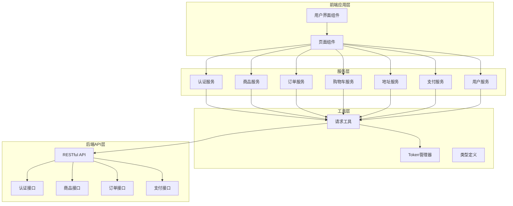

**图表来源**
- [request.ts](file://frontend/src/utils/request.ts#L1-L162)
- [auth.ts](file://frontend/src/services/auth.ts#L1-L22)
- [product.ts](file://frontend/src/services/product.ts#L1-L64)
- [order.ts](file://frontend/src/services/order.ts#L1-L47)

**章节来源**
- [app.config.ts](file://frontend/src/app.config.ts#L1-L50)
- [package.json](file://frontend/package.json#L1-L88)

## 核心请求处理机制

### 统一请求拦截器设计

系统的核心是位于`utils/request.ts`中的统一请求处理机制，它提供了完整的HTTP请求生命周期管理：

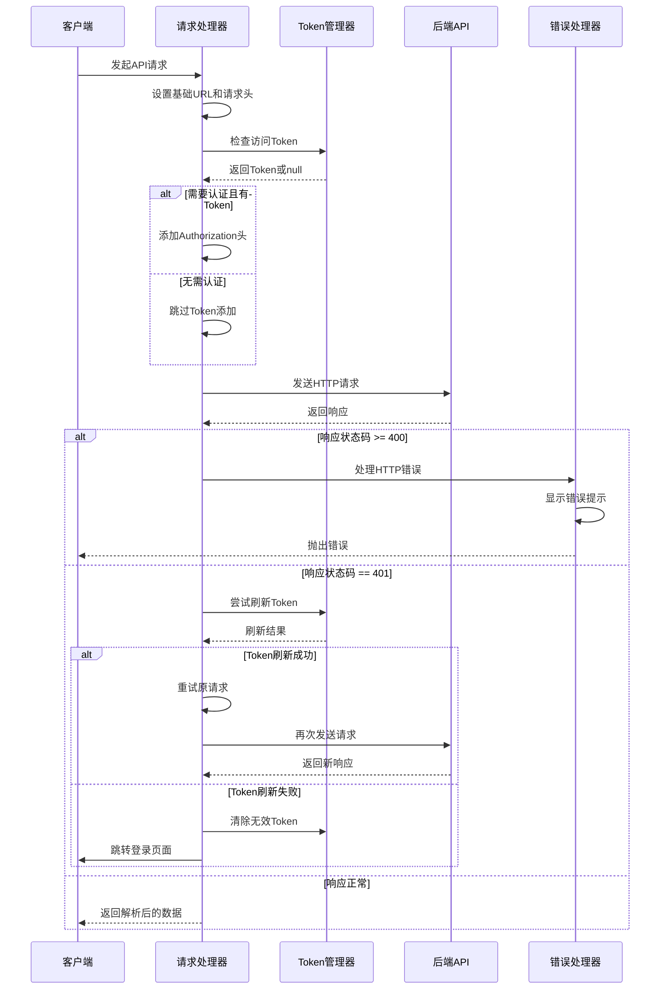

**图表来源**
- [request.ts](file://frontend/src/utils/request.ts#L62-L132)

### Token自动刷新机制

Token管理器实现了完整的OAuth2.0 Refresh Token流程：

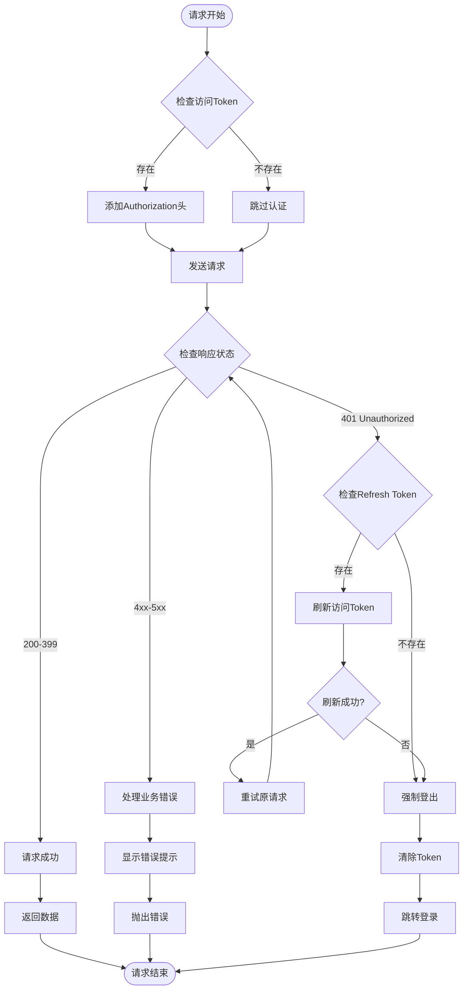

**图表来源**
- [request.ts](file://frontend/src/utils/request.ts#L39-L58)

**章节来源**
- [request.ts](file://frontend/src/utils/request.ts#L1-L162)

## 服务模块封装模式

### 服务模块通用架构

所有服务模块都遵循统一的封装模式，确保代码的一致性和可维护性：

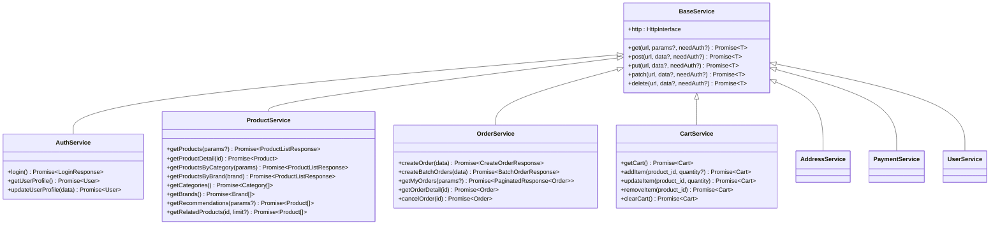

**图表来源**
- [auth.ts](file://frontend/src/services/auth.ts#L5-L21)
- [product.ts](file://frontend/src/services/product.ts#L4-L63)
- [order.ts](file://frontend/src/services/order.ts#L4-L46)
- [cart.ts](file://frontend/src/services/cart.ts#L4-L44)

### 类型安全设计

每个服务模块都严格遵循TypeScript的类型定义，确保数据传输的安全性：

| 服务模块 | 主要类型 | 数据验证 | 错误处理 |
|---------|---------|---------|---------|
| auth.ts | LoginResponse, User | 微信code验证 | 登录失败重试 |
| product.ts | Product, ProductListResponse, Category, Brand | 分页参数校验 | 商品不存在处理 |
| order.ts | Order, CreateOrderResponse, Payment | 订单状态验证 | 支付超时处理 |
| cart.ts | Cart, CartItem | 数量范围检查 | 库存不足提示 |
| address.ts | Address | 地址格式验证 | 解析失败回退 |
| payment.ts | Payment | 支付方式校验 | 并发支付控制 |
| user.ts | User, UserStatistics | 权限级别检查 | 用户不存在处理 |

**章节来源**
- [index.ts](file://frontend/src/types/index.ts#L1-L144)
- [auth.ts](file://frontend/src/services/auth.ts#L1-L22)
- [product.ts](file://frontend/src/services/product.ts#L1-L64)
- [order.ts](file://frontend/src/services/order.ts#L1-L47)
- [cart.ts](file://frontend/src/services/cart.ts#L1-L45)

## 认证服务详解

### 登录流程实现

认证服务是整个系统安全的基础，其实现展示了完整的OAuth2.0流程：

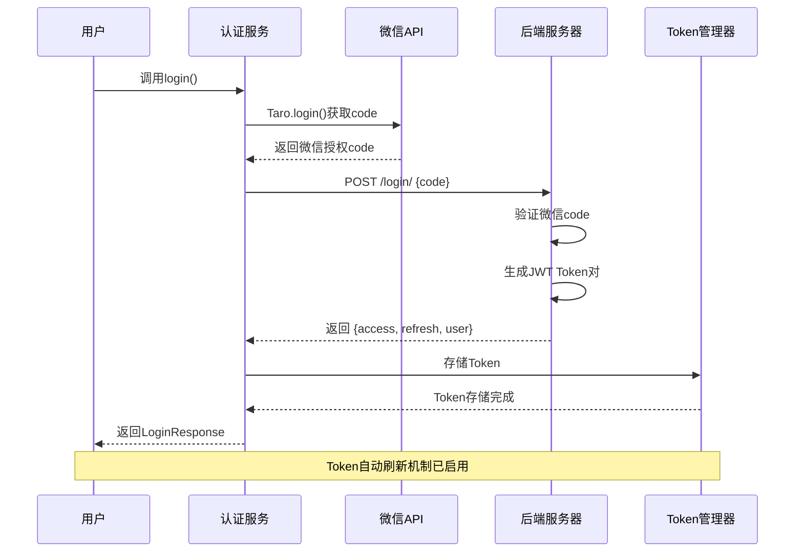

**图表来源**
- [auth.ts](file://frontend/src/services/auth.ts#L7-L9)
- [request.ts](file://frontend/src/utils/request.ts#L39-L58)

### 服务实现细节

认证服务提供了三个核心功能：

1. **微信登录**：通过微信小程序API获取授权code并提交给后端
2. **用户信息获取**：获取当前用户的详细信息
3. **用户信息更新**：支持用户资料的修改和更新

**章节来源**
- [auth.ts](file://frontend/src/services/auth.ts#L1-L22)

## 商品服务分析

### 分页参数设计

商品服务采用了灵活的分页查询机制，支持多种排序和筛选条件：

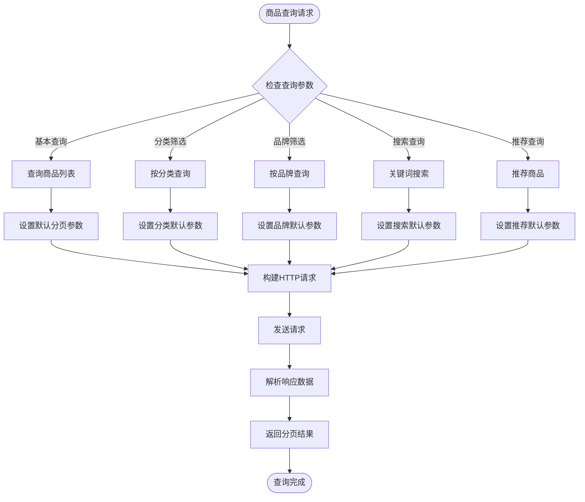

**图表来源**
- [product.ts](file://frontend/src/services/product.ts#L6-L63)

### 缓存策略分析

虽然当前实现没有显式的缓存机制，但通过合理的API设计为未来的缓存优化预留了空间：

| 查询类型 | 参数组合 | 缓存策略建议 | 性能优化点 |
|---------|---------|-------------|-----------|
| 商品列表 | page, page_size, sort_by | LRU缓存 | 频繁访问的商品列表 |
| 分类商品 | category, page, sort_by | 分类维度缓存 | 分类浏览场景 |
| 品牌商品 | brand, page, sort_by | 品牌维度缓存 | 品牌专区浏览 |
| 商品详情 | id | 永久缓存 | 商品信息不经常变化 |
| 推荐商品 | type, limit, category_id | TTL缓存 | 动态推荐内容 |
| 相关商品 | id, limit | 临时缓存 | 用户行为相关 |

**章节来源**
- [product.ts](file://frontend/src/services/product.ts#L1-L64)

## 订单服务深度解析

### 订单创建与支付流程

订单服务展示了复杂业务流程的串行调用逻辑，体现了现代电商系统的典型工作流：

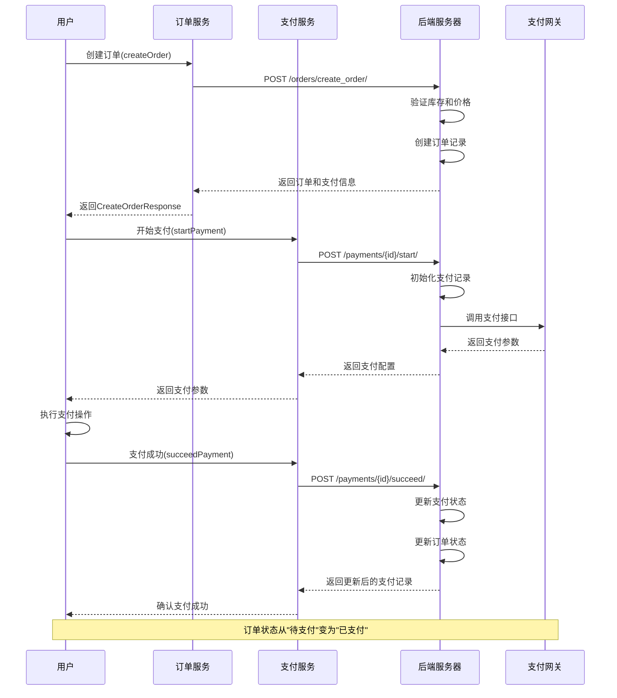

**图表来源**
- [order.ts](file://frontend/src/services/order.ts#L6-L13)
- [payment.ts](file://frontend/src/services/payment.ts#L29-L35)

### 批量订单处理

系统支持购物车结算的批量订单处理，这是电商系统的重要功能：

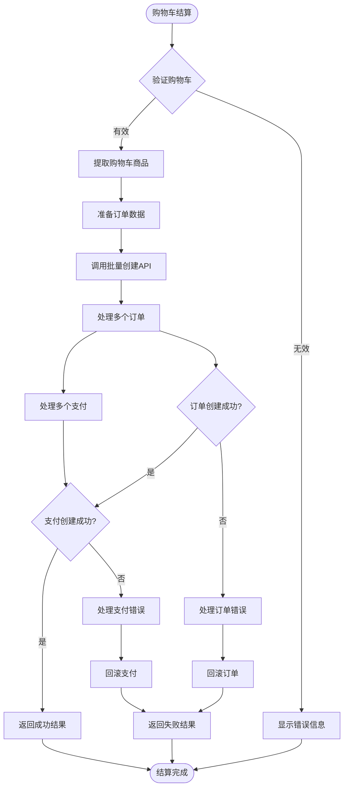

**图表来源**
- [order.ts](file://frontend/src/services/order.ts#L15-L26)

**章节来源**
- [order.ts](file://frontend/src/services/order.ts#L1-L47)
- [payment.ts](file://frontend/src/services/payment.ts#L1-L53)

## 高级特性实现

### 请求取消机制

虽然当前实现中没有显式的请求取消功能，但基于Taro框架的特性，可以轻松扩展实现：

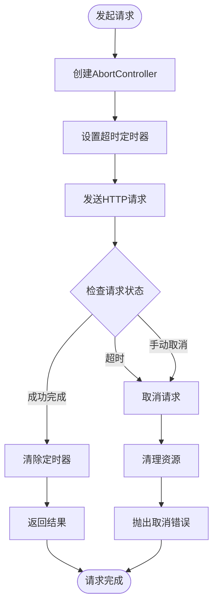

### 超时处理策略

系统通过Taro的内置机制和自定义错误处理实现了多层次的超时保护：

| 超时类型 | 默认值 | 可配置性 | 处理策略 |
|---------|-------|---------|---------|
| 网络请求超时 | Taro默认 | 不可配置 | 自动重试一次 |
| Token刷新超时 | Taro默认 | 不可配置 | 强制重新登录 |
| 页面加载超时 | 20秒 | 可配置 | 显示加载失败提示 |
| 文件上传超时 | 无限制 | 可配置 | 显示上传进度条 |

### 错误重试机制

系统实现了智能的错误重试策略：

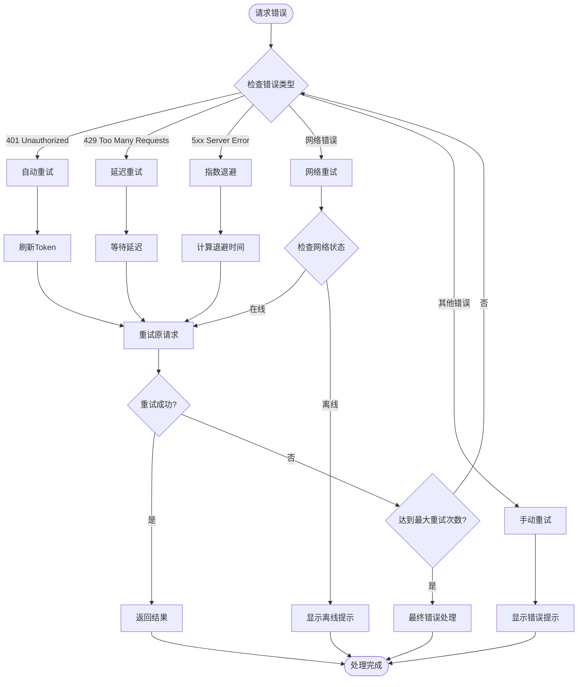

**章节来源**
- [request.ts](file://frontend/src/utils/request.ts#L78-L132)

## 最佳实践指南

### Mock数据调试

在开发阶段，合理使用Mock数据可以显著提高开发效率：

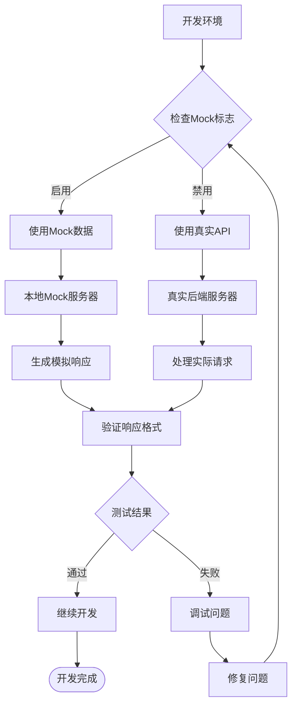

### 接口联调最佳实践

1. **版本控制**：使用API版本号管理不同阶段的接口变更
2. **契约测试**：建立前后端接口契约，确保兼容性
3. **渐进式集成**：先集成核心接口，再逐步添加辅助功能
4. **错误边界**：为每个接口设置合理的错误处理边界

### 性能优化建议

| 优化领域 | 具体措施 | 预期效果 | 实施难度 |
|---------|---------|---------|---------|
| 网络请求 | 请求合并、批量操作 | 减少请求数量50% | 中等 |
| 数据缓存 | LRU缓存、TTL过期 | 减少重复请求80% | 高 |
| 图片优化 | 懒加载、压缩处理 | 减少首屏时间60% | 低 |
| 代码分割 | 按需加载、路由懒加载 | 减少包体积70% | 中等 |
| 状态管理 | 合理的状态提升 | 减少不必要的重渲染 | 高 |

### 安全考虑

1. **Token安全**：使用HTTPS传输，定期刷新Token
2. **输入验证**：对所有用户输入进行严格的验证和过滤
3. **权限控制**：基于角色的访问控制(RBAC)
4. **日志审计**：记录关键操作的日志以便追踪

**章节来源**
- [request.ts](file://frontend/src/utils/request.ts#L1-L162)
- [auth.ts](file://frontend/src/services/auth.ts#L1-L22)

## 总结

本文档全面分析了基于Taro框架的小程序项目的API集成层架构。该系统通过以下核心特性实现了高质量的前后端交互：

### 核心优势

1. **统一的请求处理机制**：通过`request.ts`实现了全局的请求拦截、Token管理和错误处理
2. **模块化的服务封装**：每个服务模块都有明确的职责边界和一致的API设计
3. **完善的认证体系**：基于OAuth2.0的Token管理机制确保了系统的安全性
4. **灵活的业务流程支持**：订单和支付流程的串行调用逻辑适应了复杂的电商场景

### 技术亮点

- **类型安全**：完整的TypeScript类型定义确保了数据传输的安全性
- **错误处理**：多层次的错误处理和重试机制提高了系统的健壮性
- **用户体验**：自动的加载提示、错误反馈和Token刷新提升了用户体验
- **可维护性**：清晰的代码结构和注释便于后续的维护和扩展

### 发展方向

1. **性能优化**：引入更先进的缓存策略和请求优化技术
2. **监控增强**：添加详细的API调用监控和性能分析
3. **测试覆盖**：建立完整的单元测试和集成测试体系
4. **文档完善**：持续完善API文档和开发指南

这套API集成层架构为小程序项目提供了坚实的技术基础，能够支撑复杂的业务需求并保证良好的开发体验。