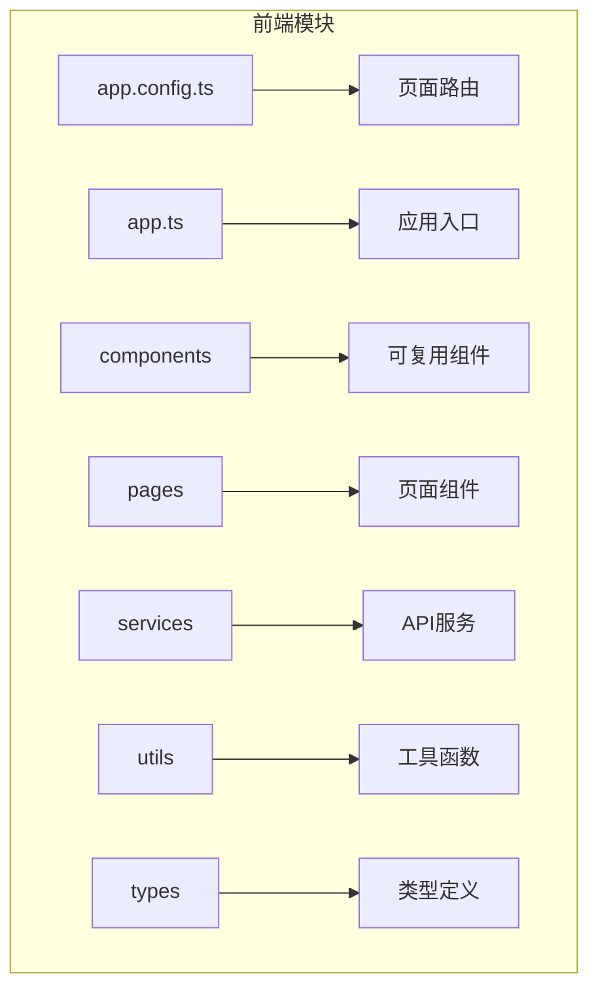
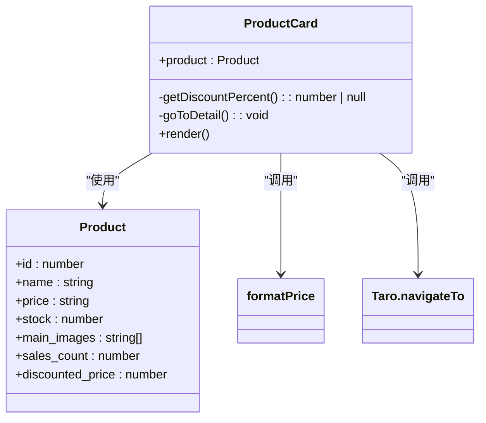
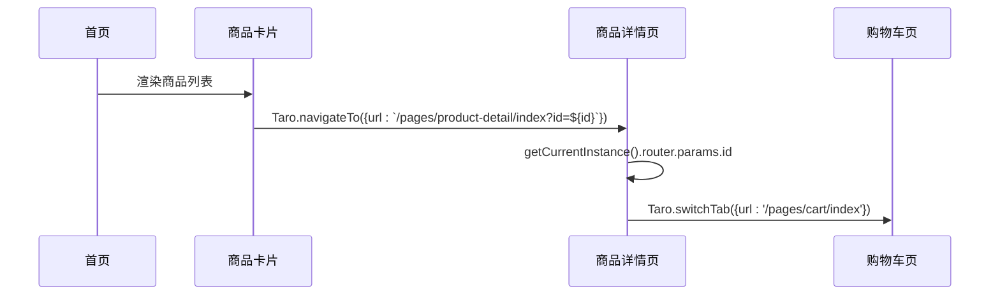
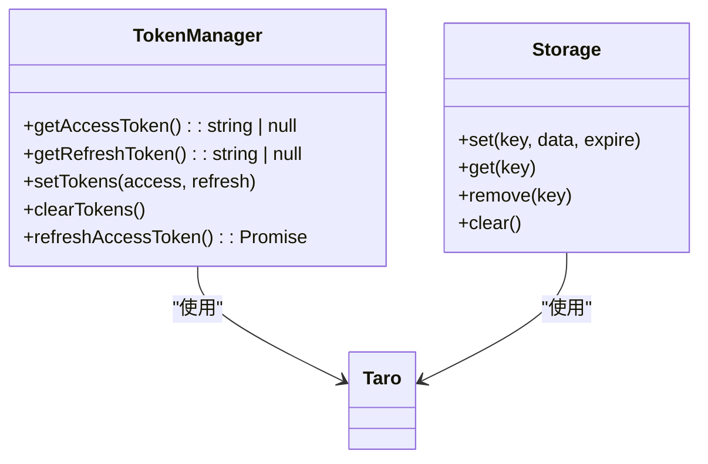
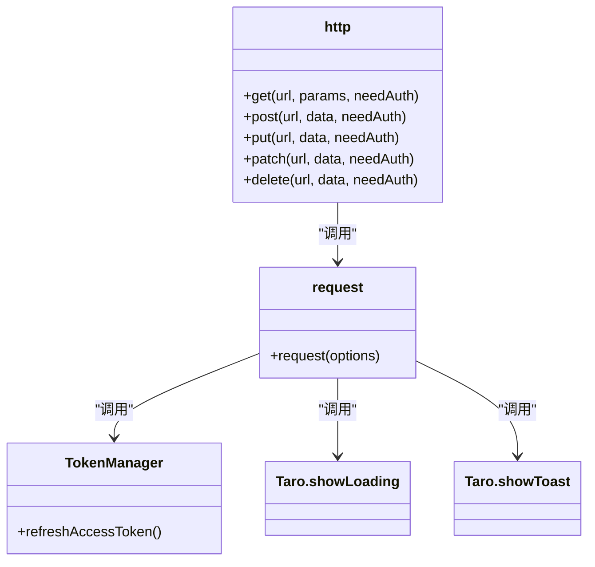
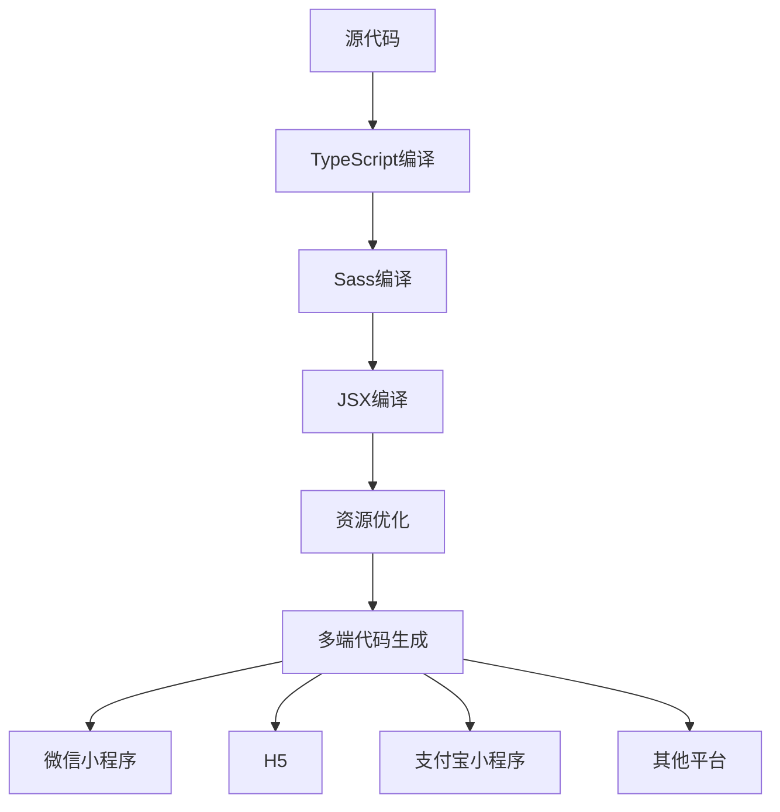

# 前端架构

<cite>
**本文档引用文件**  
- [app.ts](file://frontend/src/app.ts)
- [app.config.ts](file://frontend/src/app.config.ts)
- [package.json](file://frontend/package.json)
- [ProductCard/index.tsx](file://frontend/src/components/ProductCard/index.tsx)
- [ProductCard/index.scss](file://frontend/src/components/ProductCard/index.scss)
- [auth.ts](file://frontend/src/services/auth.ts)
- [address.ts](file://frontend/src/services/address.ts)
- [request.ts](file://frontend/src/utils/request.ts)
- [index.ts](file://frontend/src/types/index.ts)
- [home/index.tsx](file://frontend/src/pages/home/index.tsx)
- [product-detail/index.tsx](file://frontend/src/pages/product-detail/index.tsx)
- [format.ts](file://frontend/src/utils/format.ts)
- [storage.ts](file://frontend/src/utils/storage.ts)
- [tsconfig.json](file://frontend/tsconfig.json)
</cite>

## 目录
1. [项目结构](#项目结构)
2. [组件架构](#组件架构)
3. [路由与导航机制](#路由与导航机制)
4. [样式策略](#样式策略)
5. [状态管理方案](#状态管理方案)
6. [API集成层](#api集成层)
7. [国际化与可访问性](#国际化与可访问性)
8. [测试策略](#测试策略)
9. [构建与部署管道](#构建与部署管道)

## 项目结构

该项目采用Taro框架构建的小程序应用，前端代码位于`frontend`目录下，整体结构清晰，遵循模块化设计原则。主要目录包括：
- `src/components`：存放可复用的UI组件，如ProductCard
- `src/pages`：存放页面级组件，每个页面包含独立的配置、样式和逻辑文件
- `src/services`：封装API调用的服务模块
- `src/utils`：工具函数集合，包括请求封装、格式化、缓存管理等
- `src/types`：类型定义文件，统一管理TypeScript接口
- `config`：环境配置文件
- 根目录下的`app.config.ts`定义了全局路由和TabBar配置

项目使用TypeScript、React和Sass技术栈，通过Taro CLI进行多端编译。



**Diagram sources**
- [app.config.ts](file://frontend/src/app.config.ts)
- [app.ts](file://frontend/src/app.ts)

**Section sources**
- [app.config.ts](file://frontend/src/app.config.ts)
- [app.ts](file://frontend/src/app.ts)

## 组件架构

组件架构遵循高内聚、低耦合的设计原则，强调组件的可复用性和可维护性。以`ProductCard`组件为例，该组件被多个页面（如首页、分类页、搜索页）复用，实现了商品信息的统一展示。

`ProductCard`组件接收`Product`类型作为props，内部封装了商品图片、名称、价格、折扣信息、库存状态等展示逻辑，并通过点击事件跳转至商品详情页。组件样式使用Sass编写，采用BEM命名规范，确保样式隔离和可维护性。

组件通过`formatPrice`工具函数格式化价格显示，利用`Taro.navigateTo`实现页面跳转，体现了良好的封装性和独立性。



**Diagram sources**
- [ProductCard/index.tsx](file://frontend/src/components/ProductCard/index.tsx)
- [ProductCard/index.scss](file://frontend/src/components/ProductCard/index.scss)
- [types/index.ts](file://frontend/src/types/index.ts)

**Section sources**
- [ProductCard/index.tsx](file://frontend/src/components/ProductCard/index.tsx)
- [ProductCard/index.scss](file://frontend/src/components/ProductCard/index.scss)

## 路由与导航机制

路由配置在`app.config.ts`文件中通过`defineAppConfig`定义，采用声明式方式配置页面路径和TabBar。项目包含16个页面，其中4个作为TabBar页面：首页、分类、购物车和我的。

TabBar配置包含颜色、背景色、边框样式及各Tab项的路径和文本。这种集中式配置便于维护和国际化适配。

页面跳转逻辑通过Taro提供的路由API实现：
- `Taro.navigateTo`：用于跳转到非TabBar页面（如商品详情页）
- `Taro.switchTab`：用于跳转到TabBar页面
- `Taro.navigateBack`：用于返回上一页

在商品详情页中，通过`Taro.getCurrentInstance().router.params`获取路由参数（如商品ID），实现动态内容加载。



**Diagram sources**
- [app.config.ts](file://frontend/src/app.config.ts)
- [product-detail/index.tsx](file://frontend/src/pages/product-detail/index.tsx)

**Section sources**
- [app.config.ts](file://frontend/src/app.config.ts)
- [product-detail/index.tsx](file://frontend/src/pages/product-detail/index.tsx)

## 样式策略

项目采用Sass作为CSS预处理器，在`package.json`中明确指定使用Sass。样式文件以`.scss`为扩展名，支持嵌套、变量、混合等高级特性，提升样式开发效率。

样式组织遵循BEM（Block Element Modifier）命名规范：
- Block：独立的组件或模块（如`product-card`）
- Element：块的组成部分（如`product-image`、`product-info`）
- Modifier：块或元素的状态或变体（如`favorited`、`disabled`）

例如在`ProductCard`组件中：
- `.product-card`：块
- `.product-image-wrapper`、`.product-info`：元素
- `.favorited`：修饰符

样式作用域通过组件级引入实现（`import './index.scss'`），避免全局污染。同时使用rpx单位实现响应式布局，适配不同屏幕尺寸。

**Section sources**
- [ProductCard/index.scss](file://frontend/src/components/ProductCard/index.scss)
- [package.json](file://frontend/package.json)

## 状态管理方案

项目采用React Hooks作为主要状态管理方案，结合Taro框架提供的API实现组件状态管理。

核心Hooks使用包括：
- `useState`：管理组件内部状态，如搜索值、商品列表、分页信息等
- `useEffect`：处理副作用，如页面初始化数据加载
- 自定义Hook：通过工具函数实现缓存管理（Storage）

在首页中，使用`useState`管理搜索值、分类列表、品牌列表、商品列表等状态，通过`useEffect`在组件挂载时加载初始数据。商品详情页使用`useState`管理商品信息、数量选择、弹窗显示等状态。

对于全局状态（如用户登录状态、Token），项目通过`Taro.setStorageSync`和`Taro.getStorageSync`进行本地存储管理，封装在`utils/request.ts`的`TokenManager`中。



**Diagram sources**
- [request.ts](file://frontend/src/utils/request.ts)
- [storage.ts](file://frontend/src/utils/storage.ts)

**Section sources**
- [request.ts](file://frontend/src/utils/request.ts)
- [storage.ts](file://frontend/src/utils/storage.ts)

## API集成层

API集成层位于`src/services`目录下，按业务领域划分模块，包括`auth.ts`、`address.ts`、`product.ts`等。每个服务模块封装了特定业务的API调用，提供清晰的接口抽象。

核心设计特点：
- 统一请求封装：在`utils/request.ts`中封装`request`函数，处理加载提示、错误处理、Token刷新等横切关注点
- Token自动刷新：当API返回401时，自动尝试刷新Token并重试请求
- 便捷方法：提供`http.get`、`http.post`等快捷方法
- 类型安全：使用TypeScript泛型确保API响应类型安全

以`authService`为例，封装了微信登录、获取用户信息、更新用户信息等方法，返回Promise类型，便于异步处理。



**Diagram sources**
- [request.ts](file://frontend/src/utils/request.ts)
- [auth.ts](file://frontend/src/services/auth.ts)
- [address.ts](file://frontend/src/services/address.ts)

**Section sources**
- [request.ts](file://frontend/src/utils/request.ts)
- [auth.ts](file://frontend/src/services/auth.ts)
- [address.ts](file://frontend/src/services/address.ts)

## 国际化与可访问性

项目当前主要支持中文（zh-hans），在`app.config.ts`中通过中文文本配置TabBar和页面标题。虽然未实现完整的国际化框架，但代码中已体现出国际化设计意识，如将文本内容直接写在配置中，便于后续提取为多语言资源。

可访问性方面：
- 使用语义化组件（如`View`、`Text`、`Image`）
- 为图片提供`mode`属性确保正确显示
- 为交互元素添加适当的反馈（如点击态）
- 使用合理的对比度和字体大小
- 在表单输入中提供占位符文本

项目可通过引入`@tarojs/plugin-i18n`插件进一步完善国际化支持，将文本内容提取到语言包中，实现多语言切换功能。

**Section sources**
- [app.config.ts](file://frontend/src/app.config.ts)

## 测试策略

项目当前未提供明确的测试文件，但基于Taro框架的特性，可以实施以下测试策略：

**单元测试**：
- 使用Jest作为测试框架
- 测试工具函数（如`formatPrice`、`Storage`）
- 测试服务模块的API调用逻辑
- 使用`@tarojs/taro`的mock机制测试Taro API调用

**E2E测试**：
- 使用Taro CLI内置的测试能力
- 模拟用户操作流程（如登录、浏览商品、加入购物车、下单）
- 测试跨页面导航和状态传递

建议在`tests`目录下建立测试文件结构，配置`jest.config.js`，并使用`react-testing-library`进行组件测试。

**Section sources**
- [format.ts](file://frontend/src/utils/format.ts)
- [storage.ts](file://frontend/src/utils/storage.ts)

## 构建与部署管道

构建与部署管道基于Taro CLI和Vite构建。`package.json`中定义了多端构建脚本：

```json
"scripts": {
  "build:weapp": "taro build --type weapp",
  "build:h5": "taro build --type h5",
  "dev:weapp": "npm run build:weapp -- --watch"
}
```

项目使用Vite作为构建工具（`@tarojs/vite-runner`），具有快速的启动速度和热更新能力。构建流程包括：
1. TypeScript编译（`tsconfig.json`配置）
2. Sass编译
3. JSX/TSX编译
4. 资源优化
5. 多端代码生成

多端编译支持微信小程序、H5、支付宝小程序等多个平台，通过`--type`参数指定目标平台。开发模式下使用`--watch`参数实现热重载。

环境配置通过`config/index.ts`统一管理，支持开发和生产环境的区分。



**Diagram sources**
- [package.json](file://frontend/package.json)
- [tsconfig.json](file://frontend/tsconfig.json)

**Section sources**
- [package.json](file://frontend/package.json)
- [tsconfig.json](file://frontend/tsconfig.json)