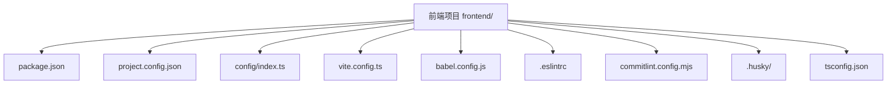
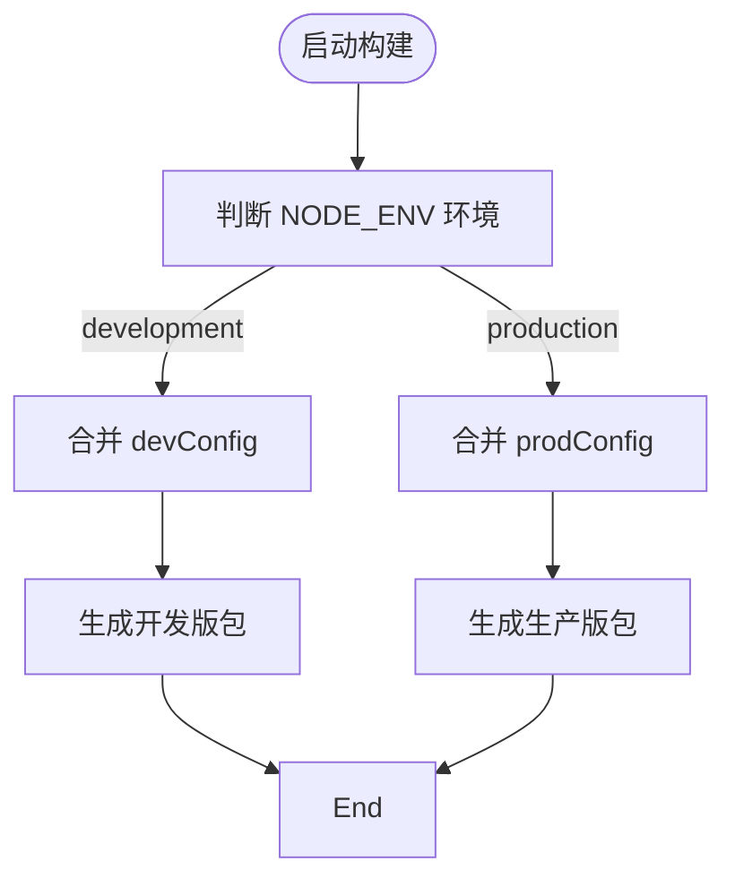
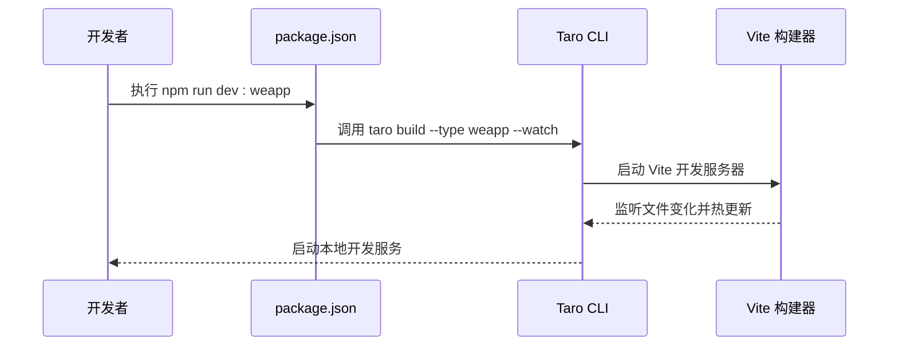
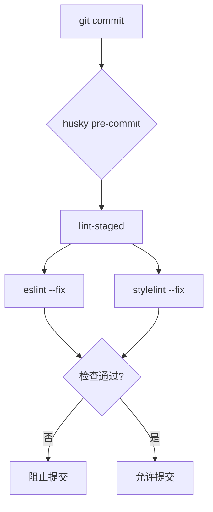

# 构建与部署管道

<cite>
**本文档中引用的文件**  
- [package.json](file://frontend/package.json)
- [project.config.json](file://frontend/project.config.json)
- [vite.config.ts](file://merchant/vite.config.ts)
- [config/index.ts](file://frontend/config/index.ts)
- [config/dev.ts](file://frontend/config/dev.ts)
- [config/prod.ts](file://frontend/config/prod.ts)
- [babel.config.js](file://frontend/babel.config.js)
- [commitlint.config.mjs](file://frontend/commitlint.config.mjs)
- [.eslintrc](file://frontend/.eslintrc)
- [tsconfig.json](file://frontend/tsconfig.json)
- [src/app.config.ts](file://frontend/src/app.config.ts)
- [.husky/_/husky.sh](file://frontend/.husky/_/husky.sh)
</cite>

## 目录
1. [简介](#简介)
2. [项目结构](#项目结构)
3. [核心构建配置](#核心构建配置)
4. [多环境构建参数配置](#多环境构建参数配置)
5. [开发与构建脚本流程](#开发与构建脚本流程)
6. [代码提交前检查机制](#代码提交前检查机制)
7. [部署上线操作步骤](#部署上线操作步骤)
8. [结论](#结论)

## 简介
本文档详细说明了基于 Taro 框架和 Vite 构建工具的小程序项目的构建与部署管道。涵盖从开发环境搭建、多环境配置、代码质量保障到最终部署上线的完整流程，确保开发团队能够高效、稳定地进行迭代发布。

## 项目结构
本项目采用前后端分离架构，前端部分位于 `frontend/` 目录下，使用 Taro + React 技术栈开发微信小程序。核心构建与部署相关文件集中于 `frontend` 目录中，包括构建配置、环境变量、代码检查规则等。

**Diagram sources**
- [package.json](file://frontend/package.json)
- [project.config.json](file://frontend/project.config.json)
- [config/index.ts](file://frontend/config/index.ts)

**Section sources**
- [package.json](file://frontend/package.json)
- [project.config.json](file://frontend/project.config.json)

## 核心构建配置
项目使用 Vite 作为编译器，通过 `@tarojs/vite-runner` 集成到 Taro 框架中。在 `config/index.ts` 中定义了基础构建配置，包括项目名称、设计稿尺寸、源码与输出目录、框架类型等。

别名设置在 `tsconfig.json` 中通过 `paths` 字段实现，配置了 `@/*` 指向 `./src/*`，便于模块导入。

资源压缩方面，`project.config.json` 中启用了 `minifyWXML` 和 `minifyWXSS`，确保生成的小程序包体积最小化。同时，`postcss` 的 `pxtransform` 插件自动将 px 转换为 rpx，适配不同屏幕。

代码分割策略由 Taro 内部基于页面路由自动实现，每个页面独立打包，提升加载性能。

**Section sources**
- [config/index.ts](file://frontend/config/index.ts#L8-L83)
- [tsconfig.json](file://frontend/tsconfig.json#L23-L26)
- [project.config.json](file://frontend/project.config.json#L18-L19)

## 多环境构建参数配置
项目通过 `config/index.ts` 动态加载不同环境的配置文件。当 `NODE_ENV` 为 `development` 时，合并 `devConfig`；否则合并 `prodConfig`。

`dev.ts` 文件为空对象，表示开发环境使用默认配置，不启用压缩混淆，便于调试。

`prod.ts` 文件则用于生产环境，虽然当前未显式配置压缩选项，但 Taro 默认在生产构建时开启代码压缩与混淆，确保输出代码的安全性与性能。

**Diagram sources**
- [config/index.ts](file://frontend/config/index.ts#L84-L89)
- [config/dev.ts](file://frontend/config/dev.ts)
- [config/prod.ts](file://frontend/config/prod.ts)

**Section sources**
- [config/index.ts](file://frontend/config/index.ts#L84-L89)
- [config/dev.ts](file://frontend/config/dev.ts)
- [config/prod.ts](file://frontend/config/prod.ts)

## 开发与构建脚本流程
`package.json` 中定义了完整的开发与构建脚本命令：

- `dev:weapp`：启动微信小程序开发服务器，基于 `build:weapp --watch` 实现热更新。
- `build:weapp`：执行微信小程序的构建任务，生成可上传的代码包。

这些脚本通过 Taro CLI 调用底层构建系统，结合 Vite 实现快速编译与热重载。

**Diagram sources**
- [package.json](file://frontend/package.json#L13-L32)
- [config/index.ts](file://frontend/config/index.ts#L7-L8)

**Section sources**
- [package.json](file://frontend/package.json#L13-L32)

## 代码提交前检查机制
项目集成 husky 和 lint-staged 实现代码提交前自动化检查：

- `husky` 在 `prepare` 脚本中初始化 Git hooks。
- `pre-commit` hook 触发 `lint-staged`，对暂存区文件执行 lint 检查。
- `.eslintrc` 定义了基于 `taro/react` 的 ESLint 规则。
- `commitlint.config.mjs` 使用 `@commitlint/config-conventional` 规范提交信息格式。

此机制确保所有提交代码符合编码规范，且提交信息清晰可追溯。

**Diagram sources**
- [package.json](file://frontend/package.json#L13)
- [.husky/_/husky.sh](file://frontend/.husky/_/husky.sh)
- [.eslintrc](file://frontend/.eslintrc)
- [commitlint.config.mjs](file://frontend/commitlint.config.mjs)

**Section sources**
- [package.json](file://frontend/package.json#L13)
- [.husky/_/husky.sh](file://frontend/.husky/_/husky.sh)
- [.eslintrc](file://frontend/.eslintrc)
- [commitlint.config.mjs](file://frontend/commitlint.config.mjs)

## 部署上线操作步骤
1. **版本号管理**：在 `package.json` 中更新 `version` 字段，遵循语义化版本规范（如 1.0.1 → 1.0.2）。
2. **构建生产包**：运行 `npm run build:weapp` 生成 `dist/` 目录下的小程序代码包。
3. **上传代码包**：使用微信开发者工具或 CLI 工具上传 `dist/` 目录至微信平台。
4. **生成二维码**：在微信小程序管理后台生成体验版或正式版二维码，供测试或推广使用。
5. **灰度发布建议**：
   - 先向 10% 用户开放新版本；
   - 监控错误日志与用户反馈；
   - 无异常后逐步扩大至 50%，最终全量发布；
   - 配合 `project.config.json` 中的 `appid` 与 `setting` 确保环境隔离。

**Section sources**
- [package.json](file://frontend/package.json#L3)
- [project.config.json](file://frontend/project.config.json#L5)

## 结论
本项目构建与部署管道设计合理，基于 Taro + Vite 提供高效的开发体验，通过 husky + lint-staged 保障代码质量，结合多环境配置支持灵活发布策略。建议持续优化生产构建配置（如添加 bundle 分析插件），并完善自动化部署流程以提升交付效率。