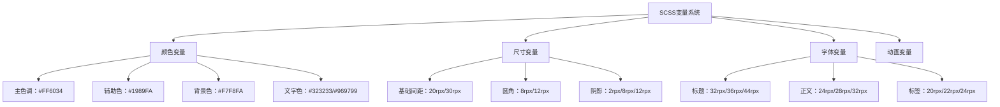
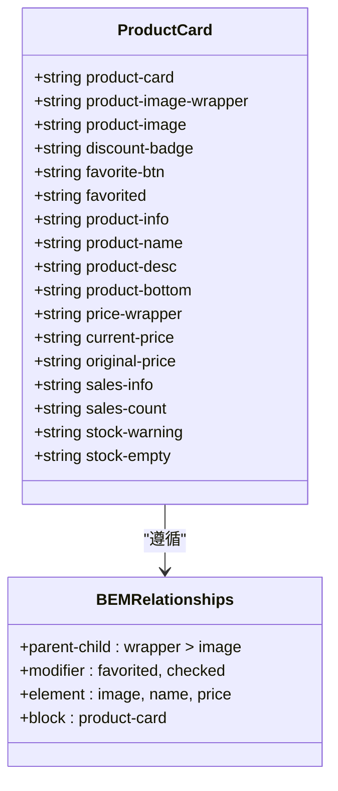
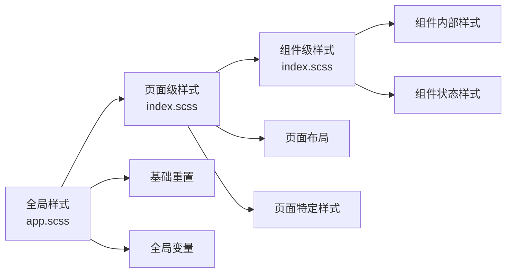
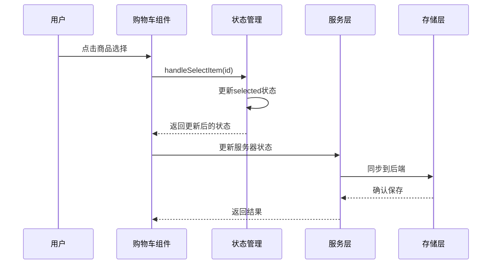
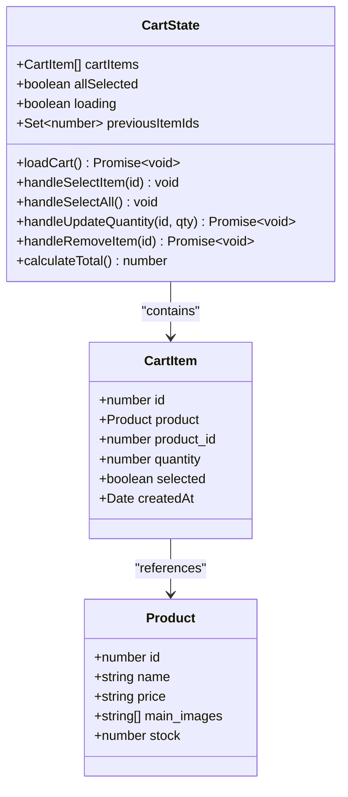
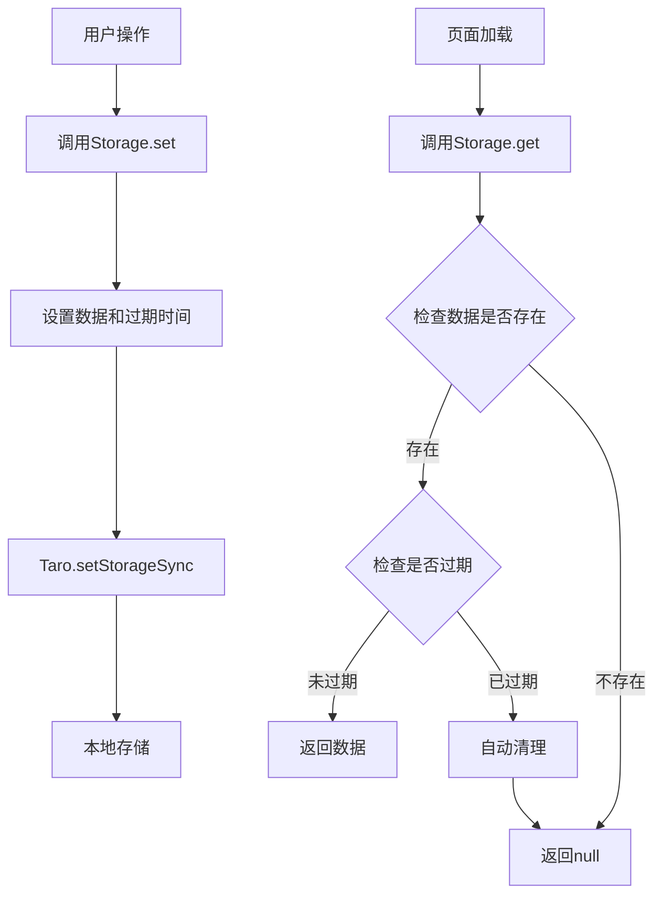
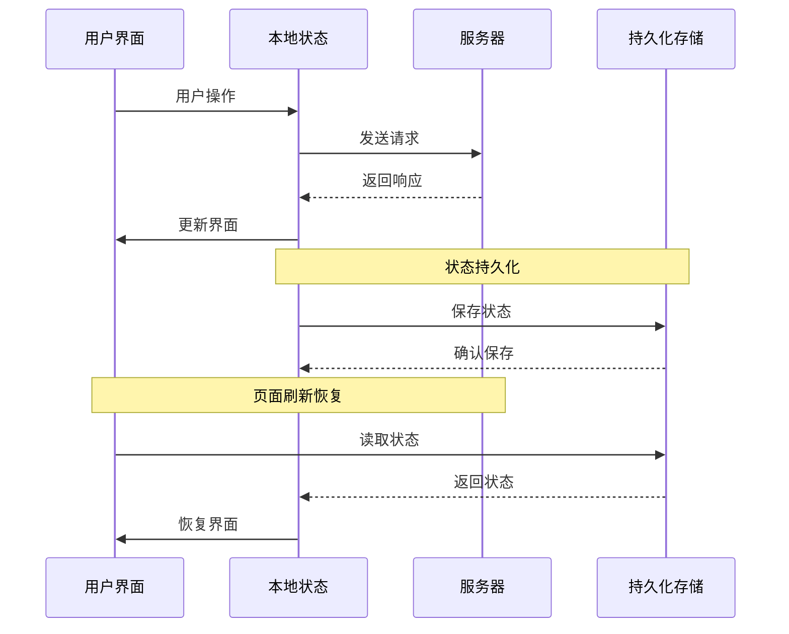

# 样式策略与状态管理

<cite>
**本文档引用的文件**
- [frontend/src/components/ProductCard/index.scss](file://frontend/src/components/ProductCard/index.scss)
- [frontend/src/pages/cart/index.scss](file://frontend/src/pages/cart/index.scss)
- [frontend/src/pages/home/index.scss](file://frontend/src/pages/home/index.scss)
- [frontend/src/pages/product-detail/index.scss](file://frontend/src/pages/product-detail/index.scss)
- [frontend/src/app.scss](file://frontend/src/app.scss)
- [frontend/src/pages/cart/index.tsx](file://frontend/src/pages/cart/index.tsx)
- [frontend/src/utils/storage.ts](file://frontend/src/utils/storage.ts)
- [frontend/src/services/cart.ts](file://frontend/src/services/cart.ts)
- [frontend/src/types/index.ts](file://frontend/src/types/index.ts)
- [frontend/src/utils/format.ts](file://frontend/src/utils/format.ts)
- [frontend/stylelint.config.mjs](file://frontend/stylelint.config.mjs)
</cite>

## 目录
1. [概述](#概述)
2. [SCSS预处理器使用规范](#scss预处理器使用规范)
3. [BEM命名约定实践](#bem命名约定实践)
4. [全局样式与局部样式作用域管理](#全局样式与局部样式作用域管理)
5. [React状态管理架构](#react状态管理架构)
6. [购物车状态管理实现](#购物车状态管理实现)
7. [跨页面状态解决方案](#跨页面状态解决方案)
8. [复杂状态同步处理模式](#复杂状态同步处理模式)
9. [性能优化策略](#性能优化策略)
10. [最佳实践总结](#最佳实践总结)

## 概述

本项目采用现代化的小程序开发框架，结合React生态系统的最佳实践，构建了一套完整的样式策略与状态管理系统。系统通过SCSS预处理器实现样式的模块化和可维护性，使用React Hooks进行状态管理，并通过Taro Storage实现跨页面的状态持久化。

## SCSS预处理器使用规范

### 变量定义与主题系统

项目采用基于颜色和尺寸的变量体系，确保设计一致性：



**图表来源**
- [frontend/src/components/ProductCard/index.scss](file://frontend/src/components/ProductCard/index.scss#L1-L158)
- [frontend/src/pages/cart/index.scss](file://frontend/src/pages/cart/index.scss#L1-L239)

### Mixin复用机制

项目实现了多个可复用的Mixin函数，提高代码复用率：

| Mixin类型 | 功能描述 | 使用场景 |
|-----------|----------|----------|
| `flex-center` | 居中对齐布局 | 图标按钮、加载动画 |
| `ellipsis` | 文本溢出省略 | 商品名称、描述文本 |
| `gradient-bg` | 渐变背景 | 按钮、徽章、装饰元素 |
| `transition` | 过渡效果 | 按钮交互、卡片动画 |

### 响应式设计策略

采用基于rpx的响应式方案，确保在不同设备上的良好显示：

```scss
// 响应式断点定义
$mobile-breakpoint: 320px;
$tablet-breakpoint: 768px;
$desktop-breakpoint: 1024px;

// 基于rpx的尺寸系统
$spacing-xs: 12rpx;
$spacing-sm: 20rpx;
$spacing-md: 30rpx;
$spacing-lg: 40rpx;
```

**节来源**
- [frontend/src/components/ProductCard/index.scss](file://frontend/src/components/ProductCard/index.scss#L1-L158)
- [frontend/src/pages/home/index.scss](file://frontend/src/pages/home/index/index.scss#L1-L223)

## BEM命名约定实践

### ProductCard组件的BEM实现

ProductCard组件严格遵循BEM命名规范，确保样式的可维护性和可扩展性：



**图表来源**
- [frontend/src/components/ProductCard/index.scss](file://frontend/src/components/ProductCard/index.scss#L1-L158)

### 命名约定规则

1. **Block（块）**: `.product-card` - 表示独立的功能模块
2. **Element（元素）**: `.product-image`, `.product-name` - Block内的子元素
3. **Modifier（修饰符）**: `.favorited`, `.checked` - 表示状态变化

### 样式组织结构

```scss
// Block级别样式
.product-card {
  // 基础样式
  width: 330rpx;
  background: #fff;
  border-radius: 12rpx;
  
  // Element选择器
  .product-image-wrapper {
    position: relative;
    
    .product-image {
      width: 100%;
      height: 100%;
    }
  }
  
  // Modifier状态
  &.active {
    transform: scale(0.98);
  }
}
```

**节来源**
- [frontend/src/components/ProductCard/index.scss](file://frontend/src/components/ProductCard/index.scss#L1-L158)

## 全局样式与局部样式作用域管理

### 全局样式(app.scss)

全局样式文件采用最小化原则，仅包含基础重置和全局变量：

```scss
// 全局样式架构
body {
  margin: 0;
  padding: 0;
  font-family: -apple-system, BlinkMacSystemFont, 'Segoe UI', Roboto, sans-serif;
  -webkit-font-smoothing: antialiased;
  -moz-osx-font-smoothing: grayscale;
}

// 全局变量定义
$primary-color: #FF6034;
$secondary-color: #1989FA;
$background-color: #F7F8FA;
$text-color-primary: #323233;
$text-color-secondary: #969799;
```

### 局部样式作用域

每个页面和组件都有独立的样式文件，确保样式隔离：



**图表来源**
- [frontend/src/app.scss](file://frontend/src/app.scss#L1-L1)
- [frontend/src/pages/cart/index.scss](file://frontend/src/pages/cart/index.scss#L1-L239)

### 样式优先级管理

采用CSS优先级层次结构，避免样式冲突：

| 优先级层级 | 样式范围 | 示例 |
|------------|----------|------|
| 1 | 全局重置 | `body`, `html` |
| 2 | 组件基础 | `.product-card` |
| 3 | 状态修饰 | `.product-card.active` |
| 4 | 特定场景 | `.cart .product-image` |

**节来源**
- [frontend/src/app.scss](file://frontend/src/app.scss#L1-L1)
- [frontend/src/pages/cart/index.scss](file://frontend/src/pages/cart/index.scss#L1-L239)

## React状态管理架构

### useState本地状态管理

项目广泛使用React的useState Hook进行本地状态管理，特别是在购物车功能中：



**图表来源**
- [frontend/src/pages/cart/index.tsx](file://frontend/src/pages/cart/index.tsx#L1-L281)

### useEffect副作用管理

useEffect Hook用于处理异步操作和副作用：

```typescript
// 生命周期管理示例
useEffect(() => {
  // 组件挂载时执行
  loadCart();
  
  // 清理函数
  return () => {
    // 清理定时器、事件监听器等
  };
}, []);

// 依赖数组监控
useEffect(() => {
  // 当cartItems变化时重新计算总价
  calculateTotal();
}, [cartItems]);
```

**节来源**
- [frontend/src/pages/cart/index.tsx](file://frontend/src/pages/cart/index.tsx#L1-L281)

## 购物车状态管理实现

### 本地状态结构设计

购物车状态采用多维度管理策略：



**图表来源**
- [frontend/src/pages/cart/index.tsx](file://frontend/src/pages/cart/index.tsx#L10-L281)
- [frontend/src/types/index.ts](file://frontend/src/types/index.ts#L69-L81)

### 商品选中状态管理

实现了复杂的商品选中状态逻辑：

```typescript
// 单个商品选择
const handleSelectItem = (id: number) => {
  setCartItems(cartItems.map(item =>
    item.id === id ? { ...item, selected: !item.selected } : item
  ));
};

// 全选功能
const handleSelectAll = () => {
  const newSelected = !allSelected;
  setCartItems(cartItems.map(item => ({ ...item, selected: newSelected })));
};

// 全选状态检查
const checkAllSelected = () => {
  if (cartItems.length === 0) {
    setAllSelected(false);
    return;
  }
  setAllSelected(cartItems.every(item => item.selected));
};
```

### 数量控制状态管理

数量控制涉及多个状态同步：

```typescript
// 更新数量
const handleUpdateQuantity = async (productId: number, quantity: number) => {
  if (quantity <= 0) {
    handleRemoveItem(productId);
    return;
  }
  
  try {
    await cartService.updateItem(productId, quantity);
    setCartItems(cartItems.map(item =>
      item.product_id === productId ? { ...item, quantity } : item
    ));
  } catch (error) {
    // 错误处理
  }
};
```

**节来源**
- [frontend/src/pages/cart/index.tsx](file://frontend/src/pages/cart/index.tsx#L95-L120)

## 跨页面状态解决方案

### Taro Storage持久化存储

项目使用Taro Storage实现状态的持久化：



**图表来源**
- [frontend/src/utils/storage.ts](file://frontend/src/utils/storage.ts#L1-L45)

### 缓存管理策略

```typescript
// 缓存工具类实现
export const Storage = {
  // 设置缓存（支持过期时间）
  set(key: string, data: any, expire?: number) {
    const value = {
      data,
      expire: expire ? Date.now() + expire : null
    };
    Taro.setStorageSync(key, value);
  },
  
  // 获取缓存（自动过期检查）
  get<T = any>(key: string): T | null {
    const value = Taro.getStorageSync(key);
    if (!value) return null;
    
    // 检查过期
    if (value.expire && Date.now() > value.expire) {
      Taro.removeStorageSync(key);
      return null;
    }
    
    return value.data as T;
  }
};
```

### 缓存键管理

定义了标准化的缓存键常量：

| 缓存键 | 用途 | 过期时间 |
|--------|------|----------|
| `cache_categories` | 商品分类数据 | 24小时 |
| `cache_brands` | 品牌数据 | 24小时 |
| `cache_user_info` | 用户信息 | 1小时 |

**节来源**
- [frontend/src/utils/storage.ts](file://frontend/src/utils/storage.ts#L1-L45)

## 复杂状态同步处理模式

### 异步状态同步

购物车状态与服务器状态的同步机制：



**图表来源**
- [frontend/src/pages/cart/index.tsx](file://frontend/src/pages/cart/index.tsx#L54-L85)
- [frontend/src/services/cart.ts](file://frontend/src/services/cart.ts#L1-L45)

### 状态一致性保证

```typescript
// 加载购物车时的状态同步
const loadCart = async () => {
  try {
    const data = await cartService.getCart();
    
    // 创建当前商品ID到勾选状态的映射
    const currentSelectionMap = new Map<number, boolean>();
    cartItems.forEach(item => {
      currentSelectionMap.set(item.id, item.selected || false);
    });
    
    // 处理新加载的商品
    const newItems = data.items.map(item => {
      // 保持之前的勾选状态
      if (previousItemIds.has(item.id)) {
        return { 
          ...item, 
          selected: currentSelectionMap.get(item.id) || false 
        };
      }
      // 新商品默认勾选
      return { ...item, selected: true };
    });
    
    // 更新商品ID集合
    const newItemIds = new Set(data.items.map(item => item.id));
    setPreviousItemIds(newItemIds);
    
    setCartItems(newItems);
  } catch (error) {
    // 静默失败
  }
};
```

### 事件驱动的状态更新

```typescript
// 用户登录/登出事件处理
useEffect(() => {
  const handleLogout = () => {
    setCartItems([]);
    setAllSelected(false);
    setPreviousItemIds(new Set());
  };

  const handleLogin = () => {
    if (TokenManager.getAccessToken()) {
      loadCart();
    }
  };

  Taro.eventCenter.on('userLogout', handleLogout);
  Taro.eventCenter.on('userLogin', handleLogin);

  return () => {
    Taro.eventCenter.off('userLogout', handleLogout);
    Taro.eventCenter.off('userLogin', handleLogin);
  };
}, []);
```

**节来源**
- [frontend/src/pages/cart/index.tsx](file://frontend/src/pages/cart/index.tsx#L54-L85)
- [frontend/src/pages/cart/index.tsx](file://frontend/src/pages/cart/index.tsx#L29-L52)

## 性能优化策略

### 避免不必要的重渲染

```typescript
// 使用React.memo优化组件
const CartItem = React.memo(({ item, onSelect, onUpdateQuantity, onRemove }) => {
  return (
    <View className='cart-item'>
      {/* 组件内容 */}
    </View>
  );
});

// 使用useCallback缓存回调函数
const handleSelectItem = useCallback((id: number) => {
  setCartItems(cartItems.map(item =>
    item.id === id ? { ...item, selected: !item.selected } : item
  ));
}, [cartItems]);

// 使用useMemo计算派生状态
const totalPrice = useMemo(() => {
  return cartItems
    .filter(item => item.selected)
    .reduce((sum, item) => sum + parseFloat(item.product.price) * item.quantity, 0);
}, [cartItems]);
```

### 状态更新优化

```typescript
// 批量状态更新
const updateMultipleItems = useCallback(async (updates: { id: number; quantity: number }[]) => {
  try {
    // 批量更新到服务器
    await Promise.all(updates.map(update => 
      cartService.updateItem(update.id, update.quantity)
    ));
    
    // 批量更新本地状态
    setCartItems(prevItems => prevItems.map(item => {
      const update = updates.find(u => u.id === item.id);
      return update ? { ...item, quantity: update.quantity } : item;
    }));
  } catch (error) {
    // 错误处理
  }
}, []);
```

### 内存泄漏防护

```typescript
// 正确的事件监听器清理
useEffect(() => {
  const handleResize = () => {
    // 处理窗口大小变化
  };

  window.addEventListener('resize', handleResize);
  
  return () => {
    window.removeEventListener('resize', handleResize);
  };
}, []);

// 定时器清理
useEffect(() => {
  const timer = setInterval(() => {
    // 定时任务
  }, 1000);

  return () => {
    clearInterval(timer);
  };
}, []);
```

### 样式性能优化

```scss
// 避免复杂的CSS选择器
// 不推荐
.cart .item .checkbox.checked::after {
  /* 复杂选择器 */
}

// 推荐
.checkbox.checked::after {
  /* 简单选择器 */
}

// 使用CSS变量减少重复计算
:root {
  --border-radius: 8rpx;
  --shadow-small: 0 2rpx 8rpx rgba(0, 0, 0, 0.1);
  --shadow-large: 0 4rpx 12rpx rgba(0, 0, 0, 0.15);
}

.product-card {
  border-radius: var(--border-radius);
  box-shadow: var(--shadow-small);
}
```

**节来源**
- [frontend/src/pages/cart/index.tsx](file://frontend/src/pages/cart/index.tsx#L1-L281)

## 最佳实践总结

### 样式开发最佳实践

1. **模块化开发**: 每个组件拥有独立的SCSS文件，避免样式污染
2. **BEM命名规范**: 严格遵循BEM命名约定，确保样式的可维护性
3. **变量统一管理**: 使用SCSS变量系统，便于主题定制和维护
4. **响应式设计**: 基于rpx的响应式方案，适配不同屏幕尺寸
5. **性能优化**: 避免过度嵌套和复杂选择器，减少CSS解析开销

### 状态管理最佳实践

1. **单一数据源**: 每个状态有明确的数据来源和更新路径
2. **不可变更新**: 使用函数式更新方式，避免直接修改状态
3. **异步状态同步**: 正确处理异步操作的状态更新
4. **事件驱动架构**: 使用事件中心处理跨组件的状态同步
5. **性能优化**: 合理使用memoization和批量更新

### 开发流程最佳实践

1. **代码审查**: 严格的代码审查流程，确保代码质量
2. **测试覆盖**: 关键功能编写单元测试和集成测试
3. **文档维护**: 保持文档与代码同步更新
4. **版本控制**: 使用语义化版本控制，便于发布管理
5. **持续集成**: 自动化测试和部署流程

这套样式策略与状态管理系统为项目提供了坚实的基础，确保了代码的可维护性、可扩展性和性能表现。通过合理的架构设计和最佳实践的应用，项目能够高效地处理复杂的业务逻辑和用户体验需求。