# 组件架构

<cite>
**本文档引用的文件**
- [frontend/src/components/ProductCard/index.tsx](file://frontend/src/components/ProductCard/index.tsx)
- [frontend/src/components/ProductCard/index.scss](file://frontend/src/components/ProductCard/index.scss)
- [frontend/src/pages/home/index.tsx](file://frontend/src/pages/home/index.tsx)
- [frontend/src/pages/category/index.tsx](file://frontend/src/pages/category/index.tsx)
- [frontend/src/pages/search/index.tsx](file://frontend/src/pages/search/index.tsx)
- [frontend/src/types/index.ts](file://frontend/src/types/index.ts)
- [frontend/src/services/product.ts](file://frontend/src/services/product.ts)
- [frontend/src/utils/format.ts](file://frontend/src/utils/format.ts)
- [frontend/src/app.ts](file://frontend/src/app.ts)
- [frontend/src/app.config.ts](file://frontend/src/app.config.ts)
- [frontend/src/pages/home/index.scss](file://frontend/src/pages/home/index.scss)
</cite>

## 目录
1. [项目概述](#项目概述)
2. [技术栈与架构](#技术栈与架构)
3. [组件化设计原则](#组件化设计原则)
4. [ProductCard核心组件](#productcard核心组件)
5. [页面级组件架构](#页面级组件架构)
6. [跨平台兼容性](#跨平台兼容性)
7. [性能优化策略](#性能优化策略)
8. [样式系统与主题](#样式系统与主题)
9. [事件处理与状态管理](#事件处理与状态管理)
10. [常见问题与解决方案](#常见问题与解决方案)
11. [最佳实践指南](#最佳实践指南)

## 项目概述

本项目是一个基于React和Taro框架开发的跨平台小程序商城应用，采用组件化架构设计，支持微信小程序、H5等多个平台。项目遵循模块化开发原则，通过清晰的组件层次结构实现了高度可复用的UI组件体系。

### 核心特性
- **跨平台兼容**：基于Taro框架实现一套代码多端运行
- **组件化设计**：采用高内聚低耦合的组件架构
- **类型安全**：使用TypeScript确保类型安全
- **响应式设计**：适配不同屏幕尺寸和设备
- **性能优化**：内置懒加载和虚拟滚动机制

## 技术栈与架构

### 技术选型

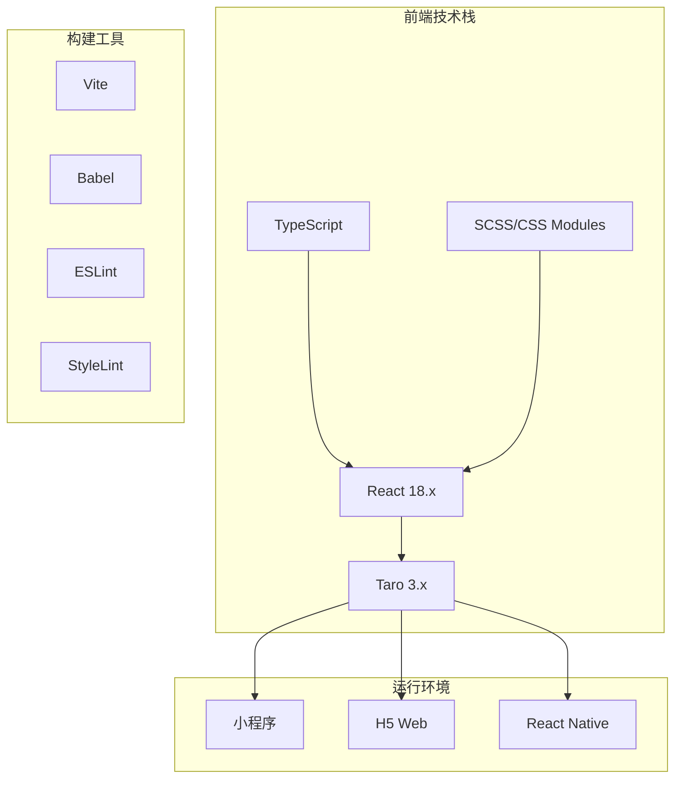

**图表来源**
- [frontend/src/app.ts](file://frontend/src/app.ts#L1-L17)
- [frontend/babel.config.js](file://babel.config.js#L1-L11)

### 项目结构

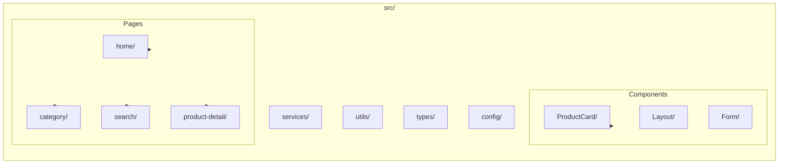

**章节来源**
- [frontend/src/app.config.ts](file://frontend/src/app.config.ts#L1-L50)

## 组件化设计原则

### 设计理念

项目采用以下核心设计原则：

1. **单一职责**：每个组件只负责一个特定功能
2. **可复用性**：组件可以在不同页面中重复使用
3. **可扩展性**：支持通过props进行功能扩展
4. **一致性**：保持统一的API设计和交互模式

### 组件分类

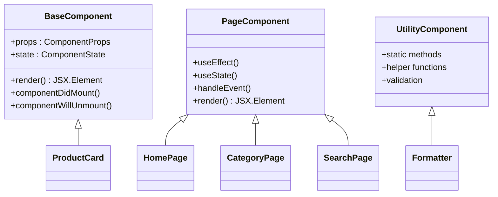

**图表来源**
- [frontend/src/components/ProductCard/index.tsx](file://frontend/src/components/ProductCard/index.tsx#L1-L85)
- [frontend/src/pages/home/index.tsx](file://frontend/src/pages/home/index.tsx#L1-L225)

## ProductCard核心组件

### 组件结构分析

ProductCard是项目中最核心的基础组件，作为商品展示卡片，在首页、分类页和搜索页中广泛使用。

#### 组件接口设计

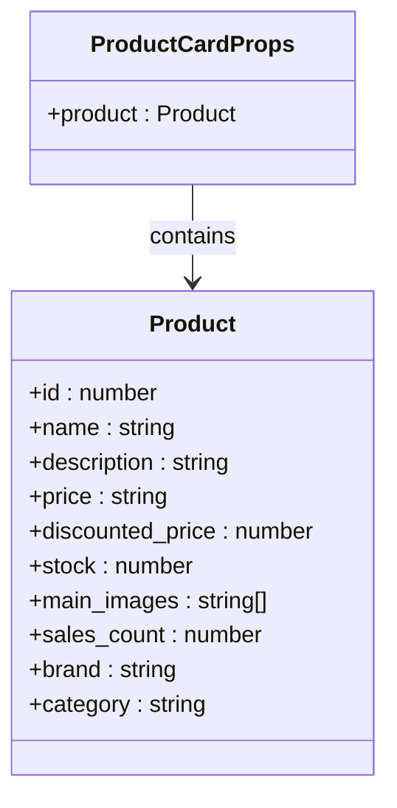

**图表来源**
- [frontend/src/components/ProductCard/index.tsx](file://frontend/src/components/ProductCard/index.tsx#L7-L9)
- [frontend/src/types/index.ts](file://frontend/src/types/index.ts#L20-L39)

#### 核心功能实现

ProductCard组件实现了以下核心功能：

1. **价格计算**：自动计算折扣百分比
2. **库存状态**：显示库存警告或售罄状态
3. **图片展示**：支持占位符和懒加载
4. **交互行为**：点击跳转到商品详情页

#### 组件生命周期

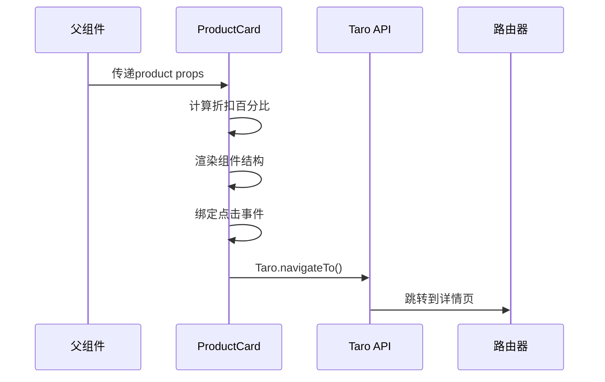

**图表来源**
- [frontend/src/components/ProductCard/index.tsx](file://frontend/src/components/ProductCard/index.tsx#L23-L26)

**章节来源**
- [frontend/src/components/ProductCard/index.tsx](file://frontend/src/components/ProductCard/index.tsx#L1-L85)
- [frontend/src/components/ProductCard/index.scss](file://frontend/src/components/ProductCard/index.scss#L1-L158)

### 样式系统设计

ProductCard采用了完整的样式系统，包括：

- **响应式布局**：使用rpx单位确保在不同设备上正确显示
- **视觉层次**：通过字体大小和颜色区分重要信息
- **交互反馈**：点击效果和悬停状态
- **状态指示**：库存状态和折扣标签的视觉设计

## 页面级组件架构

### 首页组件结构

首页是应用的核心入口，展示了轮播图、分类导航、品牌专区和商品列表等功能模块。

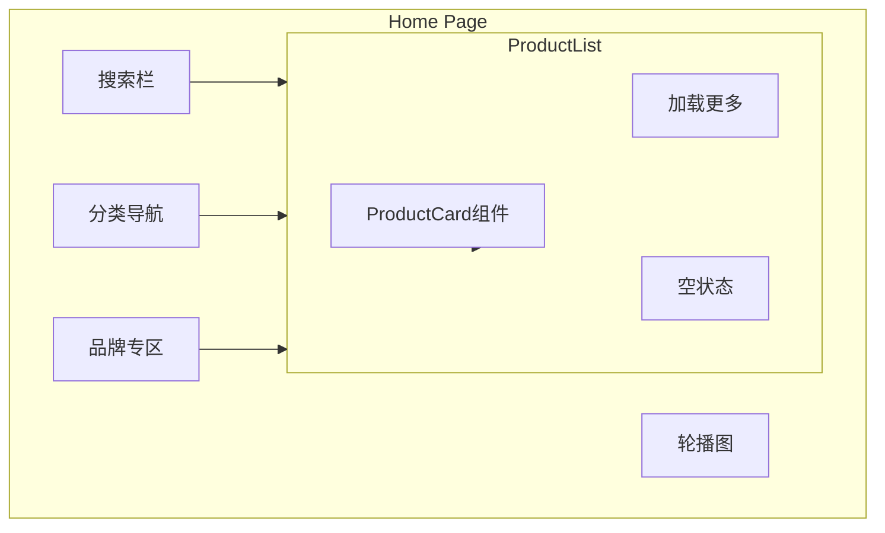

**图表来源**
- [frontend/src/pages/home/index.tsx](file://frontend/src/pages/home/index.tsx#L122-L222)

### 分类页组件结构

分类页专注于商品分类浏览，提供了分类筛选和排序功能。

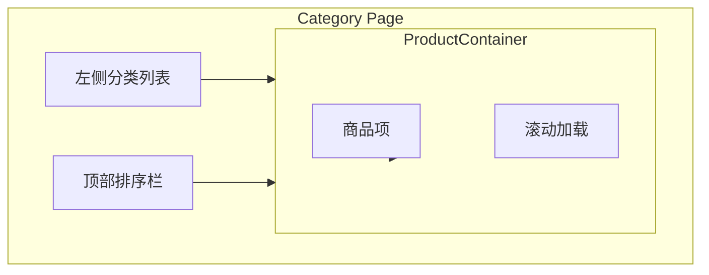

**图表来源**
- [frontend/src/pages/category/index.tsx](file://frontend/src/pages/category/index.tsx#L103-L169)

### 搜索页组件结构

搜索页实现了关键词搜索功能，支持实时搜索和结果分页。

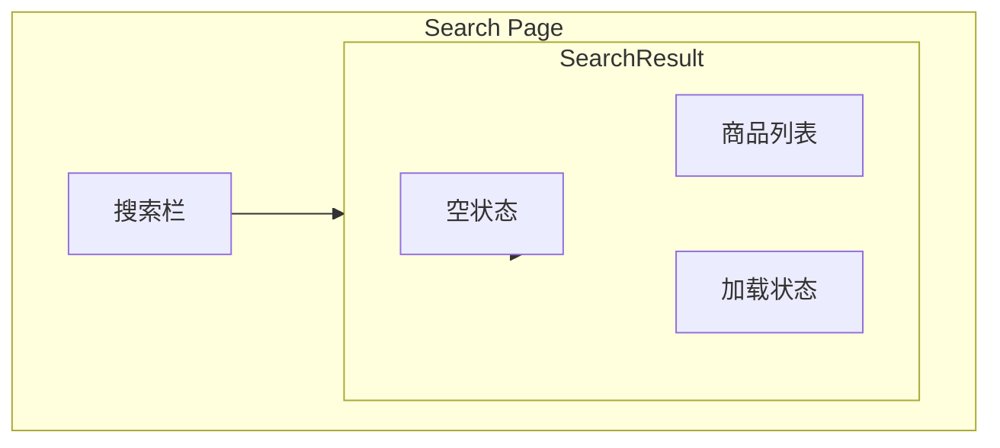

**图表来源**
- [frontend/src/pages/search/index.tsx](file://frontend/src/pages/search/index.tsx#L65-L113)

**章节来源**
- [frontend/src/pages/home/index.tsx](file://frontend/src/pages/home/index.tsx#L1-L225)
- [frontend/src/pages/category/index.tsx](file://frontend/src/pages/category/index.tsx#L1-L171)
- [frontend/src/pages/search/index.tsx](file://frontend/src/pages/search/index.tsx#L1-L114)

## 跨平台兼容性

### Taro框架特性

Taro提供了完整的跨平台解决方案，通过以下机制实现多端兼容：

1. **组件映射**：将React组件映射到不同平台的原生组件
2. **API统一**：提供统一的API接口
3. **样式适配**：自动处理不同平台的样式差异

### 平台特定处理

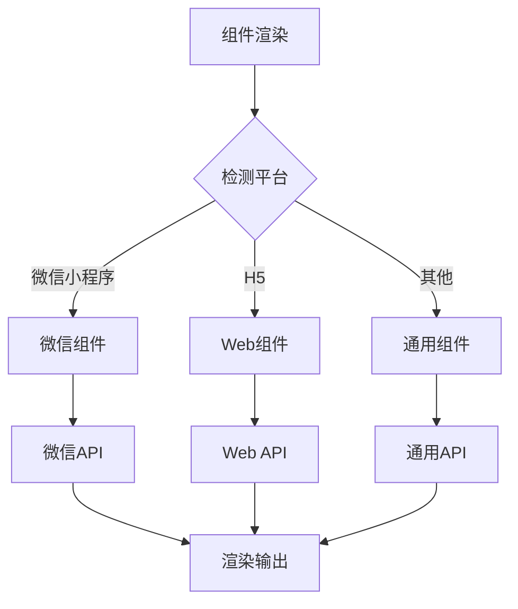

### 多端API使用示例

项目中使用了多种Taro提供的跨平台API：

- **路由导航**：`Taro.navigateTo()`、`Taro.switchTab()`
- **事件中心**：`Taro.eventCenter`用于页面间通信
- **存储**：`Taro.setStorage()`、`Taro.getStorage()`
- **网络请求**：`Taro.request()`封装为HTTP服务

**章节来源**
- [frontend/src/app.ts](file://frontend/src/app.ts#L1-L17)
- [frontend/src/app.config.ts](file://frontend/src/app.config.ts#L1-L50)

## 性能优化策略

### 列表渲染优化

项目在大量数据渲染场景中采用了多种优化策略：

#### 虚拟滚动

对于长列表，可以考虑实现虚拟滚动来提升性能：

```typescript
// 虚拟滚动伪代码示例
const VirtualList = ({ items, itemHeight, overscan = 5 }) => {
  const [visibleItems, setVisibleItems] = useState([])
  
  // 计算可见区域的item索引范围
  const calculateVisibleRange = (scrollTop, containerHeight) => {
    const startIndex = Math.floor(scrollTop / itemHeight)
    const endIndex = Math.min(
      startIndex + Math.ceil(containerHeight / itemHeight) + overscan,
      items.length
    )
    return [startIndex, endIndex]
  }
  
  return (
    <div style={{ height: containerHeight, overflow: 'auto' }}>
      <div style={{ height: items.length * itemHeight }}>
        {visibleItems.map(item => (
          <div style={{ height: itemHeight }}>{item}</div>
        ))}
      </div>
    </div>
  )
}
```

#### 懒加载优化

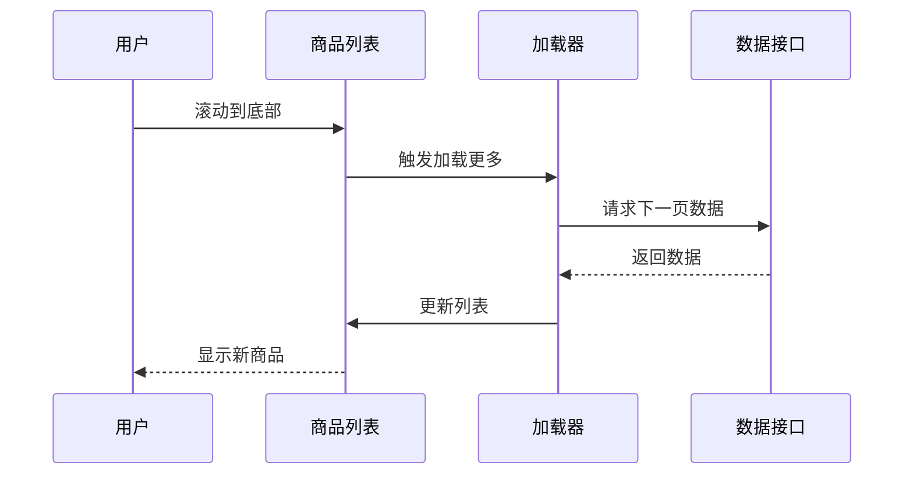

### 内存管理

1. **组件卸载清理**：及时清理事件监听器和定时器
2. **状态重置**：页面切换时重置不必要的状态
3. **缓存策略**：合理使用本地缓存减少网络请求

### 图片优化

- **懒加载**：图片组件支持懒加载
- **格式转换**：使用现代图片格式（WebP）
- **尺寸控制**：根据设备像素比调整图片尺寸

## 样式系统与主题

### CSS架构设计

项目采用了模块化的CSS架构：

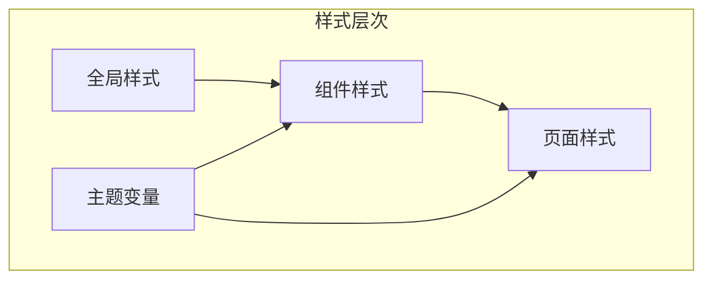

### 响应式设计

使用rpx单位实现响应式布局：

- **移动端适配**：基于iPhone6/7/8的375px宽度
- **动态计算**：自动适配不同屏幕密度
- **断点设计**：针对不同屏幕尺寸优化布局

### 主题系统

```scss
// 主题变量示例
$primary-color: #1989FA;
$secondary-color: #FF6034;
$background-color: #F7F8FA;
$text-color-primary: #323233;
$text-color-secondary: #969799;
$border-radius: 12rpx;
```

**章节来源**
- [frontend/src/pages/home/index.scss](file://frontend/src/pages/home/index.scss#L1-L223)

## 事件处理与状态管理

### 事件冒泡处理

项目中妥善处理了事件冒泡问题：

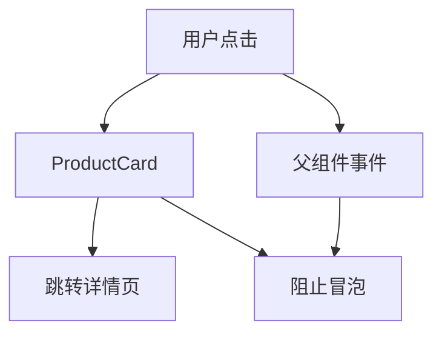

### 状态管理模式

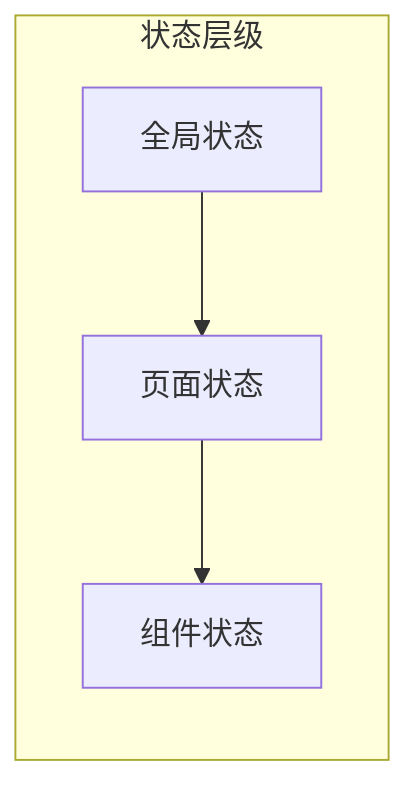

### 事件中心通信

使用Taro的事件中心实现页面间通信：

```typescript
// 发送事件
Taro.eventCenter.trigger('selectCategory', category)

// 监听事件
const listener = Taro.eventCenter.on('selectCategory', (category) => {
  // 处理事件
})

// 清理监听器
useEffect(() => {
  return () => {
    Taro.eventCenter.off('selectCategory', listener)
  }
}, [])
```

**章节来源**
- [frontend/src/pages/category/index.tsx](file://frontend/src/pages/category/index.tsx#L21-L28)

## 常见问题与解决方案

### 样式隔离问题

#### 问题描述
在小程序环境中，样式可能会出现意外的全局污染。

#### 解决方案
1. **使用scoped样式**：确保组件样式不会影响其他组件
2. **命名规范**：采用BEM或类似的命名规范
3. **深度选择器**：使用深度选择器限制样式作用范围

```scss
// 使用深度选择器
.product-card {
  ::v-deep(.product-image) {
    // 样式规则
  }
}
```

### 性能问题

#### 列表渲染性能

**问题**：大量商品列表导致页面卡顿

**解决方案**：
1. **虚拟滚动**：只渲染可视区域的商品
2. **防抖处理**：对滚动事件进行防抖
3. **图片懒加载**：延迟加载非首屏图片

#### 内存泄漏

**问题**：页面切换时内存持续增长

**解决方案**：
1. **清理定时器**：在组件卸载时清理所有定时器
2. **移除事件监听**：及时移除不需要的事件监听器
3. **重置状态**：页面离开时重置不必要的状态

### 跨平台兼容性问题

#### 平台差异处理

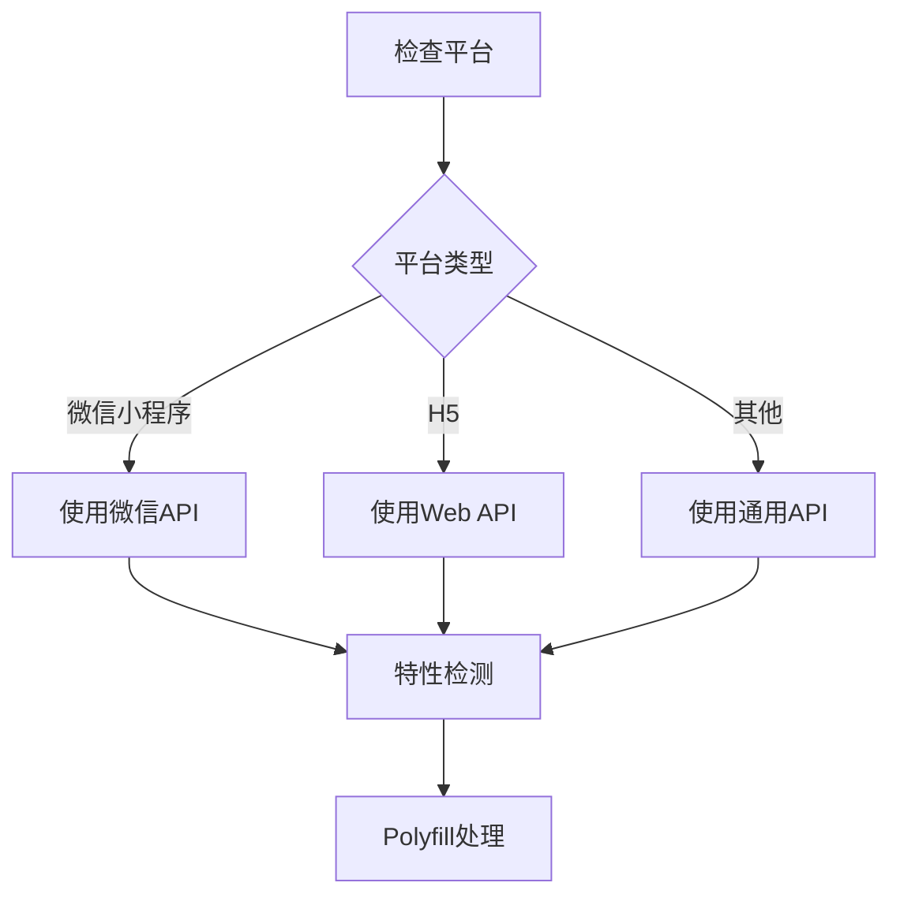

#### 常见兼容性问题

1. **API差异**：不同平台API实现差异
2. **样式表现**：CSS属性在不同平台的表现差异
3. **事件处理**：触摸事件和鼠标事件的处理差异

### 数据格式问题

#### 类型安全

使用TypeScript确保数据类型的正确性：

```typescript
// 定义严格的接口
interface Product {
  id: number
  name: string
  price: string
  main_images: string[]
  // 其他字段...
}

// 使用类型检查
const formattedPrice = formatPrice(product.price) // 确保price是字符串
```

## 最佳实践指南

### 组件设计原则

1. **Props设计**
   - 使用TypeScript定义明确的Props接口
   - 提供合理的默认值
   - 支持可选和必需属性

2. **状态管理**
   - 将状态提升到合适的层级
   - 避免过度的状态分散
   - 使用状态管理库处理复杂状态

3. **错误处理**
   - 实现完善的错误边界
   - 提供友好的错误提示
   - 记录错误日志便于调试

### 代码组织

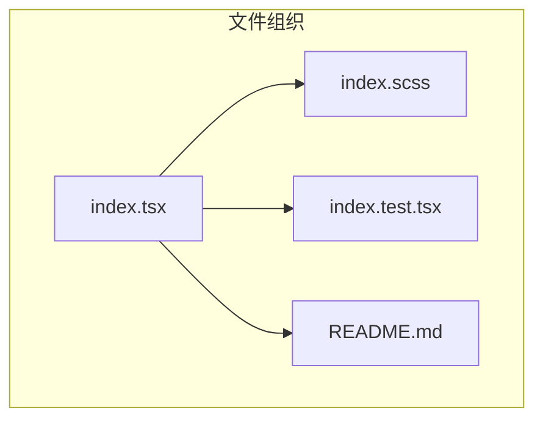

### 测试策略

1. **单元测试**：测试组件的核心逻辑
2. **集成测试**：测试组件间的交互
3. **端到端测试**：测试完整的用户流程

### 开发工具

1. **代码检查**：ESLint + Prettier
2. **类型检查**：TypeScript
3. **样式检查**：StyleLint
4. **提交规范**：Commitlint

### 部署优化

1. **代码分割**：按路由分割代码
2. **资源压缩**：压缩JS、CSS、图片
3. **CDN部署**：静态资源使用CDN
4. **缓存策略**：合理设置缓存头

通过遵循这些最佳实践，可以构建出高质量、高性能、易于维护的跨平台小程序应用。