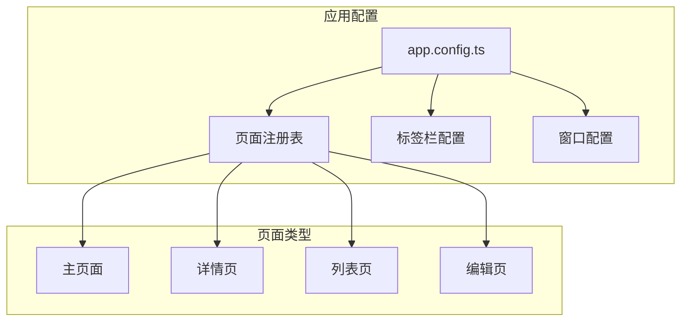
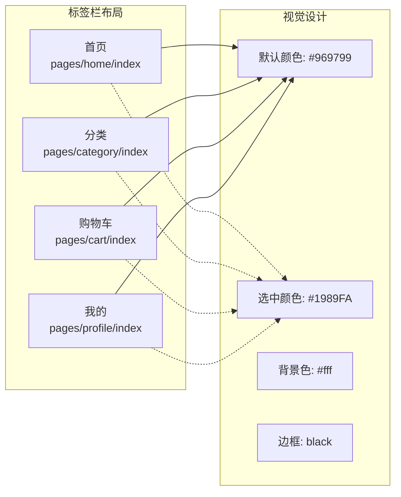
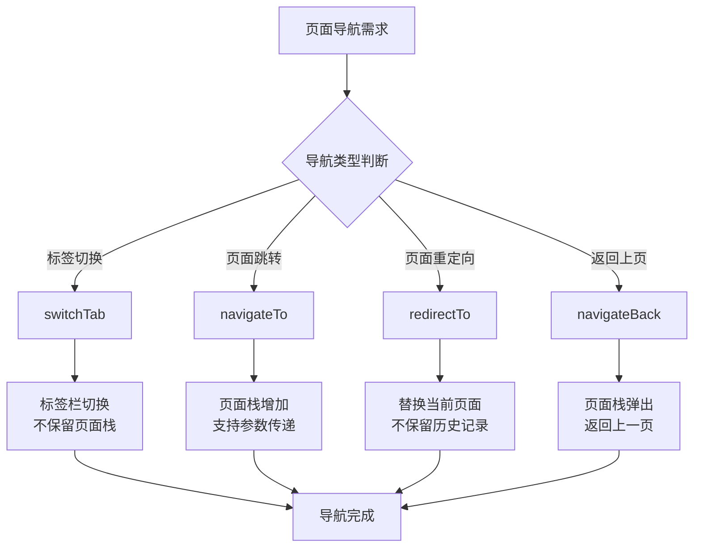
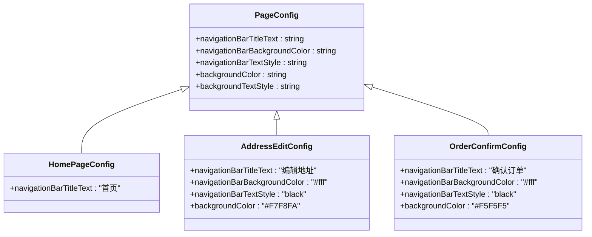
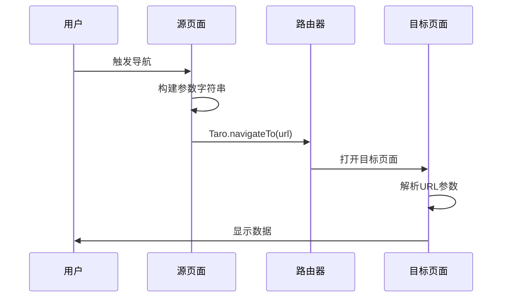
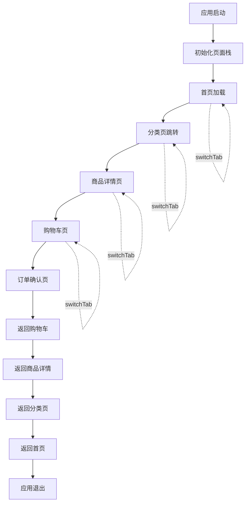
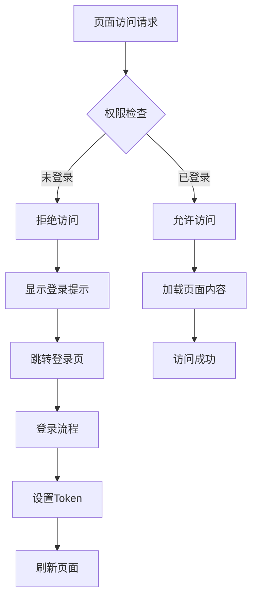

# 路由与导航

<cite>
**本文档引用的文件**
- [app.config.ts](file://frontend/src/app.config.ts)
- [index.config.ts](file://frontend/src/pages/index/index.config.ts)
- [address-edit/index.config.ts](file://frontend/src/pages/address-edit/index.config.ts)
- [order-confirm/index.config.ts](file://frontend/src/pages/order-confirm/index.config.ts)
- [cart/index.tsx](file://frontend/src/pages/cart/index.tsx)
- [order-confirm/index.tsx](file://frontend/src/pages/order-confirm/index.tsx)
- [profile/index.tsx](file://frontend/src/pages/profile/index.tsx)
- [home/index.tsx](file://frontend/src/pages/home/index.tsx)
- [category/index.tsx](file://frontend/src/pages/category/index.tsx)
- [search/index.tsx](file://frontend/src/pages/search/index.tsx)
- [product-detail/index.tsx](file://frontend/src/pages/product-detail/index.tsx)
- [auth.ts](file://frontend/src/services/auth.ts)
- [request.ts](file://frontend/src/utils/request.ts)
- [types/index.ts](file://frontend/src/types/index.ts)
</cite>

## 目录
1. [项目概述](#项目概述)
2. [路由配置架构](#路由配置架构)
3. [页面注册机制](#页面注册机制)
4. [标签栏导航](#标签栏导航)
5. [页面路径映射](#页面路径映射)
6. [路由API详解](#路由api详解)
7. [自定义导航栏配置](#自定义导航栏配置)
8. [路由传参机制](#路由传参机制)
9. [页面栈管理](#页面栈管理)
10. [路由权限控制](#路由权限控制)
11. [最佳实践指南](#最佳实践指南)
12. [故障排除](#故障排除)

## 项目概述

本项目是一个基于Taro框架开发的小程序电商应用，采用模块化的路由架构设计。整个应用包含14个主要页面，支持完整的电商功能流程，包括商品浏览、购物车管理、订单处理、用户中心等核心业务模块。

## 路由配置架构

### 应用级路由配置

应用的核心路由配置位于`app.config.ts`文件中，采用声明式配置方式定义页面结构和导航行为。



**图表来源**
- [app.config.ts](file://frontend/src/app.config.ts#L1-L50)

### 页面注册表结构

应用注册了14个页面，涵盖了完整的电商功能链：

| 页面路径 | 功能描述 | 导航类型 |
|---------|---------|---------|
| pages/home/index | 首页 | 主标签页 |
| pages/category/index | 分类页 | 主标签页 |
| pages/cart/index | 购物车 | 主标签页 |
| pages/profile/index | 我的 | 主标签页 |
| pages/product-detail/index | 商品详情 | 内部导航 |
| pages/order-list/index | 订单列表 | 内部导航 |
| pages/order-confirm/index | 订单确认 | 内部导航 |
| pages/order-detail/index | 订单详情 | 内部导航 |
| pages/address-list/index | 地址列表 | 内部导航 |
| pages/address-edit/index | 地址编辑 | 内部导航 |
| pages/profile-edit/index | 个人信息编辑 | 内部导航 |
| pages/search/index | 搜索页 | 内部导航 |
| pages/brand/index | 品牌页 | 内部导航 |
| pages/api-test/index | API测试 | 开发工具 |

**章节来源**
- [app.config.ts](file://frontend/src/app.config.ts#L2-L16)

## 页面注册机制

### pages数组配置

`app.config.ts`中的`pages`数组定义了应用的所有可访问页面。每个页面路径遵循特定的命名规范：

- **格式规范**：`pages/[模块名]/index`
- **模块命名**：使用小写字母和连字符分隔单词
- **文件结构**：每个页面对应一个目录，包含`index.tsx`、`index.config.ts`和样式文件

### 页面加载优先级

页面按照注册顺序决定加载优先级和内存占用。建议将高频访问的页面放在前面，低频页面放在后面。

**章节来源**
- [app.config.ts](file://frontend/src/app.config.ts#L2-L16)

## 标签栏导航

### tabBar配置详解

应用配置了四个主标签页，提供核心功能导航：



**图表来源**
- [app.config.ts](file://frontend/src/app.config.ts#L25-L48)

### 标签页特性

| 特性 | 配置值 | 说明 |
|-----|-------|------|
| 默认文字颜色 | #969799 | 未选中状态的文字颜色 |
| 选中文字颜色 | #1989FA | 选中状态的文字颜色 |
| 背景颜色 | #fff | 标签栏背景色 |
| 边框样式 | black | 标签栏边框颜色 |
| 页面路径 | 相对路径 | 对应的页面路径 |

**章节来源**
- [app.config.ts](file://frontend/src/app.config.ts#L25-L48)

## 页面路径映射

### 文件系统映射关系

小程序的页面路径与文件系统存在直接映射关系：

| 页面路径 | 实际文件位置 | 用途说明 |
|---------|-------------|---------|
| pages/home/index | frontend/src/pages/home/index.tsx | 首页主页面 |
| pages/category/index | frontend/src/pages/category/index.tsx | 商品分类页面 |
| pages/cart/index | frontend/src/pages/cart/index.tsx | 购物车管理页面 |
| pages/profile/index | frontend/src/pages/profile/index.tsx | 用户个人中心 |
| pages/product-detail/index | frontend/src/pages/product-detail/index.tsx | 商品详情展示 |
| pages/order-confirm/index | frontend/src/pages/order-confirm/index.tsx | 订单确认页面 |
| pages/address-edit/index | frontend/src/pages/address-edit/index.tsx | 地址编辑页面 |

### 路径解析规则

1. **相对路径**：以`pages/`开头，相对于项目根目录
2. **文件扩展名**：自动解析`.tsx`、`.scss`、`.config.ts`等文件
3. **默认入口**：每个页面目录下的`index`文件作为默认入口

**章节来源**
- [app.config.ts](file://frontend/src/app.config.ts#L3-L15)

## 路由API详解

### Taro路由API分类

应用使用三种主要的路由API实现不同的导航场景：



### 具体API使用场景

#### 1. switchTab - 标签页切换

用于在主标签页之间切换，不保留页面栈历史：

- **使用场景**：首页、分类、购物车、我的页面间的切换
- **特点**：清空当前页面栈，打开新的标签页
- **示例代码路径**：[cart/index.tsx](file://frontend/src/pages/cart/index.tsx#L182-L183)，[home/index.tsx](file://frontend/src/pages/home/index.tsx#L112)，[product-detail/index.tsx](file://frontend/src/pages/product-detail/index.tsx#L235-L246)

#### 2. navigateTo - 页面跳转

用于进入新的页面，保留页面栈以便返回：

- **使用场景**：商品详情、订单确认、地址管理等
- **特点**：页面栈增加，支持深度导航
- **示例代码路径**：[cart/index.tsx](file://frontend/src/pages/cart/index.tsx#L171-L173)，[home/index.tsx](file://frontend/src/pages/home/index.tsx#L107)，[profile/index.tsx](file://frontend/src/pages/profile/index.tsx#L65-L90)

#### 3. redirectTo - 页面重定向

用于替换当前页面，不保留返回路径：

- **使用场景**：订单创建成功后的页面跳转
- **特点**：替换当前页面，无法返回
- **示例代码路径**：[order-confirm/index.tsx](file://frontend/src/pages/order-confirm/index.tsx#L138-L140)

#### 4. navigateBack - 返回上页

用于返回到上一个页面：

- **使用场景**：商品详情页的返回操作
- **特点**：页面栈弹出，返回上一页
- **示例代码路径**：[product-detail/index.tsx](file://frontend/src/pages/product-detail/index.tsx#L113)

**章节来源**
- [cart/index.tsx](file://frontend/src/pages/cart/index.tsx#L171-L183)
- [home/index.tsx](file://frontend/src/pages/home/index.tsx#L107-L120)
- [order-confirm/index.tsx](file://frontend/src/pages/order-confirm/index.tsx#L138-L140)
- [product-detail/index.tsx](file://frontend/src/pages/product-detail/index.tsx#L113)

## 自定义导航栏配置

### 页面配置文件结构

每个页面都可以通过`index.config.ts`文件自定义导航栏外观：



**图表来源**
- [index.config.ts](file://frontend/src/pages/index/index.config.ts#L1-L4)
- [address-edit/index.config.ts](file://frontend/src/pages/address-edit/index.config.ts#L1-L7)
- [order-confirm/index.config.ts](file://frontend/src/pages/order-confirm/index.config.ts#L1-L7)

### 导航栏配置选项

| 配置项 | 类型 | 默认值 | 说明 |
|-------|------|--------|------|
| navigationBarTitleText | string | "" | 导航栏标题文字 |
| navigationBarBackgroundColor | string | #F8F8F8 | 导航栏背景颜色 |
| navigationBarTextStyle | string | white | 导航栏文字样式（black/white） |
| backgroundColor | string | #ffffff | 页面背景颜色 |
| backgroundTextStyle | string | dark | 下拉背景字体样式（dark/light） |

### 页面配置示例

#### 首页配置
- 标题："首页"
- 背景色：默认
- 文字样式：默认

#### 地址编辑页面配置
- 标题："编辑地址"
- 导航栏背景：白色 (#fff)
- 文字颜色：黑色 (black)
- 页面背景：浅灰色 (#F7F8FA)

#### 订单确认页面配置
- 标题："确认订单"
- 导航栏背景：白色 (#fff)
- 文字颜色：黑色 (black)
- 页面背景：浅灰 (#F5F5F5)

**章节来源**
- [index.config.ts](file://frontend/src/pages/index/index.config.ts#L1-L4)
- [address-edit/index.config.ts](file://frontend/src/pages/address-edit/index.config.ts#L1-L7)
- [order-confirm/index.config.ts](file://frontend/src/pages/order-confirm/index.config.ts#L1-L7)

## 路由传参机制

### URL参数传递

应用使用多种方式传递页面参数：



**图表来源**
- [cart/index.tsx](file://frontend/src/pages/cart/index.tsx#L163-L173)
- [order-confirm/index.tsx](file://frontend/src/pages/order-confirm/index.tsx#L25-L35)

### 参数传递方式

#### 1. 简单参数传递

适用于单个简单参数：
- **格式**：`?key=value`
- **示例**：`/pages/search/index?keyword=手机`
- **解析**：通过`Taro.getCurrentInstance().router.params.keyword`

#### 2. 复杂对象序列化传递

适用于复杂数据结构：
- **格式**：`?items=[serialized_data]`
- **示例**：`/pages/order-confirm/index?items=%5B%7B%22product_id%22%3A1%2C%22quantity%22%3A2%7D%5D&fromCart=true`
- **解析**：`JSON.parse(decodeURIComponent(params.items))`

#### 3. 条件参数传递

根据业务逻辑动态添加参数：
- **示例**：`/pages/order-list/index?status=pending`
- **用途**：筛选不同状态的订单

### 参数接收与解析

目标页面通过以下方式获取参数：

```typescript
// 参数接收示例
const instance = Taro.getCurrentInstance()
const params = instance.router?.params || {}
```

**章节来源**
- [cart/index.tsx](file://frontend/src/pages/cart/index.tsx#L163-L173)
- [order-confirm/index.tsx](file://frontend/src/pages/order-confirm/index.tsx#L25-L35)
- [search/index.tsx](file://frontend/src/pages/search/index.tsx#L17-L22)

## 页面栈管理

### 页面栈生命周期

小程序的页面栈管理遵循先进后出的原则：



### 页面栈操作策略

#### 1. 页面栈增长场景
- **navigateTo**：页面跳转时增加页面栈
- **适用场景**：商品详情、订单流程、设置页面等

#### 2. 页面栈替换场景
- **redirectTo**：替换当前页面
- **适用场景**：订单创建成功后的页面跳转

#### 3. 页面栈回退场景
- **navigateBack**：返回上一页
- **适用场景**：取消操作、返回按钮

#### 4. 标签页切换场景
- **switchTab**：清空页面栈，打开新标签页
- **适用场景**：首页、分类、购物车、我的页面间切换

### 页面栈监控

应用通过事件总线实现页面栈状态的全局管理：

- **事件监听**：监听用户登录/登出事件
- **状态同步**：确保各页面状态一致性
- **权限验证**：基于用户状态控制页面访问

**章节来源**
- [cart/index.tsx](file://frontend/src/pages/cart/index.tsx#L17-L51)
- [profile/index.tsx](file://frontend/src/pages/profile/index.tsx#L28-L62)

## 路由权限控制

### 权限控制架构

应用实现了基于Token的权限控制系统：



**图表来源**
- [request.ts](file://frontend/src/utils/request.ts#L93-L104)
- [cart/index.tsx](file://frontend/src/pages/cart/index.tsx#L190-L200)
- [profile/index.tsx](file://frontend/src/pages/profile/index.tsx#L65-L90)

### 权限控制实现

#### 1. Token管理

通过`TokenManager`类统一管理认证Token：

- **存储方式**：本地存储（Taro.getStorageSync）
- **Token类型**：访问令牌（access_token）和刷新令牌（refresh_token）
- **自动刷新**：401错误时自动尝试刷新

#### 2. 页面级权限控制

部分页面需要登录才能访问：

- **检查条件**：`TokenManager.getAccessToken()`
- **未登录处理**：显示登录提示，跳转到"我的"页面
- **登录后恢复**：触发用户登录事件，重新加载页面数据

#### 3. API级权限控制

所有API请求都自动携带认证信息：

- **请求头**：`Authorization: Bearer <token>`
- **自动重试**：Token过期时自动刷新并重试
- **强制登出**：刷新失败时清除Token并跳转登录页

### 权限控制最佳实践

#### 1. 页面级保护
```typescript
// 检查登录状态
if (!TokenManager.getAccessToken()) {
  Taro.showToast({ title: '请先登录', icon: 'none' })
  return
}
```

#### 2. API级保护
```typescript
// 自动处理认证
const header = {}
if (needAuth) {
  const token = TokenManager.getAccessToken()
  if (token) {
    header['Authorization'] = `Bearer ${token}`
  }
}
```

#### 3. 状态同步
```typescript
// 登录成功后通知其他页面
Taro.eventCenter.trigger('userLogin')

// 登出时清理状态
Taro.eventCenter.trigger('userLogout')
```

**章节来源**
- [request.ts](file://frontend/src/utils/request.ts#L93-L104)
- [cart/index.tsx](file://frontend/src/pages/cart/index.tsx#L190-L200)
- [profile/index.tsx](file://frontend/src/pages/profile/index.tsx#L65-L90)

## 最佳实践指南

### 路由设计原则

#### 1. 路径命名规范
- 使用小写字母和连字符
- 语义化命名，清晰表达页面功能
- 避免过长的路径名称

#### 2. 页面组织结构
- 按功能模块组织页面
- 合理安排页面加载顺序
- 避免过多的深层嵌套

#### 3. 参数传递策略
- 简单参数使用URL查询字符串
- 复杂数据使用JSON序列化
- 必要时进行参数校验

### 性能优化建议

#### 1. 页面懒加载
- 非首屏页面按需加载
- 图片资源延迟加载
- 数据分页加载

#### 2. 缓存策略
- 合理使用本地缓存
- 设置合适的缓存过期时间
- 清理过期缓存数据

#### 3. 网络优化
- 减少不必要的API调用
- 使用请求去重机制
- 实现离线缓存策略

### 错误处理策略

#### 1. 路由错误处理
- 页面加载失败时提供友好的错误提示
- 网络异常时提供重试机制
- 参数错误时进行验证和修正

#### 2. 权限错误处理
- Token过期时自动刷新
- 权限不足时引导用户登录
- 异常情况下的优雅降级

## 故障排除

### 常见问题及解决方案

#### 1. 页面无法跳转
**症状**：调用路由API后页面无反应
**可能原因**：
- 页面路径配置错误
- 目标页面未在pages数组中注册
- 路由参数格式不正确

**解决方法**：
- 检查app.config.ts中的pages配置
- 验证页面路径的拼写和格式
- 确认参数编码正确

#### 2. 参数传递失败
**症状**：目标页面无法获取传递的参数
**可能原因**：
- 参数未正确编码
- 目标页面未正确解析参数
- 参数类型不匹配

**解决方法**：
- 使用encodeURIComponent编码参数
- 在目标页面使用getCurrentInstance获取参数
- 确认参数类型和格式

#### 3. 权限控制失效
**症状**：未登录用户可以访问受保护页面
**可能原因**：
- 权限检查逻辑缺失
- Token管理异常
- 页面状态未正确同步

**解决方法**：
- 在页面入口添加权限检查
- 检查TokenManager的实现
- 确保事件总线正常工作

#### 4. 页面栈混乱
**症状**：页面返回顺序错误或无法返回
**可能原因**：
- 路由API使用不当
- 页面栈管理逻辑错误
- 异步操作导致状态不一致

**解决方法**：
- 正确使用navigateTo、redirectTo、navigateBack
- 理解页面栈的工作原理
- 确保异步操作的正确处理

### 调试技巧

#### 1. 路由调试
```typescript
// 调试路由参数
console.log('Current route:', Taro.getCurrentInstance())
console.log('Route params:', Taro.getCurrentInstance().router?.params)
```

#### 2. 权限调试
```typescript
// 调试Token状态
console.log('Access token:', TokenManager.getAccessToken())
console.log('Refresh token:', TokenManager.getRefreshToken())
```

#### 3. 页面栈调试
```typescript
// 调试页面栈
console.log('Page stack:', Taro.getCurrentPages())
```

通过以上详细的路由与导航机制文档，开发者可以全面理解本项目的路由架构设计，掌握各种路由API的使用方法，并能够根据业务需求进行合理的路由规划和权限控制实现。