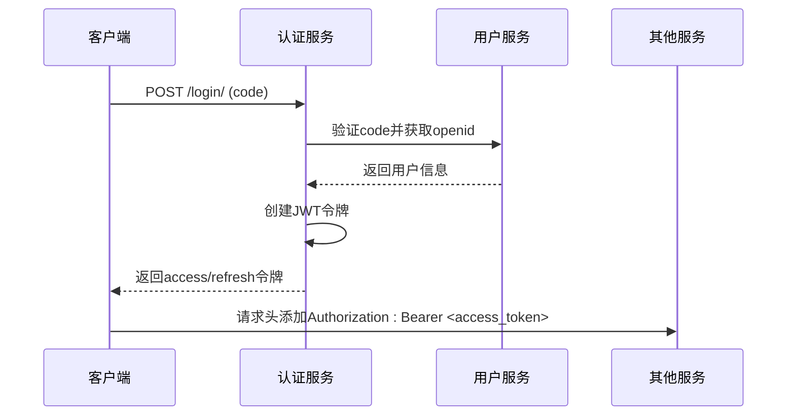
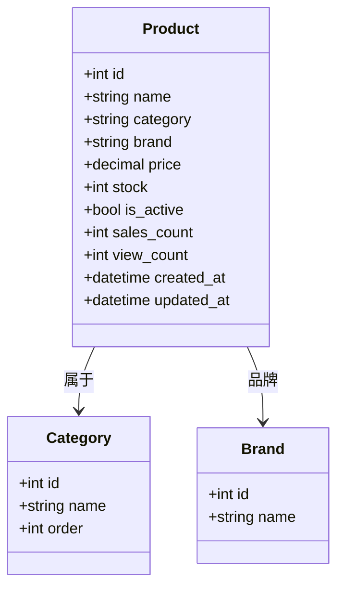
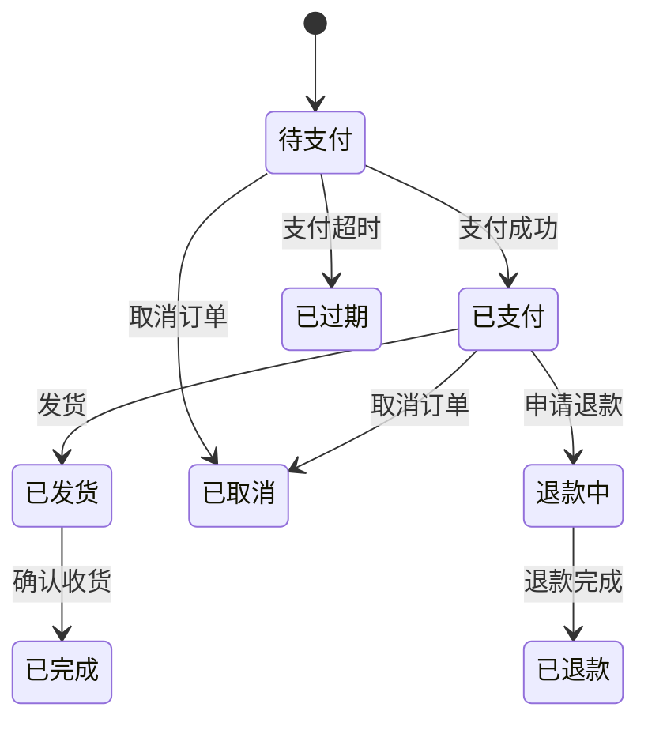
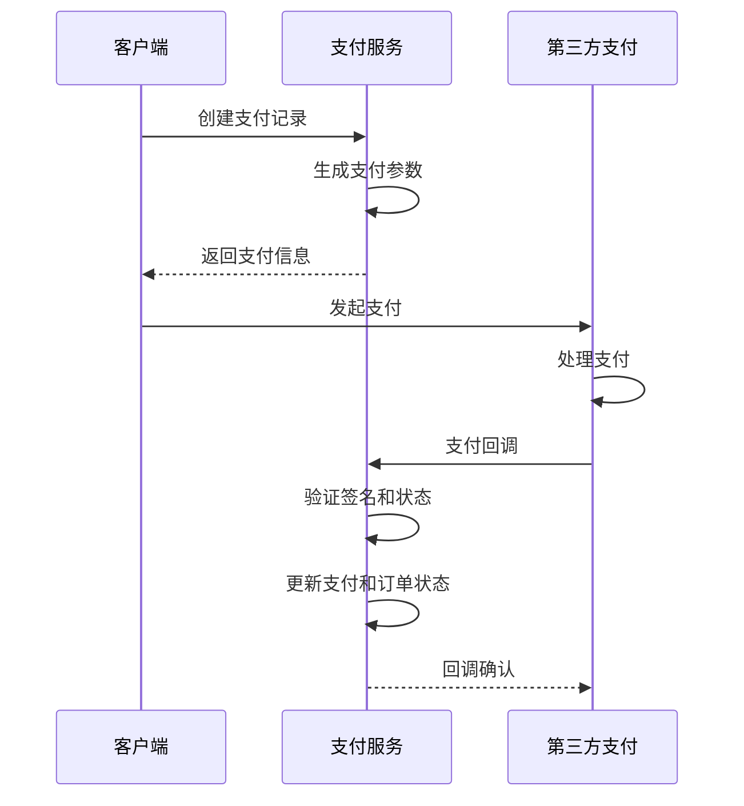
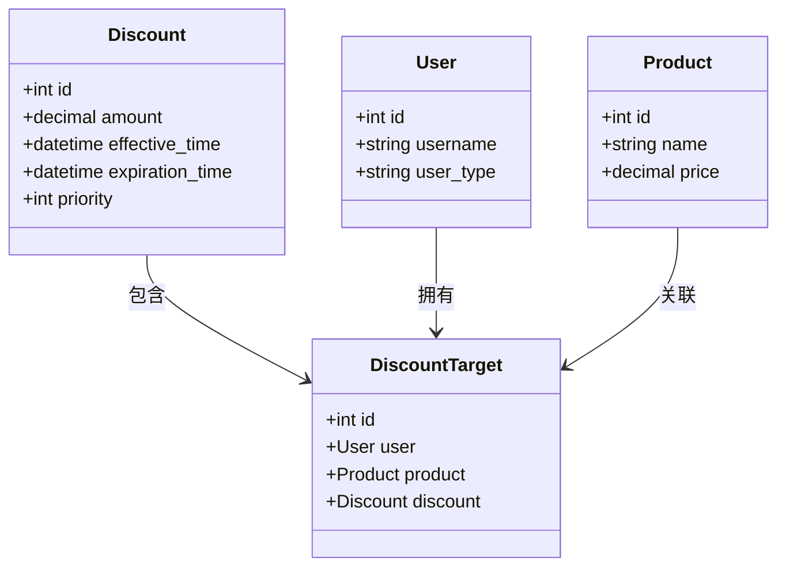
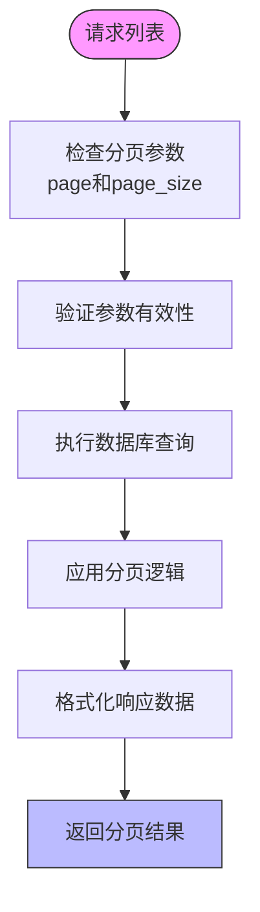
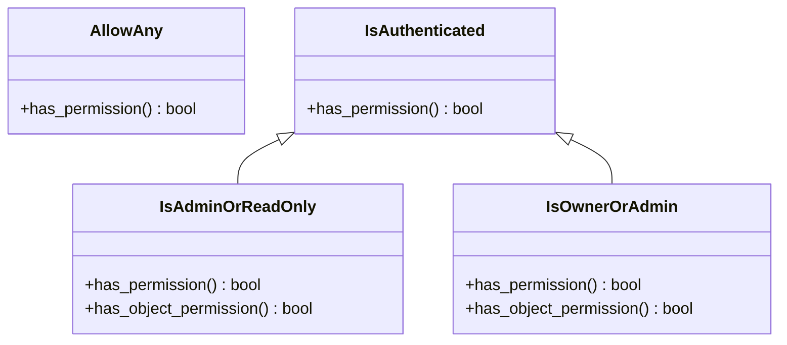

# API端点

<cite>
**本文档引用的文件**   
- [api.md](file://api.md)
- [backend/urls.py](file://backend/backend/urls.py)
- [catalog/views.py](file://backend/catalog/views.py)
- [users/views.py](file://backend/users/views.py)
- [orders/views.py](file://backend/orders/views.py)
- [common/pagination.py](file://backend/common/pagination.py)
- [common/throttles.py](file://backend/common/throttles.py)
- [common/permissions.py](file://backend/common/permissions.py)
- [orders/urls.py](file://backend/orders/urls.py)
- [users/urls.py](file://backend/users/urls.py)
- [catalog/urls.py](file://backend/catalog/urls.py)
- [integrations/urls.py](file://backend/integrations/urls.py)
- [orders/models.py](file://backend/orders/models.py)
- [users/models.py](file://backend/users/models.py)
- [orders/payment_service.py](file://backend/orders/payment_service.py)
</cite>

## 目录
1. [简介](#简介)
2. [用户认证](#用户认证)
3. [商品管理](#商品管理)
4. [订单处理](#订单处理)
5. [支付集成](#支付集成)
6. [折扣系统](#折扣系统)
7. [分页机制](#分页机制)
8. [限流配置](#限流配置)
9. [权限控制](#权限控制)
10. [错误处理](#错误处理)

## 简介
本文档详细介绍了基于Django REST Framework实现的RESTful API端点，涵盖了用户认证、商品管理、订单处理、支付集成和折扣系统等80多个端点的设计与使用。文档以api.md中的端点列表为基础，结合views.py中的视图逻辑，提供了详细的HTTP方法、URL模式、请求参数、响应格式、认证要求和权限控制说明。

**Section sources**
- [api.md](file://api.md#L1-L1215)

## 用户认证
API提供了多种用户认证方式，主要基于JWT（JSON Web Token）实现。系统支持微信小程序用户和管理员用户的双认证体系。

### JWT认证流程
登录接口实现了完整的JWT认证流程，包括令牌获取、使用和刷新。用户通过`/login/`或`/admin/login/`接口获取`access`和`refresh`令牌，然后在后续请求的`Authorization`头中携带`access`令牌进行认证。



**Diagram sources**
- [users/views.py](file://backend/users/views.py#L23-L154)
- [users/urls.py](file://backend/users/urls.py#L11-L14)

### 认证端点
系统提供了多个认证相关端点，包括微信登录、管理员登录和令牌刷新功能。所有认证端点均无需预先认证，但有严格的限流保护。

**Section sources**
- [users/views.py](file://backend/users/views.py#L23-L233)
- [users/urls.py](file://backend/users/urls.py#L11-L14)

## 商品管理
商品管理模块提供了完整的商品生命周期管理功能，包括商品的增删改查、分类管理、品牌管理和搜索功能。

### 商品端点
商品端点支持复杂的搜索和过滤功能，允许客户端通过多种条件查询商品，如关键词搜索、分类筛选、品牌筛选、价格范围和排序方式等。



**Diagram sources**
- [catalog/views.py](file://backend/catalog/views.py#L30-L494)
- [catalog/models.py](file://backend/catalog/models.py)

### 搜索与推荐
系统实现了高级搜索功能，支持关键词搜索、模糊匹配和搜索建议。同时提供了多种推荐算法，包括热门商品、趋势商品和分类推荐。

**Section sources**
- [catalog/views.py](file://backend/catalog/views.py#L133-L386)
- [catalog/search.py](file://backend/catalog/search.py)

## 订单处理
订单处理模块是系统的核心业务逻辑，实现了完整的订单生命周期管理，从创建、支付到发货和完成。

### 订单状态机
订单系统采用状态机模式管理订单状态转换，确保状态转换的合法性和数据一致性。订单状态包括待支付、已支付、已发货、已完成、已取消等。



**Diagram sources**
- [orders/models.py](file://backend/orders/models.py#L14-L22)
- [orders/state_machine.py](file://backend/orders/state_machine.py)

### 订单端点
订单端点支持创建订单、查询订单列表、获取订单详情以及订单状态更新操作。管理员和普通用户有不同的访问权限。

**Section sources**
- [orders/views.py](file://backend/orders/views.py#L24-L378)
- [orders/models.py](file://backend/orders/models.py#L13-L85)

## 支付集成
支付模块实现了与第三方支付服务的集成，支持多种支付方式和支付状态管理。

### 支付流程
支付系统采用异步回调机制处理支付结果，确保支付状态的最终一致性。支付流程包括创建支付记录、开始支付、支付成功/失败回调等步骤。



**Diagram sources**
- [orders/views.py](file://backend/orders/views.py#L782-L1296)
- [orders/payment_service.py](file://backend/orders/payment_service.py)

### 支付端点
支付端点包括创建支付、查询支付记录、更新支付状态和处理第三方回调等功能。系统对支付操作实施了严格的限流保护。

**Section sources**
- [orders/views.py](file://backend/orders/views.py#L782-L1296)
- [orders/urls.py](file://backend/orders/urls.py#L14-L15)

## 折扣系统
折扣系统为商品销售提供了灵活的定价策略，支持基于用户、商品和时间的折扣规则。

### 折扣模型
折扣系统采用目标导向的设计模式，将折扣规则与用户和商品进行关联，实现了精细化的折扣管理。



**Diagram sources**
- [orders/models.py](file://backend/orders/models.py)
- [orders/views.py](file://backend/orders/views.py#L975-L1104)

### 折扣端点
折扣端点提供了创建、查询、更新和删除折扣规则的功能，以及批量设置折扣和查询用户商品折扣的专用接口。

**Section sources**
- [orders/views.py](file://backend/orders/views.py#L975-L1104)
- [orders/models.py](file://backend/orders/models.py)

## 分页机制
系统采用标准化的分页机制，确保所有列表接口返回一致的分页元数据，便于前端统一处理。

### 分页实现
分页功能通过`common.pagination`模块实现，提供了多种分页类以适应不同场景的需求，包括标准分页、大结果集分页和小结果集分页。



**Diagram sources**
- [common/pagination.py](file://backend/common/pagination.py)
- [catalog/views.py](file://backend/catalog/views.py#L83-L131)

### 分页参数
所有支持分页的接口都接受`page`和`page_size`查询参数，允许客户端控制分页行为。默认每页20条记录，最大每页100条。

**Section sources**
- [common/pagination.py](file://backend/common/pagination.py)
- [api.md](file://api.md#L519-L537)

## 限流配置
系统对API请求实施了多层次的限流策略，以防止滥用和保护服务器资源。

### 限流策略
限流功能通过`common.throttles`模块实现，定义了针对不同场景的限流类，包括登录限流和支付限流。

```mermaid
flowchart LR
A[请求] --> B{是否为登录请求?}
B --> |是| C[应用LoginRateThrottle]
B --> |否| D{是否为支付请求?}
D --> |是| E[应用PaymentRateThrottle]
D --> |否| F[应用默认限流]
C --> G[5次/分钟]
E --> H[10次/分钟]
F --> I[20次/分钟(匿名)/100次/分钟(认证)]
```

**Diagram sources**
- [common/throttles.py](file://backend/common/throttles.py)
- [users/views.py](file://backend/users/views.py#L43)
- [orders/views.py](file://backend/orders/views.py#L795)

### 限流类型
系统定义了多种限流类型，包括登录限流（5次/分钟）、支付限流（10次/分钟）、匿名用户限流（20次/分钟）和认证用户限流（100次/分钟）。

**Section sources**
- [common/throttles.py](file://backend/common/throttles.py)
- [api.md](file://api.md#L505-L515)

## 权限控制
系统采用基于角色的权限控制（RBAC）模型，定义了多种权限类以满足不同资源的访问控制需求。

### 权限模型
权限系统通过`common.permissions`模块实现，提供了`AllowAny`、`IsAuthenticated`、`IsAdminOrReadOnly`和`IsOwnerOrAdmin`等权限类。



**Diagram sources**
- [common/permissions.py](file://backend/common/permissions.py)
- [catalog/views.py](file://backend/catalog/views.py#L50)

### 权限应用
不同端点根据业务需求应用不同的权限控制策略。例如，商品管理端点使用`IsAdminOrReadOnly`，而用户订单端点使用`IsOwnerOrAdmin`。

**Section sources**
- [common/permissions.py](file://backend/common/permissions.py)
- [api.md](file://api.md#L19-L24)

## 错误处理
系统采用统一的错误响应格式，确保客户端能够一致地处理各种错误情况。

### 错误响应
所有错误响应都遵循统一的JSON格式，包含错误代码、错误消息和可选的详细信息，便于前端进行错误处理和用户提示。

```json
{
  "error": "错误代码",
  "message": "错误描述信息",
  "details": {}
}
```

### 常见错误码
系统定义了标准化的错误码体系，包括`BAD_REQUEST`、`UNAUTHORIZED`、`FORBIDDEN`、`NOT_FOUND`、`RATE_LIMIT_EXCEEDED`和`INTERNAL_ERROR`等。

| 状态码 | 错误代码 | 说明 |
|--------|---------|------|
| 400 | BAD_REQUEST | 请求参数错误或缺失 |
| 401 | UNAUTHORIZED | 缺少或无效的认证令牌 |
| 403 | FORBIDDEN | 无权限执行此操作 |
| 404 | NOT_FOUND | 资源不存在 |
| 429 | RATE_LIMIT_EXCEEDED | 请求过于频繁，已被限流 |
| 500 | INTERNAL_ERROR | 服务器内部错误 |

**Section sources**
- [api.md](file://api.md#L26-L47)
- [common/responses.py](file://backend/common/responses.py)