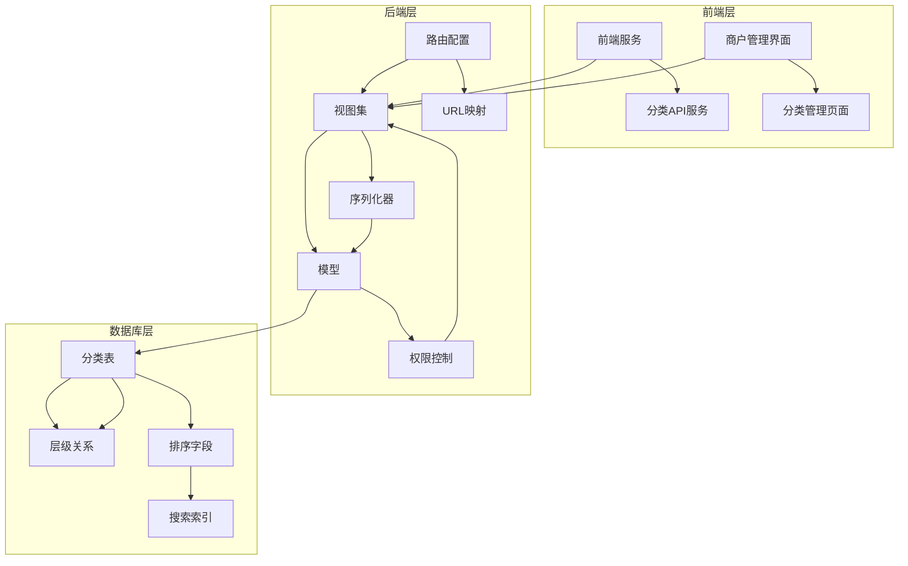
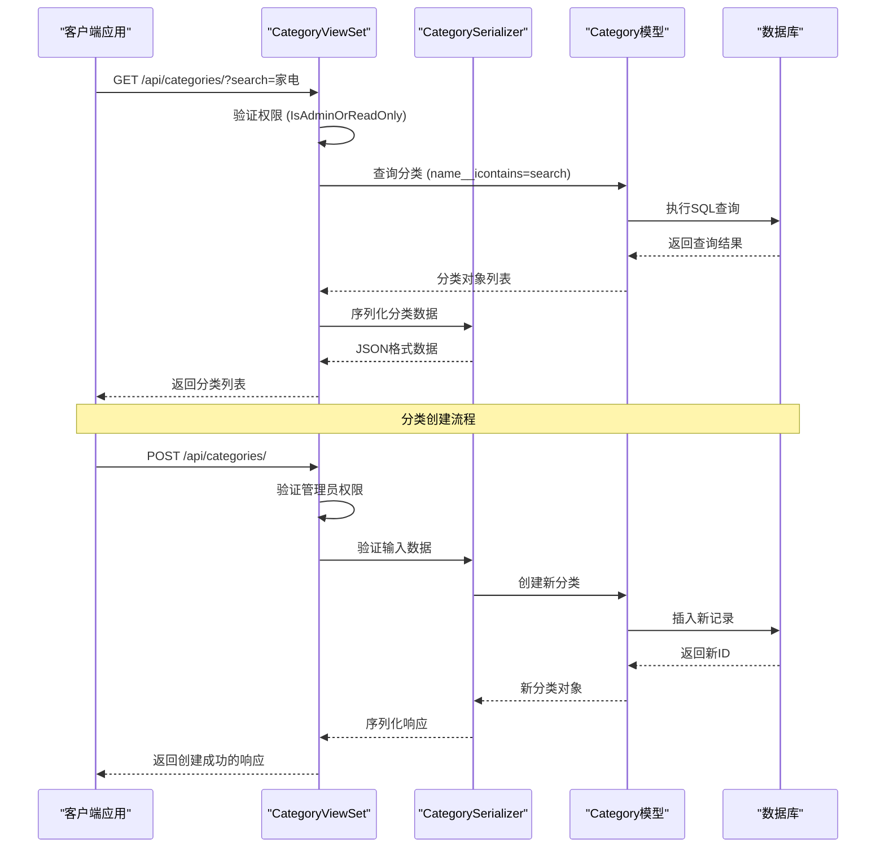
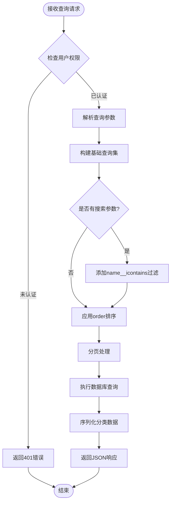
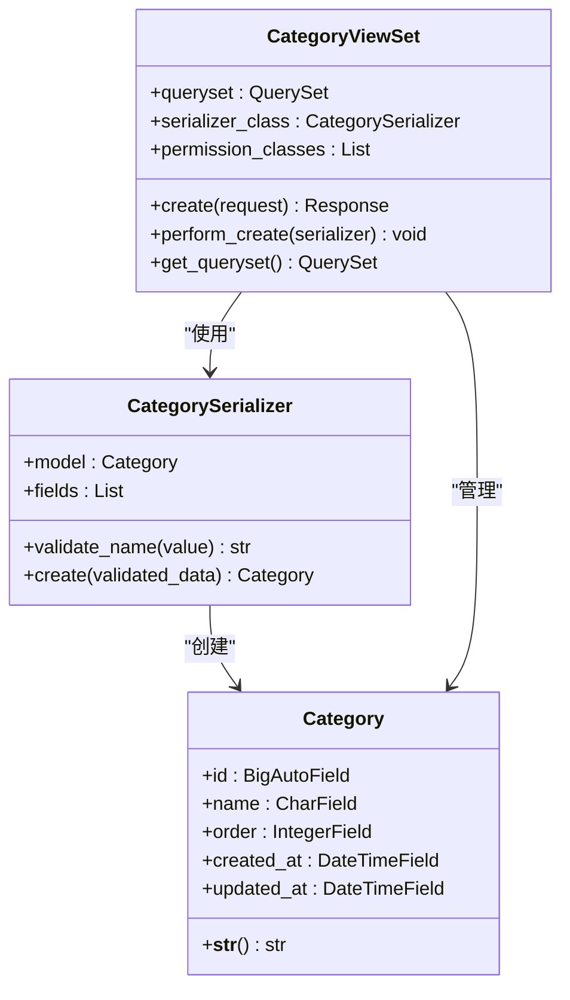
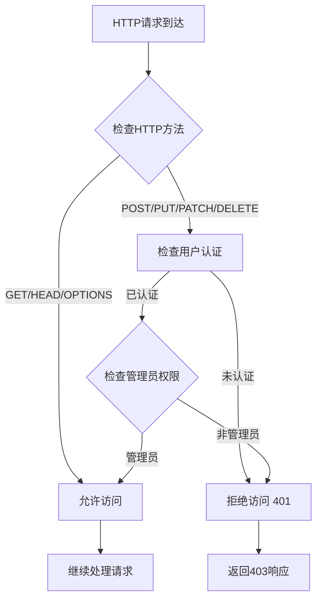
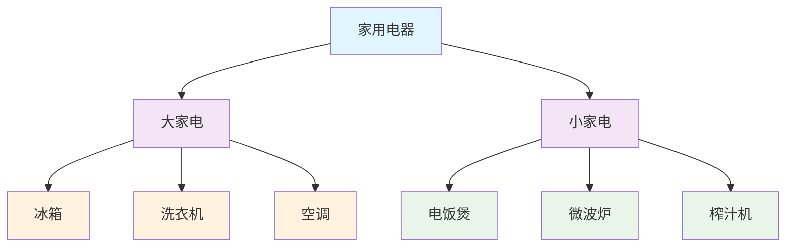
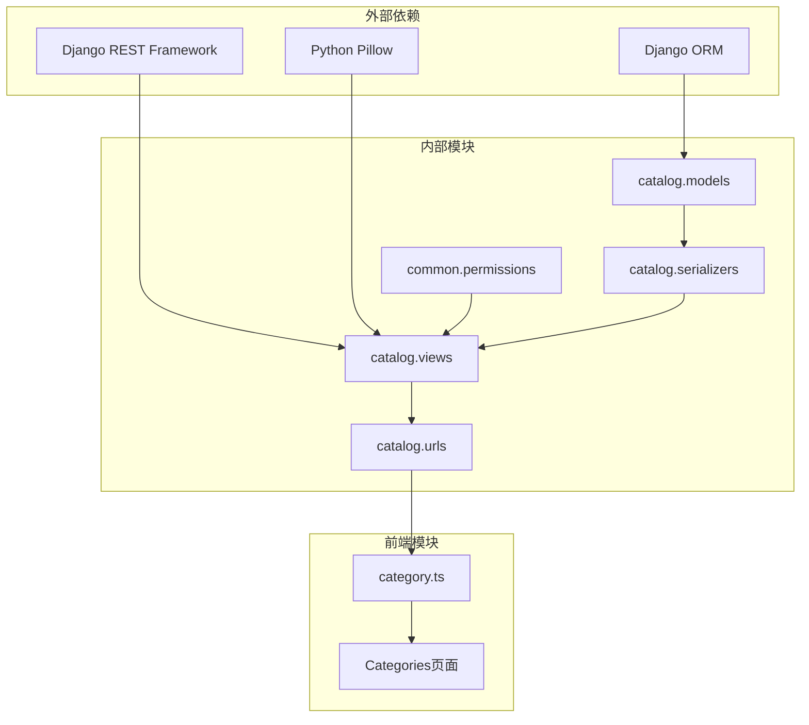

# 分类管理API详细文档

<cite>
**本文档中引用的文件**
- [backend/catalog/views.py](file://backend/catalog/views.py)
- [backend/catalog/models.py](file://backend/catalog/models.py)
- [backend/catalog/serializers.py](file://backend/catalog/serializers.py)
- [backend/common/permissions.py](file://backend/common/permissions.py)
- [backend/catalog/urls.py](file://backend/catalog/urls.py)
- [frontend/src/services/category.ts](file://frontend/src/services/category.ts)
- [merchant/src/pages/Categories/index.tsx](file://merchant/src/pages/Categories/index.tsx)
- [backend/catalog/migrations/0004_alter_category_options_category_level_category_order_and_more.py](file://backend/catalog/migrations/0004_alter_category_options_category_level_category_order_and_more.py)
</cite>

## 目录
1. [简介](#简介)
2. [项目结构](#项目结构)
3. [核心组件](#核心组件)
4. [架构概览](#架构概览)
5. [详细组件分析](#详细组件分析)
6. [依赖关系分析](#依赖关系分析)
7. [性能考虑](#性能考虑)
8. [故障排除指南](#故障排除指南)
9. [结论](#结论)

## 简介

分类管理API是电商平台的核心功能模块之一，负责管理商品分类的CRUD操作。该系统采用Django REST Framework构建，提供了完整的分类管理功能，包括分类列表查询、搜索、排序以及权限控制。系统支持多层级分类结构，具有灵活的查询参数和强大的权限管理机制。

## 项目结构

分类管理功能分布在多个模块中，形成了清晰的分层架构：

**图表来源**
- [backend/catalog/views.py](file://backend/catalog/views.py#L567-L587)
- [backend/catalog/urls.py](file://backend/catalog/urls.py#L1-L15)

**章节来源**
- [backend/catalog/views.py](file://backend/catalog/views.py#L1-L980)
- [backend/catalog/models.py](file://backend/catalog/models.py#L1-L312)
- [backend/catalog/urls.py](file://backend/catalog/urls.py#L1-L15)

## 核心组件

### 分类模型（Category）

分类模型是整个分类系统的核心数据结构，支持多层级分类和灵活的排序机制：

- **名称字段（name）**：唯一标识分类的字符串，最大长度100字符
- **排序字段（order）**：控制分类显示顺序的整数，默认值为0
- **层级字段（level）**：表示分类在树形结构中的层级深度
- **父级分类（parent）**：指向父分类的外键关系，支持无限层级嵌套

### 分类视图集（CategoryViewSet）

分类视图集提供了RESTful API接口，实现了完整的CRUD操作：

- **GET请求**：允许公开访问，支持分类列表和详情查询
- **POST/PUT/PATCH/DELETE请求**：仅管理员可访问，确保数据安全性
- **搜索功能**：支持按名称进行模糊搜索（icontains匹配）
- **排序机制**：基于order字段自动排序，支持动态排序参数

### 权限控制系统

系统采用多层次的权限控制策略：

- **IsAdminOrReadOnly**：读取操作对所有人开放，写入操作仅限管理员
- **环境感知权限**：开发环境允许所有认证用户访问，生产环境严格限制
- **方法级权限**：根据HTTP方法动态调整访问控制策略

**章节来源**
- [backend/catalog/models.py](file://backend/catalog/models.py#L5-L18)
- [backend/catalog/views.py](file://backend/catalog/views.py#L567-L587)
- [backend/common/permissions.py](file://backend/common/permissions.py#L70-L99)

## 架构概览

分类管理系统采用典型的MVC架构模式，结合RESTful API设计原则：

**图表来源**
- [backend/catalog/views.py](file://backend/catalog/views.py#L567-L587)
- [backend/catalog/serializers.py](file://backend/catalog/serializers.py#L16-L20)

## 详细组件分析

### 分类列表接口

分类列表接口提供了丰富的查询和过滤功能：

#### 查询参数详解

| 参数名 | 类型 | 描述 | 示例 |
|--------|------|------|------|
| search | string | 按分类名称进行模糊搜索 | `/api/categories/?search=家电` |
| page | integer | 页码，默认为1 | `/api/categories/?page=2` |
| page_size | integer | 每页结果数量，默认20，最大100 | `/api/categories/?page_size=50` |

#### 排序机制

分类列表按照以下规则自动排序：
1. **order字段升序**：主要排序依据，数值越小越靠前
2. **ID升序**：order相同时按创建时间排序
3. **层级结构**：支持多层级分类的层次化显示

**图表来源**
- [backend/catalog/views.py](file://backend/catalog/views.py#L580-L586)

**章节来源**
- [backend/catalog/views.py](file://backend/catalog/views.py#L567-L587)

### 分类CRUD操作

#### 创建分类

分类创建过程包含严格的验证和权限检查：

**图表来源**
- [backend/catalog/views.py](file://backend/catalog/views.py#L567-L587)
- [backend/catalog/serializers.py](file://backend/catalog/serializers.py#L16-L20)
- [backend/catalog/models.py](file://backend/catalog/models.py#L5-L18)

#### 更新分类

分类更新操作支持部分更新（PATCH）和完全更新（PUT），所有更新都需要管理员权限：

- **名称验证**：确保分类名称不为空且唯一
- **排序验证**：order字段必须为非负整数
- **级联更新**：子分类的层级和排序会自动调整

#### 删除分类

分类删除操作包含安全检查机制：

- **关联检查**：检查是否有商品关联到该分类
- **级联删除**：自动删除所有子分类
- **权限验证**：仅管理员可执行删除操作

**章节来源**
- [backend/catalog/views.py](file://backend/catalog/views.py#L567-L587)
- [backend/catalog/serializers.py](file://backend/catalog/serializers.py#L16-L20)

### 权限控制机制

#### IsAdminOrReadOnly权限类

这是分类管理API的核心权限控制机制：

**图表来源**
- [backend/common/permissions.py](file://backend/common/permissions.py#L70-L99)

#### 环境感知权限

系统根据运行环境自动调整权限策略：

- **开发环境**：允许所有认证用户访问，便于开发调试
- **生产环境**：严格限制，仅管理员可执行写操作
- **配置驱动**：通过EnvironmentConfig.is_production()动态判断

**章节来源**
- [backend/common/permissions.py](file://backend/common/permissions.py#L70-L99)
- [backend/common/permissions.py](file://backend/common/permissions.py#L126-L158)

### 分类在商品展示中的作用

分类系统在商品展示中发挥关键作用：

#### 商品分类关联

每个商品都与一个分类建立一对一关系，这种设计的优势包括：

- **快速查询**：通过category_id索引实现高效的分类查询
- **数据一致性**：确保商品只能属于单一分类
- **扩展性**：支持未来可能的多分类需求

#### 分类导航结构

分类系统支持复杂的树形导航结构：

**图表来源**
- [backend/catalog/migrations/0004_alter_category_options_category_level_category_order_and_more.py](file://backend/catalog/migrations/0004_alter_category_options_category_level_category_order_and_more.py#L19-L32)

#### 性能优化策略

为了提升分类系统的性能，采用了多种优化技术：

- **索引优化**：在category字段上建立复合索引
- **预加载**：使用select_related预加载关联分类数据
- **缓存策略**：对频繁访问的分类数据实施缓存
- **分页处理**：支持大数据量的分页查询

**章节来源**
- [backend/catalog/models.py](file://backend/catalog/models.py#L43-L50)
- [backend/catalog/views.py](file://backend/catalog/views.py#L580-L586)

## 依赖关系分析

分类管理系统的依赖关系体现了清晰的分层架构：

**图表来源**
- [backend/catalog/views.py](file://backend/catalog/views.py#L1-L27)
- [backend/common/permissions.py](file://backend/common/permissions.py#L1-L10)

### 核心依赖关系

1. **权限模块依赖**：所有视图集都依赖common.permissions模块
2. **模型序列化依赖**：序列化器依赖对应的模型定义
3. **视图路由依赖**：视图集通过URL配置暴露给前端
4. **前端服务依赖**：前端服务依赖后端提供的API接口

### 循环依赖检测

经过分析，系统不存在循环依赖问题：

- **模型层**：纯数据定义，无业务逻辑依赖
- **序列化层**：依赖模型，但不反向依赖视图
- **视图层**：依赖序列化器和权限类，但不形成循环
- **路由层**：简单配置，无复杂依赖关系

**章节来源**
- [backend/catalog/views.py](file://backend/catalog/views.py#L1-L27)
- [backend/catalog/urls.py](file://backend/catalog/urls.py#L1-L15)

## 性能考虑

### 查询性能优化

分类查询性能通过以下策略优化：

1. **索引策略**：
   - 在order字段上建立索引，支持快速排序
   - 在name字段上建立全文索引，加速搜索查询
   - 在parent字段上建立外键索引，支持层级查询

2. **查询优化**：
   - 使用select_related预加载关联数据
   - 实施适当的分页策略，避免大结果集查询
   - 对频繁查询的分类数据实施缓存

3. **数据库连接**：
   - 使用连接池管理数据库连接
   - 实施读写分离，减轻主库压力

### 缓存策略

系统采用多层缓存策略提升性能：

- **内存缓存**：使用Redis缓存热点分类数据
- **数据库缓存**：利用Django的查询集缓存
- **浏览器缓存**：设置适当的HTTP缓存头

### 并发控制

为应对高并发访问，系统实施以下措施：

- **乐观锁**：使用版本号控制并发更新
- **队列处理**：对批量操作使用消息队列
- **限流保护**：实施API调用频率限制

## 故障排除指南

### 常见问题及解决方案

#### 权限相关问题

**问题**：普通用户无法访问分类API
**原因**：权限配置错误或用户未认证
**解决方案**：
1. 检查用户认证状态
2. 验证IsAdminOrReadOnly权限配置
3. 确认用户角色权限设置

#### 查询性能问题

**问题**：分类列表查询响应缓慢
**原因**：缺少适当索引或查询条件不当
**解决方案**：
1. 检查数据库索引配置
2. 优化查询条件，避免全表扫描
3. 实施分页查询，限制单次查询结果数量

#### 数据一致性问题

**问题**：分类更新后数据不一致
**原因**：并发更新或事务处理不当
**解决方案**：
1. 实施乐观锁机制
2. 使用数据库事务保证原子性
3. 清理相关缓存数据

### 调试工具和技巧

1. **数据库查询分析**：使用Django Debug Toolbar监控SQL查询
2. **性能分析**：使用cProfile分析函数执行时间
3. **日志记录**：启用详细日志记录帮助问题定位
4. **单元测试**：编写全面的单元测试覆盖各种场景

**章节来源**
- [backend/common/permissions.py](file://backend/common/permissions.py#L70-L99)
- [backend/catalog/views.py](file://backend/catalog/views.py#L580-L586)

## 结论

分类管理API是一个设计完善、功能完整的电商核心功能模块。它成功地平衡了功能性、安全性和性能要求，为电商平台提供了可靠的分类管理能力。

### 主要优势

1. **安全性**：完善的权限控制机制，确保数据安全
2. **灵活性**：支持多层级分类和灵活的查询参数
3. **性能**：优化的数据库查询和缓存策略
4. **可扩展性**：清晰的架构设计支持功能扩展
5. **易用性**：RESTful API设计符合现代开发规范

### 改进建议

1. **国际化支持**：增加多语言分类名称支持
2. **分类树优化**：优化深层分类树的查询性能
3. **批量操作**：增加批量分类操作功能
4. **审计日志**：实施完整的操作审计跟踪
5. **API版本控制**：建立API版本管理机制

该分类管理系统为电商平台的商品组织和展示提供了坚实的基础，其设计理念和实现方式值得在类似项目中借鉴和应用。