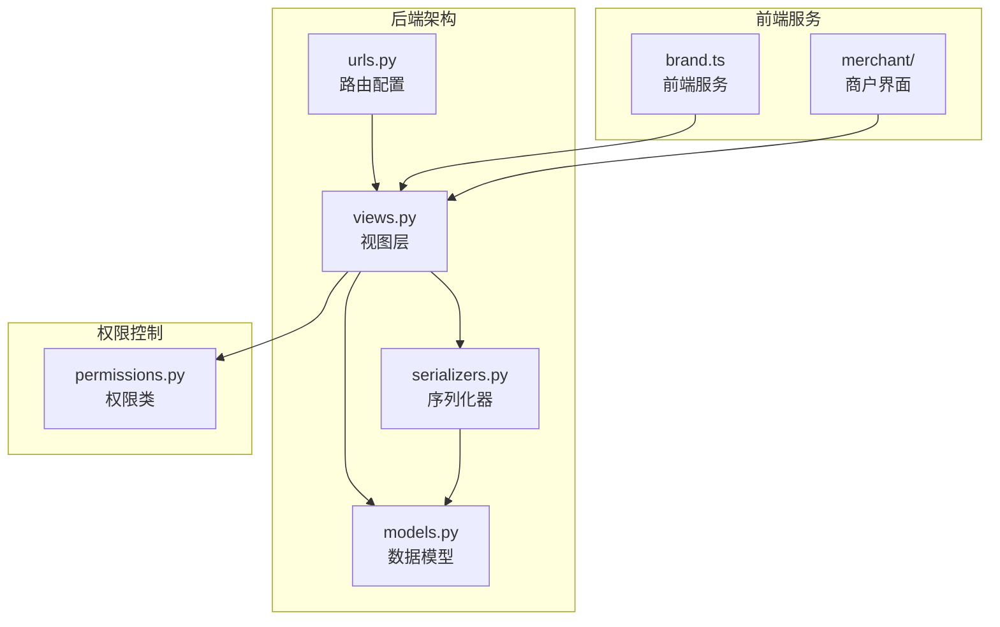
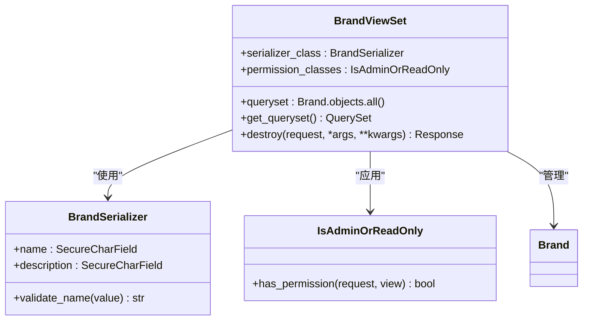
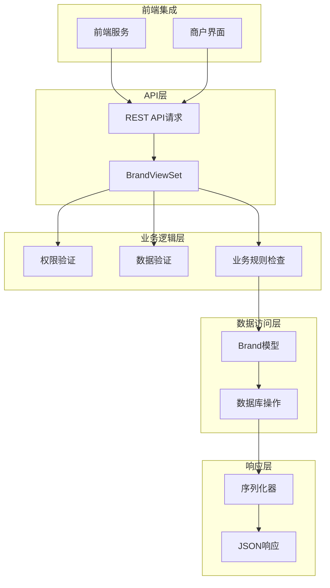
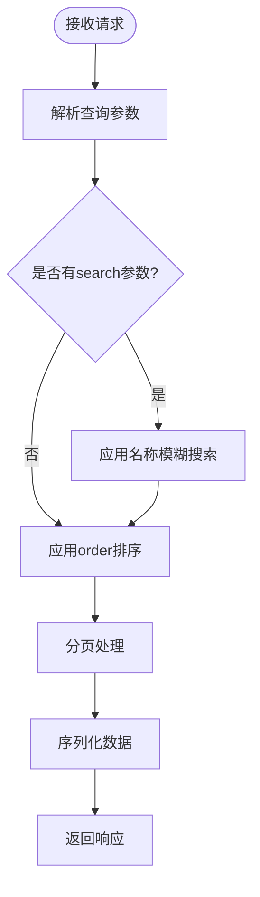
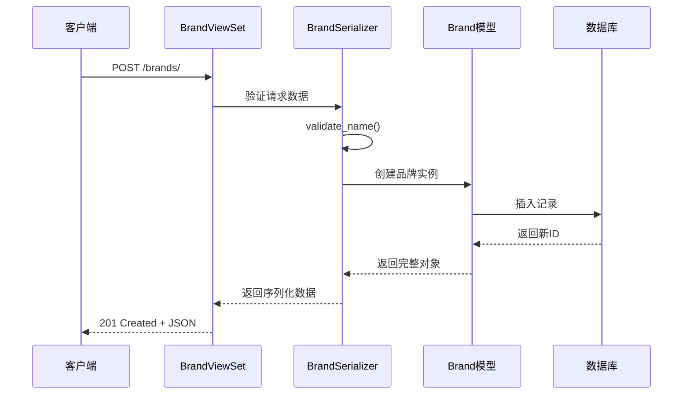
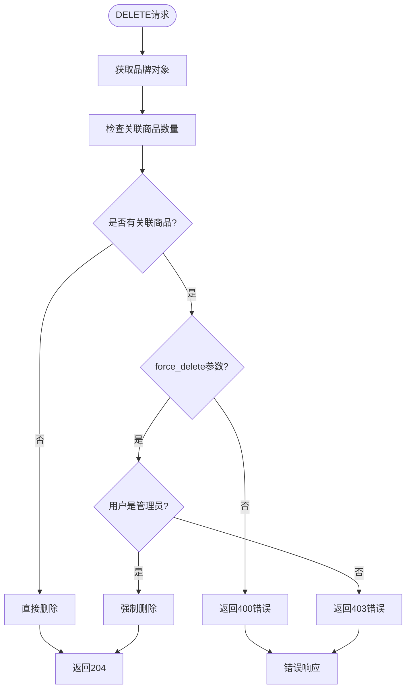
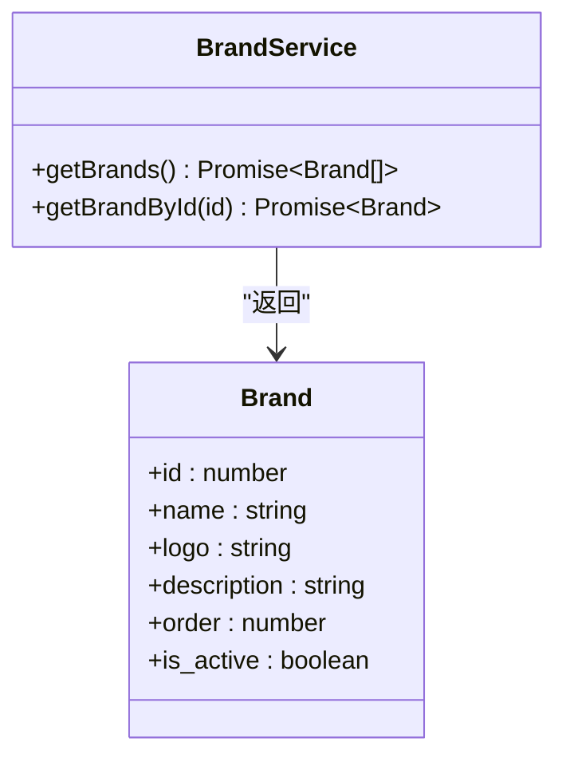
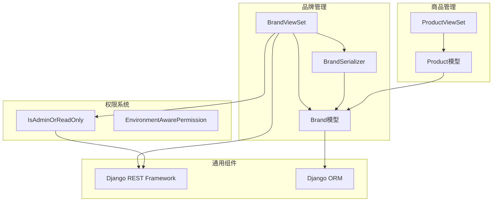

# 品牌管理API详细文档

<cite>
**本文档中引用的文件**
- [backend/catalog/views.py](file://backend/catalog/views.py)
- [backend/catalog/models.py](file://backend/catalog/models.py)
- [backend/catalog/serializers.py](file://backend/catalog/serializers.py)
- [backend/catalog/urls.py](file://backend/catalog/urls.py)
- [backend/common/permissions.py](file://backend/common/permissions.py)
- [frontend/src/services/brand.ts](file://frontend/src/services/brand.ts)
- [merchant/src/pages/Brands/index.tsx](file://merchant/src/pages/Brands/index.tsx)
</cite>

## 目录
1. [简介](#简介)
2. [项目结构](#项目结构)
3. [核心组件](#核心组件)
4. [架构概览](#架构概览)
5. [详细组件分析](#详细组件分析)
6. [依赖关系分析](#依赖关系分析)
7. [性能考虑](#性能考虑)
8. [故障排除指南](#故障排除指南)
9. [结论](#结论)

## 简介

品牌管理API是电商业务系统的核心功能模块之一，提供了完整的品牌CRUD操作和特殊删除逻辑。该API基于Django REST Framework构建，实现了品牌信息的增删改查功能，并包含强大的保护机制来防止误删除有关联商品的品牌。

### 主要特性

- **完整的CRUD操作**：支持品牌的基本增删改查功能
- **智能搜索机制**：基于`search`参数的品牌名称模糊匹配
- **排序功能**：按`order`字段进行品牌排序
- **保护性删除**：防止删除有关联商品的品牌
- **强制删除机制**：管理员可强制删除有关联商品的品牌
- **权限控制**：基于角色的访问控制（公开读取，管理员写入）

## 项目结构

品牌管理功能分布在以下关键文件中：



**图表来源**
- [backend/catalog/views.py](file://backend/catalog/views.py#L589-L674)
- [backend/catalog/models.py](file://backend/catalog/models.py#L21-L41)
- [backend/catalog/serializers.py](file://backend/catalog/serializers.py#L22-L47)

**章节来源**
- [backend/catalog/views.py](file://backend/catalog/views.py#L1-L980)
- [backend/catalog/models.py](file://backend/catalog/models.py#L1-L312)
- [backend/catalog/urls.py](file://backend/catalog/urls.py#L1-L15)

## 核心组件

### 品牌数据模型

品牌模型定义了品牌的核心属性和业务规则：

| 字段名 | 类型 | 描述 | 约束 |
|--------|------|------|------|
| id | BigAutoField | 品牌唯一标识符 | 主键，自增 |
| name | CharField(100) | 品牌名称 | 必填，唯一 |
| logo | URLField(500) | 品牌Logo链接 | 可选 |
| description | TextField | 品牌描述 | 可选 |
| order | IntegerField | 显示顺序 | 默认0 |
| is_active | BooleanField | 是否启用 | 默认True |
| created_at | DateTimeField | 创建时间 | 自动设置 |
| updated_at | DateTimeField | 更新时间 | 自动更新 |

### 品牌视图集（BrandViewSet）

品牌视图集提供了RESTful API接口，继承自Django REST Framework的ModelViewSet：



**图表来源**
- [backend/catalog/views.py](file://backend/catalog/views.py#L589-L674)
- [backend/catalog/serializers.py](file://backend/catalog/serializers.py#L22-L47)
- [backend/common/permissions.py](file://backend/common/permissions.py#L70-L99)

**章节来源**
- [backend/catalog/models.py](file://backend/catalog/models.py#L21-L41)
- [backend/catalog/views.py](file://backend/catalog/views.py#L589-L674)
- [backend/catalog/serializers.py](file://backend/catalog/serializers.py#L22-L47)

## 架构概览

品牌管理API采用分层架构设计，确保了良好的可维护性和扩展性：



**图表来源**
- [backend/catalog/views.py](file://backend/catalog/views.py#L589-L674)
- [backend/catalog/serializers.py](file://backend/catalog/serializers.py#L22-L47)

## 详细组件分析

### 品牌列表接口

品牌列表接口支持多种查询参数和排序机制：

#### 查询参数

| 参数名 | 类型 | 描述 | 示例 |
|--------|------|------|------|
| search | String | 品牌名称模糊搜索 | `/brands/?search=海尔` |
| page | Integer | 页码（默认1） | `/brands/?page=2` |
| page_size | Integer | 每页结果数（默认20） | `/brands/?page_size=50` |

#### 排序机制

品牌列表按照以下优先级排序：
1. `order`字段（升序）
2. `id`字段（升序）



**图表来源**
- [backend/catalog/views.py](file://backend/catalog/views.py#L613-L625)

**章节来源**
- [backend/catalog/views.py](file://backend/catalog/views.py#L613-L625)

### 品牌CRUD操作

#### 创建品牌

创建品牌时的验证规则：



**图表来源**
- [backend/catalog/views.py](file://backend/catalog/views.py#L589-L612)
- [backend/catalog/serializers.py](file://backend/catalog/serializers.py#L43-L47)

#### 更新品牌

品牌更新操作遵循标准的RESTful原则，支持部分更新：

- **PUT**: 完整替换整个品牌对象
- **PATCH**: 部分更新品牌字段

#### 删除品牌

删除品牌是最复杂的操作，包含多层保护机制：



**图表来源**
- [backend/catalog/views.py](file://backend/catalog/views.py#L634-L674)

**章节来源**
- [backend/catalog/views.py](file://backend/catalog/views.py#L634-L674)

### 特殊删除逻辑

#### 保护机制

删除品牌时会自动检查是否存在关联商品：

- **关联商品检测**: 通过`brand.products.count()`检查
- **保护响应**: 当存在关联商品时返回详细的错误信息
- **建议操作**: 提供强制删除的解决方案

#### 强制删除流程

管理员可以通过添加`force_delete=true`参数来强制删除品牌：

1. **参数验证**: 检查`force_delete`参数值
2. **权限检查**: 验证用户是否为管理员
3. **执行删除**: 调用父类的`destroy`方法
4. **错误处理**: 处理权限不足的情况

**章节来源**
- [backend/catalog/views.py](file://backend/catalog/views.py#L634-L674)

### 前端集成

#### 品牌服务

前端通过专门的服务模块与品牌API交互：



**图表来源**
- [frontend/src/services/brand.ts](file://frontend/src/services/brand.ts#L4-L15)

#### 商户界面

商户管理系统提供了完整的品牌管理界面：

- **列表展示**: 支持搜索和分页的品牌列表
- **编辑功能**: 品牌信息的创建和修改
- **删除确认**: 智能的删除确认对话框
- **强制删除**: 管理员级别的强制删除功能

**章节来源**
- [frontend/src/services/brand.ts](file://frontend/src/services/brand.ts#L1-L16)
- [merchant/src/pages/Brands/index.tsx](file://merchant/src/pages/Brands/index.tsx#L1-L33)

## 依赖关系分析

品牌管理API与其他系统组件的依赖关系：



**图表来源**
- [backend/catalog/views.py](file://backend/catalog/views.py#L589-L674)
- [backend/catalog/models.py](file://backend/catalog/models.py#L21-L41)
- [backend/common/permissions.py](file://backend/common/permissions.py#L70-L99)

**章节来源**
- [backend/catalog/views.py](file://backend/catalog/views.py#L1-L980)
- [backend/catalog/models.py](file://backend/catalog/models.py#L1-L312)
- [backend/common/permissions.py](file://backend/common/permissions.py#L1-L189)

## 性能考虑

### 查询优化

- **索引策略**: 品牌模型在`is_active`和`order`字段上建立了复合索引
- **预加载**: 在列表查询中预加载相关字段以避免N+1查询问题
- **缓存**: 在序列化过程中使用缓存来减少数据库查询

### 分页机制

- **默认分页**: 每页20条记录，最大100条
- **懒加载**: 支持无限滚动的分页模式
- **总数计算**: 智能的总数计算策略

### 缓存策略

- **序列化缓存**: 在商品列表中缓存品牌信息以提高性能
- **查询结果缓存**: 对频繁查询的品牌数据进行缓存

## 故障排除指南

### 常见错误及解决方案

#### 400 Bad Request - 品牌有关联商品

**错误信息**:
```
{
  "error": "无法删除品牌",
  "message": "该品牌有 5 个关联商品，请先删除或转移这些商品",
  "associated_products_count": 5,
  "suggestion": "如需强制删除，请添加 ?force_delete=true 参数"
}
```

**解决方案**:
1. 删除或转移所有关联商品
2. 或者使用管理员权限强制删除

#### 403 Forbidden - 权限不足

**错误信息**:
```
{
  "error": "权限不足",
  "message": "只有管理员可以强制删除有关联商品的品牌"
}
```

**解决方案**:
1. 确认当前用户具有管理员权限
2. 使用管理员账户重试操作

#### 404 Not Found - 品牌不存在

**错误信息**:
```
{
  "detail": "Not found."
}
```

**解决方案**:
1. 检查品牌ID是否正确
2. 确认品牌确实存在于系统中

### 调试技巧

1. **检查关联商品**: 使用`GET /brands/{id}/`查看品牌详情
2. **验证权限**: 确认当前用户的角色和权限
3. **查看日志**: 检查服务器日志了解详细错误信息

**章节来源**
- [backend/catalog/views.py](file://backend/catalog/views.py#L634-L674)

## 结论

品牌管理API是一个设计精良的RESTful服务，提供了完整的品牌生命周期管理功能。其主要优势包括：

### 技术优势

- **安全性**: 多层次的保护机制防止误删除
- **灵活性**: 支持多种查询参数和排序选项
- **可扩展性**: 基于DRF的标准架构便于扩展
- **性能**: 优化的查询和缓存策略

### 业务价值

- **品牌管理**: 为企业提供完整的品牌管理工具
- **商品关联**: 确保品牌与商品之间的数据一致性
- **用户体验**: 提供直观的管理和操作界面
- **数据完整性**: 通过保护机制维护数据质量

该API不仅满足了当前的业务需求，还为未来的功能扩展奠定了坚实的基础。通过合理的权限控制和保护机制，确保了系统的稳定性和数据的安全性。