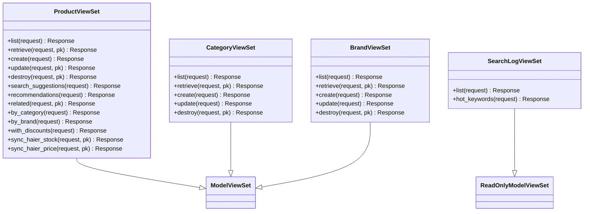

# 商品目录API详细文档

<cite>
**本文档中引用的文件**
- [backend/catalog/views.py](file://backend/catalog/views.py)
- [backend/catalog/serializers.py](file://backend/catalog/serializers.py)
- [backend/catalog/models.py](file://backend/catalog/models.py)
- [backend/catalog/search.py](file://backend/catalog/search.py)
- [backend/common/pagination.py](file://backend/common/pagination.py)
- [backend/common/permissions.py](file://backend/common/permissions.py)
- [backend/catalog/urls.py](file://backend/catalog/urls.py)
- [backend/catalog/admin.py](file://backend/catalog/admin.py)
- [frontend/src/services/product.ts](file://frontend/src/services/product.ts)
</cite>

## 目录
1. [简介](#简介)
2. [项目架构概览](#项目架构概览)
3. [核心组件分析](#核心组件分析)
4. [商品管理API](#商品管理api)
5. [分类管理API](#分类管理api)
6. [品牌管理API](#品牌管理api)
7. [搜索功能详解](#搜索功能详解)
8. [权限控制机制](#权限控制机制)
9. [分页实现](#分页实现)
10. [错误处理策略](#错误处理策略)
11. [性能优化考虑](#性能优化考虑)
12. [实际调用示例](#实际调用示例)

## 简介

本系统是一个基于Django REST Framework构建的电商商品目录管理系统，提供了完整的商品、分类和品牌管理功能。系统采用前后端分离架构，后端提供RESTful API接口，前端通过JavaScript SDK与后端进行交互。

主要功能包括：
- 商品列表的多条件搜索和排序
- 分类和品牌的CRUD操作
- 商品详情展示和相关推荐
- 高效的搜索建议和热门关键词功能
- 完善的权限控制和管理员保护机制

## 项目架构概览

系统采用模块化设计，主要包含以下核心模块：


**图表来源**
- [backend/catalog/views.py](file://backend/catalog/views.py#L1-L50)
- [backend/catalog/urls.py](file://backend/catalog/urls.py#L1-L15)

**章节来源**
- [backend/catalog/views.py](file://backend/catalog/views.py#L1-L100)
- [backend/catalog/urls.py](file://backend/catalog/urls.py#L1-L15)

## 核心组件分析

### 数据模型设计

系统的核心数据模型包括三个主要实体：


**图表来源**
- [backend/catalog/models.py](file://backend/catalog/models.py#L5-L113)

### 视图控制器架构

系统采用DRF的ViewSet模式，提供统一的CRUD接口：



**图表来源**
- [backend/catalog/views.py](file://backend/catalog/views.py#L29-L980)

**章节来源**
- [backend/catalog/views.py](file://backend/catalog/views.py#L29-L980)
- [backend/catalog/models.py](file://backend/catalog/models.py#L1-L312)

## 商品管理API

### 商品列表接口

商品列表接口是最核心的功能，支持多种搜索和过滤条件：

#### 接口规范

| 参数名 | 类型 | 必填 | 描述 | 默认值 |
|--------|------|------|------|--------|
| search | string | 否 | 关键词搜索（产品名称和描述） | - |
| category | string | 否 | 按分类名称过滤 | - |
| brand | string | 否 | 按品牌名称过滤 | - |
| min_price | decimal | 否 | 最小价格过滤 | - |
| max_price | decimal | 否 | 最大价格过滤 | - |
| sort_by | string | 否 | 排序策略 | relevance |
| page | integer | 否 | 页码（从1开始） | 1 |
| page_size | integer | 否 | 每页结果数 | 20 |

#### 支持的排序策略

| 排序选项 | 描述 | 排序依据 |
|----------|------|----------|
| relevance | 相关性排序 | 关键词匹配度优先，销量次之 |
| price_asc | 价格升序 | 价格从小到大 |
| price_desc | 价格降序 | 价格从大到小 |
| sales | 销量排序 | 销量从高到低，同销量按创建时间 |
| created | 创建时间 | 最新创建的商品在前 |
| views | 浏览量排序 | 浏览次数从高到低 |

#### 实现原理

商品列表接口通过`ProductSearchService`实现复杂的搜索逻辑：


**图表来源**
- [backend/catalog/search.py](file://backend/catalog/search.py#L47-L158)

**章节来源**
- [backend/catalog/views.py](file://backend/catalog/views.py#L83-L131)
- [backend/catalog/search.py](file://backend/catalog/search.py#L47-L158)

### 商品详情接口

商品详情接口提供单个商品的完整信息，包括：

- 基础商品信息（名称、描述、价格等）
- 分类和品牌关联信息
- 主图和详情图列表
- 折扣价格计算
- 海尔商品特殊信息

### 推荐商品接口

系统提供三种类型的推荐算法：

#### 推荐类型

| 类型 | 描述 | 排序依据 |
|------|------|----------|
| popular | 热销推荐 | 销量最高 |
| trending | 热门推荐 | 浏览量最高 |
| category | 分类推荐 | 同分类内销量最高 |

#### 接口参数

| 参数名 | 类型 | 必填 | 描述 | 默认值 |
|--------|------|------|------|--------|
| type | string | 否 | 推荐类型 | popular |
| limit | integer | 否 | 推荐数量限制 | 10 |
| category_id | integer | 否 | 分类ID（仅category类型） | - |

### 相关商品接口

基于同一分类的商品推荐，排除当前商品本身，按销量排序。

**章节来源**
- [backend/catalog/views.py](file://backend/catalog/views.py#L387-L433)
- [backend/catalog/views.py](file://backend/catalog/views.py#L338-L385)

## 分类管理API

### 分类CRUD操作

分类管理提供标准的RESTful接口：

#### 列表接口
- **URL**: `/api/categories/`
- **方法**: GET
- **权限**: 公开访问
- **功能**: 获取分类列表，支持搜索过滤

#### 单个分类接口
- **URL**: `/api/categories/{id}/`
- **方法**: GET/PUT/DELETE
- **权限**: 管理员权限

### 分类特性

- **层级结构**: 支持无限层级分类（通过parent字段实现）
- **排序功能**: 通过order字段控制显示顺序
- **搜索支持**: 支持按名称模糊搜索
- **索引优化**: 在`is_active`和`order`字段上有复合索引

**章节来源**
- [backend/catalog/views.py](file://backend/catalog/views.py#L568-L587)

## 品牌管理API

### 品牌CRUD操作

品牌管理同样提供完整的RESTful接口：

#### 列表接口
- **URL**: `/api/brands/`
- **方法**: GET
- **权限**: 公开访问
- **功能**: 获取品牌列表，支持名称搜索

#### 单个品牌接口
- **URL**: `/api/brands/{id}/`
- **方法**: GET/PUT/DELETE
- **权限**: 管理员权限

### 品牌保护机制

系统实现了品牌删除保护机制：


**图表来源**
- [backend/catalog/views.py](file://backend/catalog/views.py#L634-L674)

### 品牌特性

- **唯一约束**: 品名必须唯一
- **活跃状态**: 支持启用/禁用品牌
- **排序功能**: 通过order字段控制显示顺序
- **图片支持**: 支持品牌Logo上传

**章节来源**
- [backend/catalog/views.py](file://backend/catalog/views.py#L589-L674)
- [backend/catalog/serializers.py](file://backend/catalog/serializers.py#L22-L48)

## 搜索功能详解

### 搜索服务架构

系统实现了专门的`ProductSearchService`来处理复杂的搜索需求：


**图表来源**
- [backend/catalog/search.py](file://backend/catalog/search.py#L19-L287)

### 关键词搜索

支持全文模糊搜索，同时记录搜索日志用于分析：

#### 搜索策略
1. **名称匹配**: 产品名称包含关键词
2. **描述匹配**: 产品描述包含关键词  
3. **相关性排序**: 名称匹配权重高于描述匹配
4. **搜索历史**: 记录搜索关键词用于热门分析

### 搜索建议功能

提供智能搜索建议，提升用户体验：

#### 建议来源
1. **产品名称**: 当前活跃商品的名称
2. **搜索历史**: 用户之前的搜索记录
3. **去重合并**: 合并两个来源的建议并去重

### 热门关键词分析

基于搜索日志分析热门搜索：

#### 分析维度
- **时间范围**: 可配置的历史天数
- **统计指标**: 搜索次数统计
- **排序规则**: 按搜索次数降序排列

**章节来源**
- [backend/catalog/search.py](file://backend/catalog/search.py#L47-L287)

## 权限控制机制

### 权限体系设计

系统采用多层次的权限控制：


**图表来源**
- [backend/common/permissions.py](file://backend/common/permissions.py#L70-L189)

### 权限级别

| 权限类 | 描述 | 适用场景 |
|--------|------|----------|
| IsAdminOrReadOnly | 读取公开，写入管理员 | 商品、分类、品牌列表 |
| IsAdmin | 仅管理员可用 | 特殊功能（如海尔同步） |
| IsOwnerOrAdmin | 所有者或管理员 | 订单、评论等 |
| IsAuthenticatedOrReadOnly | 认证用户可写 | 评论、收藏等 |

### 管理员保护机制

- **敏感操作**: 仅管理员可执行
- **批量操作**: 需要管理员权限
- **数据修改**: 记录操作日志
- **系统配置**: 严格权限控制

**章节来源**
- [backend/common/permissions.py](file://backend/common/permissions.py#L70-L189)
- [backend/catalog/views.py](file://backend/catalog/views.py#L13-L14)

## 分页实现

### 分页策略

系统采用标准的分页模式，提供灵活的分页控制：

#### 分页参数

| 参数名 | 类型 | 默认值 | 最大值 | 描述 |
|--------|------|--------|--------|------|
| page | integer | 1 | - | 页码（从1开始） |
| page_size | integer | 20 | 100 | 每页结果数 |

#### 分页响应格式

```json
{
  "results": [...],
  "total": 1000,
  "page": 1,
  "total_pages": 50,
  "has_next": true,
  "has_previous": false,
  "count": 1000,
  "next": "/api/products/?page=2&page_size=20",
  "previous": null
}
```

### 分页优化

- **性能优化**: 使用Django的`Paginator`类
- **内存控制**: 限制最大页面大小防止内存溢出
- **兼容性**: 提供传统分页字段保持向后兼容

**章节来源**
- [backend/common/pagination.py](file://backend/common/pagination.py#L8-L99)

## 错误处理策略

### 异常处理层次

系统采用分层的异常处理策略：


### 常见错误类型

| 错误类型 | HTTP状态码 | 描述 | 处理方式 |
|----------|------------|------|----------|
| 参数无效 | 400 | 请求参数格式错误 | 返回具体错误信息 |
| 权限不足 | 403 | 用户无相应权限 | 提示需要管理员权限 |
| 资源不存在 | 404 | 请求的资源不存在 | 返回资源未找到 |
| 服务器错误 | 500 | 内部服务器错误 | 记录日志，返回通用错误 |

### 错误响应格式

```json
{
  "error": "错误类型",
  "message": "详细错误信息",
  "details": {
    "field": "错误字段",
    "code": "错误代码"
  }
}
```

**章节来源**
- [backend/catalog/views.py](file://backend/catalog/views.py#L634-L674)

## 性能优化考虑

### 查询优化

#### N+1查询问题解决
- **select_related**: 预加载外键关联对象
- **prefetch_related**: 预加载多对多关系
- **字段选择**: 只查询需要的字段

#### 数据库索引优化
- **复合索引**: 在常用查询字段上建立复合索引
- **查询优化**: 使用EXPLAIN分析查询计划
- **缓存策略**: 对频繁查询的结果进行缓存

### 缓存策略

#### 缓存层次
1. **数据库缓存**: Django ORM自动缓存
2. **应用层缓存**: Redis缓存热点数据
3. **浏览器缓存**: 静态资源缓存

#### 缓存键设计
- **产品列表**: `products:list:{params}`
- **商品详情**: `product:detail:{id}`
- **推荐数据**: `recommendations:{type}:{params}`

### 搜索性能优化

#### 搜索优化策略
- **全文索引**: 数据库级别的全文搜索
- **搜索建议**: 基于前缀匹配的快速建议
- **热门关键词**: 定期统计热门搜索

#### 性能监控
- **查询时间**: 监控慢查询
- **缓存命中率**: 优化缓存策略
- **并发处理**: 控制并发请求数

## 实际调用示例

### 前端调用示例

以下是前端JavaScript SDK的典型使用方式：

#### 获取商品列表
```typescript
// 基础商品列表
const products = await productService.getProducts({
  page: 1,
  page_size: 20,
  sort_by: 'sales'
});

// 带搜索条件的商品列表
const filteredProducts = await productService.getProducts({
  search: '冰箱',
  category: '家电',
  min_price: 1000,
  max_price: 5000,
  sort_by: 'price_asc'
});
```

#### 获取商品详情
```typescript
// 获取单个商品详情
const productDetail = await productService.getProductDetail(123);

// 获取相关商品
const relatedProducts = await productService.getRelatedProducts(123, 5);
```

#### 获取分类和品牌
```typescript
// 获取分类列表
const categories = await productService.getCategories();

// 获取品牌列表
const brands = await productService.getBrands();
```

#### 推荐商品
```typescript
// 获取热销推荐
const popularRecommendations = await productService.getRecommendations({
  type: 'popular',
  limit: 10
});

// 获取分类推荐
const categoryRecommendations = await productService.getRecommendations({
  type: 'category',
  category_id: 5,
  limit: 8
});
```

### 后端调用示例

#### 商品搜索服务
```python
# 基础搜索
result = ProductSearchService.search(
    keyword='电视',
    category='家电',
    sort_by='sales',
    page=1,
    page_size=20
)

# 获取热门关键词
hot_keywords = ProductSearchService.get_hot_keywords(limit=10, days=7)

# 获取搜索建议
suggestions = ProductSearchService.get_search_suggestions('智能', limit=5)
```

#### 权限检查
```python
# 检查是否为管理员
if request.user.is_staff:
    # 执行管理员操作

# 检查是否为所有者
if obj.user == request.user or request.user.is_staff:
    # 执行所有者操作
```

### API响应示例

#### 商品列表响应
```json
{
  "results": [
    {
      "id": 1,
      "name": "智能冰箱",
      "price": 2999.00,
      "discounted_price": 2799.00,
      "originalPrice": 2999.00,
      "category": "家电",
      "brand": "海尔",
      "main_images": ["https://example.com/image1.jpg"],
      "is_haier_product": true,
      "haier_info": {
        "product_code": "HA123456",
        "supply_price": 2799.00,
        "market_price": 2999.00
      }
    }
  ],
  "total": 150,
  "page": 1,
  "total_pages": 8,
  "has_next": true,
  "has_previous": false
}
```

#### 错误响应示例
```json
{
  "error": "品牌删除失败",
  "message": "该品牌有 15 个关联商品，请先删除或转移这些商品",
  "associated_products_count": 15,
  "suggestion": "如需强制删除，请添加 ?force_delete=true 参数"
}
```

**章节来源**
- [frontend/src/services/product.ts](file://frontend/src/services/product.ts#L1-L64)
- [backend/catalog/search.py](file://backend/catalog/search.py#L47-L158)

## 结论

本商品目录API系统提供了完整而强大的商品管理功能，具有以下特点：

### 核心优势
1. **功能完整**: 涵盖商品、分类、品牌的所有管理需求
2. **性能优异**: 通过查询优化和缓存策略确保高性能
3. **易于扩展**: 模块化设计便于功能扩展
4. **安全可靠**: 完善的权限控制和错误处理机制

### 技术特色
- **RESTful设计**: 符合现代API设计规范
- **智能搜索**: 支持多条件组合搜索和排序
- **推荐算法**: 基于业务逻辑的商品推荐
- **权限分级**: 细粒度的权限控制机制

### 应用价值
该系统为企业级电商平台提供了坚实的基础支撑，能够满足大规模商品管理的需求，同时保持良好的开发体验和运维效率。