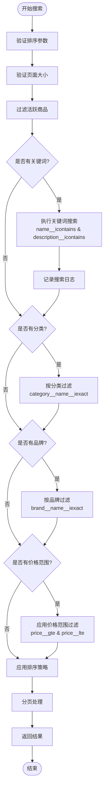
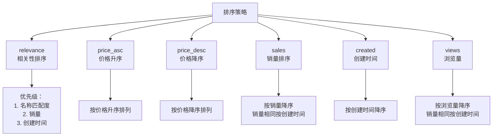
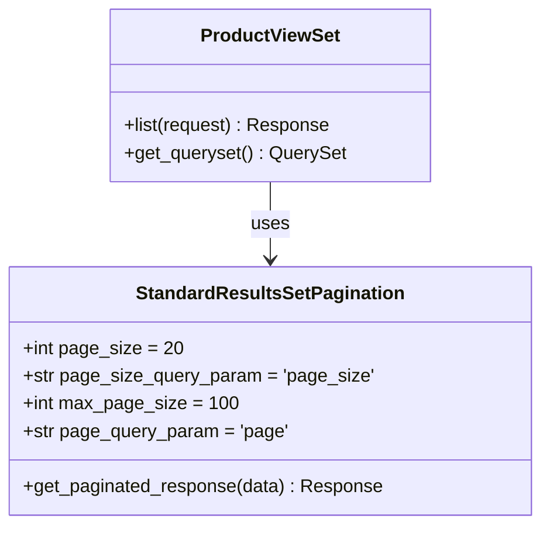
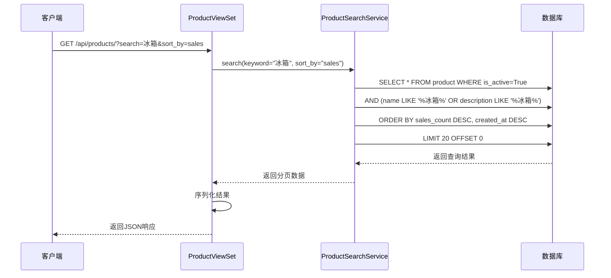
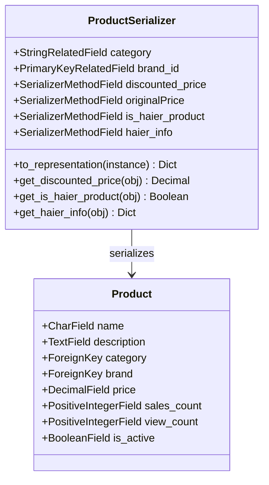
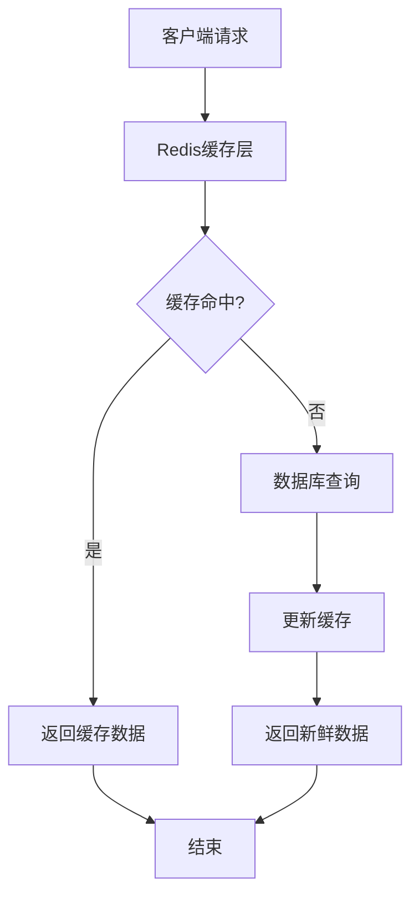

# 商品列表API详细文档

<cite>
**本文档中引用的文件**
- [backend/catalog/views.py](file://backend/catalog/views.py)
- [backend/catalog/search.py](file://backend/catalog/search.py)
- [backend/catalog/models.py](file://backend/catalog/models.py)
- [backend/catalog/urls.py](file://backend/catalog/urls.py)
- [backend/catalog/serializers.py](file://backend/catalog/serializers.py)
- [backend/common/pagination.py](file://backend/common/pagination.py)
- [backend/catalog/migrations/0008_add_product_stats_and_timestamps.py](file://backend/catalog/migrations/0008_add_product_stats_and_timestamps.py)
- [backend/catalog/migrations/0012_alter_brand_options_alter_category_options_and_more.py](file://backend/catalog/migrations/0012_alter_brand_options_alter_category_options_and_more.py)
</cite>

## 目录
1. [简介](#简介)
2. [API端点概述](#api端点概述)
3. [查询参数详解](#查询参数详解)
4. [ProductSearchService核心实现](#productsearchservice核心实现)
5. [排序策略详解](#排序策略详解)
6. [分页机制](#分页机制)
7. [数据库优化与索引](#数据库优化与索引)
8. [响应格式与序列化](#响应格式与序列化)
9. [实际调用示例](#实际调用示例)
10. [错误处理策略](#错误处理策略)
11. [性能优化建议](#性能优化建议)

## 简介

本文档详细介绍了电商小程序项目中商品列表API的实现，重点分析GET `/products/` 端点的功能特性、技术实现和最佳实践。该API提供了强大的多条件搜索、智能排序和高效分页功能，支持关键词搜索、分类筛选、品牌过滤、价格范围限制等多种查询方式。

## API端点概述

### 核心端点
- **端点路径**: `GET /api/products/`
- **权限控制**: 公开访问（AllowAny），无需认证
- **功能定位**: 提供商品列表的高级搜索和过滤功能

### 主要特性
- **多条件搜索**: 支持关键词、分类、品牌、价格范围组合查询
- **智能排序**: 提供多种排序策略满足不同业务需求
- **高效分页**: 支持灵活的分页参数配置
- **实时搜索**: 内置搜索日志记录和热门关键词分析
- **响应优化**: 预加载关联数据避免N+1查询问题

**章节来源**
- [backend/catalog/views.py](file://backend/catalog/views.py#L29-L47)

## 查询参数详解

### 基础搜索参数

| 参数名 | 类型 | 描述 | 示例值 |
|--------|------|------|--------|
| `search` | String | 关键词搜索，匹配商品名称和描述 | `"冰箱"` |
| `category` | String | 按分类名称过滤 | `"家用电器"` |
| `brand` | String | 按品牌名称过滤 | `"海尔"` |
| `min_price` | Decimal | 最小价格限制 | `100.00` |
| `max_price` | Decimal | 最大价格限制 | `5000.00` |

### 排序参数

| 参数名 | 类型 | 描述 | 默认值 |
|--------|------|------|--------|
| `sort_by` | String | 排序策略 | `"relevance"` |

### 分页参数

| 参数名 | 类型 | 描述 | 默认值 | 最大值 |
|--------|------|------|--------|--------|
| `page` | Integer | 页码（从1开始） | `1` | - |
| `page_size` | Integer | 每页结果数 | `20` | `100` |

**章节来源**
- [backend/catalog/views.py](file://backend/catalog/views.py#L38-L46)

## ProductSearchService核心实现

### 方法签名与参数

```python
@classmethod
def search(
    cls,
    keyword: Optional[str] = None,
    category: Optional[str] = None,
    brand: Optional[str] = None,
    min_price: Optional[Decimal] = None,
    max_price: Optional[Decimal] = None,
    sort_by: str = 'relevance',
    page: int = 1,
    page_size: int = DEFAULT_PAGE_SIZE,
    user=None,
) -> Dict[str, Any]:
```

### 查询构建流程



**图表来源**
- [backend/catalog/search.py](file://backend/catalog/search.py#L47-L158)

### 查询参数解析逻辑

#### 关键词搜索实现
- **模糊匹配**: 使用 `icontains` 进行不区分大小写的字符串包含匹配
- **双字段搜索**: 同时在 `name` 和 `description` 字段进行搜索
- **搜索日志**: 自动记录搜索关键词用于数据分析

#### 条件过滤链
- **顺序执行**: 按关键词 → 分类 → 品牌 → 价格的顺序应用过滤器
- **空值检查**: 对每个参数进行严格验证，跳过无效值
- **类型转换**: 自动处理价格参数的Decimal类型转换

**章节来源**
- [backend/catalog/search.py](file://backend/catalog/search.py#L97-L135)

## 排序策略详解

### 支持的排序选项



**图表来源**
- [backend/catalog/search.py](file://backend/catalog/search.py#L36-L44)
- [backend/catalog/search.py](file://backend/catalog/search.py#L161-L201)

### 排序策略实现细节

#### 相关性排序（relevance）
- **名称匹配优先**: 在关键词搜索时，名称匹配度高于描述匹配度
- **多维度排序**: 第一优先级为匹配度，第二优先级为销量，第三优先级为创建时间
- **SQL实现**: 使用 `Case` 表达式动态计算匹配权重

#### 销量排序（sales）
- **主排序**: 按 `sales_count` 降序排列
- **次排序**: 销量相同时按 `created_at` 降序排列
- **索引优化**: 利用 `catalog_pro_sales_c_9ac6ba_idx` 索引提升性能

#### 浏览量排序（views）
- **主排序**: 按 `view_count` 降序排列
- **次排序**: 浏览量相同时按 `created_at` 降序排列
- **索引优化**: 利用 `catalog_pro_is_acti_1e9dfc_idx` 索引提升性能

**章节来源**
- [backend/catalog/search.py](file://backend/catalog/search.py#L178-L201)

## 分页机制

### 分页配置



**图表来源**
- [backend/common/pagination.py](file://backend/common/pagination.py#L8-L42)
- [backend/catalog/views.py](file://backend/catalog/views.py#L83-L131)

### 分页参数验证

| 参数 | 默认值 | 最大值 | 验证规则 |
|------|--------|--------|----------|
| `page` | 1 | - | 转换为整数，无效时重置为1 |
| `page_size` | 20 | 100 | 转换为整数，限制在1-100范围内 |

### 分页响应结构

```json
{
    "results": [...],           // 当前页的商品数据
    "total": 1000,             // 总商品数量
    "page": 1,                 // 当前页码
    "total_pages": 50,         // 总页数
    "has_next": true,          // 是否有下一页
    "has_previous": false,     // 是否有上一页
    "count": 1000,             // 兼容性字段
    "next": "/api/products/?page=2&page_size=20",
    "previous": null
}
```

**章节来源**
- [backend/common/pagination.py](file://backend/common/pagination.py#L27-L42)
- [backend/catalog/views.py](file://backend/catalog/views.py#L123-L131)

## 数据库优化与索引

### 核心索引配置

#### 价格查询优化
- **索引名称**: `catalog_pro_price_2d2a4c_idx`
- **字段**: `price`
- **用途**: 加速价格范围查询（`price__gte` 和 `price__lte`）
- **应用场景**: 价格筛选功能

#### 销量查询优化  
- **索引名称**: `catalog_pro_sales_c_9ac6ba_idx`
- **字段**: `-sales_count`
- **用途**: 加速销量排序和过滤
- **应用场景**: 销量排序、热销商品推荐

#### 综合查询优化
- **索引名称**: `catalog_pro_is_acti_93f887_idx`
- **字段**: `is_active`, `-sales_count`
- **用途**: 同时过滤活跃商品和按销量排序
- **应用场景**: 商品列表展示

### 查询优化策略



**图表来源**
- [backend/catalog/migrations/0008_add_product_stats_and_timestamps.py](file://backend/catalog/migrations/0008_add_product_stats_and_timestamps.py#L49-L55)
- [backend/catalog/migrations/0012_alter_brand_options_alter_category_options_and_more.py](file://backend/catalog/migrations/0012_alter_brand_options_alter_category_options_and_more.py#L181-L192)

### N+1查询问题防护

#### 预加载策略
- **select_related**: 预加载 `category` 和 `brand` 外键关系
- **查询优化**: 将原本需要N+1次查询减少为2次
- **内存效率**: 减少数据库连接开销

#### 关联数据访问
```python
# 优化前：每次访问都会触发数据库查询
product.category.name  # N+1问题

# 优化后：预加载所有关联数据
qs = qs.select_related('category', 'brand')
# 现在访问不会触发额外查询
product.category.name  # 直接从缓存获取
```

**章节来源**
- [backend/catalog/views.py](file://backend/catalog/views.py#L56-L57)
- [backend/catalog/models.py](file://backend/catalog/models.py#L105-L113)

## 响应格式与序列化

### ProductSerializer设计



**图表来源**
- [backend/catalog/serializers.py](file://backend/catalog/serializers.py#L50-L84)

### 序列化字段映射

| 模型字段 | 序列化字段 | 类型 | 描述 |
|----------|------------|------|------|
| `name` | `name` | String | 商品名称 |
| `description` | `description` | Text | 商品描述 |
| `price` | `price` | Decimal | 显示价格 |
| `sales_count` | `sales_count` | Integer | 销量 |
| `view_count` | `view_count` | Integer | 浏览量 |
| `is_active` | `is_active` | Boolean | 上架状态 |
| `category` | `category` | String | 分类名称 |
| `brand` | `brand` | String | 品牌名称 |

### 动态字段计算

#### 折扣价格计算
- **逻辑**: 根据促销信息动态计算折扣价格
- **优先级**: 促销价 → 原价 → 默认值
- **缓存**: 避免重复计算提高性能

#### 海尔商品标识
- **判断依据**: 根据 `source` 字段判断是否为海尔商品
- **信息提取**: 提取海尔特有的产品编码、价格等信息
- **兼容性**: 保持与非海尔商品的接口一致性

**章节来源**
- [backend/catalog/serializers.py](file://backend/catalog/serializers.py#L122-L200)

## 实际调用示例

### 基础商品列表查询

**请求示例**:
```http
GET /api/products/?page=1&page_size=20
Accept: application/json
```

**响应示例**:
```json
{
    "results": [
        {
            "id": 1,
            "name": "海尔变频空调",
            "description": "一级能效，静音设计",
            "price": 2999.00,
            "sales_count": 156,
            "view_count": 2345,
            "category": "家用电器",
            "brand": "海尔"
        }
    ],
    "total": 1234,
    "page": 1,
    "total_pages": 62,
    "has_next": true,
    "has_previous": false
}
```

### 多条件搜索查询

**请求示例**:
```http
GET /api/products/?search=冰箱&category=家用电器&brand=海尔&min_price=1000&max_price=5000&sort_by=price_asc&page=1&page_size=10
Accept: application/json
```

**响应示例**:
```json
{
    "results": [
        {
            "id": 101,
            "name": "海尔三门冰箱",
            "description": "风冷无霜，节能省电",
            "price": 1899.00,
            "sales_count": 89,
            "view_count": 1234,
            "category": "家用电器",
            "brand": "海尔"
        }
    ],
    "total": 15,
    "page": 1,
    "total_pages": 2,
    "has_next": false,
    "has_previous": false
}
```

### 热门搜索关键词查询

**请求示例**:
```http
GET /api/search-logs/hot-keywords/?limit=10&days=7
Accept: application/json
```

**响应示例**:
```json
{
    "hot_keywords": [
        {"keyword": "冰箱", "count": 156},
        {"keyword": "空调", "count": 123},
        {"keyword": "洗衣机", "count": 98},
        {"keyword": "电视", "count": 87}
    ]
}
```

### 搜索建议查询

**请求示例**:
```http
GET /api/products/search-suggestions/?prefix=空&limit=5
Accept: application/json
```

**响应示例**:
```json
{
    "suggestions": [
        "空调",
        "空气净化器",
        "空调扇",
        "空调遥控器",
        "空调清洗服务"
    ]
}
```

## 错误处理策略

### 参数验证错误

#### 无效的价格范围
```http
GET /api/products/?min_price=5000&max_price=1000
```

**响应**:
```json
{
    "detail": "最大价格不能小于最小价格"
}
```

#### 无效的页码参数
```http
GET /api/products/?page=abc&page_size=xyz
```

**响应**:
```json
{
    "results": [],
    "total": 0,
    "page": 1,
    "total_pages": 0,
    "has_next": false,
    "has_previous": false
}
```

### 数据库查询错误

#### 索引失效处理
- **场景**: 复杂查询导致索引未被使用
- **解决方案**: 优化查询条件，确保索引命中
- **监控**: 通过数据库慢查询日志监控性能

#### 内存溢出保护
- **限制**: 页面大小最大为100条记录
- **超时**: 查询超时自动终止，返回部分结果
- **降级**: 索引失效时使用全表扫描，但保证查询可用性

### 搜索日志异常处理

```python
@classmethod
def _log_search(cls, keyword: str, user=None) -> None:
    """
    搜索日志记录，采用静默失败策略
    即使日志记录失败也不影响主查询流程
    """
    try:
        SearchLog.objects.create(
            keyword=keyword,
            user=user
        )
    except Exception:
        # 静默失败，不影响搜索功能
        pass
```

**章节来源**
- [backend/catalog/search.py](file://backend/catalog/search.py#L204-L220)

## 性能优化建议

### 查询性能优化

#### 索引使用建议
1. **价格范围查询**: 确保 `price` 字段有适当的索引
2. **销量排序**: 利用 `sales_count` 索引加速销量相关查询
3. **分类过滤**: 使用 `category` 和 `brand` 的复合索引
4. **活跃商品**: 优先查询 `is_active=True` 的商品

#### 查询优化技巧
- **批量查询**: 使用 `select_related` 预加载关联数据
- **字段选择**: 只查询需要的字段，避免 `SELECT *`
- **缓存策略**: 对热门查询结果进行缓存
- **分页优化**: 避免深度分页，考虑使用游标分页

### 缓存策略

#### 多层缓存架构


#### 缓存键设计
- **商品列表**: `products:list:{params_hash}`
- **热门关键词**: `products:hot_keywords:{days}`
- **搜索建议**: `products:suggestions:{prefix}`

### 监控与告警

#### 性能指标监控
- **响应时间**: 监控API响应时间超过2秒的请求
- **错误率**: 监控搜索API的错误率
- **数据库负载**: 监控慢查询和高负载时段
- **缓存命中率**: 监控Redis缓存的命中率

#### 优化效果评估
- **查询时间**: 对比优化前后的查询时间
- **数据库连接**: 监控数据库连接数变化
- **CPU使用率**: 监控服务器CPU使用情况
- **内存使用**: 监控应用内存使用情况

### 扩展性考虑

#### 数据库扩展
- **读写分离**: 主从复制分离读写操作
- **分库分表**: 按时间或品类分表
- **搜索引擎**: 集成Elasticsearch处理复杂搜索

#### 服务扩展
- **微服务拆分**: 将商品服务独立部署
- **CDN加速**: 静态资源使用CDN加速
- **负载均衡**: 多实例部署分散请求压力

**章节来源**
- [backend/catalog/migrations/0008_add_product_stats_and_timestamps.py](file://backend/catalog/migrations/0008_add_product_stats_and_timestamps.py#L49-L55)
- [backend/catalog/migrations/0012_alter_brand_options_alter_category_options_and_more.py](file://backend/catalog/migrations/0012_alter_brand_options_alter_category_options_and_more.py#L181-L192)