# 商品管理API详细文档

<cite>
**本文档中引用的文件**
- [backend/catalog/views.py](file://backend/catalog/views.py)
- [backend/catalog/serializers.py](file://backend/catalog/serializers.py)
- [backend/catalog/models.py](file://backend/catalog/models.py)
- [backend/catalog/search.py](file://backend/catalog/search.py)
- [backend/common/pagination.py](file://backend/common/pagination.py)
- [backend/catalog/urls.py](file://backend/catalog/urls.py)
- [frontend/src/services/product.ts](file://frontend/src/services/product.ts)
- [backend/catalog/management/commands/sync_haier_products.py](file://backend/catalog/management/commands/sync_haier_products.py)
- [backend/common/responses.py](file://backend/common/responses.py)
- [backend/common/exceptions.py](file://backend/common/exceptions.py)
</cite>

## 目录
1. [简介](#简介)
2. [项目架构概览](#项目架构概览)
3. [核心组件分析](#核心组件分析)
4. [商品列表API](#商品列表api)
5. [商品详情API](#商品详情api)
6. [商品搜索功能](#商品搜索功能)
7. [商品推荐功能](#商品推荐功能)
8. [相关商品功能](#相关商品功能)
9. [分页机制](#分页机制)
10. [错误处理策略](#错误处理策略)
11. [性能优化考虑](#性能优化考虑)
12. [实际调用示例](#实际调用示例)
13. [总结](#总结)

## 简介

本文档详细介绍了基于Django REST Framework构建的商品管理API系统。该系统提供了完整的商品生命周期管理功能，包括商品列表展示、详情查看、高级搜索、智能推荐等核心功能。系统采用现代化的前后端分离架构，支持多种查询条件和排序策略，并具备完善的错误处理和性能优化机制。

## 项目架构概览

系统采用三层架构设计，包含数据访问层、业务逻辑层和表现层：

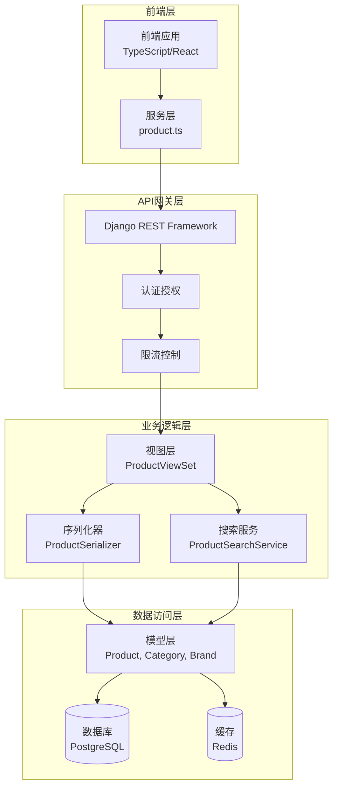

**图表来源**
- [backend/catalog/views.py](file://backend/catalog/views.py#L29-L50)
- [backend/catalog/serializers.py](file://backend/catalog/serializers.py#L50-L85)
- [backend/catalog/search.py](file://backend/catalog/search.py#L19-L45)

**章节来源**
- [backend/catalog/views.py](file://backend/catalog/views.py#L1-L50)
- [backend/catalog/urls.py](file://backend/catalog/urls.py#L1-L15)

## 核心组件分析

### ProductViewSet - 商品控制器

ProductViewSet是商品管理的核心控制器，继承自Django REST Framework的ModelViewSet，提供了完整的CRUD操作和高级查询功能：

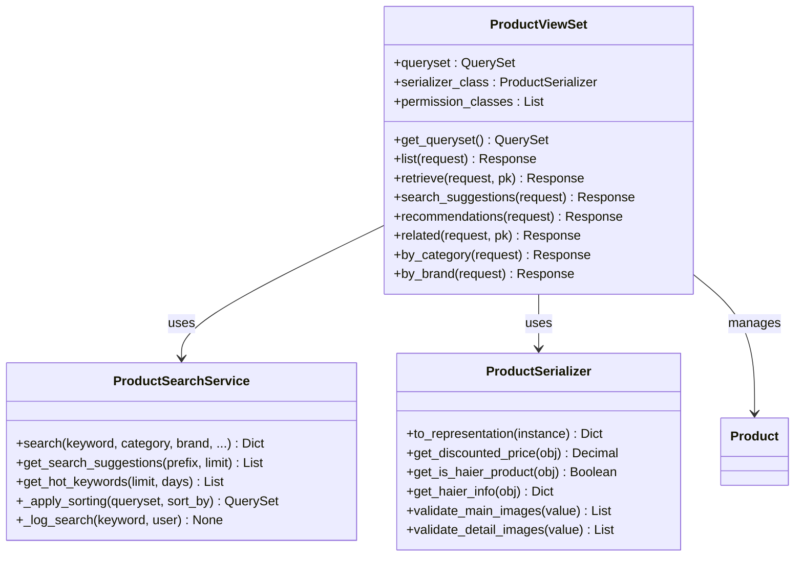

**图表来源**
- [backend/catalog/views.py](file://backend/catalog/views.py#L29-L50)
- [backend/catalog/search.py](file://backend/catalog/search.py#L19-L45)
- [backend/catalog/serializers.py](file://backend/catalog/serializers.py#L50-L85)

### 数据模型设计

系统采用关系型数据库设计，主要包含以下核心实体：

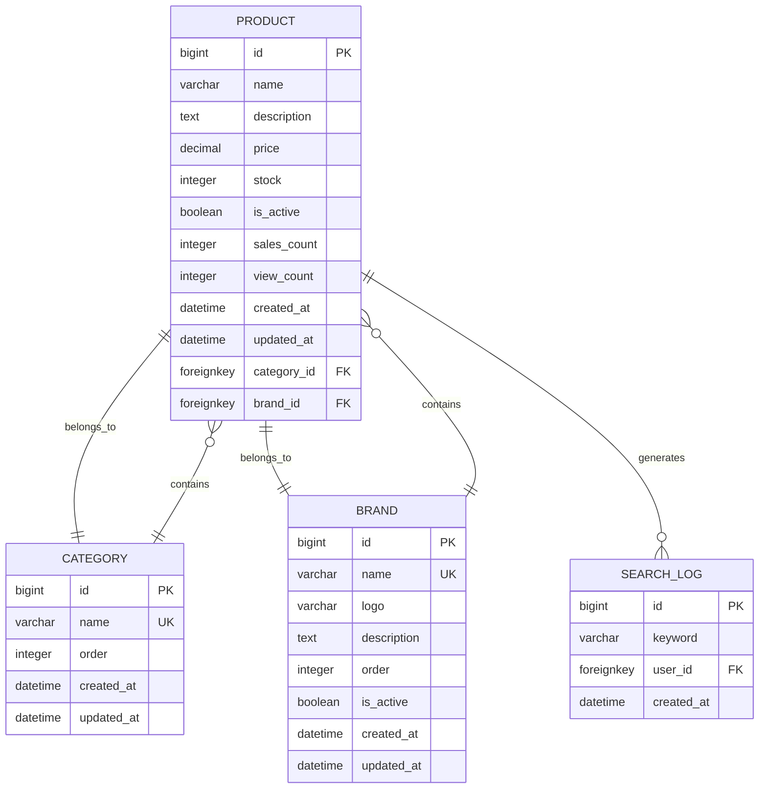

**图表来源**
- [backend/catalog/models.py](file://backend/catalog/models.py#L43-L113)

**章节来源**
- [backend/catalog/views.py](file://backend/catalog/views.py#L29-L50)
- [backend/catalog/models.py](file://backend/catalog/models.py#L43-L113)

## 商品列表API

### 接口概述

商品列表API提供了强大的多条件搜索和排序功能，支持实时筛选和分页展示：

| 参数名 | 类型 | 必填 | 描述 | 默认值 |
|--------|------|------|------|--------|
| search | string | 否 | 关键词搜索（产品名称和描述） | - |
| category | string | 否 | 按分类筛选 | - |
| brand | string | 否 | 按品牌筛选 | - |
| min_price | decimal | 否 | 最低价格过滤 | - |
| max_price | decimal | 否 | 最高价格过滤 | - |
| sort_by | string | 否 | 排序策略 | relevance |
| page | integer | 否 | 页码（从1开始） | 1 |
| page_size | integer | 否 | 每页结果数 | 20 |

### 支持的排序策略

| 排序选项 | 描述 | 排序依据 |
|----------|------|----------|
| relevance | 相关性排序 | 关键词匹配度优先，次为销量和浏览量 |
| price_asc | 价格升序 | 价格从小到大 |
| price_desc | 价格降序 | 价格从大到小 |
| sales | 销量排序 | 销量从高到低 |
| views | 浏览量排序 | 浏览量从高到低 |
| created | 创建时间排序 | 最新创建的商品优先 |

### 实现机制

商品列表功能通过ProductSearchService实现，支持复杂的查询组合：

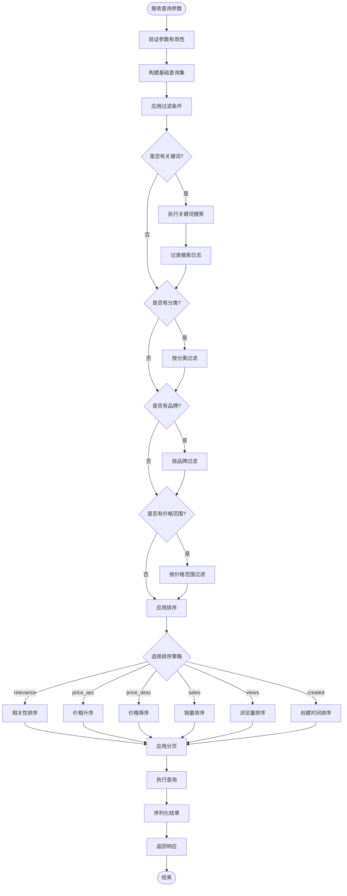

**图表来源**
- [backend/catalog/search.py](file://backend/catalog/search.py#L47-L158)

**章节来源**
- [backend/catalog/views.py](file://backend/catalog/views.py#L83-L131)
- [backend/catalog/search.py](file://backend/catalog/search.py#L47-L158)

## 商品详情API

### 接口特性

商品详情API提供了单个商品的完整信息展示，包括：

- 商品基本信息（名称、描述、价格等）
- 分类和品牌信息
- 主图和详情图展示
- 折扣价格计算
- 海尔商品特殊信息
- 相关统计数据

### 性能优化

系统采用select_related预加载关联数据，避免N+1查询问题：

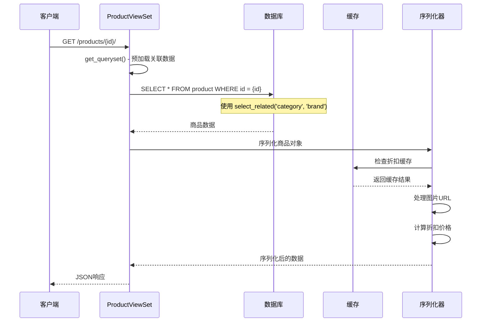

**图表来源**
- [backend/catalog/views.py](file://backend/catalog/views.py#L387-L395)
- [backend/catalog/serializers.py](file://backend/catalog/serializers.py#L122-L156)

**章节来源**
- [backend/catalog/views.py](file://backend/catalog/views.py#L387-L395)
- [backend/catalog/serializers.py](file://backend/catalog/serializers.py#L122-L156)

## 商品搜索功能

### 搜索服务架构

ProductSearchService提供了完整的搜索功能，支持关键词模糊匹配和多维度筛选：

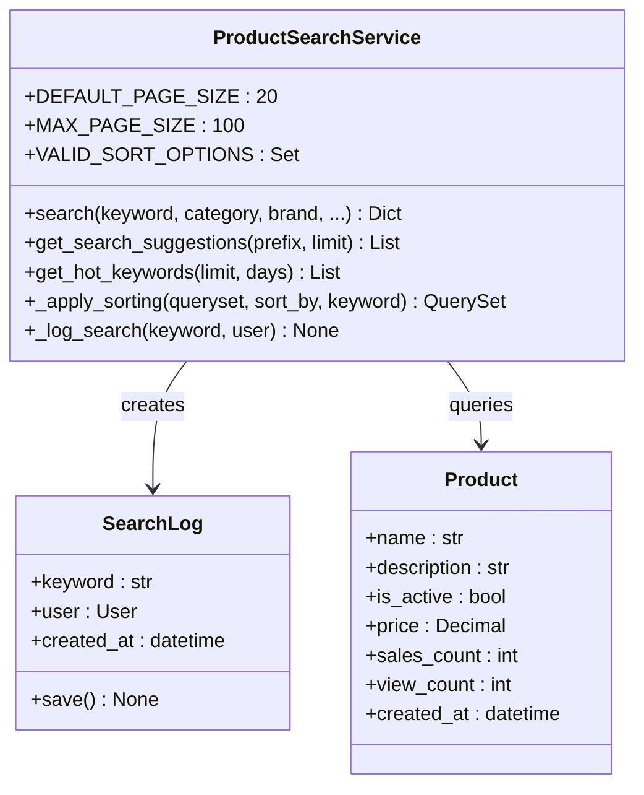

**图表来源**
- [backend/catalog/search.py](file://backend/catalog/search.py#L19-L45)

### 关键词搜索算法

系统实现了智能的关键词搜索算法，支持模糊匹配和相关性排序：

| 匹配级别 | 条件 | 权重 |
|----------|------|------|
| 2 | 名称完全匹配 | 最高 |
| 1 | 名称部分匹配 | 中等 |
| 0 | 描述匹配 | 较低 |

### 搜索建议功能

搜索建议功能通过组合商品名称和历史搜索记录提供智能建议：

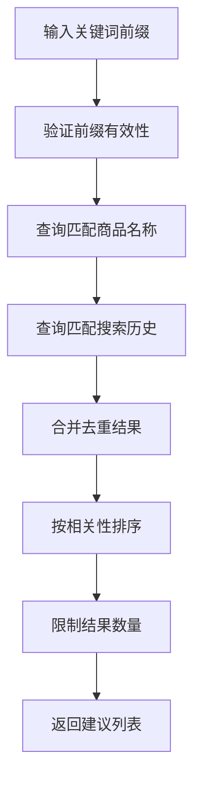

**图表来源**
- [backend/catalog/search.py](file://backend/catalog/search.py#L248-L282)

**章节来源**
- [backend/catalog/search.py](file://backend/catalog/search.py#L47-L158)
- [backend/catalog/search.py](file://backend/catalog/search.py#L248-L282)

## 商品推荐功能

### 推荐算法策略

系统提供了三种主要的推荐策略：

| 推荐类型 | 策略 | 适用场景 |
|----------|------|----------|
| popular | 基于销量排序 | 热销商品推荐 |
| trending | 基于浏览量排序 | 流行趋势推荐 |
| category | 基于分类筛选 | 类别相关推荐 |

### 推荐接口设计

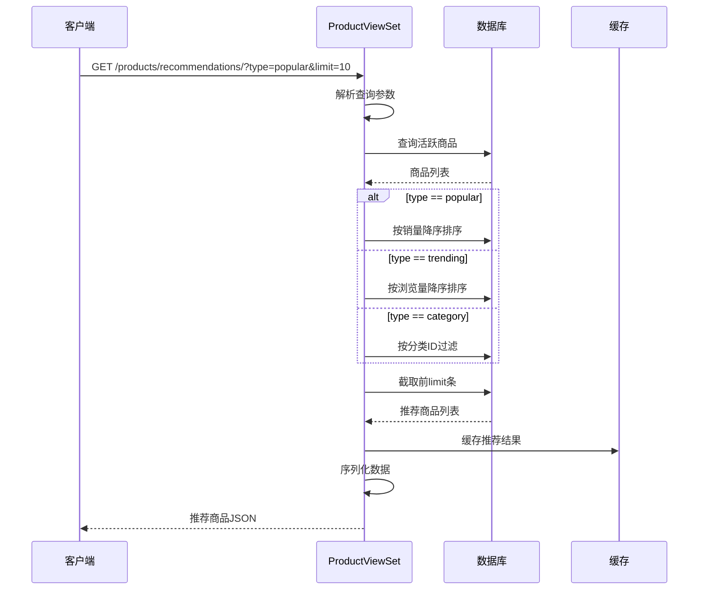

**图表来源**
- [backend/catalog/views.py](file://backend/catalog/views.py#L338-L385)

**章节来源**
- [backend/catalog/views.py](file://backend/catalog/views.py#L338-L385)

## 相关商品功能

### 相关商品算法

相关商品功能基于同一分类内的其他商品进行推荐：

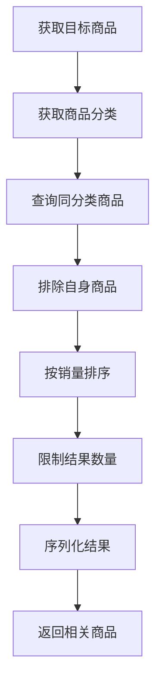

**图表来源**
- [backend/catalog/views.py](file://backend/catalog/views.py#L404-L433)

### 接口参数

| 参数名 | 类型 | 必填 | 描述 | 默认值 |
|--------|------|------|------|--------|
| limit | integer | 否 | 最大相关商品数量 | 10 |
| max | integer | 否 | 结果上限 | 50 |

**章节来源**
- [backend/catalog/views.py](file://backend/catalog/views.py#L404-L433)

## 分页机制

### 分页实现

系统采用标准的分页机制，支持灵活的页面大小配置：

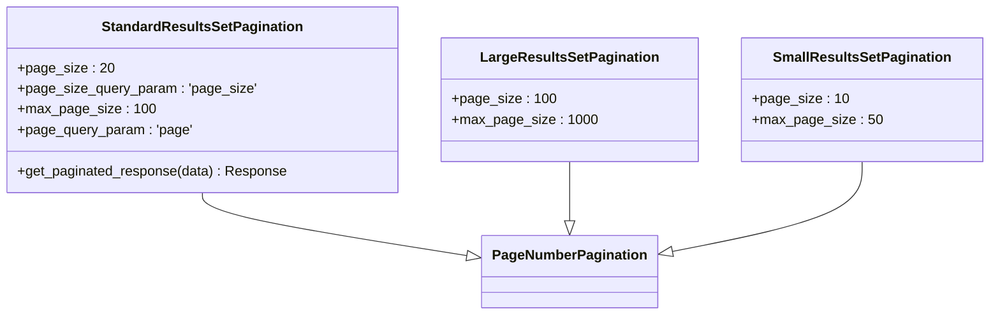

**图表来源**
- [backend/common/pagination.py](file://backend/common/pagination.py#L8-L42)

### 分页响应结构

所有分页接口都返回统一的响应格式：

| 字段名 | 类型 | 描述 |
|--------|------|------|
| results | Array | 当前页的结果数据 |
| total | Integer | 总记录数 |
| page | Integer | 当前页码 |
| total_pages | Integer | 总页数 |
| has_next | Boolean | 是否有下一页 |
| has_previous | Boolean | 是否有上一页 |

**章节来源**
- [backend/common/pagination.py](file://backend/common/pagination.py#L8-L42)

## 错误处理策略

### 统一错误响应格式

系统采用统一的错误响应格式，便于客户端处理：

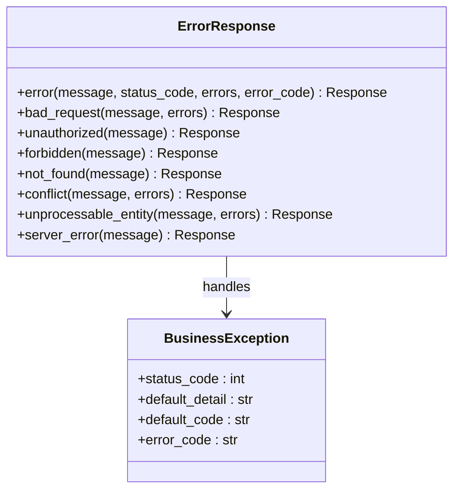

**图表来源**
- [backend/common/responses.py](file://backend/common/responses.py#L102-L146)
- [backend/common/exceptions.py](file://backend/common/exceptions.py#L26-L56)

### 错误类型分类

| 错误类型 | HTTP状态码 | 场景描述 |
|----------|------------|----------|
| Validation Error | 400 | 参数验证失败 |
| Authentication Error | 401 | 用户未认证 |
| Authorization Error | 403 | 权限不足 |
| Not Found | 404 | 资源不存在 |
| Conflict | 409 | 资源冲突 |
| Unprocessable Entity | 422 | 业务逻辑错误 |
| Internal Server Error | 500 | 服务器内部错误 |

**章节来源**
- [backend/common/responses.py](file://backend/common/responses.py#L102-L146)
- [backend/common/exceptions.py](file://backend/common/exceptions.py#L26-L56)

## 性能优化考虑

### 查询优化策略

1. **预加载关联数据**：使用select_related减少数据库查询次数
2. **索引优化**：为常用查询字段建立复合索引
3. **缓存策略**：对频繁访问的数据实施缓存
4. **分页优化**：避免大数据量全表扫描

### 缓存机制

系统在多个层面实施缓存策略：

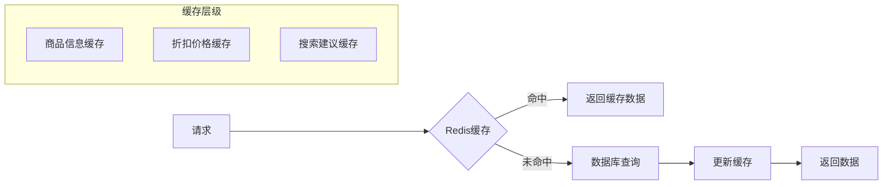

### 性能监控指标

| 指标类型 | 监控内容 | 优化目标 |
|----------|----------|----------|
| 响应时间 | API接口平均响应时间 | < 200ms |
| 并发能力 | 同时处理请求数量 | > 1000 QPS |
| 内存使用 | 缓存占用内存比例 | < 80% |
| 数据库负载 | 查询执行时间分布 | < 50ms |

## 实际调用示例

### 前端调用示例

以下是前端服务层的实际调用示例：

```typescript
// 获取商品列表
const products = await productService.getProducts({
  page: 1,
  page_size: 20,
  sort_by: 'sales',
  search: '冰箱',
  category: '家电',
  brand: '海尔',
  min_price: 1000,
  max_price: 5000
});

// 获取商品详情
const productDetail = await productService.getProductDetail(123);

// 获取推荐商品
const recommendations = await productService.getRecommendations({
  type: 'popular',
  limit: 10
});

// 获取相关商品
const relatedProducts = await productService.getRelatedProducts(123, 5);
```

### 后端API调用示例

```python
# 商品列表API调用
response = client.get('/api/products/', {
    'search': '智能手机',
    'category': '手机通讯',
    'sort_by': 'price_asc',
    'page': 1,
    'page_size': 20
})

# 商品推荐API调用
response = client.get('/api/products/recommendations/', {
    'type': 'trending',
    'limit': 5
})

# 相关商品API调用
response = client.get('/api/products/123/related/', {
    'limit': 8
})
```

### 错误处理示例

```python
# 处理搜索结果为空的情况
try:
    search_results = ProductSearchService.search(
        keyword='不存在的商品',
        page=1,
        page_size=10
    )
    if search_results['total'] == 0:
        # 返回空结果而非错误
        return Response({'results': [], 'total': 0})
except Exception as e:
    # 全局异常处理
    return ErrorResponse.server_error('搜索失败')
```

**章节来源**
- [frontend/src/services/product.ts](file://frontend/src/services/product.ts#L1-L64)

## 总结

本文档详细介绍了商品管理API系统的完整功能和实现细节。该系统具有以下特点：

### 核心优势

1. **功能完整性**：涵盖商品管理的全生命周期，从列表展示到详情查看
2. **查询灵活性**：支持多维度搜索和复杂排序策略
3. **性能优化**：采用多种优化技术确保高效响应
4. **错误处理**：统一的错误响应格式和完善的异常处理机制
5. **扩展性强**：模块化设计便于功能扩展和维护

### 技术亮点

- **智能搜索**：基于关键词的相关性排序和搜索建议
- **缓存策略**：多层次缓存提升系统性能
- **分页机制**：灵活的分页配置适应不同场景需求
- **权限控制**：细粒度的权限管理和访问控制
- **日志监控**：完善的日志记录和监控体系

### 应用价值

该商品管理API系统为企业级电商平台提供了坚实的技术基础，能够满足大规模商品数据的高效管理和用户友好的交互体验需求。通过合理的架构设计和性能优化，系统能够在保证功能完整性的同时，提供卓越的用户体验和稳定的系统性能。