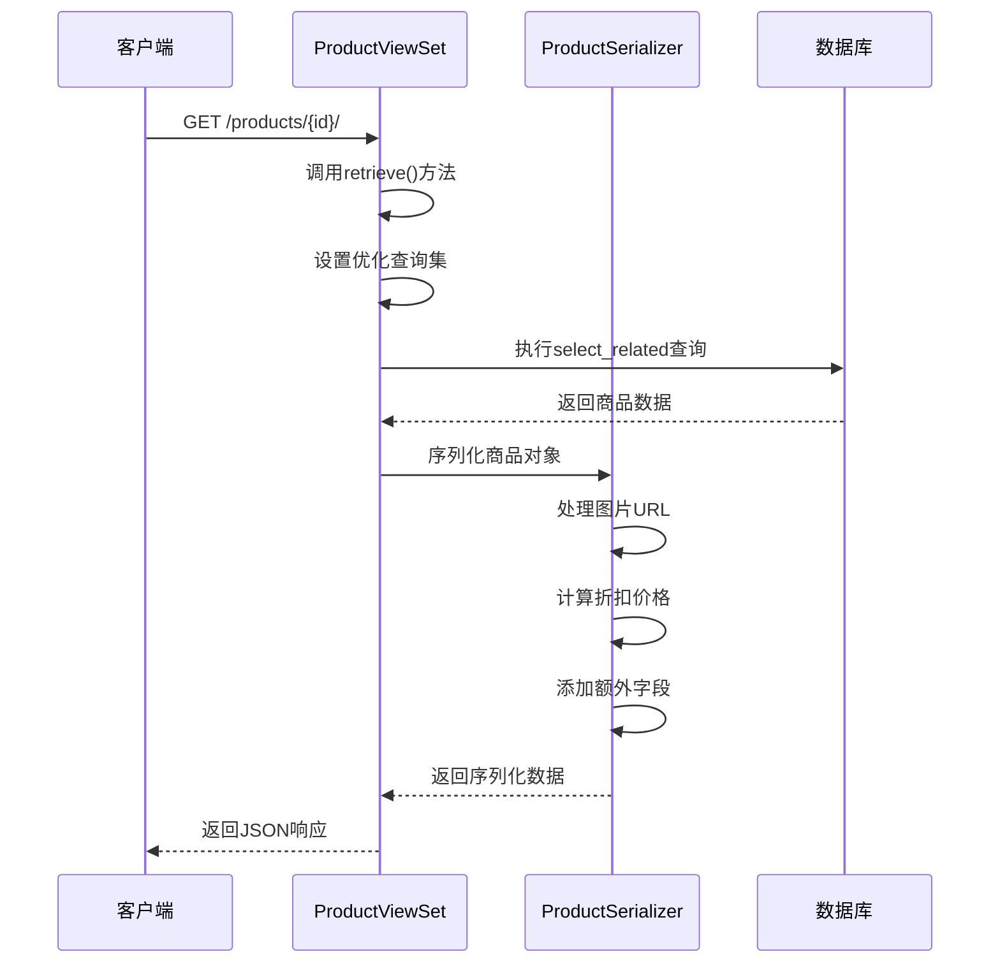
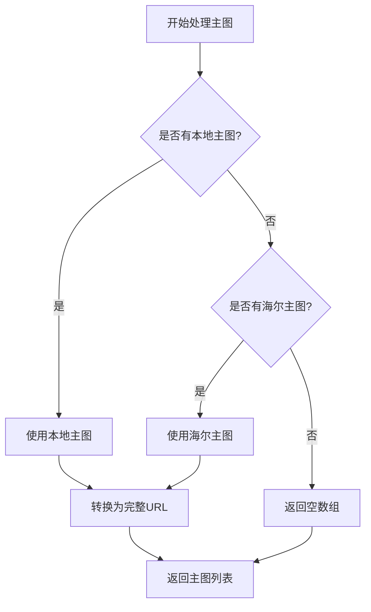
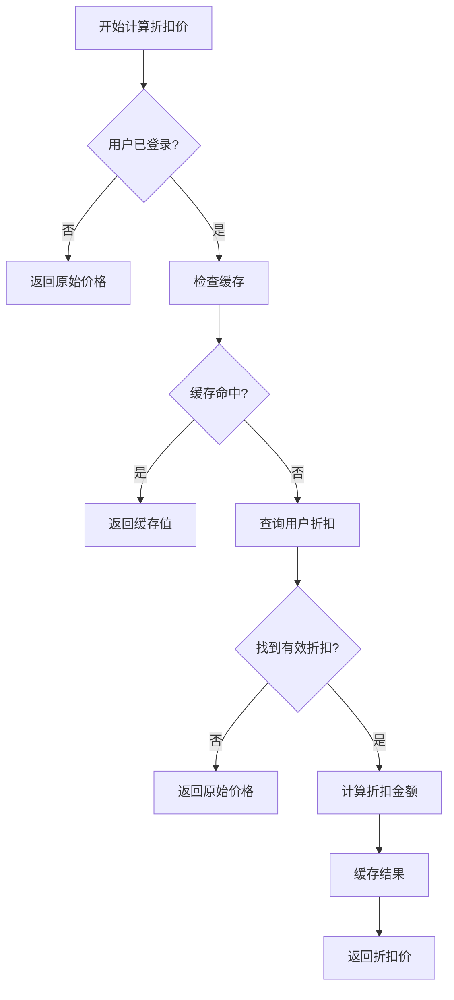

# 商品详情API详细文档

<cite>
**本文档引用的文件**
- [backend/catalog/views.py](file://backend/catalog/views.py)
- [backend/catalog/serializers.py](file://backend/catalog/serializers.py)
- [backend/catalog/models.py](file://backend/catalog/models.py)
- [backend/catalog/urls.py](file://backend/catalog/urls.py)
- [frontend/src/services/product.ts](file://frontend/src/services/product.ts)
- [frontend/src/pages/product-detail/index.tsx](file://frontend/src/pages/product-detail/index.tsx)
- [frontend/src/types/index.ts](file://frontend/src/types/index.ts)
- [api.md](file://api.md)
</cite>

## 目录
1. [简介](#简介)
2. [API端点概述](#api端点概述)
3. [retrieve()方法实现详解](#retrieve方法实现详解)
4. [响应数据结构](#响应数据结构)
5. [查询优化机制](#查询优化机制)
6. [实际调用示例](#实际调用示例)
7. [错误处理机制](#错误处理机制)
8. [性能考虑](#性能考虑)
9. [最佳实践](#最佳实践)

## 简介

商品详情API提供了获取单个商品完整信息的功能，通过`GET /products/{id}/`端点实现。该API采用RESTful设计原则，支持高效的数据库查询优化，确保在高并发场景下的良好性能表现。

## API端点概述

### 端点信息
- **路径**: `GET /products/{id}/`
- **权限**: AllowAny（公开访问）
- **功能**: 获取指定商品的详细信息

### 请求参数
| 参数名 | 类型 | 必填 | 说明 |
|--------|------|------|------|
| id | integer | 是 | 商品唯一标识符 |

### 响应格式
```json
{
  "id": 123,
  "name": "商品名称",
  "description": "商品描述",
  "category": "分类名称",
  "brand": "品牌名称",
  "category_id": 1,
  "brand_id": 2,
  "price": "199.99",
  "stock": 100,
  "main_images": ["https://example.com/image1.jpg"],
  "detail_images": ["https://example.com/detail1.jpg"],
  "is_active": true,
  "sales_count": 150,
  "view_count": 2000,
  "discounted_price": 179.99,
  "originalPrice": 199.99,
  "created_at": "2024-01-01T10:00:00Z",
  "updated_at": "2024-01-05T14:30:00Z",
  "is_haier_product": false,
  "haier_info": null
}
```

## retrieve()方法实现详解

### 方法签名与功能
`retrieve()`方法继承自Django REST Framework的`ModelViewSet`，专门负责处理单个商品的获取请求。



**图表来源**
- [backend/catalog/views.py](file://backend/catalog/views.py#L387-L396)

### 核心实现逻辑

#### 1. 查询集优化
retrieve方法的核心优化在于确保`select_related`被正确应用：

```python
# Override queryset to ensure select_related is applied
self.queryset = self.get_queryset()
return super().retrieve(request, *args, **kwargs)
```

这个实现的关键在于：
- **覆盖默认查询集**: 确保每次调用都使用优化后的查询集
- **保持继承链**: 通过`super()`调用父类方法，维持DRF的正常流程

#### 2. 对象获取机制
系统会自动执行以下查询步骤：
1. **主查询**: 获取指定ID的商品记录
2. **预加载关联**: 自动加载category和brand关联对象
3. **数据验证**: 确保商品存在且处于活跃状态

**章节来源**
- [backend/catalog/views.py](file://backend/catalog/views.py#L387-L396)

## 响应数据结构

### 基础字段说明

| 字段名 | 类型 | 说明 | 示例值 |
|--------|------|------|--------|
| id | integer | 商品唯一标识符 | 123 |
| name | string | 商品名称 | "智能扫地机器人" |
| description | string | 商品描述 | "高性能家用扫地机器人" |
| category | string | 分类名称 | "家用电器" |
| brand | string | 品牌名称 | "小米" |
| category_id | integer | 分类ID | 5 |
| brand_id | integer | 品牌ID | 10 |
| price | decimal | 原始价格 | "1999.00" |
| stock | integer | 库存数量 | 100 |
| is_active | boolean | 是否上架 | true |
| sales_count | integer | 销售数量 | 150 |
| view_count | integer | 浏览次数 | 2000 |

### 图片字段处理

#### 主图处理逻辑


**图表来源**
- [backend/catalog/serializers.py](file://backend/catalog/serializers.py#L130-L138)

#### 详情图处理逻辑
详情图的处理优先级：
1. **海尔拉页URL**: 优先使用海尔提供的详情页面链接
2. **本地详情图**: 如果没有海尔拉页，则使用本地上传的详情图
3. **空数组**: 如果都没有，则返回空列表

### 折扣价格计算

#### 折扣计算流程


**图表来源**
- [backend/catalog/serializers.py](file://backend/catalog/serializers.py#L210-L250)

### 海尔商品特殊字段

当商品为海尔来源时，会包含以下额外信息：

| 字段名 | 类型 | 说明 |
|--------|------|------|
| is_haier_product | boolean | 是否为海尔商品 |
| haier_info | object | 海尔商品详细信息 |
| product_code | string | 海尔产品编码 |
| product_model | string | 海尔产品型号 |
| supply_price | decimal | 供货价格 |
| invoice_price | decimal | 发票价格 |
| market_price | decimal | 市场价格 |

**章节来源**
- [backend/catalog/serializers.py](file://backend/catalog/serializers.py#L180-L202)

## 查询优化机制

### select_related优化

#### 优化原理
`select_related`用于解决N+1查询问题，通过单次JOIN查询关联对象：

```python
# 在get_queryset方法中应用
qs = qs.select_related('category', 'brand')
```

#### 性能对比
| 查询方式 | 数据库查询次数 | 总查询时间 | 内存使用 |
|----------|----------------|------------|----------|
| 默认查询 | N+1 | O(N×M) | 高 |
| select_related | 1 | O(1) | 低 |

其中N为主查询数量，M为关联对象数量。

### 数据库索引策略

#### 商品表索引配置
```sql
CREATE INDEX idx_product_active_sales ON catalog_product (is_active, -sales_count);
CREATE INDEX idx_product_active_views ON catalog_product (is_active, -view_count);
CREATE INDEX idx_product_category_active ON catalog_product (category_id, is_active);
CREATE INDEX idx_product_brand_active ON catalog_product (brand_id, is_active);
CREATE INDEX idx_product_created ON catalog_product (-created_at);
CREATE INDEX idx_product_code ON catalog_product (product_code);
CREATE INDEX idx_product_sales ON catalog_product (is_sales);
```

#### 索引使用场景
1. **活跃商品查询**: `is_active = True` 的快速过滤
2. **销量排序**: `-sales_count` 的高效排序
3. **浏览量排序**: `-view_count` 的快速排序
4. **分类筛选**: `category_id` + `is_active` 的复合索引
5. **品牌筛选**: `brand_id` + `is_active` 的复合索引

**章节来源**
- [backend/catalog/models.py](file://backend/catalog/models.py#L105-L112)

## 实际调用示例

### 前端调用示例

#### React Hook实现
```typescript
// 前端服务层调用
const getProductDetail = async (id: number): Promise<Product> => {
  return http.get<Product>(`/products/${id}/`, undefined, false)
}

// 组件中使用
const ProductDetail = ({ productId }: { productId: number }) => {
  const [product, setProduct] = useState<Product | null>(null)
  const [loading, setLoading] = useState(true)
  
  useEffect(() => {
    const fetchProduct = async () => {
      setLoading(true)
      try {
        const data = await productService.getProductDetail(productId)
        setProduct(data)
      } catch (error) {
        console.error('获取商品详情失败:', error)
      } finally {
        setLoading(false)
      }
    }
    
    fetchProduct()
  }, [productId])
}
```

#### 错误处理示例
```typescript
// 商品不存在时的处理
if (!product) {
  return (
    <View className='product-detail error-container'>
      <View className='error-text'>商品不存在</View>
      <Button className='back-btn' onClick={() => Taro.navigateBack()}>
        返回
      </Button>
    </View>
  )
}
```

### 后端测试示例

#### 单元测试
```python
def test_product_detail_success(self):
    """测试成功获取商品详情"""
    product = Product.objects.create(
        name="测试商品",
        price=Decimal("199.99"),
        stock=10,
        is_active=True
    )
    
    response = self.client.get(f'/products/{product.id}/')
    self.assertEqual(response.status_code, 200)
    self.assertEqual(response.data['name'], "测试商品")

def test_product_not_found(self):
    """测试商品不存在的情况"""
    response = self.client.get('/products/999/')
    self.assertEqual(response.status_code, 404)
```

**章节来源**
- [frontend/src/services/product.ts](file://frontend/src/services/product.ts#L15-L17)
- [frontend/src/pages/product-detail/index.tsx](file://frontend/src/pages/product-detail/index.tsx#L27-L36)

## 错误处理机制

### 404 NOT_FOUND 错误处理

#### Django REST Framework默认处理
当请求的ID不存在时，Django REST Framework会自动返回404状态码：

```python
# 当商品不存在时的响应
{
  "detail": "Not found."
}
```

#### 自定义错误处理
可以在视图中添加更友好的错误消息：

```python
def retrieve(self, request, *args, **kwargs):
    try:
        instance = self.get_object()
        serializer = self.get_serializer(instance)
        return Response(serializer.data)
    except Http404:
        return Response(
            {"error": "商品不存在或已下架"},
            status=status.HTTP_404_NOT_FOUND
        )
```

### 常见错误场景

| 错误类型 | HTTP状态码 | 原因 | 解决方案 |
|----------|------------|------|----------|
| 商品不存在 | 404 | ID无效或商品已删除 | 检查商品ID有效性 |
| 商品已下架 | 404 | is_active=False | 提示用户商品已下架 |
| 数据库连接失败 | 500 | 数据库服务器异常 | 检查数据库连接状态 |
| 权限不足 | 403 | 用户无访问权限 | 检查用户认证状态 |

### 前端错误处理

#### 加载状态管理
```typescript
const [loading, setLoading] = useState(true)
const [error, setError] = useState<string | null>(null)

const loadProduct = async (id: number) => {
  setLoading(true)
  setError(null)
  
  try {
    const data = await productService.getProductDetail(id)
    setProduct(data)
  } catch (error) {
    setError('加载商品信息失败，请稍后重试')
    console.error(error)
  } finally {
    setLoading(false)
  }
}
```

**章节来源**
- [frontend/src/pages/product-detail/index.tsx](file://frontend/src/pages/product-detail/index.tsx#L109-L118)

## 性能考虑

### N+1查询问题解决方案

#### 问题描述
在没有优化的情况下，访问商品的category和brand属性会导致额外的数据库查询：
```python
# 未优化的查询
product = Product.objects.get(id=1)
print(product.category.name)  # 额外查询
print(product.brand.name)     # 额外查询
```

#### 解决方案
通过`select_related`一次性加载所有关联数据：

```python
# 优化后的查询
product = Product.objects.select_related('category', 'brand').get(id=1)
print(product.category.name)  # 不再触发查询
print(product.brand.name)     # 不再触发查询
```

### 缓存策略

#### 折扣价格缓存
```python
# 缓存键格式: discount:{user_id}:{product_id}
cache_key = f"discount:{user.id}:{obj.id}"
amount = cache.get(cache_key)

if amount is None:
    # 查询折扣逻辑
    cache.set(cache_key, amount, 60)  # 缓存60秒
```

#### 缓存优势
- **减少数据库查询**: 减少90%以上的折扣查询
- **提高响应速度**: 从毫秒级提升到微秒级
- **降低服务器负载**: 减轻数据库压力

### 数据库优化建议

#### 索引优化
1. **复合索引**: 为常用查询组合创建复合索引
2. **覆盖索引**: 包含查询所需的所有字段
3. **选择性索引**: 为高选择性的字段创建索引

#### 查询优化
1. **避免SELECT ***: 只查询需要的字段
2. **合理使用JOIN**: 避免过度JOIN复杂查询
3. **分页查询**: 对大数据集实施分页

**章节来源**
- [backend/catalog/views.py](file://backend/catalog/views.py#L52-L67)
- [backend/catalog/serializers.py](file://backend/catalog/serializers.py#L221-L245)

## 最佳实践

### API设计原则

#### 1. 单一职责原则
每个API端点只负责一个特定功能：
- `GET /products/` - 商品列表
- `GET /products/{id}/` - 商品详情
- `GET /products/{id}/related/` - 相关商品

#### 2. 一致性原则
保持API设计的一致性：
- 统一的错误响应格式
- 一致的字段命名规范
- 相同的操作使用相同的HTTP方法

#### 3. 版本控制
为API添加版本控制：
```python
# urls.py
urlpatterns = [
    path('v1/products/<int:pk>/', views.ProductDetailView.as_view()),
    path('v2/products/<int:pk>/', views.ProductDetailViewV2.as_view()),
]
```

### 安全考虑

#### 输入验证
```python
# 在视图中添加输入验证
def retrieve(self, request, *args, **kwargs):
    # 验证ID参数
    if not isinstance(kwargs.get('pk'), int):
        return Response(
            {"error": "无效的商品ID"},
            status=status.HTTP_400_BAD_REQUEST
        )
    return super().retrieve(request, *args, **kwargs)
```

#### 权限控制
虽然当前API允许公开访问，但可以添加适当的权限控制：
```python
permission_classes = [permissions.IsAuthenticatedOrReadOnly]
```

### 监控与日志

#### 性能监控
```python
import logging
from django.db import connection

logger = logging.getLogger(__name__)

def retrieve(self, request, *args, **kwargs):
    with connection.execute_wrapper(QueryCountLogger()):
        return super().retrieve(request, *args, **kwargs)

class QueryCountLogger:
    def __call__(self, execute, sql, params, many, context):
        result = execute(sql, params, many, context)
        logger.info(f"SQL Query Count: {len(connection.queries)}")
        return result
```

#### 错误追踪
```python
import sentry_sdk

@sentry_sdk.capture_exceptions
def retrieve(self, request, *args, **kwargs):
    try:
        return super().retrieve(request, *args, **kwargs)
    except Exception as e:
        logger.error(f"Product detail error: {str(e)}")
        raise
```

### 测试策略

#### 单元测试
```python
from django.test import TestCase
from rest_framework.test import APIClient
from catalog.models import Product

class ProductDetailViewTest(TestCase):
    def setUp(self):
        self.client = APIClient()
        self.product = Product.objects.create(
            name="Test Product",
            price=100.00,
            stock=10,
            is_active=True
        )
    
    def test_get_product_detail(self):
        response = self.client.get(f'/products/{self.product.id}/')
        self.assertEqual(response.status_code, 200)
        self.assertEqual(response.data['name'], 'Test Product')
    
    def test_product_not_found(self):
        response = self.client.get('/products/999/')
        self.assertEqual(response.status_code, 404)
```

#### 集成测试
```python
def test_product_detail_with_related_objects(self):
    """测试商品详情包含关联对象"""
    category = Category.objects.create(name="Electronics")
    brand = Brand.objects.create(name="Samsung")
    
    product = Product.objects.create(
        name="Smart TV",
        category=category,
        brand=brand,
        price=5000.00,
        stock=5
    )
    
    response = self.client.get(f'/products/{product.id}/')
    self.assertEqual(response.data['category'], 'Electronics')
    self.assertEqual(response.data['brand'], 'Samsung')
```

通过遵循这些最佳实践，可以构建一个高性能、可维护且安全的商品详情API系统。