# 支付API详细文档

<cite>
**本文档引用的文件**
- [frontend/src/services/payment.ts](file://frontend/src/services/payment.ts)
- [backend/orders/views.py](file://backend/orders/views.py)
- [backend/orders/models.py](file://backend/orders/models.py)
- [backend/orders/payment_service.py](file://backend/orders/payment_service.py)
- [backend/orders/state_machine.py](file://backend/orders/state_machine.py)
- [backend/orders/urls.py](file://backend/orders/urls.py)
- [backend/orders/serializers.py](file://backend/orders/serializers.py)
- [backend/orders/services.py](file://backend/orders/services.py)
- [api.md](file://api.md)
</cite>

## 目录
1. [概述](#概述)
2. [支付模型架构](#支付模型架构)
3. [支付生命周期管理](#支付生命周期管理)
4. [支付状态机设计](#支付状态机设计)
5. [支付API端点详解](#支付api端点详解)
6. [第三方支付回调处理](#第三方支付回调处理)
7. [支付与订单状态联动](#支付与订单状态联动)
8. [安全验证机制](#安全验证机制)
9. [库存管理与支付联动](#库存管理与支付联动)
10. [错误处理与最佳实践](#错误处理与最佳实践)

## 概述

本支付系统采用RESTful API设计，提供完整的支付生命周期管理功能。系统支持多种支付方式（微信支付、支付宝、银行卡），具备完善的状态机控制和第三方回调处理机制。

### 核心特性

- **多支付方式支持**：微信支付、支付宝、银行卡
- **完整生命周期**：从创建到完成的全流程管理
- **状态机控制**：严格的支付状态转换规则
- **第三方回调**：安全可靠的支付结果通知
- **库存联动**：支付成功/失败自动调整库存
- **订单状态同步**：支付状态与订单状态实时同步

## 支付模型架构

支付系统基于Django ORM构建，核心模型包含支付记录和相关业务逻辑。

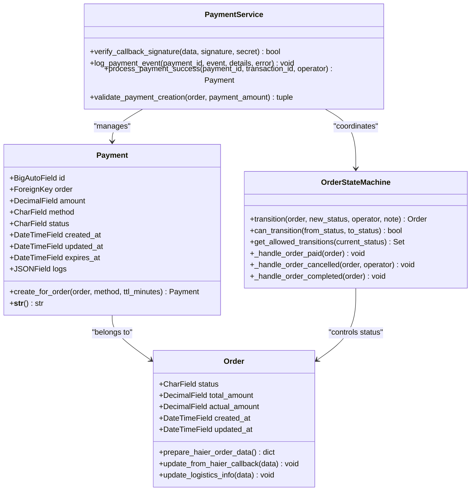

**图表来源**
- [backend/orders/models.py](file://backend/orders/models.py#L186-L234)
- [backend/orders/payment_service.py](file://backend/orders/payment_service.py#L20-L50)
- [backend/orders/state_machine.py](file://backend/orders/state_machine.py#L25-L100)

**章节来源**
- [backend/orders/models.py](file://backend/orders/models.py#L186-L234)
- [backend/orders/payment_service.py](file://backend/orders/payment_service.py#L1-L50)

## 支付生命周期管理

支付生命周期包含创建、启动、处理和完成四个主要阶段，每个阶段都有明确的状态转换规则。

### 支付状态流转图

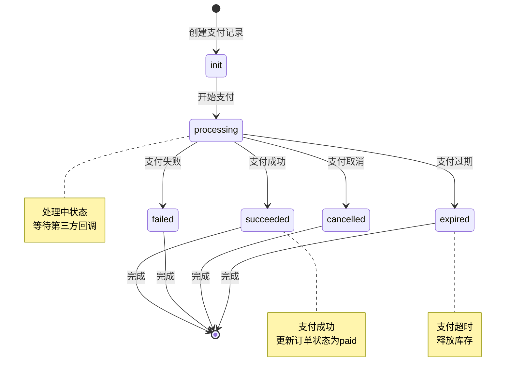

**图表来源**
- [backend/orders/models.py](file://backend/orders/models.py#L192-L198)
- [backend/orders/state_machine.py](file://backend/orders/state_machine.py#L33-L56)

### 支付状态定义

| 状态 | 英文 | 描述 | 允许的操作 |
|------|------|------|------------|
| 待支付 | init | 支付记录已创建，等待开始支付 | 开始支付、删除 |
| 处理中 | processing | 正在进行支付处理 | 等待回调 |
| 支付成功 | succeeded | 支付完成，订单状态更新为待发货 | 无 |
| 支付失败 | failed | 支付过程中发生错误 | 重新支付 |
| 已取消 | cancelled | 用户主动取消支付 | 重新支付 |
| 已过期 | expired | 支付超时未完成 | 重新支付 |

**章节来源**
- [backend/orders/models.py](file://backend/orders/models.py#L192-L198)

## 支付状态机设计

支付状态机确保支付状态转换的合法性和一致性，防止非法状态转换。

### 状态转换规则

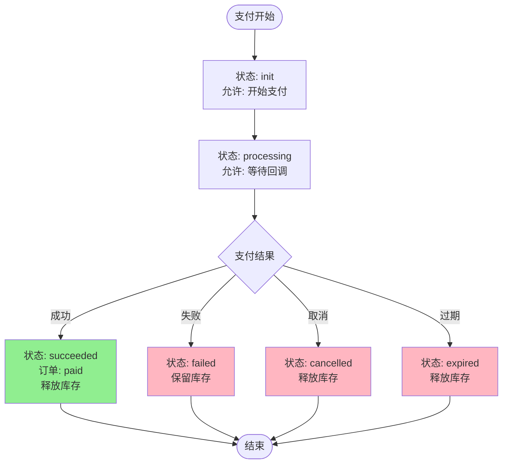

**图表来源**
- [backend/orders/state_machine.py](file://backend/orders/state_machine.py#L33-L56)

### 状态转换验证

系统通过状态机严格验证状态转换的合法性：

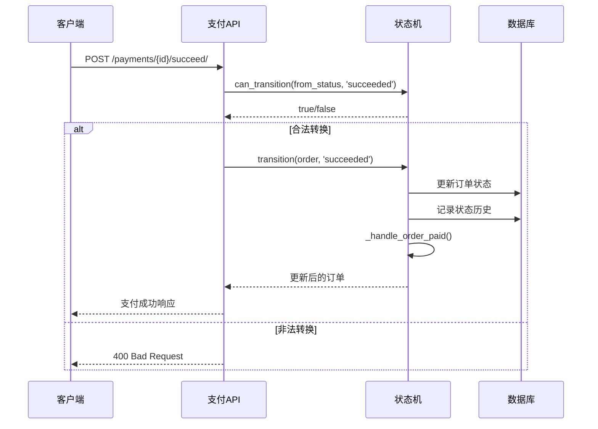

**图表来源**
- [backend/orders/state_machine.py](file://backend/orders/state_machine.py#L59-L154)

**章节来源**
- [backend/orders/state_machine.py](file://backend/orders/state_machine.py#L25-L154)

## 支付API端点详解

### 支付记录CRUD操作

#### 1. 获取支付记录列表

**端点**: `GET /payments/`
**权限**: `IsAuthenticated`
**功能**: 获取支付记录列表，支持按订单筛选

**请求参数**:
- `order_id` (可选): 按订单ID筛选
- `page` (可选): 页码，默认1
- `page_size` (可选): 每页数量，默认20

**响应**: 分页的支付记录列表

#### 2. 创建支付记录

**端点**: `POST /payments/`
**权限**: `IsAuthenticated`
**功能**: 为指定订单创建新的支付记录

**请求体**:
```json
{
    "order_id": 123,
    "method": "wechat",  // 可选，默认为wechat
    "amount": "100.00"   // 可选，如果提供则验证与订单金额一致
}
```

**响应**: 创建的支付记录对象

#### 3. 开始支付

**端点**: `POST /payments/{id}/start/`
**权限**: `IsOwnerOrAdmin`
**功能**: 开始支付流程，状态变更为processing

**响应**: 更新后的支付记录（状态为 `processing`）

#### 4. 支付成功

**端点**: `POST /payments/{id}/succeed/`
**权限**: `IsOwnerOrAdmin`
**功能**: 标记支付成功，自动更新订单状态为 `paid`

**响应**: 更新后的支付记录（状态为 `succeeded`）

#### 5. 支付失败

**端点**: `POST /payments/{id}/fail/`
**权限**: `IsOwnerOrAdmin`
**功能**: 标记支付失败

**响应**: 更新后的支付记录（状态为 `failed`）

#### 6. 取消支付

**端点**: `POST /payments/{id}/cancel/`
**权限**: `IsOwnerOrAdmin`
**功能**: 取消支付

**响应**: 更新后的支付记录（状态为 `cancelled`）

#### 7. 支付过期

**端点**: `POST /payments/{id}/expire/`
**权限**: `IsOwnerOrAdmin`
**功能**: 标记支付过期，自动更新订单状态为 `cancelled` 并释放库存

**响应**: 更新后的支付记录（状态为 `expired`）

**章节来源**
- [api.md](file://api.md#L290-L333)
- [frontend/src/services/payment.ts](file://frontend/src/services/payment.ts#L1-L52)

## 第三方支付回调处理

系统提供统一的第三方支付回调接口，支持多种支付提供商的安全验证和业务处理。

### 回调接口设计

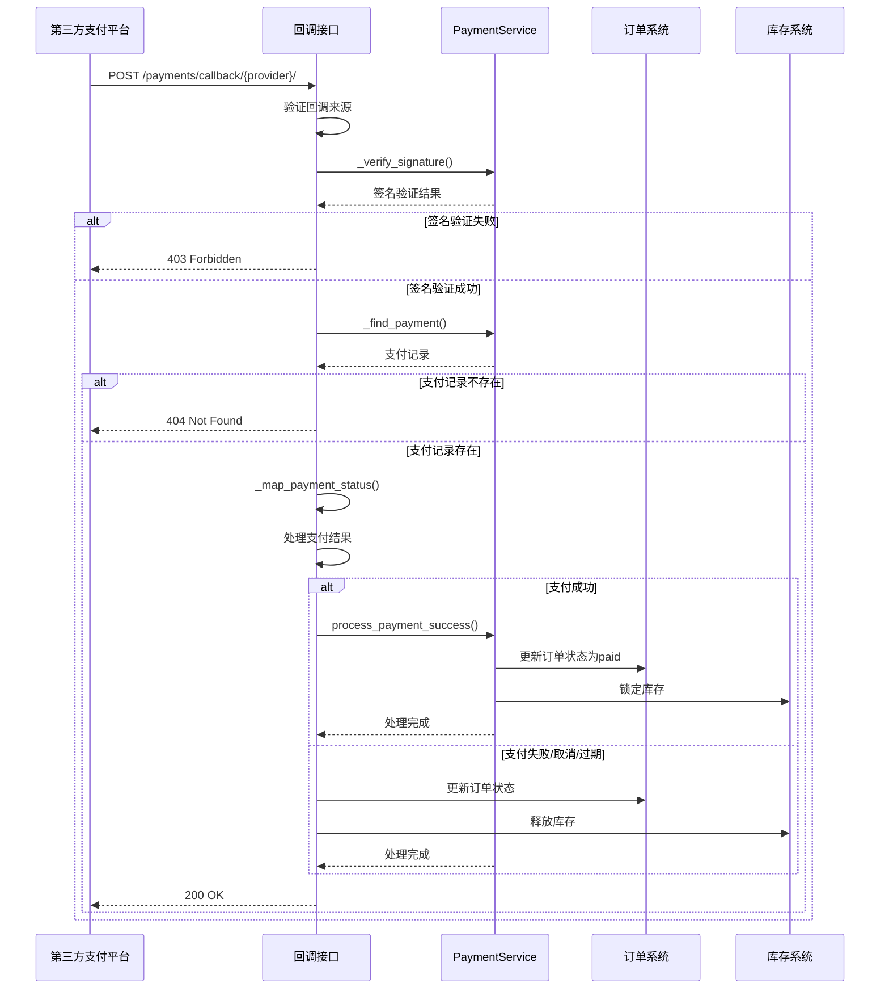

**图表来源**
- [backend/orders/views.py](file://backend/orders/views.py#L1134-L1294)
- [backend/orders/payment_service.py](file://backend/orders/payment_service.py#L30-L80)

### 支付提供商支持

| 提供商 | 状态映射 | 签名验证 | 开发环境支持 |
|--------|----------|----------|--------------|
| mock | 自定义状态映射 | 跳过验证 | 是 |
| wechat | SUCCESS → succeeded | HMAC-SHA256 | 仅DEBUG模式 |
| alipay | trade_success → succeeded | HMAC-SHA256 | 否 |

### 回调数据处理流程

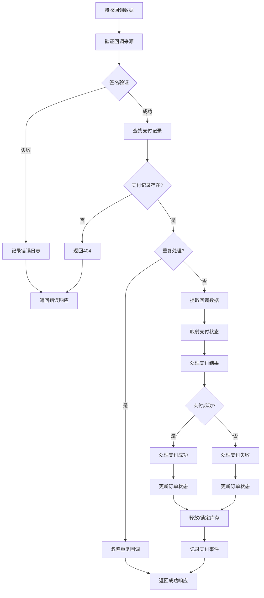

**图表来源**
- [backend/orders/views.py](file://backend/orders/views.py#L1166-L1367)

### 安全验证机制

#### 1. 签名验证

系统使用HMAC-SHA256算法验证回调数据的真实性：

```python
# 签名验证示例流程
sorted_params = sorted(data.items())
sign_str = '&'.join([f'{k}={v}' for k, v in sorted_params])
expected_signature = hmac.new(
    secret.encode('utf-8'),
    sign_str.encode('utf-8'),
    hashlib.sha256
).hexdigest()
```

#### 2. 防重复处理

系统通过检查支付状态防止重复处理已成功的支付：

```python
if payment.status == 'succeeded':
    logger.warning(f'支付记录已处理过: payment_id={payment.id}')
    return Response(PaymentSerializer(payment).data)
```

#### 3. 支付状态映射

不同支付提供商的状态值需要映射到统一的内部状态：

```python
# 微信支付状态映射
mapping = {
    'SUCCESS': 'succeeded',
    'FAIL': 'failed',
    'CLOSED': 'cancelled',
    'NOTPAY': 'processing'
}
```

**章节来源**
- [backend/orders/views.py](file://backend/orders/views.py#L1134-L1367)
- [backend/orders/payment_service.py](file://backend/orders/payment_service.py#L30-L80)

## 支付与订单状态联动

支付状态的成功与否直接影响订单状态的流转，系统通过状态机实现两者之间的同步。

### 订单状态转换图

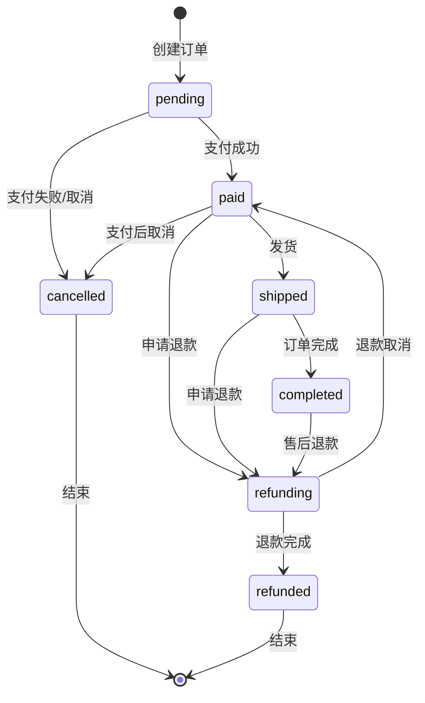

**图表来源**
- [backend/orders/state_machine.py](file://backend/orders/state_machine.py#L33-L56)

### 状态联动业务逻辑

#### 1. 支付成功时的订单状态更新

当支付成功时，系统自动将订单状态更新为"待发货"（paid）：

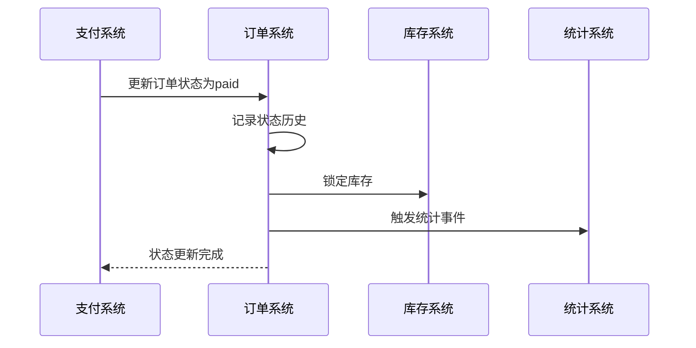

**图表来源**
- [backend/orders/state_machine.py](file://backend/orders/state_machine.py#L180-L208)

#### 2. 支付失败/取消时的库存释放

当支付失败、取消或过期时，系统自动释放锁定的库存：

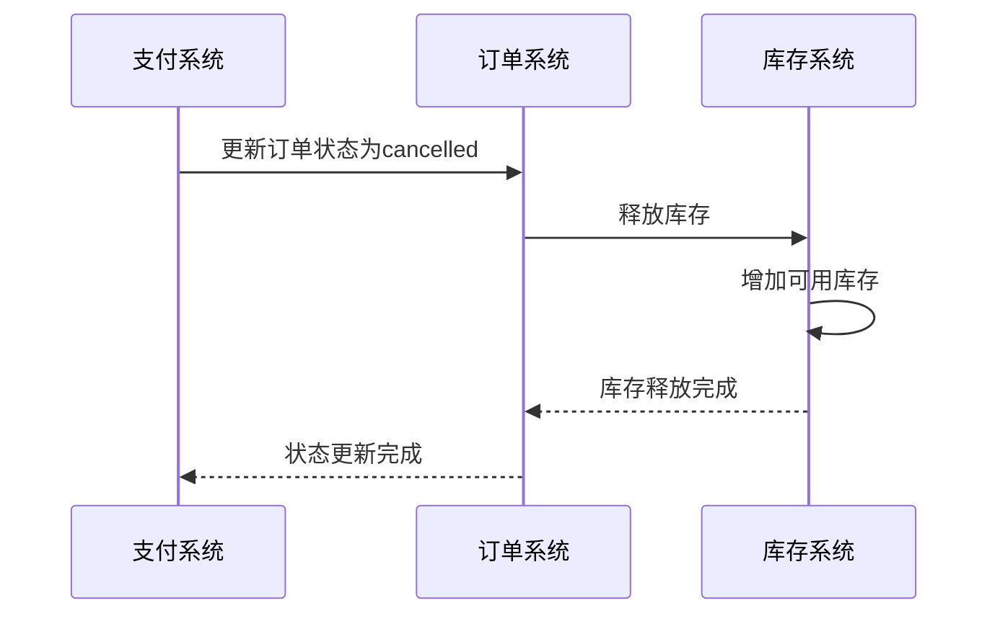

**图表来源**
- [backend/orders/state_machine.py](file://backend/orders/state_machine.py#L212-L232)

### 库存管理策略

系统采用乐观锁机制管理库存：

```python
# 库存释放示例
@transaction.atomic
def release_stock(product_id: int, quantity: int, reason: str):
    product = Product.objects.select_for_update().get(id=product_id)
    product.stock = F('stock') + quantity
    product.save(update_fields=['stock'])
    
    # 记录库存变更日志
    InventoryLog.objects.create(
        product=product,
        change_type='release',
        quantity=quantity,
        reason=reason
    )
```

**章节来源**
- [backend/orders/state_machine.py](file://backend/orders/state_machine.py#L180-L288)
- [backend/orders/services.py](file://backend/orders/services.py#L374-L499)

## 安全验证机制

支付系统实现了多层次的安全验证机制，确保支付过程的安全性。

### 1. 接口权限控制

- **认证要求**: 所有支付相关接口都需要用户认证
- **权限验证**: `IsOwnerOrAdmin`权限确保用户只能操作自己的支付记录
- **速率限制**: 使用`PaymentRateThrottle`防止恶意请求

### 2. 回调签名验证

#### HMAC-SHA256签名算法

系统使用标准的HMAC-SHA256算法验证回调数据：

```python
def verify_callback_signature(data: Dict, signature: str, secret: str) -> bool:
    """验证支付回调签名"""
    sorted_params = sorted(data.items())
    sign_str = '&'.join([f'{k}={v}' for k, v in sorted_params])
    
    expected_signature = hmac.new(
        secret.encode('utf-8'),
        sign_str.encode('utf-8'),
        hashlib.sha256
    ).hexdigest()
    
    return hmac.compare_digest(signature, expected_signature)
```

#### 签名验证流程

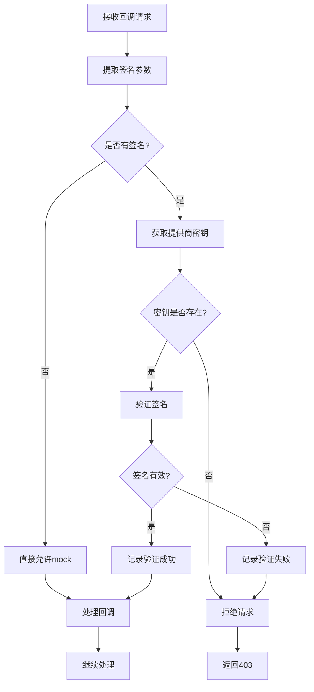

**图表来源**
- [backend/orders/views.py](file://backend/orders/views.py#L1334-L1367)

### 3. 防重复处理机制

系统通过检查支付状态防止重复处理：

```python
# 防重复处理逻辑
if payment.status == 'succeeded':
    logger.warning(f'支付记录已处理过: payment_id={payment.id}')
    PaymentService.log_payment_event(
        payment.id,
        'duplicate_callback_ignored',
        details={'provider': provider}
    )
    return Response(PaymentSerializer(payment).data)
```

### 4. 事务处理

所有支付相关的数据库操作都在事务中执行，确保数据一致性：

```python
@transaction.atomic
def process_payment_success(payment_id: int, transaction_id: str):
    """处理支付成功，使用事务保证原子性"""
    payment = Payment.objects.select_for_update().get(id=payment_id)
    # 支付成功处理逻辑
    payment.save()
```

**章节来源**
- [backend/orders/views.py](file://backend/orders/views.py#L1180-L1294)
- [backend/orders/payment_service.py](file://backend/orders/payment_service.py#L30-L80)

## 库存管理与支付联动

支付系统与库存管理系统深度集成，确保支付成功时锁定库存，支付失败时释放库存。

### 库存管理架构

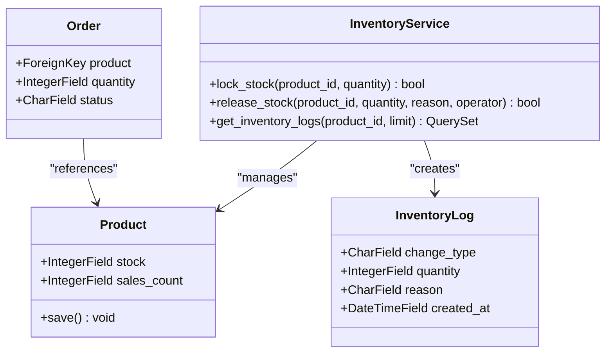

**图表来源**
- [backend/orders/services.py](file://backend/orders/services.py#L374-L499)

### 库存操作流程

#### 1. 支付成功时的库存锁定

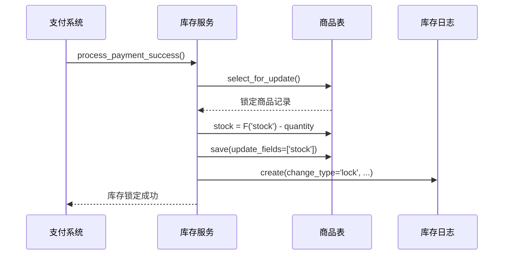

**图表来源**
- [backend/orders/services.py](file://backend/orders/services.py#L374-L408)

#### 2. 支付失败/取消时的库存释放

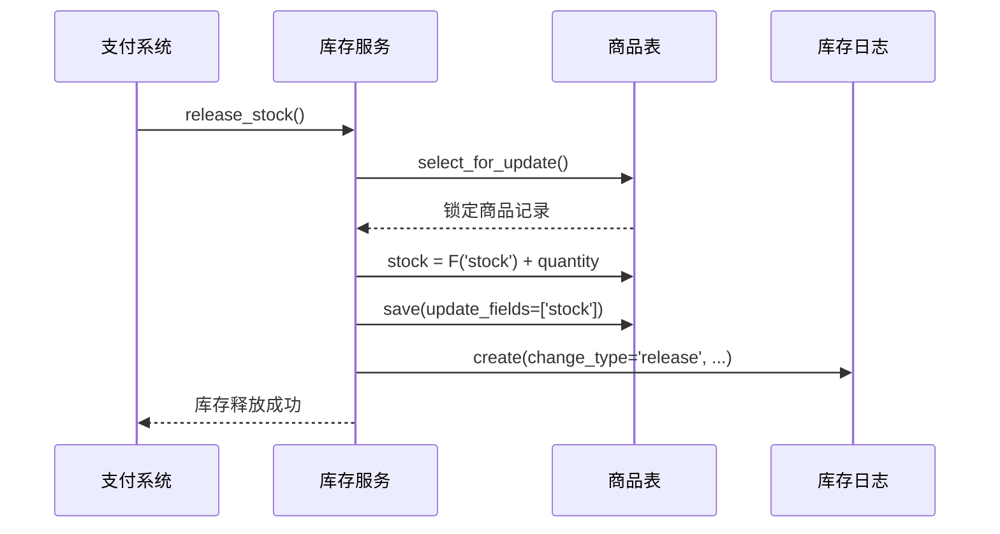

**图表来源**
- [backend/orders/services.py](file://backend/orders/services.py#L374-L408)

### 库存状态监控

系统提供库存变更日志查询功能：

```python
def get_inventory_logs(product_id: int, limit: int = 100):
    """获取商品的库存变更日志"""
    return InventoryLog.objects.filter(
        product_id=product_id
    ).order_by('-created_at')[:limit]
```

### 异常处理机制

库存操作中的异常会被捕获并记录，但不会中断整个支付流程：

```python
try:
    InventoryService.release_stock(
        product_id=order.product_id,
        quantity=order.quantity,
        reason='order_cancelled',
        operator=operator
    )
except Exception as e:
    # 记录错误但不中断流程
    print(f'释放库存失败: {str(e)}')
```

**章节来源**
- [backend/orders/services.py](file://backend/orders/services.py#L374-L499)
- [backend/orders/state_machine.py](file://backend/orders/state_machine.py#L212-L232)

## 错误处理与最佳实践

### 常见错误场景及处理

#### 1. 支付记录不存在

```python
# 查找支付记录失败
payment = self._find_payment(data)
if payment is None:
    logger.error(f'支付记录不存在: {data}')
    return Response({'detail': 'payment not found'}, status=404)
```

#### 2. 签名验证失败

```python
if not self._verify_signature(provider, data, signature):
    logger.error(f'签名验证失败: payment_id={payment.id}, provider={provider}')
    PaymentService.log_payment_event(
        payment.id,
        'signature_verification_failed',
        details={'provider': provider},
        error='Signature verification failed'
    )
    return Response({'detail': 'signature verification failed'}, status=403)
```

#### 3. 状态转换失败

```python
try:
    OrderStateMachine.transition(
        payment.order,
        'paid',
        operator=operator,
        note=f'Payment succeeded with transaction_id: {transaction_id}'
    )
except ValueError as e:
    logger.error(f'订单状态转换失败: {str(e)}')
    payment.logs.append({
        't': timezone.now().isoformat(),
        'event': 'order_transition_failed',
        'error': str(e)
    })
    payment.save()
    raise
```

### 最佳实践建议

#### 1. 支付超时处理

系统提供自动取消未支付订单的功能：

```python
# 自动取消超时订单
class Command(BaseCommand):
    def handle(self, *args, **options):
        timeout_minutes = options['timeout_minutes']
        expired_payments = Payment.objects.filter(
            status='processing',
            created_at__lt=timezone.now() - timedelta(minutes=timeout_minutes)
        )
        
        for payment in expired_payments:
            # 自动标记为过期
            payment.status = 'expired'
            payment.save()
```

#### 2. 日志记录规范

所有支付相关操作都需要记录详细的日志：

```python
# 支付事件日志记录
PaymentService.log_payment_event(
    payment_id=payment.id,
    event='payment_succeeded',
    details={
        'provider': provider,
        'transaction_id': transaction_id,
        'amount': str(payment.amount)
    }
)
```

#### 3. 幂等性保证

所有支付相关接口都应该是幂等的：

- 创建支付记录：检查是否已存在相同订单的支付
- 支付成功：检查是否已经是成功状态
- 支付失败：检查是否已经是失败状态

#### 4. 性能优化

- 使用数据库索引加速查询
- 实现缓存机制减少数据库访问
- 异步处理非关键业务逻辑

### 监控与告警

建议实施以下监控指标：

- 支付成功率
- 回调处理延迟
- 签名验证失败率
- 库存锁定/释放异常
- 订单状态转换异常

**章节来源**
- [backend/orders/views.py](file://backend/orders/views.py#L1166-L1294)
- [backend/orders/payment_service.py](file://backend/orders/payment_service.py#L245-L291)