# 支付回调业务处理流程详细文档

<cite>
**本文档引用的文件**
- [views.py](file://backend/orders/views.py)
- [payment_service.py](file://backend/orders/payment_service.py)
- [state_machine.py](file://backend/orders/state_machine.py)
- [models.py](file://backend/orders/models.py)
</cite>

## 目录
1. [概述](#概述)
2. [系统架构](#系统架构)
3. [核心组件分析](#核心组件分析)
4. [支付回调处理流程](#支付回调处理流程)
5. [process_payment_success方法详解](#process_payment_success方法详解)
6. [并发控制机制](#并发控制机制)
7. [订单状态机处理](#订单状态机处理)
8. [支付金额验证](#支付金额验证)
9. [支付过期处理](#支付过期处理)
10. [状态转换失败处理](#状态转换失败处理)
11. [日志记录与监控](#日志记录与监控)
12. [故障排除指南](#故障排除指南)

## 概述

支付回调业务处理是电商系统中的核心功能模块，负责处理第三方支付平台的支付结果通知，确保支付状态的准确性和业务逻辑的正确性。该模块采用严格的业务规则和并发控制机制，保证支付处理的一致性和可靠性。

主要功能包括：
- 支付回调数据验证和签名确认
- 支付状态更新和业务逻辑处理
- 并发控制防止重复处理
- 订单状态机驱动的状态转换
- 完整的操作日志记录
- 异常情况的优雅处理

## 系统架构

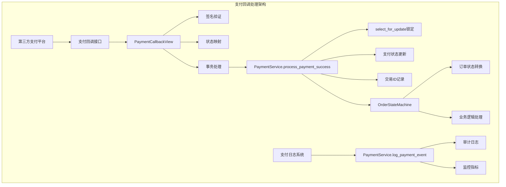

**图表来源**
- [views.py](file://backend/orders/views.py#L1180-L1294)
- [payment_service.py](file://backend/orders/payment_service.py#L106-L207)

## 核心组件分析

### 支付模型结构

支付系统的核心数据结构定义了完整的支付生命周期：

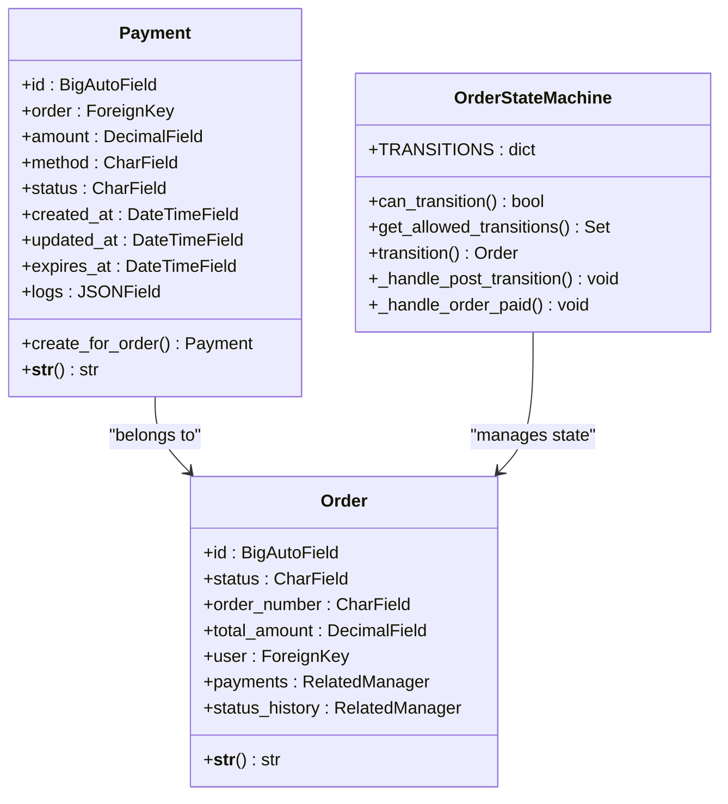

**图表来源**
- [models.py](file://backend/orders/models.py#L186-L221)
- [state_machine.py](file://backend/orders/state_machine.py#L25-L289)

**章节来源**
- [models.py](file://backend/orders/models.py#L186-L221)
- [state_machine.py](file://backend/orders/state_machine.py#L14-L289)

### 支付状态流转图

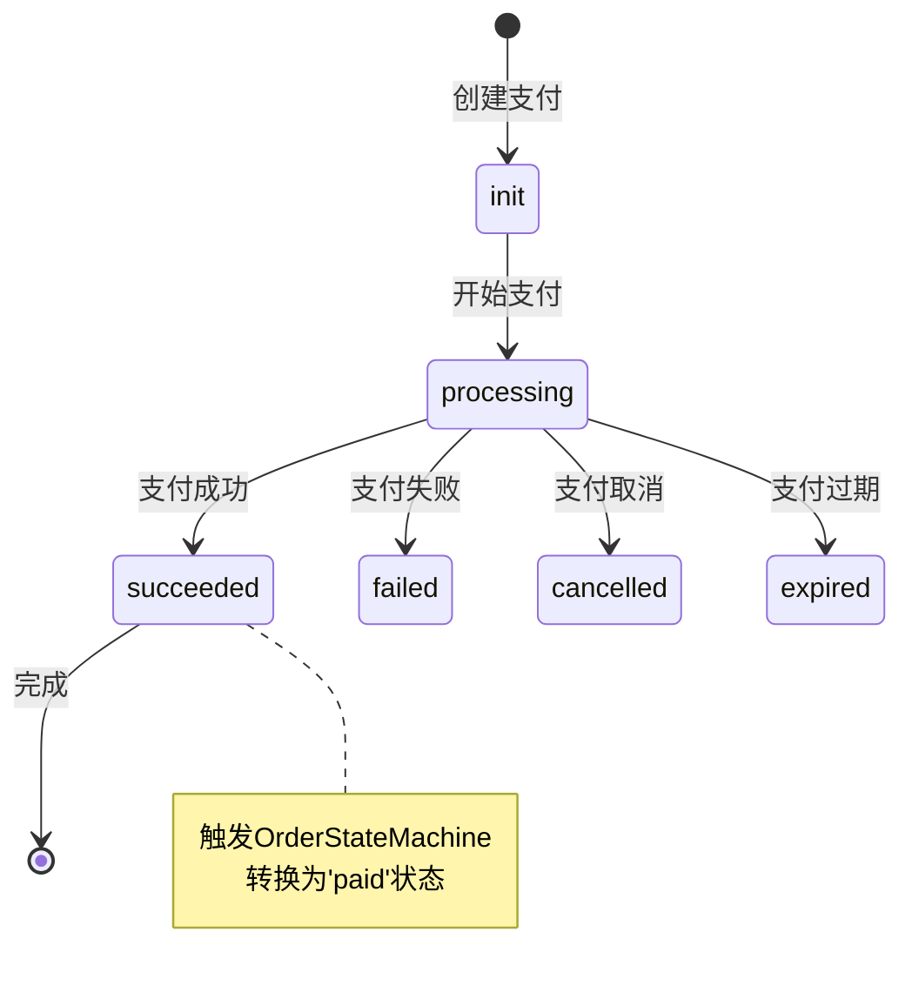

**图表来源**
- [models.py](file://backend/orders/models.py#L192-L198)
- [state_machine.py](file://backend/orders/state_machine.py#L34-L56)

## 支付回调处理流程

支付回调处理遵循严格的业务流程，确保每个步骤的正确性和安全性：

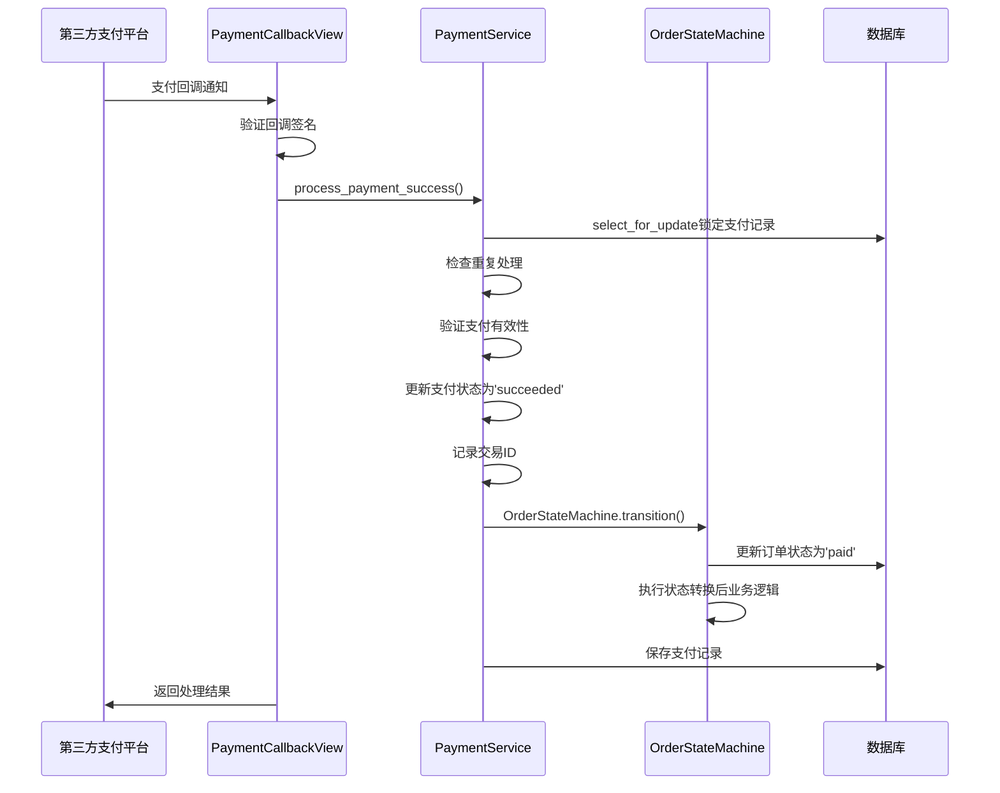

**图表来源**
- [views.py](file://backend/orders/views.py#L1180-L1294)
- [payment_service.py](file://backend/orders/payment_service.py#L106-L207)

**章节来源**
- [views.py](file://backend/orders/views.py#L1180-L1294)

## process_payment_success方法详解

`process_payment_success`方法是支付成功处理的核心入口，实现了完整的业务逻辑处理流程：

### 方法签名和职责

该方法负责以下核心职责：
- 防止重复处理已成功的支付
- 更新支付状态为成功
- 记录交易ID和操作日志
- 使用状态机更新订单状态
- 处理各种异常情况

### 核心处理步骤

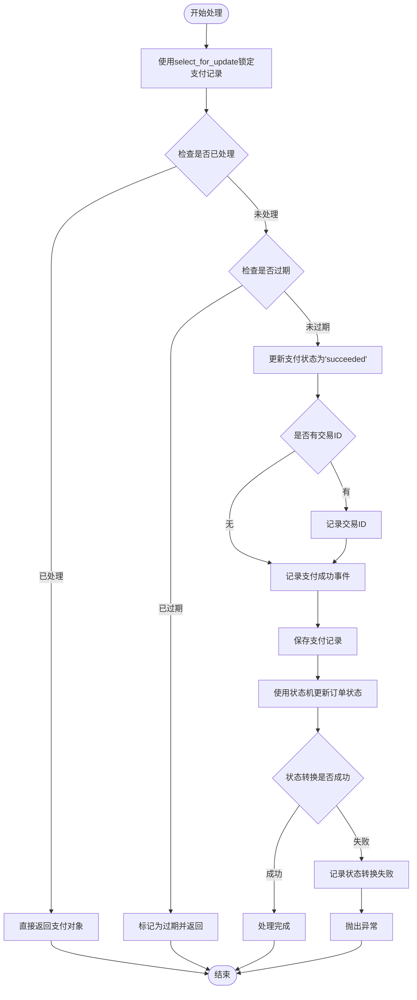

**图表来源**
- [payment_service.py](file://backend/orders/payment_service.py#L143-L207)

### 关键业务逻辑

#### 1. 并发控制保护
方法使用`select_for_update()`数据库锁机制，确保同一支付记录在同一时间只能被一个进程处理：

#### 2. 重复处理防护
通过检查支付状态，防止重复处理已成功的支付记录：

#### 3. 支付有效性验证
检查支付是否已过期，确保只有有效的支付才能被处理：

#### 4. 状态更新流程
严格按照业务规则更新支付和订单状态：

**章节来源**
- [payment_service.py](file://backend/orders/payment_service.py#L106-L207)

## 并发控制机制

系统采用多层次的并发控制机制，确保支付处理的一致性和可靠性：

### 数据库级别并发控制

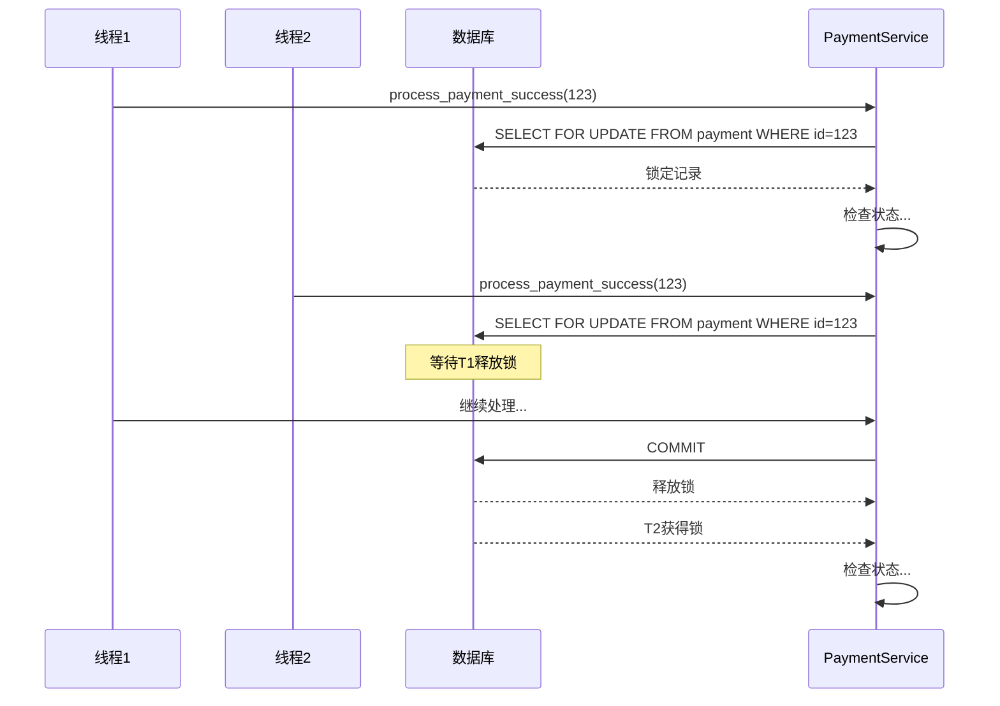

**图表来源**
- [payment_service.py](file://backend/orders/payment_service.py#L143-L144)

### 并发控制策略

1. **数据库锁机制**：使用`select_for_update()`确保同一支付记录的串行处理
2. **事务边界**：整个支付处理过程在一个原子事务中执行
3. **状态检查**：在关键位置检查支付状态，防止重复处理
4. **超时处理**：数据库连接超时自动回滚，避免死锁

**章节来源**
- [payment_service.py](file://backend/orders/payment_service.py#L143-L144)

## 订单状态机处理

订单状态机是系统状态转换的核心引擎，确保订单状态的合法性和业务逻辑的正确性：

### 状态转换规则

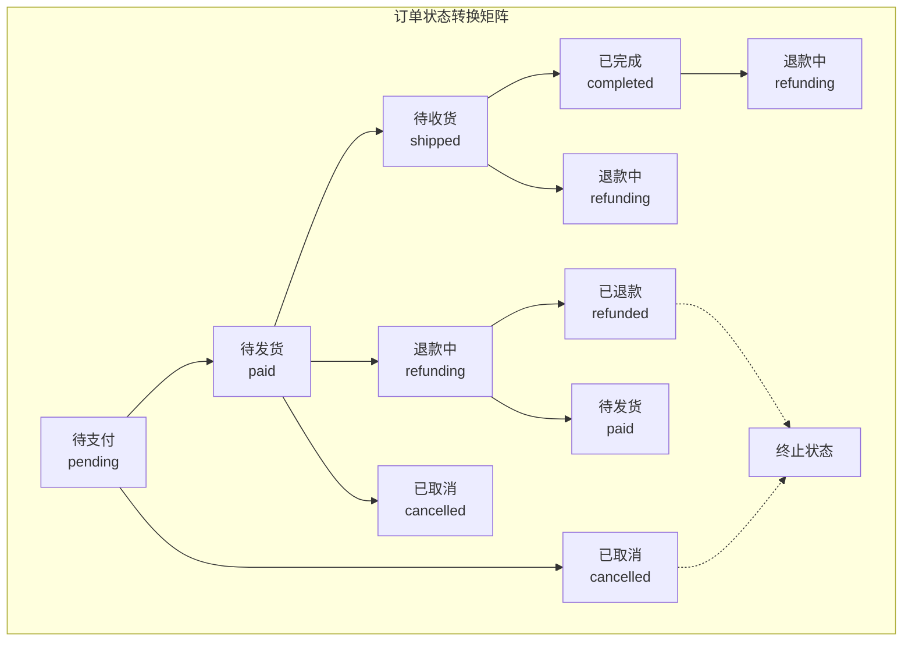

**图表来源**
- [state_machine.py](file://backend/orders/state_machine.py#L34-L56)

### 状态转换处理流程

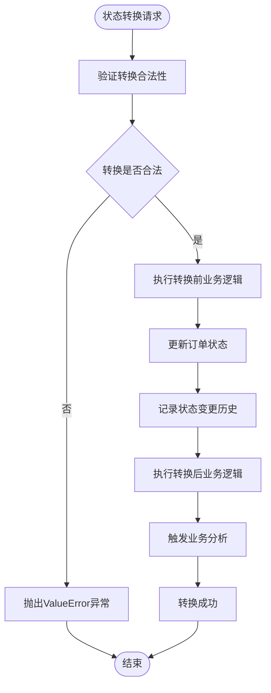

**图表来源**
- [state_machine.py](file://backend/orders/state_machine.py#L96-L154)

### 支付成功后的状态转换

当支付成功时，系统会执行以下状态转换：

1. **状态检查**：验证当前订单状态是否允许转换到'paid'
2. **状态更新**：将订单状态从'pending'更新为'paid'
3. **历史记录**：创建状态变更历史记录
4. **业务逻辑**：执行支付成功后的业务处理
5. **通知触发**：触发相关的业务分析和通知

**章节来源**
- [state_machine.py](file://backend/orders/state_machine.py#L96-L154)

## 支付金额验证

系统实现了严格的支付金额验证机制，确保支付金额与订单金额的一致性：

### 验证算法

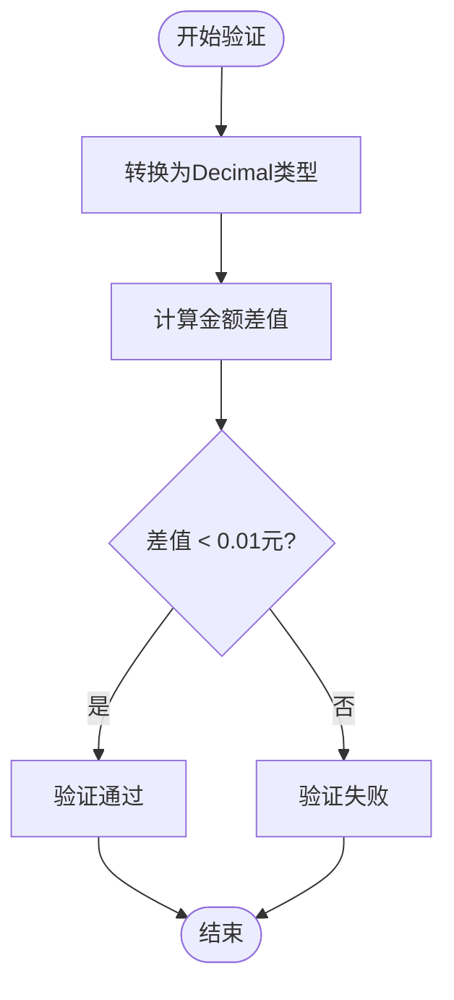

**图表来源**
- [payment_service.py](file://backend/orders/payment_service.py#L71-L103)

### 验证规则

1. **精度处理**：将所有支付金额统一转换为Decimal类型
2. **容差范围**：允许0.01元的误差，处理浮点数精度问题
3. **异常处理**：捕获转换异常，确保验证过程的健壮性
4. **业务约束**：支付金额必须与订单总金额完全匹配

**章节来源**
- [payment_service.py](file://backend/orders/payment_service.py#L71-L103)

## 支付过期处理

系统具备完善的支付过期检测和处理机制：

### 过期检测流程

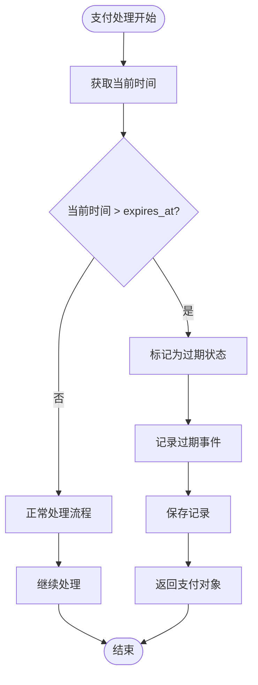

**图表来源**
- [payment_service.py](file://backend/orders/payment_service.py#L151-L161)

### 过期处理策略

1. **自动检测**：每次处理支付时自动检查是否已过期
2. **状态标记**：将过期的支付标记为'expired'状态
3. **日志记录**：详细记录过期原因和时间
4. **业务隔离**：过期支付不影响其他正常流程

**章节来源**
- [payment_service.py](file://backend/orders/payment_service.py#L151-L161)

## 状态转换失败处理

系统设计了优雅的状态转换失败处理机制：

### 失败处理流程

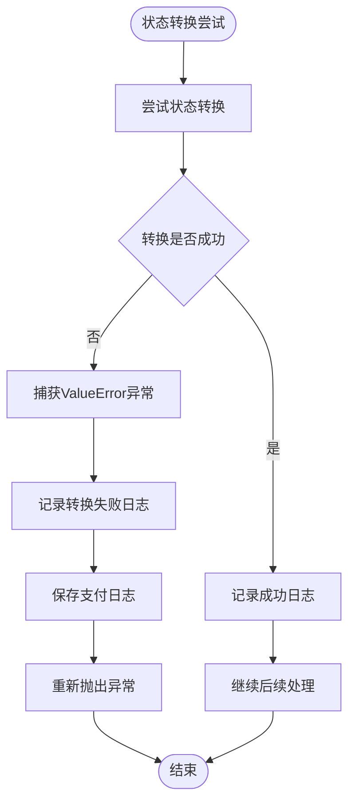

**图表来源**
- [payment_service.py](file://backend/orders/payment_service.py#L193-L202)

### 失败处理策略

1. **异常捕获**：捕获状态转换过程中的所有异常
2. **日志记录**：详细记录失败原因和上下文信息
3. **业务隔离**：状态转换失败不影响支付处理流程
4. **错误传播**：向上传播异常，便于上层系统处理

**章节来源**
- [payment_service.py](file://backend/orders/payment_service.py#L193-L202)

## 日志记录与监控

系统实现了完整的日志记录和监控机制：

### 日志记录层次

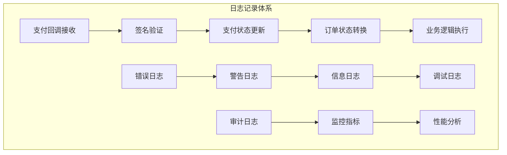

### 关键事件日志

系统记录以下关键事件：

1. **支付成功**：记录支付完成和订单状态转换
2. **状态转换失败**：记录状态转换异常和失败原因
3. **重复处理**：记录重复回调的处理情况
4. **过期处理**：记录过期支付的处理结果
5. **签名验证**：记录回调签名验证结果

**章节来源**
- [payment_service.py](file://backend/orders/payment_service.py#L174-L202)

## 故障排除指南

### 常见问题及解决方案

#### 1. 支付重复处理
**症状**：同一笔支付被多次处理
**原因**：第三方平台重复发送回调通知
**解决方案**：系统自动检测重复处理并忽略

#### 2. 状态转换失败
**症状**：支付成功但订单状态未更新
**原因**：订单状态转换规则不匹配
**解决方案**：记录失败日志，支付处理不受影响

#### 3. 支付过期
**症状**：支付成功但订单状态未更新
**原因**：支付回调延迟到达
**解决方案**：系统自动检测过期并标记

#### 4. 签名验证失败
**症状**：回调被拒绝
**原因**：回调数据被篡改或密钥配置错误
**解决方案**：记录验证失败原因，拒绝处理

### 监控指标

建议监控以下关键指标：
- 支付回调成功率
- 状态转换失败率
- 并发处理冲突率
- 支付过期比例
- 签名验证失败率

### 性能优化建议

1. **数据库索引**：确保支付记录表的关键字段有适当索引
2. **连接池配置**：合理配置数据库连接池大小
3. **缓存策略**：对频繁查询的数据使用缓存
4. **异步处理**：对于非关键业务逻辑考虑异步处理

## 结论

支付回调业务处理系统通过严格的业务规则、完善的并发控制和全面的日志记录，确保了支付处理的安全性和可靠性。系统的设计充分考虑了各种异常情况和边界条件，提供了优雅的错误处理机制和完整的监控能力。

该系统的核心优势包括：
- **安全性**：多重验证机制确保支付安全
- **可靠性**：完善的异常处理和重试机制
- **可维护性**：清晰的代码结构和完整的日志记录
- **可扩展性**：模块化设计支持新的支付方式和业务规则

通过持续的监控和优化，该系统能够稳定支撑电商业务的支付需求，为用户提供可靠的支付体验。