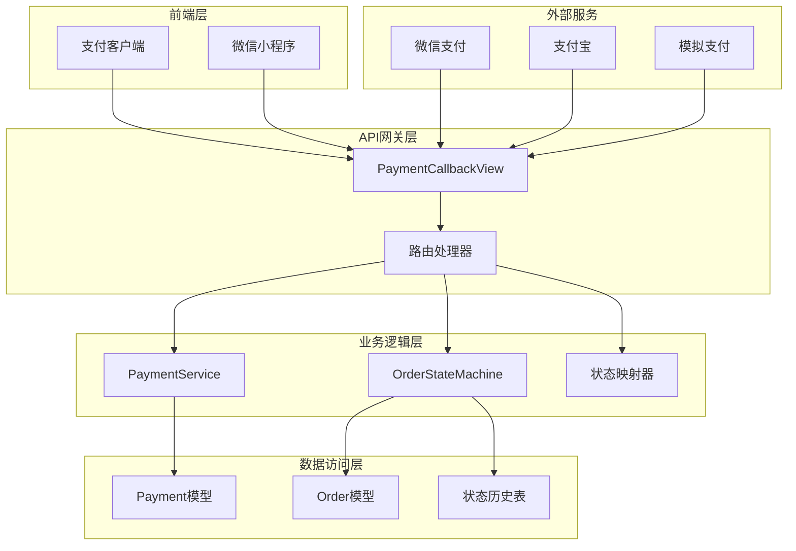
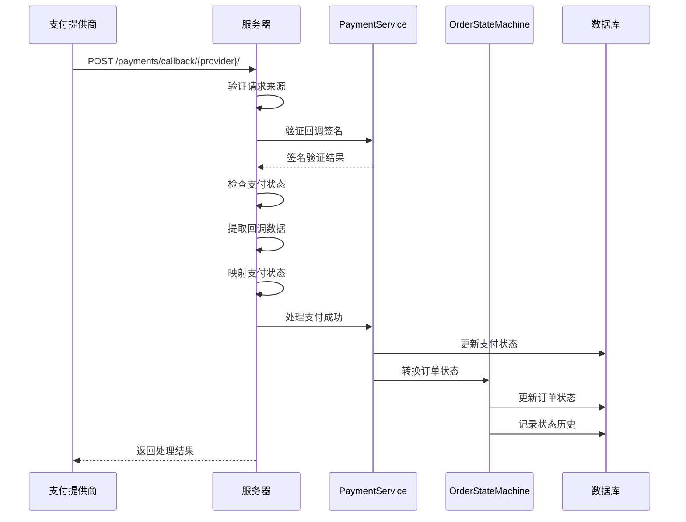
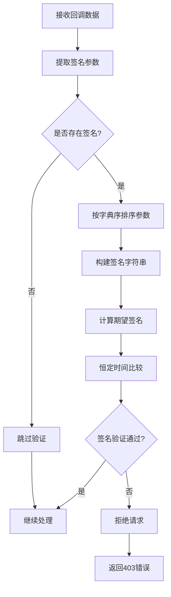
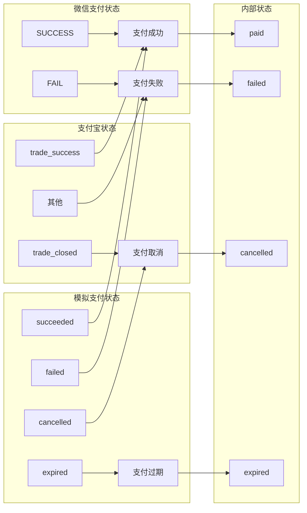
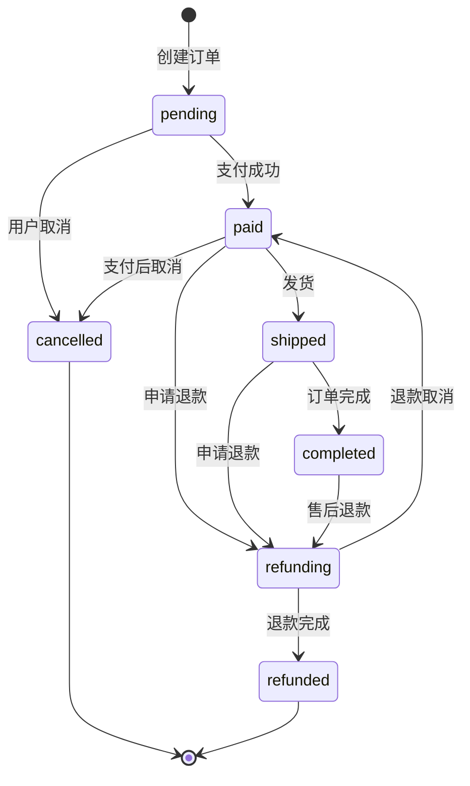
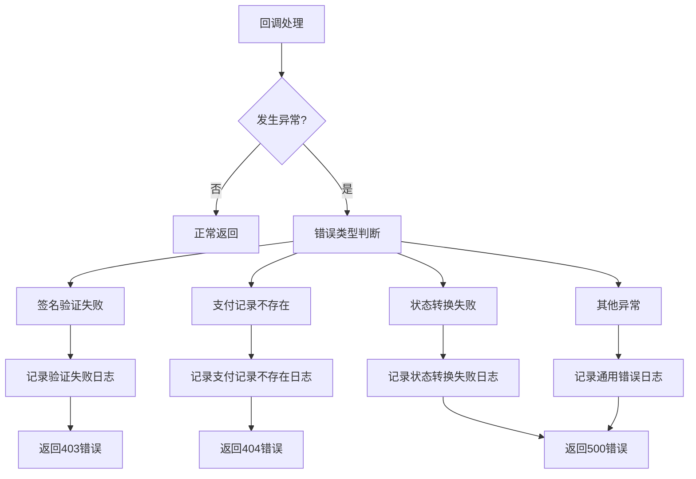

# 支付回调处理

<cite>
**本文档中引用的文件**
- [payment_service.py](file://backend/orders/payment_service.py)
- [views.py](file://backend/orders/views.py)
- [state_machine.py](file://backend/orders/state_machine.py)
- [models.py](file://backend/orders/models.py)
- [urls.py](file://backend/orders/urls.py)
- [api.md](file://api.md)
- [base.py](file://backend/backend/settings/base.py)
</cite>

## 目录
1. [概述](#概述)
2. [系统架构](#系统架构)
3. [回调接口实现](#回调接口实现)
4. [安全验证机制](#安全验证机制)
5. [支付状态处理](#支付状态处理)
6. [订单状态机集成](#订单状态机集成)
7. [支付提供商差异处理](#支付提供商差异处理)
8. [错误处理与日志记录](#错误处理与日志记录)
9. [性能优化考虑](#性能优化考虑)
10. [故障排除指南](#故障排除指南)

## 概述

支付回调处理系统是电子商务平台的核心组件，负责接收和处理来自第三方支付服务提供商的支付结果通知。该系统实现了严格的安全验证机制，确保支付数据的真实性和完整性，并通过状态机模式管理订单状态流转。

### 主要功能特性

- **多支付提供商支持**：支持微信支付、支付宝、模拟支付等多种支付方式
- **严格的安全验证**：采用HMAC-SHA256算法进行签名验证
- **防止重复处理**：通过支付状态检查避免重复处理同一笔支付
- **状态机驱动**：基于状态机模式管理订单状态转换
- **完整的日志记录**：记录所有支付事件和状态变更
- **事务性处理**：确保支付状态更新的一致性

## 系统架构

支付回调处理系统采用分层架构设计，包含以下核心组件：



**图表来源**
- [views.py](file://backend/orders/views.py#L1134-L1160)
- [payment_service.py](file://backend/orders/payment_service.py#L20-L30)
- [state_machine.py](file://backend/orders/state_machine.py#L25-L35)

## 回调接口实现

### 接口定义

支付回调接口通过RESTful API提供服务，支持多种支付提供商的回调处理。



**图表来源**
- [views.py](file://backend/orders/views.py#L1149-L1296)
- [payment_service.py](file://backend/orders/payment_service.py#L134-L207)

### 接口规范

| 属性 | 值 |
|------|-----|
| **HTTP方法** | POST |
| **路径** | `/payments/callback/{provider}/` |
| **权限** | AllowAny |
| **内容类型** | `application/json` |
| **支持的提供商** | `mock` \| `wechat` \| `alipay` |

### 请求参数

| 参数名 | 类型 | 必需 | 说明 |
|--------|------|------|------|
| `payment_id` | number | 否 | 支付记录ID |
| `order_number` \| `out_trade_no` | string | 否 | 订单号 |
| `status` | string | 否 | 支付状态（仅mock） |
| `result_code` \| `trade_state` | string | 否 | 支付结果码（仅wechat） |
| `transaction_id` | string | 否 | 第三方交易ID |
| `signature` \| `sign` | string | 否 | 签名验证 |

**节段来源**
- [views.py](file://backend/orders/views.py#L1149-L1296)
- [api.md](file://api.md#L335-L367)

## 安全验证机制

### HMAC-SHA256签名验证

系统采用HMAC-SHA256算法进行回调签名验证，确保数据完整性和真实性。



**图表来源**
- [payment_service.py](file://backend/orders/payment_service.py#L30-L68)

### 签名验证实现细节

签名验证过程包含以下关键步骤：

1. **参数排序**：将回调数据按字典序排序
2. **字符串构建**：使用`&`连接键值对
3. **签名计算**：使用HMAC-SHA256算法计算签名
4. **恒定时间比较**：防止时序攻击

### 安全考虑

- **恒定时间比较**：使用`hmac.compare_digest()`防止时序攻击
- **密钥管理**：敏感密钥存储在环境变量中
- **请求验证**：验证请求来源和内容完整性
- **重复处理防护**：检查支付状态避免重复处理

**节段来源**
- [payment_service.py](file://backend/orders/payment_service.py#L30-L68)
- [views.py](file://backend/orders/views.py#L1334-L1367)

## 支付状态处理

### 状态映射机制

系统支持多种支付提供商的状态映射，将不同的状态值统一转换为内部支付状态。



**图表来源**
- [views.py](file://backend/orders/views.py#L1369-L1408)

### 支付状态处理流程

| 状态 | 处理逻辑 | 订单状态转换 |
|------|----------|-------------|
| **支付成功** | 更新支付状态为`succeeded`，触发订单状态转换 | `pending` → `paid` |
| **支付失败** | 更新支付状态为`failed`，记录失败原因 | 保持原状态 |
| **支付取消** | 更新支付状态为`cancelled`，释放库存 | 保持原状态 |
| **支付过期** | 更新支付状态为`expired`，触发订单取消 | `pending` → `cancelled` |
| **处理中** | 更新支付状态为`processing` | 保持原状态 |

**节段来源**
- [views.py](file://backend/orders/views.py#L1216-L1294)

## 订单状态机集成

### 状态转换规则

订单状态机定义了严格的转换规则，确保订单状态流转的合法性。



**图表来源**
- [state_machine.py](file://backend/orders/state_machine.py#L34-L57)

### 支付成功后的状态转换

当支付成功时，系统会执行以下状态转换：

1. **支付状态更新**：将支付记录状态更新为`succeeded`
2. **订单状态转换**：通过状态机将订单状态从`pending`转换为`paid`
3. **库存处理**：保留库存（支付成功后不立即释放）
4. **状态历史记录**：记录状态变更历史

### 异常处理机制

状态转换过程中可能出现的异常情况：

- **非法状态转换**：抛出`ValueError`异常
- **并发冲突**：使用数据库锁防止并发问题
- **业务逻辑错误**：记录错误日志但不中断流程

**节段来源**
- [state_machine.py](file://backend/orders/state_machine.py#L95-L154)
- [payment_service.py](file://backend/orders/payment_service.py#L140-L202)

## 支付提供商差异处理

### 微信支付处理

微信支付回调具有特定的数据结构和状态编码：

| 参数名 | 说明 | 示例值 |
|--------|------|--------|
| `result_code` | 支付结果码 | `SUCCESS` |
| `transaction_id` | 微信订单号 | `wx1234567890` |
| `sign` | 签名 | `abc123...` |

### 支付宝处理

支付宝回调的数据格式和状态映射：

| 参数名 | 说明 | 示例值 |
|--------|------|--------|
| `trade_status` | 交易状态 | `TRADE_SUCCESS` |
| `trade_no` | 支付宝交易号 | `2025010100000001` |
| `sign` | 签名 | `abc123...` |

### 模拟支付处理

开发环境中的模拟支付处理特点：

- **跳过签名验证**：无需提供签名参数
- **灵活状态控制**：支持任意支付状态
- **简化调试**：便于开发和测试

**节段来源**
- [views.py](file://backend/orders/views.py#L1347-L1367)

## 错误处理与日志记录

### 错误分类处理

系统对不同类型的错误采用不同的处理策略：



**图表来源**
- [views.py](file://backend/orders/views.py#L1286-L1294)

### 日志记录策略

系统记录详细的支付事件日志，包括：

| 事件类型 | 记录内容 | 用途 |
|----------|----------|------|
| `signature_verified` | 签名验证成功 | 安全审计 |
| `signature_verification_failed` | 签名验证失败 | 安全监控 |
| `payment_succeeded` | 支付成功事件 | 业务统计 |
| `order_transition_failed` | 状态转换失败 | 故障排查 |
| `duplicate_callback_ignored` | 重复回调忽略 | 性能监控 |

### 异常响应格式

系统返回标准化的错误响应：

```json
{
  "detail": "signature verification failed",
  "error_code": "SIGNATURE_INVALID",
  "timestamp": "2025-01-01T10:00:00Z"
}
```

**节段来源**
- [views.py](file://backend/orders/views.py#L1185-L1197)
- [payment_service.py](file://backend/orders/payment_service.py#L134-L207)

## 性能优化考虑

### 并发处理优化

系统采用多种策略优化并发处理性能：

1. **数据库锁机制**：使用`select_for_update()`防止并发更新
2. **事务边界控制**：最小化事务范围提高并发性
3. **异步日志记录**：避免阻塞主业务流程
4. **缓存策略**：缓存频繁访问的配置信息

### 缓存策略

| 缓存项 | 过期时间 | 用途 |
|--------|----------|------|
| 支付配置 | 30分钟 | 支付提供商密钥 |
| 状态映射 | 1小时 | 状态转换规则 |
| 订单信息 | 5分钟 | 订单状态查询 |

### 监控指标

系统监控以下关键性能指标：

- **回调处理时间**：平均响应时间
- **签名验证成功率**：验证通过率
- **状态转换延迟**：状态更新耗时
- **并发处理能力**：同时处理的请求数

## 故障排除指南

### 常见问题诊断

#### 签名验证失败

**症状**：收到`signature verification failed`错误

**可能原因**：
1. 签名密钥配置错误
2. 回调数据被篡改
3. 时间戳过期
4. 参数编码问题

**解决方案**：
1. 检查环境变量配置
2. 验证回调数据完整性
3. 确认服务器时间同步
4. 检查字符编码设置

#### 支付状态不一致

**症状**：支付成功但订单状态未更新

**可能原因**：
1. 状态机转换失败
2. 数据库事务冲突
3. 并发处理问题
4. 业务逻辑异常

**解决方案**：
1. 检查状态转换规则
2. 分析数据库锁等待
3. 查看异常日志
4. 手动触发状态更新

### 调试工具

系统提供以下调试工具：

1. **支付事件日志**：查看完整的支付处理流程
2. **状态历史查询**：追踪订单状态变更
3. **签名验证测试**：验证签名算法正确性
4. **并发冲突检测**：识别并发处理问题

### 监控告警

建议设置以下监控告警：

- **高频率的签名验证失败**
- **支付回调处理超时**
- **状态转换失败率过高**
- **并发处理异常增加**

**节段来源**
- [views.py](file://backend/orders/views.py#L1166-L1197)
- [payment_service.py](file://backend/orders/payment_service.py#L134-L207)