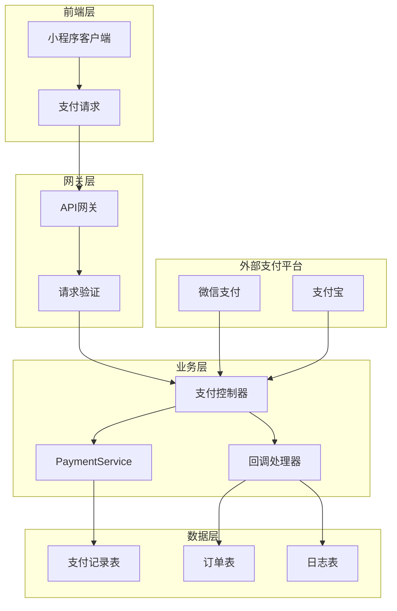
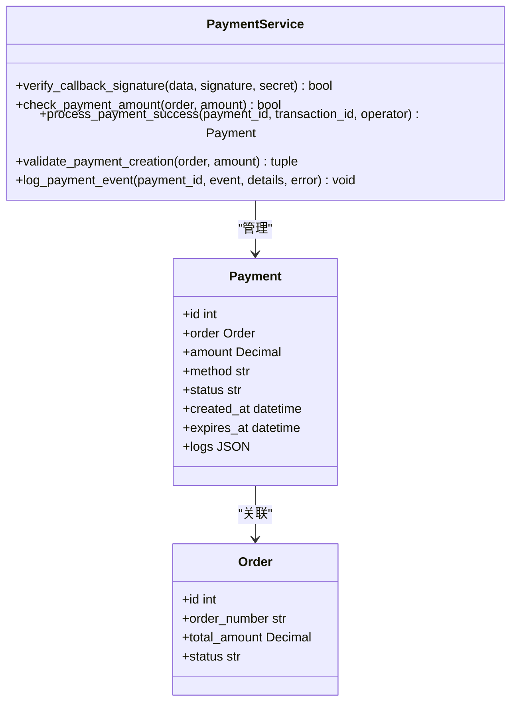
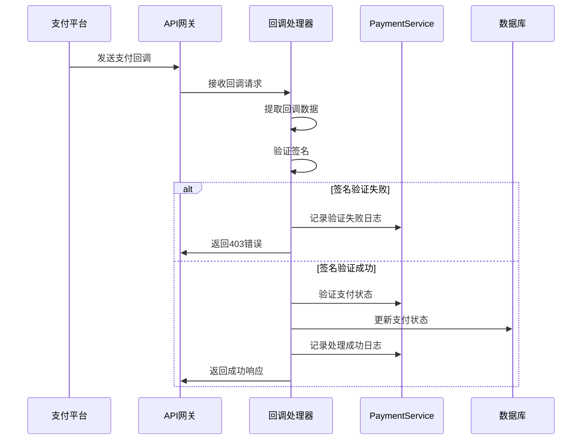
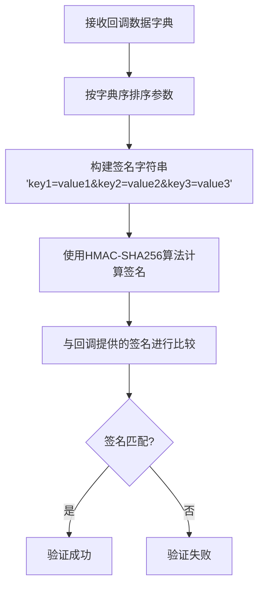
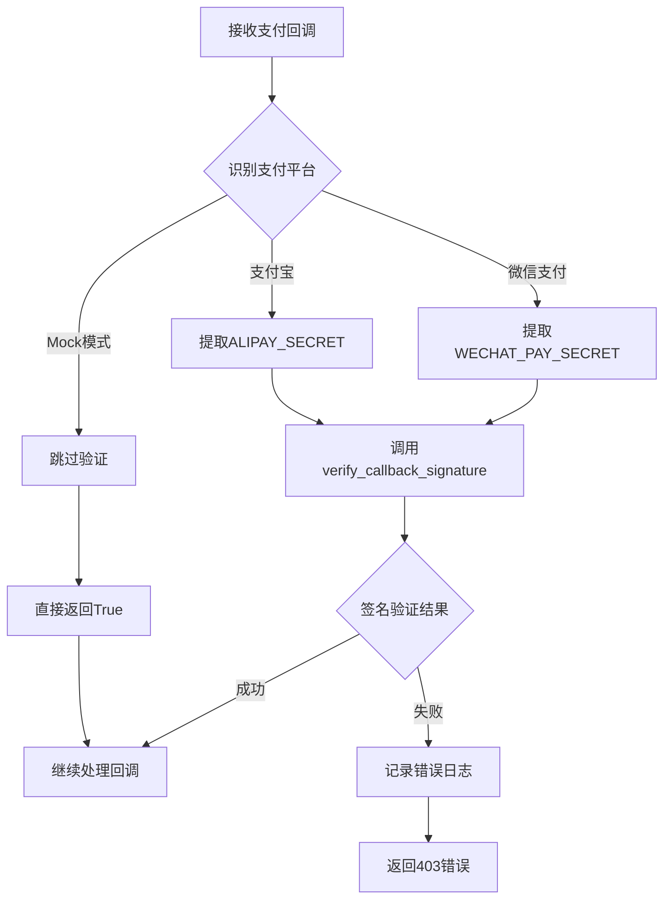
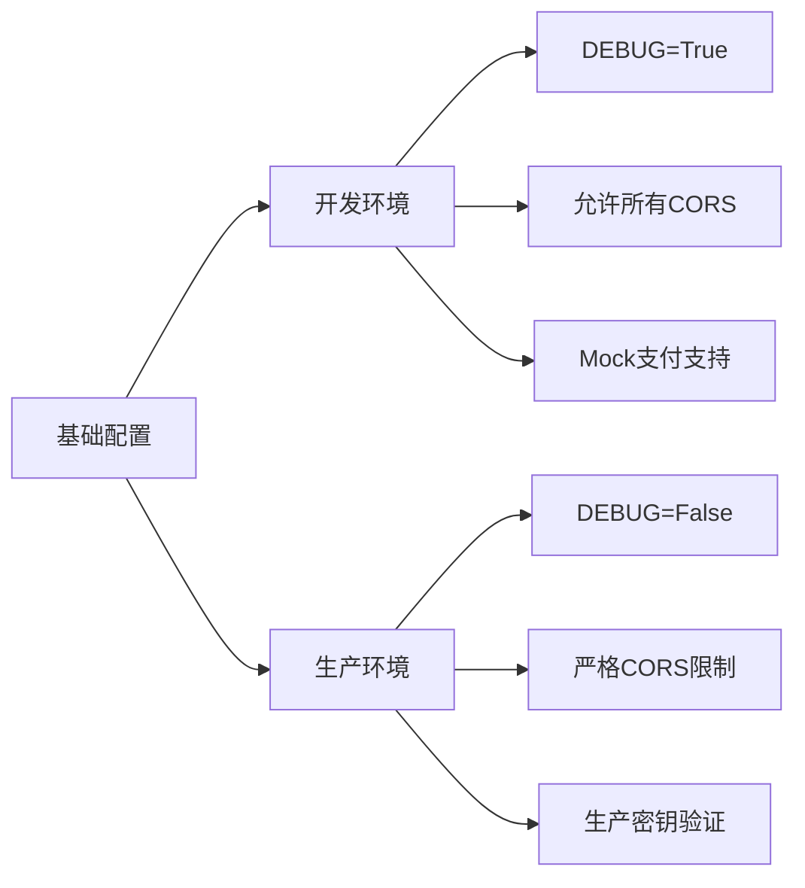
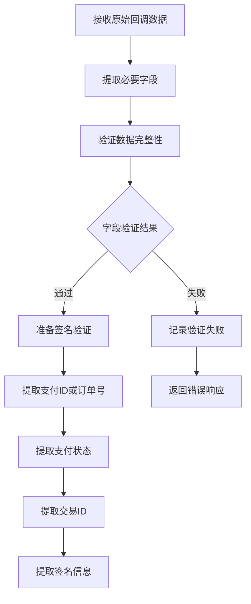
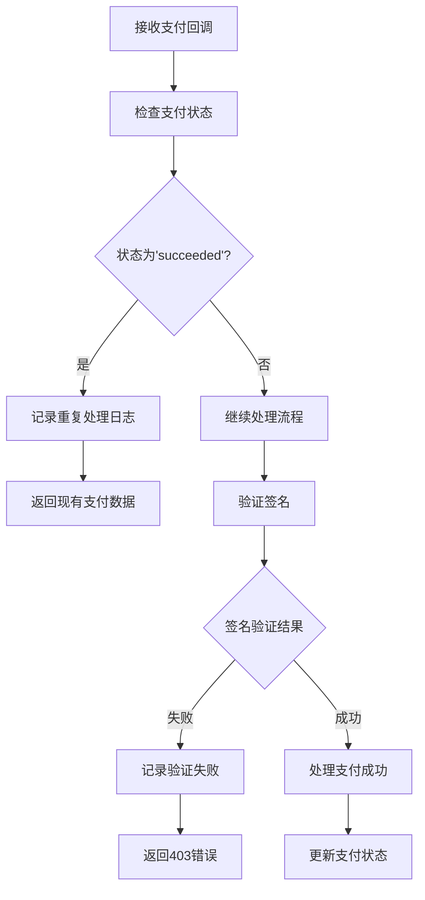
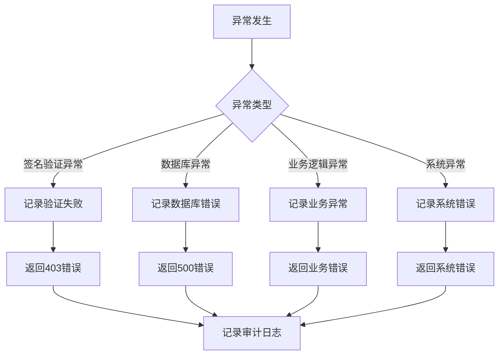

# 支付回调安全验证机制详细文档

<cite>
**本文档引用的文件**
- [payment_service.py](file://backend/orders/payment_service.py)
- [views.py](file://backend/orders/views.py)
- [models.py](file://backend/orders/models.py)
- [base.py](file://backend/backend/settings/base.py)
- [development.py](file://backend/backend/settings/development.py)
- [production.py](file://backend/backend/settings/production.py)
</cite>

## 目录
1. [概述](#概述)
2. [系统架构](#系统架构)
3. [核心组件分析](#核心组件分析)
4. [签名验证实现详解](#签名验证实现详解)
5. [配置管理](#配置管理)
6. [回调数据处理流程](#回调数据处理流程)
7. [安全机制](#安全机制)
8. [异常处理与日志记录](#异常处理与日志记录)
9. [最佳实践](#最佳实践)
10. [故障排除指南](#故障排除指南)

## 概述

支付回调安全验证机制是电商业务系统中的关键安全组件，负责验证第三方支付平台（如微信支付、支付宝）发送的支付回调数据的真实性和完整性。该机制采用HMAC-SHA256算法进行签名验证，确保支付回调数据未被篡改，并通过严格的参数验证和异常处理机制保障系统安全。

### 主要功能特性

- **HMAC-SHA256签名验证**：使用标准加密算法验证回调数据真实性
- **参数字典序排序**：确保签名计算的一致性
- **恒定时间比较**：防止时序攻击的安全措施
- **多支付平台支持**：兼容微信支付、支付宝等多种支付方式
- **完善的异常处理**：全面的错误捕获和日志记录机制
- **审计追踪**：完整的事件日志记录用于安全审计

## 系统架构

**架构图来源**
- [views.py](file://backend/orders/views.py#L1180-L1367)
- [payment_service.py](file://backend/orders/payment_service.py#L19-L292)

## 核心组件分析

### PaymentService 类

PaymentService 是支付回调安全验证的核心服务类，提供以下关键功能：

**类图来源**
- [payment_service.py](file://backend/orders/payment_service.py#L19-L292)
- [models.py](file://backend/orders/models.py#L186-L210)

**节来源**
- [payment_service.py](file://backend/orders/payment_service.py#L19-L292)
- [models.py](file://backend/orders/models.py#L186-L210)

### 回调处理器

回调处理器负责接收和处理来自支付平台的异步通知，执行完整的安全验证流程：

**序列图来源**
- [views.py](file://backend/orders/views.py#L1180-L1367)

## 签名验证实现详解

### HMAC-SHA256算法应用

`PaymentService.verify_callback_signature` 方法实现了基于HMAC-SHA256的签名验证机制：

#### 参数字典序排序

签名验证的第一步是对回调数据进行标准化处理：

**流程图来源**
- [payment_service.py](file://backend/orders/payment_service.py#L52-L67)

#### 签名字符串构造

签名验证的核心步骤包括：

1. **参数排序**：将回调数据字典按键名进行字典序排序
2. **字符串拼接**：使用`key=value`格式连接每个参数对
3. **URL编码**：对特殊字符进行URL编码处理
4. **HMAC计算**：使用密钥和签名字符串计算HMAC-SHA256哈希值

#### 恒定时间比较

为了防止时序攻击，系统使用 `hmac.compare_digest()` 进行签名比较：

- **安全优势**：无论输入差异大小，比较时间保持恒定
- **防护攻击**：有效抵御基于时间的侧信道攻击
- **标准实现**：遵循Python标准库的最佳实践

**节来源**
- [payment_service.py](file://backend/orders/payment_service.py#L30-L67)

### 支付平台签名验证

回调处理器根据不同的支付平台调用相应的签名验证方法：

**流程图来源**
- [views.py](file://backend/orders/views.py#L1334-L1367)

**节来源**
- [views.py](file://backend/orders/views.py#L1334-L1367)

## 配置管理

### 密钥配置

支付回调安全验证依赖于正确的密钥配置：

| 配置项 | 描述 | 默认值 | 环境要求 |
|--------|------|--------|----------|
| `WECHAT_PAY_SECRET` | 微信支付商户密钥 | 空字符串 | 生产环境必需 |
| `ALIPAY_SECRET` | 支付宝应用密钥 | 空字符串 | 生产环境必需 |
| `WECHAT_APPID` | 微信小程序AppID | 空字符串 | 开发环境必需 |
| `WECHAT_SECRET` | 微信小程序AppSecret | 空字符串 | 开发环境必需 |

### 环境配置

系统支持多环境配置管理：

**图表来源**
- [base.py](file://backend/backend/settings/base.py#L231-L233)
- [development.py](file://backend/backend/settings/development.py#L6-L20)
- [production.py](file://backend/backend/settings/production.py#L6-L35)

**节来源**
- [base.py](file://backend/backend/settings/base.py#L231-L233)
- [development.py](file://backend/backend/settings/development.py#L6-L20)
- [production.py](file://backend/backend/settings/production.py#L6-L35)

## 回调数据处理流程

### 数据预处理

回调数据在进入签名验证之前需要进行预处理：

**流程图来源**
- [views.py](file://backend/orders/views.py#L1180-L1207)

### 支付状态映射

不同支付平台的状态码需要映射到统一的支付状态：

| 支付平台 | 原始状态 | 统一状态 | 处理动作 |
|----------|----------|----------|----------|
| 微信支付 | SUCCESS | succeeded | 更新支付状态 |
| 微信支付 | FAILED | failed | 记录失败日志 |
| 支付宝 | TRADE_SUCCESS | succeeded | 更新支付状态 |
| 支付宝 | TRADE_CLOSED | cancelled | 取消支付 |
| 支付宝 | TRADE_FINISHED | succeeded | 完成支付 |

**节来源**
- [views.py](file://backend/orders/views.py#L1180-L1296)

## 安全机制

### 防重复处理

系统实现了多重机制防止重复处理支付回调：

**流程图来源**
- [views.py](file://backend/orders/views.py#L1199-L1207)

### 并发控制

支付处理采用数据库锁机制防止并发问题：

- **SELECT FOR UPDATE**：锁定支付记录避免并发处理
- **事务隔离**：确保支付状态变更的原子性
- **超时保护**：防止长时间锁定导致的性能问题

### 数据完整性验证

除了签名验证外，系统还进行多项数据完整性检查：

1. **支付金额验证**：比较回调金额与订单金额
2. **订单存在性验证**：确认订单记录的有效性
3. **支付过期检查**：验证支付是否仍在有效期内
4. **状态一致性检查**：确保状态转换的合理性

**节来源**
- [payment_service.py](file://backend/orders/payment_service.py#L105-L203)

## 异常处理与日志记录

### 异常分类处理

系统对不同类型的异常采用分级处理策略：

### 日志记录策略

系统采用结构化日志记录，包含以下关键信息：

| 日志级别 | 记录内容 | 示例 |
|----------|----------|------|
| ERROR | 签名验证失败 | `签名验证失败: payment_id=123, provider=wechat` |
| WARNING | 重复处理警告 | `支付记录已处理过: payment_id=123` |
| INFO | 正常处理记录 | `支付成功处理: payment_id=123, transaction_id=wx123` |
| DEBUG | 详细处理信息 | `回调数据: {'status': 'SUCCESS', 'amount': '100.00'}` |

### 审计追踪

所有支付相关的操作都记录完整的审计轨迹：

- **操作时间戳**：精确到毫秒的时间记录
- **操作类型**：明确的操作类别标识
- **操作详情**：详细的参数和状态信息
- **错误信息**：完整的错误堆栈和诊断信息

**节来源**
- [payment_service.py](file://backend/orders/payment_service.py#L244-L292)
- [views.py](file://backend/orders/views.py#L1184-L1191)

## 最佳实践

### 密钥管理

1. **定期轮换**：定期更换支付平台的密钥
2. **权限分离**：不同环境使用独立的密钥
3. **访问控制**：限制密钥的访问权限
4. **监控告警**：监控密钥的异常使用

### 性能优化

1. **缓存机制**：缓存频繁访问的支付配置
2. **异步处理**：将非关键操作异步化
3. **批量处理**：合并相似的数据库操作
4. **连接池**：使用数据库连接池提高效率

### 安全加固

1. **HTTPS强制**：确保所有通信使用HTTPS
2. **IP白名单**：限制支付平台的回调IP
3. **频率限制**：对回调接口实施频率限制
4. **内容验证**：验证回调数据的内容格式

## 故障排除指南

### 常见问题诊断

| 问题症状 | 可能原因 | 解决方案 |
|----------|----------|----------|
| 签名验证失败 | 密钥配置错误 | 检查环境变量配置 |
| 支付重复处理 | 并发处理问题 | 检查数据库锁机制 |
| 回调超时 | 网络连接问题 | 检查网络配置和防火墙 |
| 数据不一致 | 状态同步问题 | 检查状态机逻辑 |

### 调试工具

1. **日志分析**：使用结构化日志进行问题定位
2. **断点调试**：在开发环境中设置断点
3. **单元测试**：编写专门的测试用例
4. **压力测试**：模拟高并发场景

### 监控指标

关键监控指标包括：

- **回调成功率**：验证签名的成功率
- **处理延迟**：回调处理的平均时间
- **错误率**：各类错误的发生频率
- **并发量**：同时处理的回调数量

**节来源**
- [views.py](file://backend/orders/views.py#L1180-L1296)
- [payment_service.py](file://backend/orders/payment_service.py#L30-L67)