# 支付创建功能详细文档

<cite>
**本文档引用的文件**
- [views.py](file://backend/orders/views.py)
- [payment_service.py](file://backend/orders/payment_service.py)
- [models.py](file://backend/orders/models.py)
- [serializers.py](file://backend/orders/serializers.py)
- [urls.py](file://backend/orders/urls.py)
- [payment.ts](file://frontend/src/services/payment.ts)
- [index.tsx](file://frontend/src/pages/order-detail/index.tsx)
- [utils.py](file://backend/common/utils.py)
</cite>

## 目录
1. [概述](#概述)
2. [API端点架构](#api端点架构)
3. [请求参数验证机制](#请求参数验证机制)
4. [PaymentService验证逻辑](#paymentservice验证逻辑)
5. [支付记录创建流程](#支付记录创建流程)
6. [前端集成实现](#前端集成实现)
7. [错误处理与状态码](#错误处理与状态码)
8. [最佳实践指南](#最佳实践指南)
9. [总结](#总结)

## 概述

支付创建功能是电小二小程序的核心业务模块之一，负责为订单创建支付记录。该功能通过RESTful API设计，提供了完整的支付创建流程，包括严格的参数验证、状态检查和错误处理机制。

### 核心特性

- **严格参数验证**：确保order_id为整数，支付方式在有效范围内
- **智能状态检查**：验证订单状态是否允许支付
- **金额一致性验证**：支持0.01元误差范围的金额校验
- **过期检查机制**：自动检测订单是否超过24小时有效期
- **幂等性保证**：防止重复创建支付记录
- **实时日志记录**：完整的支付事件追踪

## API端点架构

### POST /payments/ 端点设计

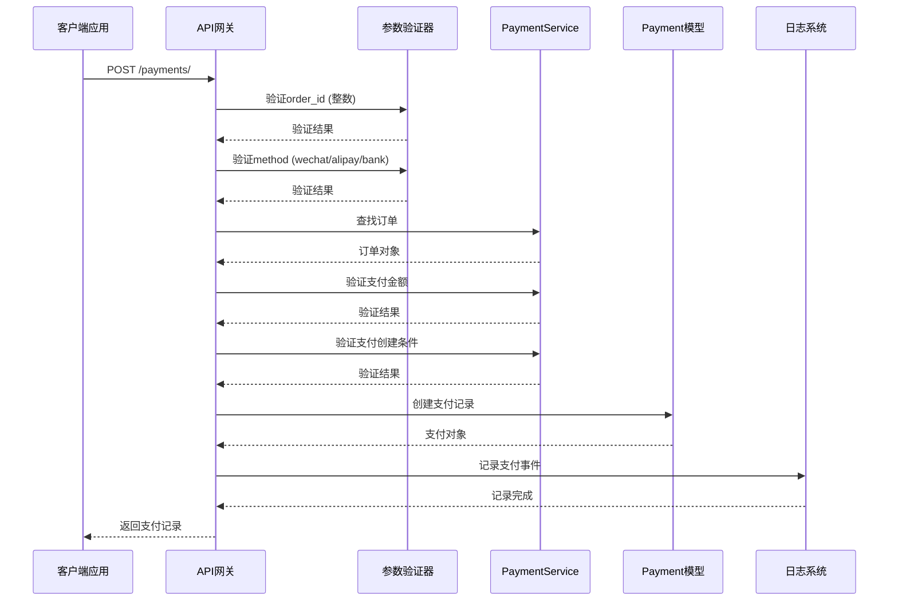

**图表来源**
- [views.py](file://backend/orders/views.py#L812-L939)

### 端点规范

| 属性 | 值 |
|------|-----|
| **HTTP方法** | POST |
| **路径** | `/payments/` |
| **认证要求** | 是 |
| **内容类型** | `application/json` |
| **响应格式** | JSON |

**节来源**
- [views.py](file://backend/orders/views.py#L812-L829)

## 请求参数验证机制

### order_id参数验证

系统采用多层次的参数验证策略，确保输入数据的合法性：

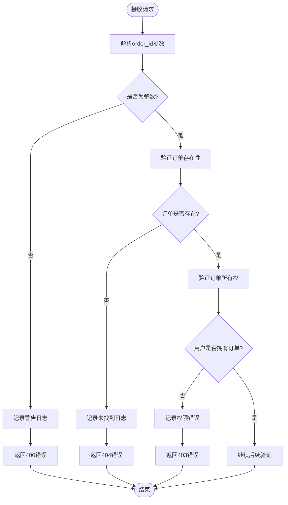

**图表来源**
- [views.py](file://backend/orders/views.py#L835-L862)

### 支付方式有效性检查

系统支持三种支付方式，每种都有明确的定义和用途：

| 支付方式 | 描述 | 默认值 | 适用场景 |
|----------|------|--------|----------|
| `wechat` | 微信支付 | ✓ | 移动端主要支付方式 |
| `alipay` | 支付宝支付 | ✗ | PC端和移动端备用支付 |
| `bank` | 银行卡支付 | ✗ | 企业客户和特殊需求 |

**节来源**
- [views.py](file://backend/orders/views.py#L846-L852)

### 支付金额验证

金额验证采用精确的十进制比较，允许0.01元的误差范围：

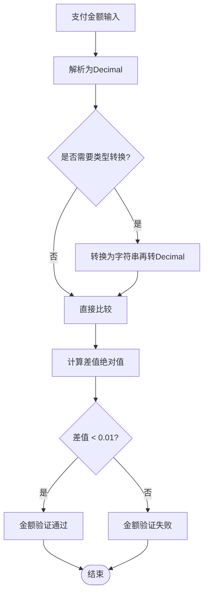

**图表来源**
- [payment_service.py](file://backend/orders/payment_service.py#L70-L102)

**节来源**
- [views.py](file://backend/orders/views.py#L865-L887)
- [payment_service.py](file://backend/orders/payment_service.py#L70-L102)

## PaymentService验证逻辑

### 三个核心验证步骤

PaymentService.validate_payment_creation()方法实现了支付创建前的三重验证：

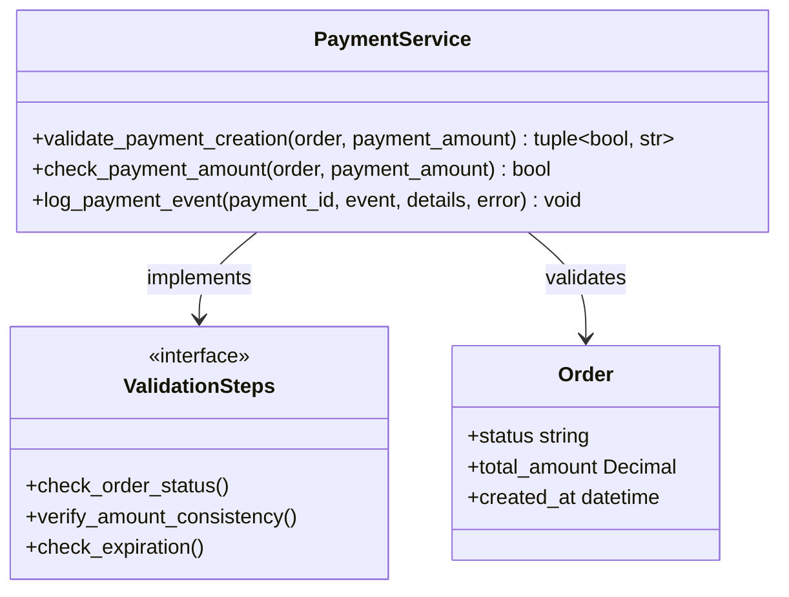

**图表来源**
- [payment_service.py](file://backend/orders/payment_service.py#L207-L241)

### 订单状态检查

系统只允许以下状态的订单进行支付：

| 允许状态 | 含义 | 处理方式 |
|----------|------|----------|
| `pending` | 待支付状态 | 正常支付流程 |
| `paid` | 已支付状态 | 重新支付或补全支付 |

**节来源**
- [payment_service.py](file://backend/orders/payment_service.py#L229-L230)

### 支付金额一致性验证

金额验证采用精确的十进制比较，确保支付金额与订单金额的一致性：

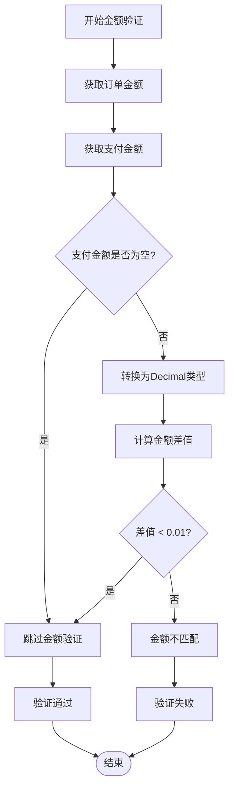

**图表来源**
- [payment_service.py](file://backend/orders/payment_service.py#L233-L235)

**节来源**
- [payment_service.py](file://backend/orders/payment_service.py#L233-L235)

### 订单过期检查

系统实施严格的订单有效期控制：

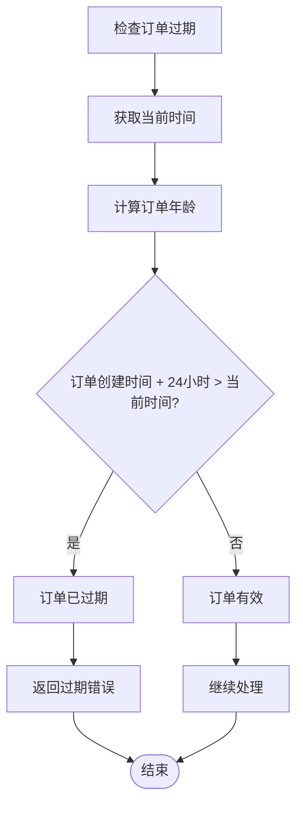

**图表来源**
- [payment_service.py](file://backend/orders/payment_service.py#L238-L239)

**节来源**
- [payment_service.py](file://backend/orders/payment_service.py#L238-L239)

## 支付记录创建流程

### 初始化逻辑

支付记录创建包含多个关键步骤：

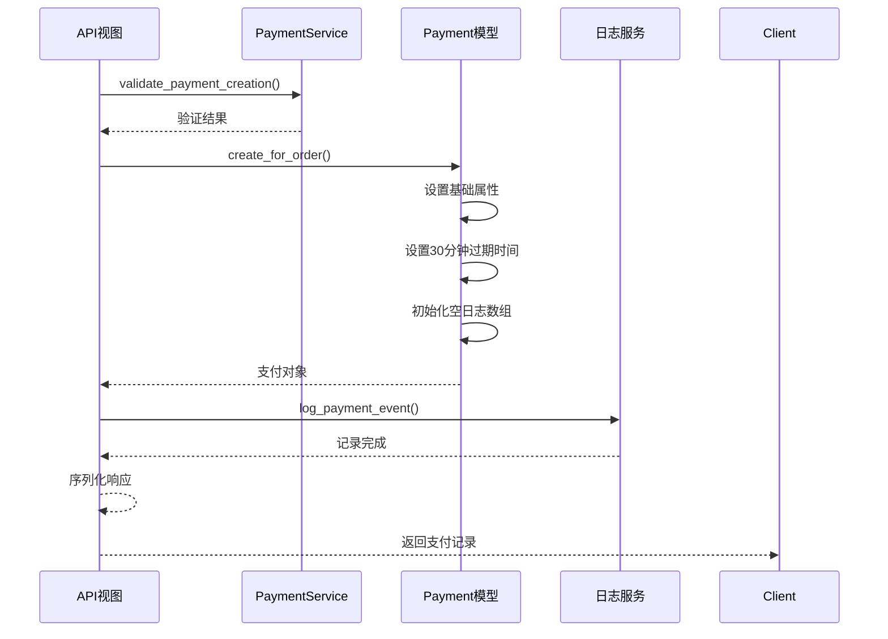

**图表来源**
- [views.py](file://backend/orders/views.py#L916-L932)
- [models.py](file://backend/orders/models.py#L223-L234)

### 过期时间设置

支付记录默认设置30分钟的有效期：

| 参数 | 值 | 说明 |
|------|-----|------|
| **默认TTL** | 30分钟 | 标准支付窗口 |
| **最小TTL** | 5分钟 | 最短支付时间 |
| **最大TTL** | 120分钟 | 最长支付时间 |
| **过期检查频率** | 实时 | 每次访问时检查 |

**节来源**
- [models.py](file://backend/orders/models.py#L223-L234)

### 初始化支付日志

每次支付记录创建都会初始化相应的日志条目：

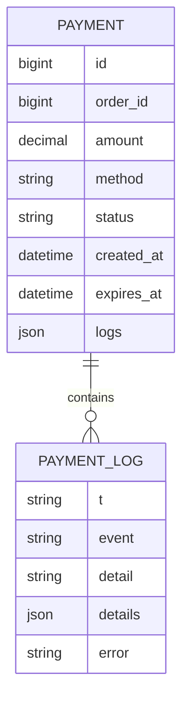

**图表来源**
- [models.py](file://backend/orders/models.py#L208-L209)

**节来源**
- [views.py](file://backend/orders/views.py#L919-L928)

## 前端集成实现

### paymentService.createPayment() 方法

前端提供了简洁的JavaScript服务接口：

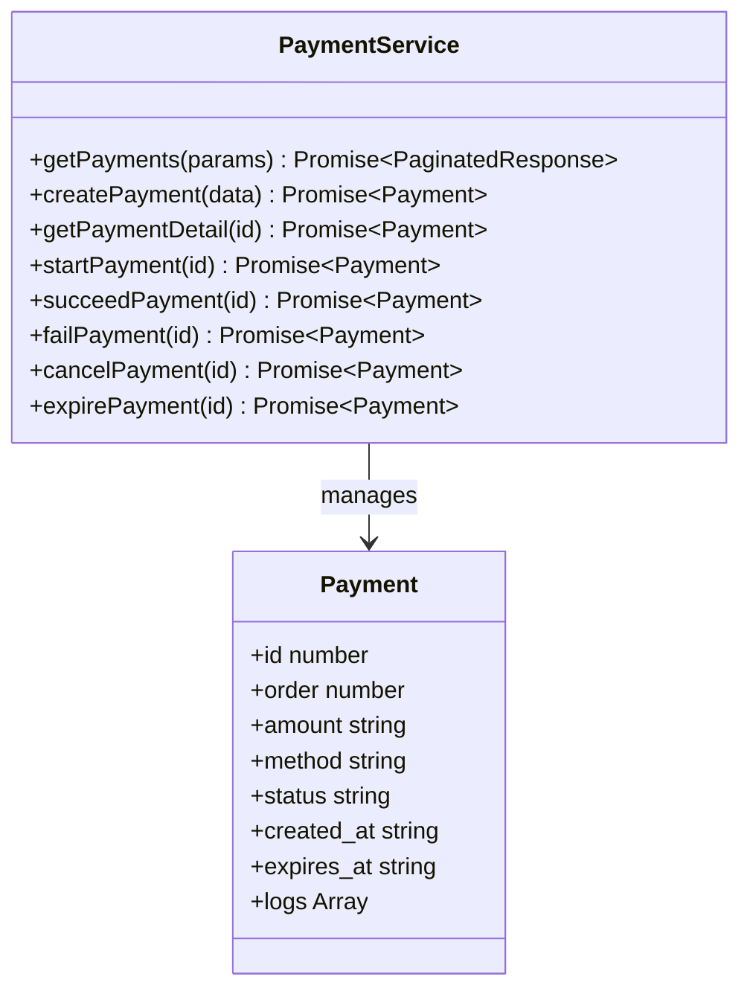

**图表来源**
- [payment.ts](file://frontend/src/services/payment.ts#L4-L51)

### 客户端调用示例

以下是典型的支付创建客户端实现：

```typescript
// 基本支付创建
const payment = await paymentService.createPayment({
    order_id: 123,
    method: 'wechat'
});

// 包含金额验证的支付创建
const payment = await paymentService.createPayment({
    order_id: 123,
    method: 'alipay',
    amount: '100.00'
});
```

**节来源**
- [payment.ts](file://frontend/src/services/payment.ts#L15-L20)

### 前端最佳实践

基于订单详情页面的实现展示了最佳实践：

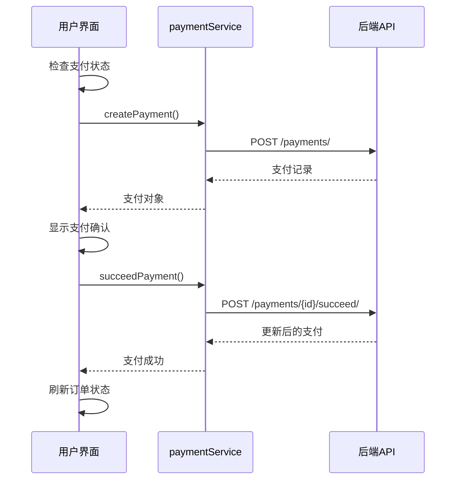

**图表来源**
- [index.tsx](file://frontend/src/pages/order-detail/index.tsx#L50-L84)

**节来源**
- [index.tsx](file://frontend/src/pages/order-detail/index.tsx#L50-L84)

## 错误处理与状态码

### HTTP状态码映射

| 状态码 | 场景 | 错误信息 |
|--------|------|----------|
| **201** | 支付创建成功 | 返回支付记录对象 |
| **400** | 参数验证失败 | `order_id is required and must be an integer` |
| **400** | 支付方式无效 | `Unsupported payment method: {method}` |
| **400** | 支付金额无效 | `Invalid payment amount` |
| **400** | 支付金额不匹配 | `Payment amount {amount} does not match order amount {amount}` |
| **404** | 订单不存在 | `Order not found` |
| **409** | 订单状态不允许支付 | `订单状态为{status}，不允许支付` |
| **409** | 订单已过期 | `订单已过期，请重新创建` |
| **409** | 存在活动支付记录 | `An active payment record already exists for this order` |
| **500** | 内部服务器错误 | `Failed to create payment: {error}` |

**节来源**
- [views.py](file://backend/orders/views.py#L840-L938)

### 错误处理流程

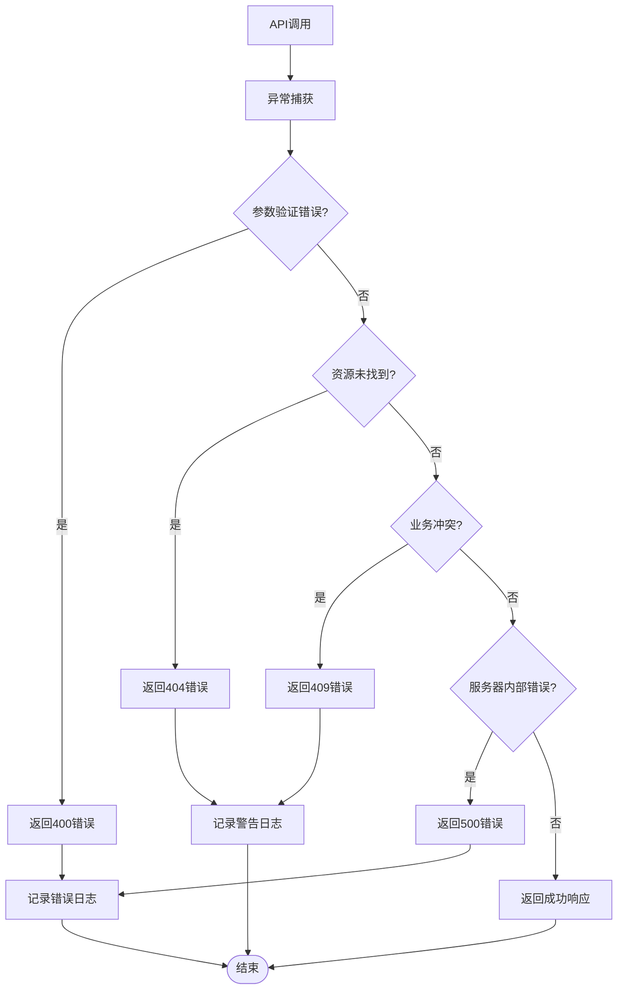

**图表来源**
- [views.py](file://backend/orders/views.py#L840-L938)

## 最佳实践指南

### 后端开发最佳实践

1. **参数验证优先**：始终在业务逻辑执行前进行参数验证
2. **事务管理**：使用数据库事务确保数据一致性
3. **日志记录**：每个关键操作都要记录详细的日志
4. **错误处理**：提供清晰的错误信息和适当的HTTP状态码
5. **幂等性**：防止重复创建支付记录

### 前端开发最佳实践

1. **状态管理**：合理管理支付过程中的各种状态
2. **用户反馈**：及时向用户提供支付进度反馈
3. **错误处理**：优雅处理各种可能的错误情况
4. **用户体验**：提供清晰的支付指引和确认流程
5. **性能优化**：避免不必要的重复请求

### 安全考虑

1. **参数验证**：防止SQL注入和XSS攻击
2. **权限检查**：确保用户只能访问自己的订单
3. **金额验证**：防止金额篡改攻击
4. **日志审计**：记录所有支付相关操作
5. **超时控制**：设置合理的支付超时时间

## 总结

支付创建功能通过精心设计的验证机制和完善的错误处理，确保了支付流程的安全性和可靠性。该功能具有以下特点：

### 核心优势

1. **严格验证**：多层次的参数和业务验证确保数据完整性
2. **灵活配置**：支持多种支付方式和自定义参数
3. **完善监控**：详细的日志记录便于问题排查和审计
4. **用户友好**：清晰的错误信息和状态反馈
5. **安全可靠**：多重防护机制保障支付安全

### 技术亮点

- **幂等性设计**：防止重复支付和数据不一致
- **实时状态检查**：动态验证订单状态和有效期
- **精确金额验证**：支持浮点数精度误差处理
- **完整的生命周期**：从创建到完成的全流程跟踪

该支付创建功能为电小二小程序提供了稳定可靠的支付基础设施，支撑了整个电商系统的正常运转。