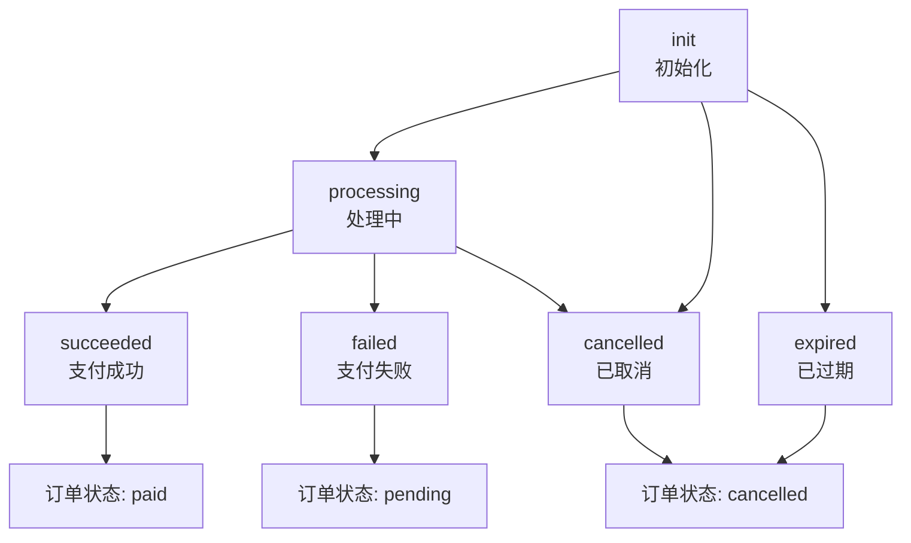
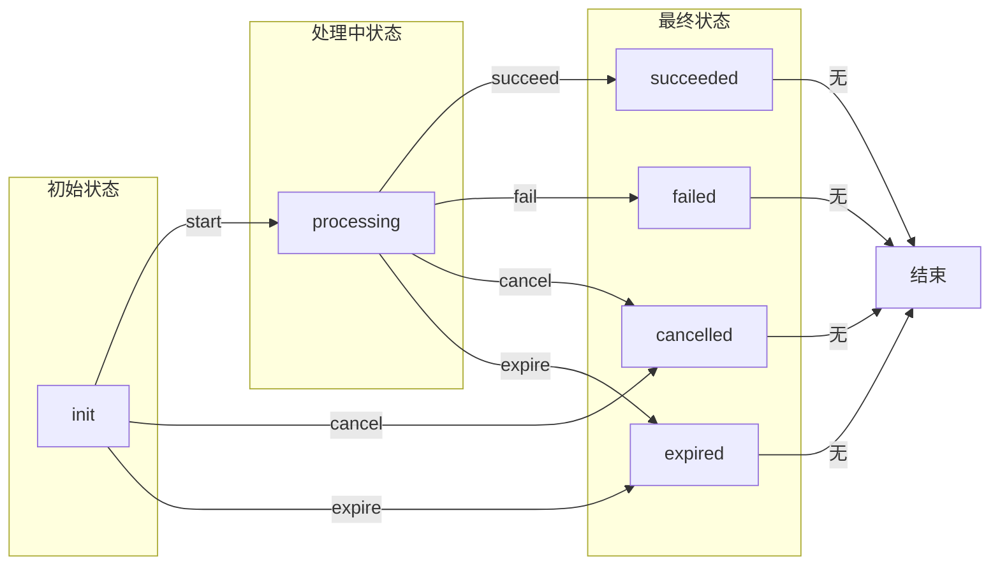
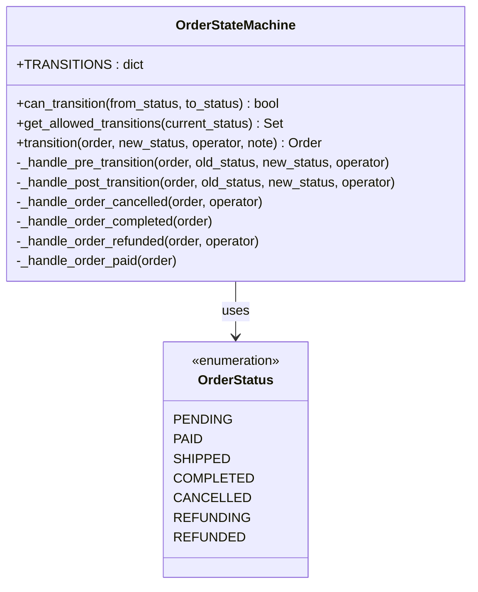
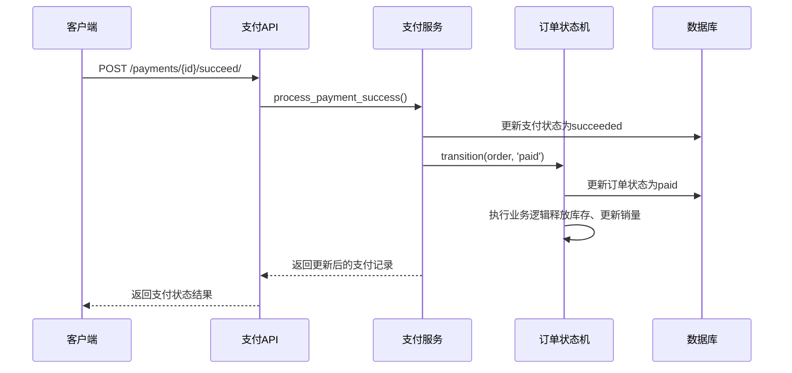

# 支付状态管理

<cite>
**本文档引用的文件**
- [models.py](file://backend/orders/models.py)
- [state_machine.py](file://backend/orders/state_machine.py)
- [payment_service.py](file://backend/orders/payment_service.py)
- [views.py](file://backend/orders/views.py)
- [payment.ts](file://frontend/src/services/payment.ts)
- [urls.py](file://backend/orders/urls.py)
- [api.md](file://api.md)
</cite>

## 目录
1. [概述](#概述)
2. [支付状态定义](#支付状态定义)
3. [状态转换规则](#状态转换规则)
4. [REST API操作详解](#rest-api操作详解)
5. [状态机架构](#状态机架构)
6. [前端服务集成](#前端服务集成)
7. [业务逻辑实现](#业务逻辑实现)
8. [安全性考虑](#安全性考虑)
9. [最佳实践](#最佳实践)
10. [故障排除](#故障排除)

## 概述

支付状态管理系统是电商系统中的核心组件，负责跟踪和管理支付流程的各个阶段。该系统采用状态机模式，确保支付状态的合法转换，防止并发问题，并提供完整的审计日志。

系统支持六种支付状态：`init`（初始化）、`processing`（处理中）、`succeeded`（成功）、`failed`（失败）、`cancelled`（已取消）、`expired`（已过期）。每种状态都有明确的业务含义和转换规则。

## 支付状态定义

### 状态常量定义



**图表来源**
- [models.py](file://backend/orders/models.py#L192-L198)

### 状态字段定义

支付模型中的状态字段定义如下：

| 状态值 | 中文描述 | 英文描述 | 业务含义 |
|--------|----------|----------|----------|
| `init` | 待支付 | Pending | 支付记录已创建，等待用户发起支付 |
| `processing` | 支付中 | Processing | 用户已发起支付，正在处理中 |
| `succeeded` | 支付成功 | Succeeded | 支付成功，订单状态更新为待发货 |
| `failed` | 支付失败 | Failed | 支付失败，订单保持待支付状态 |
| `cancelled` | 已取消 | Cancelled | 支付被主动取消，订单状态更新为已取消 |
| `expired` | 已过期 | Expired | 支付超时过期，订单状态更新为已取消 |

**节来源**
- [models.py](file://backend/orders/models.py#L192-L198)

## 状态转换规则

### 合法转换矩阵



**图表来源**
- [state_machine.py](file://backend/orders/state_machine.py#L34-L56)

### 转换约束

系统严格控制状态转换的合法性，以下转换是非法的：

1. **已成功状态**：`succeeded` → 任何其他状态
2. **已失败状态**：`failed` → 任何其他状态
3. **已取消状态**：`cancelled` → 任何其他状态
4. **已过期状态**：`expired` → 任何其他状态

**节来源**
- [state_machine.py](file://backend/orders/state_machine.py#L59-L77)

## REST API操作详解

### 支付创建API

**端点**: `POST /payments/`

**功能**: 为指定订单创建新的支付记录

**请求参数**:
```typescript
{
  order_id: number,           // 必需：订单ID
  method?: 'wechat' | 'alipay' | 'bank',  // 可选：支付方式，默认微信
  amount?: string            // 可选：支付金额（验证订单金额一致性）
}
```

**响应**: 创建的支付记录对象

**业务逻辑**:
- 验证订单存在且属于当前用户
- 检查订单状态是否允许支付
- 验证支付金额（如果提供）
- 防止重复创建未过期的支付记录
- 设置默认30分钟有效期

**节来源**
- [views.py](file://backend/orders/views.py#L811-L938)

### 状态变更API

#### 1. 开始支付 - start

**端点**: `POST /payments/{id}/start/`

**功能**: 将支付状态从`init`转为`processing`

**权限**: `IsOwnerOrAdmin`

**状态转换规则**:
- 仅当状态为`init`时允许转换
- 不允许转换到`succeeded`、`cancelled`、`expired`状态
- 记录操作日志："user starts payment"

**节来源**
- [views.py](file://backend/orders/views.py#L940-L948)

#### 2. 支付成功 - succeed

**端点**: `POST /payments/{id}/succeed/`

**功能**: 将支付状态从`processing`转为`succeeded`

**权限**: `IsOwnerOrAdmin`

**状态转换规则**:
- 仅当状态为`processing`时允许转换
- 自动更新关联订单状态为`paid`
- 使用状态机确保订单状态转换合法性
- 记录完整操作日志

**业务影响**:
- 订单状态从`pending` → `paid`
- 触发库存锁定、通知发送等业务逻辑
- 更新商品销量统计

**节来源**
- [views.py](file://backend/orders/views.py#L950-L970)

#### 3. 支付失败 - fail

**端点**: `POST /payments/{id}/fail/`

**功能**: 将支付状态从`processing`转为`failed`

**权限**: `IsOwnerOrAdmin`

**状态转换规则**:
- 仅当状态为`processing`时允许转换
- 不影响订单状态
- 记录失败原因和详细信息

**节来源**
- [views.py](file://backend/orders/views.py#L1107-L1112)

#### 4. 取消支付 - cancel

**端点**: `POST /payments/{id}/cancel/`

**功能**: 将支付状态从`init`或`processing`转为`cancelled`

**权限**: `IsOwnerOrAdmin`

**状态转换规则**:
- 允许从`init`或`processing`状态转换
- 不影响订单状态（保持原状态）
- 记录取消原因

**节来源**
- [views.py](file://backend/orders/views.py#L1115-L1120)

#### 5. 支付过期 - expire

**端点**: `POST /payments/{id}/expire/`

**功能**: 将支付状态从任何状态转为`expired`

**权限**: `IsOwnerOrAdmin`

**状态转换规则**:
- 从任何状态都可以转换为`expired`
- 自动将关联订单状态设置为`cancelled`
- 释放锁定的库存
- 记录过期原因

**业务影响**:
- 订单状态从`pending` → `cancelled`
- 释放库存，允许其他用户购买
- 触发库存释放业务逻辑

**节来源**
- [views.py](file://backend/orders/views.py#L1123-L1129)

### 支付回调API

**端点**: `POST /payments/callback/<provider>/`

**功能**: 处理第三方支付平台的支付回调

**支持的提供商**: `mock`、`wechat`、`alipay`

**业务逻辑**:
- 验证回调签名真实性
- 防止重复处理已成功的支付
- 根据回调状态更新支付状态
- 自动更新订单状态
- 记录完整的支付日志

**节来源**
- [views.py](file://backend/orders/views.py#L1134-L1296)

## 状态机架构

### 订单状态机设计



**图表来源**
- [state_machine.py](file://backend/orders/state_machine.py#L14-L289)

### 状态转换验证

状态机提供严格的转换验证机制：

```python
# 示例：验证状态转换合法性
if not OrderStateMachine.can_transition(current_status, new_status):
    raise ValueError(f'不允许的状态转换: {current_status} -> {new_status}')
```

**节来源**
- [state_machine.py](file://backend/orders/state_machine.py#L59-L77)

### 业务逻辑处理

状态转换完成后自动执行相应的业务逻辑：

1. **订单取消**: 释放锁定的库存
2. **订单完成**: 更新商品销量统计
3. **订单退款**: 释放库存并处理退款
4. **支付成功**: 更新商品浏览次数

**节来源**
- [state_machine.py](file://backend/orders/state_machine.py#L178-L288)

## 前端服务集成

### 前端支付服务接口

前端通过`paymentService`提供完整的支付状态管理功能：

```typescript
// 支付状态管理API
const paymentService = {
  // 获取支付记录列表
  getPayments(params?: {order_id?: number, page?: number, page_size?: number}): Promise<PaginatedResponse<Payment>>,
  
  // 创建支付记录
  createPayment(data: {order_id: number, method?: 'wechat' | 'alipay' | 'bank', amount?: string}): Promise<Payment>,
  
  // 获取支付详情
  getPaymentDetail(id: number): Promise<Payment>,
  
  // 开始支付
  startPayment(id: number): Promise<Payment>,
  
  // 支付成功
  succeedPayment(id: number): Promise<Payment>,
  
  // 支付失败
  failPayment(id: number): Promise<Payment>,
  
  // 取消支付
  cancelPayment(id: number): Promise<Payment>,
  
  // 支付过期
  expirePayment(id: number): Promise<Payment>
}
```

**节来源**
- [payment.ts](file://frontend/src/services/payment.ts#L4-L52)

### 前端状态同步

前端需要实时同步支付状态变化：

```typescript
// 示例：监听支付状态变化
async function handlePaymentStatusChange(paymentId: number) {
  const payment = await paymentService.getPaymentDetail(paymentId);
  
  switch(payment.status) {
    case 'succeeded':
      // 更新UI显示支付成功
      break;
    case 'failed':
      // 显示支付失败提示
      break;
    case 'expired':
      // 显示支付过期提示
      break;
  }
}
```

## 业务逻辑实现

### 并发控制

系统采用数据库锁机制防止并发问题：

```python
# 使用select_for_update锁定支付记录
payment = Payment.objects.select_for_update().get(id=payment_id)
```

**节来源**
- [payment_service.py](file://backend/orders/payment_service.py#L143-L144)

### 支付金额验证

系统严格验证支付金额的一致性：

```python
# 允许0.01元的误差
difference = abs(order.total_amount - payment_amount)
return difference < Decimal('0.01')
```

**节来源**
- [payment_service.py](file://backend/orders/payment_service.py#L71-L103)

### 日志记录

每次状态变更都会记录详细的日志：

```python
# 示例日志结构
{
    't': timezone.now().isoformat(),
    'event': 'payment_succeeded',
    'operator': operator.username if operator else 'system',
    'detail': 'Payment processed successfully'
}
```

**节来源**
- [payment_service.py](file://backend/orders/payment_service.py#L175-L180)

### 订单状态同步

支付状态变更会自动同步更新订单状态：



**图表来源**
- [payment_service.py](file://backend/orders/payment_service.py#L106-L203)
- [state_machine.py](file://backend/orders/state_machine.py#L96-L154)

## 安全性考虑

### 签名验证

支付回调接口实现了严格的签名验证机制：

```python
# HMAC-SHA256签名验证
expected_signature = hmac.new(
    secret.encode('utf-8'),
    sign_str.encode('utf-8'),
    hashlib.sha256
).hexdigest()

# 使用恒定时间比较防止时序攻击
return hmac.compare_digest(signature, expected_signature)
```

**节来源**
- [payment_service.py](file://backend/orders/payment_service.py#L31-L68)

### 权限控制

所有支付相关API都实施严格的权限控制：

- `IsOwnerOrAdmin`: 用户只能访问自己的支付记录
- `IsAdmin`: 管理员可以访问所有支付记录
- `PaymentRateThrottle`: 限制API调用频率，防止滥用

**节来源**
- [views.py](file://backend/orders/views.py#L793-L794)

### 防重复处理

系统防止重复处理已成功的支付：

```python
# 检查是否已处理过
if payment.status == 'succeeded':
    logger.warning(f'支付记录#{payment_id}已处理过，忽略重复处理')
    return payment
```

**节来源**
- [payment_service.py](file://backend/orders/payment_service.py#L147-L148)

## 最佳实践

### 状态转换时机

1. **开始支付**: 用户点击支付按钮时调用
2. **支付成功**: 接收第三方支付回调时调用
3. **支付失败**: 用户取消支付或支付失败时调用
4. **支付取消**: 用户主动取消支付时调用
5. **支付过期**: 定时任务检测支付超时时调用

### 错误处理

```python
try:
    # 执行状态转换
    OrderStateMachine.transition(order, new_status, operator, note)
except ValueError as e:
    # 记录错误但不中断流程
    logger.error(f'订单状态转换失败: {str(e)}')
    payment.logs.append({
        't': timezone.now().isoformat(),
        'event': 'order_transition_failed',
        'error': str(e)
    })
    payment.save()
```

**节来源**
- [payment_service.py](file://backend/orders/payment_service.py#L194-L202)

### 监控和告警

建议监控以下指标：
- 支付成功率
- 支付失败率
- 支付超时率
- 状态转换延迟
- 并发冲突率

## 故障排除

### 常见问题及解决方案

#### 1. 支付状态无法转换

**症状**: 调用状态变更API返回400错误

**原因**: 当前状态不允许转换

**解决**: 检查支付记录的当前状态，确保符合转换规则

#### 2. 订单状态未同步更新

**症状**: 支付状态已成功，但订单状态仍为待支付

**原因**: 状态机转换失败

**解决**: 检查订单状态转换日志，确认状态机配置正确

#### 3. 并发处理问题

**症状**: 多次调用导致重复处理

**原因**: 缺少适当的锁机制

**解决**: 系统已使用数据库锁，确保正确使用

#### 4. 支付回调失败

**症状**: 第三方支付回调无法正常处理

**原因**: 签名验证失败或订单不存在

**解决**: 检查回调签名配置和订单关联关系

### 调试工具

```python
# 获取支付状态历史
def get_payment_history(payment_id):
    payment = Payment.objects.get(id=payment_id)
    return payment.logs

# 检查订单状态转换权限
def check_order_transition_permissions(order, new_status):
    return OrderStateMachine.can_transition(order.status, new_status)
```

**节来源**
- [state_machine.py](file://backend/orders/state_machine.py#L59-L87)

## 总结

支付状态管理系统通过状态机模式确保了支付流程的可靠性和一致性。系统提供了完整的API接口，支持前端和服务端的各种业务场景。通过严格的权限控制、并发保护和日志记录，保证了系统的安全性和可追溯性。

关键特性包括：
- 六种明确的支付状态
- 合法的状态转换规则
- 完整的审计日志
- 并发安全的处理机制
- 自动化的订单状态同步
- 强大的错误处理能力

该系统为电商平台提供了稳定可靠的支付状态管理基础，支持复杂的业务场景和高并发访问需求。