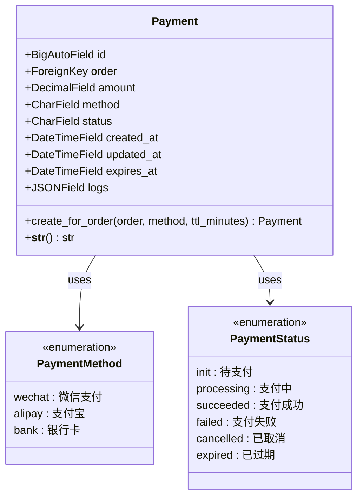
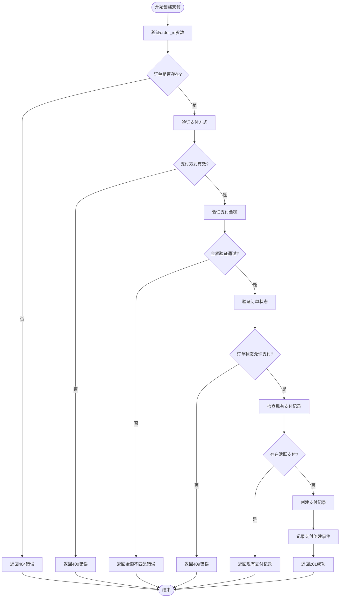
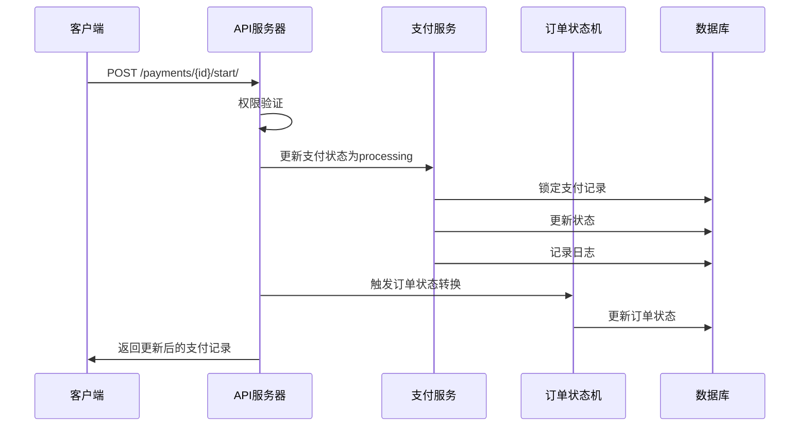
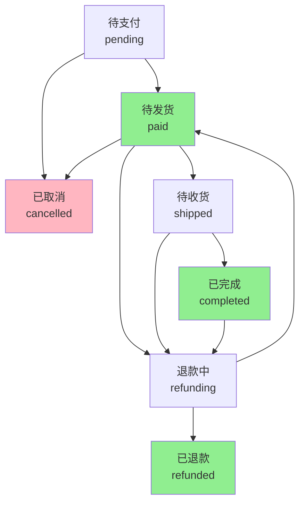
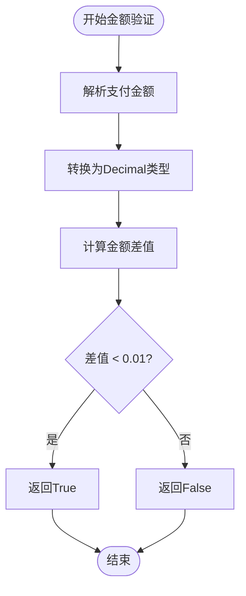
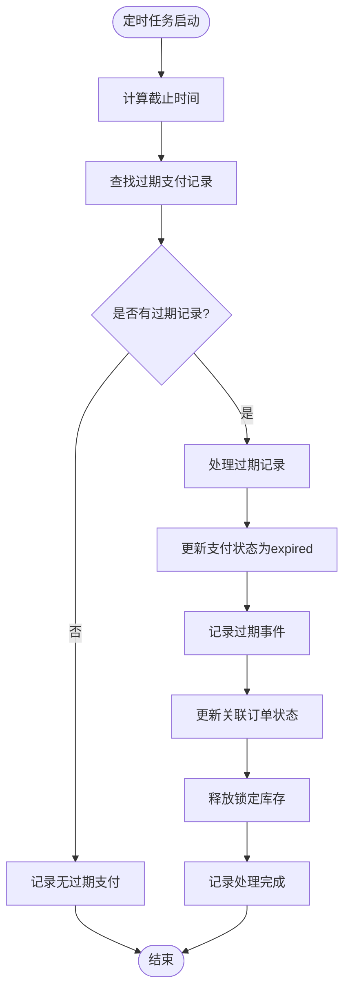

# 支付管理

<cite>
**本文档中引用的文件**
- [models.py](file://backend/orders/models.py)
- [payment_service.py](file://backend/orders/payment_service.py)
- [views.py](file://backend/orders/views.py)
- [serializers.py](file://backend/orders/serializers.py)
- [state_machine.py](file://backend/orders/state_machine.py)
- [cancel_unpaid_orders.py](file://backend/orders/management/commands/cancel_unpaid_orders.py)
- [payment.ts](file://frontend/src/services/payment.ts)
- [api.md](file://api.md)
</cite>

## 目录
1. [简介](#简介)
2. [支付模型结构](#支付模型结构)
3. [支付生命周期管理](#支付生命周期管理)
4. [支付CRUD操作](#支付crud操作)
5. [支付状态管理](#支付状态管理)
6. [支付验证机制](#支付验证机制)
7. [支付查询接口](#支付查询接口)
8. [支付过期处理](#支付过期处理)
9. [前端支付服务](#前端支付服务)
10. [最佳实践](#最佳实践)

## 简介

支付管理系统是电小二小程序的核心功能模块，负责处理订单的支付流程，包括支付记录的创建、状态管理、金额验证和生命周期控制。系统采用状态机模式管理支付状态，确保支付流程的安全性和一致性。

## 支付模型结构

### Payment模型字段详解



**图表来源**
- [models.py](file://backend/orders/models.py#L186-L234)

#### 核心字段说明

| 字段名 | 类型 | 描述 | 默认值 |
|--------|------|------|--------|
| `id` | BigAutoField | 主键ID | 自动生成 |
| `order` | ForeignKey | 关联的订单 | 必填 |
| `amount` | DecimalField | 支付金额 | 必填 |
| `method` | CharField | 支付方式 | 'wechat' |
| `status` | CharField | 支付状态 | 'init' |
| `created_at` | DateTimeField | 创建时间 | 自动设置 |
| `updated_at` | DateTimeField | 更新时间 | 自动更新 |
| `expires_at` | DateTimeField | 过期时间 | 必填 |
| `logs` | JSONField | 支付日志 | [] |

**章节来源**
- [models.py](file://backend/orders/models.py#L186-L234)

## 支付生命周期管理

### 支付状态转换图

```mermaid
stateDiagram-v2
[*] --> init : 创建支付记录
init --> processing : 开始支付
processing --> succeeded : 支付成功
processing --> failed : 支付失败
processing --> cancelled : 取消支付
processing --> expired : 支付超时
succeeded --> [*] : 完成
failed --> [*] : 完成
cancelled --> [*] : 完成
expired --> [*] : 完成
note right of init : 状态 : init<br/>描述 : 待支付
note right of processing : 状态 : processing<br/>描述 : 支付中
note right of succeeded : 状态 : succeeded<br/>描述 : 支付成功
note right of failed : 状态 : failed<br/>描述 : 支付失败
note right of cancelled : 状态 : cancelled<br/>描述 : 已取消
note right of expired : 状态 : expired<br/>描述 : 已过期
```

**图表来源**
- [models.py](file://backend/orders/models.py#L192-L199)
- [state_machine.py](file://backend/orders/state_machine.py#L33-L56)

### 支付状态详细说明

#### init（待支付）
- **描述**: 支付记录已创建，等待用户发起支付
- **触发条件**: 调用`POST /payments/`创建支付记录
- **特征**: 支付金额等于订单金额，有效期30分钟

#### processing（支付中）
- **描述**: 用户正在支付过程中
- **触发条件**: 调用`POST /payments/{id}/start/`
- **特征**: 支付记录锁定，防止重复支付

#### succeeded（支付成功）
- **描述**: 支付已完成，订单状态更新为"待发货"
- **触发条件**: 支付回调验证成功或手动标记成功
- **特征**: 自动更新关联订单状态为"paid"

#### failed（支付失败）
- **描述**: 支付过程出错或用户取消
- **触发条件**: 支付失败回调或手动标记失败
- **特征**: 支付记录保留，可重新发起支付

#### cancelled（已取消）
- **描述**: 用户主动取消支付
- **触发条件**: 调用`POST /payments/{id}/cancel/`
- **特征**: 支付记录保留，不影响订单状态

#### expired（已过期）
- **描述**: 支付超时未完成
- **触发条件**: 超过30分钟未完成支付
- **特征**: 自动取消关联订单，释放库存

**章节来源**
- [models.py](file://backend/orders/models.py#L192-L199)
- [payment_service.py](file://backend/orders/payment_service.py#L106-L205)

## 支付CRUD操作

### 创建支付记录（POST /payments/）

#### 请求参数验证



**图表来源**
- [views.py](file://backend/orders/views.py#L812-L939)

#### 创建支付的具体实现

创建支付记录涉及多个验证步骤和业务逻辑：

1. **参数验证**: 验证`order_id`、支付方式和金额
2. **订单验证**: 确认订单存在且属于当前用户
3. **金额验证**: 检查支付金额与订单金额的一致性
4. **状态验证**: 确认订单处于允许支付的状态
5. **重复检查**: 防止创建重复的支付记录
6. **支付创建**: 调用`Payment.create_for_order()`创建记录

**章节来源**
- [views.py](file://backend/orders/views.py#L812-L939)

### 支付状态更新操作

#### 开始支付（POST /payments/{id}/start/）



**图表来源**
- [views.py](file://backend/orders/views.py#L1216-L1276)

#### 支付成功处理（POST /payments/{id}/succeed/）

支付成功处理包含以下关键步骤：

1. **并发控制**: 使用数据库锁防止重复处理
2. **过期检查**: 验证支付记录是否已过期
3. **状态更新**: 将支付状态更新为"succeeded"
4. **交易记录**: 记录第三方支付系统的交易ID
5. **订单同步**: 使用状态机更新关联订单状态
6. **日志记录**: 完整记录整个处理过程

**章节来源**
- [payment_service.py](file://backend/orders/payment_service.py#L106-L205)

### 支付查询接口

#### GET /payments/

支付查询接口支持多种查询条件：

| 查询参数 | 类型 | 描述 | 示例 |
|----------|------|------|------|
| `order_id` | Integer | 按订单ID筛选 | `/payments/?order_id=123` |
| `page` | Integer | 页码 | `/payments/?page=2` |
| `page_size` | Integer | 每页数量 | `/payments/?page_size=20` |

#### 查询权限控制

- **普通用户**: 只能查询自己订单的支付记录
- **管理员**: 可以查询所有用户的支付记录

**章节来源**
- [views.py](file://backend/orders/views.py#L797-L800)

## 支付状态管理

### 状态机设计



**图表来源**
- [state_machine.py](file://backend/orders/state_machine.py#L33-L56)

### 状态转换规则

#### 支付状态转换表

| 当前状态 | 允许转换到的状态 | 转换条件 |
|----------|------------------|----------|
| init | processing | 用户开始支付 |
| processing | succeeded | 支付成功回调 |
| processing | failed | 支付失败回调 |
| processing | cancelled | 用户取消支付 |
| processing | expired | 支付超时 |
| succeeded | - | 终态，不可转换 |
| failed | - | 终态，不可转换 |
| cancelled | - | 终态，不可转换 |
| expired | - | 终态，不可转换 |

**章节来源**
- [state_machine.py](file://backend/orders/state_machine.py#L33-L56)

## 支付验证机制

### 支付金额验证



**图表来源**
- [payment_service.py](file://backend/orders/payment_service.py#L71-L104)

### 订单状态验证

支付创建前的订单验证包括：

1. **状态检查**: 订单状态必须为'pending'或'paid'
2. **金额验证**: 支付金额必须与订单金额一致
3. **时效检查**: 订单创建时间不能超过24小时
4. **重复检查**: 防止创建重复的支付记录

**章节来源**
- [payment_service.py](file://backend/orders/payment_service.py#L207-L242)

## 支付查询接口

### 支付状态轮询机制

前端可以通过轮询机制监控支付状态变化：

```typescript
// 支付状态轮询示例
async function pollPaymentStatus(paymentId: number, maxAttempts: number = 30) {
    let attempts = 0;
    
    while (attempts < maxAttempts) {
        try {
            const payment = await paymentService.getPaymentDetail(paymentId);
            
            if (['succeeded', 'failed', 'cancelled', 'expired'].includes(payment.status)) {
                return payment; // 支付完成或失败
            }
            
            if (payment.status === 'processing') {
                // 等待一段时间后重试
                await new Promise(resolve => setTimeout(resolve, 2000));
                attempts++;
            }
        } catch (error) {
            console.error('查询支付状态失败:', error);
            break;
        }
    }
    
    throw new Error('支付状态查询超时');
}
```

### 按订单查询支付记录

```typescript
// 按订单查询支付记录
async function getPaymentsByOrder(orderId: number) {
    try {
        const response = await paymentService.getPayments({ order_id: orderId });
        return response.results; // 返回支付记录列表
    } catch (error) {
        console.error('获取订单支付记录失败:', error);
        return [];
    }
}
```

**章节来源**
- [payment.ts](file://frontend/src/services/payment.ts#L1-L52)

## 支付过期处理

### 自动过期机制

系统提供自动过期处理功能，通过管理命令定期清理过期支付记录：



**图表来源**
- [cancel_unpaid_orders.py](file://backend/orders/management/commands/cancel_unpaid_orders.py#L50-L97)

### 过期处理策略

1. **时间阈值**: 默认30分钟支付超时
2. **状态更新**: 将支付状态更新为"expired"
3. **订单同步**: 自动取消关联订单
4. **库存释放**: 释放锁定的商品库存
5. **日志记录**: 完整记录过期处理过程

**章节来源**
- [cancel_unpaid_orders.py](file://backend/orders/management/commands/cancel_unpaid_orders.py#L1-L97)

## 前端支付服务

### 支付服务API封装

前端支付服务提供了完整的支付操作API：

```typescript
export const paymentService = {
    // 获取支付记录列表
    getPayments(params?: { order_id?: number, page?: number, page_size?: number }),
    
    // 创建支付记录
    createPayment(data: { order_id: number, method?: 'wechat' | 'alipay' | 'bank', amount?: string }),
    
    // 获取支付详情
    getPaymentDetail(id: number),
    
    // 开始支付
    startPayment(id: number),
    
    // 支付成功
    succeedPayment(id: number),
    
    // 支付失败
    failPayment(id: number),
    
    // 取消支付
    cancelPayment(id: number),
    
    // 支付过期
    expirePayment(id: number)
};
```

### 前端状态管理

前端需要维护支付状态的本地状态：

```typescript
interface PaymentState {
    loading: boolean;
    payment: Payment | null;
    error: string | null;
    polling: boolean;
}

const initialState: PaymentState = {
    loading: false,
    payment: null,
    error: null,
    polling: false
};
```

**章节来源**
- [payment.ts](file://frontend/src/services/payment.ts#L1-L52)

## 最佳实践

### 支付安全性

1. **金额验证**: 严格验证支付金额与订单金额的一致性
2. **并发控制**: 使用数据库锁防止重复支付处理
3. **签名验证**: 对支付回调进行签名验证
4. **日志记录**: 完整记录支付操作的审计日志

### 性能优化

1. **索引优化**: 为支付状态、创建时间和订单ID建立索引
2. **查询优化**: 使用select_related和prefetch_related减少查询次数
3. **缓存策略**: 对频繁查询的支付信息进行缓存
4. **异步处理**: 支付回调采用异步处理机制

### 错误处理

1. **幂等性**: 确保支付操作的幂等性
2. **重试机制**: 实现智能的重试机制
3. **降级策略**: 支付失败时的降级处理
4. **监控告警**: 建立完善的支付监控体系

### 用户体验

1. **实时反馈**: 提供支付状态的实时更新
2. **错误提示**: 显示清晰的错误信息
3. **操作引导**: 引导用户完成支付流程
4. **状态持久化**: 保持支付状态的一致性