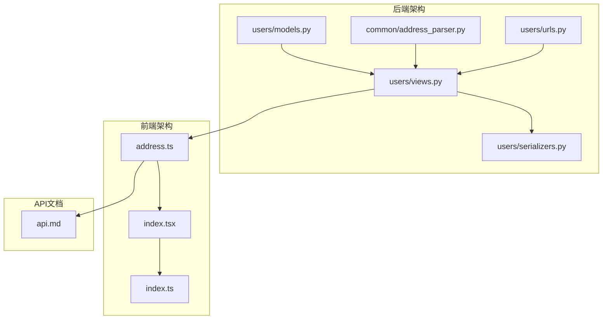
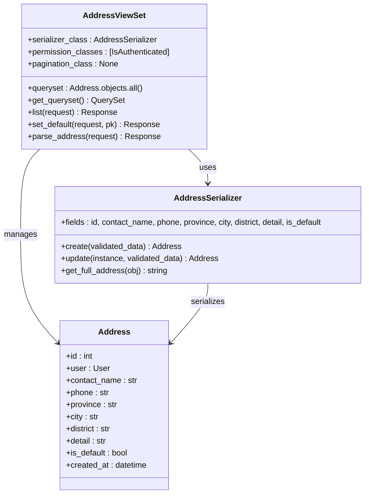
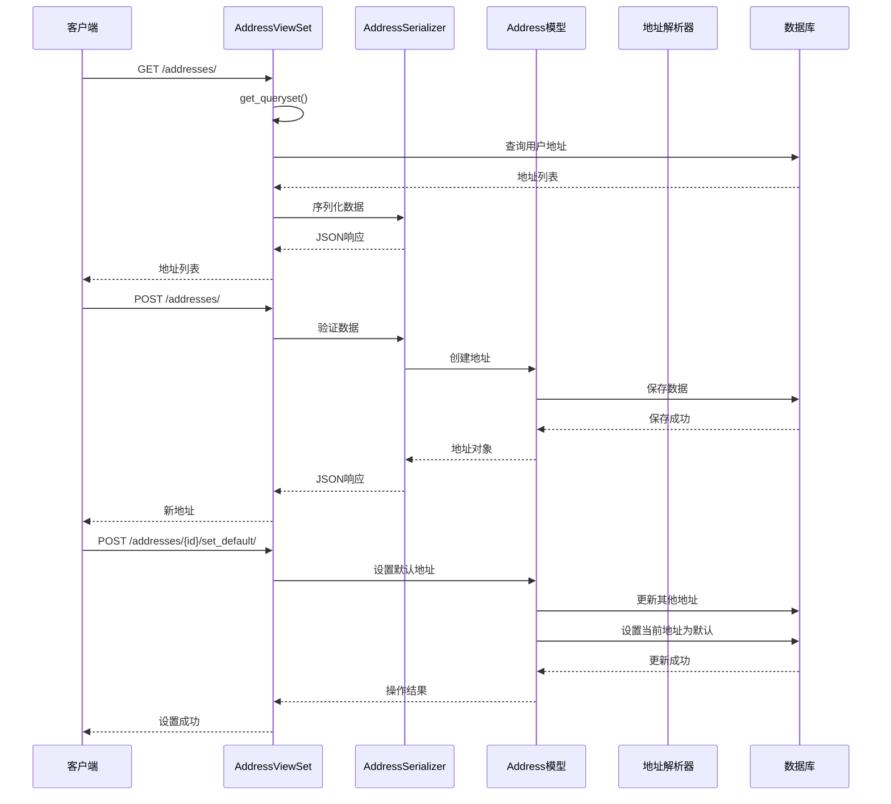
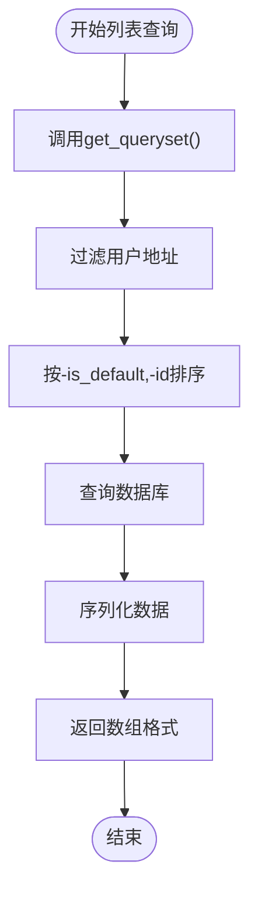
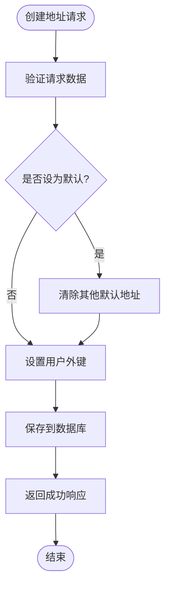
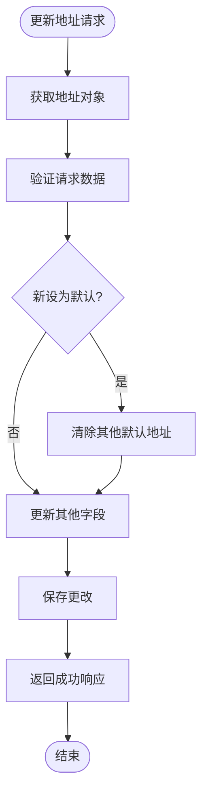
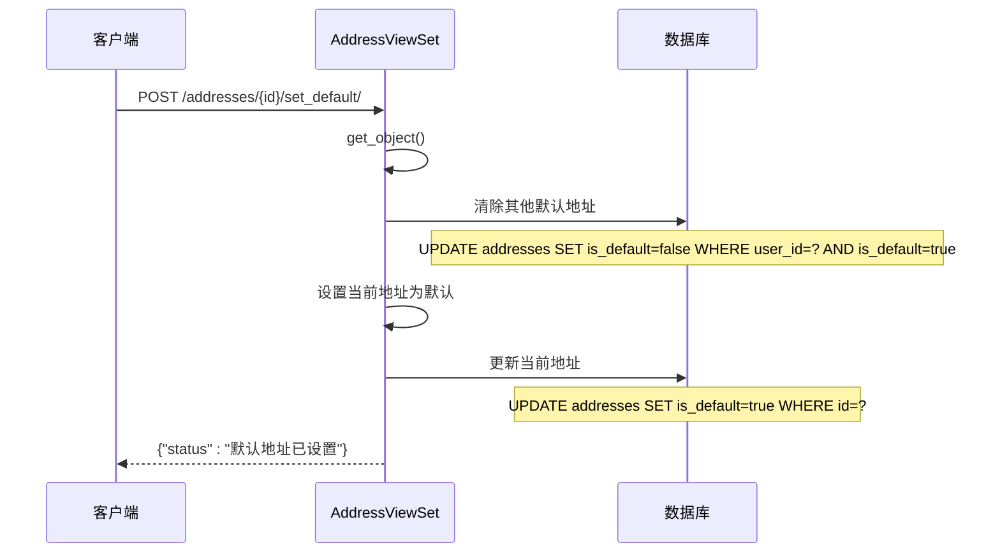
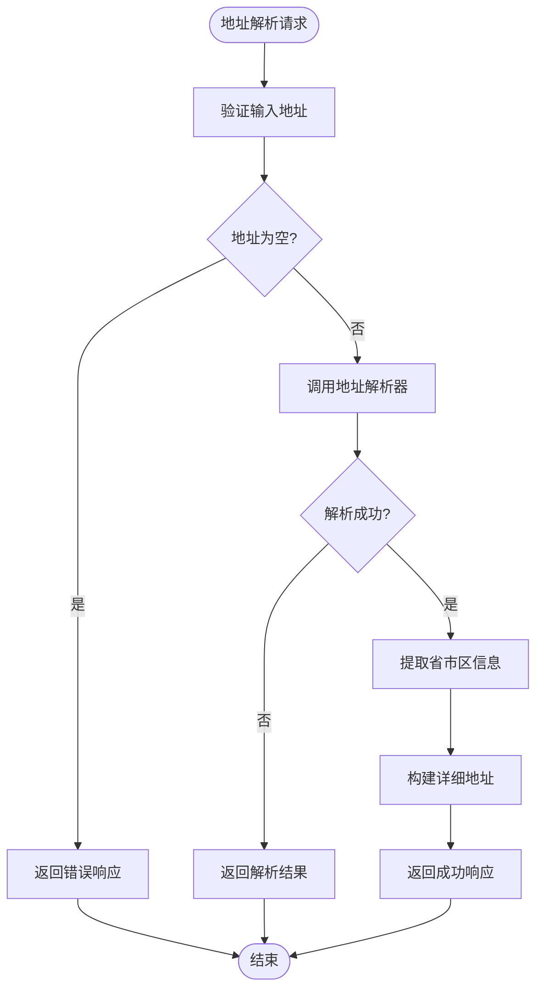
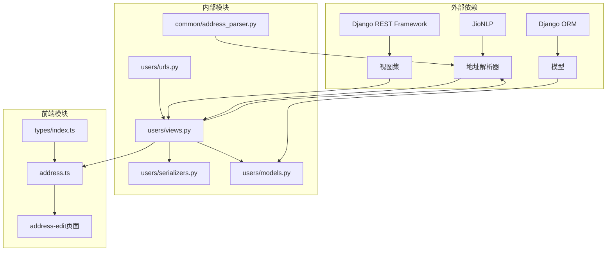

# 收货地址API详细文档

<cite>
**本文档引用的文件**
- [backend/users/models.py](file://backend/users/models.py)
- [backend/users/views.py](file://backend/users/views.py)
- [backend/users/serializers.py](file://backend/users/serializers.py)
- [backend/users/urls.py](file://backend/users/urls.py)
- [backend/common/address_parser.py](file://backend/common/address_parser.py)
- [frontend/src/services/address.ts](file://frontend/src/services/address.ts)
- [frontend/src/pages/address-edit/index.tsx](file://frontend/src/pages/address-edit/index.tsx)
- [frontend/src/types/index.ts](file://frontend/src/types/index.ts)
- [api.md](file://api.md)
</cite>

## 目录
1. [简介](#简介)
2. [项目结构](#项目结构)
3. [核心组件](#核心组件)
4. [架构概览](#架构概览)
5. [详细组件分析](#详细组件分析)
6. [依赖关系分析](#依赖关系分析)
7. [性能考虑](#性能考虑)
8. [故障排除指南](#故障排除指南)
9. [结论](#结论)

## 简介

本文档详细介绍了电商业务小程序的收货地址管理API，重点说明了AddressViewSet的实现细节、CRUD操作以及特殊功能。该系统提供了完整的地址管理解决方案，包括智能地址解析、默认地址设置等功能。

## 项目结构

收货地址功能主要分布在以下模块中：

**图表来源**
- [backend/users/models.py](file://backend/users/models.py#L77-L95)
- [backend/users/views.py](file://backend/users/views.py#L287-L384)
- [frontend/src/services/address.ts](file://frontend/src/services/address.ts#L1-L43)

**章节来源**
- [backend/users/models.py](file://backend/users/models.py#L1-L95)
- [backend/users/views.py](file://backend/users/views.py#L1-L460)
- [frontend/src/services/address.ts](file://frontend/src/services/address.ts#L1-L43)

## 核心组件

### Address模型

Address模型定义了收货地址的数据结构，包含以下字段：

| 字段名 | 类型 | 描述 | 约束 |
|--------|------|------|------|
| id | BigAutoField | 主键ID | 自动递增 |
| user | ForeignKey | 关联用户 | 外键到User模型 |
| contact_name | CharField | 联系人姓名 | 最大长度50 |
| phone | CharField | 联系电话 | 最大长度20 |
| province | CharField | 省份 | 最大长度20 |
| city | CharField | 城市 | 最大长度20 |
| district | CharField | 区县 | 最大长度20 |
| detail | CharField | 详细地址 | 最大长度200 |
| is_default | BooleanField | 是否默认地址 | 默认False |
| created_at | DateTimeField | 创建时间 | 自动添加 |

### AddressViewSet视图集

AddressViewSet继承自Django REST Framework的ModelViewSet，提供了完整的CRUD操作：

**图表来源**
- [backend/users/views.py](file://backend/users/views.py#L287-L309)
- [backend/users/serializers.py](file://backend/users/serializers.py#L56-L91)
- [backend/users/models.py](file://backend/users/models.py#L77-L95)

**章节来源**
- [backend/users/models.py](file://backend/users/models.py#L77-L95)
- [backend/users/views.py](file://backend/users/views.py#L287-L309)
- [backend/users/serializers.py](file://backend/users/serializers.py#L56-L91)

## 架构概览

收货地址管理系统采用RESTful API设计，遵循Django REST Framework的最佳实践：

**图表来源**
- [backend/users/views.py](file://backend/users/views.py#L305-L319)
- [backend/users/serializers.py](file://backend/users/serializers.py#L78-L91)
- [backend/common/address_parser.py](file://backend/common/address_parser.py#L25-L107)

## 详细组件分析

### 列表查询功能

AddressViewSet的列表查询具有特殊排序逻辑，优先显示默认地址：

**图表来源**
- [backend/users/views.py](file://backend/users/views.py#L302-L309)

**章节来源**
- [backend/users/views.py](file://backend/users/views.py#L302-L309)

### 创建地址功能

地址创建过程包含默认地址状态的自动处理：

**图表来源**
- [backend/users/serializers.py](file://backend/users/serializers.py#L78-L91)

**章节来源**
- [backend/users/serializers.py](file://backend/users/serializers.py#L78-L91)

### 更新地址功能

地址更新同样处理默认地址状态：

**图表来源**
- [backend/users/serializers.py](file://backend/users/serializers.py#L86-L91)

**章节来源**
- [backend/users/serializers.py](file://backend/users/serializers.py#L86-L91)

### set_default自定义动作

set_default动作实现了智能的默认地址设置逻辑：

**图表来源**
- [backend/users/views.py](file://backend/users/views.py#L311-L319)

**章节来源**
- [backend/users/views.py](file://backend/users/views.py#L311-L319)

### 地址解析功能

parse_address动作提供了智能的地址解析能力：

**图表来源**
- [backend/users/views.py](file://backend/users/views.py#L356-L384)
- [backend/common/address_parser.py](file://backend/common/address_parser.py#L25-L107)

**章节来源**
- [backend/users/views.py](file://backend/users/views.py#L356-L384)
- [backend/common/address_parser.py](file://backend/common/address_parser.py#L25-L107)

### 地址解析器实现

AddressParser类使用JioNLP库实现智能地址解析：

| 功能 | 方法 | 描述 | 输入 | 输出 |
|------|------|------|------|------|
| 地址解析 | parse_address() | 解析完整地址文本 | 完整地址字符串 | 省市区详细地址 |
| 地址验证 | validate_address() | 验证省市区有效性 | 省市区字符串 | 布尔值 |
| 手机号提取 | extract_phone() | 从文本提取手机号 | 任意文本 | 手机号或None |
| 身份证提取 | extract_id_card() | 从文本提取身份证号 | 任意文本 | 身份证号或None |

**章节来源**
- [backend/common/address_parser.py](file://backend/common/address_parser.py#L12-L175)

## 依赖关系分析

收货地址系统的依赖关系如下：

**图表来源**
- [backend/users/views.py](file://backend/users/views.py#L1-L18)
- [backend/common/address_parser.py](file://backend/common/address_parser.py#L5-L8)

**章节来源**
- [backend/users/views.py](file://backend/users/views.py#L1-L18)
- [backend/common/address_parser.py](file://backend/common/address_parser.py#L1-L175)

## 性能考虑

### 查询优化

1. **禁用分页**：地址列表采用简单数组格式，避免分页开销
2. **智能排序**：通过数据库索引优化默认地址优先显示
3. **权限控制**：直接在查询集中过滤用户数据，减少内存消耗

### 缓存策略

1. **地址解析缓存**：建议对常用地址进行缓存
2. **用户地址缓存**：可以考虑缓存用户的地址列表

### 并发处理

1. **默认地址互斥**：确保同一用户只有一个默认地址
2. **事务保证**：地址解析和保存操作使用数据库事务

## 故障排除指南

### 常见问题及解决方案

| 问题 | 症状 | 原因 | 解决方案 |
|------|------|------|----------|
| 地址解析失败 | parse_address返回失败 | 地址格式不规范 | 使用标准地址格式 |
| 默认地址冲突 | 多个默认地址 | 并发操作导致 | 系统自动处理冲突 |
| 权限错误 | 401/403错误 | 认证失败 | 检查JWT Token |
| 数据验证失败 | 400错误 | 字段格式错误 | 检查必填字段和格式 |

### 调试技巧

1. **启用调试模式**：在开发环境中查看详细错误信息
2. **日志记录**：检查Django和地址解析器的日志
3. **API测试**：使用Postman或curl测试各个端点

**章节来源**
- [backend/common/address_parser.py](file://backend/common/address_parser.py#L98-L107)

## 结论

收货地址管理API提供了完整的地址管理解决方案，具有以下特点：

1. **完整的CRUD功能**：支持地址的创建、读取、更新、删除操作
2. **智能默认管理**：自动处理默认地址的状态，确保用户体验
3. **地址解析功能**：集成JioNLP实现智能地址识别和拆分
4. **前后端一体化**：提供完整的前端组件和类型定义
5. **RESTful设计**：遵循REST架构原则，易于集成和扩展

该系统为企业级电商应用提供了可靠、高效的地址管理能力，支持复杂的业务需求和良好的用户体验。