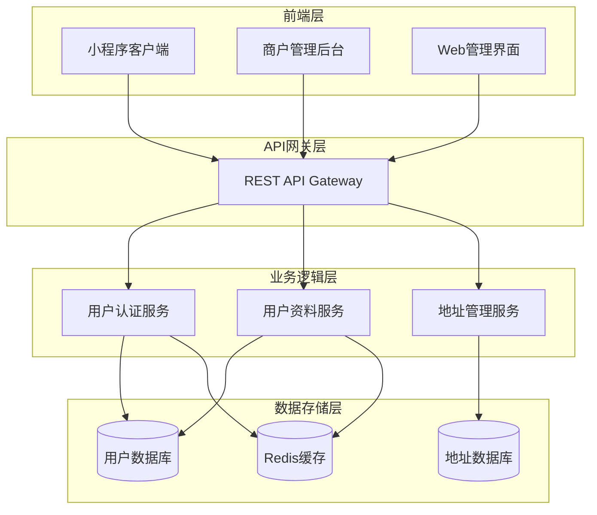
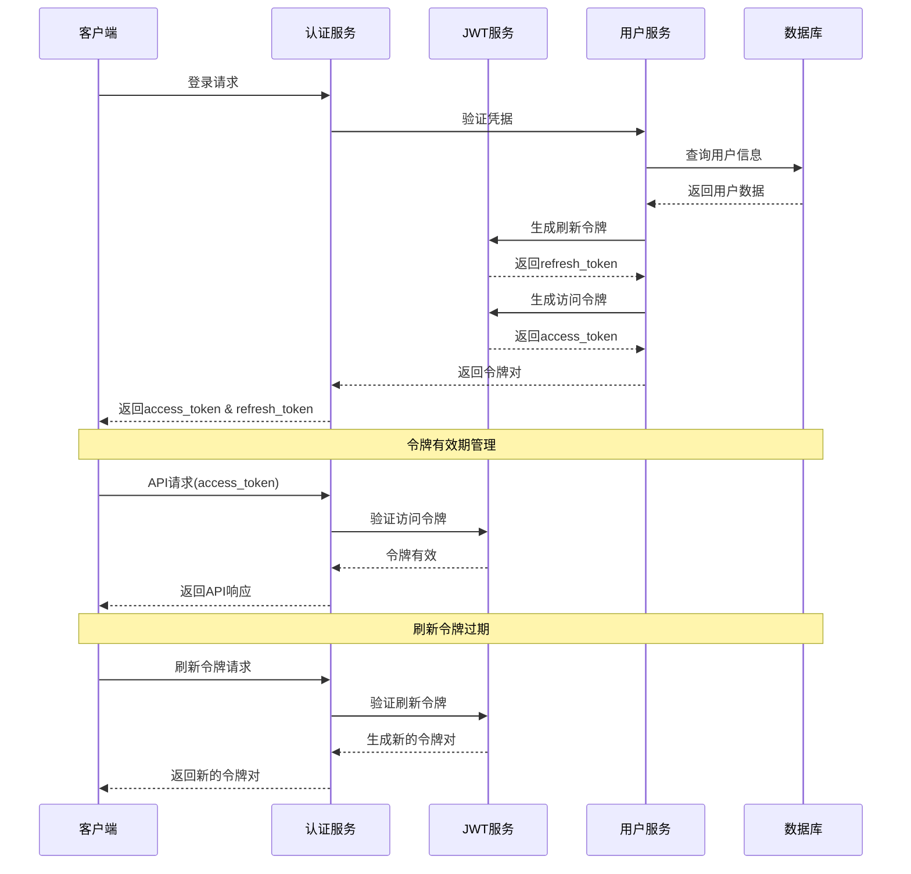
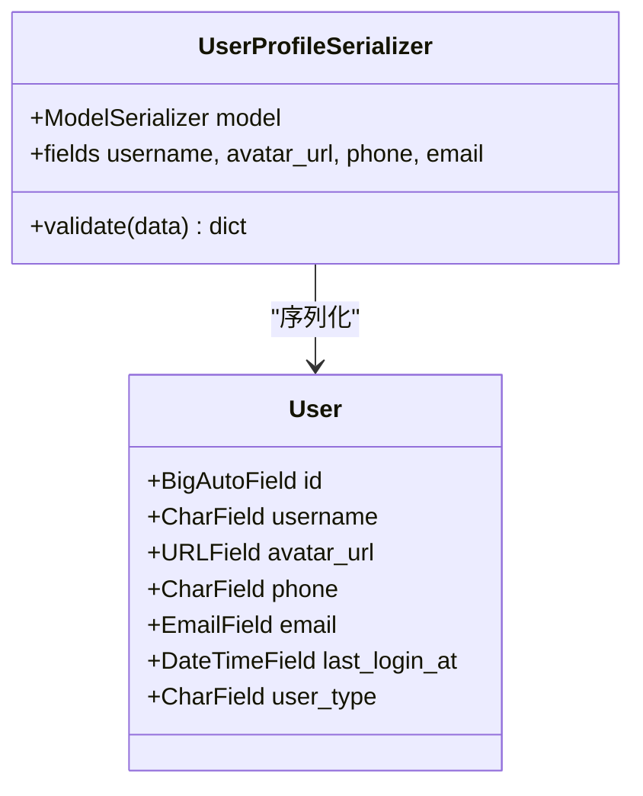
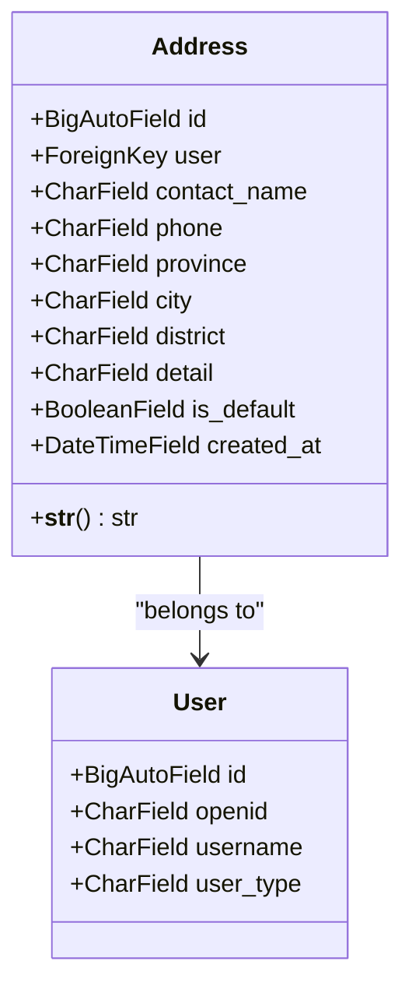
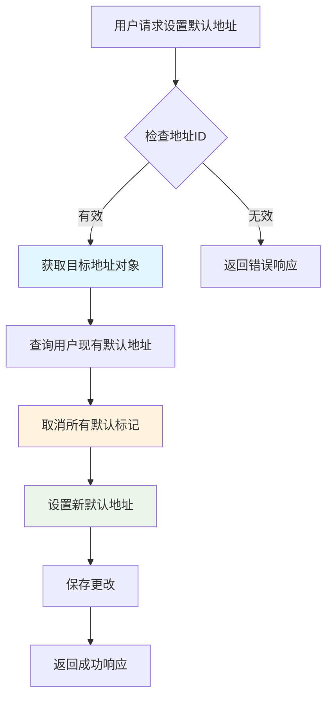
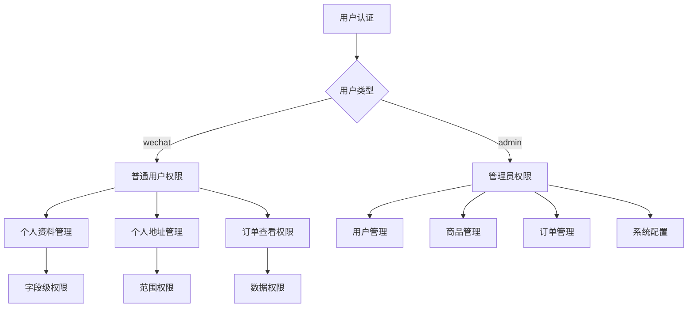
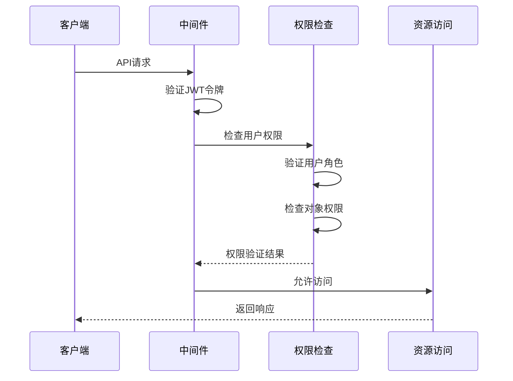

# 用户API详细文档

<cite>
**本文档引用的文件**
- [backend/users/views.py](file://backend/users/views.py)
- [backend/users/urls.py](file://backend/users/urls.py)
- [backend/users/models.py](file://backend/users/models.py)
- [backend/users/serializers.py](file://backend/users/serializers.py)
- [backend/users/services.py](file://backend/users/services.py)
- [backend/common/permissions.py](file://backend/common/permissions.py)
- [backend/common/throttles.py](file://backend/common/throttles.py)
- [backend/common/address_parser.py](file://backend/common/address_parser.py)
- [frontend/src/services/auth.ts](file://frontend/src/services/auth.ts)
- [frontend/src/services/user.ts](file://frontend/src/services/user.ts)
- [frontend/src/services/address.ts](file://frontend/src/services/address.ts)
- [merchant/src/services/api.ts](file://merchant/src/services/api.ts)
</cite>

## 目录
1. [简介](#简介)
2. [项目架构概览](#项目架构概览)
3. [用户认证系统](#用户认证系统)
4. [用户资料管理](#用户资料管理)
5. [收货地址管理](#收货地址管理)
6. [权限控制系统](#权限控制系统)
7. [错误处理策略](#错误处理策略)
8. [实际调用示例](#实际调用示例)
9. [最佳实践建议](#最佳实践建议)

## 简介

本文档详细介绍了电商业务小程序的用户API系统，涵盖用户认证、资料管理和收货地址管理三大核心功能模块。系统采用JWT令牌机制实现安全的身份验证，支持微信小程序登录和管理员密码登录两种认证方式，并提供完整的用户资料和地址管理功能。

## 项目架构概览

系统采用前后端分离架构，后端基于Django REST Framework构建，前端使用Taro框架开发跨平台应用。



**图表来源**
- [backend/users/views.py](file://backend/users/views.py#L1-L50)
- [backend/users/urls.py](file://backend/users/urls.py#L1-L18)

**章节来源**
- [backend/users/views.py](file://backend/users/views.py#L1-L460)
- [backend/users/urls.py](file://backend/users/urls.py#L1-L18)

## 用户认证系统

### JWT令牌生成机制

系统采用JWT（JSON Web Token）实现无状态身份验证，支持access_token和refresh_token的双重令牌机制。

#### 令牌生命周期管理



**图表来源**
- [backend/users/services.py](file://backend/users/services.py#L22-L24)
- [backend/users/views.py](file://backend/users/views.py#L144-L153)

#### 登录接口详解

系统提供两个主要的登录接口：

##### 微信小程序登录 (/login/)

支持微信小程序OAuth认证流程，通过微信API验证用户身份并生成JWT令牌。

**接口特性：**
- 支持真实微信API和模拟登录模式
- 自动检测管理员快捷登录（开发环境）
- 实现用户自动创建和更新

**请求参数：**
```json
{
  "code": "wx_code_from_client"
}
```

**响应格式：**
```json
{
  "access": "eyJhbGciOiJIUzI1NiIsInR5cCI6IkpXVCJ9...",
  "refresh": "eyJ0eXAiOiJKV1QiLCJhbGciOiJIUzI1NiJ9...",
  "user": {
    "id": 1,
    "username": "用户_abc123def456",
    "avatar_url": "https://example.com/avatar.jpg",
    "phone": "13800138000",
    "email": "user@example.com"
  }
}
```

##### 管理员密码登录 (/admin/login/)

提供传统的用户名密码认证，主要用于商户管理后台。

**请求参数：**
```json
{
  "username": "admin_username",
  "password": "admin_password"
}
```

**响应格式：**
```json
{
  "access": "eyJhbGciOiJIUzI1NiIsInR5cCI6IkpXVCJ9...",
  "refresh": "eyJ0eXAiOiJKV1QiLCJhbGciOiJIUzI1NiJ9...",
  "user": {
    "id": 1,
    "username": "admin",
    "user_type": "admin",
    "is_staff": true
  }
}
```

**章节来源**
- [backend/users/views.py](file://backend/users/views.py#L22-L154)
- [backend/users/views.py](file://backend/users/views.py#L160-L233)

### 用户类型权限控制

系统定义两种用户类型，在权限控制中发挥重要作用：

| 用户类型 | 描述 | 权限级别 | 应用场景 |
|---------|------|----------|----------|
| wechat | 微信用户 | 普通用户 | 小程序前端用户 |
| admin | 管理员 | 系统管理员 | 商户管理后台 |

**权限控制规则：**
- `wechat` 类型用户只能访问自己的资源
- `admin` 类型用户拥有系统管理权限
- 系统启动时自动检测管理员账户
- 开发环境支持快捷管理员登录

**章节来源**
- [backend/users/models.py](file://backend/users/models.py#L54-L62)
- [backend/users/services.py](file://backend/users/services.py#L8-L16)

## 用户资料管理

### 资料获取和更新接口

系统提供统一的用户资料管理接口，支持部分字段更新和完整资料查询。

#### 用户资料序列化器



**图表来源**
- [backend/users/serializers.py](file://backend/users/serializers.py#L43-L55)
- [backend/users/models.py](file://backend/users/models.py#L31-L68)

#### 资料管理接口

**获取用户资料：**
- **URL**: `/user/profile/`
- **方法**: `GET`
- **权限**: `IsAuthenticated`
- **响应**: 当前用户的完整资料信息

**更新用户资料：**
- **URL**: `/user/profile/`
- **方法**: `PATCH`
- **权限**: `IsAuthenticated`
- **请求**: 部分字段更新（如：`{"phone": "13800138000"}`）

#### 字段验证和权限控制

系统实现了严格的字段验证和权限控制机制：

**验证规则：**
- 手机号码格式验证
- 邮箱地址格式验证
- 用户名唯一性检查
- 头像URL有效性验证

**权限控制：**
- 只能修改自己的资料信息
- 管理员可以查看所有用户资料
- 敏感信息（如密码）不可直接修改

**章节来源**
- [backend/users/views.py](file://backend/users/views.py#L235-L247)
- [backend/users/serializers.py](file://backend/users/serializers.py#L43-L55)

### 用户统计信息

系统提供用户订单统计功能，支持缓存优化提高性能。

#### 统计指标

| 指标名称 | 描述 | 缓存时间 |
|---------|------|----------|
| orders_count | 总订单数量 | 5分钟 |
| completed_orders_count | 已完成订单数 | 5分钟 |
| pending_orders_count | 待处理订单数 | 5分钟 |
| total_spent | 总消费金额 | 5分钟 |

**章节来源**
- [backend/users/views.py](file://backend/users/views.py#L250-L285)

## 收货地址管理

### 地址CRUD操作

系统提供完整的收货地址管理功能，包括创建、读取、更新、删除和默认地址设置。

#### 地址模型设计



**图表来源**
- [backend/users/models.py](file://backend/users/models.py#L77-L95)

#### 地址管理接口

**获取地址列表：**
- **URL**: `/addresses/`
- **方法**: `GET`
- **权限**: `IsAuthenticated`
- **排序**: 默认地址优先，按创建时间降序

**创建地址：**
- **URL**: `/addresses/`
- **方法**: `POST`
- **权限**: `IsAuthenticated`
- **自动处理默认地址冲突**

**更新地址：**
- **URL**: `/addresses/{id}/`
- **方法**: `PATCH`
- **权限**: `IsAuthenticated`
- **自动处理默认地址冲突**

**删除地址：**
- **URL**: `/addresses/{id}/`
- **方法**: `DELETE`
- **权限**: `IsAuthenticated`

**设为默认地址：**
- **URL**: `/addresses/{id}/set_default/`
- **方法**: `POST`
- **权限**: `IsAuthenticated`
- **自动取消其他默认地址**

#### 默认地址管理机制



**图表来源**
- [backend/users/views.py](file://backend/users/views.py#L311-L319)

#### 地址智能解析

系统集成地址解析服务，支持自动识别和拆分完整地址文本。

**解析功能：**
- 自动识别省市区信息
- 提取详细地址部分
- 支持多种地址格式
- 错误处理和重试机制

**使用示例：**
```javascript
// 请求
{
  "address": "北京市朝阳区建国路88号SOHO现代城A座1001室"
}

// 响应
{
  "success": true,
  "message": "地址识别成功",
  "data": {
    "province": "北京市",
    "city": "北京市",
    "district": "朝阳区",
    "detail": "建国路88号SOHO现代城A座1001室"
  }
}
```

**章节来源**
- [backend/users/views.py](file://backend/users/views.py#L287-L385)
- [backend/users/serializers.py](file://backend/users/serializers.py#L56-L91)

## 权限控制系统

### 权限层次结构

系统采用多层权限控制机制，确保数据安全和功能隔离。



**图表来源**
- [backend/common/permissions.py](file://backend/common/permissions.py#L12-L189)

#### 权限类详解

**IsAuthenticated**: 基础认证权限，要求用户已登录
**IsOwnerOrAdmin**: 对象级权限，允许所有者或管理员访问
**IsAdmin**: 管理员专用权限
**IsAdminOrReadOnly**: 读写分离权限

#### 权限验证流程



**图表来源**
- [backend/common/permissions.py](file://backend/common/permissions.py#L26-L67)

**章节来源**
- [backend/common/permissions.py](file://backend/common/permissions.py#L12-L189)

## 错误处理策略

### 异常分类和处理

系统实现了完善的错误处理机制，提供清晰的错误信息和适当的HTTP状态码。

#### 常见错误类型

| 错误类型 | HTTP状态码 | 描述 | 处理方式 |
|---------|-----------|------|----------|
| 认证失败 | 401 | 未提供有效令牌 | 重新登录 |
| 权限不足 | 403 | 无访问权限 | 检查用户角色 |
| 资源不存在 | 404 | 请求的资源不存在 | 检查URL |
| 参数错误 | 400 | 请求参数格式错误 | 检查请求体 |
| 服务器错误 | 500 | 内部服务器错误 | 联系技术支持 |

#### 错误响应格式

```json
{
  "error": "具体的错误描述",
  "details": {
    "field": "字段名",
    "message": "字段验证错误"
  }
}
```

#### 速率限制

系统实施多层次的速率限制保护：

**登录接口限制：**
- 每用户每分钟最多5次请求
- 匿名用户每分钟最多5次请求
- 防止暴力破解攻击

**支付接口限制：**
- 每用户每分钟最多10次请求
- 匿名用户禁止访问
- 防止重复支付攻击

**章节来源**
- [backend/common/throttles.py](file://backend/common/throttles.py#L11-L78)

## 实际调用示例

### 小程序登录流程

```javascript
// 1. 获取微信code
wx.login({
  success: (res) => {
    const code = res.code;
    
    // 2. 调用登录接口
    fetch('/api/login/', {
      method: 'POST',
      headers: { 'Content-Type': 'application/json' },
      body: JSON.stringify({ code })
    })
    .then(res => res.json())
    .then(data => {
      // 3. 保存token
      localStorage.setItem('access_token', data.access);
      localStorage.setItem('refresh_token', data.refresh);
      // 4. 跳转到首页
      window.location.href = '/';
    });
  }
});
```

### 管理员登录流程

```javascript
// 1. 提交用户名密码
fetch('/api/admin/login/', {
  method: 'POST',
  headers: { 'Content-Type': 'application/json' },
  body: JSON.stringify({
    username: 'admin',
    password: 'password123'
  })
})
.then(res => res.json())
.then(data => {
  // 2. 保存token
  localStorage.setItem('access_token', data.access);
  localStorage.setItem('refresh_token', data.refresh);
  // 3. 跳转到管理后台
  window.location.href = '/admin';
});
```

### 用户资料管理

```javascript
// 获取用户资料
async function getUserProfile() {
  const response = await fetch('/api/user/profile/');
  return response.json();
}

// 更新用户资料
async function updateUserProfile(data) {
  const response = await fetch('/api/user/profile/', {
    method: 'PATCH',
    headers: { 'Content-Type': 'application/json' },
    body: JSON.stringify(data)
  });
  return response.json();
}
```

### 地址管理

```javascript
// 获取地址列表
async function getAddresses() {
  const response = await fetch('/api/addresses/');
  return response.json();
}

// 创建新地址
async function createAddress(addressData) {
  const response = await fetch('/api/addresses/', {
    method: 'POST',
    headers: { 'Content-Type': 'application/json' },
    body: JSON.stringify(addressData)
  });
  return response.json();
}

// 设置默认地址
async function setDefaultAddress(addressId) {
  const response = await fetch(`/api/addresses/${addressId}/set_default/`, {
    method: 'POST'
  });
  return response.json();
}

// 地址解析
async function parseAddress(addressText) {
  const response = await fetch('/api/addresses/parse/', {
    method: 'POST',
    headers: { 'Content-Type': 'application/json' },
    body: JSON.stringify({ address: addressText })
  });
  return response.json();
}
```

**章节来源**
- [frontend/src/services/auth.ts](file://frontend/src/services/auth.ts#L1-L22)
- [frontend/src/services/user.ts](file://frontend/src/services/user.ts#L1-L20)
- [frontend/src/services/address.ts](file://frontend/src/services/address.ts#L1-L44)

## 最佳实践建议

### 安全最佳实践

1. **令牌管理**
   - 定期轮换访问令牌
   - 实施令牌黑名单机制
   - 设置合理的过期时间

2. **输入验证**
   - 严格验证所有用户输入
   - 实施SQL注入防护
   - 验证文件上传类型

3. **日志监控**
   - 记录所有认证事件
   - 监控异常访问模式
   - 实施实时告警机制

### 性能优化建议

1. **缓存策略**
   - 合理使用Redis缓存
   - 设置适当的缓存过期时间
   - 实施缓存预热机制

2. **数据库优化**
   - 添加必要的索引
   - 实施查询优化
   - 使用分页处理大量数据

3. **CDN加速**
   - 静态资源使用CDN
   - 压缩传输数据
   - 实施浏览器缓存

### 开发规范

1. **代码组织**
   - 遵循DRY原则
   - 实施模块化设计
   - 编写清晰的注释

2. **测试覆盖**
   - 编写单元测试
   - 实施集成测试
   - 进行性能测试

3. **文档维护**
   - 保持API文档同步
   - 记录变更历史
   - 提供使用示例

通过遵循这些最佳实践，可以确保系统的安全性、稳定性和可维护性，为用户提供优质的使用体验。