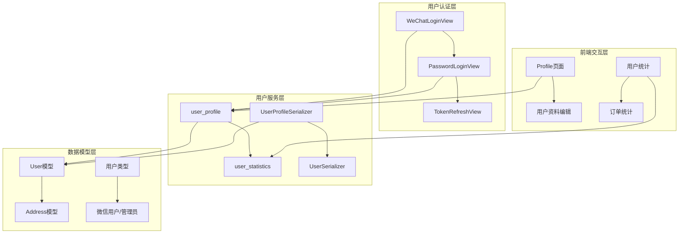
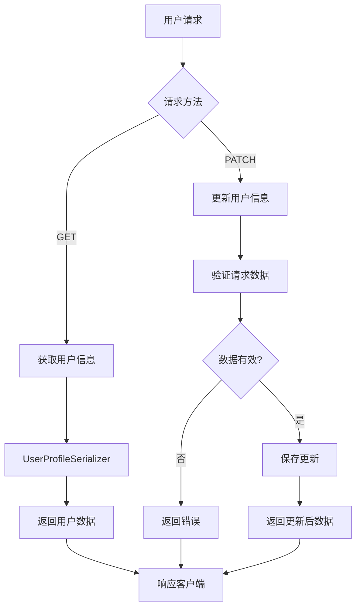
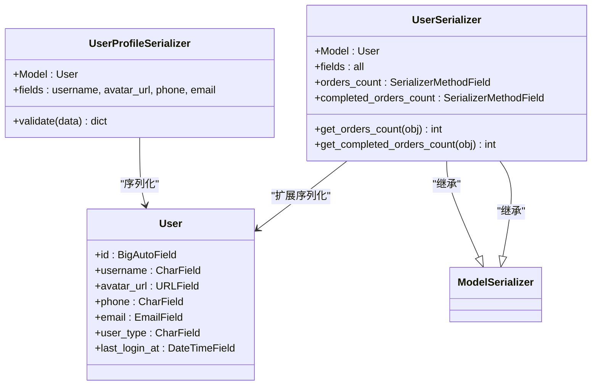
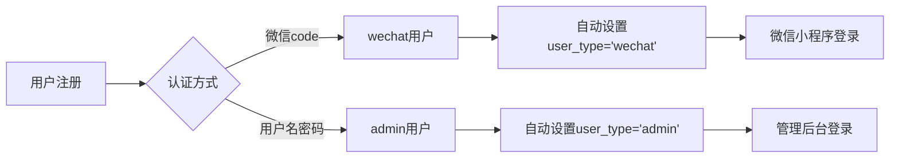
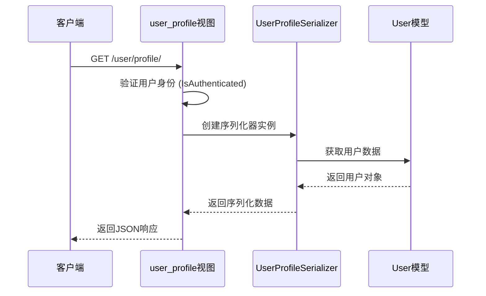
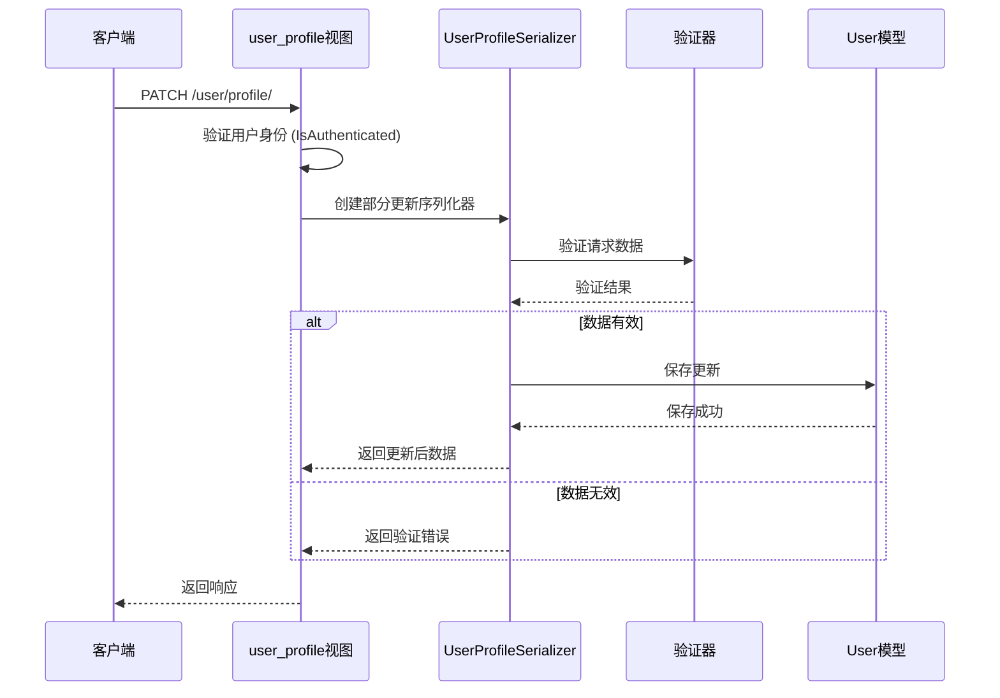
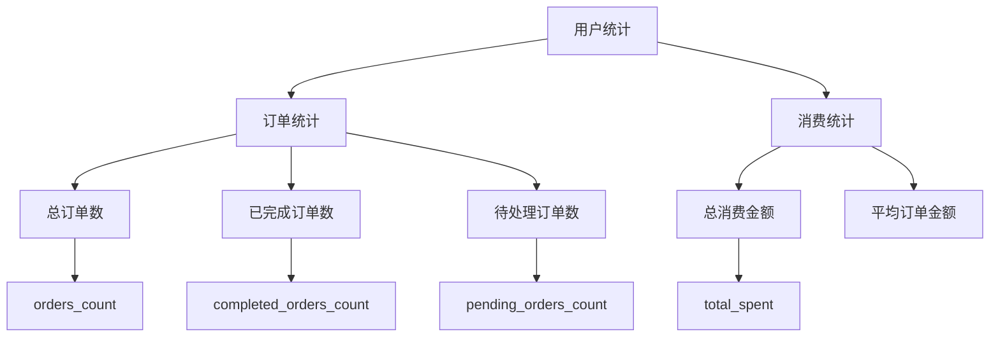
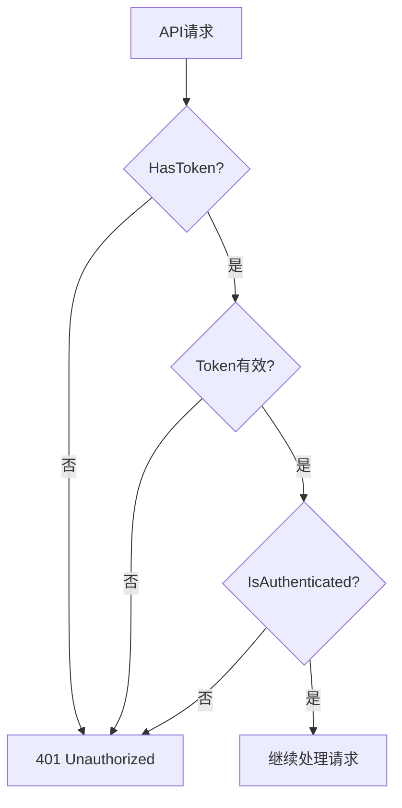

# 用户资料管理API详细文档

<cite>
**本文档引用的文件**
- [users/views.py](file://backend/users/views.py)
- [users/models.py](file://backend/users/models.py)
- [users/serializers.py](file://backend/users/serializers.py)
- [users/services.py](file://backend/users/services.py)
- [users/urls.py](file://backend/users/urls.py)
- [api.md](file://api.md)
- [frontend/src/services/user.ts](file://frontend/src/services/user.ts)
- [frontend/src/pages/profile-edit/index.tsx](file://frontend/src/pages/profile-edit/index.tsx)
</cite>

## 目录
1. [简介](#简介)
2. [项目架构概览](#项目架构概览)
3. [核心组件分析](#核心组件分析)
4. [用户模型详解](#用户模型详解)
5. [用户资料API详细分析](#用户资料api详细分析)
6. [权限控制机制](#权限控制机制)
7. [接口调用示例](#接口调用示例)
8. [常见错误处理](#常见错误处理)
9. [性能优化考虑](#性能优化考虑)
10. [故障排除指南](#故障排除指南)

## 简介

本文档详细介绍了家电分销小程序后端系统的用户资料管理API，重点分析`user_profile`视图函数的实现机制。该系统采用Django REST Framework构建，支持微信小程序用户和管理员用户的双重认证体系，提供完整的用户信息获取和更新功能。

## 项目架构概览

系统采用模块化架构设计，用户相关功能集中在`users`应用中，包含以下核心模块：



**图表来源**
- [users/views.py](file://backend/users/views.py#L235-L247)
- [users/models.py](file://backend/users/models.py#L31-L74)

## 核心组件分析

### 用户资料视图函数

`user_profile`函数是用户资料管理的核心入口，支持GET和PATCH两种HTTP方法：



**图表来源**
- [users/views.py](file://backend/users/views.py#L237-L247)

**章节来源**
- [users/views.py](file://backend/users/views.py#L235-L247)

### 序列化器设计

系统采用专门的序列化器来处理用户数据的序列化和反序列化：



**图表来源**
- [users/serializers.py](file://backend/users/serializers.py#L43-L92)
- [users/models.py](file://backend/users/models.py#L31-L74)

**章节来源**
- [users/serializers.py](file://backend/users/serializers.py#L43-L92)

## 用户模型详解

### 字段定义与约束

User模型包含以下核心字段：

| 字段名 | 类型 | 约束条件 | 说明 |
|--------|------|----------|------|
| id | BigAutoField | 主键，自增 | 用户唯一标识 |
| openid | CharField | 长度64，唯一，可空 | 微信小程序用户标识 |
| username | CharField | 长度150，唯一，可空 | 用户名，自动生成 |
| avatar_url | URLField | 长度200，可空 | 头像链接，默认Gravatar |
| phone | CharField | 长度20，可空 | 手机号码 |
| email | EmailField | 可空 | 电子邮箱 |
| user_type | CharField | 枚举：wechat/admin | 用户类型 |
| last_login_at | DateTimeField | 可空 | 最后登录时间 |

### 用户类型区分

系统支持两种用户类型，通过`user_type`字段进行区分：



**图表来源**
- [users/models.py](file://backend/users/models.py#L54-L62)
- [users/services.py](file://backend/users/services.py#L5-L7)

**章节来源**
- [users/models.py](file://backend/users/models.py#L31-L74)

## 用户资料API详细分析

### GET方法 - 获取用户信息

GET请求用于获取当前认证用户的基本信息和统计信息：

#### 实现流程



**图表来源**
- [users/views.py](file://backend/users/views.py#L239-L241)

#### 响应结构

GET请求返回以下字段：

| 字段名 | 类型 | 说明 |
|--------|------|------|
| id | number | 用户ID |
| username | string | 用户名 |
| avatar_url | string | 头像URL |
| phone | string | 手机号码 |
| email | string | 电子邮箱 |
| user_type | string | 用户类型(wechat/admin) |
| last_login_at | string | ISO格式最后登录时间 |
| orders_count | number | 总订单数 |
| completed_orders_count | number | 已完成订单数 |

### PATCH方法 - 更新用户信息

PATCH请求用于更新用户的部分信息：

#### 实现流程



**图表来源**
- [users/views.py](file://backend/users/views.py#L243-L247)

#### 支持更新的字段

PATCH方法支持以下字段的更新：

| 字段名 | 类型 | 说明 | 验证规则 |
|--------|------|------|----------|
| username | string | 用户名 | 非空，唯一 |
| avatar_url | string | 头像URL | 有效URL格式 |
| phone | string | 手机号码 | 符合手机号格式 |
| email | string | 电子邮箱 | 有效邮箱格式 |

**章节来源**
- [users/views.py](file://backend/users/views.py#L237-L247)
- [users/serializers.py](file://backend/users/serializers.py#L43-L55)

### 用户统计API

`user_statistics`函数提供用户的详细统计信息：

#### 统计指标



**图表来源**
- [users/views.py](file://backend/users/views.py#L252-L285)

#### 缓存策略

系统采用Redis缓存来优化统计查询性能：

| 缓存键格式 | 缓存时间 | 说明 |
|------------|----------|------|
| `user_stats_{user_id}` | 5分钟 | 用户统计信息 |
| `user_orders_count_{user_id}` | 5分钟 | 总订单数 |
| `user_completed_orders_count_{user_id}` | 5分钟 | 已完成订单数 |

**章节来源**
- [users/views.py](file://backend/users/views.py#L252-L285)

## 权限控制机制

### 认证要求

所有用户资料相关接口都需要有效的JWT认证令牌：



**图表来源**
- [users/views.py](file://backend/users/views.py#L236-L237)

### 权限验证

系统使用`IsAuthenticated`权限类确保只有认证用户可以访问：

| 接口 | 权限要求 | 说明 |
|------|----------|------|
| GET /user/profile/ | IsAuthenticated | 获取用户信息 |
| PATCH /user/profile/ | IsAuthenticated | 更新用户信息 |
| GET /user/statistics/ | IsAuthenticated | 获取用户统计 |

**章节来源**
- [users/views.py](file://backend/users/views.py#L236-L237)

## 接口调用示例

### 获取用户信息

```bash
# 请求
GET /api/user/profile/
Authorization: Bearer <access_token>

# 响应
{
    "id": 1,
    "username": "用户_abc123",
    "avatar_url": "https://example.com/avatar.jpg",
    "phone": "13800138000",
    "email": "user@example.com",
    "user_type": "wechat",
    "last_login_at": "2025-11-18T10:30:00Z",
    "orders_count": 15,
    "completed_orders_count": 12
}
```

### 更新用户信息

```bash
# 请求
PATCH /api/user/profile/
Authorization: Bearer <access_token>
Content-Type: application/json

{
    "username": "新用户名",
    "avatar_url": "https://example.com/new-avatar.jpg",
    "phone": "13900139000",
    "email": "newemail@example.com"
}

# 响应
{
    "id": 1,
    "username": "新用户名",
    "avatar_url": "https://example.com/new-avatar.jpg",
    "phone": "13900139000",
    "email": "newemail@example.com",
    "user_type": "wechat",
    "last_login_at": "2025-11-18T10:30:00Z",
    "orders_count": 15,
    "completed_orders_count": 12
}
```

### 获取用户统计

```bash
# 请求
GET /api/user/statistics/
Authorization: Bearer <access_token>

# 响应
{
    "orders_count": 15,
    "completed_orders_count": 12,
    "pending_orders_count": 3,
    "total_spent": 24500.0
}
```

**章节来源**
- [api.md](file://api.md#L82-L94)
- [frontend/src/services/user.ts](file://frontend/src/services/user.ts#L6-L18)

## 常见错误处理

### 认证相关错误

| 错误码 | HTTP状态 | 说明 | 解决方案 |
|--------|----------|------|----------|
| UNAUTHORIZED | 401 | 缺少或无效的认证令牌 | 检查Authorization头，重新登录 |
| TOKEN_EXPIRED | 401 | Token已过期 | 调用刷新接口获取新Token |
| INVALID_CREDENTIALS | 401 | 用户名或密码错误 | 检查输入的用户名和密码 |

### 数据验证错误

| 错误码 | HTTP状态 | 说明 | 解决方案 |
|--------|----------|------|----------|
| VALIDATION_ERROR | 400 | 字段验证失败 | 检查请求参数，查看details字段 |
| REQUIRED_FIELD | 400 | 缺少必填字段 | 添加缺失的必填字段 |
| INVALID_FORMAT | 400 | 字段格式不正确 | 检查字段格式（如日期、邮箱） |

### 权限相关错误

| 错误码 | HTTP状态 | 说明 | 解决方案 |
|--------|----------|------|----------|
| PERMISSION_DENIED | 403 | 无权限执行此操作 | 检查用户权限，联系管理员 |
| FORBIDDEN | 403 | 无管理员权限 | 管理员用户才能访问 |

**章节来源**
- [api.md](file://api.md#L698-L799)

## 性能优化考虑

### 缓存策略

系统采用多层缓存策略来提升性能：

1. **统计信息缓存**：用户统计信息缓存5分钟
2. **订单数量缓存**：订单数量缓存5分钟
3. **用户信息缓存**：用户基本信息实时获取

### 数据库优化

1. **索引优化**：在常用查询字段上建立索引
2. **查询优化**：使用select_related和prefetch_related减少查询次数
3. **批量操作**：支持批量更新用户信息

### 前端优化

1. **状态管理**：前端维护用户信息状态
2. **防抖处理**：表单提交防抖处理
3. **错误重试**：网络错误自动重试机制

## 故障排除指南

### 常见问题及解决方案

#### 1. 用户信息无法更新

**问题现象**：PATCH请求返回400错误

**可能原因**：
- 提供的字段格式不正确
- 字段值违反唯一性约束
- 缺少必填字段

**解决步骤**：
1. 检查请求参数格式
2. 验证字段值的有效性
3. 确认必填字段完整性

#### 2. 认证失败

**问题现象**：GET请求返回401错误

**可能原因**：
- Token已过期
- Token格式不正确
- 用户未登录

**解决步骤**：
1. 检查Authorization头格式
2. 使用刷新接口获取新Token
3. 重新登录获取有效Token

#### 3. 统计信息不准确

**问题现象**：用户统计信息显示错误

**可能原因**：
- 缓存未及时更新
- 数据库查询错误
- 权限问题

**解决步骤**：
1. 清除相关缓存
2. 检查数据库查询逻辑
3. 验证用户权限设置

**章节来源**
- [users/views.py](file://backend/users/views.py#L243-L247)
- [users/views.py](file://backend/users/views.py#L265-L285)

## 总结

用户资料管理API提供了完整的用户信息管理和统计功能，具有以下特点：

1. **安全性**：严格的权限控制和认证机制
2. **性能**：多层缓存策略优化查询性能
3. **易用性**：简洁的API设计和详细的错误信息
4. **扩展性**：模块化设计便于功能扩展

通过合理使用这些API，开发者可以构建功能完善的用户管理系统，为用户提供优质的用户体验。