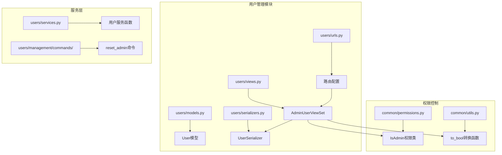
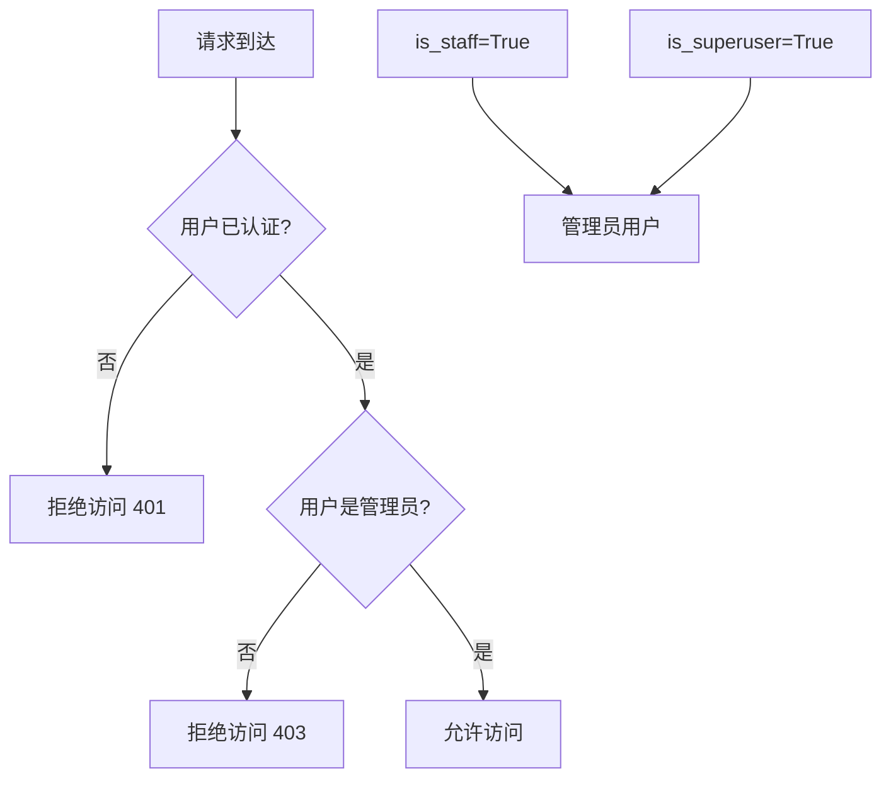
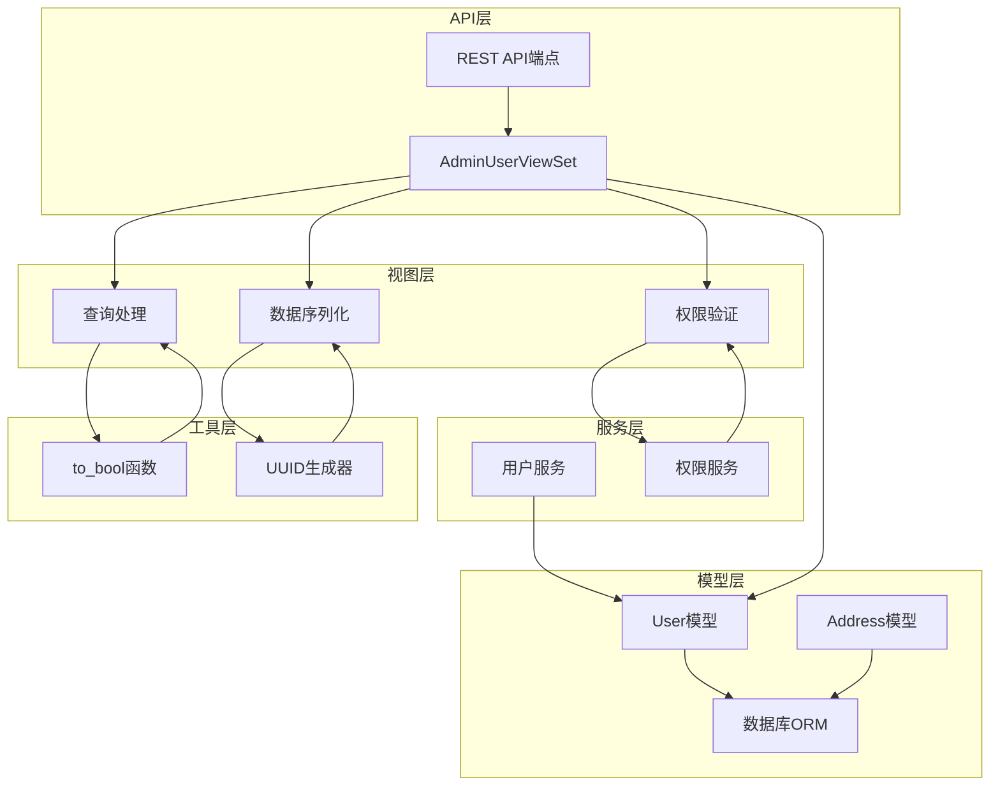
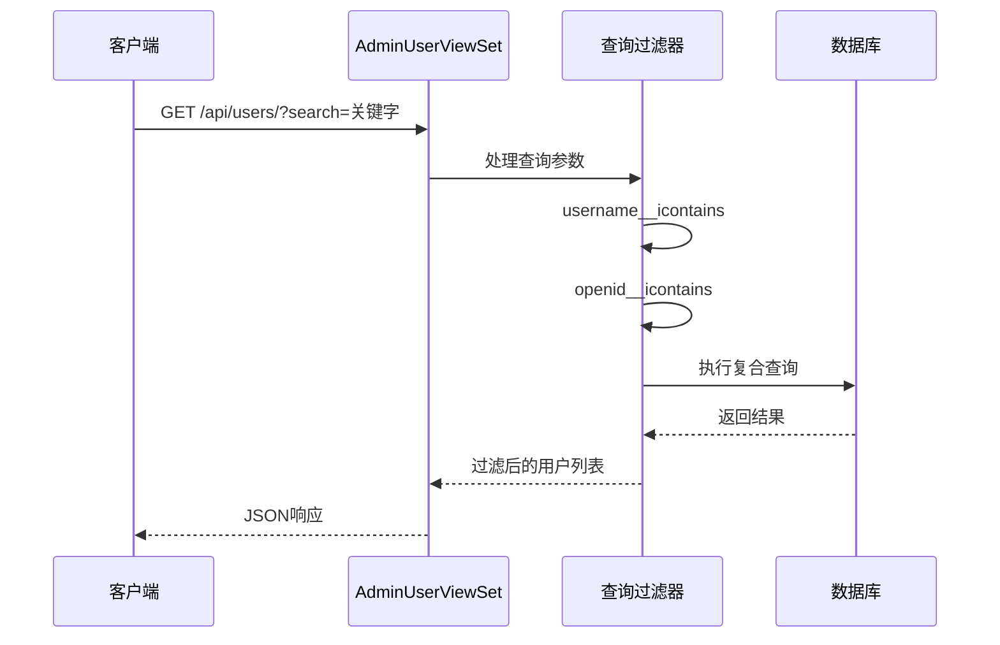
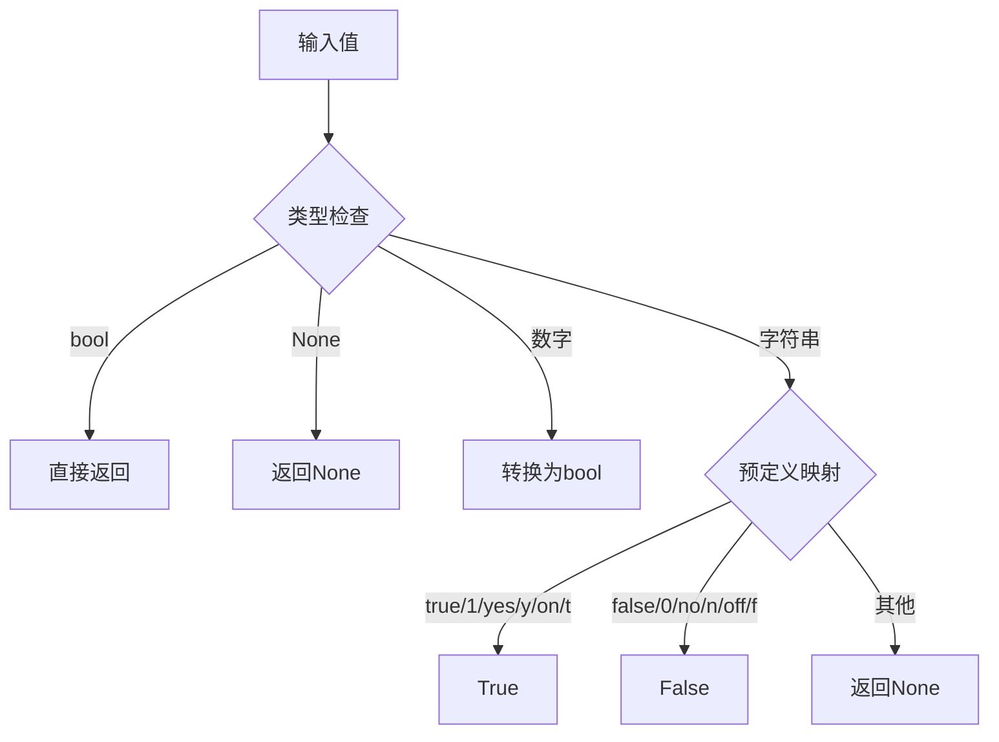
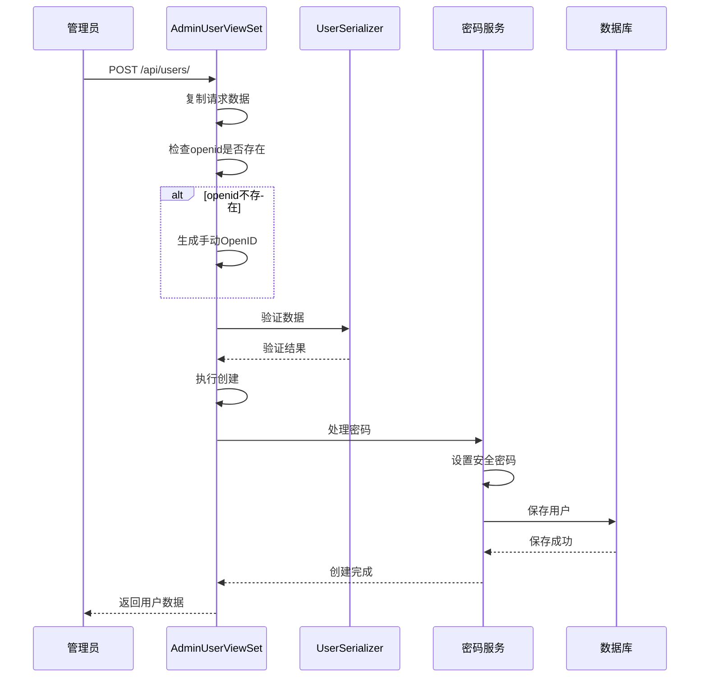
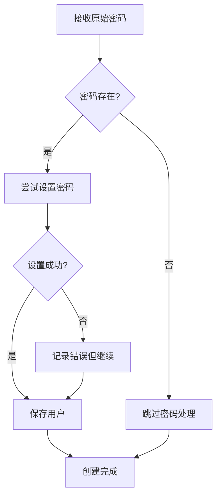
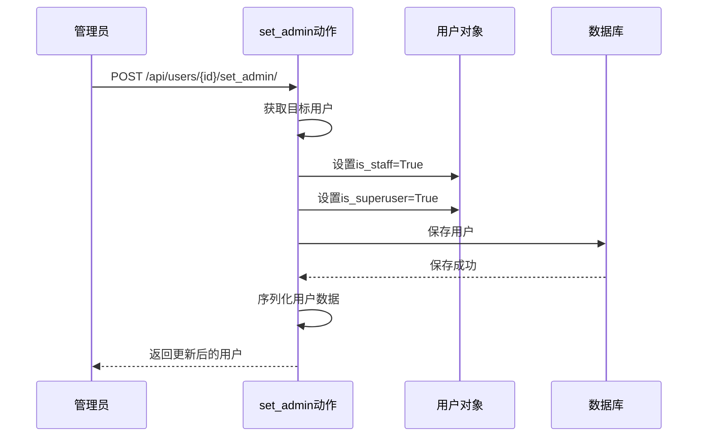
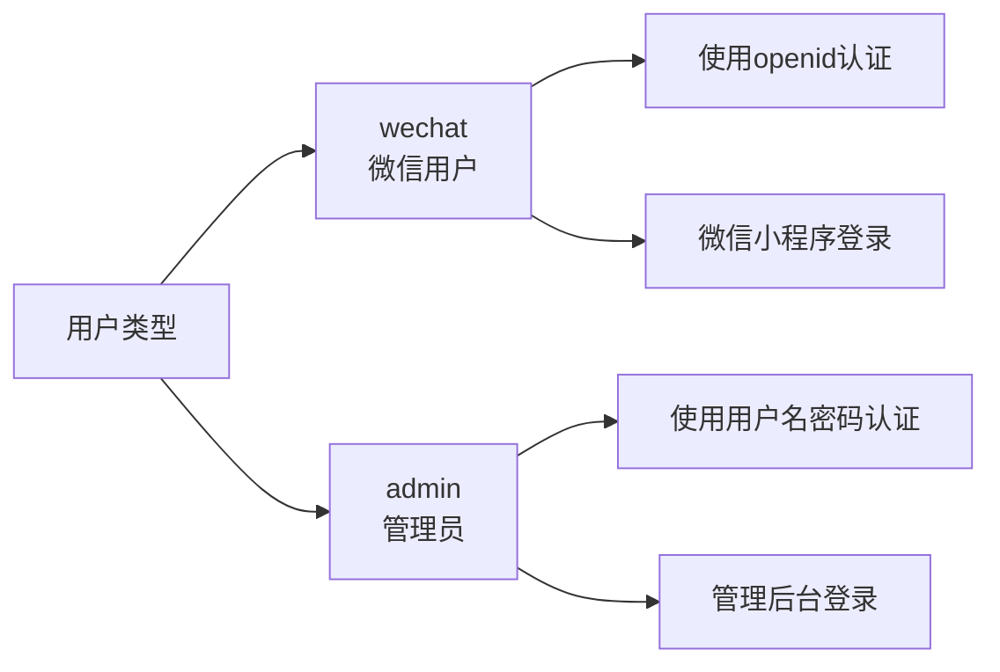
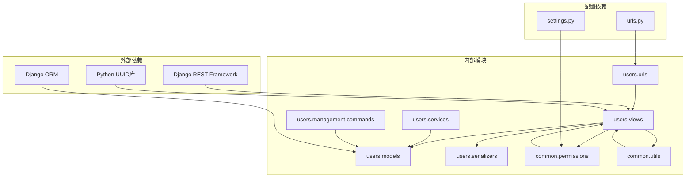

# 管理员用户管理API

<cite>
**本文档中引用的文件**
- [api.md](file://api.md)
- [backend/users/views.py](file://backend/users/views.py)
- [backend/users/models.py](file://backend/users/models.py)
- [backend/users/serializers.py](file://backend/users/serializers.py)
- [backend/users/urls.py](file://backend/users/urls.py)
- [backend/users/services.py](file://backend/users/services.py)
- [backend/common/permissions.py](file://backend/common/permissions.py)
- [backend/common/utils.py](file://backend/common/utils.py)
- [backend/users/management/commands/reset_admin.py](file://backend/users/management/commands/reset_admin.py)
</cite>

## 目录
1. [简介](#简介)
2. [项目结构](#项目结构)
3. [核心组件](#核心组件)
4. [架构概览](#架构概览)
5. [详细组件分析](#详细组件分析)
6. [依赖关系分析](#依赖关系分析)
7. [性能考虑](#性能考虑)
8. [故障排除指南](#故障排除指南)
9. [结论](#结论)

## 简介

管理员用户管理API是家电分销小程序后端系统的核心功能模块之一，专门负责管理员对用户账户的全面管理。该系统提供了完整的用户生命周期管理功能，包括用户列表查询、用户创建、权限管理等关键操作。

本文档详细介绍了AdminUserViewSet的实现机制，包括其强大的搜索功能（支持按用户名、OpenID、手机号搜索和管理员状态筛选）、安全的用户创建流程（自动生成OpenID和密码安全处理）、以及完善的权限校验机制（IsAdmin权限控制）。

## 项目结构

管理员用户管理功能主要分布在以下关键文件中：

**图表来源**
- [backend/users/views.py](file://backend/users/views.py#L387-L459)
- [backend/common/permissions.py](file://backend/common/permissions.py#L101-L123)
- [backend/users/models.py](file://backend/users/models.py#L31-L71)

**章节来源**
- [backend/users/views.py](file://backend/users/views.py#L387-L459)
- [backend/users/models.py](file://backend/users/models.py#L1-L95)
- [backend/users/serializers.py](file://backend/users/serializers.py#L1-L92)

## 核心组件

### AdminUserViewSet - 管理员用户视图集

AdminUserViewSet是管理员用户管理的核心组件，继承自Django REST Framework的ModelViewSet，提供了完整的CRUD操作和专门的管理员权限管理功能。

#### 主要特性

1. **双重认证支持**：同时支持用户名密码认证和OpenID认证
2. **智能搜索功能**：支持多维度用户搜索和筛选
3. **安全密码处理**：自动处理用户密码的安全存储
4. **权限严格控制**：仅管理员用户可访问

#### 核心方法

- `get_queryset()`：实现复杂的查询过滤逻辑
- `create()`：安全的用户创建流程
- `perform_create()`：密码安全处理逻辑
- `set_admin()`：提升用户为管理员
- `unset_admin()`：撤销用户管理员权限

**章节来源**
- [backend/users/views.py](file://backend/users/views.py#L387-L459)

### IsAdmin权限类

IsAdmin权限类确保只有具有管理员权限的用户才能访问用户管理功能。

#### 权限验证机制

**图表来源**
- [backend/common/permissions.py](file://backend/common/permissions.py#L101-L123)

**章节来源**
- [backend/common/permissions.py](file://backend/common/permissions.py#L101-L123)

## 架构概览

管理员用户管理API采用分层架构设计，确保功能的可维护性和扩展性：

**图表来源**
- [backend/users/views.py](file://backend/users/views.py#L387-L459)
- [backend/users/models.py](file://backend/users/models.py#L31-L71)
- [backend/common/utils.py](file://backend/common/utils.py#L1-L47)

## 详细组件分析

### 用户列表查询功能

AdminUserViewSet提供了强大的用户列表查询功能，支持多种搜索和筛选条件：

#### 搜索功能实现

**图表来源**
- [backend/users/views.py](file://backend/users/views.py#L402-L421)

#### 支持的查询参数

| 参数名 | 类型 | 描述 | 示例 |
|--------|------|------|------|
| `search` | string | 按用户名或OpenID模糊搜索 | `?search=张三` |
| `phone` | string | 按手机号模糊查询 | `?phone=138` |
| `is_staff` | boolean/string | 筛选管理员用户 | `?is_staff=true` |

#### 智能布尔值转换

系统使用`to_bool`函数处理各种格式的布尔值输入：

**图表来源**
- [backend/common/utils.py](file://backend/common/utils.py#L1-L13)

**章节来源**
- [backend/users/views.py](file://backend/users/views.py#L402-L421)
- [backend/common/utils.py](file://backend/common/utils.py#L1-L13)

### 用户创建流程

用户创建功能实现了安全的用户注册流程，特别注重密码处理和OpenID生成：

#### 创建流程图

**图表来源**
- [backend/users/views.py](file://backend/users/views.py#L423-L444)

#### OpenID生成策略

系统采用智能的OpenID生成策略：
- **微信用户**：使用微信提供的openid
- **管理员用户**：自动生成格式为`manual:{uuid}`的OpenID
- **唯一性保证**：确保每个用户的OpenID唯一

#### 密码安全处理

**图表来源**
- [backend/users/views.py](file://backend/users/views.py#L436-L443)

**章节来源**
- [backend/users/views.py](file://backend/users/views.py#L423-L444)

### 权限管理功能

管理员用户管理API提供了两个专门的权限管理动作：

#### 提升管理员权限

**图表来源**
- [backend/users/views.py](file://backend/users/views.py#L445-L451)

#### 撤销管理员权限

**图表来源**
- [backend/users/views.py](file://backend/users/views.py#L453-L459)

**章节来源**
- [backend/users/views.py](file://backend/users/views.py#L445-L459)

### 用户模型设计

User模型采用了灵活的设计，支持多种用户类型和认证方式：

#### 模型字段说明

| 字段名 | 类型 | 约束 | 描述 |
|--------|------|------|------|
| `openid` | CharField | unique, nullable | 微信小程序用户标识 |
| `username` | CharField | unique, default | 用户名，支持自动生成 |
| `user_type` | CharField | choices | 用户类型：wechat/admin |
| `is_staff` | BooleanField | default=False | 是否为管理员 |
| `is_superuser` | BooleanField | default=False | 是否为超级管理员 |
| `last_login_at` | DateTimeField | nullable | 最后登录时间 |

#### 用户类型枚举

**图表来源**
- [backend/users/models.py](file://backend/users/models.py#L54-L62)

**章节来源**
- [backend/users/models.py](file://backend/users/models.py#L31-L71)

## 依赖关系分析

管理员用户管理API的依赖关系体现了清晰的分层架构：

**图表来源**
- [backend/users/views.py](file://backend/users/views.py#L1-L20)
- [backend/users/urls.py](file://backend/users/urls.py#L1-L18)

### 关键依赖说明

1. **Django REST Framework**：提供视图集、序列化器、权限框架
2. **Django ORM**：提供数据库抽象层和查询功能
3. **UUID库**：用于生成唯一的OpenID
4. **环境配置**：通过EnvironmentConfig控制不同环境的行为

**章节来源**
- [backend/users/views.py](file://backend/users/views.py#L1-L20)
- [backend/users/urls.py](file://backend/users/urls.py#L1-L18)

## 性能考虑

### 查询优化

1. **索引策略**：在`username`、`openid`、`phone`字段上建立索引
2. **缓存机制**：用户统计信息使用Redis缓存，5分钟过期
3. **分页处理**：默认每页20条记录，支持大列表查询

### 安全措施

1. **密码安全**：使用Django内置的密码哈希算法
2. **权限控制**：严格的管理员权限验证
3. **输入验证**：完整的数据验证和清理

### 扩展性设计

1. **模块化架构**：各功能模块独立，便于扩展
2. **配置驱动**：通过settings控制行为
3. **插件化设计**：支持自定义权限和验证逻辑

## 故障排除指南

### 常见问题及解决方案

#### 权限相关问题

**问题**：403 Forbidden错误
**原因**：用户不是管理员
**解决方案**：确保用户具有`is_staff=True`权限

**问题**：401 Unauthorized错误  
**原因**：缺少有效的认证令牌
**解决方案**：检查Authorization头和JWT令牌有效性

#### 用户创建问题

**问题**：OpenID重复错误
**原因**：系统检测到重复的OpenID
**解决方案**：系统会自动生成新的OpenID，无需手动处理

**问题**：密码设置失败
**原因**：密码验证失败或数据库连接问题
**解决方案**：系统会记录错误但继续创建用户

#### 搜索功能问题

**问题**：搜索结果为空
**原因**：查询参数格式错误或数据不存在
**解决方案**：检查查询参数格式和数据完整性

**章节来源**
- [backend/common/permissions.py](file://backend/common/permissions.py#L101-L123)
- [backend/users/views.py](file://backend/users/views.py#L423-L444)

## 结论

管理员用户管理API是一个设计精良、功能完备的用户管理系统。它通过以下特点确保了系统的可靠性和安全性：

1. **完整的功能覆盖**：从基本的CRUD操作到高级的权限管理
2. **严格的安全控制**：多层次的权限验证和数据保护
3. **灵活的查询机制**：支持多种搜索和筛选条件
4. **良好的扩展性**：模块化设计便于功能扩展
5. **完善的错误处理**：健壮的异常处理和用户反馈机制

该系统为家电分销小程序提供了坚实的用户管理基础，支持高效的管理员工作流程和安全的用户数据管理。通过合理的架构设计和严格的安全措施，确保了系统的稳定运行和数据安全。