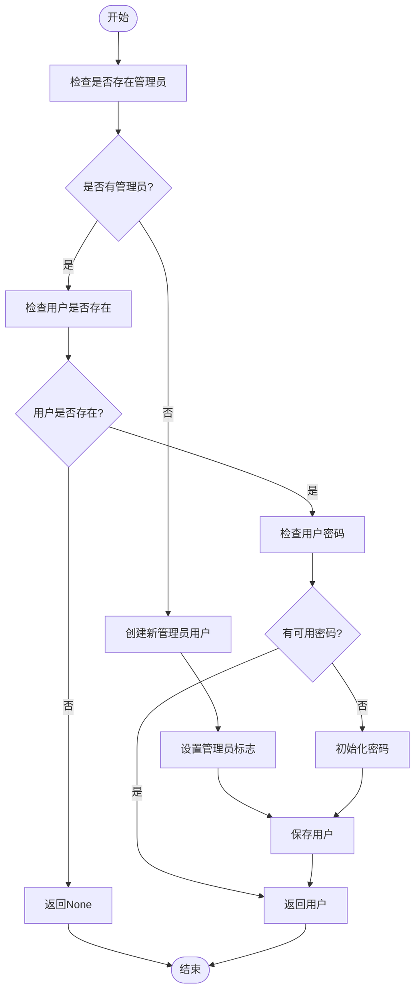
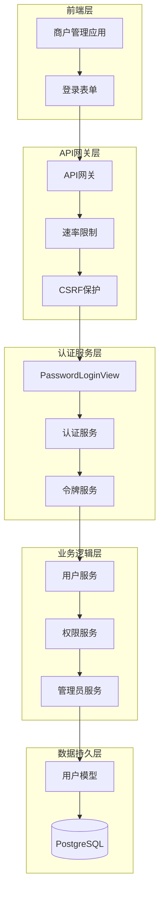
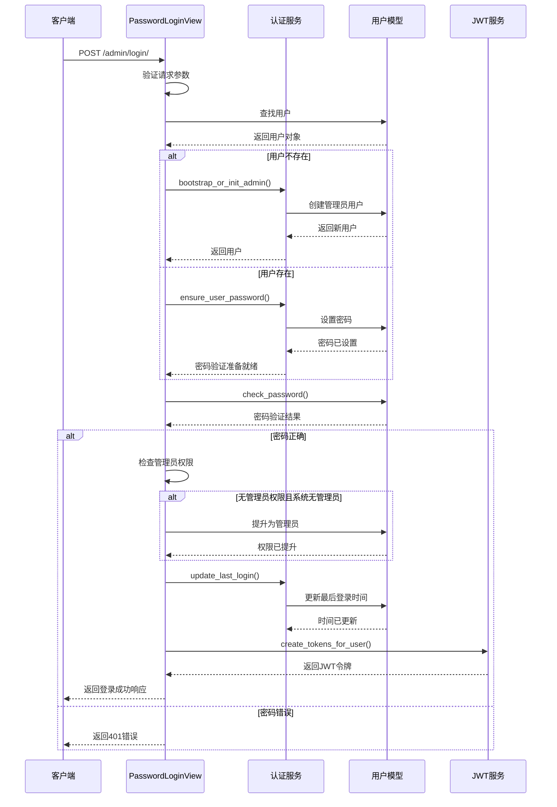
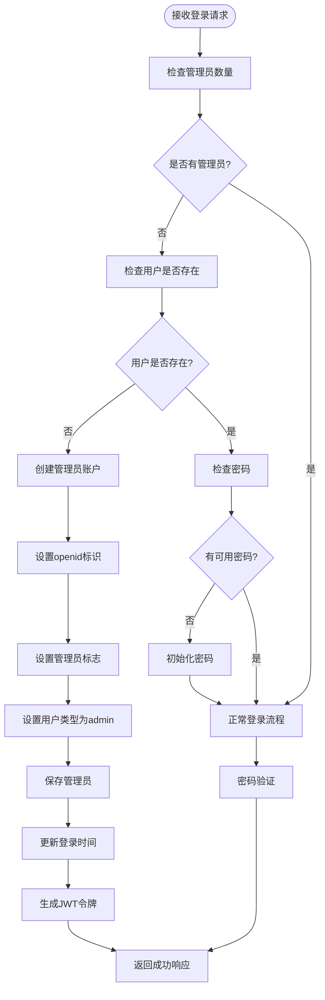
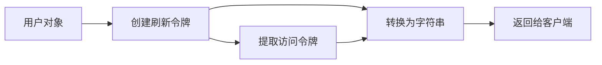
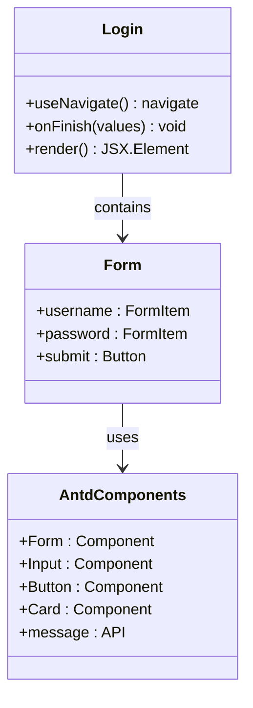
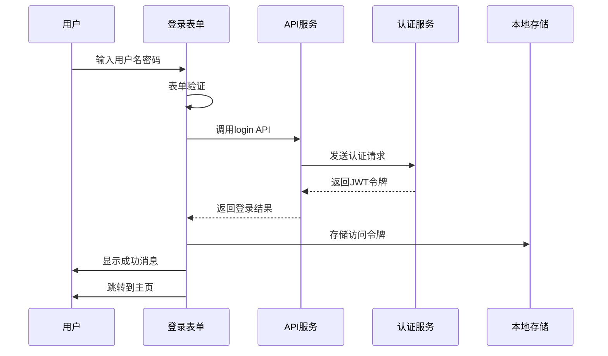
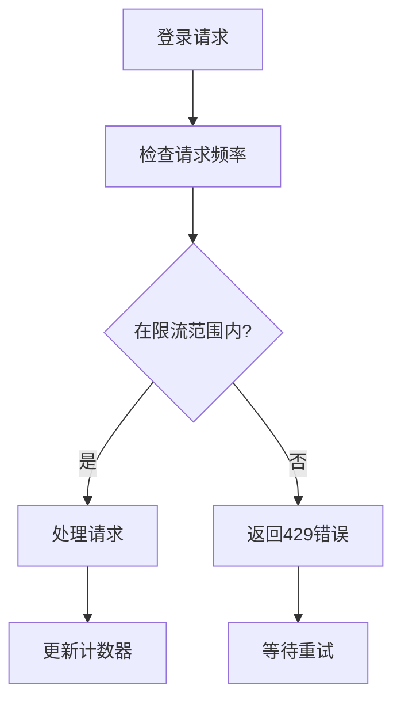

# 密码登录

<cite>
**本文档中引用的文件**
- [api.md](file://api.md)
- [backend/users/views.py](file://backend/users/views.py)
- [backend/users/services.py](file://backend/users/services.py)
- [backend/users/models.py](file://backend/users/models.py)
- [backend/users/urls.py](file://backend/users/urls.py)
- [backend/users/serializers.py](file://backend/users/serializers.py)
- [backend/common/throttles.py](file://backend/common/throttles.py)
- [merchant/src/pages/Login/index.tsx](file://merchant/src/pages/Login/index.tsx)
- [merchant/src/utils/auth.ts](file://merchant/src/utils/auth.ts)
- [商户管理后端.md](file://商户管理后端.md)
</cite>

## 目录
1. [简介](#简介)
2. [接口概述](#接口概述)
3. [核心组件分析](#核心组件分析)
4. [系统架构](#系统架构)
5. [详细实现分析](#详细实现分析)
6. [请求响应示例](#请求响应示例)
7. [错误处理策略](#错误处理策略)
8. [商户管理后台应用](#商户管理后台应用)
9. [性能考虑](#性能考虑)
10. [故障排除指南](#故障排除指南)
11. [总结](#总结)

## 简介

管理员密码登录API是商户管理后台的核心认证接口，负责验证管理员用户的用户名和密码，确保只有具备管理员权限的用户能够访问管理功能。该接口实现了复杂的权限校验机制，包括系统初始化时的自动管理员创建、密码验证、JWT令牌生成和最后登录时间更新等功能。

## 接口概述

### 基本信息

- **接口路径**: `/admin/login/` 或 `/password_login/`
- **HTTP方法**: `POST`
- **权限要求**: `AllowAny`（允许匿名访问）
- **认证方式**: 无（登录成功后返回JWT令牌）
- **限流策略**: 5次/分钟（LoginRateThrottle）

### 请求参数

| 参数名 | 类型 | 必填 | 说明 |
|--------|------|------|------|
| username | string | 是 | 用户名 |
| password | string | 是 | 密码 |

### 响应格式

```json
{
  "access": "字符串形式的访问令牌",
  "refresh": "字符串形式的刷新令牌",
  "user": {
    "id": 数字,
    "username": "用户名",
    "avatar_url": "头像URL",
    "phone": "手机号",
    "email": "电子邮箱",
    "user_type": "admin",
    "last_login_at": "ISO格式最后登录时间",
    "orders_count": 数字,
    "completed_orders_count": 数字
  }
}
```

**节来源**
- [api.md](file://api.md#L62-L72)

## 核心组件分析

### PasswordLoginView 视图类

PasswordLoginView是管理员密码登录的核心视图类，继承自Django REST Framework的APIView基类，专门处理管理员用户的用户名密码认证。

#### 主要特性

1. **匿名访问支持**: `permission_classes = [permissions.AllowAny]`
2. **无认证要求**: `authentication_classes = []`
3. **登录限流**: `throttle_classes = [LoginRateThrottle]`
4. **CSRF保护禁用**: 使用装饰器禁用CSRF验证

#### 关键方法

- **post()**: 处理POST请求，执行完整的登录验证流程
- **参数验证**: 检查用户名和密码是否为空
- **用户查找**: 根据用户名查找用户
- **密码验证**: 使用Django内置的密码验证机制
- **权限校验**: 确保用户具备管理员权限
- **令牌生成**: 创建JWT访问令牌和刷新令牌

**节来源**
- [backend/users/views.py](file://backend/users/views.py#L160-L233)

### 服务层组件

#### bootstrap_or_init_admin函数

该函数负责系统初始化时的管理员账户创建逻辑：



**图表来源**
- [backend/users/services.py](file://backend/users/services.py#L26-L49)

#### create_tokens_for_user函数

负责为认证成功的用户生成JWT令牌：

- **刷新令牌**: 使用`RefreshToken.for_user(user)`创建
- **访问令牌**: 从刷新令牌中提取
- **令牌有效期**: 刷新令牌7天，访问令牌15分钟

#### update_last_login函数

更新用户的最后登录时间：

- 使用`timezone.now()`获取当前时间
- 保存到`last_login_at`字段
- 更新数据库记录

**节来源**
- [backend/users/services.py](file://backend/users/services.py#L18-L25)

## 系统架构

### 整体架构图



**图表来源**
- [backend/users/views.py](file://backend/users/views.py#L160-L171)
- [backend/users/urls.py](file://backend/users/urls.py#L11-L13)

### 组件交互流程



**图表来源**
- [backend/users/views.py](file://backend/users/views.py#L177-L233)

## 详细实现分析

### 系统初始化特殊处理

当系统中不存在任何管理员用户时，PasswordLoginView会自动创建管理员账户：

#### 初始化流程



**图表来源**
- [backend/users/views.py](file://backend/users/views.py#L192-L204)
- [backend/users/services.py](file://backend/users/services.py#L26-L49)

#### 关键实现细节

1. **管理员检测**: `User.objects.filter(is_staff=True).exists()`
2. **用户查找**: `User.objects.filter(username=username).order_by('-date_joined').first()`
3. **自动创建**: 使用`bootstrap_or_init_admin()`函数
4. **权限提升**: 自动将用户设置为管理员（仅在系统无管理员时）

### 密码验证机制

#### 验证步骤

1. **参数检查**: 确保用户名和密码都存在
2. **用户查找**: 根据用户名查找用户
3. **密码验证**: 使用Django的`check_password()`方法
4. **权限检查**: 确保用户具备管理员权限

#### 安全特性

- **时间安全**: 使用Django的安全密码比较算法
- **错误处理**: 统一的401错误响应，不泄露具体错误原因
- **限流保护**: 防止暴力破解攻击

**节来源**
- [backend/users/views.py](file://backend/users/views.py#L184-L211)

### JWT令牌生成

#### 令牌类型

- **访问令牌 (Access Token)**: 15分钟有效期，用于API请求认证
- **刷新令牌 (Refresh Token)**: 7天有效期，用于获取新的访问令牌

#### 生成过程



**图表来源**
- [backend/users/services.py](file://backend/users/services.py#L22-L25)

### 最后登录时间更新

#### 更新时机

- **登录成功后**: 每次成功登录都会更新最后登录时间
- **时间格式**: ISO 8601格式的时间戳
- **数据库字段**: `last_login_at`字段

#### 实现方式

使用`update_last_login()`函数，通过`timezone.now()`获取当前时间并保存到数据库。

**节来源**
- [backend/users/services.py](file://backend/users/services.py#L18-L21)

## 请求响应示例

### 成功登录示例

#### 请求

```http
POST /admin/login/ HTTP/1.1
Host: api.example.com
Content-Type: application/json

{
  "username": "admin",
  "password": "secure_password123"
}
```

#### 响应

```http
HTTP/1.1 200 OK
Content-Type: application/json

{
  "access": "eyJ0eXAiOiJKV1QiLCJhbGciOiJIUzI1NiJ9...",
  "refresh": "eyJ0eXAiOiJKV1QiLCJhbGciOiJIUzI1NiJ9...",
  "user": {
    "id": 1,
    "username": "admin",
    "avatar_url": "https://example.com/avatar.jpg",
    "phone": "13800138000",
    "email": "admin@example.com",
    "user_type": "admin",
    "last_login_at": "2024-01-15T10:30:00Z",
    "orders_count": 15,
    "completed_orders_count": 12
  }
}
```

### 系统初始化示例

#### 请求

```http
POST /admin/login/ HTTP/1.1
Host: api.example.com
Content-Type: application/json

{
  "username": "first_admin",
  "password": "initial_password"
}
```

#### 响应

```http
HTTP/1.1 200 OK
Content-Type: application/json

{
  "access": "eyJ0eXAiOiJKV1QiLCJhbGciOiJIUzI1NiJ9...",
  "refresh": "eyJ0eXAiOiJKV1QiLCJhbGciOiJIUzI1NiJ9...",
  "user": {
    "id": 1,
    "username": "first_admin",
    "avatar_url": "https://www.gravatar.com/avatar/00000000000000000000000000000000?d=mp&f=y",
    "phone": "",
    "email": "",
    "user_type": "admin",
    "last_login_at": "2024-01-15T10:30:00Z",
    "orders_count": 0,
    "completed_orders_count": 0
  }
}
```

### 错误响应示例

#### 用户名或密码错误

```http
HTTP/1.1 401 UNAUTHORIZED
Content-Type: application/json

{
  "error": "INVALID_CREDENTIALS",
  "message": "用户名或密码错误"
}
```

#### 无管理员权限

```http
HTTP/1.1 403 FORBIDDEN
Content-Type: application/json

{
  "error": "PERMISSION_DENIED",
  "message": "无管理员权限"
}
```

#### 参数缺失

```http
HTTP/1.1 400 BAD_REQUEST
Content-Type: application/json

{
  "error": "REQUIRED_FIELD",
  "message": "用户名与密码必填"
}
```

**节来源**
- [api.md](file://api.md#L48-L72)

## 错误处理策略

### 错误分类

#### 认证错误

| 错误码 | HTTP状态 | 说明 | 处理建议 |
|--------|---------|------|---------|
| INVALID_CREDENTIALS | 401 | 用户名或密码错误 | 检查输入的用户名和密码 |
| PERMISSION_DENIED | 403 | 无管理员权限 | 确认用户具备管理员权限 |
| REQUIRED_FIELD | 400 | 缺少必填字段 | 提供完整的用户名和密码 |

#### 系统错误

| 错误码 | HTTP状态 | 说明 | 处理建议 |
|--------|---------|------|---------|
| RATE_LIMIT_EXCEEDED | 429 | 请求过于频繁 | 等待后重试，查看Retry-After头 |
| INTERNAL_ERROR | 500 | 服务器内部错误 | 联系技术支持 |

### 错误处理最佳实践

#### 前端处理

1. **统一错误处理**: 所有API调用都应包含错误处理逻辑
2. **用户友好提示**: 显示清晰的错误信息，避免技术术语
3. **自动重试**: 对于临时错误（如网络问题）可以自动重试
4. **登出处理**: 遇到401错误时自动清除认证信息并跳转登录页

#### 后端处理

1. **日志记录**: 记录所有错误以便后续分析
2. **安全考虑**: 不要在错误响应中泄露敏感信息
3. **限流保护**: 防止恶意攻击和暴力破解

**节来源**
- [api.md](file://api.md#L698-L735)

## 商户管理后台应用

### 前端实现

商户管理后台使用React和Ant Design构建登录界面：

#### 登录表单组件



**图表来源**
- [merchant/src/pages/Login/index.tsx](file://merchant/src/pages/Login/index.tsx#L1-L42)

#### 认证状态管理



**图表来源**
- [merchant/src/pages/Login/index.tsx](file://merchant/src/pages/Login/index.tsx#L11-L20)
- [merchant/src/utils/auth.ts](file://merchant/src/utils/auth.ts#L1-L13)

### API集成

#### 登录服务

商户前端通过`login`服务调用后端API：

```typescript
// 登录服务调用示例
const login = async (credentials: { username: string; password: string }) => {
  const response = await fetch('/admin/login/', {
    method: 'POST',
    headers: { 'Content-Type': 'application/json' },
    body: JSON.stringify(credentials)
  });
  
  if (!response.ok) {
    throw new Error('登录失败');
  }
  
  return response.json();
};
```

#### 认证工具函数

```typescript
// 认证状态管理工具
const TOKEN_KEY = 'admin_token';

export const setToken = (token: string): void => {
  localStorage.setItem(TOKEN_KEY, token);
};

export const getToken = (): string | null => {
  return localStorage.getItem(TOKEN_KEY);
};

export const removeToken = (): void => {
  localStorage.removeItem(TOKEN_KEY);
};
```

**节来源**
- [merchant/src/pages/Login/index.tsx](file://merchant/src/pages/Login/index.tsx#L4-L5)
- [merchant/src/utils/auth.ts](file://merchant/src/utils/auth.ts#L1-L13)

### 安全考虑

#### 前端安全

1. **输入验证**: 前端表单验证确保输入格式正确
2. **CSRF保护**: 后端禁用了CSRF保护，前端需要确保请求安全性
3. **令牌存储**: 使用localStorage存储JWT令牌
4. **路由保护**: 未认证用户无法访问管理页面

#### 后端安全

1. **速率限制**: 登录接口限制5次/分钟的请求频率
2. **密码安全**: 使用Django的密码哈希机制
3. **权限控制**: 严格的管理员权限检查
4. **审计日志**: 记录所有登录尝试

**节来源**
- [backend/common/throttles.py](file://backend/common/throttles.py#L11-L29)
- [商户管理后端.md](file://商户管理后端.md#L30-L33)

## 性能考虑

### 缓存策略

#### 用户统计数据缓存

UserSerializer中实现了智能缓存机制：

- **缓存键**: `f'user_orders_count_{obj.id}'`
- **缓存时间**: 5分钟
- **缓存失效**: 数据变更时自动失效
- **性能收益**: 减少数据库查询次数

#### 数据库优化

1. **索引优化**: 用户名字段建立唯一索引
2. **查询优化**: 使用`order_by('-date_joined')`优化用户查找
3. **批量操作**: 批量更新用户状态

### 限流机制

#### 登录限流



**图表来源**
- [backend/common/throttles.py](file://backend/common/throttles.py#L11-L29)

#### 限流配置

- **开发环境**: 无限制，便于调试
- **生产环境**: 5次/分钟
- **作用范围**: 匿名用户和已认证用户
- **实现方式**: 基于Redis的分布式限流

**节来源**
- [backend/common/throttles.py](file://backend/common/throttles.py#L11-L29)

## 故障排除指南

### 常见问题及解决方案

#### 1. 登录失败

**症状**: 输入正确的用户名和密码但无法登录

**可能原因**:
- 用户不是管理员用户
- 密码未正确设置
- 系统无管理员用户且用户名不存在

**解决步骤**:
1. 检查用户是否具有管理员权限
2. 使用管理命令设置密码
3. 检查系统是否需要初始化

#### 2. 无管理员权限错误

**症状**: 已知正确的用户名密码返回403错误

**可能原因**:
- 用户存在但未被赋予管理员权限
- 系统已有管理员但用户不是管理员

**解决步骤**:
1. 检查用户权限设置
2. 使用管理命令提升用户权限
3. 检查系统管理员数量

#### 3. 速率限制错误

**症状**: 频繁登录尝试返回429错误

**解决步骤**:
1. 等待5分钟后再尝试
2. 检查是否有多个客户端同时登录
3. 检查限流配置是否正确

### 调试技巧

#### 后端调试

1. **日志分析**: 检查Django日志了解请求处理过程
2. **数据库查询**: 使用Django ORM调试工具分析查询
3. **权限检查**: 验证用户权限设置

#### 前端调试

1. **网络请求**: 使用浏览器开发者工具检查API请求
2. **令牌验证**: 检查JWT令牌格式和有效期
3. **状态管理**: 验证认证状态是否正确更新

**节来源**
- [api.md](file://api.md#L698-L735)

## 总结

管理员密码登录API是一个设计精良的认证系统，具有以下特点：

### 核心优势

1. **安全性**: 实现了多层次的安全防护机制
2. **灵活性**: 支持系统初始化和多种登录场景
3. **性能**: 采用缓存和限流优化性能
4. **易用性**: 提供清晰的错误信息和响应格式

### 技术亮点

1. **智能初始化**: 自动创建管理员账户，简化系统部署
2. **权限管理**: 严格的管理员权限控制
3. **JWT集成**: 标准化的令牌认证机制
4. **错误处理**: 完善的错误分类和处理策略

### 应用价值

该接口为商户管理后台提供了可靠的认证基础，确保只有授权用户能够访问管理功能，同时为系统初始化和日常运营提供了灵活的支持。通过合理的架构设计和安全措施，保证了系统的稳定性和安全性。