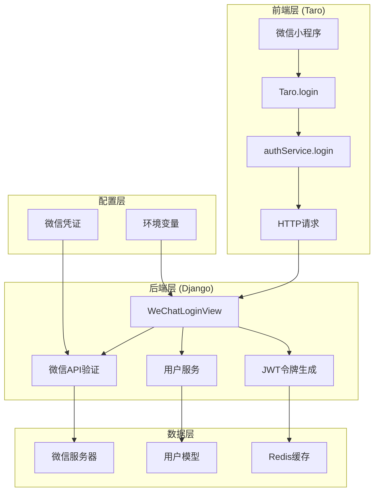
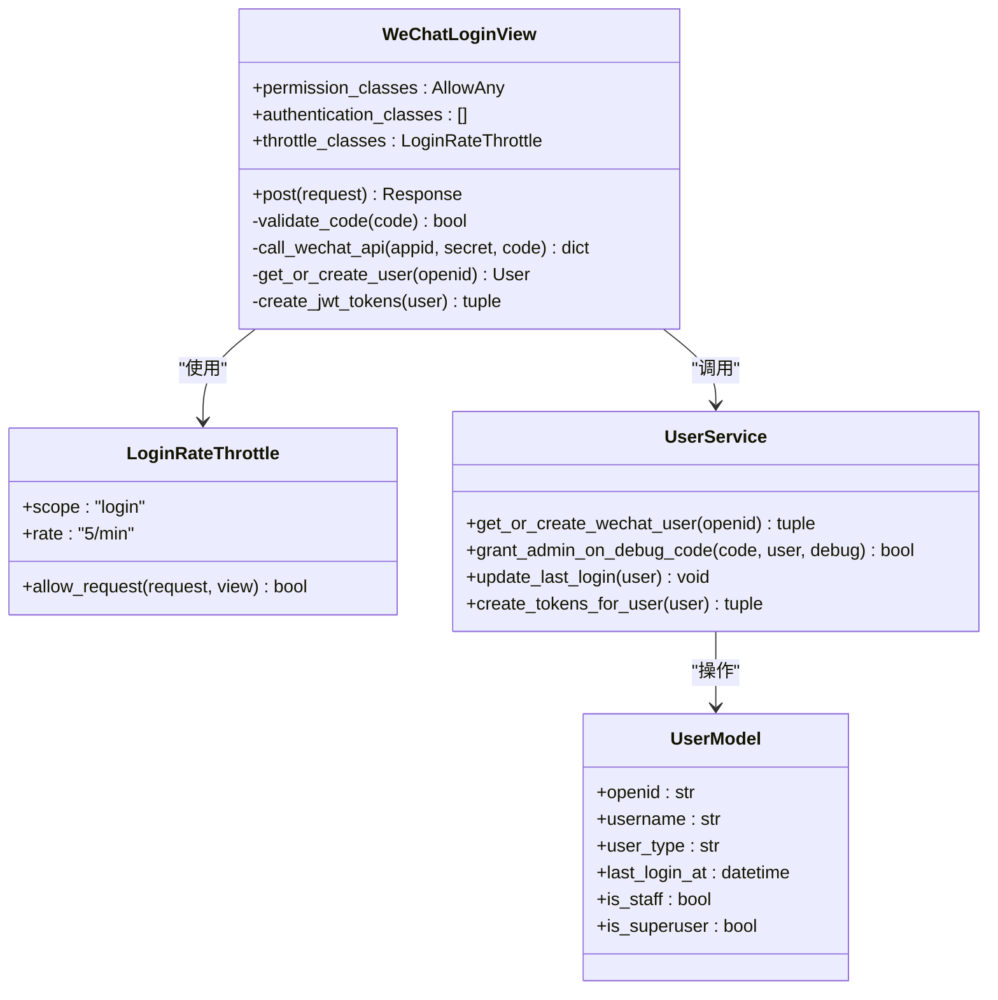
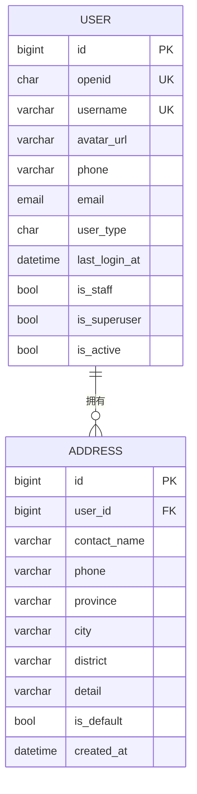
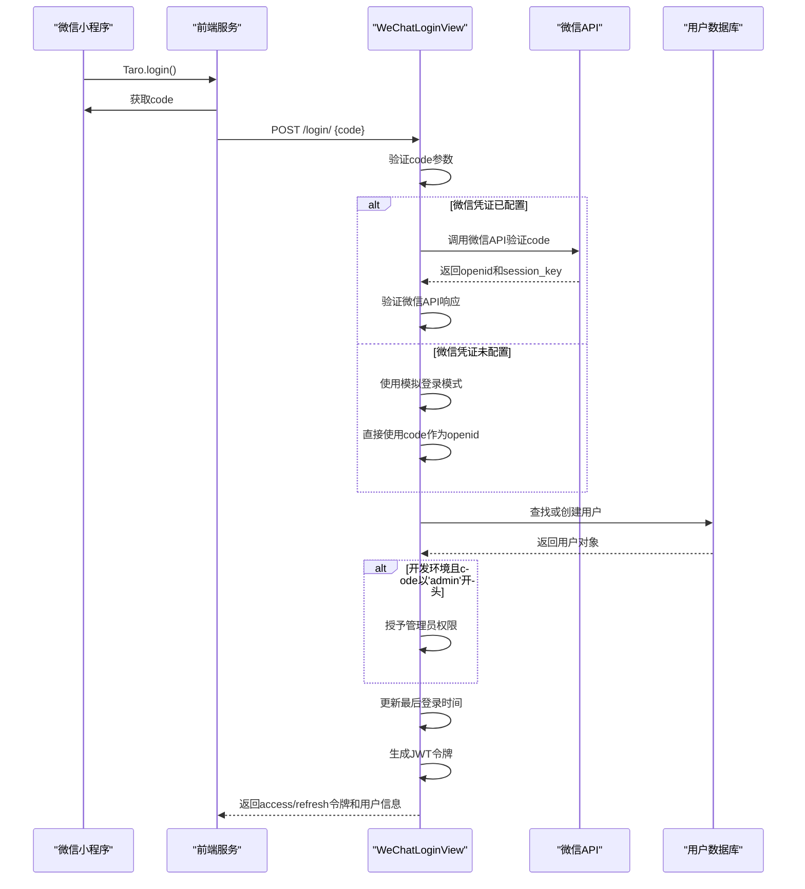
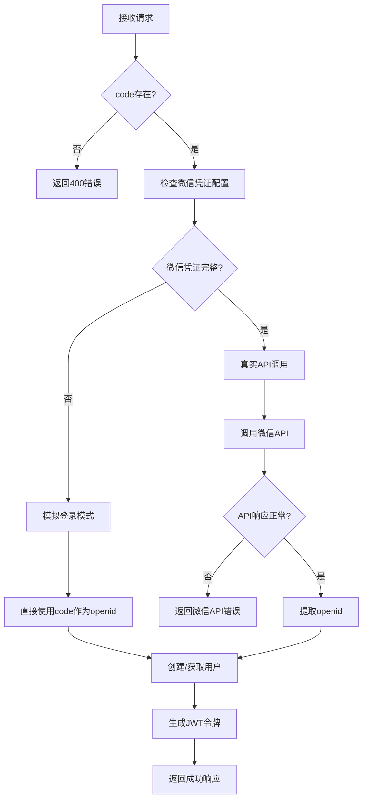
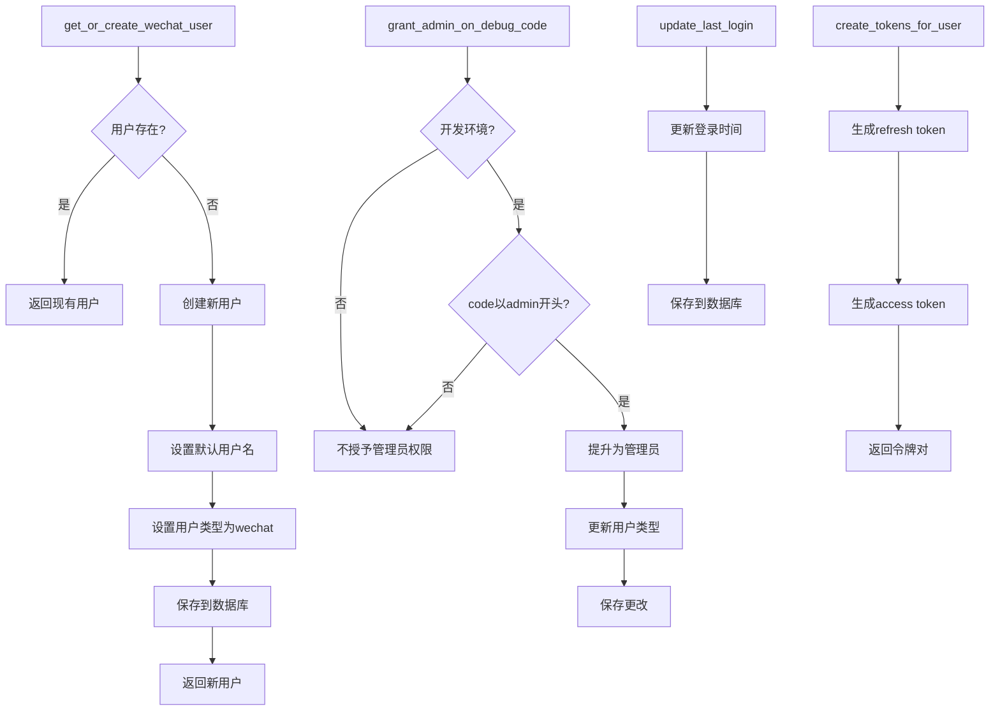
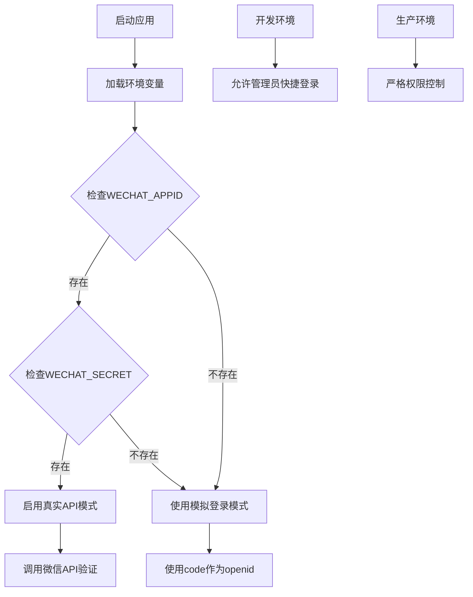
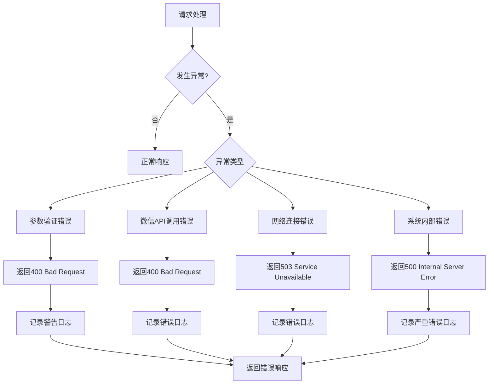
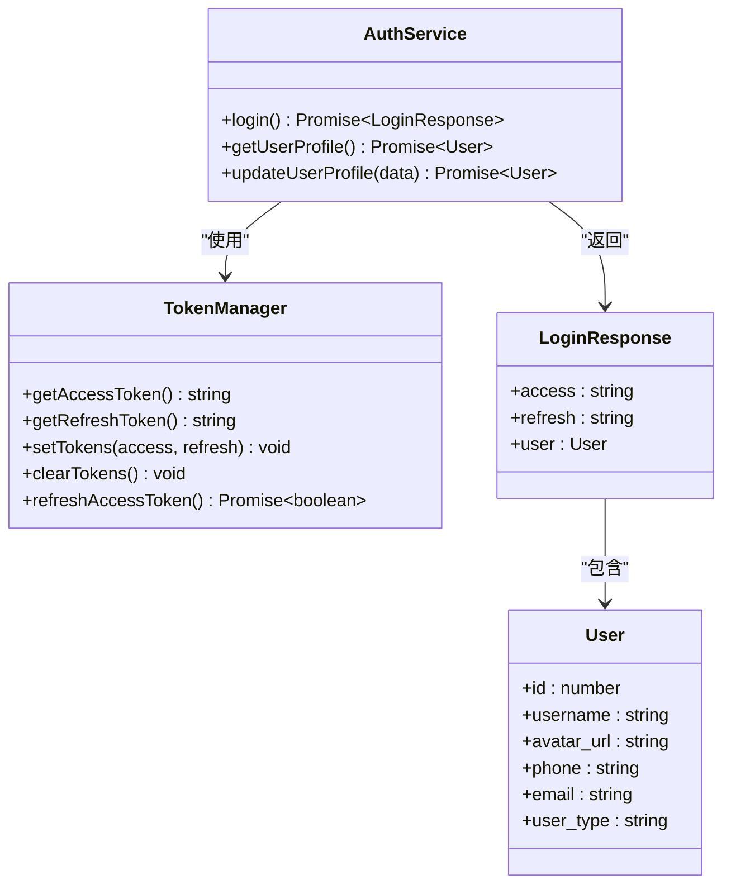
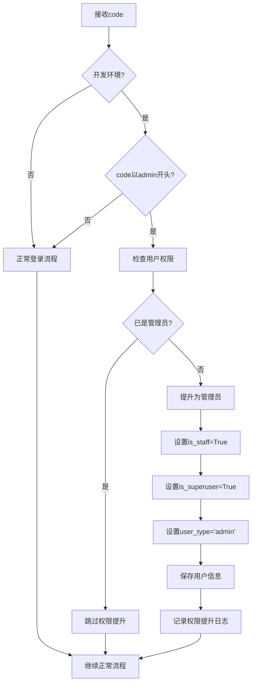

# 微信登录API文档

<cite>
**本文档引用的文件**
- [backend/users/views.py](file://backend/users/views.py)
- [backend/users/services.py](file://backend/users/services.py)
- [backend/users/models.py](file://backend/users/models.py)
- [backend/users/serializers.py](file://backend/users/serializers.py)
- [backend/common/throttles.py](file://backend/common/throttles.py)
- [frontend/src/services/auth.ts](file://frontend/src/services/auth.ts)
- [frontend/src/types/index.ts](file://frontend/src/types/index.ts)
- [frontend/src/pages/profile/index.tsx](file://frontend/src/pages/profile/index.tsx)
- [api.md](file://api.md)
- [frontend.md](file://frontend.md)
</cite>

## 目录
1. [简介](#简介)
2. [项目架构概览](#项目架构概览)
3. [核心组件分析](#核心组件分析)
4. [微信登录流程详解](#微信登录流程详解)
5. [配置管理](#配置管理)
6. [错误处理机制](#错误处理机制)
7. [前端集成指南](#前端集成指南)
8. [开发环境特殊功能](#开发环境特殊功能)
9. [性能考虑](#性能考虑)
10. [故障排除指南](#故障排除指南)
11. [总结](#总结)

## 简介

微信登录API是家电分销小程序的核心认证机制，基于微信小程序的code换取机制，为用户提供便捷的无密码登录体验。该系统支持真实微信API调用和模拟登录两种模式，确保开发和生产环境的稳定运行。

### 主要特性

- **双模式登录**：支持真实微信API调用和本地模拟登录
- **智能权限管理**：开发环境支持管理员快捷登录
- **严格限流保护**：防止暴力破解攻击
- **完善的错误处理**：提供详细的错误信息和恢复建议
- **JWT令牌机制**：安全的会话管理

## 项目架构概览

系统采用前后端分离架构，后端基于Django REST framework构建，前端使用Taro框架开发。



**图表来源**
- [backend/users/views.py](file://backend/users/views.py#L21-L158)
- [frontend/src/services/auth.ts](file://frontend/src/services/auth.ts#L1-L22)

## 核心组件分析

### WeChatLoginView - 登录控制器

`WeChatLoginView`是微信登录的核心控制器，负责处理整个登录流程。



**图表来源**
- [backend/users/views.py](file://backend/users/views.py#L21-L158)
- [backend/users/services.py](file://backend/users/services.py#L1-L55)
- [backend/users/models.py](file://backend/users/models.py#L31-L71)

**章节来源**
- [backend/users/views.py](file://backend/users/views.py#L21-L158)
- [backend/users/services.py](file://backend/users/services.py#L1-L55)

### 用户模型设计

用户模型支持两种认证方式：微信openid和传统用户名密码。



**图表来源**
- [backend/users/models.py](file://backend/users/models.py#L31-L71)

**章节来源**
- [backend/users/models.py](file://backend/users/models.py#L31-L71)

## 微信登录流程详解

### 完整登录流程

微信登录遵循标准的OAuth 2.0流程，通过code换取openid，然后创建或获取用户。



**图表来源**
- [backend/users/views.py](file://backend/users/views.py#L49-L154)
- [frontend/src/services/auth.ts](file://frontend/src/services/auth.ts#L7-L9)

### 关键处理逻辑

#### 1. 参数验证阶段



**图表来源**
- [backend/users/views.py](file://backend/users/views.py#L53-L154)

#### 2. 用户管理服务

用户服务提供了完整的用户生命周期管理功能。



**图表来源**
- [backend/users/services.py](file://backend/users/services.py#L5-L24)

**章节来源**
- [backend/users/views.py](file://backend/users/views.py#L49-L154)
- [backend/users/services.py](file://backend/users/services.py#L5-L55)

## 配置管理

### 环境变量配置

系统通过环境变量管理微信凭证和其他关键配置。

| 配置项 | 必需 | 说明 | 默认值 |
|--------|------|------|--------|
| `WECHAT_APPID` | 是 | 微信小程序AppID | - |
| `WECHAT_SECRET` | 是 | 微信小程序AppSecret | - |
| `DJANGO_ENV` | 是 | 运行环境 | development |
| `DEBUG` | 是 | 调试模式 | True |
| `SECRET_KEY` | 是 | Django密钥 | dev-secret-key |

### 配置优先级



**图表来源**
- [backend/backend/settings/base.py](file://backend/backend/settings/base.py#L227-L233)

**章节来源**
- [backend/backend/settings/base.py](file://backend/backend/settings/base.py#L227-L233)

## 错误处理机制

### 错误分类与处理

系统实现了完善的错误处理机制，涵盖各种异常场景。

| 错误类型 | HTTP状态码 | 错误代码 | 描述 | 处理策略 |
|----------|------------|----------|------|----------|
| 缺少code参数 | 400 | BAD_REQUEST | 请求中缺少code参数 | 返回具体缺少的字段信息 |
| 微信API错误 | 400 | WECHAT_API_ERROR | 调用微信API失败 | 返回微信官方错误码和消息 |
| 网络连接失败 | 503 | SERVICE_UNAVAILABLE | 无法连接到微信API | 建议稍后重试 |
| 内部服务器错误 | 500 | INTERNAL_ERROR | 系统内部错误 | 记录日志，联系技术支持 |
| 速率限制 | 429 | RATE_LIMIT_EXCEEDED | 请求过于频繁 | 返回重试时间建议 |

### 错误处理流程



**图表来源**
- [backend/users/views.py](file://backend/users/views.py#L53-L118)

**章节来源**
- [backend/users/views.py](file://backend/users/views.py#L53-L118)
- [backend/common/throttles.py](file://backend/common/throttles.py#L11-L77)

## 前端集成指南

### 前端服务架构

前端使用Taro框架，通过专门的服务层处理微信登录。



**图表来源**
- [frontend/src/services/auth.ts](file://frontend/src/services/auth.ts#L1-L22)
- [frontend/src/types/index.ts](file://frontend/src/types/index.ts#L1-L17)

### 登录流程实现

#### 1. 前端登录调用

前端通过Taro.login()获取微信code，然后调用后端登录接口。

```typescript
// 前端登录实现示例
async login(): Promise<LoginResponse> {
    // 1. 调用微信登录API获取code
    const { code } = await Taro.login()
    
    // 2. 发送code到后端
    return http.post<LoginResponse>('/login/', { code }, false)
}

// 登录成功后的处理
const handleLogin = async () => {
    setLoading(true)
    try {
        const res = await authService.login()
        
        // 3. 保存JWT令牌
        TokenManager.setTokens(res.access, res.refresh)
        setUser(res.user)
        
        // 4. 触发全局事件通知
        Taro.eventCenter.trigger('userLogin')
        
        Taro.showToast({ title: '登录成功', icon: 'success' })
    } catch (error) {
        Taro.showToast({ title: '登录失败', icon: 'none' })
    } finally {
        setLoading(false)
    }
}
```

#### 2. HTTP请求封装

系统实现了统一的HTTP请求封装，自动处理认证和错误。

```typescript
// Token管理器实现
export const TokenManager = {
    getAccessToken(): string | null {
        return Taro.getStorageSync('access_token')
    },
    
    setTokens(access: string, refresh: string) {
        Taro.setStorageSync('access_token', access)
        Taro.setStorageSync('refresh_token', refresh)
    },
    
    async refreshAccessToken(): Promise<boolean> {
        const refreshToken = this.getRefreshToken()
        if (!refreshToken) return false
        
        try {
            const res = await Taro.request({
                url: `${BASE_URL}/token/refresh/`,
                method: 'POST',
                data: { refresh: refreshToken }
            })
            
            if (res.statusCode === 200 && res.data.access) {
                Taro.setStorageSync('access_token', res.data.access)
                return true
            }
            return false
        } catch {
            return false
        }
    }
}
```

**章节来源**
- [frontend/src/services/auth.ts](file://frontend/src/services/auth.ts#L1-L22)
- [frontend/src/pages/profile/index.tsx](file://frontend/src/pages/profile/index.tsx#L28-L45)
- [frontend/src/utils/request.ts](file://frontend/src/utils/request.ts#L1-L102)

## 开发环境特殊功能

### 管理员快捷登录

开发环境中，当code以'admin'开头时，系统会自动授予管理员权限，方便开发者快速测试管理功能。



**图表来源**
- [backend/users/services.py](file://backend/users/services.py#L8-L16)

### 模拟登录模式

当微信凭证未配置时，系统自动切换到模拟登录模式，直接使用code作为openid。

```python
# 模拟登录实现
if not appid or not secret:
    logger.warning('微信凭证未配置，使用模拟登录模式')
    logger.info(f'模拟登录: code={code}')
    openid = code
    session_key = None
```

这种设计确保了开发环境的可用性，同时不影响生产环境的安全性。

**章节来源**
- [backend/users/services.py](file://backend/users/services.py#L8-L16)
- [backend/users/views.py](file://backend/users/views.py#L65-L71)

## 性能考虑

### 速率限制策略

系统实现了严格的速率限制，防止恶意攻击和滥用。

| 终端类型 | 限制频率 | 说明 |
|----------|----------|------|
| 已认证用户 | 5次/分钟 | 防止暴力破解攻击 |
| 匿名用户 | 5次/分钟 | 保护登录接口 |
| 开发环境 | 无限制 | 便于调试开发 |

### 缓存优化

用户统计数据通过Redis缓存优化，减少数据库查询压力。

```python
# 用户统计缓存实现
def get_orders_count(self, obj):
    cache_key = f'user_orders_count_{obj.id}'
    count = cache.get(cache_key)
    
    if count is None:
        count = obj.orders.count()
        cache.set(cache_key, count, 300)  # 缓存5分钟
    
    return count
```

### 网络超时配置

微信API调用设置了合理的超时时间，避免长时间等待。

```python
# 网络超时配置
response = requests.get(url, timeout=10)
```

**章节来源**
- [backend/common/throttles.py](file://backend/common/throttles.py#L11-L77)
- [backend/users/serializers.py](file://backend/users/serializers.py#L21-L41)

## 故障排除指南

### 常见问题及解决方案

#### 1. 缺少code参数

**症状**：返回400 Bad Request，错误信息"Code is required"

**原因**：前端未正确调用Taro.login()或请求体中缺少code字段

**解决方案**：
- 确保调用了`await Taro.login()`获取code
- 检查请求体格式是否正确：`{ "code": "微信code" }`

#### 2. 微信API验证失败

**症状**：返回400 Bad Request，错误信息"WeChat API error"

**原因**：
- 微信凭证配置错误
- code已过期或无效
- 网络连接问题

**解决方案**：
- 检查环境变量配置：`WECHAT_APPID`和`WECHAT_SECRET`
- 确认code的有效性（通常有效期5分钟）
- 检查网络连接状态

#### 3. 网络连接超时

**症状**：返回503 Service Unavailable，错误信息"Failed to connect to WeChat API"

**原因**：网络不稳定或微信服务器不可达

**解决方案**：
- 检查网络连接
- 稍后重试
- 联系技术支持确认微信服务器状态

#### 4. 速率限制错误

**症状**：返回429 Too Many Requests

**原因**：请求频率超过限制

**解决方案**：
- 等待5分钟后再试
- 优化前端请求频率
- 检查是否有异常的自动化脚本

### 调试技巧

#### 1. 启用详细日志

```python
# 在settings.py中启用详细日志
LOGGING = {
    'version': 1,
    'disable_existing_loggers': False,
    'handlers': {
        'console': {
            'class': 'logging.StreamHandler',
        },
    },
    'root': {
        'handlers': ['console'],
        'level': 'DEBUG',
    },
}
```

#### 2. 检查环境变量

```bash
# 检查微信凭证配置
echo $WECHAT_APPID
echo $WECHAT_SECRET
```

#### 3. 测试微信API连通性

```bash
# 测试微信API是否可达
curl "https://api.weixin.qq.com/sns/jscode2session?appid=test&secret=test&js_code=test&grant_type=authorization_code"
```

**章节来源**
- [backend/users/views.py](file://backend/users/views.py#L53-L118)
- [backend/common/throttles.py](file://backend/common/throttles.py#L11-L77)

## 总结

微信登录API是一个设计完善、功能完整的用户认证系统，具有以下特点：

### 核心优势

1. **安全性**：采用JWT令牌机制，支持令牌刷新，防止暴力破解
2. **灵活性**：支持真实API调用和模拟登录两种模式
3. **易用性**：提供清晰的错误信息和完善的前端集成示例
4. **可维护性**：模块化设计，易于扩展和维护
5. **开发友好**：开发环境提供管理员快捷登录功能

### 最佳实践

1. **生产环境**：始终配置完整的微信凭证，启用真实API调用
2. **错误处理**：前端应妥善处理各种错误场景，提供良好的用户体验
3. **安全防护**：合理设置速率限制，定期检查安全配置
4. **监控告警**：建立完善的日志监控体系，及时发现和处理异常

### 扩展建议

1. **多语言支持**：可以考虑添加国际化错误信息
2. **第三方登录**：未来可以扩展支持其他社交平台登录
3. **生物识别**：集成指纹或面部识别等现代认证方式
4. **多设备同步**：支持同一用户的多设备登录管理

该微信登录系统为家电分销小程序提供了可靠、高效的用户认证基础，支撑着整个应用的用户管理体系。