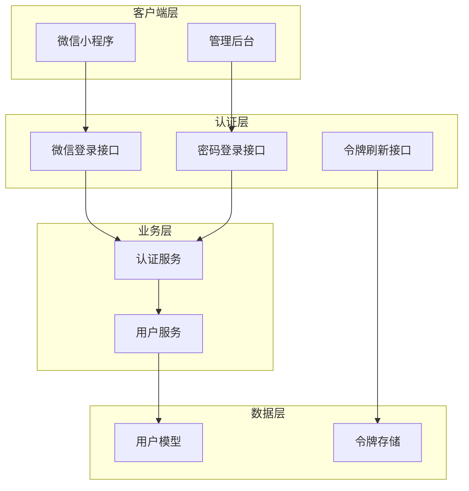
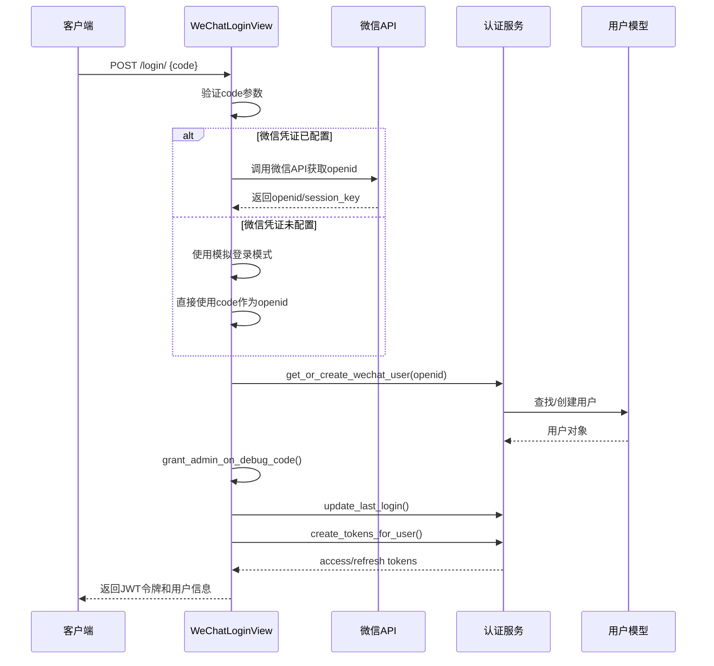
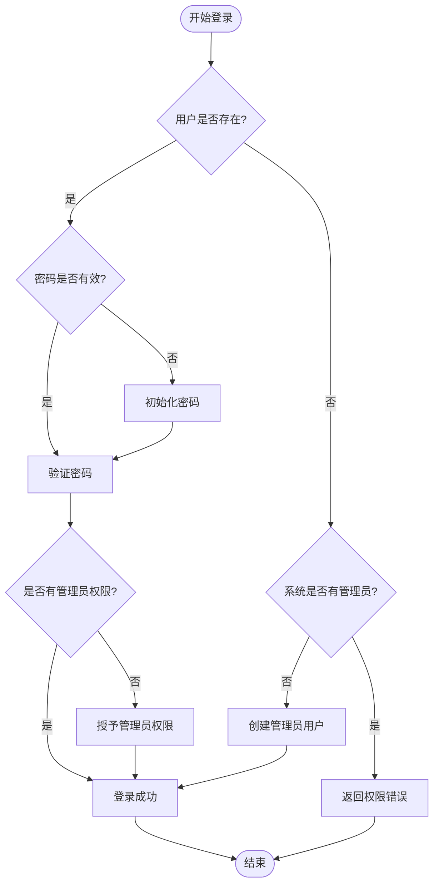
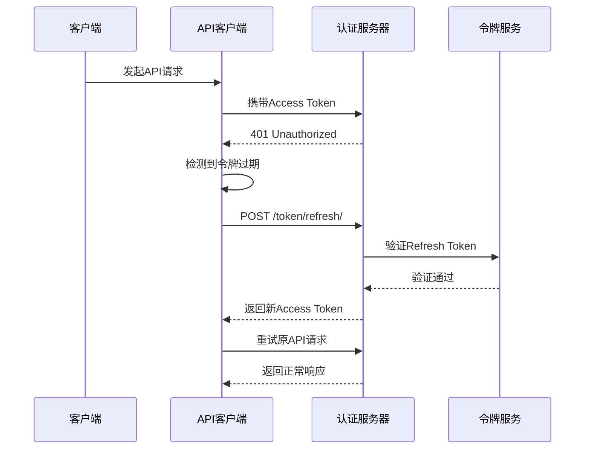
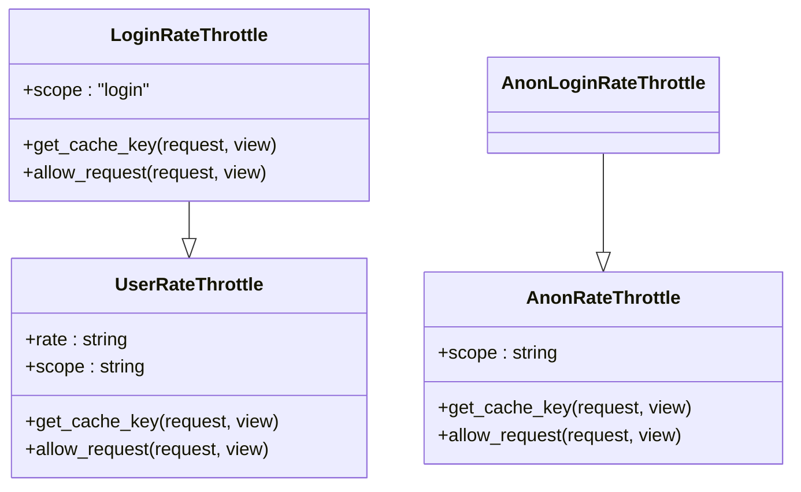
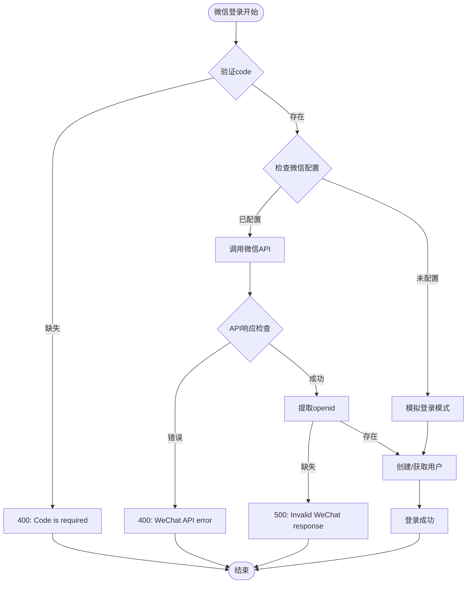

# 认证API

<cite>
**本文档引用的文件**
- [api.md](file://api.md)
- [backend/users/views.py](file://backend/users/views.py)
- [backend/users/services.py](file://backend/users/services.py)
- [backend/common/throttles.py](file://backend/common/throttles.py)
- [backend/users/models.py](file://backend/users/models.py)
- [frontend/src/services/auth.ts](file://frontend/src/services/auth.ts)
- [frontend/src/utils/request.ts](file://frontend/src/utils/request.ts)
- [merchant/src/services/api.ts](file://merchant/src/services/api.ts)
- [merchant/src/utils/auth.ts](file://merchant/src/utils/auth.ts)
- [frontend.md](file://frontend.md)
</cite>

## 目录
1. [简介](#简介)
2. [系统架构概览](#系统架构概览)
3. [微信小程序登录](#微信小程序登录)
4. [管理员密码登录](#管理员密码登录)
5. [JWT令牌机制](#jwt令牌机制)
6. [登录频率限制](#登录频率限制)
7. [错误处理策略](#错误处理策略)
8. [前端集成指南](#前端集成指南)
9. [开发环境特性](#开发环境特性)
10. [最佳实践](#最佳实践)

## 简介

本系统提供两种认证方式：微信小程序登录和管理员密码登录。采用JWT（JSON Web Token）作为认证令牌，支持令牌刷新机制，并实现了严格的登录频率限制以保障系统安全。

### 认证方式对比

| 特性 | 微信小程序登录 | 管理员密码登录 |
|------|----------------|----------------|
| **认证方式** | 微信code换取openid | 用户名密码 |
| **用户类型** | wechat | admin |
| **首次登录** | 自动创建用户 | 支持引导式创建 |
| **权限要求** | 无需认证 | 需要管理员权限 |
| **开发环境** | 支持模拟登录 | 支持快捷创建 |
| **限流策略** | 5次/分钟 | 5次/分钟 |

## 系统架构概览



**图表来源**
- [backend/users/views.py](file://backend/users/views.py#L23-L158)
- [backend/users/services.py](file://backend/users/services.py#L1-L55)

## 微信小程序登录

### 接口规范

**端点**: `POST /api/login/`

**权限**: AllowAny（允许匿名访问）

**请求体**:
```json
{
    "code": "微信登录code"
}
```

**响应**:
```json
{
    "access": "eyJ0eXAiOiJKV1QiLCJhbGciOiJIUzI1NiJ9...",
    "refresh": "eyJ0eXAiOiJKV1QiLCJhbGciOiJIUzI1NiJ9...",
    "user": {
        "id": 1,
        "username": "用户_xxx",
        "avatar_url": "https://www.gravatar.com/avatar/...",
        "phone": "13800138000",
        "email": "user@example.com",
        "user_type": "wechat",
        "last_login_at": "2024-01-01T10:00:00Z"
    }
}
```

### 实现流程



**图表来源**
- [backend/users/views.py](file://backend/users/views.py#L49-L154)
- [backend/users/services.py](file://backend/users/services.py#L5-L24)

### 核心功能特性

#### 1. 微信API集成
系统支持两种微信登录模式：

- **真实微信API模式**（推荐）：调用官方微信API验证code
- **模拟登录模式**（开发环境）：直接使用code作为openid

#### 2. 开发环境快捷登录
开发环境中，code以`admin`开头时自动授予管理员权限。

#### 3. 用户创建逻辑
- **用户存在**：更新最后登录时间
- **用户不存在**：创建新用户，设置用户类型为`wechat`

**章节来源**
- [backend/users/views.py](file://backend/users/views.py#L23-L158)

## 管理员密码登录

### 接口规范

**端点**: `POST /api/admin/login/`

**权限**: AllowAny（允许匿名访问）

**请求体**:
```json
{
    "username": "管理员用户名",
    "password": "管理员密码"
}
```

**响应**:
```json
{
    "access": "eyJ0eXAiOiJKV1QiLCJhbGciOiJIUzI1NiJ9...",
    "refresh": "eyJ0eXAiOiJKV1QiLCJhbGciOiJIUzI1NiJ9...",
    "user": {
        "id": 1,
        "username": "admin",
        "avatar_url": "https://www.gravatar.com/avatar/...",
        "phone": "",
        "email": "",
        "user_type": "admin",
        "last_login_at": "2024-01-01T10:00:00Z"
    }
}
```

### 引导式管理员创建

系统支持首次运行时的管理员引导创建：



**图表来源**
- [backend/users/views.py](file://backend/users/views.py#L177-L233)

### 权限校验机制

1. **首次引导**：系统无管理员时，自动提升用户为管理员
2. **正常登录**：已有管理员时，非管理员用户返回403错误
3. **密码管理**：支持首次设置密码和后续修改

**章节来源**
- [backend/users/views.py](file://backend/users/views.py#L162-L233)

## JWT令牌机制

### 令牌结构

系统使用Django REST Framework SimpleJWT实现JWT认证：

- **Access Token**：15分钟有效期，用于日常API请求
- **Refresh Token**：7天有效期，用于刷新Access Token

### 令牌刷新流程



**图表来源**
- [frontend/src/utils/request.ts](file://frontend/src/utils/request.ts#L93-L102)
- [backend/users/services.py](file://backend/users/services.py#L22-L24)

### 令牌管理

前端实现了完整的令牌生命周期管理：

#### 存储机制
- **Access Token**：存储在内存中
- **Refresh Token**：存储在本地存储中

#### 自动刷新
- 检测401错误时自动触发令牌刷新
- 刷新成功后重试原请求
- 刷新失败后清除令牌并跳转登录

**章节来源**
- [frontend/src/utils/request.ts](file://frontend/src/utils/request.ts#L19-L58)

## 登录频率限制

### 限流策略

系统实施严格的登录频率限制以防止暴力破解攻击：

| 场景 | 限流规则 | 说明 |
|------|----------|------|
| **登录接口** | 5次/分钟 | 所有登录端点共享此限制 |
| **认证用户** | 100次/分钟 | 已认证用户的通用限制 |
| **匿名用户** | 20次/分钟 | 未认证用户的通用限制 |

### 实现机制



**图表来源**
- [backend/common/throttles.py](file://backend/common/throttles.py#L11-L77)

### 限流配置

- **开发环境**：不限制频率，便于调试
- **生产环境**：严格实施频率限制
- **缓存存储**：使用Redis或内存缓存

**章节来源**
- [backend/common/throttles.py](file://backend/common/throttles.py#L11-L77)

## 错误处理策略

### 常见错误码

| HTTP状态码 | 错误类型 | 描述 | 解决方案 |
|------------|----------|------|----------|
| 400 | BAD_REQUEST | 请求参数错误 | 检查请求参数格式 |
| 401 | UNAUTHORIZED | 令牌无效或过期 | 重新登录或刷新令牌 |
| 403 | FORBIDDEN | 权限不足 | 检查用户权限级别 |
| 404 | NOT_FOUND | 资源不存在 | 检查资源ID |
| 429 | RATE_LIMIT_EXCEEDED | 请求过于频繁 | 等待后重试 |
| 500 | INTERNAL_ERROR | 服务器内部错误 | 联系技术支持 |

### 微信登录错误处理



**图表来源**
- [backend/users/views.py](file://backend/users/views.py#L53-L118)

### 前端错误处理

前端实现了智能的错误处理机制：

1. **自动重试**：401错误时自动刷新令牌并重试
2. **用户提示**：友好的错误消息显示
3. **状态恢复**：错误恢复后的状态管理

**章节来源**
- [frontend/src/utils/request.ts](file://frontend/src/utils/request.ts#L100-L132)

## 前端集成指南

### 微信小程序集成

#### 1. 获取微信code
```typescript
// 微信小程序登录流程
async function loginWithWeChat() {
    const { code } = await Taro.login()
    return authService.login(code)
}
```

#### 2. 保存令牌
```typescript
// 登录成功后保存令牌
const { access, refresh, user } = await loginWithWeChat()
TokenManager.setTokens(access, refresh)
```

#### 3. API请求
```typescript
// 自动携带认证头
const products = await http.get('/products/')
```

### 管理后台集成

#### 1. 管理员登录
```typescript
// 管理员登录
const loginResponse = await login({
    username: 'admin',
    password: 'password123'
})
```

#### 2. 令牌管理
```typescript
// 管理后台令牌管理
const token = getToken() // 获取令牌
setToken(newToken)      // 设置新令牌
removeToken()           // 清除令牌
```

**章节来源**
- [frontend/src/services/auth.ts](file://frontend/src/services/auth.ts#L1-L22)
- [merchant/src/services/api.ts](file://merchant/src/services/api.ts#L1-L66)
- [merchant/src/utils/auth.ts](file://merchant/src/utils/auth.ts#L1-L13)

## 开发环境特性

### 模拟登录

开发环境下，系统支持模拟登录模式：

- **启用条件**：`settings.DEBUG = True` 且未配置微信凭证
- **行为**：直接使用code作为openid
- **优势**：无需微信开发者账号即可进行登录测试

### 快捷管理员登录

开发环境下，code以`admin`开头时自动授予管理员权限：

```python
# 开发环境快捷登录逻辑
if debug and code.startswith('admin') and not user.is_staff:
    user.is_staff = True
    user.is_superuser = True
    user.user_type = 'admin'
```

### 环境配置

#### 开发环境配置
```env
DJANGO_ENV=development
DEBUG=True
WECHAT_APPID=your-development-appid
WECHAT_SECRET=your-development-secret
```

#### 生产环境配置
```env
DJANGO_ENV=production
DEBUG=False
WECHAT_APPID=your-production-appid
WECHAT_SECRET=your-production-secret
```

**章节来源**
- [backend/users/views.py](file://backend/users/views.py#L65-L71)
- [backend/users/services.py](file://backend/users/services.py#L8-L16)

## 最佳实践

### 安全建议

1. **HTTPS强制**：生产环境必须启用HTTPS
2. **密钥管理**：定期轮换SECRET_KEY
3. **令牌安全**：保护Refresh Token的安全存储
4. **限流实施**：严格实施API请求限流

### 性能优化

1. **缓存策略**：合理使用Redis缓存
2. **连接池**：配置数据库连接池
3. **CDN加速**：静态资源使用CDN
4. **压缩传输**：启用Gzip压缩

### 监控告警

1. **登录监控**：监控异常登录行为
2. **性能监控**：跟踪API响应时间
3. **错误监控**：收集和分析错误日志
4. **容量监控**：监控系统资源使用

### 部署建议

1. **环境隔离**：开发、测试、生产环境分离
2. **备份策略**：定期备份数据库和配置
3. **滚动更新**：采用滚动更新策略
4. **健康检查**：实现完善的健康检查机制