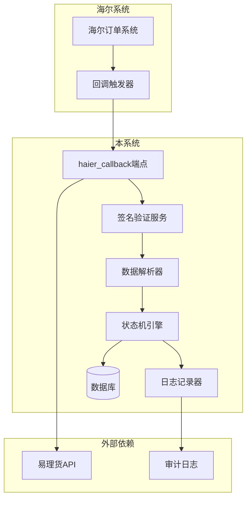
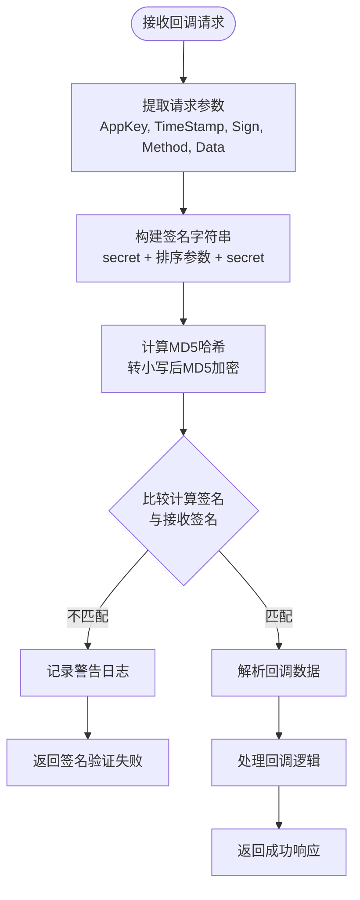
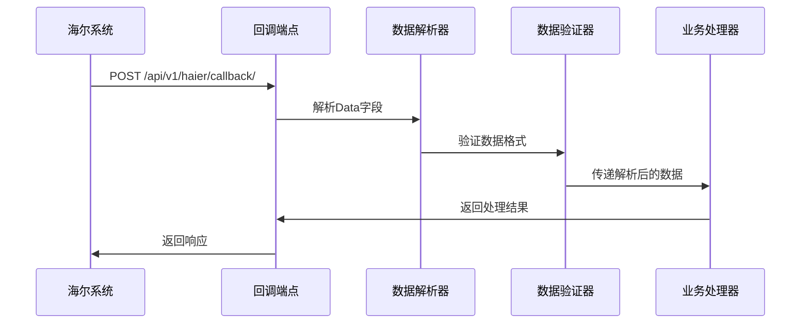
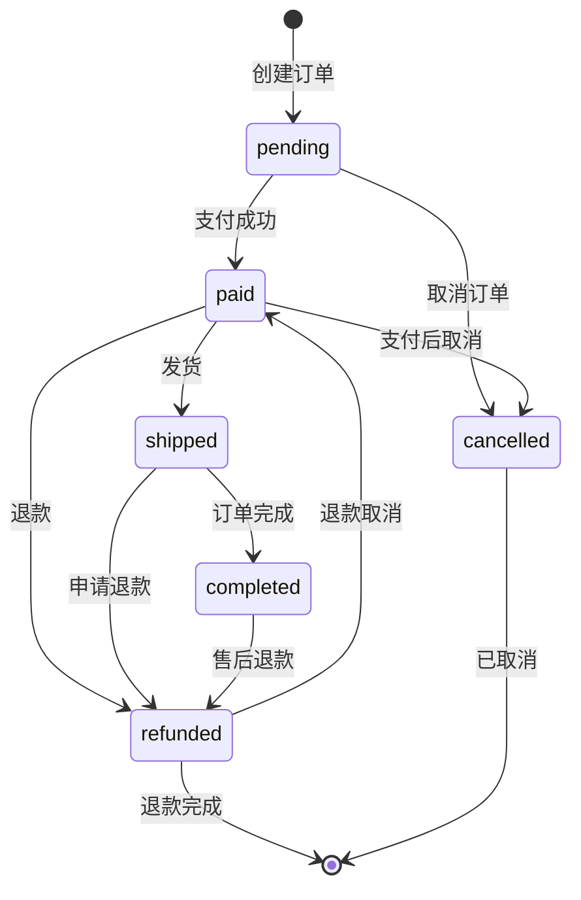
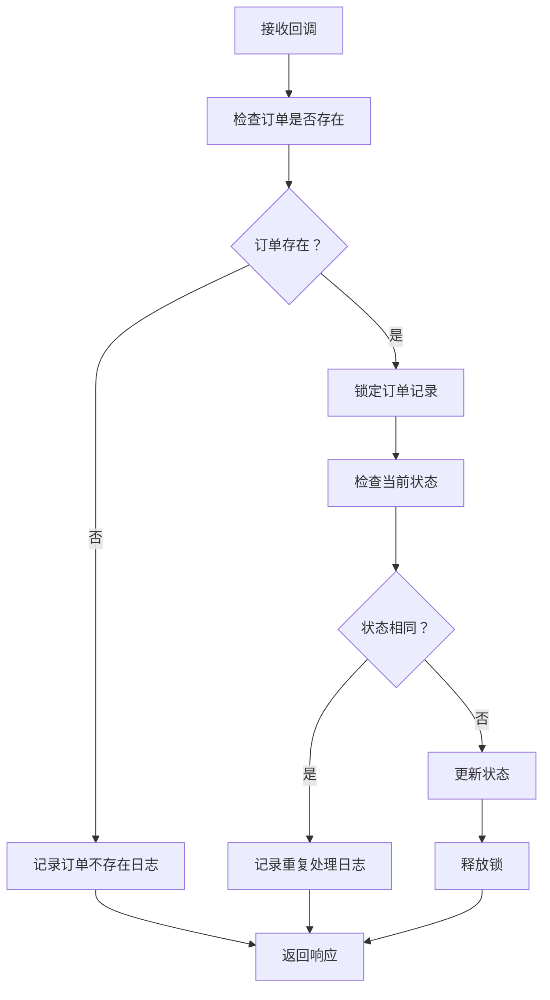
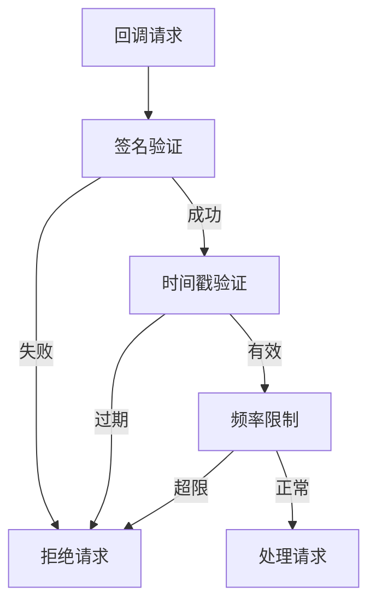

# 回调处理

<cite>
**本文档引用的文件**
- [backend/orders/views.py](file://backend/orders/views.py)
- [backend/orders/state_machine.py](file://backend/orders/state_machine.py)
- [backend/orders/models.py](file://backend/orders/models.py)
- [backend/integrations/views.py](file://backend/integrations/views.py)
- [backend/integrations/urls.py](file://backend/integrations/urls.py)
- [backend/integrations/haierapi.py](file://backend/integrations/haierapi.py)
- [backend/integrations/models.py](file://backend/integrations/models.py)
- [backend/common/audit_logger.py](file://backend/common/audit_logger.py)
- [backend/common/exceptions.py](file://backend/common/exceptions.py)
- [backend/backend/settings/base.py](file://backend/backend/settings/base.py)
- [haier_api.md](file://haier_api.md)
- [PRODUCT_ORDER_FULFILLMENT_GUIDE.md](file://PRODUCT_ORDER_FULFILLMENT_GUIDE.md)
</cite>

## 目录
1. [概述](#概述)
2. [系统架构](#系统架构)
3. [回调端点详解](#回调端点详解)
4. [签名验证机制](#签名验证机制)
5. [数据解密与解析](#数据解密与解析)
6. [状态机与状态转换](#状态机与状态转换)
7. [幂等性处理策略](#幂等性处理策略)
8. [日志记录规范](#日志记录规范)
9. [安全防护措施](#安全防护措施)
10. [边界情况处理](#边界情况处理)
11. [最佳实践](#最佳实践)

## 概述

海尔系统集成中的回调处理功能负责接收和处理来自海尔系统的订单状态回调，确保订单状态的准确同步和系统的安全性。该功能实现了完整的签名验证、数据解析、状态转换和日志记录机制。

### 核心功能特性

- **安全的回调接收**：基于MD5签名验证的回调接口
- **智能状态转换**：基于状态机的订单状态管理
- **幂等性保障**：防止重复处理和状态冲突
- **全面的日志记录**：完整的审计跟踪和问题排查
- **安全防护**：多重验证机制防止恶意请求

## 系统架构



**图表来源**
- [backend/orders/views.py](file://backend/orders/views.py#L549-L646)
- [backend/orders/state_machine.py](file://backend/orders/state_machine.py#L25-L289)

## 回调端点详解

### 端点配置

回调端点位于 `/api/v1/haier/callback/`，通过 `haier_callback` 视图函数处理。

### 请求格式

回调请求采用 `application/x-www-form-urlencoded` 格式，包含以下核心参数：

| 参数名 | 类型 | 必填 | 描述 |
|--------|------|------|------|
| AppKey | string | 是 | 应用密钥，用于标识调用方 |
| TimeStamp | string | 是 | 时间戳，用于防止重放攻击 |
| Sign | string | 是 | 签名，用于验证请求真实性 |
| Method | string | 是 | 方法名，固定为"OrderStatusChange" |
| Data | string | 是 | JSON格式的回调数据 |

### 响应格式

回调处理成功时返回标准响应格式：

```json
{
    "success": true,
    "code": "success",
    "description": "成功",
    "timeStamp": "timestamp",
    "data": {
        "statusCode": "200",
        "message": "成功",
        "platformOrderNo": "订单号"
    }
}
```

**章节来源**
- [backend/orders/views.py](file://backend/orders/views.py#L549-L646)

## 签名验证机制

### 验证流程



**图表来源**
- [backend/orders/views.py](file://backend/orders/views.py#L568-L598)

### 签名算法

签名生成遵循以下步骤：

1. **参数收集**：收集所有非签名参数（AppKey、TimeStamp、Method、Data）
2. **参数排序**：按字典顺序对参数名进行排序
3. **字符串拼接**：将参数名和值拼接成字符串
4. **添加密钥**：在字符串两端添加密钥
5. **哈希计算**：对最终字符串进行MD5加密并转为大写

### 密钥管理

系统使用配置项 `HAIER_CALLBACK_SECRET` 作为签名密钥，确保只有授权的海尔系统能够发起回调。

**章节来源**
- [backend/orders/views.py](file://backend/orders/views.py#L568-L598)

## 数据解密与解析

### 数据结构

回调数据采用JSON格式，包含以下关键字段：

```json
{
    "State": 1,                    // 状态：1成功/0失败
    "PlatformOrderNo": "1764050087579528",  // 客户平台订单号
    "ExtOrderNo": "HE20231125001",          // 海尔订单号
    "FailMsg": ""                  // 失败原因（可选）
}
```

### 解析流程



**图表来源**
- [backend/orders/views.py](file://backend/orders/views.py#L600-L611)

### 错误处理

数据解析过程包含以下错误处理机制：

- **格式验证**：确保Data字段为有效的JSON格式
- **字段完整性**：验证必需字段的存在性
- **类型检查**：确保字段类型符合预期

**章节来源**
- [backend/orders/views.py](file://backend/orders/views.py#L600-L611)

## 状态机与状态转换

### 状态定义

系统定义了完整的订单状态体系：



**图表来源**
- [backend/orders/state_machine.py](file://backend/orders/state_machine.py#L14-L57)

### 状态转换规则

状态机严格控制订单状态的转换路径，确保业务逻辑的正确性：

| 当前状态 | 允许转换到的状态 |
|----------|------------------|
| pending | paid, cancelled |
| paid | shipped, refunded, cancelled |
| shipped | completed, refunded |
| completed | refunded |
| refunded | paid, [*] |
| cancelled | [*] |

### 回调状态映射

海尔回调状态与系统状态的映射关系：

| 海尔状态 | 海尔状态码 | 系统状态 | 描述 |
|----------|------------|----------|------|
| 成功 | 1 | confirmed | 订单确认成功 |
| 失败 | 0 | failed | 订单确认失败 |

**章节来源**
- [backend/orders/state_machine.py](file://backend/orders/state_machine.py#L25-L289)
- [backend/orders/models.py](file://backend/orders/models.py#L130-L147)

## 幂等性处理策略

### 幂等性挑战

回调处理面临的主要幂等性挑战包括：

1. **重复回调**：同一订单多次收到相同状态
2. **网络重试**：系统重试导致的重复处理
3. **并发处理**：多个回调同时到达的情况

### 防护机制



**图表来源**
- [backend/orders/views.py](file://backend/orders/views.py#L612-L646)

### 实现细节

系统通过以下机制确保幂等性：

1. **订单存在性检查**：确保回调的目标订单确实存在
2. **状态比较**：避免重复更新相同状态
3. **事务保护**：使用数据库事务确保操作原子性
4. **并发控制**：通过数据库锁防止并发冲突

**章节来源**
- [backend/orders/views.py](file://backend/orders/views.py#L612-L646)

## 日志记录规范

### 日志级别分类

系统采用分级日志记录策略：

| 日志级别 | 用途 | 示例场景 |
|----------|------|----------|
| DEBUG | 详细调试信息 | 请求参数、内部处理流程 |
| INFO | 关键业务操作 | 回调处理成功、状态更新 |
| WARNING | 异常但可接受的情况 | 签名验证失败、重复回调 |
| ERROR | 错误情况 | 数据解析失败、数据库异常 |

### 审计日志

系统集成了专门的审计日志记录器，记录关键操作：

```python
# 审计日志示例
AuditLogger.log_order_updated(
    order_id=order.id,
    old_status=old_status,
    new_status=new_status,
    operator=operator,
    reason="海尔回调处理"
)
```

### 日志内容规范

每条日志包含以下关键信息：

- **时间戳**：精确到毫秒的时间标记
- **操作类型**：具体的业务操作描述
- **相关实体**：涉及的订单、用户等实体ID
- **上下文信息**：操作的详细参数和结果
- **错误信息**：异常情况下的详细错误描述

**章节来源**
- [backend/common/audit_logger.py](file://backend/common/audit_logger.py#L22-L347)

## 安全防护措施

### 防重放攻击

系统通过以下机制防止重放攻击：

1. **时间戳验证**：检查回调请求的时间戳是否在合理范围内
2. **唯一性约束**：确保相同内容的回调不会被重复处理
3. **签名时效性**：结合时间戳和签名确保请求的新鲜度

### 防恶意请求

多层次的安全验证机制：



**图表来源**
- [backend/orders/views.py](file://backend/orders/views.py#L568-L598)

### 数据保护

- **敏感信息脱敏**：日志中不记录完整的签名密钥
- **传输加密**：建议使用HTTPS传输回调数据
- **访问控制**：回调端点仅允许特定IP或域名访问

**章节来源**
- [backend/orders/views.py](file://backend/orders/views.py#L568-L598)

## 边界情况处理

### 订单不存在

当回调请求中的订单号不存在时：

```python
# 处理逻辑
try:
    order = Order.objects.get(order_number=callback_data['PlatformOrderNo'])
except Order.DoesNotExist:
    logger.warning(f'订单不存在: {callback_data.get("PlatformOrderNo")}')
    return Response({
        'success': False,
        'code': 'error',
        'description': '订单不存在',
        'timeStamp': timestamp,
    })
```

### 状态冲突

当系统状态与回调状态不一致时：

1. **状态比较**：检查当前状态与回调状态的差异
2. **冲突解决**：根据业务规则决定处理方式
3. **日志记录**：详细记录冲突情况和处理结果

### 网络异常

处理过程中可能出现的网络异常：

- **数据库连接失败**：重试机制和降级处理
- **外部API调用失败**：本地状态更新，后续补偿
- **超时处理**：设置合理的超时时间和重试策略

**章节来源**
- [backend/orders/views.py](file://backend/orders/views.py#L630-L646)

## 最佳实践

### 开发建议

1. **配置管理**：使用环境变量管理回调密钥和URL
2. **监控告警**：建立回调成功率和延迟的监控指标
3. **测试验证**：在开发环境中充分测试回调处理逻辑
4. **文档维护**：保持回调接口文档的及时更新

### 运维建议

1. **日志轮转**：定期清理和归档回调处理日志
2. **性能监控**：监控回调处理的响应时间和成功率
3. **容量规划**：根据回调流量预估系统资源需求
4. **故障恢复**：建立回调处理失败的自动恢复机制

### 安全建议

1. **密钥轮换**：定期更换回调签名密钥
2. **访问审计**：记录所有回调请求的访问日志
3. **网络安全**：限制回调端点的访问来源
4. **数据备份**：定期备份订单状态和回调记录

### 性能优化

1. **异步处理**：对于耗时的回调处理，考虑异步队列
2. **缓存策略**：缓存频繁查询的订单信息
3. **批量处理**：对于大量相似回调，考虑批量处理
4. **资源池化**：复用数据库连接和HTTP客户端

通过以上完善的回调处理功能，系统能够安全、可靠地处理来自海尔系统的订单状态回调，确保订单状态的准确同步和系统的稳定运行。