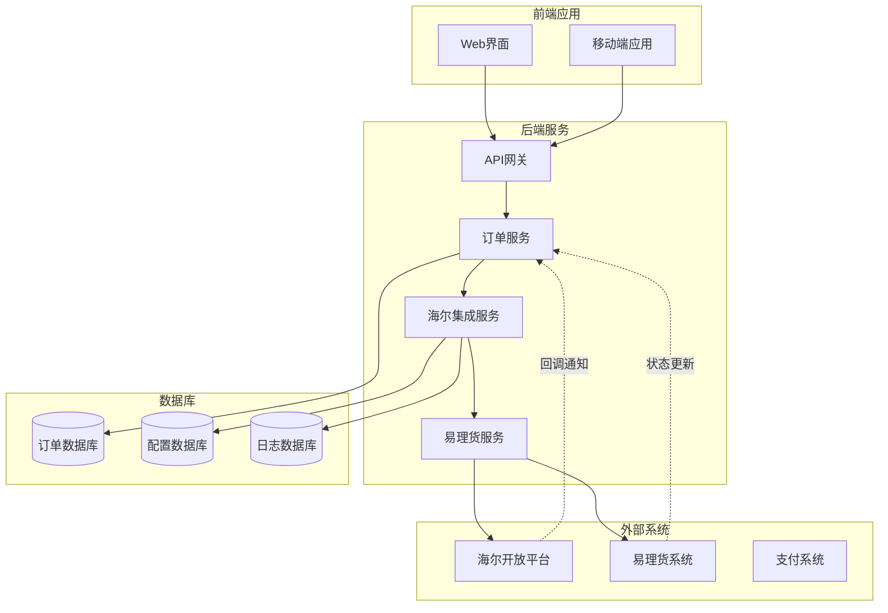
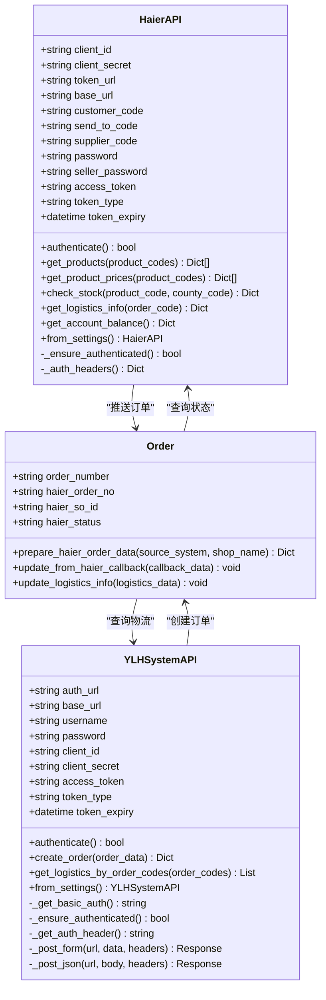
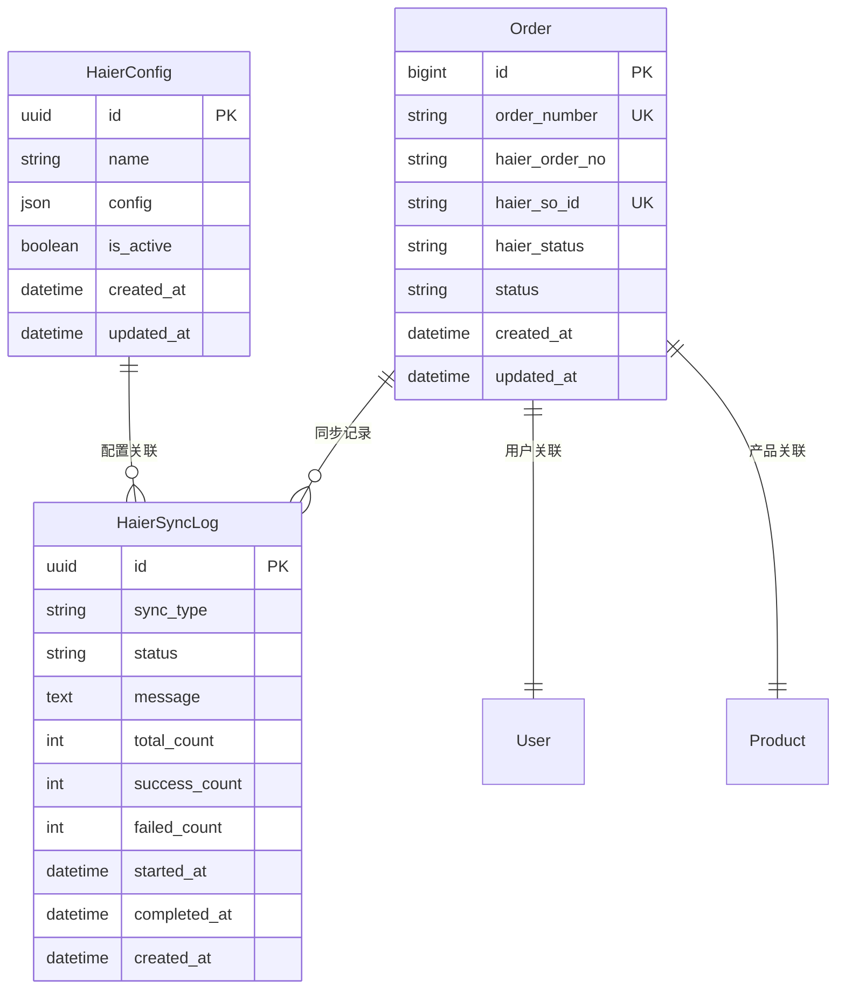
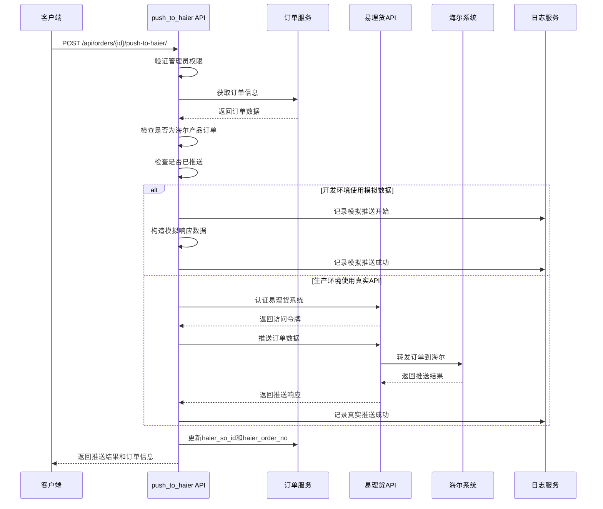
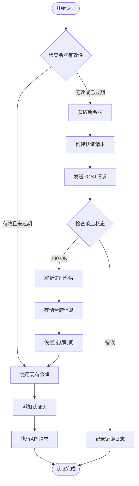
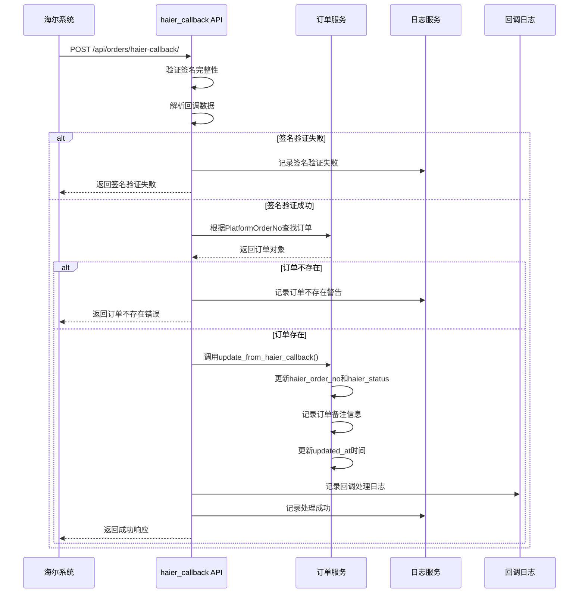
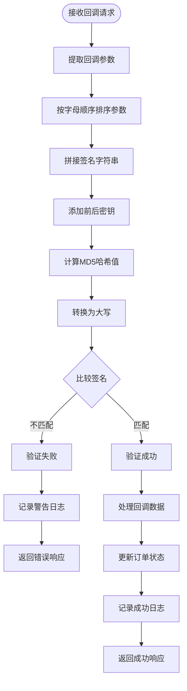
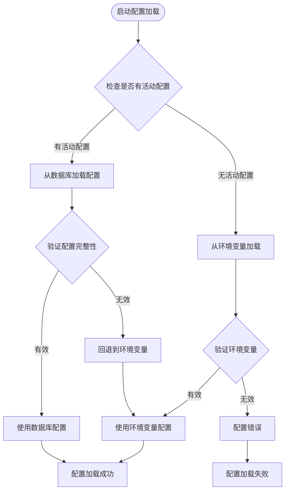
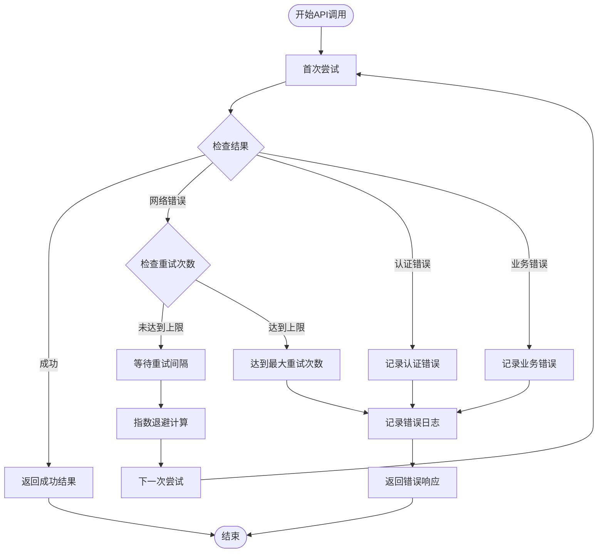
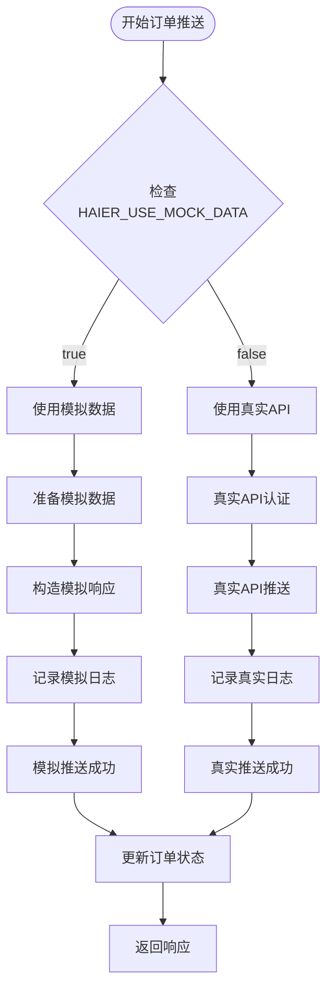

# 海尔系统集成

<cite>
**本文档引用的文件**
- [backend/integrations/haierapi.py](file://backend/integrations/haierapi.py)
- [backend/integrations/views.py](file://backend/integrations/views.py)
- [backend/integrations/models.py](file://backend/integrations/models.py)
- [backend/orders/models.py](file://backend/orders/models.py)
- [backend/orders/views.py](file://backend/orders/views.py)
- [backend/integrations/urls.py](file://backend/integrations/urls.py)
- [backend/integrations/serializers.py](file://backend/integrations/serializers.py)
- [backend/integrations/ylhapi.py](file://backend/integrations/ylhapi.py)
- [backend/backend/settings/base.py](file://backend/backend/settings/base.py)
</cite>

## 目录
1. [概述](#概述)
2. [系统架构](#系统架构)
3. [核心组件](#核心组件)
4. [订单推送流程](#订单推送流程)
5. [回调处理流程](#回调处理流程)
6. [配置管理](#配置管理)
7. [错误处理与重试策略](#错误处理与重试策略)
8. [开发环境与生产环境](#开发环境与生产环境)
9. [API接口文档](#api接口文档)
10. [最佳实践](#最佳实践)

## 概述

海尔系统集成模块提供了完整的海尔产品订单管理解决方案，包括订单推送、状态回调、库存查询、价格查询等功能。该系统通过标准化的API接口与海尔开放平台进行交互，支持实时订单状态同步和物流信息查询。

### 主要功能特性

- **订单推送**：将本地订单推送到海尔系统，支持模拟数据和真实API两种模式
- **状态回调**：接收海尔系统的订单状态变更通知，自动更新本地订单状态
- **库存查询**：实时查询海尔系统的商品库存信息
- **价格查询**：获取海尔商品的最新价格信息
- **物流跟踪**：查询订单在海尔系统的物流状态
- **余额查询**：监控海尔账户的可用余额

## 系统架构



**图表来源**
- [backend/orders/views.py](file://backend/orders/views.py#L379-L488)
- [backend/integrations/views.py](file://backend/integrations/views.py#L104-L327)

## 核心组件

### HaierAPI 类

HaierAPI 类是海尔系统的核心客户端，负责与海尔开放平台的所有交互。



**图表来源**
- [backend/integrations/haierapi.py](file://backend/integrations/haierapi.py#L10-L214)
- [backend/integrations/ylhapi.py](file://backend/integrations/ylhapi.py#L16-L459)
- [backend/orders/models.py](file://backend/orders/models.py#L128-L163)

### 数据模型



**图表来源**
- [backend/integrations/models.py](file://backend/integrations/models.py#L4-L150)
- [backend/orders/models.py](file://backend/orders/models.py#L13-L163)

**章节来源**
- [backend/integrations/haierapi.py](file://backend/integrations/haierapi.py#L10-L214)
- [backend/integrations/ylhapi.py](file://backend/integrations/ylhapi.py#L16-L200)
- [backend/orders/models.py](file://backend/orders/models.py#L13-L163)

## 订单推送流程

### push_to_haier API端点

push_to_haier 端点负责将本地订单推送到海尔系统，支持两种运行模式：开发环境使用模拟数据，生产环境使用真实API。



**图表来源**
- [backend/orders/views.py](file://backend/orders/views.py#L379-L488)

### 数据准备阶段

订单推送前需要准备符合海尔系统要求的数据格式：

| 字段名称 | 类型 | 描述 | 必填 | 示例值 |
|---------|------|------|------|--------|
| sourceSystem | string | 订单来源系统标识 | 是 | YOUR_SYSTEM |
| shopName | string | 店铺名称 | 是 | 默认店铺 |
| sellerCode | string | 客户八码 | 是 | 8800633175 |
| consigneeName | string | 收货人姓名 | 是 | 张三 |
| consigneeMobile | string | 收货人手机号 | 是 | 13800138000 |
| onlineNo | string | 平台订单号 | 是 | 20241201001 |
| soId | string | 子订单号 | 是 | 20241201001-12345 |
| remark | string | 备注信息 | 否 | 特殊要求说明 |
| totalQty | int | 订单总数量 | 是 | 1 |
| totalAmt | float | 订单总金额 | 是 | 2999.00 |
| createTime | int | 订单创建时间戳 | 是 | 1701417600000 |
| province | string | 省份 | 是 | 北京市 |
| city | string | 城市 | 是 | 北京市 |
| area | string | 区县 | 是 | 朝阳区 |
| detailAddress | string | 详细地址 | 是 | 望京SOHO T3 |
| distributionTime | int | 配送时间戳 | 否 | 1701417600000 |
| installTime | int | 安装时间戳 | 否 | 1701417600000 |
| governmentOrder | boolean | 是否国补订单 | 否 | false |
| deliveryInstall | string | 是否送装一体 | 是 | true |
| itemList | array | 订单明细列表 | 是 | [{}] |

### 认证机制

系统采用OAuth 2.0客户端凭据模式进行认证：



**图表来源**
- [backend/integrations/haierapi.py](file://backend/integrations/haierapi.py#L41-L64)
- [backend/integrations/ylhapi.py](file://backend/integrations/ylhapi.py#L71-L115)

**章节来源**
- [backend/orders/views.py](file://backend/orders/views.py#L379-L488)
- [backend/orders/models.py](file://backend/orders/models.py#L128-L163)

## 回调处理流程

### haier_callback 端点

haier_callback 端点接收海尔系统的订单状态回调，自动更新本地订单状态并记录处理结果。



**图表来源**
- [backend/orders/views.py](file://backend/orders/views.py#L548-L645)

### 回调数据结构

海尔系统回调数据的标准格式：

| 参数名称 | 类型 | 描述 | 必填 | 示例值 |
|---------|------|------|------|--------|
| State | int | 状态码：1成功/0失败 | 是 | 1 |
| PlatformOrderNo | string | 平台订单号 | 是 | 20241201001 |
| ExtOrderNo | string | 海尔订单号 | 否 | HE20231125001 |
| FailMsg | string | 失败原因（失败时） | 否 | 库存不足 |

### 签名验证机制

系统采用MD5签名验证确保回调数据的完整性和真实性：



**图表来源**
- [backend/orders/views.py](file://backend/orders/views.py#L568-L589)

**章节来源**
- [backend/orders/views.py](file://backend/orders/views.py#L548-L645)

## 配置管理

### HaierConfig 模型

HaierConfig 模型用于管理海尔API的配置信息，支持多个配置实例和动态切换。

| 字段名称 | 类型 | 描述 | 默认值 |
|---------|------|------|--------|
| name | CharField | 配置名称 | haier |
| config | JSONField | 配置信息（JSON格式） | {} |
| is_active | BooleanField | 是否启用 | True |
| created_at | DateTimeField | 创建时间 | 自动生成 |
| updated_at | DateTimeField | 更新时间 | 自动生成 |

### 配置参数详解

| 参数名称 | 类型 | 描述 | 必填 | 示例值 |
|---------|------|------|------|--------|
| client_id | string | OAuth客户端ID | 是 | your_client_id |
| client_secret | string | OAuth客户端密钥 | 是 | your_client_secret |
| token_url | string | 认证端点URL | 是 | https://openplat-test.haier.net/oauth2/auth |
| base_url | string | API基础URL | 是 | https://openplat-test.haier.net |
| customer_code | string | 客户编码 | 是 | 8800633175 |
| send_to_code | string | 发送给谁的编码 | 是 | 8800633175 |
| supplier_code | string | 供应商编码 | 否 | 1001 |
| password | string | 通用密码 | 是 | your_password |
| seller_password | string | 卖家密码 | 是 | your_password |
| customer_password | string | 客户密码 | 否 | your_password |

### 配置切换机制

系统支持多种配置加载方式：



**图表来源**
- [backend/integrations/views.py](file://backend/integrations/views.py#L122-L147)

**章节来源**
- [backend/integrations/models.py](file://backend/integrations/models.py#L4-L48)
- [backend/integrations/views.py](file://backend/integrations/views.py#L122-L147)

## 错误处理与重试策略

### 错误分类与处理

系统采用分层错误处理机制，针对不同类型的错误采取相应的处理策略：

| 错误类型 | 处理策略 | 重试次数 | 重试间隔 | 示例场景 |
|---------|---------|---------|---------|---------|
| 网络超时 | 重试 | 3次 | 1s, 2s, 4s | API请求超时 |
| 认证失败 | 不重试 | 0次 | N/A | 令牌过期 |
| 数据格式错误 | 不重试 | 0次 | N/A | 请求参数格式错误 |
| 业务逻辑错误 | 不重试 | 0次 | N/A | 订单状态不合法 |
| 系统内部错误 | 重试 | 2次 | 2s, 4s | 数据库连接失败 |

### 重试机制实现



**图表来源**
- [backend/integrations/ylhapi.py](file://backend/integrations/ylhapi.py#L142-L172)

### 异常处理策略

系统实现了全面的异常处理机制：

1. **网络异常处理**：捕获requests库的各种网络异常
2. **数据解析异常**：处理JSON解析和数据格式转换异常
3. **业务逻辑异常**：处理订单状态不合法等业务异常
4. **系统资源异常**：处理数据库连接、内存等系统资源异常

**章节来源**
- [backend/integrations/ylhapi.py](file://backend/integrations/ylhapi.py#L142-L172)
- [backend/orders/views.py](file://backend/orders/views.py#L480-L487)

## 开发环境与生产环境

### 环境配置差异

系统通过环境变量控制开发和生产环境的行为差异：

| 配置项 | 开发环境 | 生产环境 | 说明 |
|-------|---------|---------|------|
| HAIER_USE_MOCK_DATA | true | false | 是否使用模拟数据 |
| HAIER_CLIENT_ID | 测试ID | 正式ID | OAuth客户端ID |
| HAIER_TOKEN_URL | 测试认证URL | 正式认证URL | 认证端点 |
| HAIER_BASE_URL | 测试API URL | 正式API URL | API基础URL |
| YLH_AUTH_URL | 测试认证URL | 正式认证URL | 易理货认证URL |
| YLH_BASE_URL | 测试API URL | 正式API URL | 易理货API URL |

### 模拟数据机制

开发环境中使用模拟数据避免对外部系统造成影响：



**图表来源**
- [backend/orders/views.py](file://backend/orders/views.py#L419-L471)

### 环境切换指南

1. **开发环境**：
   - 设置 `HAIER_USE_MOCK_DATA=True`
   - 使用测试环境的API配置
   - 启用详细的调试日志

2. **测试环境**：
   - 设置 `HAIER_USE_MOCK_DATA=False`
   - 使用测试环境的API配置
   - 启用适当的日志级别

3. **生产环境**：
   - 设置 `HAIER_USE_MOCK_DATA=False`
   - 使用生产环境的API配置
   - 启用监控和告警

**章节来源**
- [backend/orders/views.py](file://backend/orders/views.py#L419-L471)
- [backend/backend/settings/base.py](file://backend/backend/settings/base.py#L1-L200)

## API接口文档

### 订单推送接口

#### push_to_haier

推送订单到海尔系统

**URL**: `POST /api/orders/{id}/push-to-haier/`

**权限**: 管理员

**请求参数**:
```json
{
  "source_system": "YOUR_SYSTEM",
  "shop_name": "默认店铺"
}
```

**响应**:
```json
{
  "detail": "订单推送成功",
  "order": {
    "id": 123,
    "order_number": "20241201001",
    "haier_so_id": "SO.20241201001-12345",
    "haier_order_no": "HE20241201001",
    "status": "paid"
  },
  "haier_response": {
    "success": true,
    "code": "success",
    "message": "订单推送成功",
    "data": {
      "retailOrderNo": "SO.20241201001",
      "soId": "SO.20241201001-12345",
      "status": "confirmed"
    }
  }
}
```

### 订单查询接口

#### haier_logistics

查询海尔订单物流信息

**URL**: `GET /api/orders/{id}/haier-logistics/`

**权限**: 订单所有者或管理员

**响应**:
```json
{
  "detail": "查询成功",
  "logistics_info": [
    {
      "logisticsCompany": "顺丰速运",
      "logisticsNo": "SF1234567890",
      "deliveryRecordCode": "DR20241201001",
      "snCode": "SN1234567890"
    }
  ]
}
```

### 海尔系统回调接口

#### haier_callback

接收海尔系统订单状态回调

**URL**: `POST /api/orders/haier-callback/`

**请求参数**:
```
AppKey: your_app_key
TimeStamp: 1701417600000
Sign: MD5签名
Method: OrderStatusChange
Data: JSON字符串
```

**回调数据示例**:
```json
{
  "State": 1,
  "PlatformOrderNo": "20241201001",
  "ExtOrderNo": "HE20241201001",
  "FailMsg": ""
}
```

**响应**:
```json
{
  "success": true,
  "code": "success",
  "description": "成功",
  "timeStamp": "1701417600000",
  "data": {
    "statusCode": "200",
    "message": "成功",
    "platformOrderNo": "20241201001"
  }
}
```

### 海尔API配置接口

#### HaierConfigViewSet

管理海尔API配置

**URL**: `/api/haier/config/`

**支持操作**:
- GET: 获取配置列表
- POST: 创建新配置
- GET: 获取指定配置详情
- PUT: 更新配置
- DELETE: 删除配置
- POST: 测试配置连接

**章节来源**
- [backend/orders/views.py](file://backend/orders/views.py#L379-L488)
- [backend/orders/views.py](file://backend/orders/views.py#L489-L547)
- [backend/orders/views.py](file://backend/orders/views.py#L548-L645)
- [backend/integrations/views.py](file://backend/integrations/views.py#L36-L101)

## 最佳实践

### 订单推送最佳实践

1. **前置检查**：
   - 确认订单为海尔产品
   - 检查订单是否已推送
   - 验证订单数据完整性

2. **错误处理**：
   - 实现重试机制
   - 记录详细的错误日志
   - 提供友好的错误提示

3. **性能优化**：
   - 批量处理订单推送
   - 使用异步任务处理
   - 实现缓存机制

### 回调处理最佳实践

1. **安全性**：
   - 严格验证签名
   - 防止重复处理
   - 记录回调日志

2. **可靠性**：
   - 实现幂等性处理
   - 提供重试机制
   - 监控处理成功率

3. **可观测性**：
   - 完整的日志记录
   - 性能指标监控
   - 异常告警机制

### 配置管理最佳实践

1. **安全配置**：
   - 敏感信息加密存储
   - 环境隔离配置
   - 权限最小化原则

2. **版本管理**：
   - 配置变更记录
   - 回滚机制
   - 测试验证

3. **监控告警**：
   - 连接状态监控
   - 响应时间监控
   - 错误率告警

### 开发调试最佳实践

1. **模拟数据使用**：
   - 开发环境使用模拟数据
   - 模拟各种错误场景
   - 验证边界条件

2. **日志记录**：
   - 结构化日志格式
   - 关键操作日志
   - 性能指标记录

3. **测试策略**：
   - 单元测试覆盖
   - 集成测试验证
   - 回归测试保障

通过遵循这些最佳实践，可以确保海尔系统集成的稳定性、可靠性和可维护性，为业务提供高质量的订单管理服务。