# 订单推送功能详细文档

<cite>
**本文档引用的文件**
- [backend/orders/views.py](file://backend/orders/views.py)
- [backend/orders/models.py](file://backend/orders/models.py)
- [backend/integrations/ylhapi.py](file://backend/integrations/ylhapi.py)
- [backend/integrations/haierapi.py](file://backend/integrations/haierapi.py)
- [backend/integrations/views.py](file://backend/integrations/views.py)
- [backend/integrations/models.py](file://backend/integrations/models.py)
- [backend/common/exceptions.py](file://backend/common/exceptions.py)
- [backend/common/logging_config.py](file://backend/common/logging_config.py)
- [backend/backend/settings/base.py](file://backend/backend/settings/base.py)
- [PRODUCT_ORDER_FULFILLMENT_GUIDE.md](file://PRODUCT_ORDER_FULFILLMENT_GUIDE.md)
</cite>

## 目录
1. [概述](#概述)
2. [系统架构](#系统架构)
3. [核心组件分析](#核心组件分析)
4. [数据准备与映射](#数据准备与映射)
5. [认证机制](#认证机制)
6. [API调用流程](#api调用流程)
7. [结果处理与状态更新](#结果处理与状态更新)
8. [开发环境与生产环境配置](#开发环境与生产环境配置)
9. [错误处理策略](#错误处理策略)
10. [重试机制](#重试机制)
11. [日志记录最佳实践](#日志记录最佳实践)
12. [故障排查指南](#故障排查指南)

## 概述

海尔系统集成中的订单推送功能是一个复杂的API集成系统，负责将本地订单数据转换为海尔系统所需的格式，并通过易理货系统API将订单推送到海尔平台。该功能支持开发环境的模拟数据推送和生产环境的真实API调用，具备完善的错误处理、重试机制和日志记录功能。

### 主要特性

- **双环境支持**：开发/测试环境使用模拟数据，生产环境使用真实API
- **智能数据映射**：自动将本地订单数据转换为海尔系统格式
- **多重认证**：支持海尔OAuth2认证和易理货系统独立认证
- **健壮的错误处理**：完善的异常捕获和错误恢复机制
- **全面的日志记录**：详细的API调用日志和操作审计
- **灵活的配置管理**：支持动态配置切换和环境隔离

## 系统架构

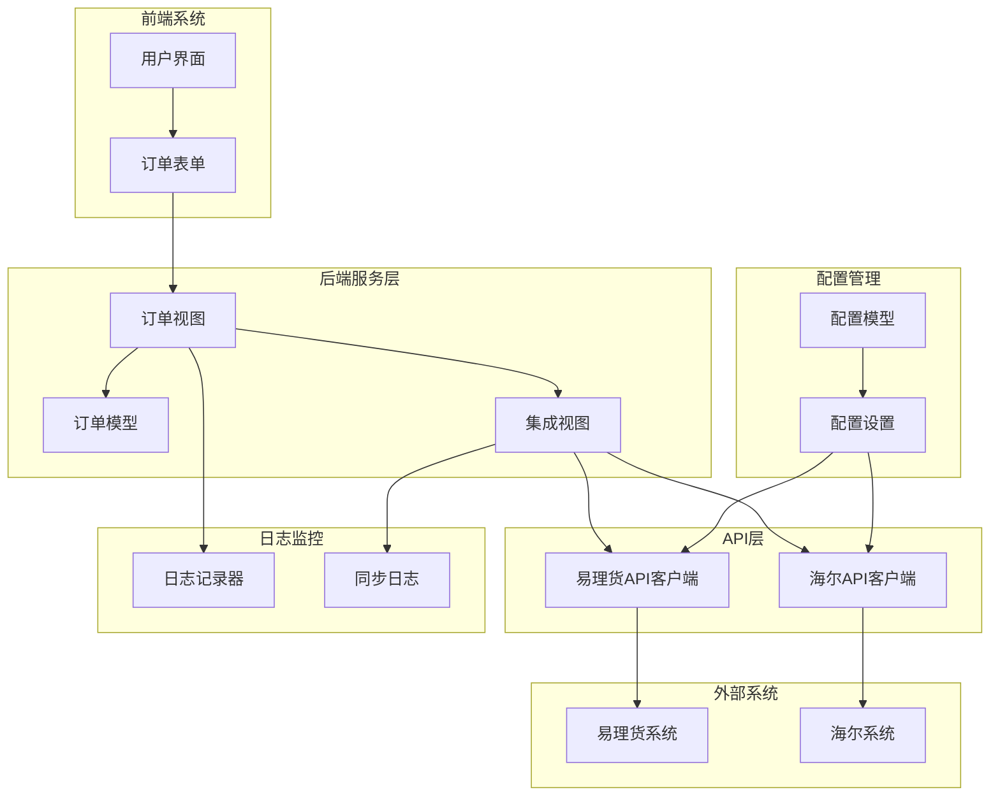

**图表来源**
- [backend/orders/views.py](file://backend/orders/views.py#L393-L489)
- [backend/integrations/views.py](file://backend/integrations/views.py#L104-L327)
- [backend/integrations/ylhapi.py](file://backend/integrations/ylhapi.py#L16-L459)

## 核心组件分析

### 订单推送控制器

订单推送功能的核心实现在`push_to_haier`方法中，该方法负责整个推送流程的协调和控制。

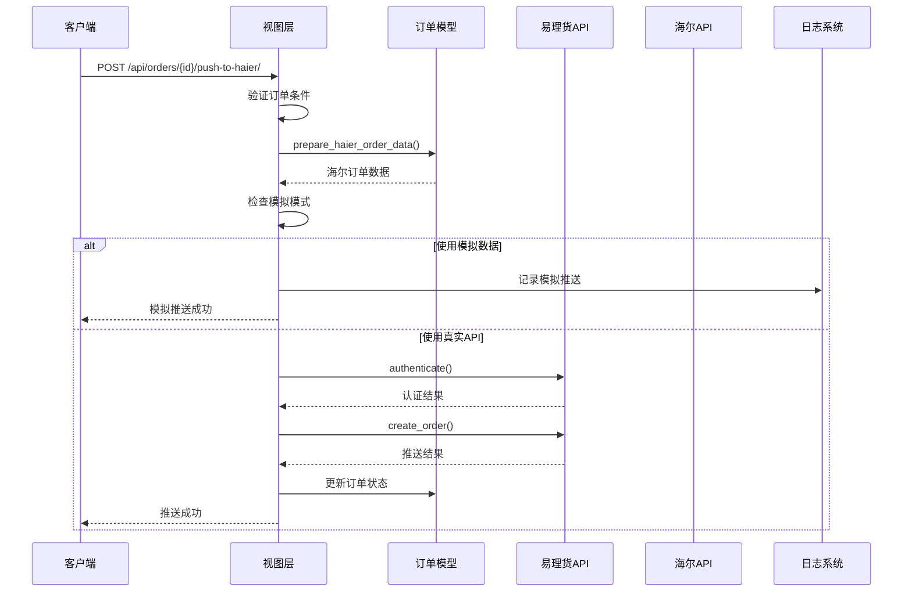

**图表来源**
- [backend/orders/views.py](file://backend/orders/views.py#L393-L489)

### 易理货API客户端

易理货API客户端实现了与海尔系统的直接通信，支持订单创建、取消、改约等操作。

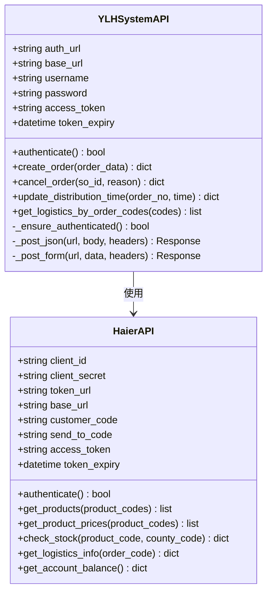

**图表来源**
- [backend/integrations/ylhapi.py](file://backend/integrations/ylhapi.py#L16-L459)
- [backend/integrations/haierapi.py](file://backend/integrations/haierapi.py#L10-L214)

**章节来源**
- [backend/orders/views.py](file://backend/orders/views.py#L393-L489)
- [backend/integrations/ylhapi.py](file://backend/integrations/ylhapi.py#L16-L459)
- [backend/integrations/haierapi.py](file://backend/integrations/haierapi.py#L10-L214)

## 数据准备与映射

### 订单数据准备流程

订单数据准备是推送过程中的关键步骤，负责将本地订单信息转换为海尔系统所需的格式。

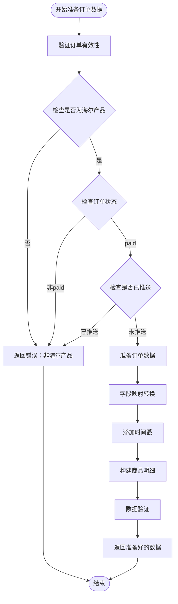

**图表来源**
- [backend/orders/views.py](file://backend/orders/views.py#L413-L417)
- [backend/orders/models.py](file://backend/orders/models.py#L86-L128)

### 字段映射规则

以下是本地订单字段到海尔系统字段的映射关系：

| 本地字段 | 海尔字段 | 类型 | 描述 | 转换规则 |
|---------|---------|------|------|---------|
| `snapshot_contact_name` | `consigneeName` | string | 收货人姓名 | 直接映射 |
| `snapshot_phone` | `consigneeMobile` | string | 收货人电话 | 直接映射 |
| `order_number` | `onlineNo` | string | 平台订单号 | 直接映射 |
| `haier_so_id` 或 `order_number-id` | `soId` | string | 子订单号 | 自动生成 |
| `note` | `remark` | string | 备注 | 直接映射 |
| `quantity` | `totalQty` | integer | 总数量 | 直接映射 |
| `total_amount` | `totalAmt` | float | 总金额 | 转换为浮点数 |
| `created_at` | `createTime` | timestamp | 创建时间 | 转换为毫秒时间戳 |
| `snapshot_province` | `province` | string | 省份 | 直接映射 |
| `snapshot_city` | `city` | string | 城市 | 直接映射 |
| `snapshot_district` | `area` | string | 区县 | 直接映射 |
| `snapshot_address` | `detailAddress` | string | 详细地址 | 直接映射 |
| `distribution_time` | `distributionTime` | timestamp | 配送时间 | 转换为毫秒时间戳 |
| `install_time` | `installTime` | timestamp | 安装时间 | 转换为毫秒时间戳 |
| `is_government_order` | `governmentOrder` | boolean | 是否国补订单 | 直接映射 |
| `is_delivery_install` | `deliveryInstall` | string | 送装一体 | 转换为小写字符串 |

**章节来源**
- [backend/orders/models.py](file://backend/orders/models.py#L86-L128)

## 认证机制

### 易理货系统认证

易理货系统采用独立的OAuth2认证机制，使用Basic认证头和密码授权类型。

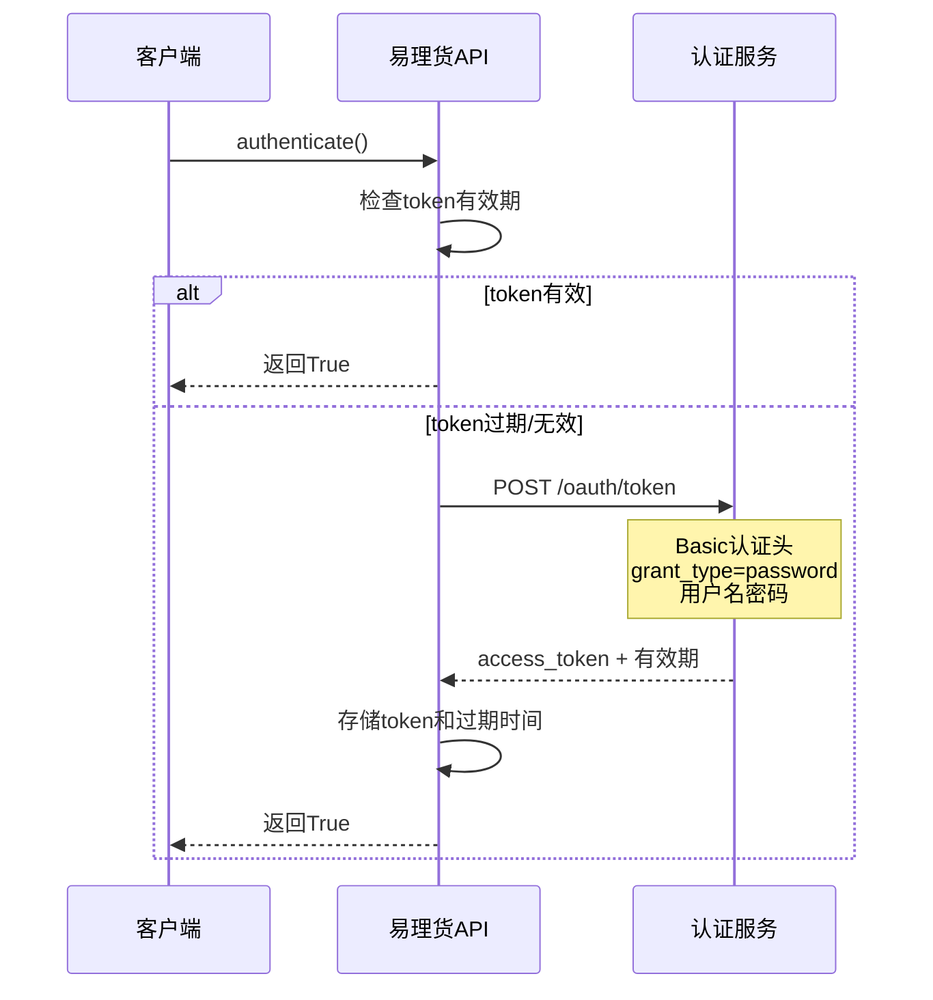

**图表来源**
- [backend/integrations/ylhapi.py](file://backend/integrations/ylhapi.py#L71-L115)

### 海尔系统认证

海尔系统使用标准的OAuth2客户端凭据授权模式。

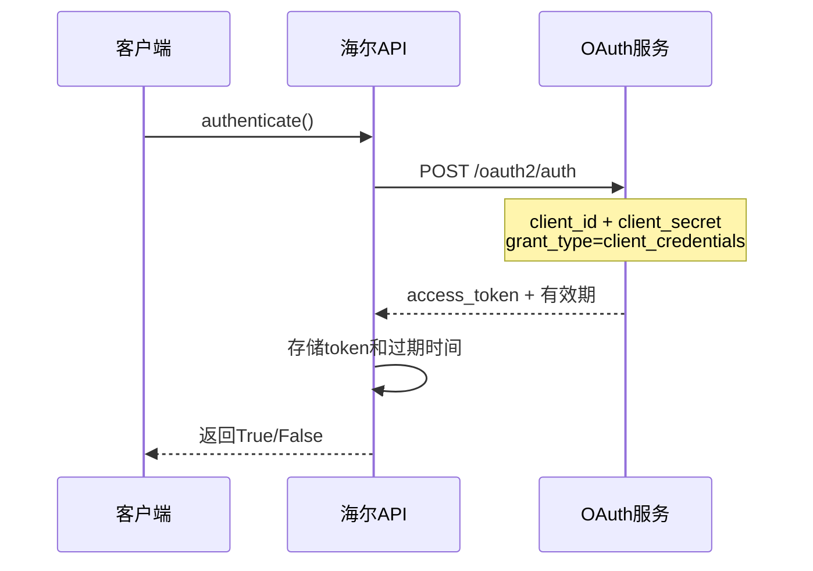

**图表来源**
- [backend/integrations/haierapi.py](file://backend/integrations/haierapi.py#L41-L64)

**章节来源**
- [backend/integrations/ylhapi.py](file://backend/integrations/ylhapi.py#L71-L115)
- [backend/integrations/haierapi.py](file://backend/integrations/haierapi.py#L41-L64)

## API调用流程

### 订单推送主流程

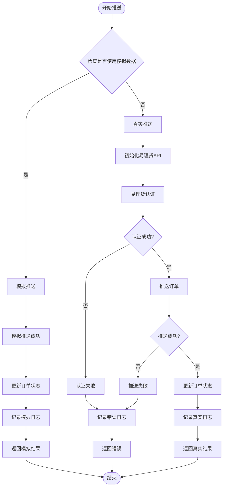

**图表来源**
- [backend/orders/views.py](file://backend/orders/views.py#L418-L489)

### API调用超时与重试

系统实现了智能的超时控制和指数退避重试机制：

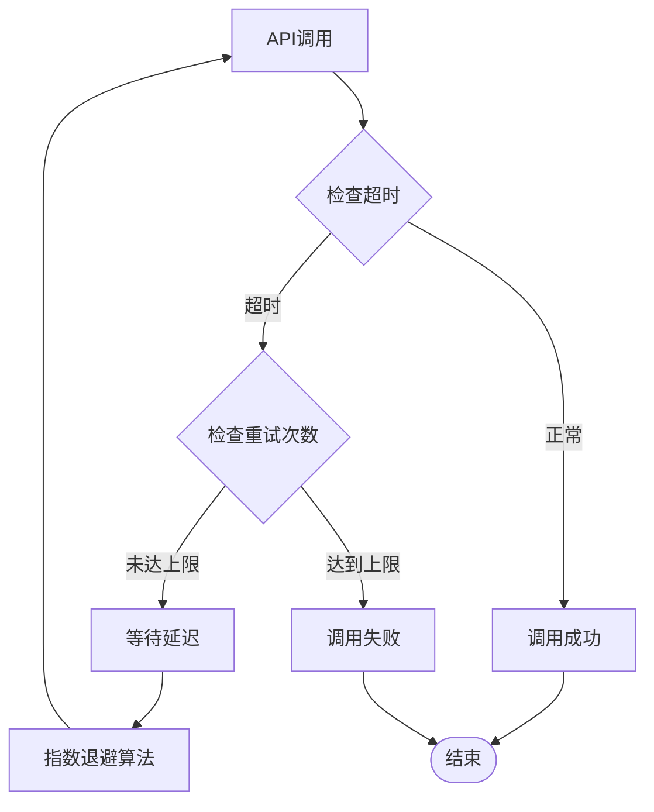

**图表来源**
- [backend/integrations/ylhapi.py](file://backend/integrations/ylhapi.py#L142-L172)

**章节来源**
- [backend/orders/views.py](file://backend/orders/views.py#L418-L489)
- [backend/integrations/ylhapi.py](file://backend/integrations/ylhapi.py#L142-L172)

## 结果处理与状态更新

### 订单状态更新机制

推送成功后，系统会根据返回结果更新订单状态和相关字段：

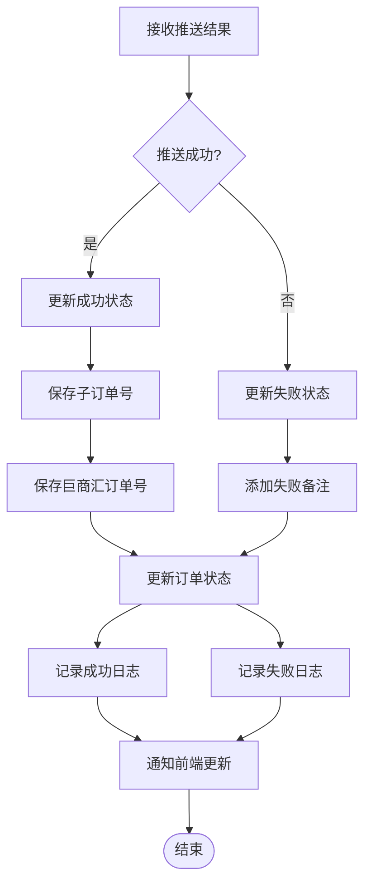

**图表来源**
- [backend/orders/views.py](file://backend/orders/views.py#L466-L478)
- [backend/orders/models.py](file://backend/orders/models.py#L130-L147)

### 海尔回调处理

系统还支持海尔回调通知，用于实时更新订单状态：

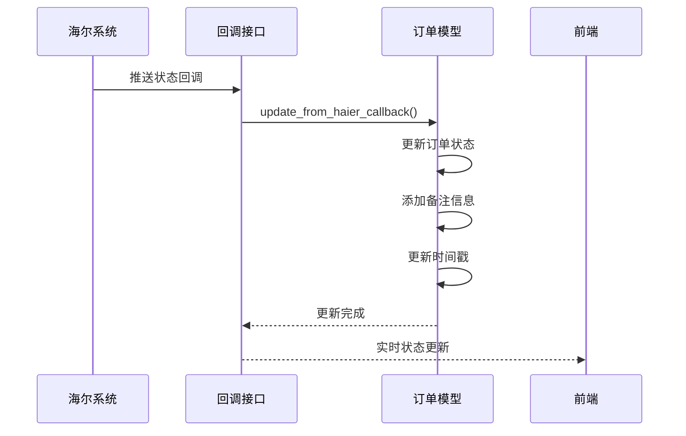

**图表来源**
- [backend/orders/models.py](file://backend/orders/models.py#L130-L147)

**章节来源**
- [backend/orders/views.py](file://backend/orders/views.py#L466-L478)
- [backend/orders/models.py](file://backend/orders/models.py#L130-L147)

## 开发环境与生产环境配置

### 环境配置切换机制

系统通过`HAIER_USE_MOCK_DATA`配置项实现开发和生产环境的自动切换：

| 配置项 | 开发环境 | 生产环境 | 说明 |
|--------|---------|---------|------|
| `HAIER_USE_MOCK_DATA` | `True` | `False` | 是否使用模拟数据 |
| `YLH_AUTH_URL` | `http://dev.ylhtest.com/...` | `https://prod.ylhtest.com/...` | 易理货认证地址 |
| `HAIER_TOKEN_URL` | `https://openplat-test.haier.net/oauth2/auth` | `https://openplat.haier.net/oauth2/auth` | 海尔认证地址 |
| `HAIER_BASE_URL` | `https://openplat-test.haier.net` | `https://openplat.haier.net` | 海尔API基础地址 |

### 配置管理

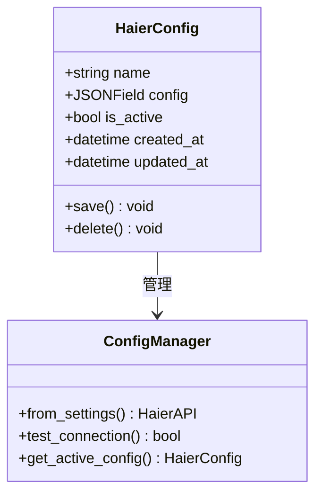

**图表来源**
- [backend/integrations/models.py](file://backend/integrations/models.py#L4-L47)
- [backend/integrations/views.py](file://backend/integrations/views.py#L122-L147)

**章节来源**
- [backend/backend/settings/base.py](file://backend/backend/settings/base.py#L235-L262)
- [backend/integrations/models.py](file://backend/integrations/models.py#L4-L47)
- [backend/integrations/views.py](file://backend/integrations/views.py#L122-L147)

## 错误处理策略

### 异常分类与处理

系统实现了分层的异常处理机制，涵盖网络异常、业务异常和系统异常：

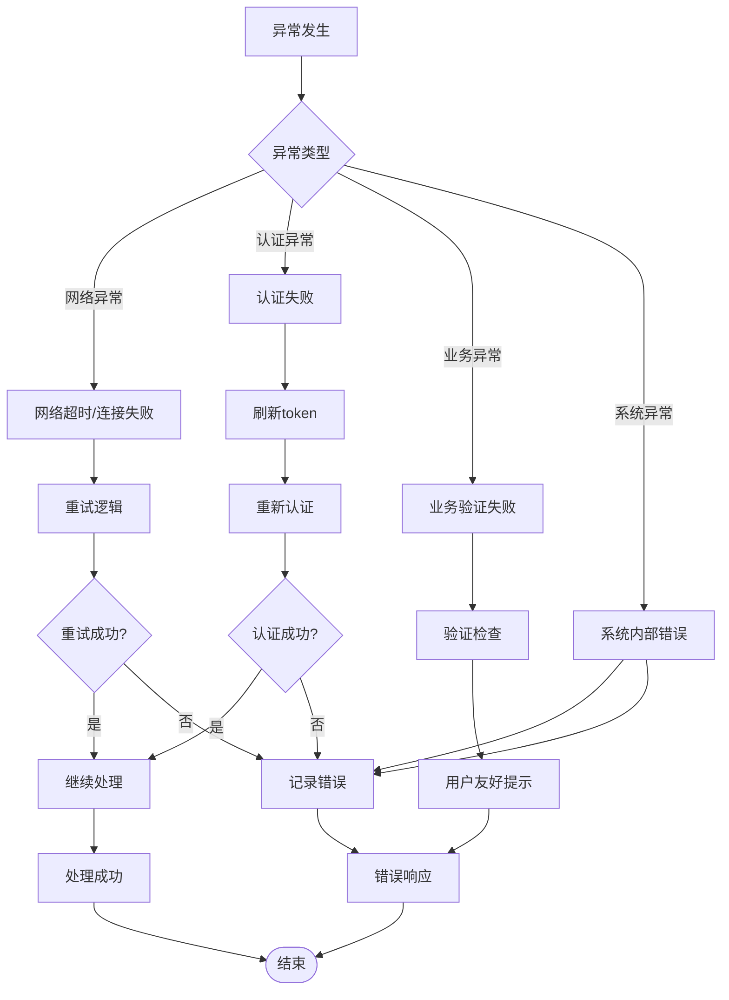

**图表来源**
- [backend/common/exceptions.py](file://backend/common/exceptions.py#L249-L503)

### 常见错误场景处理

| 错误类型 | HTTP状态码 | 处理策略 | 用户提示 |
|---------|-----------|---------|---------|
| 网络超时 | 504 | 重试3次，指数退避 | "网络连接超时，请稍后重试" |
| 认证失败 | 401 | 刷新token后重试 | "认证信息过期，请重新登录" |
| 订单已推送 | 400 | 直接返回错误 | "该订单已推送到海尔系统" |
| 非海尔产品 | 400 | 直接返回错误 | "该订单不是海尔产品订单" |
| 库存不足 | 400 | 直接返回错误 | "海尔产品库存不足" |
| 业务验证失败 | 400 | 返回具体验证错误 | "订单数据验证失败" |

**章节来源**
- [backend/common/exceptions.py](file://backend/common/exceptions.py#L249-L503)

## 重试机制

### 指数退避算法

系统采用指数退避算法实现智能重试：

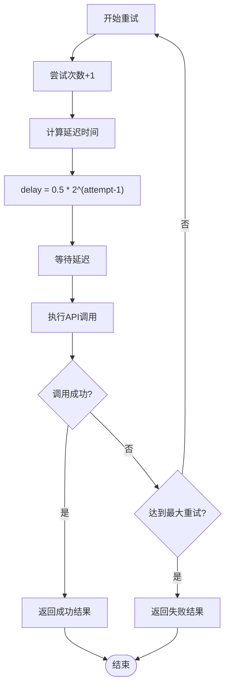

**图表来源**
- [backend/integrations/ylhapi.py](file://backend/integrations/ylhapi.py#L142-L172)

### 重试配置参数

| 参数 | 开发环境 | 生产环境 | 说明 |
|------|---------|---------|------|
| 最大重试次数 | 3 | 3 | 达到后放弃重试 |
| 基础延迟时间 | 0.5秒 | 0.5秒 | 第一次重试的基础等待时间 |
| 最大延迟时间 | 10秒 | 10秒 | 重试延迟的最大值 |
| 退避倍数 | 2 | 2 | 每次重试延迟翻倍 |

**章节来源**
- [backend/integrations/ylhapi.py](file://backend/integrations/ylhapi.py#L142-L172)

## 日志记录最佳实践

### 日志级别与分类

系统实现了分级的日志记录机制，涵盖调试、信息、警告和错误四个级别：

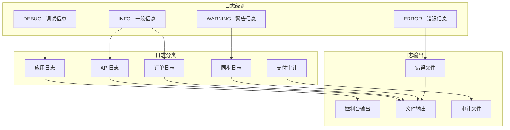

**图表来源**
- [backend/common/logging_config.py](file://backend/common/logging_config.py#L30-L285)

### 关键操作日志记录

系统在关键操作节点记录详细的操作日志：

| 操作类型 | 日志级别 | 记录内容 | 示例 |
|---------|---------|---------|------|
| 订单推送开始 | INFO | 订单ID、推送类型 | `"使用真实易理货API推送订单: order_id=123"` |
| 认证成功 | INFO | 认证结果、token信息 | `"YLH System authentication successful"` |
| 推送成功 | INFO | 推送结果、订单状态 | `"真实推送成功: order_id=123"` |
| 认证失败 | ERROR | 错误详情、响应信息 | `"YLH System authentication failed: 401 - Unauthorized"` |
| 推送失败 | ERROR | 失败原因、错误堆栈 | `"推送订单失败: network timeout"` |
| 模拟推送 | INFO | 模拟数据、推送结果 | `"使用模拟推送数据: order_id=123, so_id=SO.123"` |

**章节来源**
- [backend/common/logging_config.py](file://backend/common/logging_config.py#L30-L285)

## 故障排查指南

### 常见问题诊断

#### 1. 推送失败问题

**症状**：订单推送返回失败，但没有明确错误信息

**排查步骤**：
1. 检查订单状态是否为`paid`
2. 验证订单是否包含海尔产品
3. 确认订单是否已推送过
4. 检查API配置是否正确
5. 查看系统日志获取详细错误信息

**解决方案**：
- 更新订单状态为`paid`
- 确保订单关联正确的海尔产品
- 清除订单的`haier_so_id`字段
- 验证API配置的完整性

#### 2. 认证失败问题

**症状**：出现401认证错误

**排查步骤**：
1. 验证客户端ID和密钥是否正确
2. 检查token是否过期
3. 确认网络连接正常
4. 查看认证服务的可用性

**解决方案**：
- 更新API配置信息
- 手动刷新认证token
- 检查网络防火墙设置
- 联系系统管理员确认权限

#### 3. 网络超时问题

**症状**：API调用超时，响应缓慢

**排查步骤**：
1. 检查网络连接质量
2. 验证API服务端点可达性
3. 查看系统负载情况
4. 检查防火墙和代理设置

**解决方案**：
- 增加超时时间配置
- 优化网络路由
- 使用CDN加速服务
- 实施负载均衡

### 监控指标

系统提供了多个监控指标用于故障诊断：

| 指标类型 | 监控项目 | 正常范围 | 告警阈值 |
|---------|---------|---------|---------|
| 推送成功率 | 成功/总推送比例 | >95% | <90% |
| 平均响应时间 | API调用平均耗时 | <2秒 | >5秒 |
| 认证成功率 | 认证成功比例 | >98% | <95% |
| 错误率 | 错误请求比例 | <2% | >5% |
| 系统可用性 | 服务可用时间 | >99.5% | <99% |

### 性能优化建议

1. **缓存策略**：缓存认证token和常用API响应
2. **批量处理**：支持批量推送多个订单
3. **异步处理**：使用消息队列处理高并发推送
4. **连接池**：复用HTTP连接减少建立开销
5. **压缩传输**：启用gzip压缩减少传输数据量

**章节来源**
- [backend/common/exceptions.py](file://backend/common/exceptions.py#L249-L503)
- [backend/common/logging_config.py](file://backend/common/logging_config.py#L30-L285)