# 订单API详细文档

<cite>
**本文档引用的文件**
- [backend/orders/views.py](file://backend/orders/views.py)
- [backend/orders/models.py](file://backend/orders/models.py)
- [backend/orders/state_machine.py](file://backend/orders/state_machine.py)
- [backend/orders/serializers.py](file://backend/orders/serializers.py)
- [backend/orders/services.py](file://backend/orders/services.py)
- [backend/orders/analytics.py](file://backend/orders/analytics.py)
- [backend/orders/payment_service.py](file://backend/orders/payment_service.py)
- [backend/orders/urls.py](file://backend/orders/urls.py)
- [frontend/src/services/order.ts](file://frontend/src/services/order.ts)
- [frontend/src/pages/order-detail/index.tsx](file://frontend/src/pages/order-detail/index.tsx)
- [merchant/src/pages/Orders/index.tsx](file://merchant/src/pages/Orders/index.tsx)
</cite>

## 目录
1. [概述](#概述)
2. [项目结构](#项目结构)
3. [核心组件](#核心组件)
4. [架构概览](#架构概览)
5. [详细组件分析](#详细组件分析)
6. [依赖关系分析](#依赖关系分析)
7. [性能考虑](#性能考虑)
8. [故障排除指南](#故障排除指南)
9. [结论](#结论)

## 概述

本文档详细介绍了电商小程序项目的订单API系统，重点涵盖订单创建、管理和状态流转功能。该系统采用Django REST Framework构建，实现了完整的订单生命周期管理，包括库存锁定、支付记录创建、订单快照生成和状态机驱动的状态转换。

订单系统的核心特性包括：
- **状态机驱动的状态管理**：严格的订单状态转换规则确保数据一致性
- **权限控制机制**：普通用户仅可见自身订单，管理员可见全部
- **库存管理**：智能库存锁定和释放机制
- **支付集成**：完整的支付流程和回调处理
- **海尔系统集成**：专门的海尔产品订单处理和推送

## 项目结构

订单模块采用清晰的分层架构，主要包含以下核心文件：

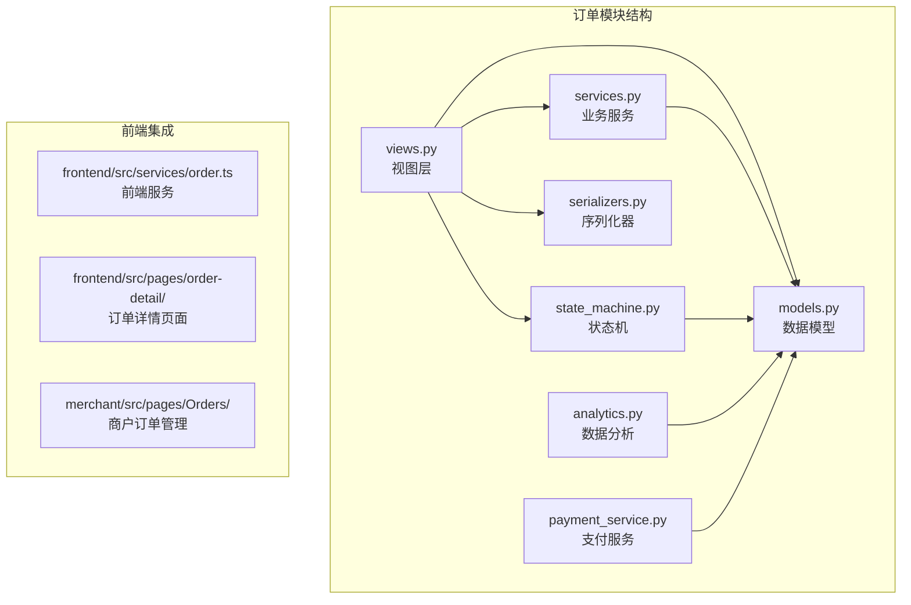

**图表来源**
- [backend/orders/views.py](file://backend/orders/views.py#L1-L50)
- [backend/orders/models.py](file://backend/orders/models.py#L1-L50)
- [backend/orders/state_machine.py](file://backend/orders/state_machine.py#L1-L50)

**章节来源**
- [backend/orders/views.py](file://backend/orders/views.py#L1-L100)
- [backend/orders/models.py](file://backend/orders/models.py#L1-L100)

## 核心组件

### 订单模型（Order）

订单模型是整个系统的核心，定义了订单的完整生命周期和状态管理：

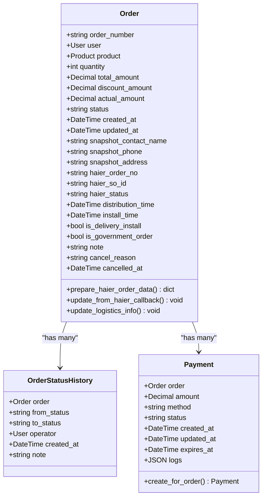

**图表来源**
- [backend/orders/models.py](file://backend/orders/models.py#L13-L164)
- [backend/orders/models.py](file://backend/orders/models.py#L291-L322)

### 订单状态机

状态机模块实现了严格的订单状态转换规则，确保业务逻辑的正确性：

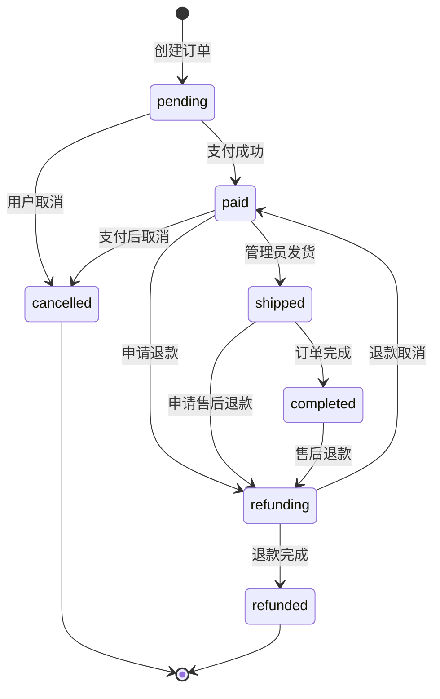

**图表来源**
- [backend/orders/state_machine.py](file://backend/orders/state_machine.py#L33-L56)

**章节来源**
- [backend/orders/models.py](file://backend/orders/models.py#L13-L164)
- [backend/orders/state_machine.py](file://backend/orders/state_machine.py#L1-L100)

## 架构概览

订单系统采用RESTful API设计，遵循Django REST Framework的最佳实践：

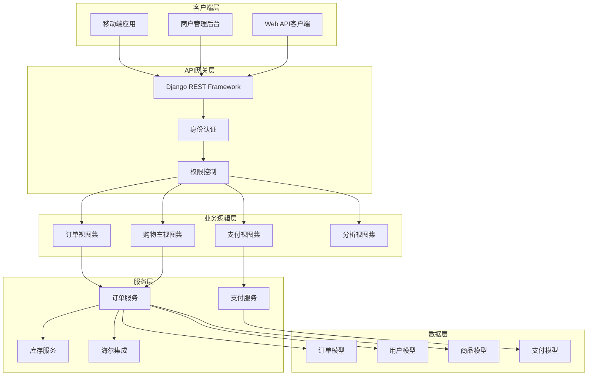

**图表来源**
- [backend/orders/views.py](file://backend/orders/views.py#L23-L50)
- [backend/orders/urls.py](file://backend/orders/urls.py#L1-L16)

## 详细组件分析

### 订单创建流程

订单创建是系统的核心入口，涉及多个步骤的协调工作：

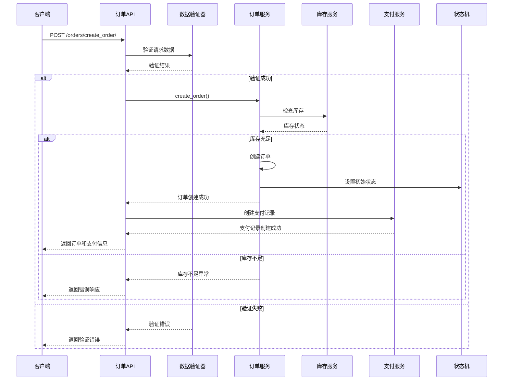

**图表来源**
- [backend/orders/views.py](file://backend/orders/views.py#L136-L217)
- [backend/orders/services.py](file://backend/orders/services.py#L219-L297)

#### 库存锁定机制

系统实现了智能的库存锁定机制，确保订单创建过程中的数据一致性：

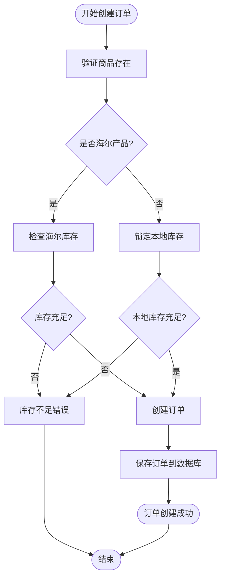

**图表来源**
- [backend/orders/services.py](file://backend/orders/services.py#L219-L297)

**章节来源**
- [backend/orders/views.py](file://backend/orders/views.py#L136-L217)
- [backend/orders/services.py](file://backend/orders/services.py#L219-L297)

### 订单状态管理

订单状态管理是系统的核心业务逻辑，通过状态机确保状态转换的合法性：

#### 状态转换规则

系统定义了严格的状态转换规则，防止非法状态转换：

| 当前状态 | 允许转换到的状态 | 说明 |
|---------|----------------|------|
| pending | paid, cancelled | 支付成功或取消订单 |
| paid | shipped, refunding, cancelled | 发货、申请退款或支付后取消 |
| shipped | completed, refunding | 订单完成或申请售后退款 |
| completed | refunding | 售后退款 |
| refunding | refunded, paid | 退款完成或退款取消 |
| cancelled | 无 | 不允许转换 |
| refunded | 无 | 不允许转换 |

#### 状态转换业务逻辑

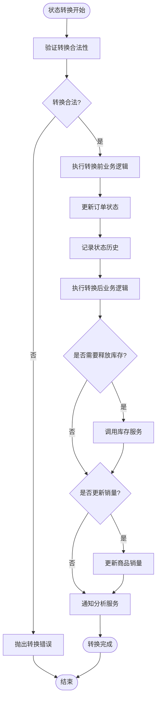

**图表来源**
- [backend/orders/state_machine.py](file://backend/orders/state_machine.py#L96-L154)

**章节来源**
- [backend/orders/state_machine.py](file://backend/orders/state_machine.py#L33-L154)

### 权限控制机制

系统实现了细粒度的权限控制，确保数据安全：

#### 用户权限层次

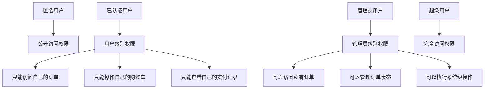

**图表来源**
- [backend/orders/views.py](file://backend/orders/views.py#L31-L33)

#### 查询权限控制

订单列表查询实现了智能的权限过滤：

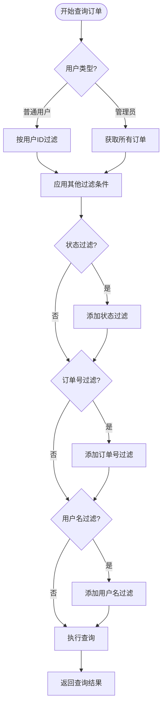

**图表来源**
- [backend/orders/views.py](file://backend/orders/views.py#L35-L96)

**章节来源**
- [backend/orders/views.py](file://backend/orders/views.py#L31-L96)

### 支付集成

支付系统提供了完整的支付流程，包括支付创建、回调处理和状态同步：

#### 支付流程

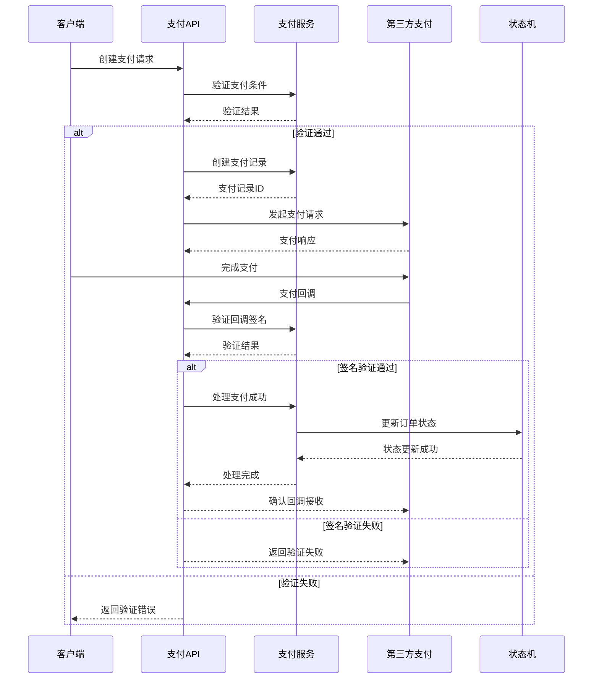

**图表来源**
- [backend/orders/payment_service.py](file://backend/orders/payment_service.py#L106-L204)

**章节来源**
- [backend/orders/payment_service.py](file://backend/orders/payment_service.py#L1-L292)

### 海尔系统集成

对于海尔产品，系统提供了专门的集成方案：

#### 海尔订单推送流程

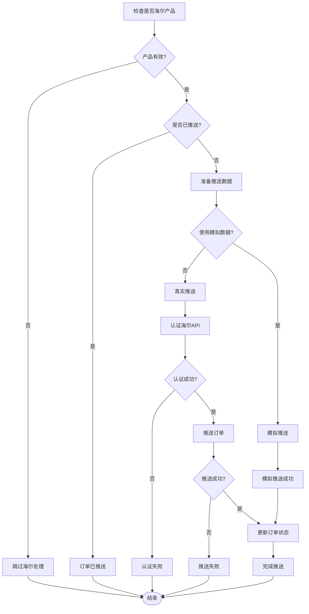

**图表来源**
- [backend/orders/views.py](file://backend/orders/views.py#L379-L478)

**章节来源**
- [backend/orders/views.py](file://backend/orders/views.py#L379-L478)

### 订单状态历史查询

系统提供了完整的订单状态历史查询功能：

#### 状态历史数据结构

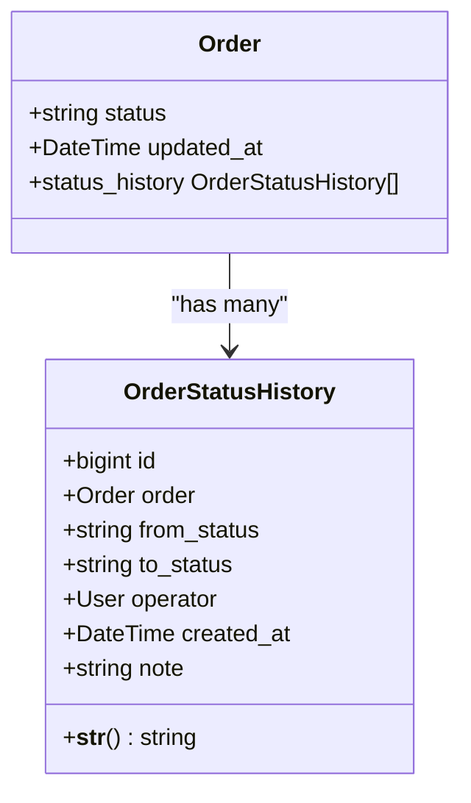

**图表来源**
- [backend/orders/models.py](file://backend/orders/models.py#L291-L322)

#### 状态历史查询方法

系统通过多种方式提供状态历史查询：

1. **订单详情查询**：通过订单关联查询状态历史
2. **状态历史API**：独立的状态历史查询接口
3. **分析报表**：基于状态历史的数据分析

**章节来源**
- [backend/orders/models.py](file://backend/orders/models.py#L291-L322)
- [backend/orders/state_machine.py](file://backend/orders/state_machine.py#L136-L144)

## 依赖关系分析

订单系统的依赖关系体现了清晰的分层架构：

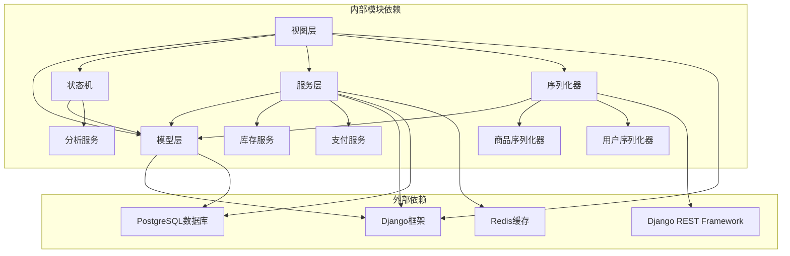

**图表来源**
- [backend/orders/views.py](file://backend/orders/views.py#L1-L20)
- [backend/orders/models.py](file://backend/orders/models.py#L1-L20)

**章节来源**
- [backend/orders/views.py](file://backend/orders/views.py#L1-L50)
- [backend/orders/models.py](file://backend/orders/models.py#L1-L50)

## 性能考虑

### 查询优化

系统采用了多种查询优化策略：

1. **预取查询（Prefetch Related）**：减少数据库查询次数
2. **索引优化**：为常用查询字段建立索引
3. **缓存策略**：使用Redis缓存频繁访问的数据
4. **分页处理**：大数据量查询使用分页

### 并发控制

1. **数据库事务**：确保数据一致性
2. **行级锁**：库存操作使用select_for_update
3. **幂等性设计**：防止重复操作

### 缓存策略

系统实现了多层次的缓存策略：

- **查询结果缓存**：订单列表、统计数据等
- **计算结果缓存**：折扣计算、价格计算等
- **会话缓存**：用户购物车、临时数据等

## 故障排除指南

### 常见问题及解决方案

#### 订单创建失败

**问题症状**：创建订单时返回库存不足或创建失败

**排查步骤**：
1. 检查商品库存是否充足
2. 验证用户权限和地址有效性
3. 检查系统日志中的具体错误信息
4. 确认数据库连接状态

**解决方案**：
- 更新商品库存信息
- 验证用户地址数据完整性
- 检查数据库事务状态

#### 支付回调失败

**问题症状**：支付成功但订单状态未更新

**排查步骤**：
1. 检查回调签名验证
2. 验证支付金额一致性
3. 检查状态机转换逻辑
4. 查看支付服务日志

**解决方案**：
- 修复签名验证逻辑
- 调整金额比较精度
- 重新触发状态转换

#### 状态转换异常

**问题症状**：订单状态无法正常转换

**排查步骤**：
1. 检查当前订单状态
2. 验证目标状态是否合法
3. 查看状态历史记录
4. 检查业务逻辑约束

**解决方案**：
- 确认状态转换规则
- 修复业务逻辑约束
- 手动修正状态（谨慎操作）

**章节来源**
- [backend/orders/services.py](file://backend/orders/services.py#L219-L297)
- [backend/orders/payment_service.py](file://backend/orders/payment_service.py#L106-L204)
- [backend/orders/state_machine.py](file://backend/orders/state_machine.py#L118-L124)

## 结论

本文档详细介绍了电商小程序项目的订单API系统，涵盖了从订单创建到状态管理的完整流程。系统采用模块化设计，通过状态机确保业务逻辑的正确性，通过权限控制保障数据安全，并通过多种优化策略提升系统性能。

### 主要特点

1. **完整的订单生命周期管理**：从创建到完成的全流程支持
2. **严格的状态控制**：通过状态机确保数据一致性
3. **灵活的权限体系**：支持多层级的权限控制
4. **完善的集成能力**：支持第三方支付和海尔系统集成
5. **高性能的设计**：采用多种优化策略提升系统性能

### 最佳实践建议

1. **监控和告警**：建立完善的监控体系，及时发现和处理异常
2. **定期维护**：定期清理过期订单和历史数据
3. **安全加固**：加强支付回调的安全验证
4. **性能优化**：持续优化查询性能和缓存策略
5. **文档更新**：保持文档与代码同步更新

该订单系统为电商应用提供了稳定可靠的订单管理基础，能够满足现代电商平台的各种业务需求。