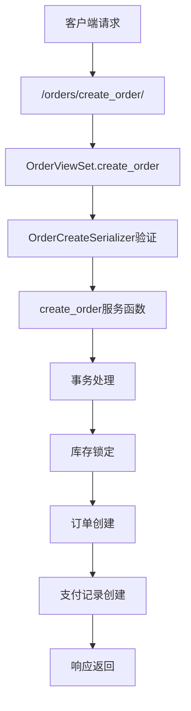
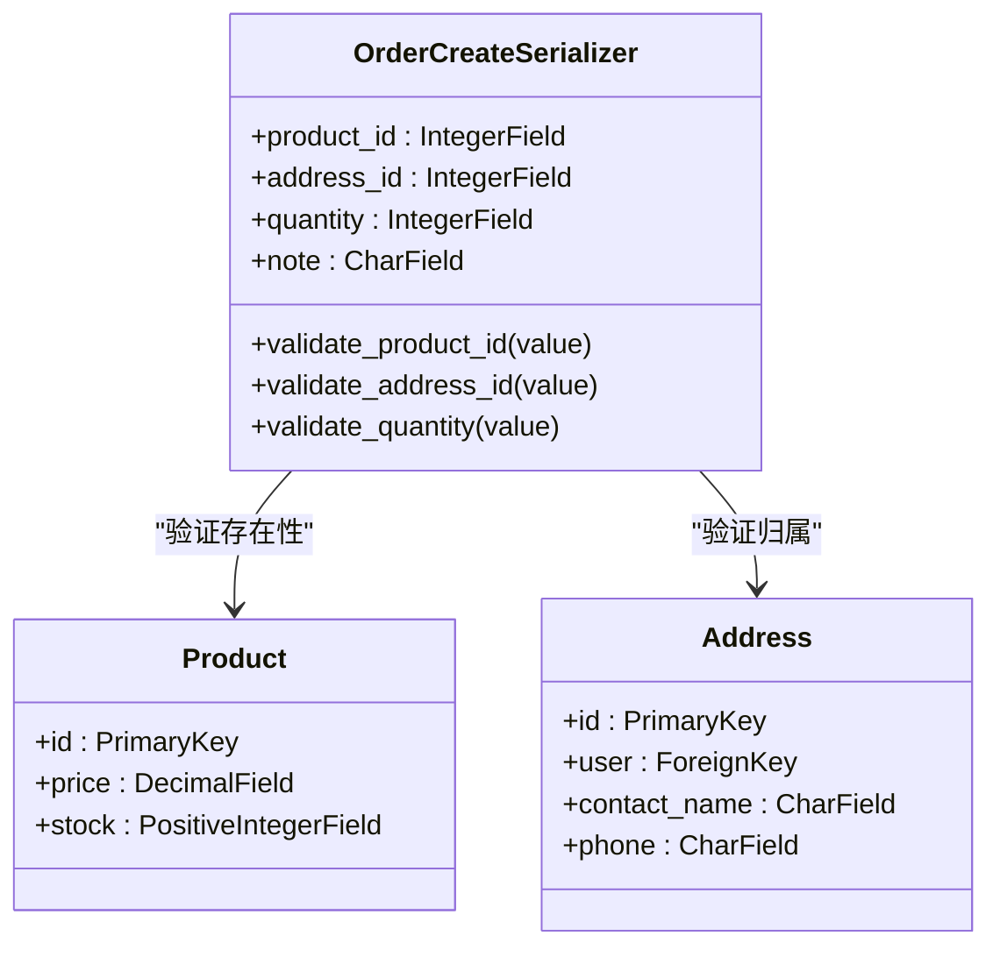
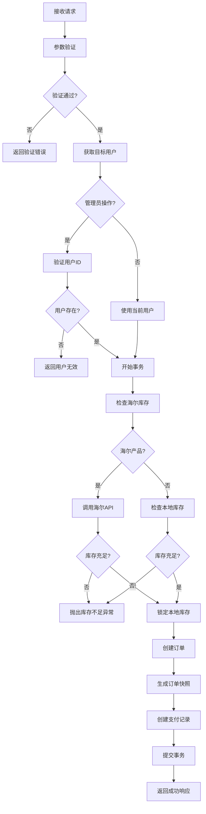
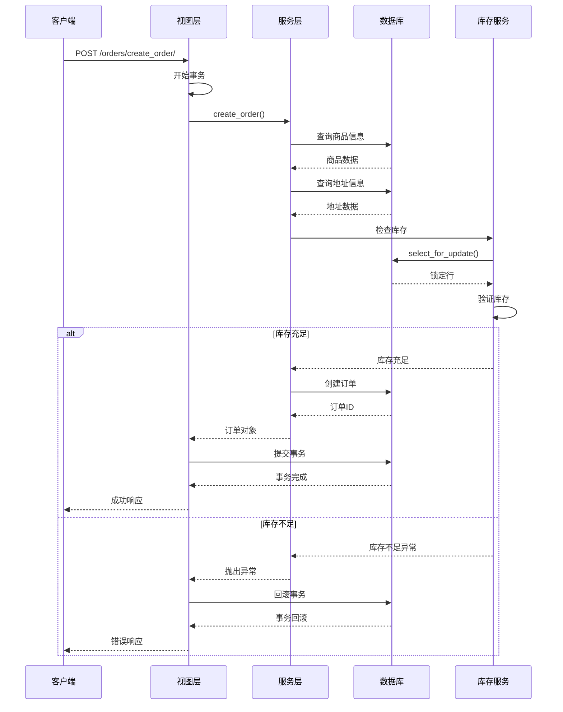
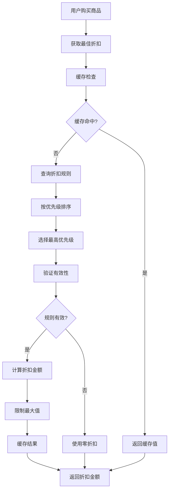
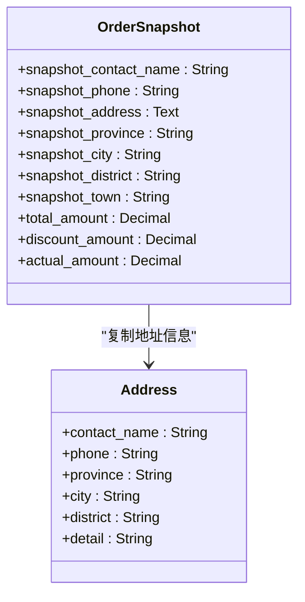
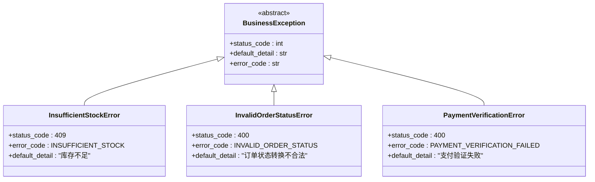

# 单个订单创建功能详细文档

<cite>
**本文档引用的文件**
- [backend/orders/views.py](file://backend/orders/views.py)
- [backend/orders/models.py](file://backend/orders/models.py)
- [backend/orders/serializers.py](file://backend/orders/serializers.py)
- [backend/orders/services.py](file://backend/orders/services.py)
- [backend/orders/state_machine.py](file://backend/orders/state_machine.py)
- [backend/common/exceptions.py](file://backend/common/exceptions.py)
- [backend/orders/urls.py](file://backend/orders/urls.py)
- [frontend/src/services/order.ts](file://frontend/src/services/order.ts)
</cite>

## 目录
1. [概述](#概述)
2. [API端点架构](#api端点架构)
3. [请求参数验证](#请求参数验证)
4. [业务逻辑流程](#业务逻辑流程)
5. [事务处理机制](#事务处理机制)
6. [折扣计算与价格计算](#折扣计算与价格计算)
7. [订单快照生成](#订单快照生成)
8. [错误处理机制](#错误处理机制)
9. [使用场景与示例](#使用场景与示例)
10. [性能优化考虑](#性能优化考虑)

## 概述

单个订单创建功能是电商平台的核心业务模块，负责处理用户通过API创建单个商品订单的完整流程。该功能通过`create_order` API端点实现，支持商品购买、地址验证、库存检查、折扣计算、价格计算和支付准备等关键业务逻辑。

### 核心特性

- **实时库存检查**：支持本地库存和海尔系统库存的双重验证
- **智能折扣计算**：基于用户和商品的最优折扣策略
- **事务安全保障**：使用数据库事务确保数据一致性
- **状态机管理**：严格的订单状态转换控制
- **错误处理机制**：完善的异常捕获和用户友好的错误提示

## API端点架构

### 端点定义



**图表来源**
- [backend/orders/views.py](file://backend/orders/views.py#L136-L217)

### URL配置

订单API使用RESTful设计模式，通过DRF路由器自动注册：

**节来源**
- [backend/orders/urls.py](file://backend/orders/urls.py#L1-L16)

## 请求参数验证

### 验证器设计

OrderCreateSerializer提供了完整的请求参数验证机制：



**图表来源**
- [backend/orders/serializers.py](file://backend/orders/serializers.py#L99-L133)

### 参数验证规则

| 参数 | 类型 | 必填 | 验证规则 | 错误消息 |
|------|------|------|----------|----------|
| product_id | Integer | 是 | 存在性检查 | "商品不存在" |
| address_id | Integer | 是 | 用户归属验证 | "地址无效或不属于当前用户" |
| quantity | Integer | 否 | 正整数验证，默认1 | "数量必须为正整数" |
| note | String | 否 | 最大长度500字符 | - |

**节来源**
- [backend/orders/serializers.py](file://backend/orders/serializers.py#L105-L124)

## 业务逻辑流程

### 订单创建核心流程



**图表来源**
- [backend/orders/views.py](file://backend/orders/views.py#L136-L217)
- [backend/orders/services.py](file://backend/orders/services.py#L219-L297)

### 关键业务决策点

1. **产品类型识别**：根据`product.source`字段判断是否为海尔产品
2. **库存检查策略**：海尔产品使用外部API，本地产品使用数据库行锁
3. **折扣应用时机**：在库存验证通过后立即计算折扣
4. **事务边界确定**：确保库存锁定和订单创建在同一事务中

**节来源**
- [backend/orders/services.py](file://backend/orders/services.py#L237-L297)

## 事务处理机制

### 数据一致性保障

系统采用数据库事务确保订单创建过程的数据一致性：



**图表来源**
- [backend/orders/views.py](file://backend/orders/views.py#L176-L208)
- [backend/orders/services.py](file://backend/orders/services.py#L332-L372)

### 事务隔离级别

系统使用数据库的默认隔离级别（通常为READ COMMITTED），并通过以下机制确保数据一致性：

1. **行级锁**：使用`select_for_update()`锁定商品记录
2. **原子性**：整个订单创建过程在一个事务中完成
3. **回滚机制**：任何环节失败都会回滚所有更改
4. **幂等性**：重复请求不会产生副作用

**节来源**
- [backend/orders/services.py](file://backend/orders/services.py#L332-L372)

## 折扣计算与价格计算

### 折扣计算策略

系统实现了智能折扣计算机制，确保用户获得最优优惠：



**图表来源**
- [backend/orders/services.py](file://backend/orders/services.py#L11-L41)

### 价格计算公式

订单价格计算遵循以下公式：

| 组件 | 计算方式 | 说明 |
|------|----------|------|
| 单价 | product.price - discount_amount | 商品单价减去折扣 |
| 总金额 | unit_price × quantity | 单价乘以购买数量 |
| 实付金额 | total_amount | 与总金额相同（暂无额外费用） |
| 折扣金额 | discount_amount × quantity | 折扣总额 |

**节来源**
- [backend/orders/services.py](file://backend/orders/services.py#L258-L262)

## 订单快照生成

### 快照内容结构

订单快照保存了下单时刻的关键信息，确保后续处理的一致性：



**图表来源**
- [backend/orders/models.py](file://backend/orders/models.py#L36-L42)

### 快照生成时机

快照在订单创建时自动生成，包含以下信息：

- **联系人信息**：姓名和电话号码
- **地址信息**：完整的省市区详细地址
- **价格信息**：下单时的总价、折扣额和实付金额
- **时间戳**：订单创建时间

**节来源**
- [backend/orders/services.py](file://backend/orders/services.py#L278-L289)

## 错误处理机制

### 异常分类与处理

系统定义了完整的异常层次结构，提供清晰的错误分类：



**图表来源**
- [backend/common/exceptions.py](file://backend/common/exceptions.py#L26-L151)

### 常见错误场景

| 错误类型 | HTTP状态码 | 错误代码 | 描述 | 解决方案 |
|----------|------------|----------|------|----------|
| 库存不足 | 409 | INSUFFICIENT_STOCK | 商品库存不足以满足订单需求 | 建议用户减少购买数量或等待补货 |
| 商品不存在 | 400 | INVALID_PRODUCT_ID | 请求的商品ID不存在 | 检查商品ID的有效性 |
| 地址无效 | 400 | INVALID_ADDRESS_ID | 地址ID不存在或不属于当前用户 | 验证地址ID和用户权限 |
| 数量无效 | 400 | INVALID_QUANTITY | 购买数量必须为正整数 | 输入有效的正整数数量 |
| 海尔库存不足 | 400 | HAIER_INSUFFICIENT_STOCK | 海尔产品库存不足 | 联系客服或选择其他商品 |

**节来源**
- [backend/orders/views.py](file://backend/orders/views.py#L198-L208)
- [backend/common/exceptions.py](file://backend/common/exceptions.py#L59-L75)

## 使用场景与示例

### 典型使用场景

#### 1. 直接购买场景
用户在商品详情页直接购买：

**请求示例：**
```json
{
    "product_id": 123,
    "address_id": 456,
    "quantity": 1,
    "note": "请尽快发货"
}
```

**响应示例：**
```json
{
    "success": true,
    "code": 201,
    "message": "订单创建成功",
    "data": {
        "order": {
            "id": 789,
            "order_number": "20241201123456789",
            "total_amount": 2999.00,
            "actual_amount": 2999.00,
            "status": "pending"
        },
        "payment": {
            "id": 101,
            "amount": 2999.00,
            "method": "wechat",
            "status": "init"
        }
    }
}
```

#### 2. 管理员代购场景
管理员为其他用户创建订单：

**请求示例：**
```json
{
    "product_id": 123,
    "address_id": 456,
    "quantity": 2,
    "user_id": 1001
}
```

#### 3. 海尔产品特殊处理
对于海尔产品，系统会额外检查海尔库存：

**请求示例：**
```json
{
    "product_id": 2001,  // 海尔产品
    "address_id": 456,
    "quantity": 1
}
```

### 错误处理示例

#### 库存不足错误
```json
{
    "success": false,
    "code": 409,
    "message": "库存不足",
    "error_code": "INSUFFICIENT_STOCK",
    "errors": {
        "detail": "当前库存: 3，需要: 5"
    }
}
```

#### 地址无效错误
```json
{
    "success": false,
    "code": 400,
    "message": "地址无效或不属于当前用户",
    "error_code": "INVALID_ADDRESS_ID"
}
```

**节来源**
- [frontend/src/services/order.ts](file://frontend/src/services/order.ts#L6-L12)

## 性能优化考虑

### 缓存策略

系统实现了多层次的缓存机制提升性能：

1. **折扣缓存**：缓存用户-商品组合的最佳折扣，有效期60秒
2. **库存查询缓存**：避免重复的海尔API调用
3. **商品信息缓存**：减少数据库查询次数

### 并发控制

- **行级锁**：使用`select_for_update()`确保库存操作的原子性
- **乐观锁**：在状态转换时检查版本号
- **队列机制**：高并发场景下的请求排队

### 数据库优化

- **索引设计**：为常用查询字段建立复合索引
- **连接池**：使用数据库连接池提高并发性能
- **查询优化**：使用`select_related`和`prefetch_related`减少查询次数

**节来源**
- [backend/orders/services.py](file://backend/orders/services.py#L11-L41)