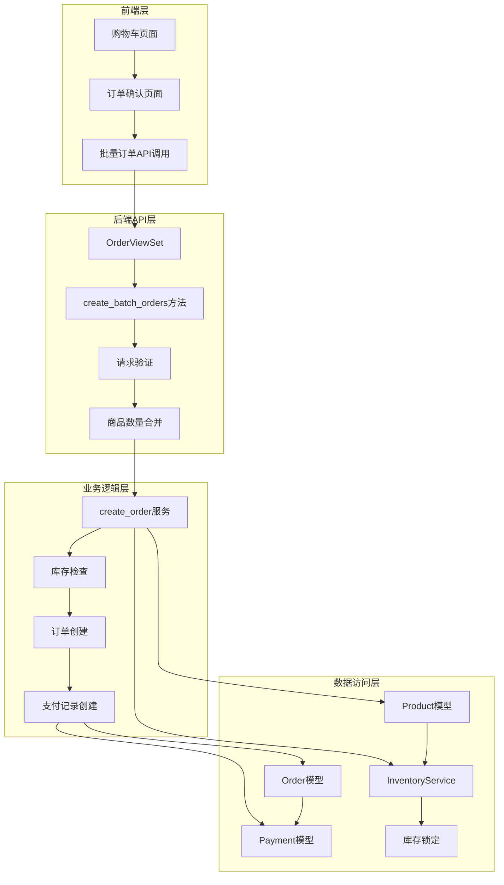
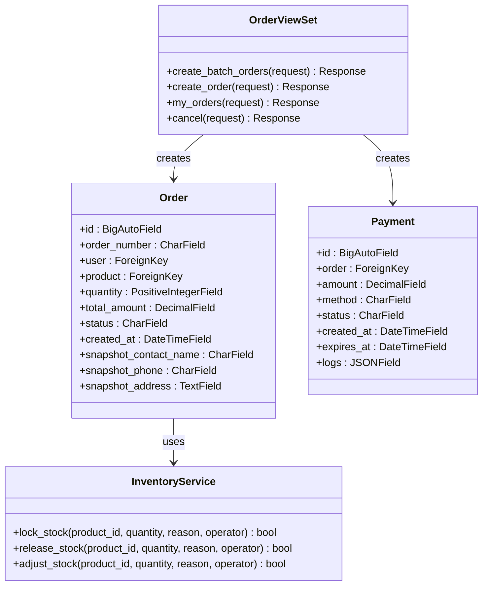
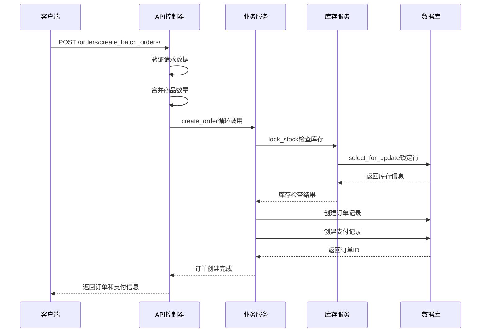
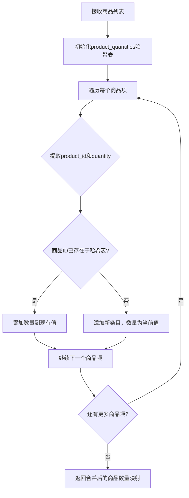
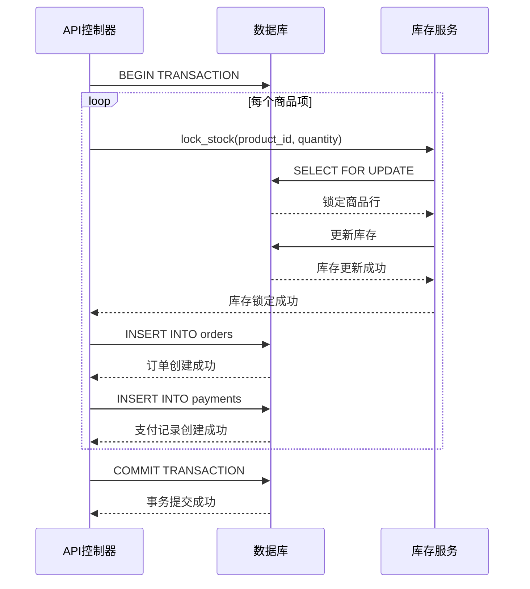
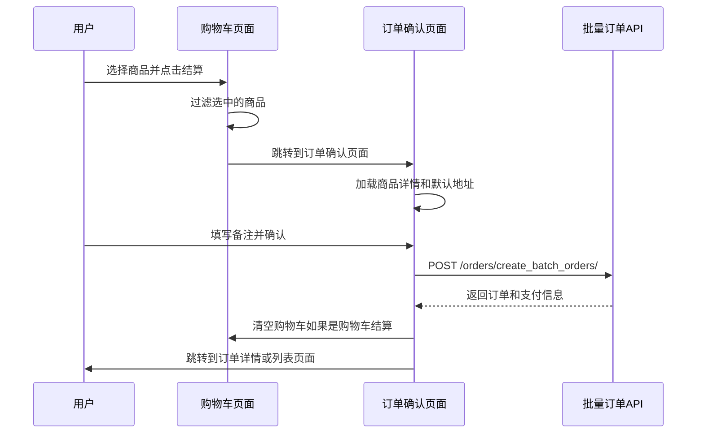
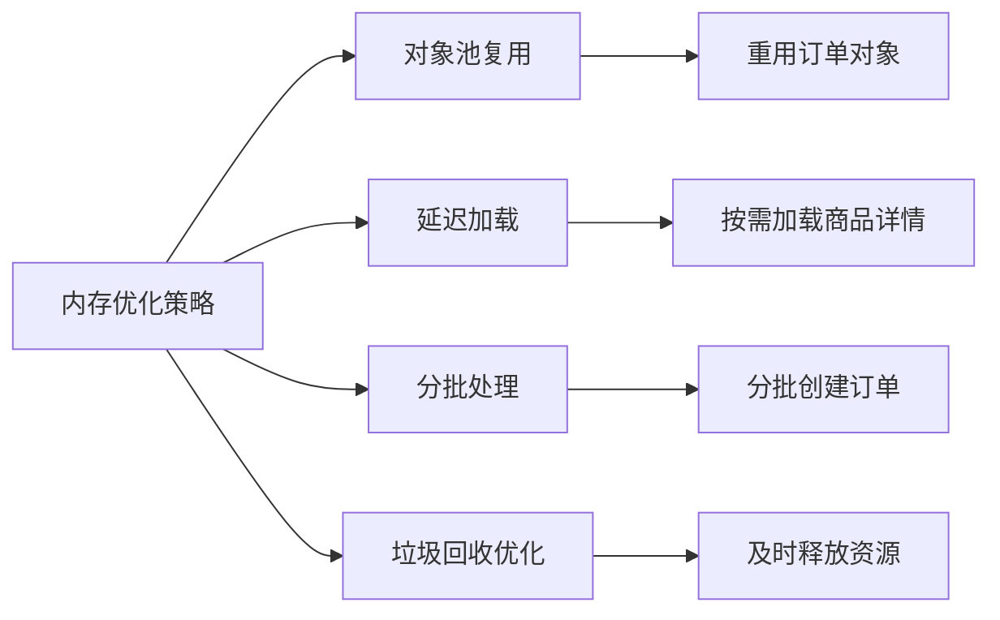

# 批量订单创建功能详细文档

<cite>
**本文档引用的文件**
- [backend/orders/views.py](file://backend/orders/views.py)
- [backend/orders/services.py](file://backend/orders/services.py)
- [backend/orders/models.py](file://backend/orders/models.py)
- [backend/orders/serializers.py](file://backend/orders/serializers.py)
- [frontend/src/services/order.ts](file://frontend/src/services/order.ts)
- [frontend/src/pages/cart/index.tsx](file://frontend/src/pages/cart/index.tsx)
- [frontend/src/pages/order-confirm/index.tsx](file://frontend/src/pages/order-confirm/index.tsx)
- [backend/orders/state_machine.py](file://backend/orders/state_machine.py)
- [backend/orders/payment_service.py](file://backend/orders/payment_service.py)
</cite>

## 目录
1. [概述](#概述)
2. [系统架构](#系统架构)
3. [核心组件分析](#核心组件分析)
4. [批量订单创建流程](#批量订单创建流程)
5. [事务处理机制](#事务处理机制)
6. [错误处理策略](#错误处理策略)
7. [前端集成](#前端集成)
8. [性能优化建议](#性能优化建议)
9. [最佳实践](#最佳实践)
10. [故障排除指南](#故障排除指南)

## 概述

批量订单创建功能是电商系统中的核心业务模块，专门用于处理购物车结算场景下的多商品订单创建。该功能通过`create_batch_orders` API端点实现，支持将购物车中的多个商品合并为独立订单，并确保整个操作过程的原子性和一致性。

### 主要特性

- **商品数量合并**：自动合并相同商品的不同数量项
- **库存检查**：支持本地库存和海尔系统库存的双重检查
- **事务保证**：使用数据库事务确保操作的原子性
- **支付集成**：为每个订单创建对应的支付记录
- **状态管理**：基于状态机的订单状态转换控制
- **错误恢复**：完善的错误处理和回滚机制

## 系统架构



**架构图源文件**
- [backend/orders/views.py](file://backend/orders/views.py#L220-L305)
- [backend/orders/services.py](file://backend/orders/services.py#L219-L297)

## 核心组件分析

### 后端API控制器

`OrderViewSet`中的`create_batch_orders`方法是批量订单创建的核心入口点。



**类图源文件**
- [backend/orders/views.py](file://backend/orders/views.py#L220-L305)
- [backend/orders/models.py](file://backend/orders/models.py#L13-L322)

### 服务层架构



**序列图源文件**
- [backend/orders/views.py](file://backend/orders/views.py#L220-L305)
- [backend/orders/services.py](file://backend/orders/services.py#L219-L297)

**节源文件**
- [backend/orders/views.py](file://backend/orders/views.py#L220-L305)
- [backend/orders/services.py](file://backend/orders/services.py#L219-L297)

## 批量订单创建流程

### 请求数据结构

批量订单创建API接受以下请求格式：

| 参数名 | 类型 | 必填 | 描述 |
|--------|------|------|------|
| items | Array | 是 | 商品列表，每个元素包含product_id和quantity |
| address_id | Integer | 是 | 收货地址ID |
| note | String | 否 | 订单备注 |
| method | String | 否 | 支付方式，默认为wechat |

### 商品数量合并算法

系统采用哈希表合并相同商品的数量：



**流程图源文件**
- [backend/orders/views.py](file://backend/orders/views.py#L255-L260)

### 订单创建步骤

1. **请求验证**：检查商品列表和地址ID的有效性
2. **商品合并**：将相同商品的数量合并为单一项目
3. **事务开始**：启动数据库事务确保原子性
4. **逐个创建订单**：
   - 调用`create_order`服务方法
   - 检查库存可用性
   - 创建订单记录
   - 为订单创建支付记录
5. **事务提交**：所有操作成功后提交事务
6. **响应返回**：返回创建的订单和支付信息

**节源文件**
- [backend/orders/views.py](file://backend/orders/views.py#L243-L305)

## 事务处理机制

### 原子性保证

批量订单创建使用数据库事务确保操作的原子性：



**序列图源文件**
- [backend/orders/views.py](file://backend/orders/views.py#L266-L287)
- [backend/orders/services.py](file://backend/orders/services.py#L333-L372)

### 并发控制

系统通过以下机制防止并发问题：

1. **行级锁**：使用`SELECT FOR UPDATE`锁定库存行
2. **事务隔离**：确保操作的隔离性
3. **乐观锁**：通过版本控制检测并发修改
4. **超时处理**：设置合理的事务超时时间

**节源文件**
- [backend/orders/services.py](file://backend/orders/services.py#L333-L372)

## 错误处理策略

### 异常分类处理

```mermaid
flowchart TD
A[批量订单创建] --> B{捕获异常类型}
B --> |ValueError| C[业务逻辑错误<br/>库存不足、参数无效]
B --> |Exception| D[系统异常<br/>数据库连接、网络错误]
C --> E[记录警告日志]
C --> F[返回400 Bad Request]
C --> G[包含具体错误信息]
D --> H[记录错误日志]
D --> I[返回500 Internal Server Error]
D --> J[包含通用错误信息]
E --> K[事务回滚]
F --> K
G --> K
H --> K
I --> K
J --> K
K --> L[返回错误响应]
```



**流程图源文件**
- [backend/orders/views.py](file://backend/orders/views.py#L288-L296)

### 错误恢复机制

1. **部分失败处理**：当部分订单创建失败时，已创建的订单会保留
2. **库存释放**：失败时自动释放已锁定的库存
3. **状态回滚**：确保系统状态的一致性
4. **日志记录**：详细记录错误信息便于排查

**节源文件**
- [backend/orders/views.py](file://backend/orders/views.py#L288-L296)

## 前端集成

### 购物车结算流程



**序列图源文件**
- [frontend/src/pages/cart/index.tsx](file://frontend/src/pages/cart/index.tsx#L156-L174)
- [frontend/src/pages/order-confirm/index.tsx](file://frontend/src/pages/order-confirm/index.tsx#L97-L147)

### 客户端请求构造

前端通过`orderService.createBatchOrders`方法构造批量创建请求：

```typescript
// 前端请求示例
const requestData = {
    items: [
        { product_id: 101, quantity: 2 },
        { product_id: 102, quantity: 1 }
    ],
    address_id: 201,
    note: "请尽快发货",
    method: "wechat"
};
```

**节源文件**
- [frontend/src/services/order.ts](file://frontend/src/services/order.ts#L16-L25)
- [frontend/src/pages/cart/index.tsx](file://frontend/src/pages/cart/index.tsx#L164-L167)

## 性能优化建议

### 大订单量处理最佳实践

1. **批量操作优化**
   - 使用数据库连接池
   - 合理设置事务超时时间
   - 避免长时间持有锁

2. **缓存策略**
   - 缓存商品价格和库存信息
   - 使用Redis存储临时订单数据
   - 实现商品折扣缓存

3. **异步处理**
   - 对于大订单量，考虑异步处理
   - 使用消息队列解耦订单创建和支付
   - 实现订单创建进度反馈

4. **数据库优化**
   - 为订单表添加合适的索引
   - 使用分区表处理历史订单
   - 定期清理过期订单数据

### 内存使用优化



## 最佳实践

### 开发规范

1. **错误处理**
   - 明确区分业务错误和系统错误
   - 提供有意义的错误信息
   - 记录详细的日志信息

2. **安全性**
   - 验证用户权限
   - 防止SQL注入攻击
   - 实施适当的速率限制

3. **可维护性**
   - 保持代码简洁清晰
   - 添加必要的注释
   - 遵循编码规范

### 监控和告警

1. **关键指标监控**
   - 订单创建成功率
   - 平均响应时间
   - 库存检查耗时
   - 事务回滚率

2. **异常告警**
   - 库存不足告警
   - 支付失败告警
   - 系统错误告警

## 故障排除指南

### 常见问题及解决方案

| 问题类型 | 症状 | 可能原因 | 解决方案 |
|----------|------|----------|----------|
| 库存不足 | 订单创建失败 | 商品库存小于购买数量 | 检查库存配置，及时补货 |
| 事务超时 | 操作卡住不动 | 数据库锁等待时间过长 | 优化查询，减少锁持有时间 |
| 支付失败 | 订单创建成功但支付失败 | 支付接口异常 | 检查支付配置，重试支付 |
| 数据不一致 | 订单状态异常 | 并发操作导致 | 检查事务边界，修复状态机 |

### 调试技巧

1. **日志分析**
   - 查看详细的错误日志
   - 分析事务执行路径
   - 监控数据库查询性能

2. **数据库检查**
   - 验证订单和支付记录完整性
   - 检查库存锁定状态
   - 分析索引使用情况

3. **性能分析**
   - 使用慢查询日志
   - 监控数据库连接池
   - 分析内存使用情况

**节源文件**
- [backend/orders/views.py](file://backend/orders/views.py#L288-L296)
- [backend/orders/services.py](file://backend/orders/services.py#L333-L372)