# 订单创建功能详细文档

<cite>
**本文档引用的文件**
- [backend/orders/views.py](file://backend/orders/views.py)
- [backend/orders/models.py](file://backend/orders/models.py)
- [backend/orders/serializers.py](file://backend/orders/serializers.py)
- [backend/orders/services.py](file://backend/orders/services.py)
- [backend/orders/state_machine.py](file://backend/orders/state_machine.py)
- [backend/orders/urls.py](file://backend/orders/urls.py)
- [frontend/src/services/order.ts](file://frontend/src/services/order.ts)
- [frontend/src/pages/order-confirm/index.tsx](file://frontend/src/pages/order-confirm/index.tsx)
</cite>

## 目录
1. [概述](#概述)
2. [系统架构](#系统架构)
3. [核心组件分析](#核心组件分析)
4. [订单创建流程](#订单创建流程)
5. [API接口详解](#api接口详解)
6. [事务处理机制](#事务处理机制)
7. [库存管理](#库存管理)
8. [错误处理与异常](#错误处理与异常)
9. [使用场景与最佳实践](#使用场景与最佳实践)
10. [故障排除指南](#故障排除指南)

## 概述

订单创建功能是电商系统的核心业务模块，负责处理用户下单、库存锁定、支付记录创建和订单快照生成等关键业务流程。系统提供了两种主要的订单创建方式：单个订单创建和批量订单创建，支持多种支付方式，并具备完善的事务处理机制确保数据一致性。

### 主要特性

- **双模式订单创建**：支持单商品订单和多商品批量订单
- **智能库存管理**：自动锁定库存，支持海尔产品特殊库存处理
- **支付集成**：支持多种支付方式，自动生成支付记录
- **状态机管理**：严格的订单状态流转控制
- **事务安全保障**：数据库事务确保操作原子性
- **错误处理机制**：完善的异常捕获和错误反馈

## 系统架构

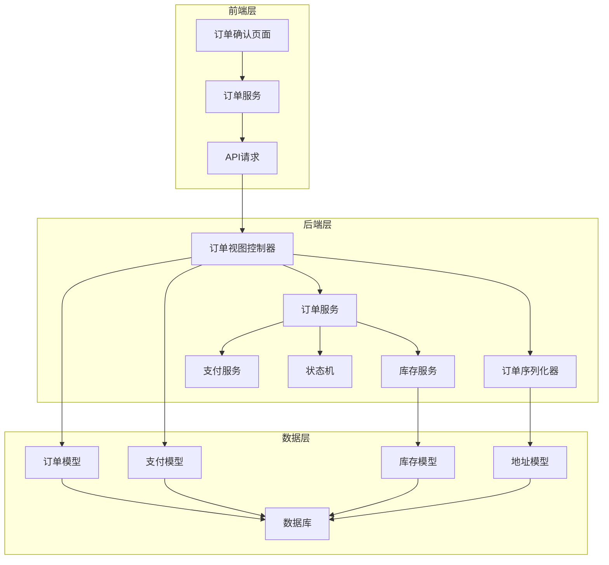

**图表来源**
- [backend/orders/views.py](file://backend/orders/views.py#L136-L305)
- [backend/orders/models.py](file://backend/orders/models.py#L13-L322)

## 核心组件分析

### 订单模型设计

订单模型包含了完整的订单信息，支持海尔产品的特殊需求：

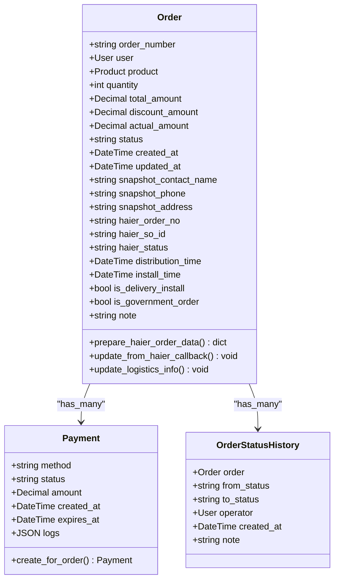

**图表来源**
- [backend/orders/models.py](file://backend/orders/models.py#L13-L322)

### 订单状态机

订单状态机确保了订单状态流转的合法性：

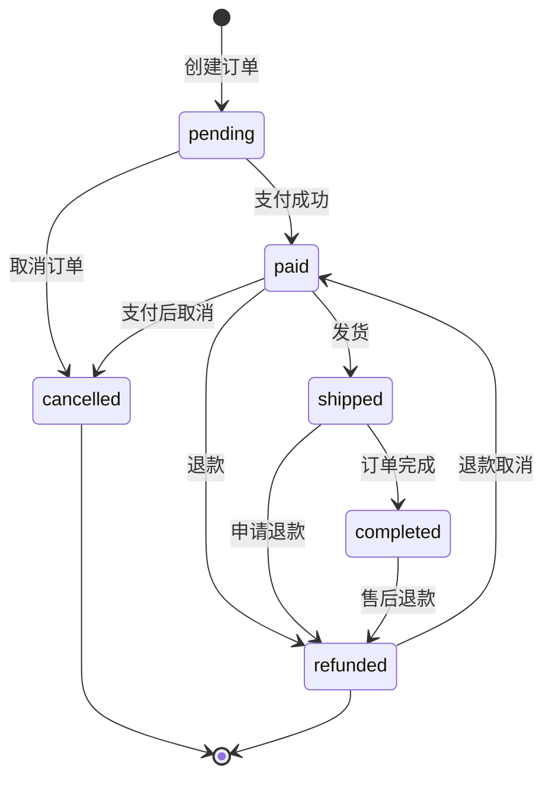

**图表来源**
- [backend/orders/state_machine.py](file://backend/orders/state_machine.py#L33-L56)

**章节来源**
- [backend/orders/models.py](file://backend/orders/models.py#L13-L322)
- [backend/orders/state_machine.py](file://backend/orders/state_machine.py#L14-L56)

## 订单创建流程

### 单个订单创建流程

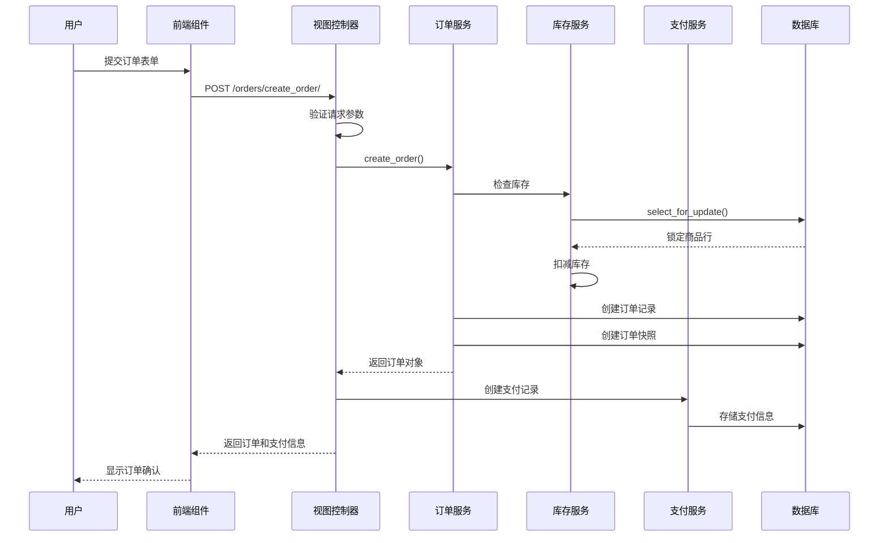

**图表来源**
- [backend/orders/views.py](file://backend/orders/views.py#L136-L217)
- [backend/orders/services.py](file://backend/orders/services.py#L219-L297)

### 批量订单创建流程

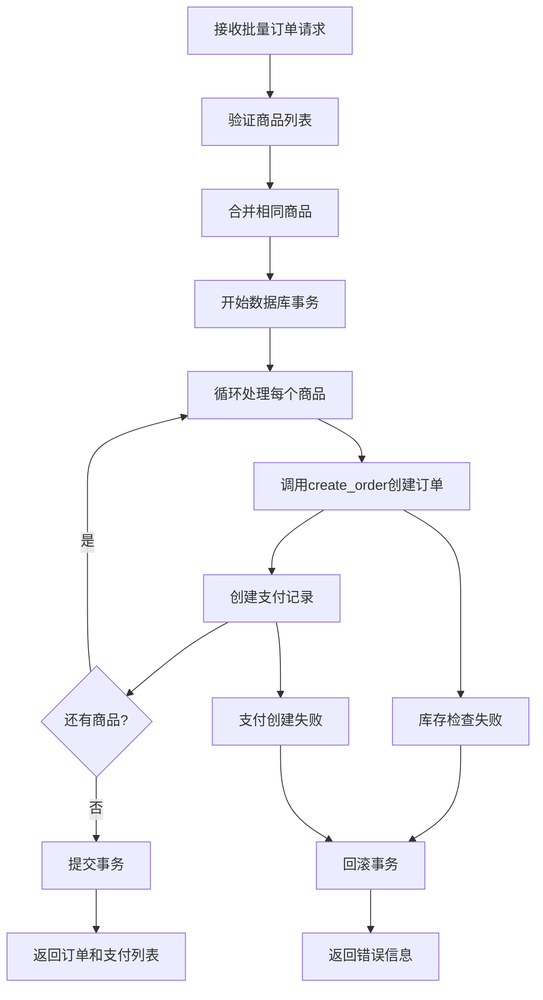

**图表来源**
- [backend/orders/views.py](file://backend/orders/views.py#L219-L305)

**章节来源**
- [backend/orders/views.py](file://backend/orders/views.py#L136-L305)
- [backend/orders/services.py](file://backend/orders/services.py#L219-L297)

## API接口详解

### create_order API

#### 请求参数

| 参数名 | 类型 | 必填 | 描述 | 示例 |
|--------|------|------|------|------|
| product_id | int | 是 | 商品ID | 123 |
| address_id | int | 是 | 收货地址ID | 456 |
| quantity | int | 否 | 商品数量，默认1 | 2 |
| note | string | 否 | 订单备注 | "请尽快发货" |
| method | string | 否 | 支付方式，默认wechat | "alipay" |
| user_id | int | 否 | 目标用户ID（管理员专用） | 789 |

#### 响应格式

```json
{
  "order": {
    "id": 1,
    "order_number": "1640995200123456",
    "user": 1,
    "product": {
      "id": 123,
      "name": "商品名称",
      "price": "199.99"
    },
    "quantity": 2,
    "total_amount": "399.98",
    "actual_amount": "359.98",
    "status": "pending",
    "created_at": "2023-01-01T10:00:00Z",
    "updated_at": "2023-01-01T10:00:00Z"
  },
  "payment": {
    "id": 1,
    "order": 1,
    "amount": "359.98",
    "method": "wechat",
    "status": "init",
    "created_at": "2023-01-01T10:00:00Z",
    "expires_at": "2023-01-01T10:30:00Z"
  }
}
```

#### 验证规则

- **商品验证**：商品必须存在且有效
- **地址验证**：地址必须属于当前用户
- **数量验证**：必须为正整数，默认为1
- **库存验证**：库存必须充足

### create_batch_orders API

#### 请求参数

| 参数名 | 类型 | 必填 | 描述 | 示例 |
|--------|------|------|------|------|
| items | array | 是 | 商品列表 | [{"product_id": 123, "quantity": 2}] |
| address_id | int | 是 | 收货地址ID | 456 |
| note | string | 否 | 订单备注 | "请尽快发货" |
| method | string | 否 | 支付方式，默认wechat | "alipay" |

#### 商品列表结构

```json
{
  "items": [
    {
      "product_id": 123,
      "quantity": 2
    },
    {
      "product_id": 456,
      "quantity": 1
    }
  ],
  "address_id": 789,
  "note": "备注信息"
}
```

#### 响应格式

```json
{
  "orders": [
    {
      "id": 1,
      "order_number": "1640995200123456",
      "product": {
        "id": 123,
        "name": "商品A"
      },
      "quantity": 2,
      "total_amount": "399.98"
    }
  ],
  "payments": [
    {
      "id": 1,
      "order": 1,
      "amount": "399.98",
      "method": "wechat",
      "status": "init"
    }
  ]
}
```

**章节来源**
- [backend/orders/views.py](file://backend/orders/views.py#L136-L305)
- [backend/orders/serializers.py](file://backend/orders/serializers.py#L99-L138)

## 事务处理机制

### 数据一致性保障

系统采用数据库事务确保订单创建过程的数据一致性：

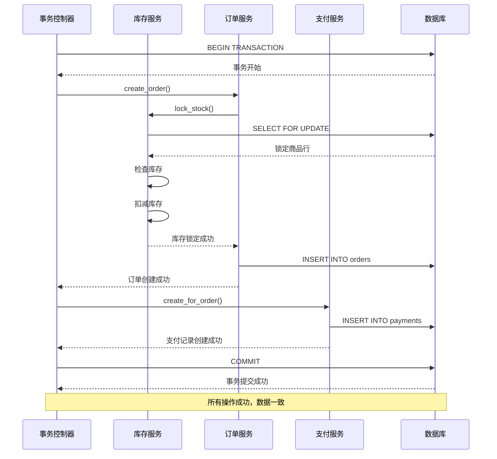

**图表来源**
- [backend/orders/services.py](file://backend/orders/services.py#L264-L297)

### 并发控制机制

系统使用数据库行锁防止并发订单导致的库存超卖：

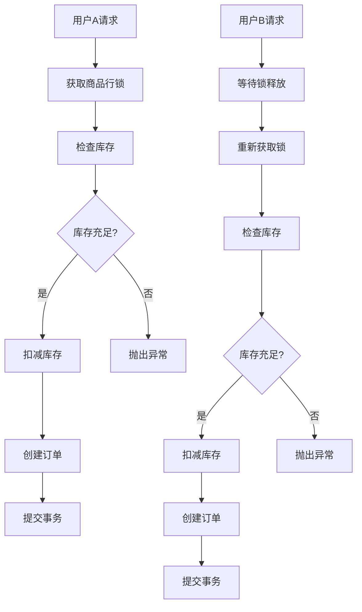

**图表来源**
- [backend/orders/services.py](file://backend/orders/services.py#L333-L371)

**章节来源**
- [backend/orders/services.py](file://backend/orders/services.py#L264-L297)
- [backend/orders/services.py](file://backend/orders/services.py#L333-L371)

## 库存管理

### 库存锁定策略

系统实现了智能库存管理，支持不同类型的库存处理：

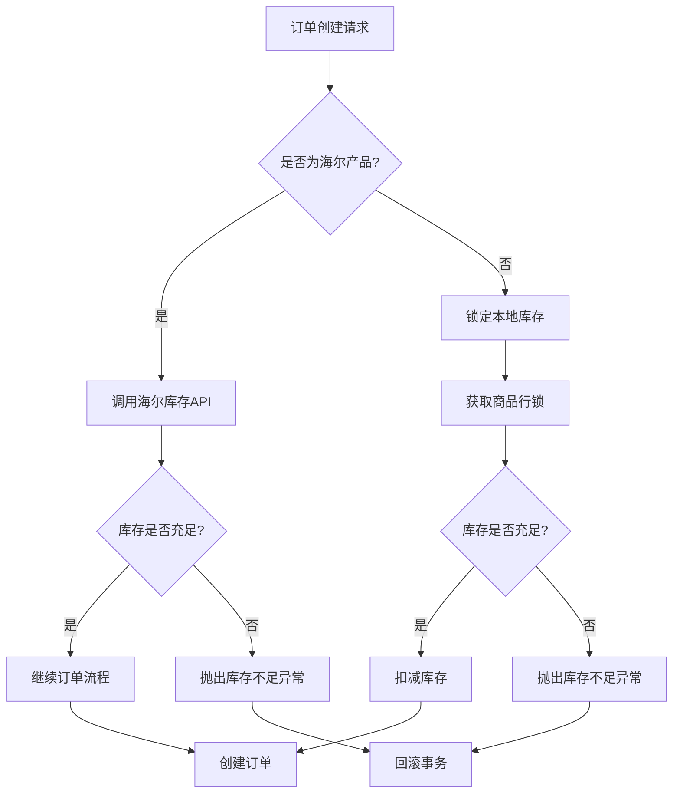

**图表来源**
- [backend/orders/services.py](file://backend/orders/services.py#L219-L297)
- [backend/orders/services.py](file://backend/orders/services.py#L123-L217)

### 库存释放机制

订单取消或退款时自动释放锁定的库存：

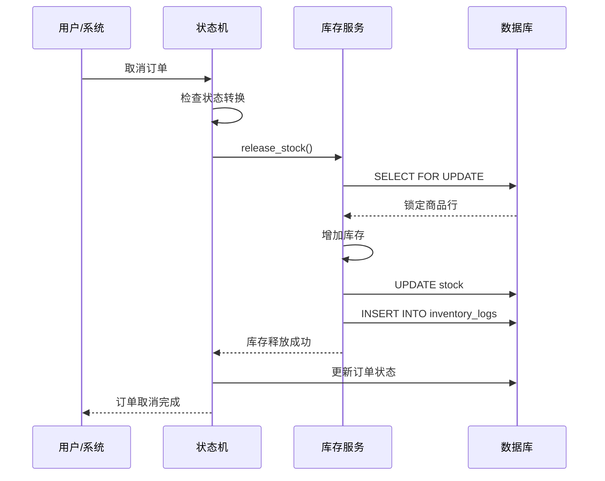

**图表来源**
- [backend/orders/state_machine.py](file://backend/orders/state_machine.py#L212-L232)

**章节来源**
- [backend/orders/services.py](file://backend/orders/services.py#L123-L217)
- [backend/orders/services.py](file://backend/orders/services.py#L219-L297)
- [backend/orders/state_machine.py](file://backend/orders/state_machine.py#L212-L232)

## 错误处理与异常

### 常见错误类型

| 错误类型 | HTTP状态码 | 错误信息 | 解决方案 |
|----------|------------|----------|----------|
| 商品不存在 | 400 | "商品不存在" | 检查商品ID有效性 |
| 地址无效 | 400 | "地址无效或不属于当前用户" | 验证地址ID和用户关系 |
| 库存不足 | 400 | "库存不足" | 检查库存状态或等待补货 |
| 数量无效 | 400 | "数量必须为正整数" | 提供有效的数量值 |
| 系统异常 | 500 | "创建订单失败" | 检查系统日志，联系技术支持 |

### 异常处理流程

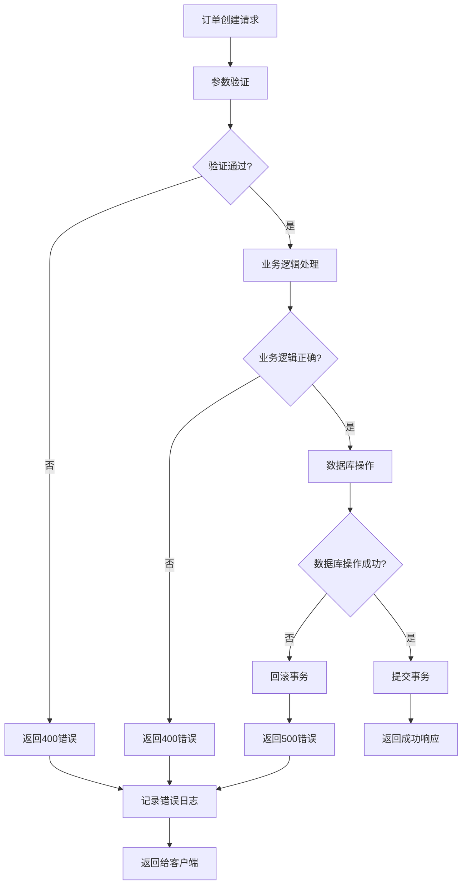

**图表来源**
- [backend/orders/views.py](file://backend/orders/views.py#L198-L208)

### 海尔产品特殊处理

对于海尔产品，系统提供了特殊的库存检查和错误处理：

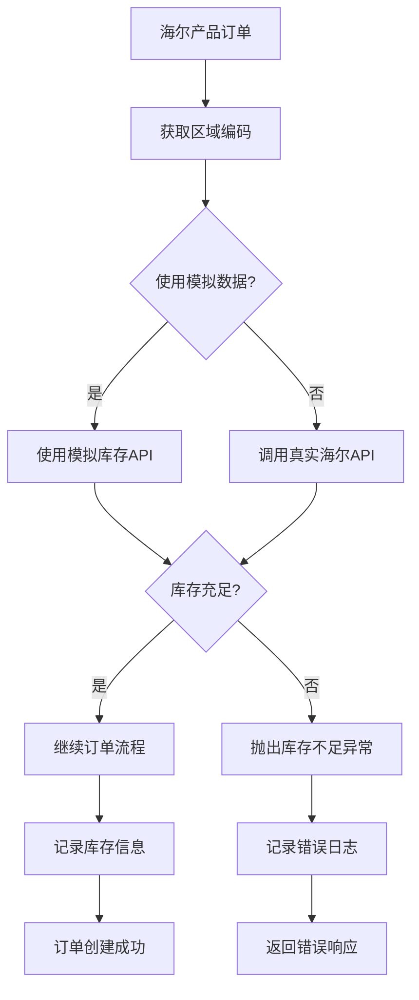

**图表来源**
- [backend/orders/services.py](file://backend/orders/services.py#L123-L217)

**章节来源**
- [backend/orders/views.py](file://backend/orders/views.py#L198-L208)
- [backend/orders/services.py](file://backend/orders/services.py#L123-L217)

## 使用场景与最佳实践

### 单商品订单创建场景

适用于用户直接从商品详情页下单的场景：

1. **用户选择商品**：用户在商品详情页选择规格和数量
2. **填写收货信息**：用户选择或填写收货地址
3. **确认订单**：用户确认订单信息并提交
4. **支付处理**：系统创建订单并生成支付记录
5. **订单跟踪**：用户可在订单列表中查看订单状态

### 批量订单创建场景

适用于购物车结算的场景：

1. **购物车管理**：用户添加多个商品到购物车
2. **批量结算**：用户一次性结算购物车中的所有商品
3. **去重处理**：系统自动合并相同商品的不同规格
4. **统一支付**：为每个订单创建独立的支付记录
5. **库存分配**：系统分别锁定每个订单的库存

### 性能优化建议

1. **缓存策略**：缓存用户地址和商品信息减少数据库查询
2. **批量操作**：使用批量API减少网络请求次数
3. **异步处理**：订单创建完成后可异步处理后续任务
4. **索引优化**：确保订单、支付、库存相关字段有适当索引

### 安全考虑

1. **权限验证**：确保用户只能访问自己的订单和地址
2. **参数校验**：严格验证所有输入参数的有效性
3. **防重复提交**：使用令牌机制防止重复下单
4. **敏感信息保护**：加密存储支付相关信息

**章节来源**
- [frontend/src/pages/order-confirm/index.tsx](file://frontend/src/pages/order-confirm/index.tsx#L1-L240)
- [frontend/src/services/order.ts](file://frontend/src/services/order.ts#L1-L47)

## 故障排除指南

### 常见问题诊断

#### 订单创建失败

**症状**：用户提交订单后收到"创建订单失败"的错误

**排查步骤**：
1. 检查商品是否存在且有效
2. 验证用户地址是否正确
3. 确认库存是否充足
4. 查看系统日志获取详细错误信息

**解决方案**：
- 更新商品信息或下架无效商品
- 清理无效地址或提示用户重新选择
- 联系供应商补货或调整库存

#### 库存超卖问题

**症状**：多个用户同时购买同一件商品导致库存显示为负数

**排查步骤**：
1. 检查数据库行锁是否正常工作
2. 验证事务隔离级别设置
3. 查看并发请求的日志

**解决方案**：
- 确保使用SELECT FOR UPDATE锁定商品行
- 设置适当的数据库事务隔离级别
- 实现分布式锁防止极端并发情况

#### 支付记录丢失

**症状**：订单创建成功但支付记录未生成

**排查步骤**：
1. 检查支付服务是否正常运行
2. 验证数据库连接状态
3. 查看支付记录创建的日志

**解决方案**：
- 重启支付服务或修复相关依赖
- 检查数据库配置和连接池设置
- 手动创建缺失的支付记录

### 监控和告警

建议监控以下关键指标：

1. **订单创建成功率**：监控订单创建的成功率
2. **库存检查耗时**：监控库存检查的响应时间
3. **支付处理延迟**：监控支付记录创建的时间
4. **异常发生频率**：监控各种错误的发生频率

### 性能调优

1. **数据库优化**：为订单、支付、库存相关表添加索引
2. **缓存策略**：缓存热门商品和用户地址信息
3. **连接池配置**：优化数据库连接池大小
4. **异步处理**：将非关键操作异步化处理

**章节来源**
- [backend/orders/views.py](file://backend/orders/views.py#L198-L208)
- [backend/orders/services.py](file://backend/orders/services.py#L333-L371)