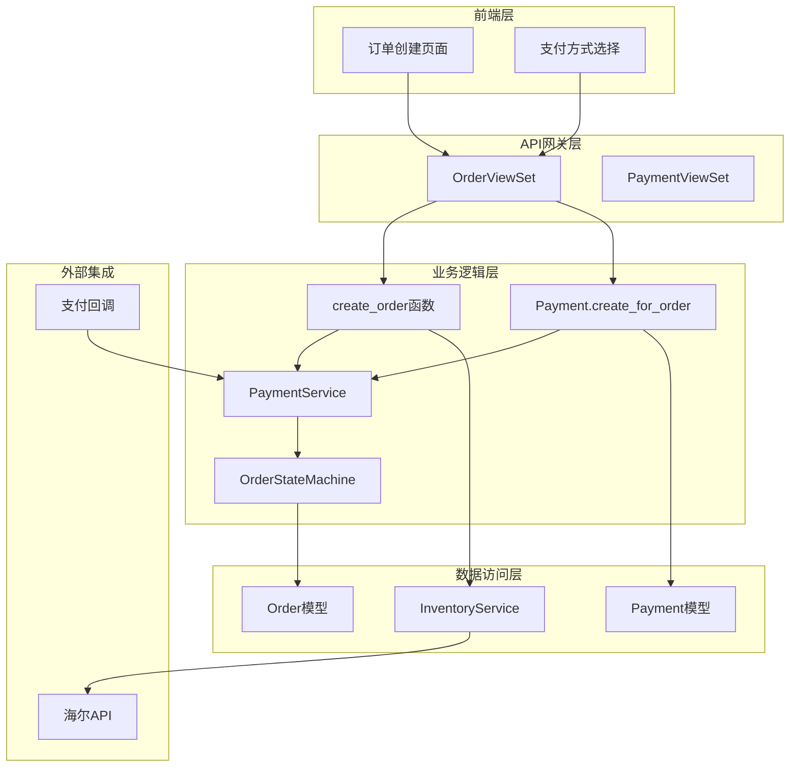
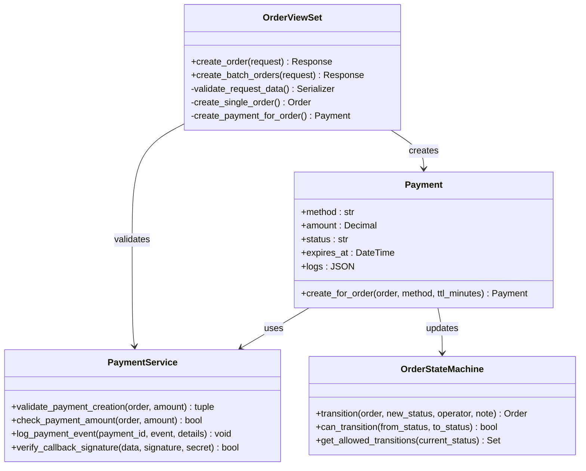
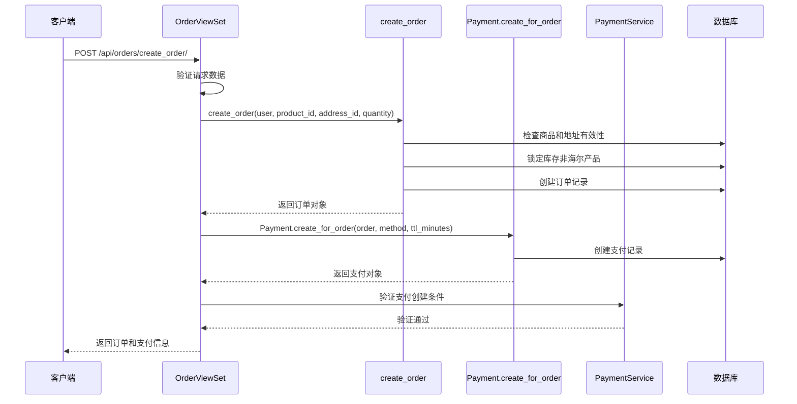
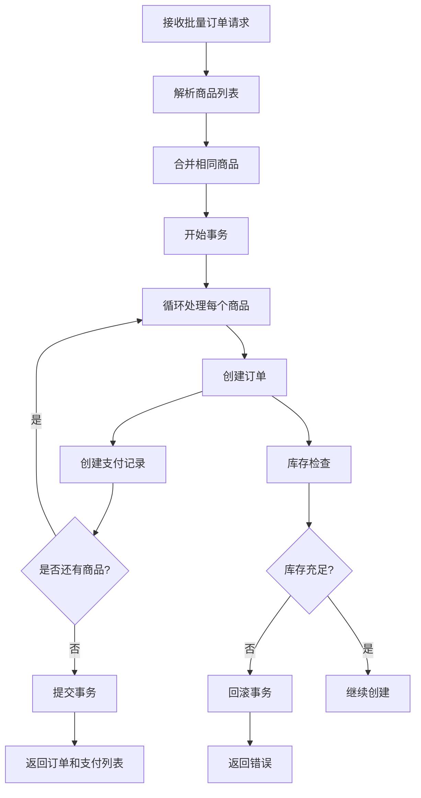
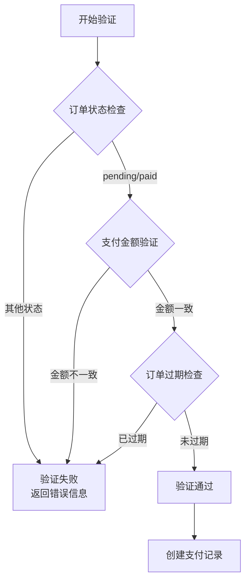
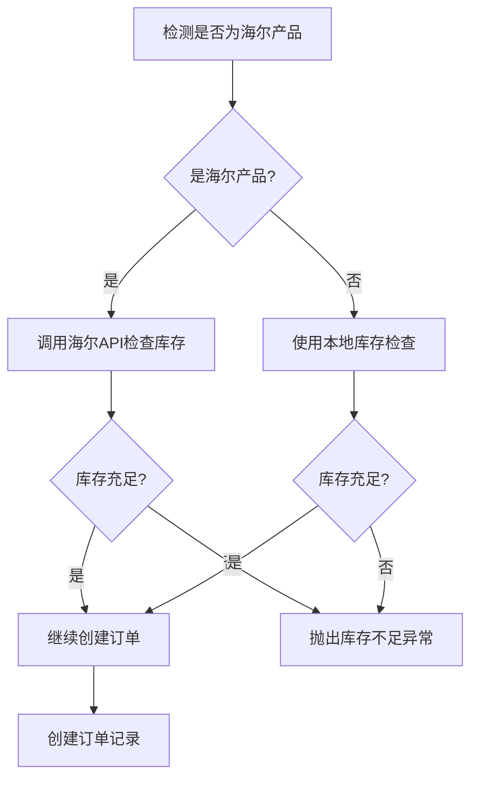
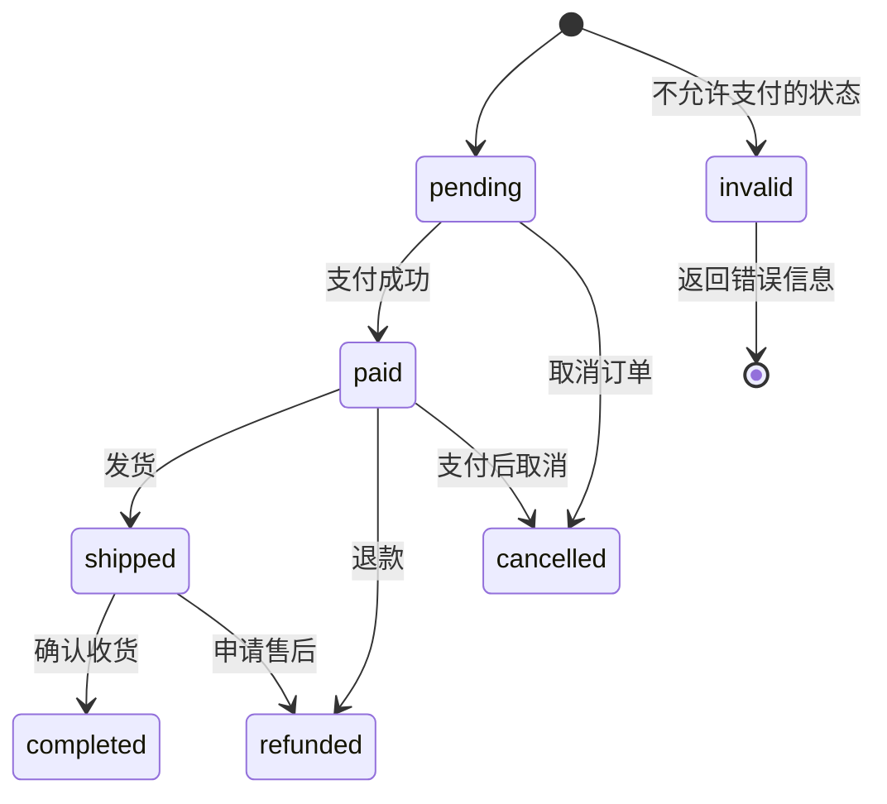
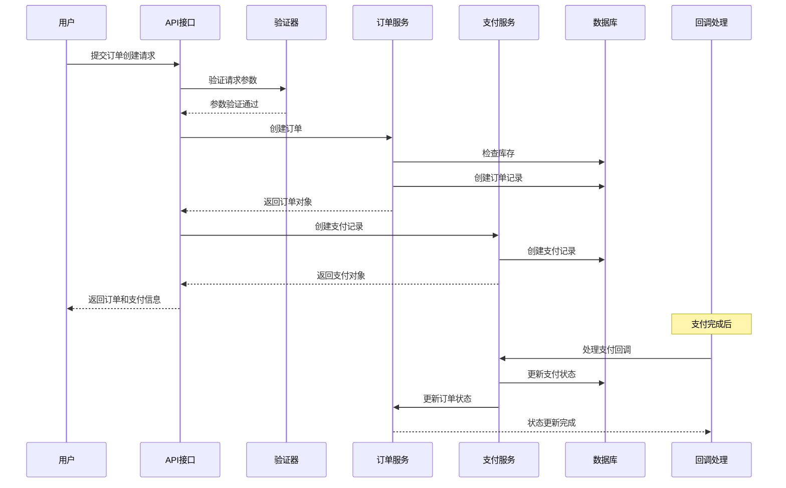
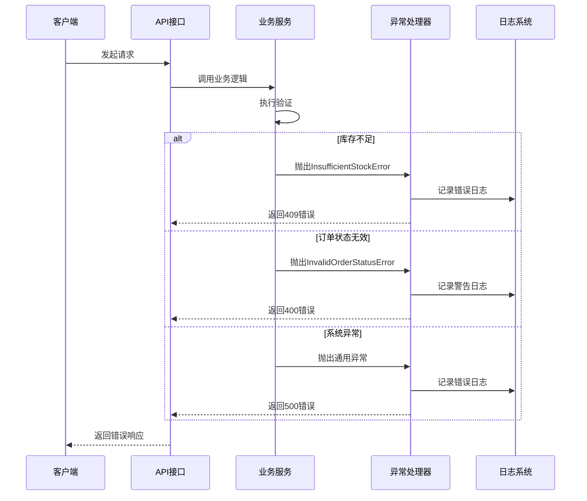

# 支付创建

<cite>
**本文档引用的文件**
- [views.py](file://backend/orders/views.py)
- [models.py](file://backend/orders/models.py)
- [payment_service.py](file://backend/orders/payment_service.py)
- [services.py](file://backend/orders/services.py)
- [state_machine.py](file://backend/orders/state_machine.py)
- [serializers.py](file://backend/orders/serializers.py)
- [exceptions.py](file://backend/common/exceptions.py)
- [haierapi.py](file://backend/integrations/haierapi.py)
- [ylhapi.py](file://backend/integrations/ylhapi.py)
</cite>

## 目录
1. [概述](#概述)
2. [系统架构](#系统架构)
3. [核心组件分析](#核心组件分析)
4. [支付创建流程](#支付创建流程)
5. [验证逻辑详解](#验证逻辑详解)
6. [错误处理策略](#错误处理策略)
7. [时序图分析](#时序图分析)
8. [性能考虑](#性能考虑)
9. [故障排除指南](#故障排除指南)
10. [总结](#总结)

## 概述

支付创建是电商系统中的核心功能，负责在订单创建过程中自动生成支付记录。本文档详细介绍了系统如何在创建订单时自动创建支付记录，包括支付方式设置、过期时间配置、验证逻辑以及错误处理机制。

系统采用事务性设计，确保订单和支付记录的一致性，并提供完善的错误处理和状态管理机制。

## 系统架构

**图表来源**
- [views.py](file://backend/orders/views.py#L135-L216)
- [models.py](file://backend/orders/models.py#L185-L233)
- [payment_service.py](file://backend/orders/payment_service.py#L19-L290)

## 核心组件分析

### OrderViewSet.create_order 方法

OrderViewSet.create_order 是支付创建的核心入口点，负责协调订单创建和支付记录创建的整个流程。

**图表来源**
- [views.py](file://backend/orders/views.py#L135-L216)
- [models.py](file://backend/orders/models.py#L222-L233)
- [payment_service.py](file://backend/orders/payment_service.py#L19-L290)

**章节来源**
- [views.py](file://backend/orders/views.py#L135-L216)
- [models.py](file://backend/orders/models.py#L222-L233)

### Payment.create_for_order 方法

Payment.create_for_order 是创建支付记录的核心方法，负责初始化支付记录的基本属性。

| 参数 | 类型 | 默认值 | 描述 |
|------|------|--------|------|
| order | Order | 必需 | 关联的订单对象 |
| method | str | 'wechat' | 支付方式（wechat/alipay/bank） |
| ttl_minutes | int | 30 | 支付过期时间（分钟） |

| 属性 | 类型 | 描述 |
|------|------|------|
| id | BigAutoField | 主键标识 |
| order | ForeignKey | 关联订单 |
| amount | Decimal | 支付金额（等于订单总额） |
| method | CharField | 支付方式 |
| status | CharField | 支付状态（init/processing/succeeded/failed/expired） |
| created_at | DateTimeField | 创建时间 |
| expires_at | DateTimeField | 过期时间 |
| logs | JSONField | 支付日志记录 |

**章节来源**
- [models.py](file://backend/orders/models.py#L222-L233)

## 支付创建流程

### 单订单创建流程

**图表来源**
- [views.py](file://backend/orders/views.py#L175-L216)
- [services.py](file://backend/orders/services.py#L218-L296)
- [models.py](file://backend/orders/models.py#L222-L233)

### 批量订单创建流程

**图表来源**
- [views.py](file://backend/orders/views.py#L218-L304)

**章节来源**
- [views.py](file://backend/orders/views.py#L175-L216)
- [views.py](file://backend/orders/views.py#L218-L304)

## 验证逻辑详解

### 订单状态检查

系统在创建支付记录前会进行严格的订单状态验证：

**图表来源**
- [payment_service.py](file://backend/orders/payment_service.py#L207-L242)

### 库存检查机制

对于非海尔产品，系统会执行库存锁定检查：

| 检查步骤 | 描述 | 异常处理 |
|----------|------|----------|
| 1. 商品存在性检查 | 验证商品ID有效性 | Product.DoesNotExist |
| 2. 地址有效性检查 | 验证地址属于当前用户 | Address.DoesNotExist |
| 3. 库存锁定检查 | 使用数据库行锁锁定库存 | InsufficientStockError |
| 4. 事务边界保护 | 确保原子性操作 | 事务回滚 |

### 海尔产品特殊处理

对于海尔产品，系统采用不同的库存验证策略：

**图表来源**
- [services.py](file://backend/orders/services.py#L123-L216)
- [haierapi.py](file://backend/integrations/haierapi.py#L121-L142)

**章节来源**
- [payment_service.py](file://backend/orders/payment_service.py#L207-L242)
- [services.py](file://backend/orders/services.py#L218-L296)
- [haierapi.py](file://backend/integrations/haierapi.py#L121-L142)

## 错误处理策略

### 库存不足处理

当库存不足时，系统会抛出特定的异常并进行相应的处理：

| 异常类型 | HTTP状态码 | 错误信息 | 处理方式 |
|----------|------------|----------|----------|
| InsufficientStockError | 409 | 库存不足 | 返回具体库存信息，提示用户减少购买数量 |
| Product.DoesNotExist | 400 | 商品不存在 | 提示用户选择有效的商品 |
| Address.DoesNotExist | 400 | 地址无效 | 提示用户选择有效的配送地址 |

### 订单状态无效处理

当订单状态不允许支付时，系统会返回明确的错误信息：

**图表来源**
- [state_machine.py](file://backend/orders/state_machine.py#L33-L56)

### 支付金额验证错误

系统严格验证支付金额与订单金额的一致性：

| 验证场景 | 错误处理 | 用户提示 |
|----------|----------|----------|
| 金额不匹配 | 返回400错误 | "支付金额与订单金额不一致" |
| 浮点数精度问题 | 允许0.01元误差 | 自动修正小数点差异 |
| 金额格式错误 | 返回400错误 | "无效的支付金额格式" |

**章节来源**
- [exceptions.py](file://backend/common/exceptions.py#L59-L94)
- [payment_service.py](file://backend/orders/payment_service.py#L207-L242)
- [views.py](file://backend/orders/views.py#L875-L939)

## 时序图分析

### 支付创建完整时序

**图表来源**
- [views.py](file://backend/orders/views.py#L135-L216)
- [payment_service.py](file://backend/orders/payment_service.py#L19-L290)

### 错误处理时序

**图表来源**
- [views.py](file://backend/orders/views.py#L198-L207)
- [exceptions.py](file://backend/common/exceptions.py#L59-L94)

## 性能考虑

### 事务管理

系统采用数据库事务确保数据一致性：

- **原子性**：订单创建和支付记录创建在同一个事务中完成
- **隔离性**：使用数据库行锁防止并发库存竞争
- **持久性**：确保操作的不可逆性
- **一致性**：维护数据完整性约束

### 缓存策略

对于频繁访问的数据，系统采用适当的缓存策略：

| 缓存对象 | 缓存时间 | 更新触发 |
|----------|----------|----------|
| 商品信息 | 30分钟 | 商品修改时 |
| 用户地址 | 1小时 | 地址变更时 |
| 库存状态 | 实时 | 库存变动时 |

### 并发控制

系统通过以下机制控制并发访问：

1. **数据库行锁**：在库存检查和锁定时使用
2. **乐观锁**：在支付状态更新时使用
3. **分布式锁**：在关键业务操作时使用

## 故障排除指南

### 常见问题及解决方案

#### 1. 库存不足错误

**症状**：收到 "InsufficientStockError" 错误
**原因**：商品库存不足以满足订单需求
**解决方案**：
- 检查商品库存状态
- 联系供应商补货
- 提示用户减少购买数量

#### 2. 订单状态无效

**症状**：收到 "InvalidOrderStatusError" 错误
**原因**：尝试对已支付或已取消的订单创建支付
**解决方案**：
- 检查订单当前状态
- 清除无效订单重新创建
- 提供清晰的状态转换指导

#### 3. 支付金额不匹配

**症状**：收到支付金额验证失败错误
**原因**：支付金额与订单总额不一致
**解决方案**：
- 检查订单价格计算逻辑
- 验证货币单位和精度
- 确保前端和后端金额同步

### 监控和日志

系统提供详细的监控和日志功能：

| 监控指标 | 监控频率 | 告警阈值 |
|----------|----------|----------|
| 订单创建成功率 | 实时 | < 95% |
| 支付创建延迟 | 实时 | > 5秒 |
| 库存检查失败率 | 实时 | > 1% |
| 支付回调成功率 | 实时 | < 98% |

**章节来源**
- [views.py](file://backend/orders/views.py#L198-L207)
- [exceptions.py](file://backend/common/exceptions.py#L59-L94)

## 总结

支付创建功能是电商系统的核心组件，涉及订单管理、库存控制、支付处理等多个方面。系统通过以下特性确保功能的可靠性和用户体验：

### 核心优势

1. **事务一致性**：确保订单和支付记录的原子性操作
2. **严格验证**：多层次的验证机制防止业务逻辑错误
3. **错误处理**：完善的异常处理和用户友好的错误提示
4. **并发安全**：通过数据库锁和状态机确保并发安全性
5. **扩展性**：支持多种支付方式和未来功能扩展

### 最佳实践

1. **使用事务**：在关键业务操作中始终使用数据库事务
2. **及时验证**：在业务逻辑的早期阶段进行验证
3. **详细日志**：记录关键操作的详细日志便于排查问题
4. **用户反馈**：提供清晰的错误信息和操作指导
5. **监控告警**：建立完善的监控体系及时发现和处理问题

通过遵循这些原则和最佳实践，系统能够提供稳定可靠的支付创建功能，为用户提供良好的购物体验。