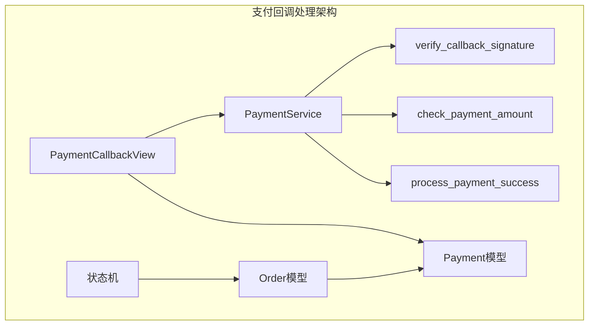
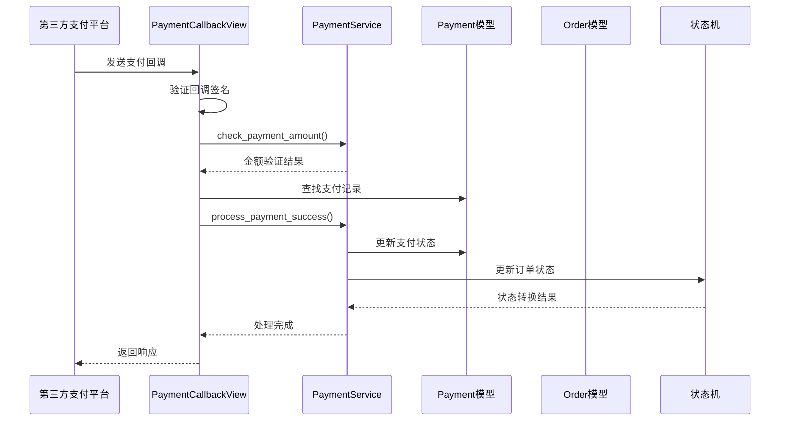
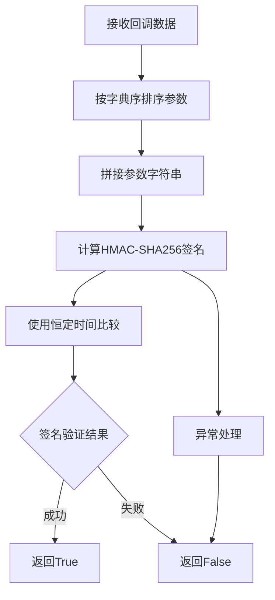
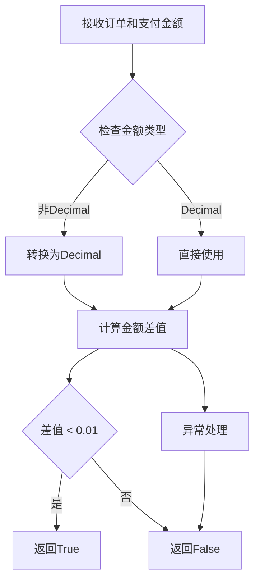
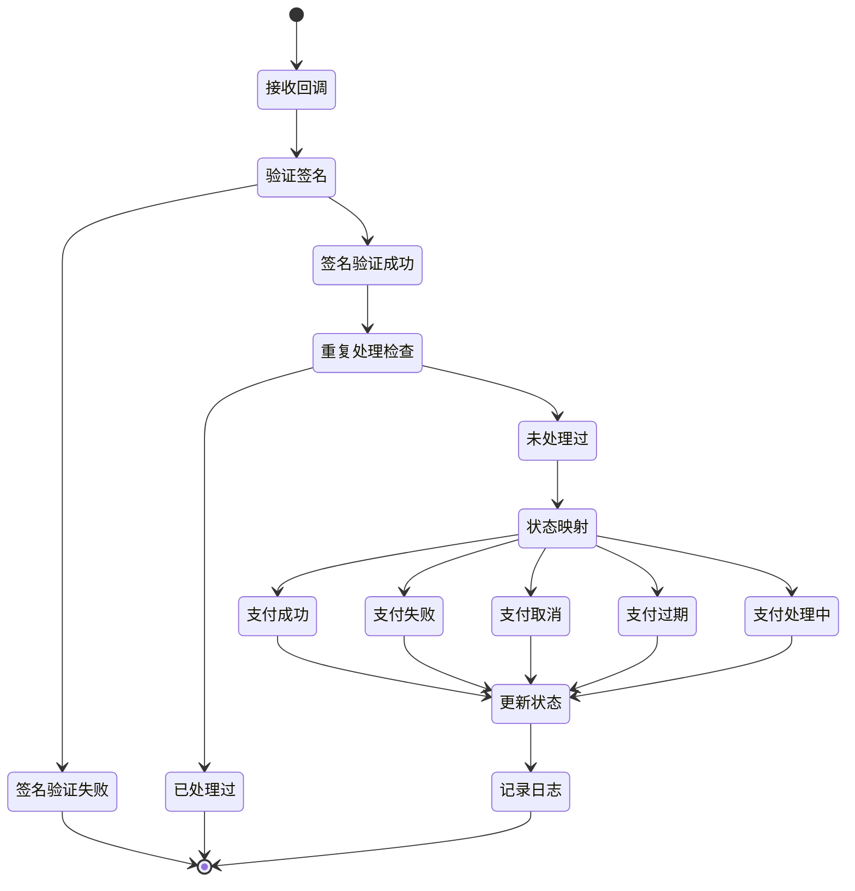
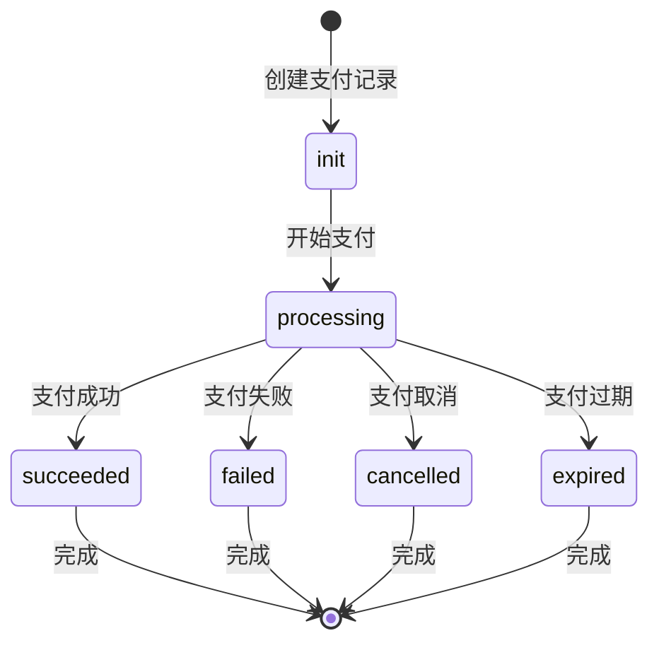
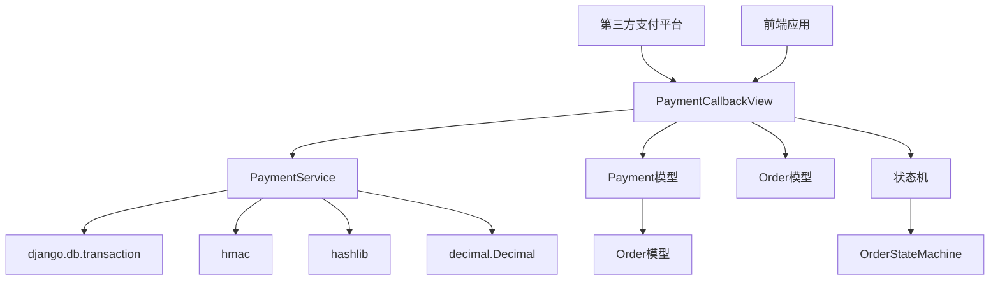

# 支付回调处理

<cite>
**本文档中引用的文件**
- [payment_service.py](file://backend/orders/payment_service.py)
- [views.py](file://backend/orders/views.py)
- [models.py](file://backend/orders/models.py)
- [api.md](file://api.md)
</cite>

## 目录
1. [简介](#简介)
2. [项目结构](#项目结构)
3. [核心组件](#核心组件)
4. [架构概览](#架构概览)
5. [详细组件分析](#详细组件分析)
6. [依赖关系分析](#依赖关系分析)
7. [性能考虑](#性能考虑)
8. [故障排除指南](#故障排除指南)
9. [结论](#结论)

## 简介

本文档详细介绍了电动小商城项目中的支付回调处理机制。该系统负责处理来自第三方支付平台（如微信支付和支付宝）的支付回调通知，确保支付安全性和数据完整性。系统采用严格的安全措施，包括HMAC-SHA256签名验证、恒定时间比较防止时序攻击、以及精确的金额验证机制。

## 项目结构

支付回调处理功能主要分布在以下模块中：

**图表来源**
- [views.py](file://backend/orders/views.py#L1133-L1400)
- [payment_service.py](file://backend/orders/payment_service.py#L20-L292)

**章节来源**
- [views.py](file://backend/orders/views.py#L1133-L1400)
- [payment_service.py](file://backend/orders/payment_service.py#L1-L292)

## 核心组件

### PaymentService 类

PaymentService 是支付回调处理的核心服务类，提供以下关键功能：

1. **签名验证**：使用 HMAC-SHA256 算法验证回调数据的真实性
2. **金额验证**：检查支付金额与订单金额的一致性，允许 0.01 元的误差
3. **支付成功处理**：处理支付成功的业务逻辑，包括状态更新和日志记录
4. **事件日志**：记录完整的支付事件日志，用于审计和调试

### PaymentCallbackView 视图

PaymentCallbackView 是处理第三方支付回调的主要入口点，支持多种支付提供商：

- **mock**：开发环境模拟支付
- **wechat**：微信支付回调处理
- **alipay**：支付宝回调处理

**章节来源**
- [payment_service.py](file://backend/orders/payment_service.py#L20-L292)
- [views.py](file://backend/orders/views.py#L1133-L1400)

## 架构概览

支付回调处理系统采用分层架构设计，确保安全性和可维护性：

**图表来源**
- [views.py](file://backend/orders/views.py#L1149-L1296)
- [payment_service.py](file://backend/orders/payment_service.py#L106-L205)

## 详细组件分析

### PaymentService.verify_callback_signature 方法

这是支付回调安全验证的核心方法，使用 HMAC-SHA256 算法验证回调数据的真实性：

#### 实现原理

**图表来源**
- [payment_service.py](file://backend/orders/payment_service.py#L30-L68)

#### 关键特性

1. **HMAC-SHA256 算法**：使用标准的加密哈希算法确保签名安全性
2. **恒定时间比较**：使用 `hmac.compare_digest()` 防止时序攻击
3. **参数排序**：按字典序排序确保签名计算的一致性
4. **异常处理**：捕获所有异常并返回安全的 false 值

#### 安全最佳实践

- **密钥管理**：每个支付提供商使用独立的签名密钥
- **参数完整性**：包含所有回调参数参与签名计算
- **时间敏感**：使用恒定时间比较防止侧信道攻击

**章节来源**
- [payment_service.py](file://backend/orders/payment_service.py#L30-L68)

### PaymentService.check_payment_amount 方法

该方法验证支付金额与订单金额的一致性，允许微小的误差以处理浮点数精度问题：

#### 实现逻辑

**图表来源**
- [payment_service.py](file://backend/orders/payment_service.py#L71-L103)

#### 误差容忍机制

系统允许 0.01 元（1分钱）的误差，这是基于以下考虑：

1. **浮点数精度**：不同系统间可能存在微小的数值差异
2. **货币最小单位**：1分钱是大多数货币体系的最小单位
3. **实际业务需求**：避免因微小差异导致支付失败

**章节来源**
- [payment_service.py](file://backend/orders/payment_service.py#L71-L103)

### PaymentCallbackView 回调处理流程

PaymentCallbackView 实现了完整的支付回调处理流程：

#### 主要步骤

1. **回调接收**：接收来自第三方支付平台的回调通知
2. **签名验证**：根据支付提供商验证回调签名
3. **重复处理防护**：防止重复处理已成功的支付
4. **状态映射**：将第三方状态映射到统一的支付状态
5. **事务处理**：使用数据库事务确保数据一致性
6. **状态更新**：更新支付状态和订单状态
7. **日志记录**：记录完整的处理过程

#### 状态处理逻辑

**图表来源**
- [views.py](file://backend/orders/views.py#L1149-L1296)

**章节来源**
- [views.py](file://backend/orders/views.py#L1149-L1296)

### Payment 模型设计

Payment 模型定义了支付记录的数据结构和业务逻辑：

#### 核心字段

| 字段名 | 类型 | 描述 | 默认值 |
|--------|------|------|--------|
| id | BigAutoField | 支付记录主键 | 自动生成 |
| order | ForeignKey | 关联的订单 | 必填 |
| amount | Decimal | 支付金额 | 必填 |
| method | Char | 支付方式 | 'wechat' |
| status | Char | 支付状态 | 'init' |
| created_at | DateTime | 创建时间 | 自动设置 |
| updated_at | DateTime | 更新时间 | 自动更新 |
| expires_at | DateTime | 过期时间 | 必填 |
| logs | JSONField | 支付日志 | [] |

#### 支付状态流转

**图表来源**
- [models.py](file://backend/orders/models.py#L186-L234)

**章节来源**
- [models.py](file://backend/orders/models.py#L186-L234)

## 依赖关系分析

支付回调处理系统的依赖关系如下：

**图表来源**
- [views.py](file://backend/orders/views.py#L1133-L1400)
- [payment_service.py](file://backend/orders/payment_service.py#L1-L18)

### 外部依赖

1. **第三方支付 SDK**：集成微信支付和支付宝 SDK
2. **数据库**：PostgreSQL/MySQL 存储支付记录
3. **缓存系统**：Redis 缓存频繁访问的数据
4. **消息队列**：异步处理支付通知

**章节来源**
- [views.py](file://backend/orders/views.py#L1133-L1400)
- [payment_service.py](file://backend/orders/payment_service.py#L1-L18)

## 性能考虑

### 并发处理优化

1. **数据库锁**：使用 `select_for_update()` 防止并发处理
2. **事务隔离**：使用数据库事务确保数据一致性
3. **索引优化**：为支付状态和订单字段建立索引

### 缓存策略

1. **支付记录缓存**：缓存活跃的支付记录
2. **签名密钥缓存**：缓存支付提供商的签名密钥
3. **状态映射缓存**：缓存状态转换规则

### 异步处理

对于非关键路径的操作，系统支持异步处理：

- 支付事件通知
- 订单状态同步
- 数据统计更新

## 故障排除指南

### 常见问题及解决方案

#### 1. 签名验证失败

**症状**：回调返回 403 错误，日志显示签名验证失败

**可能原因**：
- 第三方支付平台配置错误
- 签名密钥不匹配
- 参数顺序错误

**解决方案**：
1. 检查支付平台的签名密钥配置
2. 验证回调参数的完整性和正确性
3. 确认参数排序规则与第三方平台一致

#### 2. 支付金额不匹配

**症状**：金额验证失败，支付无法正常处理

**可能原因**：
- 订单金额被修改
- 浮点数精度问题
- 第三方平台传入金额错误

**解决方案**：
1. 检查订单金额是否被意外修改
2. 验证金额计算逻辑
3. 与第三方平台确认金额传递准确性

#### 3. 重复处理问题

**症状**：同一笔支付被多次处理

**可能原因**：
- 第三方平台重复发送回调
- 系统处理超时导致重试
- 并发处理冲突

**解决方案**：
1. 实现幂等性处理逻辑
2. 使用支付 ID 去重
3. 添加防抖机制

**章节来源**
- [views.py](file://backend/orders/views.py#L1180-L1191)
- [payment_service.py](file://backend/orders/payment_service.py#L71-L103)

## 结论

电动小商城的支付回调处理系统实现了完整的支付安全保障机制。通过严格的签名验证、精确的金额校验和完善的日志记录，系统能够安全可靠地处理来自第三方支付平台的回调通知。

### 主要优势

1. **安全性**：采用 HMAC-SHA256 算法和恒定时间比较防止各种攻击
2. **可靠性**：完善的错误处理和重试机制
3. **可维护性**：清晰的代码结构和详细的日志记录
4. **扩展性**：支持多种支付提供商和未来功能扩展

### 最佳实践建议

1. **定期测试**：定期进行支付回调的集成测试
2. **监控告警**：建立完善的监控和告警机制
3. **文档维护**：及时更新技术文档和操作手册
4. **安全审计**：定期进行安全审计和漏洞扫描

该系统为电动小商城提供了稳定可靠的支付基础设施，确保用户的支付体验安全、便捷、高效。