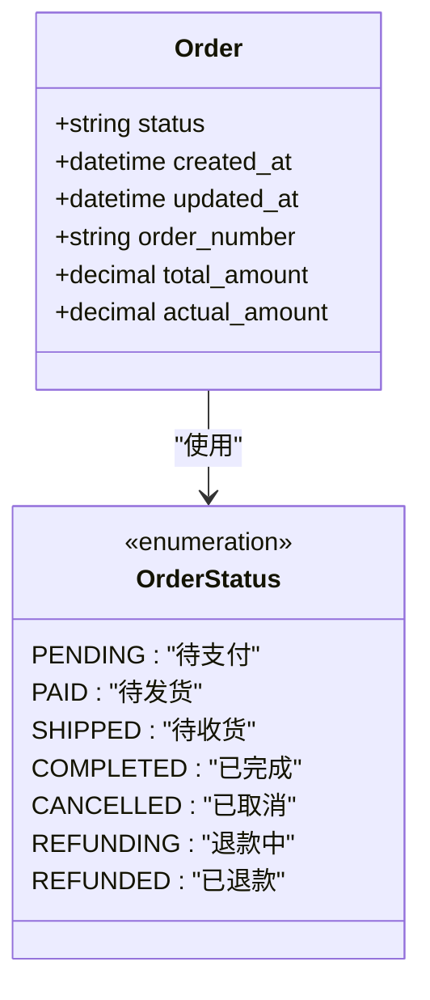
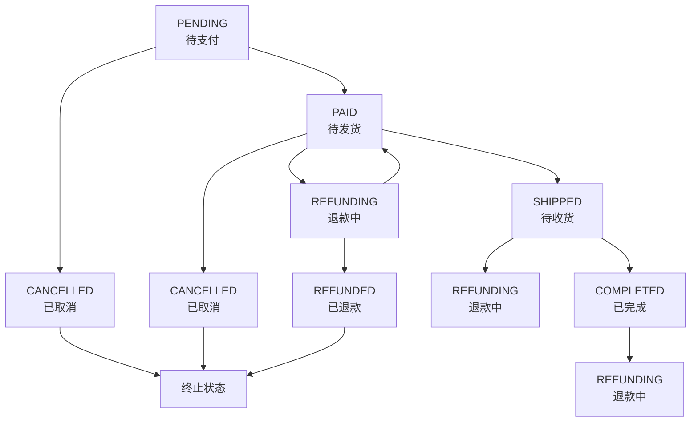
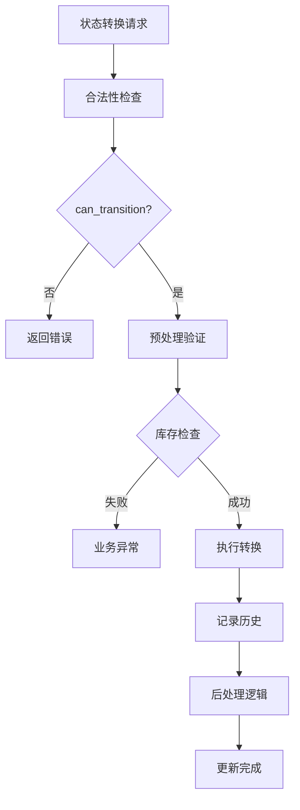
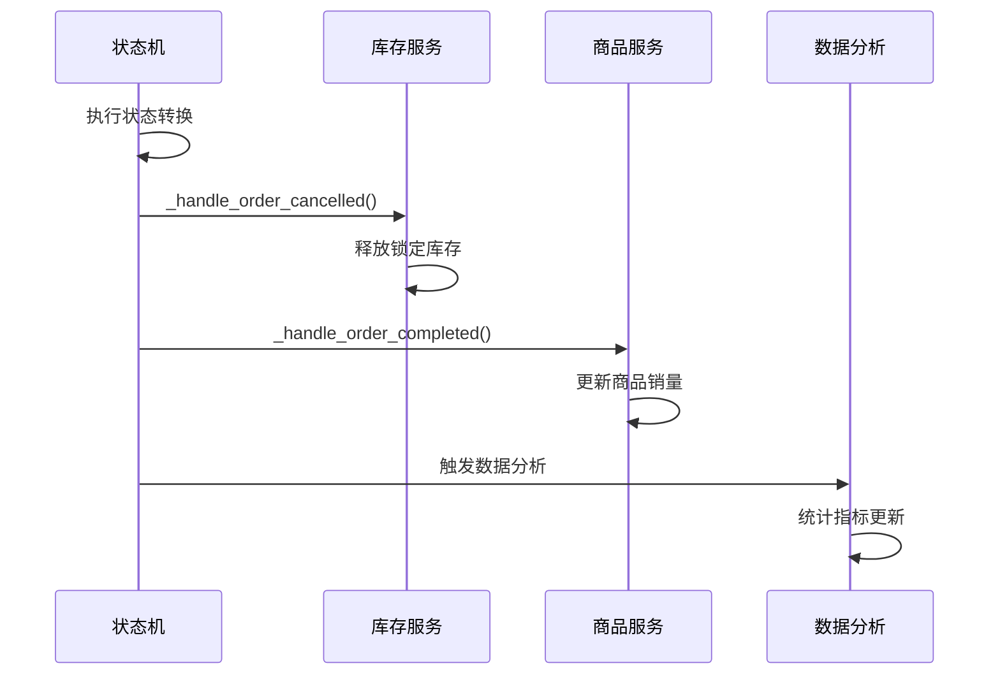
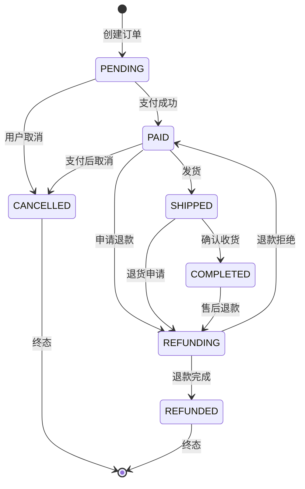

# 状态转换规则

<cite>
**本文档引用的文件**
- [state_machine.py](file://backend/orders/state_machine.py)
- [models.py](file://backend/orders/models.py)
- [views.py](file://backend/orders/views.py)
- [payment_service.py](file://backend/orders/payment_service.py)
- [services.py](file://backend/orders/services.py)
- [cancel_unpaid_orders.py](file://backend/orders/management/commands/cancel_unpaid_orders.py)
</cite>

## 目录
1. [概述](#概述)
2. [订单状态定义](#订单状态定义)
3. [状态转换规则详解](#状态转换规则详解)
4. [状态机核心功能](#状态机核心功能)
5. [安全机制与验证](#安全机制与验证)
6. [API使用示例](#api使用示例)
7. [业务逻辑处理](#业务逻辑处理)
8. [状态图可视化](#状态图可视化)
9. [最佳实践指南](#最佳实践指南)

## 概述

本文档详细阐述了Electric小程序电商平台中订单状态转换规则的设计与实现。系统采用状态机模式管理订单生命周期，通过严格的转换规则确保业务逻辑的正确性和数据的一致性。

### 核心设计理念

- **状态机模式**：使用枚举类型定义固定的状态集合
- **严格验证**：所有状态转换都需要经过合法性检查
- **业务分离**：状态转换逻辑与业务逻辑分离
- **审计追踪**：记录每次状态变更的历史信息

## 订单状态定义

系统定义了七个主要的订单状态，每个状态都有明确的业务含义：



**图表来源**
- [state_machine.py](file://backend/orders/state_machine.py#L14-L22)
- [models.py](file://backend/orders/models.py#L14-L22)

### 状态详细说明

| 状态 | 英文标识 | 描述 | 允许的操作 |
|------|----------|------|------------|
| 待支付 | PENDING | 订单已创建，等待用户付款 | 支付成功、取消订单 |
| 待发货 | PAID | 支付成功，等待发货 | 发货、申请退款、取消订单 |
| 待收货 | SHIPPED | 已发货，等待用户确认收货 | 确认收货、申请退款 |
| 已完成 | COMPLETED | 用户确认收货，交易完成 | 申请售后退款 |
| 已取消 | CANCELLED | 订单被取消，不可再转换 | 无 |
| 退款中 | REFUNDING | 正在处理退款流程 | 退款完成、恢复支付状态 |
| 已退款 | REFUNDED | 退款已完成，不可再转换 | 无 |

**章节来源**
- [state_machine.py](file://backend/orders/state_machine.py#L14-L22)
- [models.py](file://backend/orders/models.py#L14-L22)

## 状态转换规则详解

系统通过TRANSITIONS字典定义了所有合法的状态转换路径，确保业务逻辑的正确性。

### 转换规则矩阵



**图表来源**
- [state_machine.py](file://backend/orders/state_machine.py#L34-L56)

### 详细转换规则

#### 1. 待支付状态 (PENDING)
- **允许转换为目标状态**：
  - `PAID`：支付成功后进入待发货状态
  - `CANCELLED`：用户主动取消订单

- **业务逻辑依据**：
  - 支付成功意味着商家可以开始准备发货
  - 用户取消订单时需要释放锁定的库存

#### 2. 待发货状态 (PAID)
- **允许转换为目标状态**：
  - `SHIPPED`：商家发货后进入待收货状态
  - `REFUNDING`：用户申请退款
  - `CANCELLED`：支付后仍可取消订单

- **业务逻辑依据**：
  - 发货前需要确保库存充足
  - 支付后取消不影响用户权益

#### 3. 待收货状态 (SHIPPED)
- **允许转换为目标状态**：
  - `COMPLETED`：用户确认收货
  - `REFUNDING`：用户申请退货退款

- **业务逻辑依据**：
  - 确认收货后才能完成交易
  - 退货申请需要重新评估库存

#### 4. 已完成状态 (COMPLETED)
- **允许转换为目标状态**：
  - `REFUNDING`：售后退款申请

- **业务逻辑依据**：
  - 完成交易后仍可接受售后退款
  - 防止恶意重复退款

#### 5. 退款相关状态
- **REFUNDING → REFUNDED**：退款流程完成
- **REFUNDING → PAID**：退款申请被拒绝，恢复原支付状态

**章节来源**
- [state_machine.py](file://backend/orders/state_machine.py#L34-L56)

## 状态机核心功能

### can_transition 方法

用于检查两个状态之间的转换是否合法：

```python
@classmethod
def can_transition(cls, from_status: str, to_status: str) -> bool:
    """检查状态转换是否合法"""
```

**功能特点**：
- 类型安全：自动验证状态枚举
- 异常处理：无效状态值返回False
- 性能优化：使用集合查找 O(1) 时间复杂度

### get_allowed_transitions 方法

获取当前状态下所有允许的转换目标：

```python
@classmethod
def get_allowed_transitions(cls, current_status: str) -> Set[str]:
    """获取当前状态允许转换到的所有状态"""
```

**应用场景**：
- API响应中提供可用操作选项
- 前端界面动态显示可执行操作
- 自动化流程中的状态预测

### transition 方法

执行状态转换的核心方法：

```python
@classmethod
@transaction.atomic
def transition(cls, order, new_status: str, operator=None, note: str = ''):
    """执行状态转换"""
```

**执行流程**：
1. **合法性验证**：检查转换是否在允许范围内
2. **预处理逻辑**：执行转换前的业务验证
3. **状态更新**：原子性地更新数据库状态
4. **历史记录**：保存状态变更历史
5. **后处理逻辑**：执行转换后的业务操作
6. **数据分析**：触发相关统计和分析

**章节来源**
- [state_machine.py](file://backend/orders/state_machine.py#L60-L154)

## 安全机制与验证

### 多层验证体系

系统实现了多层次的安全验证机制：



**图表来源**
- [state_machine.py](file://backend/orders/state_machine.py#L118-L154)

### 防止非法状态变更的措施

1. **严格的状态检查**
   - 所有转换必须在TRANSITIONS字典中定义
   - 使用枚举类型确保状态值的有效性
   - 提供详细的错误信息

2. **事务性操作**
   - 使用数据库事务确保原子性
   - 转换失败时自动回滚

3. **权限控制**
   - 不同状态转换需要不同权限
   - 管理员可以执行特殊操作

4. **业务约束**
   - 库存检查
   - 订单金额验证
   - 时间限制检查

**章节来源**
- [state_machine.py](file://backend/orders/state_machine.py#L118-L124)

## API使用示例

### 管理员操作示例

#### 发货操作
```python
# 视图函数示例
@action(detail=True, methods=['patch'], permission_classes=[IsAuthenticated])
def ship(self, request, pk=None):
    """发货：仅管理员可操作"""
    order = self.get_object()
    if not user.is_staff:
        return Response({"detail": "Only admins can ship orders"})
    
    try:
        from .state_machine import OrderStateMachine
        note = request.data.get('note', '')
        order = OrderStateMachine.transition(
            order,
            'shipped',
            operator=user,
            note=note
        )
        return Response(serializer.data, status=200)
    except ValueError as e:
        return Response({"detail": str(e)}, status=status.HTTP_400_BAD_REQUEST)
```

#### 取消订单
```python
@action(detail=True, methods=['patch'], permission_classes=[IsAuthenticated])
def cancel(self, request, pk=None):
    """取消订单：本人或管理员可取消"""
    order = self.get_object()
    user = request.user
    
    try:
        from .state_machine import OrderStateMachine
        note = request.data.get('note', '')
        order = OrderStateMachine.transition(
            order,
            'cancelled',
            operator=user,
            note=note
        )
        return Response(serializer.data, status=200)
    except ValueError as e:
        return Response({"detail": str(e)}, status=status.HTTP_400_BAD_REQUEST)
```

### 前端集成示例

#### 获取可用操作
```javascript
// 获取当前订单状态下的可用操作
async function getAvailableActions(orderId) {
    const response = await fetch(`/api/orders/${orderId}/`);
    const order = await response.json();
    
    // 使用状态机获取允许的转换
    const allowedTransitions = await fetch(
        `/api/orders/${orderId}/allowed-transitions/?current=${order.status}`
    );
    
    return allowedTransitions;
}
```

#### 验证用户操作
```javascript
// 在执行操作前验证
async function validateAction(orderId, newStatus) {
    const response = await fetch(
        `/api/orders/${orderId}/can-transition/?from=${currentStatus}&to=${newStatus}`
    );
    
    const result = await response.json();
    if (!result.allowed) {
        throw new Error(`无法从"${currentStatus}"转换到"${newStatus}"`);
    }
}
```

**章节来源**
- [views.py](file://backend/orders/views.py#L307-L377)

## 业务逻辑处理

### 状态转换后的业务处理

系统在状态转换完成后会自动执行相应的业务逻辑：



**图表来源**
- [state_machine.py](file://backend/orders/state_machine.py#L178-L288)

### 具体业务处理逻辑

#### 1. 订单取消处理
```python
@classmethod
def _handle_order_cancelled(cls, order, operator=None):
    """处理订单取消：释放锁定的库存"""
    from .services import InventoryService
    try:
        InventoryService.release_stock(
            product_id=order.product_id,
            quantity=order.quantity,
            reason='order_cancelled',
            operator=operator
        )
    except Exception as e:
        print(f'释放库存失败: {str(e)}')
```

#### 2. 订单完成处理
```python
@classmethod
def _handle_order_completed(cls, order):
    """处理订单完成：更新商品销量统计"""
    from catalog.models import Product
    from django.db.models import F
    
    try:
        Product.objects.filter(id=order.product_id).update(
            sales_count=F('sales_count') + order.quantity
        )
    except Exception as e:
        print(f'更新销量失败: {str(e)}')
```

#### 3. 退款完成处理
```python
@classmethod
def _handle_order_refunded(cls, order, operator=None):
    """处理订单退款完成：释放锁定的库存"""
    from .services import InventoryService
    
    try:
        InventoryService.release_stock(
            product_id=order.product_id,
            quantity=order.quantity,
            reason='order_refunded',
            operator=operator
        )
    except Exception as e:
        print(f'释放库存失败: {str(e)}')
```

**章节来源**
- [state_machine.py](file://backend/orders/state_machine.py#L212-L288)

## 状态图可视化

### 完整状态转换图



### 关键路径分析

#### 正常交易流程
```
PENDING → PAID → SHIPPED → COMPLETED
```

#### 退款流程
```
PENDING → CANCELLED
PAID → REFUNDING → REFUNDED
SHIPPED → REFUNDING → REFUNDED
COMPLETED → REFUNDING → REFUNDED
```

#### 异常处理流程
```
PENDING → CANCELLED
PAID → CANCELLED
支付超时 → 自动取消
```

## 最佳实践指南

### 开发建议

1. **始终使用状态机**
   ```python
   # ✅ 推荐：使用状态机进行状态转换
   from orders.state_machine import OrderStateMachine
   
   OrderStateMachine.transition(order, 'shipped', operator=user, note='手动发货')
   
   # ❌ 不推荐：直接修改状态
   order.status = 'shipped'
   order.save()
   ```

2. **验证转换合法性**
   ```python
   # 检查转换是否合法
   if OrderStateMachine.can_transition(order.status, 'shipped'):
       # 执行转换
   else:
       # 显示错误信息给用户
   ```

3. **提供清晰的错误信息**
   ```python
   try:
       OrderStateMachine.transition(order, 'completed')
   except ValueError as e:
       # 错误信息包含允许的转换选项
       # "不允许从状态 'shipped' 转换到 'completed'。允许的转换: {'completed'}"
   ```

### 运维监控

1. **状态转换监控**
   - 监控异常状态转换
   - 跟踪长时间停留的状态
   - 分析状态转换频率

2. **业务指标跟踪**
   - 各状态的订单数量
   - 状态转换耗时分析
   - 退款率统计

3. **异常处理**
   - 状态转换失败的重试机制
   - 异常状态的手动修复工具
   - 定期清理异常订单

### 扩展性考虑

1. **新增状态**
   - 修改TRANSITIONS字典
   - 添加相应的业务处理逻辑
   - 更新API和前端界面

2. **状态转换规则调整**
   - 保持向后兼容性
   - 渐进式迁移策略
   - 兼容性测试

3. **性能优化**
   - 状态转换缓存
   - 批量处理优化
   - 异步处理机制

**章节来源**
- [state_machine.py](file://backend/orders/state_machine.py#L1-L289)