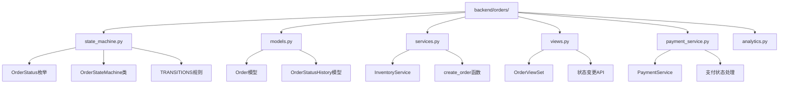
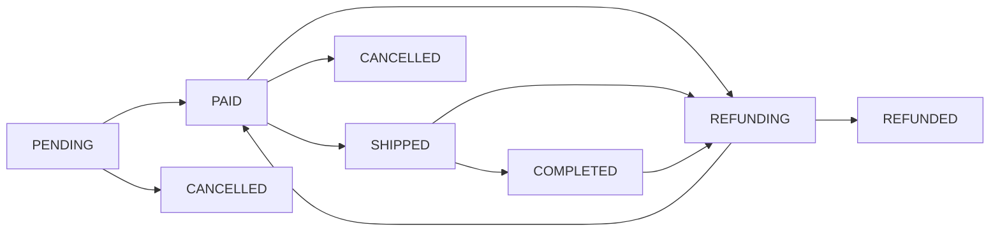
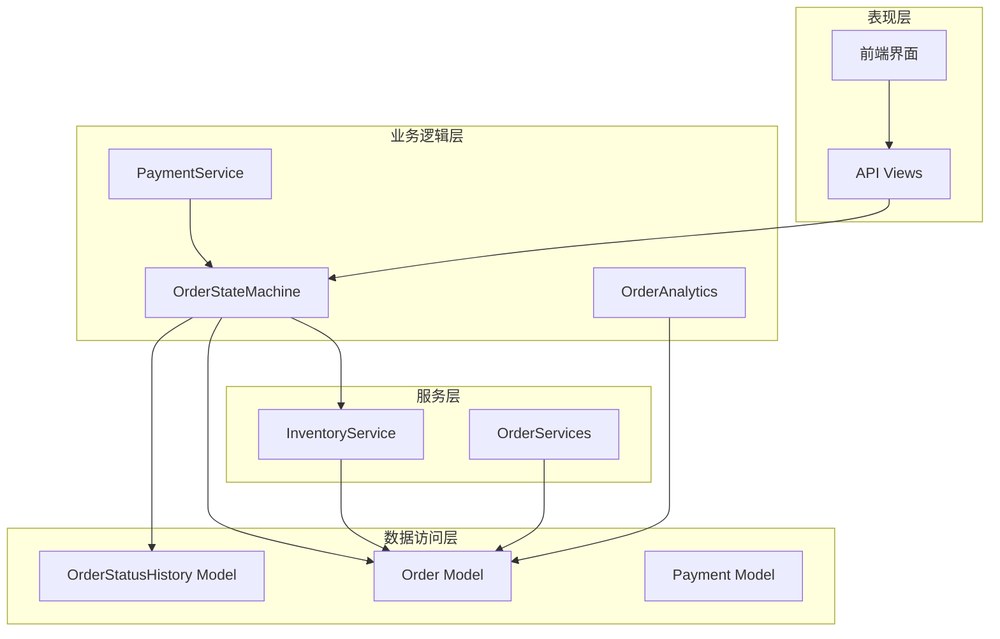
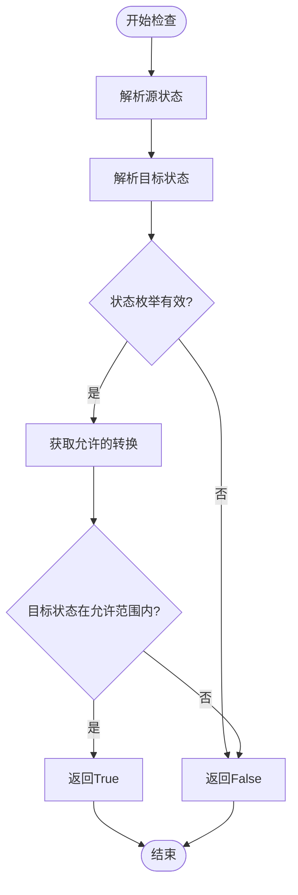
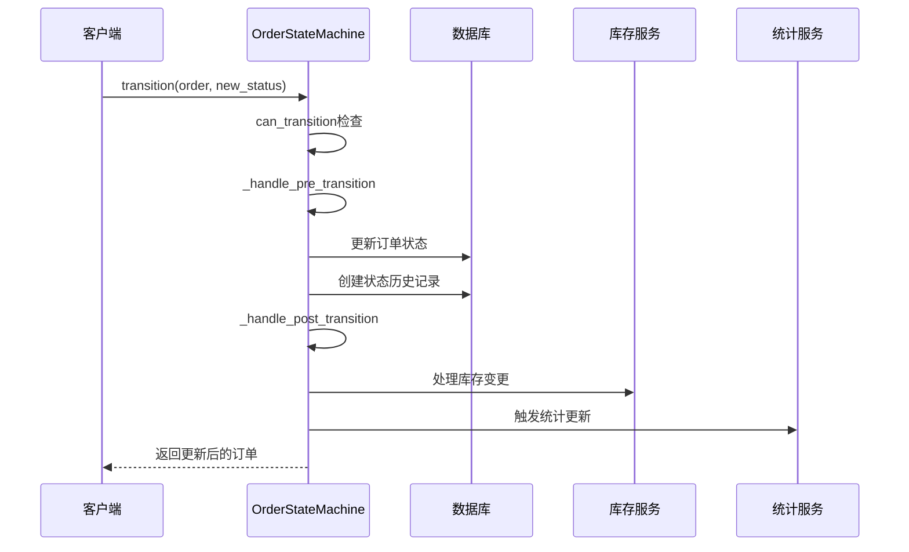
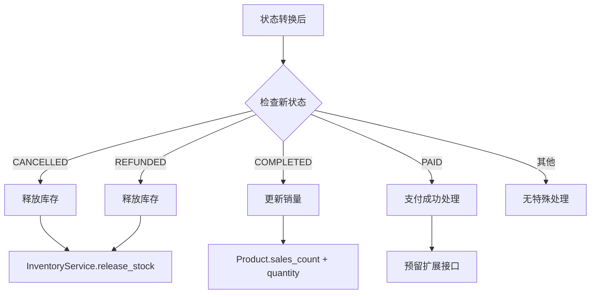
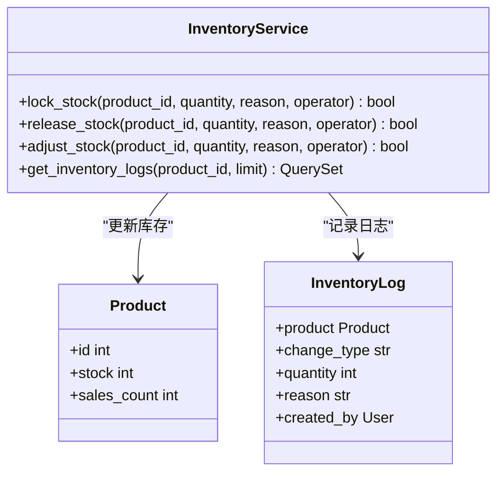
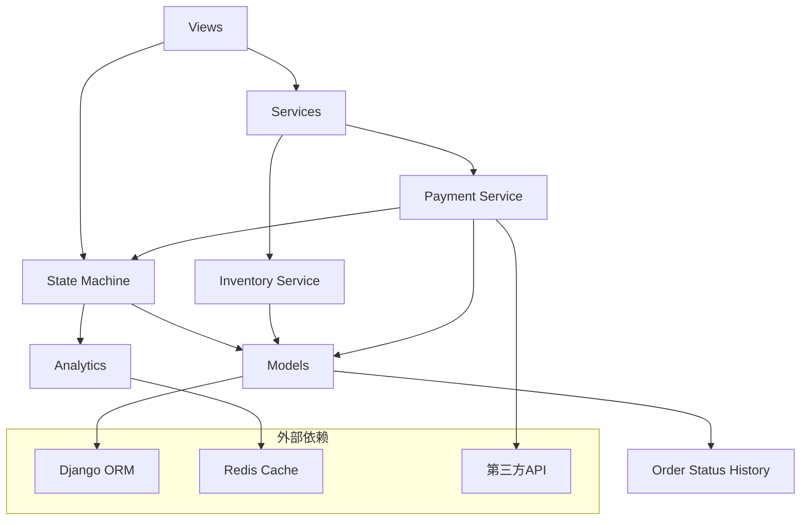

# 订单状态机

<cite>
**本文档引用的文件**
- [state_machine.py](file://backend/orders/state_machine.py)
- [models.py](file://backend/orders/models.py)
- [services.py](file://backend/orders/services.py)
- [views.py](file://backend/orders/views.py)
- [payment_service.py](file://backend/orders/payment_service.py)
- [analytics.py](file://backend/orders/analytics.py)
</cite>

## 目录
1. [简介](#简介)
2. [项目结构](#项目结构)
3. [核心组件](#核心组件)
4. [架构概览](#架构概览)
5. [详细组件分析](#详细组件分析)
6. [依赖关系分析](#依赖关系分析)
7. [性能考虑](#性能考虑)
8. [故障排除指南](#故障排除指南)
9. [结论](#结论)

## 简介

订单状态机是电商系统中的核心业务逻辑组件，负责管理订单在整个生命周期中的状态流转。本文档详细介绍了订单状态机的设计理念、实现机制以及在实际业务场景中的应用。

订单状态机采用状态机模式，通过严格的规则控制订单状态的转换，确保业务逻辑的一致性和数据的完整性。系统定义了完整的订单状态体系，并通过TRANSITIONS字典精确控制状态间的合法转换路径。

## 项目结构

订单状态机相关的文件主要集中在`backend/orders/`目录下：

**图表来源**
- [state_machine.py](file://backend/orders/state_machine.py#L1-L289)
- [models.py](file://backend/orders/models.py#L1-L322)
- [views.py](file://backend/orders/views.py#L1-L200)

**章节来源**
- [state_machine.py](file://backend/orders/state_machine.py#L1-L50)
- [models.py](file://backend/orders/models.py#L1-L100)

## 核心组件

### OrderStatus枚举

OrderStatus枚举定义了订单的所有可能状态，每个状态都有明确的业务含义：

| 状态 | 值 | 业务含义 | 描述 |
|------|----|-----|-----|
| PENDING | 'pending' | 待支付 | 订单已创建，等待用户支付 |
| PAID | 'paid' | 待发货 | 支付成功，等待商家发货 |
| SHIPPED | 'shipped' | 待收货 | 商品已发货，等待用户确认收货 |
| COMPLETED | 'completed' | 已完成 | 用户确认收货，订单完成 |
| CANCELLED | 'cancelled' | 已取消 | 订单被取消，不可再变更 |
| REFUNDING | 'refunding' | 退款中 | 用户申请退款，处理中 |
| REFUNDED | 'refunded' | 已退款 | 退款已完成，不可再变更 |

### TRANSITIONS字典

TRANSITIONS字典定义了状态间的合法转换规则，确保业务逻辑的正确性：

**图表来源**
- [state_machine.py](file://backend/orders/state_machine.py#L34-L57)

**章节来源**
- [state_machine.py](file://backend/orders/state_machine.py#L14-L57)

## 架构概览

订单状态机采用分层架构设计，各层职责明确：

**图表来源**
- [views.py](file://backend/orders/views.py#L300-L400)
- [state_machine.py](file://backend/orders/state_machine.py#L25-L189)
- [services.py](file://backend/orders/services.py#L325-L500)

## 详细组件分析

### OrderStateMachine类

OrderStateMachine是状态机的核心类，负责管理状态转换的整个生命周期：

#### 核心方法

##### can_transition方法
检查状态转换是否合法，防止非法状态变更：

**图表来源**
- [state_machine.py](file://backend/orders/state_machine.py#L60-L76)

##### transition方法
执行状态转换，包含完整的事务处理和业务逻辑：

**图表来源**
- [state_machine.py](file://backend/orders/state_machine.py#L96-L154)

#### 状态转换后的业务逻辑

状态转换后会自动执行相应的业务逻辑：

**图表来源**
- [state_machine.py](file://backend/orders/state_machine.py#L178-L210)

**章节来源**
- [state_machine.py](file://backend/orders/state_machine.py#L25-L289)

### 订单模型(Order)

Order模型定义了订单的数据结构和基本属性：

#### 关键字段说明

| 字段 | 类型 | 描述 | 业务意义 |
|------|------|------|----------|
| status | CharField | 订单状态 | 控制状态机流转 |
| order_number | CharField | 订单号 | 唯一标识订单 |
| user | ForeignKey | 用户关联 | 订单归属 |
| product | ForeignKey | 商品关联 | 订单内容 |
| quantity | PositiveIntegerField | 商品数量 | 订单规模 |
| total_amount | DecimalField | 总金额 | 订单价值 |
| created_at | DateTimeField | 创建时间 | 订单生命周期起点 |

**章节来源**
- [models.py](file://backend/orders/models.py#L13-L70)

### 库存管理服务

InventoryService提供了完整的库存管理功能：

#### 核心功能

**图表来源**
- [services.py](file://backend/orders/services.py#L325-L470)

**章节来源**
- [services.py](file://backend/orders/services.py#L325-L500)

## 依赖关系分析

订单状态机的依赖关系体现了清晰的分层架构：

**图表来源**
- [views.py](file://backend/orders/views.py#L1-L50)
- [state_machine.py](file://backend/orders/state_machine.py#L1-L20)
- [services.py](file://backend/orders/services.py#L1-L20)

**章节来源**
- [views.py](file://backend/orders/views.py#L1-L100)
- [state_machine.py](file://backend/orders/state_machine.py#L1-L50)

## 性能考虑

### 缓存策略

系统采用多层缓存策略提升性能：

1. **状态转换缓存**：缓存状态转换规则，避免重复解析
2. **统计缓存**：缓存销售统计、热销商品等数据
3. **库存缓存**：缓存库存信息，减少数据库查询

### 并发控制

通过数据库事务和行锁确保并发安全性：

- 使用`@transaction.atomic`确保状态转换的原子性
- 使用`select_for_update()`锁定库存记录
- 防止并发修改导致的数据不一致

### 查询优化

- 为订单状态建立索引，加速状态筛选
- 使用select_related和prefetch_related优化查询
- 实现分页查询，避免大量数据加载

## 故障排除指南

### 常见状态转换错误

#### 错误：不允许的状态转换
**原因**：尝试从当前状态转换到非法的目标状态
**解决方案**：检查TRANSITIONS字典，确认状态转换规则

#### 错误：库存不足
**原因**：订单创建或支付时库存不足以满足需求
**解决方案**：检查库存服务，确保库存充足

#### 错误：并发冲突
**原因**：多个请求同时修改同一订单状态
**解决方案**：使用数据库事务和行锁保护关键操作

### 调试技巧

1. **查看状态历史**：通过OrderStatusHistory模型追踪状态变更
2. **检查日志**：查看系统日志定位问题根源
3. **验证规则**：使用can_transition方法验证状态转换合法性

**章节来源**
- [state_machine.py](file://backend/orders/state_machine.py#L118-L124)
- [services.py](file://backend/orders/services.py#L470-L500)

## 结论

订单状态机作为电商系统的核心组件，通过严格的状态规则和完善的业务逻辑，确保了订单处理的正确性和一致性。系统采用分层架构设计，职责分离明确，具有良好的可扩展性和维护性。

### 主要优势

1. **状态规则明确**：通过TRANSITIONS字典精确控制状态转换
2. **业务逻辑完整**：自动处理库存、统计等业务逻辑
3. **事务安全**：使用数据库事务确保数据一致性
4. **性能优化**：多层缓存和查询优化提升系统性能
5. **易于扩展**：清晰的架构便于添加新的状态和业务逻辑

### 最佳实践建议

1. **状态设计**：保持状态简洁，避免过度细分
2. **错误处理**：完善异常处理机制，确保系统稳定性
3. **监控告警**：建立状态转换监控，及时发现异常
4. **文档维护**：定期更新状态机文档，保持信息同步

订单状态机的设计体现了现代电商系统对业务复杂性的有效管理，为构建可靠的在线购物平台奠定了坚实基础。