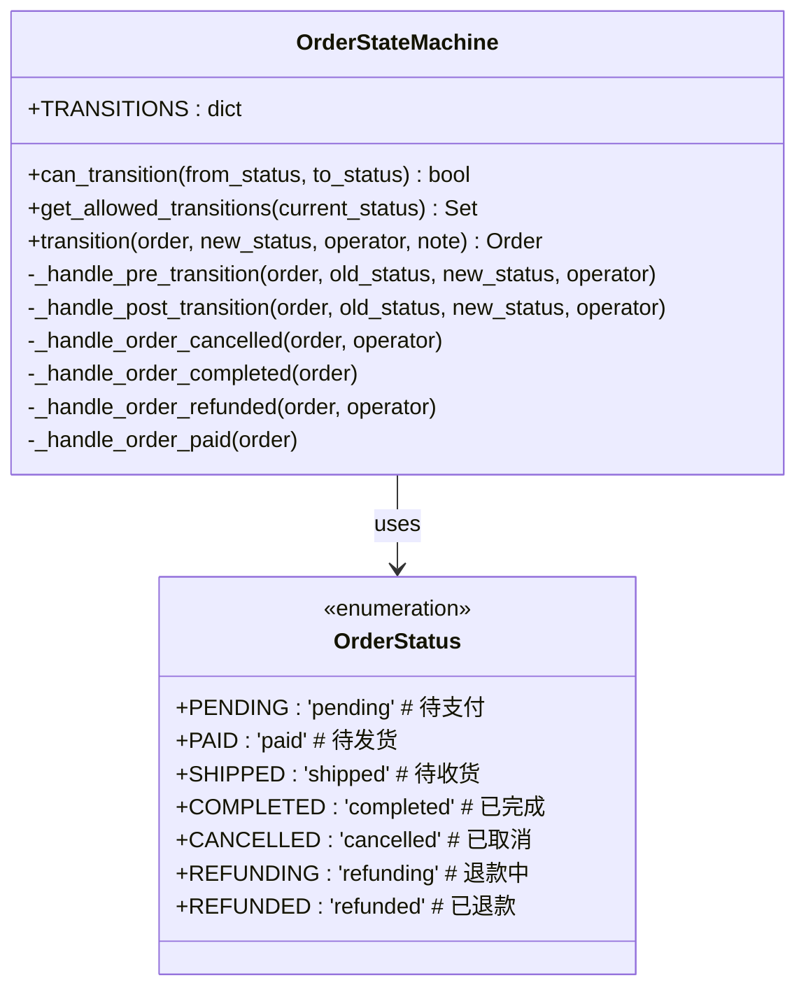
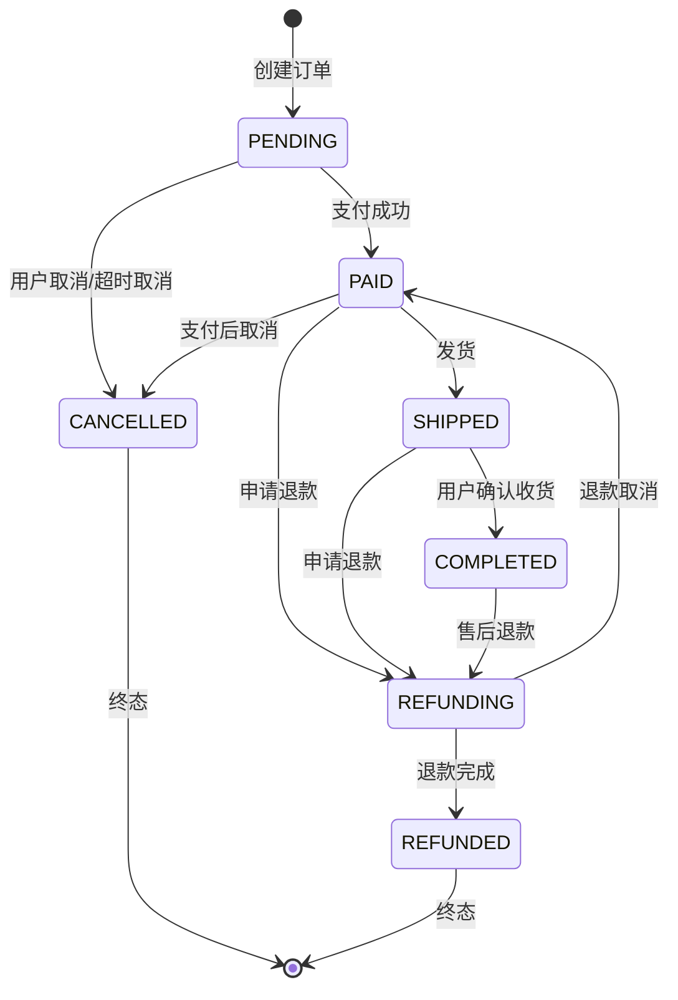
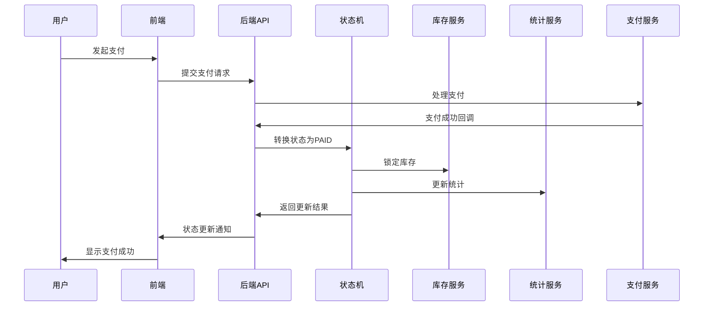

# 订单状态枚举详细文档

<cite>
**本文档引用的文件**
- [state_machine.py](file://backend/orders/state_machine.py)
- [models.py](file://backend/orders/models.py)
- [analytics.py](file://backend/orders/analytics.py)
- [services.py](file://backend/orders/services.py)
- [payment_service.py](file://backend/orders/payment_service.py)
- [cancel_unpaid_orders.py](file://backend/orders/management/commands/cancel_unpaid_orders.py)
- [index.tsx](file://frontend/src/pages/order-list/index.tsx)
- [index.tsx](file://merchant/src/pages/Orders/index.tsx)
- [order.ts](file://frontend/src/services/order.ts)
</cite>

## 目录
1. [概述](#概述)
2. [状态枚举定义](#状态枚举定义)
3. [状态流转图](#状态流转图)
4. [状态详细说明](#状态详细说明)
5. [数据库存储方式](#数据库存储方式)
6. [前端展示机制](#前端展示机制)
7. [业务逻辑联动](#业务逻辑联动)
8. [状态转换规则](#状态转换规则)
9. [监控与分析](#监控与分析)
10. [最佳实践建议](#最佳实践建议)

## 概述

订单状态枚举是电商业务系统的核心组件，用于管理订单在整个生命周期中的状态变化。该系统采用状态机模式，确保订单状态的合法流转，同时提供完整的业务逻辑支持和监控能力。

### 核心特性

- **类型安全**：使用Python枚举确保状态值的唯一性和类型安全
- **状态机约束**：严格的转换规则防止非法状态流转
- **业务逻辑集成**：每个状态转换触发相应的业务操作
- **历史追踪**：完整的状态变更记录便于审计和问题排查
- **实时监控**：支持状态分布统计和实时监控

## 状态枚举定义

系统定义了七个核心订单状态，每个状态都有明确的业务含义和使用场景。



**图表来源**
- [state_machine.py](file://backend/orders/state_machine.py#L14-L23)

**章节来源**
- [state_machine.py](file://backend/orders/state_machine.py#L14-L23)

## 状态流转图

订单状态之间的转换遵循严格的业务规则，确保系统的数据一致性和业务逻辑正确性。



**图表来源**
- [state_machine.py](file://backend/orders/state_machine.py#L34-L57)

## 状态详细说明

### PENDING（待支付）

**业务含义**：订单已创建但尚未完成支付

**使用场景**：
- 用户下单后立即进入此状态
- 购物车结算完成后
- 订单初始化阶段

**流转条件**：
- 支付成功 → PAID
- 用户主动取消 → CANCELLED
- 支付超时自动取消

**业务逻辑**：
- 锁定商品库存
- 设置支付超时时间
- 触发支付提醒机制

**数据库字段**：
```python
status = models.CharField(max_length=20, choices=STATUS_CHOICES, default='pending')
```

### PAID（待发货）

**业务含义**：支付已完成，等待商家发货

**使用场景**：
- 用户完成支付后
- 商家确认收款后
- 准备发货阶段

**流转条件**：
- 发货 → SHIPPED
- 申请退款 → REFUNDING
- 取消订单 → CANCELLED

**业务逻辑**：
- 释放购物车商品
- 更新商品销量统计
- 触发发货准备流程
- 记录支付成功事件

### SHIPPED（待收货）

**业务含义**：商品已发货，等待用户确认收货

**使用场景**：
- 商家完成打包发货
- 物流公司揽件
- 运输途中状态

**流转条件**：
- 用户确认收货 → COMPLETED
- 申请退款 → REFUNDING

**业务逻辑**：
- 更新物流信息
- 记录发货时间
- 触发物流跟踪
- 准备售后服务

### COMPLETED（已完成）

**业务含义**：订单已完成，交易结束

**使用场景**：
- 用户确认收货
- 自动确认收货（超时后）
- 交易完成阶段

**流转条件**：
- 售后退款 → REFUNDING

**业务逻辑**：
- 更新商品销量统计
- 触发评价邀请
- 计算用户积分
- 影响商品排名

### CANCELLED（已取消）

**业务含义**：订单已被取消，交易终止

**使用场景**：
- 用户主动取消
- 支付超时自动取消
- 系统异常导致取消

**流转条件**：
- 无后续流转（终态）

**业务逻辑**：
- 释放锁定的库存
- 记录取消原因
- 更新用户行为统计
- 清理相关缓存

### REFUNDING（退款中）

**业务含义**：订单正在处理退款流程

**使用场景**：
- 用户申请退款
- 商家同意退款
- 退款处理中

**流转条件**：
- 退款完成 → REFUNDED
- 退款取消 → PAID

**业务逻辑**：
- 锁定退款金额
- 触发退款处理流程
- 记录退款进度
- 通知相关方

### REFUNDED（已退款）

**业务含义**：退款已完成，交易完全终止

**使用场景**：
- 退款处理完成
- 资金退回用户账户
- 交易彻底结束

**流转条件**：
- 无后续流转（终态）

**业务逻辑**：
- 释放发货库存
- 更新财务统计
- 记录退款完成
- 清理相关数据

**章节来源**
- [state_machine.py](file://backend/orders/state_machine.py#L15-L23)
- [models.py](file://backend/orders/models.py#L14-L22)

## 数据库存储方式

订单状态在数据库中以字符串形式存储，使用固定长度的字符字段确保查询效率和存储一致性。

### 字段定义

```python
# 在Order模型中的定义
status = models.CharField(max_length=20, choices=STATUS_CHOICES, default='pending', verbose_name='订单状态')

# 状态选项定义
STATUS_CHOICES = [
    ('pending', '待支付'),
    ('paid', '待发货'),
    ('shipped', '待收货'),
    ('completed', '已完成'),
    ('cancelled', '已取消'),
    ('refunding', '退款中'),
    ('refunded', '已退款'),
]
```

### 存储特点

- **固定长度**：最大20个字符，确保索引效率
- **枚举化**：通过choices限制有效值范围
- **国际化**：提供中文标签便于前端展示
- **默认值**：新订单默认为'pending'

### 索引设计

```python
# 在Order模型中的索引定义
class Meta:
    indexes = [
        models.Index(fields=['status']),  # 状态查询索引
        models.Index(fields=['created_at']),  # 时间排序索引
        models.Index(fields=['user']),  # 用户查询索引
    ]
```

**章节来源**
- [models.py](file://backend/orders/models.py#L14-L24)

## 前端展示机制

前端系统通过多种方式展示订单状态，包括订单列表、订单详情和商户后台。

### 订单列表页面

```typescript
// 前端状态映射
const statusMap: any = {
    pending: { text: '待支付', color: 'orange' },
    paid: { text: '已支付', color: 'blue' },
    shipped: { text: '已发货', color: 'cyan' },
    completed: { text: '已完成', color: 'green' },
    cancelled: { text: '已取消', color: 'red' },
    refunding: { text: '退款中', color: 'purple' },
    refunded: { text: '已退款', color: 'magenta' },
};
```

### 订单详情页面

```typescript
// 状态文本显示
<View className='status-text'>{getOrderStatusText(order.status)}</View>

// 状态图标显示
{order.status === 'completed' && '✨'}
{order.status === 'cancelled' && '❌'}
```

### 商户后台

商户管理系统提供了更丰富的状态展示和操作功能：

```typescript
// 状态标签显示
<Tag color={statusMap[currentOrder.status]?.color}>
    {statusMap[currentOrder.status]?.text}
</Tag>
```

### 状态筛选功能

前端支持按状态筛选订单：

```typescript
// 订单列表状态筛选
const handleTabChange = (key: string) => {
    setStatus(key)
    setPage(1)
}

// API请求参数
const params: any = { 
    page: pageNum, 
    page_size: 20 
}
if (status) params.status = status
```

**章节来源**
- [index.tsx](file://frontend/src/pages/order-list/index.tsx#L71-L74)
- [index.tsx](file://merchant/src/pages/Orders/index.tsx#L9-L17)

## 业务逻辑联动

订单状态的变化会触发一系列复杂的业务逻辑，确保系统的完整性和用户体验。

### 状态转换流程



**图表来源**
- [payment_service.py](file://backend/orders/payment_service.py#L185-L191)
- [state_machine.py](file://backend/orders/state_machine.py#L118-L154)

### 库存管理联动

不同状态下的库存处理策略：

```python
@classmethod
def _handle_post_transition(cls, order, old_status, new_status, operator):
    """状态转换后的业务逻辑处理"""
    
    # 订单被取消时，释放库存
    if new_status == OrderStatus.CANCELLED.value:
        cls._handle_order_cancelled(order, operator)
    
    # 订单完成时，更新商品销量
    elif new_status == OrderStatus.COMPLETED.value:
        cls._handle_order_completed(order)
    
    # 退款完成时，释放库存
    elif new_status == OrderStatus.REFUNDED.value:
        cls._handle_order_refunded(order, operator)
    
    # 订单支付成功时，更新商品浏览次数
    elif new_status == OrderStatus.PAID.value:
        cls._handle_order_paid(order)
```

### 业务操作详解

#### 库存释放机制

```python
@staticmethod
@transaction.atomic
def release_stock(product_id: int, quantity: int, reason: str = 'order_cancelled', operator=None):
    """释放库存"""
    product = Product.objects.select_for_update().get(id=product_id)
    
    # 增加库存
    product.stock = F('stock') + quantity
    product.save(update_fields=['stock'])
    
    # 记录库存变更
    InventoryLog.objects.create(
        product=product,
        change_type='release',
        quantity=quantity,
        reason=reason,
        created_by=operator
    )
```

#### 销量统计更新

```python
@classmethod
def _handle_order_completed(cls, order):
    """处理订单完成"""
    from catalog.models import Product
    from django.db.models import F
    
    try:
        Product.objects.filter(id=order.product_id).update(
            sales_count=F('sales_count') + order.quantity
        )
    except Exception as e:
        # 记录错误但不中断流程
        print(f'更新销量失败: {str(e)}')
```

**章节来源**
- [state_machine.py](file://backend/orders/state_machine.py#L185-L289)
- [services.py](file://backend/orders/services.py#L374-L409)

## 状态转换规则

系统通过严格的状态转换规则确保业务逻辑的正确性，防止非法状态流转。

### 转换矩阵

```python
# 定义允许的状态转换规则
TRANSITIONS = {
    OrderStatus.PENDING: {
        OrderStatus.PAID,        # 支付成功
        OrderStatus.CANCELLED,   # 取消订单
    },
    OrderStatus.PAID: {
        OrderStatus.SHIPPED,     # 发货
        OrderStatus.REFUNDING,   # 申请退款
        OrderStatus.CANCELLED,   # 取消订单（支付后仍可取消）
    },
    OrderStatus.SHIPPED: {
        OrderStatus.COMPLETED,   # 订单完成
        OrderStatus.REFUNDING,   # 申请退款
    },
    OrderStatus.COMPLETED: {
        OrderStatus.REFUNDING,   # 售后退款
    },
    OrderStatus.REFUNDING: {
        OrderStatus.REFUNDED,    # 退款完成
        OrderStatus.PAID,        # 退款取消，恢复已支付状态
    },
    OrderStatus.CANCELLED: set(),      # 已取消，不允许转换
    OrderStatus.REFUNDED: set(),       # 已退款，不允许转换
}
```

### 转换验证机制

```python
@classmethod
def can_transition(cls, from_status: str, to_status: str) -> bool:
    """检查状态转换是否合法"""
    try:
        from_enum = OrderStatus(from_status)
        to_enum = OrderStatus(to_status)
        return to_enum in cls.TRANSITIONS.get(from_enum, set())
    except ValueError:
        # 无效的状态值
        return False
```

### 转换安全性

```python
@classmethod
@transaction.atomic
def transition(cls, order, new_status: str, operator=None, note: str = ''):
    """执行状态转换"""
    
    # 检查转换是否合法
    if not cls.can_transition(order.status, new_status):
        allowed = cls.get_allowed_transitions(order.status)
        raise ValueError(
            f'不允许从状态 "{order.status}" 转换到 "{new_status}"。'
            f'允许的转换: {allowed}'
        )
    
    # 执行转换
    old_status = order.status
    cls._handle_pre_transition(order, old_status, new_status, operator)
    
    # 更新状态
    order.status = new_status
    order.updated_at = timezone.now()
    order.save(update_fields=['status', 'updated_at'])
    
    # 记录历史
    from .models import OrderStatusHistory
    OrderStatusHistory.objects.create(
        order=order,
        from_status=old_status,
        to_status=new_status,
        operator=operator,
        note=note
    )
    
    # 执行后置处理
    cls._handle_post_transition(order, old_status, new_status, operator)
    
    return order
```

**章节来源**
- [state_machine.py](file://backend/orders/state_machine.py#L34-L57)
- [state_machine.py](file://backend/orders/state_machine.py#L60-L154)

## 监控与分析

系统提供了完善的监控和分析功能，支持实时查看订单状态分布和趋势。

### 状态分布统计

```python
@classmethod
def get_order_status_distribution(cls, start_date: Optional[str] = None, end_date: Optional[str] = None) -> Dict:
    """获取订单状态分布统计"""
    from orders.models import Order
    
    # 生成缓存键
    cache_key = f'order_status_dist_{start_date}_{end_date}'
    result = cache.get(cache_key)
    
    if result is not None:
        return result
    
    # 查询订单
    queryset = Order.objects.all()
    
    # 按日期范围筛选
    if start_date:
        queryset = queryset.filter(created_at__date__gte=start_date)
    if end_date:
        queryset = queryset.filter(created_at__date__lte=end_date)
    
    # 按状态分组统计
    result = {}
    for status, label in Order.STATUS_CHOICES:
        count = queryset.filter(status=status).count()
        result[status] = {
            'label': label,
            'count': count
        }
    
    # 缓存结果
    cache.set(cache_key, result, cls.CACHE_TIMEOUT)
    
    return result
```

### 实时监控指标

- **活跃订单数**：各状态订单的数量统计
- **转化率**：从PENDING到PAID的支付转化率
- **取消率**：订单取消的比例分析
- **退款率**：售后退款的比例统计
- **流转时间**：各状态间的平均停留时间

### 缓存策略

```python
# 缓存超时时间（5分钟）
CACHE_TIMEOUT = 300

@classmethod
def on_order_status_changed(cls, order_id: int):
    """订单状态变更时调用，用于清除相关缓存"""
    # 清除所有统计缓存，因为订单状态变更可能影响多个统计指标
    cls.invalidate_cache()
```

**章节来源**
- [analytics.py](file://backend/orders/analytics.py#L209-L255)
- [analytics.py](file://backend/orders/analytics.py#L302-L322)

## 最佳实践建议

基于系统的设计和实现，以下是使用订单状态枚举的最佳实践建议：

### 开发建议

1. **始终使用状态机进行状态转换**
   ```python
   # 正确做法
   OrderStateMachine.transition(order, 'paid', operator=user, note='支付成功')
   
   # 错误做法 - 直接修改状态
   order.status = 'paid'
   order.save()
   ```

2. **验证状态转换合法性**
   ```python
   if OrderStateMachine.can_transition(order.status, 'shipped'):
       OrderStateMachine.transition(order, 'shipped')
   else:
       # 处理非法转换情况
       raise ValueError('当前状态不允许转换到发货状态')
   ```

3. **处理异常情况**
   ```python
   try:
       OrderStateMachine.transition(order, 'completed')
   except ValueError as e:
       # 记录错误日志
       logger.error(f'状态转换失败: {str(e)}')
       # 采取适当的补救措施
   ```

### 前端展示建议

1. **使用统一的状态映射**
   ```typescript
   // 统一的状态映射配置
   const ORDER_STATUS_MAP = {
       pending: { text: '待支付', color: 'orange' },
       paid: { text: '已支付', color: 'blue' },
       // ... 其他状态
   }
   ```

2. **提供状态变更通知**
   ```typescript
   // 监听状态变更
   useEffect(() => {
       if (order.status !== prevStatus.current) {
           // 显示状态变更通知
           showToast(`订单状态变更为: ${ORDER_STATUS_MAP[order.status].text}`)
       }
   }, [order.status])
   ```

### 运维监控建议

1. **设置状态分布监控**
   - 监控各状态订单数量异常波动
   - 设置支付超时订单的告警
   - 跟踪退款率和取消率趋势

2. **定期清理历史数据**
   ```bash
   # 定期清理超过30天的状态历史记录
   python manage.py cleanup_order_history --days=30
   ```

3. **性能优化**
   - 为status字段添加数据库索引
   - 使用缓存减少频繁的状态统计查询
   - 定期归档历史订单数据

### 业务运营建议

1. **优化状态流转路径**
   - 分析各状态间的转化率，找出瓶颈环节
   - 优化支付流程，提高PENDING到PAID的转化率
   - 减少不必要的状态转换，简化用户体验

2. **制定状态处理策略**
   - 设置合理的支付超时时间
   - 制定清晰的退款政策和流程
   - 建立有效的订单催付机制

3. **监控关键指标**
   - 订单生命周期时间分析
   - 各状态的客户满意度调查
   - 异常状态订单的处理效率

通过遵循这些最佳实践，可以确保订单状态系统的稳定运行，提供良好的用户体验，并为业务决策提供准确的数据支持。