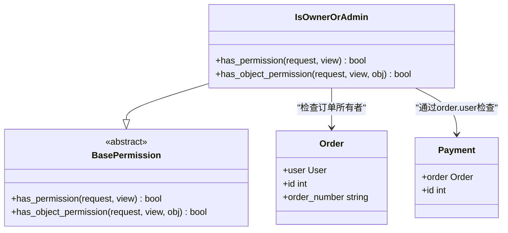
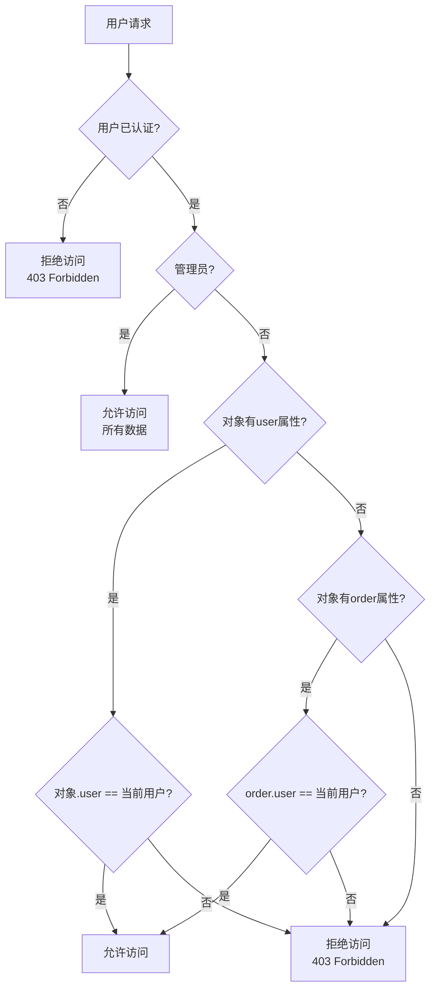
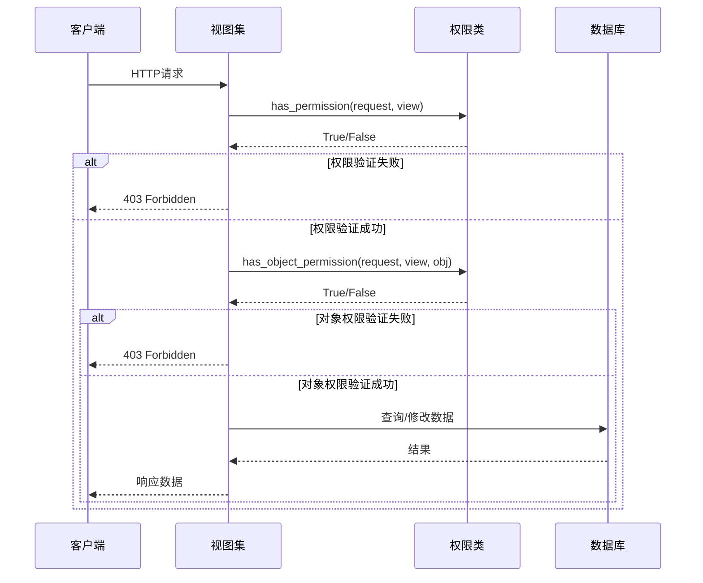

# 订单权限控制机制详细文档

<cite>
**本文档引用的文件**
- [backend/common/permissions.py](file://backend/common/permissions.py)
- [backend/orders/views.py](file://backend/orders/views.py)
- [backend/orders/models.py](file://backend/orders/models.py)
- [backend/users/models.py](file://backend/users/models.py)
- [backend/catalog/models.py](file://backend/catalog/models.py)
</cite>

## 目录
1. [概述](#概述)
2. [核心权限类分析](#核心权限类分析)
3. [订单视图集权限配置](#订单视图集权限配置)
4. [关键接口权限验证](#关键接口权限验证)
5. [权限控制流程详解](#权限控制流程详解)
6. [常见权限错误及解决方案](#常见权限错误及解决方案)
7. [最佳实践建议](#最佳实践建议)

## 概述

订单权限控制系统是电商系统中最重要的安全机制之一，它确保用户只能访问和操作自己的订单数据，同时为管理员提供必要的管理权限。本文档详细分析了系统中基于`IsOwnerOrAdmin`权限类的实现机制，以及在不同场景下的权限验证逻辑。

## 核心权限类分析

### IsOwnerOrAdmin权限类

`IsOwnerOrAdmin`是系统中最核心的自定义权限类，实现了"所有者或管理员"的访问控制模型。



**图表来源**
- [backend/common/permissions.py](file://backend/common/permissions.py#L11-L67)

#### 权限验证逻辑

权限类包含两个关键方法：

1. **has_permission方法**：验证用户是否已认证
2. **has_object_permission方法**：验证用户是否有权访问特定对象

**节来源**
- [backend/common/permissions.py](file://backend/common/permissions.py#L26-L67)

### 权限验证流程



**图表来源**
- [backend/common/permissions.py](file://backend/common/permissions.py#L40-L67)

## 订单视图集权限配置

### OrderViewSet权限设置

订单视图集采用统一的权限配置策略：

```python
# OrderViewSet权限配置
permission_classes = [IsOwnerOrAdmin]
```

这种配置意味着：
- 所有用户必须先登录才能访问订单数据
- 普通用户只能访问自己的订单
- 管理员可以访问所有订单

**节来源**
- [backend/orders/views.py](file://backend/orders/views.py#L22-L33)

### PaymentViewSet权限设置

支付视图集同样使用`IsOwnerOrAdmin`权限：

```python
# PaymentViewSet权限配置
permission_classes = [IsOwnerOrAdmin]
```

支付数据的权限验证逻辑：
- 普通用户只能访问与自己订单相关的支付记录
- 管理员可以访问所有支付记录

**节来源**
- [backend/orders/views.py](file://backend/orders/views.py#L782-L795)

### 查询集优化

为了提高性能，系统在视图集中实现了智能的查询集过滤：

```python
# OrderViewSet查询集优化
def get_queryset(self):
    user = self.request.user
    qs = Order.objects.all() if user.is_staff else Order.objects.filter(user=user)
    # 预加载相关数据
    qs = qs.select_related('user', 'product').prefetch_related('payments', 'status_history')
    return qs
```

**节来源**
- [backend/orders/views.py](file://backend/orders/views.py#L34-L96)

## 关键接口权限验证

### my_orders接口

`my_orders`是一个特殊的接口，它不需要额外的权限配置，因为查询集已经进行了权限过滤：

```python
@action(detail=False, methods=["get"], permission_classes=[IsAuthenticated])
def my_orders(self, request):
    """获取当前用户的订单列表"""
    queryset = self.filter_queryset(self.get_queryset())
    # 分页处理...
```

**权限特点**：
- 不需要额外的权限类装饰器
- 查询集自动过滤，确保用户只能看到自己的订单
- 支持多种筛选参数（状态、时间范围等）

**节来源**
- [backend/orders/views.py](file://backend/orders/views.py#L113-L134)

### 订单状态修改接口

#### status接口

```python
@action(detail=True, methods=['patch'], permission_classes=[IsOwnerOrAdmin])
def status(self, request, pk=None):
    """更新订单状态：管理员或订单所有者可操作"""
    # 权限验证由IsOwnerOrAdmin自动处理
    order = self.get_object()
    # 状态更新逻辑...
```

**权限特点**：
- 使用`IsOwnerOrAdmin`权限类
- 允许订单所有者和管理员修改订单状态
- 自动验证对象级别的权限

**节来源**
- [backend/orders/views.py](file://backend/orders/views.py#L97-L111)

#### cancel接口

```python
@action(detail=True, methods=['patch'], permission_classes=[IsAuthenticated])
def cancel(self, request, pk=None):
    """取消订单：本人或管理员可取消"""
    order = self.get_object()
    user = request.user
    if not (user.is_staff or order.user_id == user.id):
        return Response({"detail": "Not allowed"}, status=status.HTTP_403_FORBIDDEN)
    # 取消逻辑...
```

**权限特点**：
- 明确的权限检查逻辑
- 支持订单所有者和管理员取消订单
- 使用状态机进行状态转换

**节来源**
- [backend/orders/views.py](file://backend/orders/views.py#L307-L329)

#### ship和complete接口

```python
@action(detail=True, methods=['patch'], permission_classes=[IsAuthenticated])
def ship(self, request, pk=None):
    """发货：仅管理员可操作"""
    order = self.get_object()
    user = request.user
    if not user.is_staff:
        return Response({"detail": "Only admins can ship orders"}, status=status.HTTP_403_FORBIDDEN)
    # 发货逻辑...

@action(detail=True, methods=['patch'], permission_classes=[IsAuthenticated])
def complete(self, request, pk=None):
    """完成订单：仅管理员可操作"""
    order = self.get_object()
    user = request.user
    if not user.is_staff:
        return Response({"detail": "Only admins can complete orders"}, status=status.HTTP_403_FORBIDDEN)
    # 完成逻辑...
```

**权限特点**：
- 严格的管理员权限控制
- 状态转换的安全性保障
- 明确的错误提示信息

**节来源**
- [backend/orders/views.py](file://backend/orders/views.py#L331-L377)

### push_to_haier接口

```python
@action(detail=True, methods=['post'], permission_classes=[IsAdmin])
def push_to_haier(self, request, pk=None):
    """推送订单到海尔系统：仅管理员"""
    # 权限验证由IsAdmin自动处理
    order = self.get_object()
    # 海尔系统集成逻辑...
```

**权限特点**：
- 使用`IsAdmin`权限类
- 专门用于海尔系统的订单推送
- 严格的管理员访问控制

**节来源**
- [backend/orders/views.py](file://backend/orders/views.py#L378-L479)

## 权限控制流程详解

### 请求处理流程



**图表来源**
- [backend/common/permissions.py](file://backend/common/permissions.py#L26-L67)
- [backend/orders/views.py](file://backend/orders/views.py#L22-L644)

### 对象权限验证的具体实现

对于不同类型的订单相关对象，权限验证的实现略有差异：

#### 直接所有者对象（Order）

```python
# Order对象的权限验证
owner = getattr(obj, 'user', None)  # 直接获取user属性
return owner == request.user
```

#### 关联对象（Payment）

```python
# Payment对象的权限验证
if owner is None and hasattr(obj, 'order'):
    try:
        owner = obj.order.user  # 通过关联对象获取所有者
    except Exception:
        owner = None
return owner == request.user
```

**节来源**
- [backend/common/permissions.py](file://backend/common/permissions.py#L56-L67)

## 常见权限错误及解决方案

### 403 Forbidden错误场景

#### 场景1：普通用户尝试访问他人订单

**错误表现**：
```http
GET /api/orders/123/
Authorization: Bearer token
```
```json
{
    "detail": "You do not have permission to perform this action."
}
```

**原因分析**：
- 普通用户试图访问不属于自己的订单
- `IsOwnerOrAdmin`权限类检测到用户不是订单所有者且非管理员

**解决方案**：
```python
# 正确的做法是使用my_orders接口
GET /api/orders/my_orders/?order_id=123
Authorization: Bearer token
```

#### 场景2：非管理员尝试修改订单状态

**错误表现**：
```http
PATCH /api/orders/123/status/
Authorization: Bearer token
Content-Type: application/json

{
    "status": "cancelled"
}
```
```json
{
    "detail": "You do not have permission to perform this action."
}
```

**原因分析**：
- 普通用户试图修改订单状态
- 系统期望使用专门的cancel接口

**解决方案**：
```http
PATCH /api/orders/123/cancel/
Authorization: Bearer token
Content-Type: application/json

{
    "note": "个人原因取消"
}
```

#### 场景3：管理员尝试访问不存在的订单

**错误表现**：
```http
GET /api/orders/999/
Authorization: Bearer admin_token
```
```json
{
    "detail": "Not found."
}
```

**原因分析**：
- 管理员尝试访问不存在的订单
- Django REST framework的404错误而非403

**解决方案**：
- 确保订单ID的有效性
- 在API设计中考虑更友好的错误提示

### 权限验证最佳实践

#### 1. 明确的权限边界

```python
# 推荐：使用适当的权限类
@action(detail=True, methods=['patch'], permission_classes=[IsAuthenticated])
def cancel(self, request, pk=None):
    """明确的权限控制"""

# 不推荐：过度复杂的权限逻辑
def cancel(self, request, pk=None):
    """手动检查权限，容易出错"""
    if request.user.is_staff or request.user.id == self.get_object().user_id:
        # 权限检查逻辑
```

#### 2. 适当的错误信息

```python
# 推荐：提供清晰的错误信息
if not user.is_staff:
    return Response(
        {"detail": "Only admins can complete orders"}, 
        status=status.HTTP_403_FORBIDDEN
    )

# 不推荐：模糊的错误信息
return Response({"detail": "Not allowed"})
```

#### 3. 权限验证的顺序

```python
# 推荐：先验证基本权限，再验证对象权限
def get_queryset(self):
    # 1. 验证用户已登录
    if not self.request.user.is_authenticated:
        raise PermissionDenied()
    
    # 2. 根据用户角色过滤数据
    user = self.request.user
    return Order.objects.filter(user=user)
```

## 最佳实践建议

### 1. 权限设计原则

#### 最小权限原则
- 用户只能访问完成任务所需的最小数据集
- 管理员权限应该严格限制在必要范围内

#### 权限分离
- 将不同类型的权限分离到不同的权限类中
- 避免单一权限类承担过多职责

### 2. 性能优化

#### 查询集优化
```python
# 推荐：在视图中优化查询集
def get_queryset(self):
    user = self.request.user
    qs = Order.objects.all() if user.is_staff else Order.objects.filter(user=user)
    # 预加载相关数据
    qs = qs.select_related('user', 'product').prefetch_related('payments')
    return qs
```

#### 缓存策略
```python
# 推荐：对频繁访问的数据进行缓存
from django.core.cache import cache

def get_user_orders(self, user):
    cache_key = f'user_orders_{user.id}'
    orders = cache.get(cache_key)
    if not orders:
        orders = Order.objects.filter(user=user)
        cache.set(cache_key, orders, timeout=300)  # 5分钟缓存
    return orders
```

### 3. 安全增强

#### 速率限制
```python
# 推荐：对敏感操作实施速率限制
from rest_framework.throttling import UserRateThrottle

class PaymentRateThrottle(UserRateThrottle):
    rate = '10/min'  # 每分钟最多10次请求

class PaymentViewSet(viewsets.ModelViewSet):
    throttle_classes = [PaymentRateThrottle]
```

#### 审计日志
```python
# 推荐：记录权限相关的操作
import logging

logger = logging.getLogger(__name__)

def cancel_order(self, request, pk=None):
    order = self.get_object()
    if not (request.user.is_staff or order.user_id == request.user.id):
        logger.warning(f"Unauthorized access attempt: user={request.user.id}, order={pk}")
        return Response({"detail": "Not allowed"}, status=status.HTTP_403_FORBIDDEN)
```

### 4. 错误处理

#### 统一的错误响应格式
```python
# 推荐：使用统一的错误响应格式
from rest_framework.response import Response
from rest_framework import status

def handle_permission_error(self, message="Permission denied"):
    return Response(
        {"detail": message},
        status=status.HTTP_403_FORBIDDEN
    )
```

#### 用户友好的错误提示
```python
# 推荐：提供具体的错误指导
try:
    order = Order.objects.get(id=pk, user=request.user)
except Order.DoesNotExist:
    return Response(
        {"detail": "该订单不存在或您没有权限访问"},
        status=status.HTTP_404_NOT_FOUND
    )
```

通过遵循这些最佳实践，可以构建一个既安全又高效的订单权限控制系统，确保用户数据的安全性和系统的可维护性。