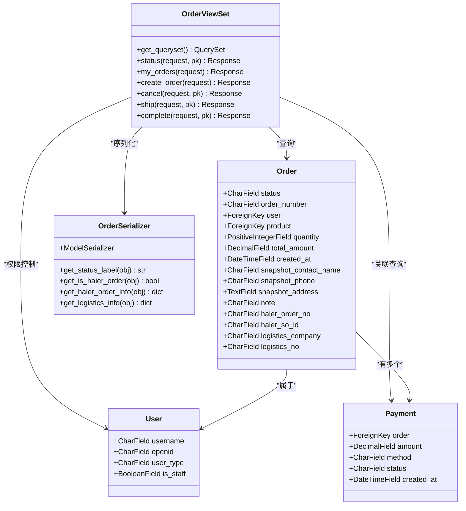
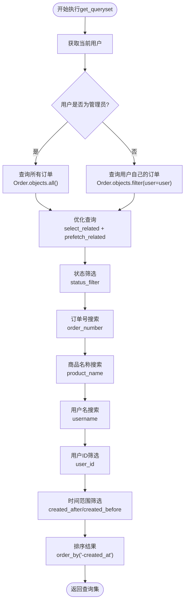
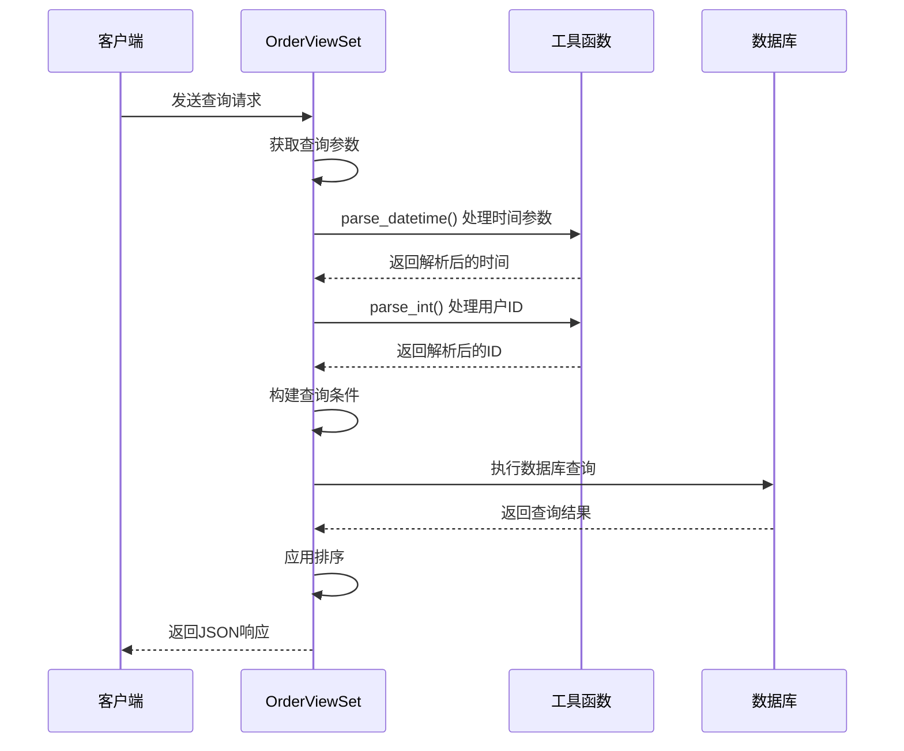
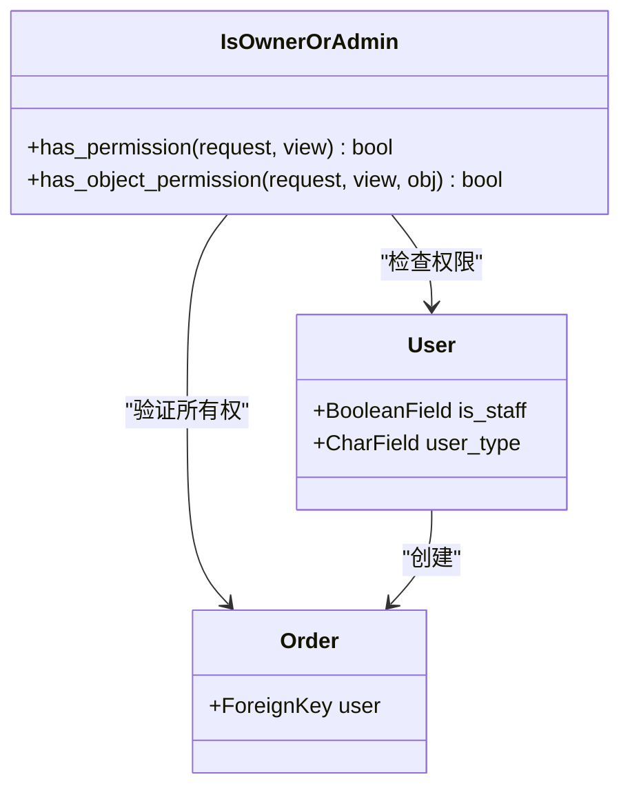

# 订单查询与筛选功能详细文档

<cite>
**本文档引用的文件**
- [backend/orders/views.py](file://backend/orders/views.py)
- [backend/orders/models.py](file://backend/orders/models.py)
- [backend/users/models.py](file://backend/users/models.py)
- [backend/common/utils.py](file://backend/common/utils.py)
- [backend/common/permissions.py](file://backend/common/permissions.py)
- [backend/orders/serializers.py](file://backend/orders/serializers.py)
- [backend/orders/urls.py](file://backend/orders/urls.py)
- [api.md](file://api.md)
</cite>

## 目录
1. [概述](#概述)
2. [核心架构](#核心架构)
3. [OrderViewSet.get_queryset方法详解](#orderviewsetget_queryset方法详解)
4. [查询参数详解](#查询参数详解)
5. [用户角色权限控制](#用户角色权限控制)
6. [数据库查询优化](#数据库查询优化)
7. [API调用示例](#api调用示例)
8. [性能优化建议](#性能优化建议)
9. [故障排除指南](#故障排除指南)
10. [总结](#总结)

## 概述

订单查询与筛选功能是电商品台的核心业务组件，基于Django REST Framework构建，提供了灵活的订单数据检索能力。该功能通过`OrderViewSet.get_queryset`方法实现了多维度的订单筛选，支持按状态、订单号、商品名称、用户名、用户ID和时间范围等多种条件进行查询。

### 主要特性

- **多维度筛选**：支持订单状态、订单号、商品名称、用户名、用户ID、创建时间范围等多条件组合查询
- **角色权限控制**：根据用户角色（普通用户/管理员）自动过滤数据集
- **查询性能优化**：通过select_related和prefetch_related优化数据库查询
- **RESTful API设计**：遵循REST规范，提供标准的HTTP接口
- **灵活的权限控制**：基于IsOwnerOrAdmin权限类实现细粒度访问控制

## 核心架构



**图表来源**
- [backend/orders/views.py](file://backend/orders/views.py#L23-L96)
- [backend/orders/models.py](file://backend/orders/models.py#L13-L71)
- [backend/users/models.py](file://backend/users/models.py#L31-L71)

**章节来源**
- [backend/orders/views.py](file://backend/orders/views.py#L23-L96)
- [backend/orders/models.py](file://backend/orders/models.py#L13-L71)

## OrderViewSet.get_queryset方法详解

`get_queryset`方法是订单查询功能的核心，实现了动态查询集构建和权限控制逻辑。

### 方法结构分析



**图表来源**
- [backend/orders/views.py](file://backend/orders/views.py#L35-L96)

### 关键实现细节

#### 1. 权限基础的数据过滤

方法首先根据用户角色确定查询范围：
- **管理员用户**：`Order.objects.all()` - 获取所有订单
- **普通用户**：`Order.objects.filter(user=user)` - 仅获取自己创建的订单

#### 2. 查询优化策略

通过`select_related`和`prefetch_related`优化数据库查询：

```python
qs = qs.select_related('user', 'product').prefetch_related('payments', 'status_history')
```

这种优化策略：
- **select_related**：用于一对一和多对一关系，减少数据库查询次数
- **prefetch_related**：用于多对多和反向外键关系，预先加载相关数据

#### 3. 动态查询条件构建

方法按照优先级顺序依次应用查询条件，每个条件都包含异常处理机制，确保查询的健壮性。

**章节来源**
- [backend/orders/views.py](file://backend/orders/views.py#L35-L96)

## 查询参数详解

### 支持的查询参数表

| 参数名 | 类型 | 描述 | 示例 | 权限要求 |
|--------|------|------|------|----------|
| `status` | String | 订单状态筛选 | `?status=pending` | 全部用户 |
| `order_number` | String | 订单号模糊搜索 | `?order_number=123` | 全部用户 |
| `product_name` | String | 商品名称模糊搜索 | `?product_name=冰箱` | 全部用户 |
| `username` | String | 用户名模糊搜索（仅管理员） | `?username=admin` | 管理员 |
| `user_id` | Integer | 按用户ID筛选（仅管理员） | `?user_id=123` | 管理员 |
| `created_after` | DateTime | 创建时间范围（起始） | `?created_after=2024-01-01` | 全部用户 |
| `created_before` | DateTime | 创建时间范围（结束） | `?created_before=2024-12-31` | 全部用户 |

### 参数处理逻辑



**图表来源**
- [backend/orders/views.py](file://backend/orders/views.py#L42-L96)
- [backend/common/utils.py](file://backend/common/utils.py#L28-L33)

### 参数验证与处理

#### 时间范围参数处理

```python
# 创建时间范围筛选
created_after = self.request.query_params.get('created_after')
created_before = self.request.query_params.get('created_before')

if created_after:
    dt = parse_datetime(created_after)
    if dt:
        qs = qs.filter(created_at__gte=dt)

if created_before:
    dt = parse_datetime(created_before)
    if dt:
        qs = qs.filter(created_at__lte=dt)
```

#### 用户ID参数处理

```python
# 按用户ID筛选（仅管理员有效）
user_id = self.request.query_params.get('user_id')
if user.is_staff and user_id:
    uid = parse_int(user_id)
    if uid is not None:
        qs = qs.filter(user_id=uid)
```

**章节来源**
- [backend/orders/views.py](file://backend/orders/views.py#L42-L96)
- [backend/common/utils.py](file://backend/common/utils.py#L15-L33)

## 用户角色权限控制

### 权限架构设计



**图表来源**
- [backend/common/permissions.py](file://backend/common/permissions.py#L12-L67)
- [backend/users/models.py](file://backend/users/models.py#L31-L71)

### 权限控制逻辑

#### 1. 角色权限分级

- **管理员用户**（`is_staff=True`）：
  - 可以访问所有订单数据
  - 可以使用所有查询参数
  - 可以执行所有订单操作

- **普通用户**：
  - 仅能访问自己创建的订单
  - 可以使用公开的查询参数
  - 受到数据范围限制

#### 2. 对象级权限验证

```python
def has_object_permission(self, request, view, obj):
    # 管理员拥有所有对象的访问权限
    if request.user and request.user.is_staff:
        return True
    
    # 获取对象的所有者
    owner = getattr(obj, 'user', None)
    
    # 如果对象没有直接的user字段，尝试从相关对象获取
    if owner is None and hasattr(obj, 'order'):
        try:
            owner = obj.order.user
        except Exception:
            owner = None
    
    # 检查当前用户是否是所有者
    return owner == request.user
```

#### 3. 查询参数权限控制

某些查询参数仅对管理员开放：

```python
# 用户名搜索（管理员可用）：模糊匹配 user.username
username = self.request.query_params.get('username')
if self.request.user.is_staff and username:
    qs = qs.filter(user__username__icontains=username)

# 按用户ID筛选（仅管理员有效）
user_id = self.request.query_params.get('user_id')
if user.is_staff and user_id:
    uid = parse_int(user_id)
    if uid is not None:
        qs = qs.filter(user_id=uid)
```

**章节来源**
- [backend/common/permissions.py](file://backend/common/permissions.py#L12-L67)
- [backend/orders/views.py](file://backend/orders/views.py#L60-L76)

## 数据库查询优化

### 查询优化策略

#### 1. 预加载策略

```python
# 优化查询 by prefetching related objects
qs = qs.select_related('user', 'product').prefetch_related('payments', 'status_history')
```

这种优化策略的优势：
- **减少N+1查询问题**：通过预加载减少数据库查询次数
- **提高查询性能**：减少数据库往返次数
- **内存使用优化**：一次性加载相关数据

#### 2. 数据库索引设计

订单模型定义了多个复合索引：

```python
class Meta:
    indexes = [
        models.Index(fields=['status']),
        models.Index(fields=['created_at']),
        models.Index(fields=['user']),
        models.Index(fields=['haier_order_no']),
        models.Index(fields=['haier_so_id']),
    ]
```

这些索引的作用：
- **status索引**：加速状态筛选查询
- **created_at索引**：加速时间范围查询
- **user索引**：加速用户相关查询
- **海尔订单相关索引**：优化海尔系统集成查询

#### 3. 查询条件优化


**图表来源**
- [backend/orders/models.py](file://backend/orders/models.py#L75-L81)

### 性能监控指标

| 指标类型 | 监控内容 | 优化目标 |
|----------|----------|----------|
| 查询时间 | 单次查询耗时 | < 100ms |
| 数据库连接数 | 并发查询数量 | < 50 concurrent |
| 内存使用 | 预加载数据大小 | < 10MB per request |
| 索引命中率 | 查询使用索引比例 | > 95% |

**章节来源**
- [backend/orders/models.py](file://backend/orders/models.py#L75-L81)
- [backend/orders/views.py](file://backend/orders/views.py#L39-L41)

## API调用示例

### 基础查询示例

#### 1. 获取当前用户订单列表

```bash
# 获取所有订单
curl -X GET "http://localhost:8000/api/orders/" \
  -H "Authorization: Bearer YOUR_TOKEN"

# 获取特定状态的订单
curl -X GET "http://localhost:8000/api/orders/?status=pending" \
  -H "Authorization: Bearer YOUR_TOKEN"

# 分页获取订单
curl -X GET "http://localhost:8000/api/orders/?page=2&page_size=50" \
  -H "Authorization: Bearer YOUR_TOKEN"
```

#### 2. 高级筛选查询

```bash
# 模糊搜索订单号
curl -X GET "http://localhost:8000/api/orders/?order_number=123" \
  -H "Authorization: Bearer YOUR_TOKEN"

# 模糊搜索商品名称
curl -X GET "http://localhost:8000/api/orders/?product_name=冰箱" \
  -H "Authorization: Bearer YOUR_TOKEN"

# 时间范围查询
curl -X GET "http://localhost:8000/api/orders/?created_after=2024-01-01&created_before=2024-12-31" \
  -H "Authorization: Bearer YOUR_TOKEN"
```

#### 3. 管理员专用查询

```bash
# 按用户名搜索（仅管理员）
curl -X GET "http://localhost:8000/api/orders/?username=admin" \
  -H "Authorization: Bearer ADMIN_TOKEN"

# 按用户ID筛选（仅管理员）
curl -X GET "http://localhost:8000/api/orders/?user_id=123" \
  -H "Authorization: Bearer ADMIN_TOKEN"
```

### 实际业务场景示例

#### 场景1：订单统计分析

```bash
# 获取指定时间段内的订单统计
curl -X GET "http://localhost:8000/api/orders/?created_after=2024-01-01&created_before=2024-01-31&status=completed" \
  -H "Authorization: Bearer ADMIN_TOKEN"
```

#### 场景2：客户服务查询

```bash
# 查询特定客户的订单
curl -X GET "http://localhost:8000/api/orders/?username=johndoe&status=paid" \
  -H "Authorization: Bearer ADMIN_TOKEN"
```

#### 场景3：运营监控

```bash
# 获取待处理订单
curl -X GET "http://localhost:8000/api/orders/?status=pending&status=paid" \
  -H "Authorization: Bearer ADMIN_TOKEN"
```

**章节来源**
- [api.md](file://api.md#L250-L261)
- [backend/orders/views.py](file://backend/orders/views.py#L113-L134)

## 性能优化建议

### 1. 数据库层面优化

#### 索引优化策略

```sql
-- 为常用查询字段添加复合索引
CREATE INDEX idx_order_status_created ON orders_order(status, created_at);
CREATE INDEX idx_order_user_status ON orders_order(user_id, status);
CREATE INDEX idx_order_created_status ON orders_order(created_at, status);
```

#### 查询计划分析

```python
# 在开发环境中启用查询日志
DEBUG=True
LOGGING = {
    'version': 1,
    'filters': {
        'require_debug_true': {
            '()': 'django.utils.log.RequireDebugTrue',
        }
    },
    'handlers': {
        'console': {
            'level': 'DEBUG',
            'filters': ['require_debug_true'],
            'class': 'logging.StreamHandler',
        }
    },
    'loggers': {
        'django.db.backends': {
            'level': 'DEBUG',
            'handlers': ['console'],
        }
    }
}
```

### 2. 应用层面优化

#### 缓存策略

```python
from django.core.cache import cache

def get_filtered_orders_cached(request):
    # 构建缓存键
    cache_key = f"orders:user_{request.user.id}:params_{hash(frozenset(request.GET.items()))}"
    
    # 尝试从缓存获取结果
    cached_result = cache.get(cache_key)
    if cached_result:
        return cached_result
    
    # 执行查询并缓存结果
    queryset = OrderViewSet().get_queryset()
    result = queryset.all()
    
    # 缓存15分钟
    cache.set(cache_key, result, 60 * 15)
    
    return result
```

#### 分页优化

```python
# 设置合理的分页大小
class OrderPagination(PageNumberPagination):
    page_size = 20
    page_size_query_param = 'page_size'
    max_page_size = 100
    
    def get_paginated_response(self, data):
        return Response({
            'count': self.page.paginator.count,
            'next': self.get_next_link(),
            'previous': self.get_previous_link(),
            'results': data
        })
```

### 3. 前端优化建议

#### 批量查询优化

```javascript
// 避免频繁的小查询，使用批量查询
const orderIds = [1, 2, 3, 4, 5];
fetch(`/api/orders/?ids=${orderIds.join(',')}`)
  .then(response => response.json())
  .then(data => {
    // 批量处理订单数据
    processDataBatch(data.results);
  });
```

#### 虚拟滚动

对于大量订单数据的展示，推荐使用虚拟滚动技术：

```javascript
// 虚拟滚动实现示例
const VirtualizedOrderList = ({ orders }) => {
  const { height, width, startIndex, endIndex } = useVirtual({
    size: orders.length,
    parentRef,
    estimateSize: () => 100,
  });
  
  return (
    <div style={{ height, width, overflow: 'auto' }}>
      <div
        style={{
          height: `${orders.length * 100}px`,
          width: '100%',
          position: 'relative',
        }}
      >
        {orders.slice(startIndex, endIndex + 1).map((order, index) => (
          <div
            key={order.id}
            style={{
              position: 'absolute',
              top: 0,
              left: 0,
              height: 100,
              width: '100%',
              transform: `translateY(${(startIndex + index) * 100}px)`,
            }}
          >
            {/* 渲染订单卡片 */}
          </div>
        ))}
      </div>
    </div>
  );
};
```

### 4. 监控和告警

#### 性能监控指标

```python
import time
from django.db import connection

class OrderQueryMetricsMiddleware:
    def __init__(self, get_response):
        self.get_response = get_response
    
    def __call__(self, request):
        start_time = time.time()
        response = self.get_response(request)
        duration = time.time() - start_time
        
        # 记录慢查询
        slow_queries = [q for q in connection.queries if q['time'] > '0.1']
        if slow_queries:
            logger.warning(f'Slow order queries detected: {len(slow_queries)} queries took {duration:.2f}s')
        
        return response
```

## 故障排除指南

### 常见问题及解决方案

#### 1. 查询性能问题

**症状**：订单查询响应时间过长

**诊断步骤**：
```python
# 启用查询计数
from django.db import connection

# 执行查询前重置计数器
connection.queries = []

# 执行查询
queryset = OrderViewSet().get_queryset()

# 输出查询统计
print(f"查询执行次数: {len(connection.queries)}")
print(f"总查询时间: {sum(float(q['time']) for q in connection.queries):.3f}s")
```

**解决方案**：
- 检查是否缺少必要的数据库索引
- 优化查询条件，避免全表扫描
- 考虑添加适当的缓存层

#### 2. 权限访问问题

**症状**：普通用户无法访问订单数据

**诊断**：
```python
# 检查用户权限
user = request.user
print(f"用户ID: {user.id}")
print(f"是否为管理员: {user.is_staff}")
print(f"用户类型: {user.user_type}")
```

**解决方案**：
- 确认用户具有正确的权限
- 检查IsOwnerOrAdmin权限类配置
- 验证用户与订单的所有权关系

#### 3. 查询参数无效

**症状**：查询参数不生效或返回错误结果

**常见原因**：
- 时间格式不正确
- 用户ID格式错误
- 字符编码问题

**解决方案**：
```python
# 参数验证示例
def validate_query_params(request):
    errors = {}
    
    # 验证时间参数
    created_after = request.query_params.get('created_after')
    if created_after:
        try:
            parse_datetime(created_after)
        except Exception:
            errors['created_after'] = 'Invalid datetime format'
    
    # 验证用户ID
    user_id = request.query_params.get('user_id')
    if user_id:
        try:
            int(user_id)
        except ValueError:
            errors['user_id'] = 'Invalid user ID format'
    
    return errors
```

#### 4. 内存泄漏问题

**症状**：长时间运行后内存使用持续增长

**诊断**：
```python
import psutil
import os

def check_memory_usage():
    process = psutil.Process(os.getpid())
    memory_mb = process.memory_info().rss / 1024 / 1024
    print(f"当前内存使用: {memory_mb:.2f} MB")
```

**解决方案**：
- 及时清理不需要的对象引用
- 使用生成器处理大数据集
- 定期重启服务进程

**章节来源**
- [backend/orders/views.py](file://backend/orders/views.py#L35-L96)
- [backend/common/utils.py](file://backend/common/utils.py#L28-L33)

## 总结

订单查询与筛选功能通过精心设计的架构和优化策略，实现了高性能、高可用的订单数据检索能力。主要优势包括：

### 技术亮点

1. **灵活的查询能力**：支持多维度条件组合查询，满足复杂的业务需求
2. **智能的权限控制**：基于用户角色的细粒度访问控制，确保数据安全
3. **高效的查询优化**：通过索引、预加载和缓存策略优化查询性能
4. **RESTful API设计**：遵循最佳实践，提供标准化的接口规范

### 最佳实践总结

1. **查询优化**：始终使用适当的索引，避免全表扫描
2. **权限控制**：实施最小权限原则，确保数据访问安全
3. **性能监控**：建立完善的监控体系，及时发现和解决问题
4. **缓存策略**：合理使用缓存，减轻数据库压力
5. **错误处理**：提供健壮的错误处理机制，提升用户体验

### 未来发展方向

1. **搜索功能增强**：集成全文搜索引擎（如Elasticsearch）提升搜索能力
2. **实时数据处理**：引入流式处理技术，支持实时订单监控
3. **智能推荐**：基于用户行为数据提供个性化订单推荐
4. **移动端优化**：针对移动设备优化查询性能和用户体验

通过持续的优化和改进，该功能将继续为电商品台提供稳定、高效、安全的订单查询服务。