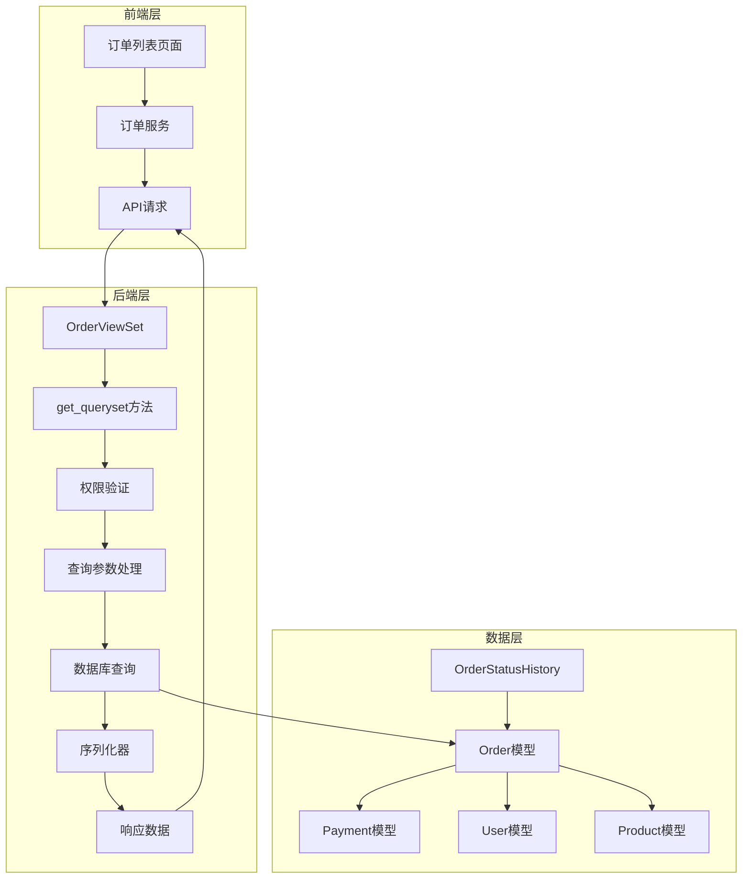
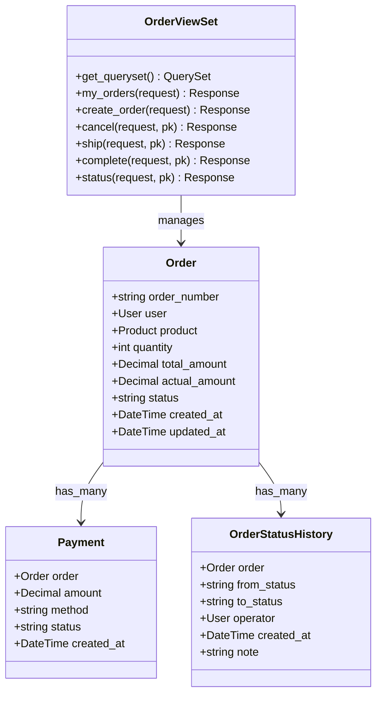
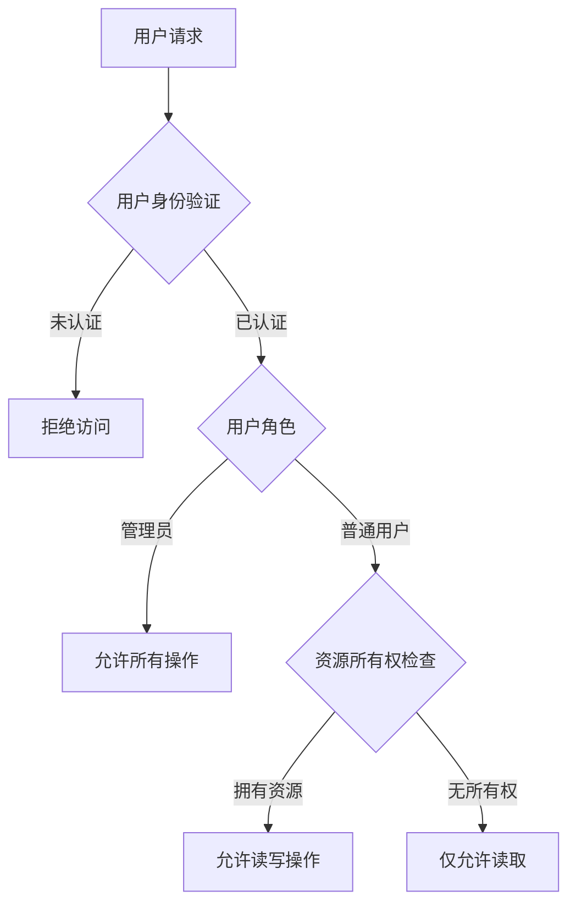
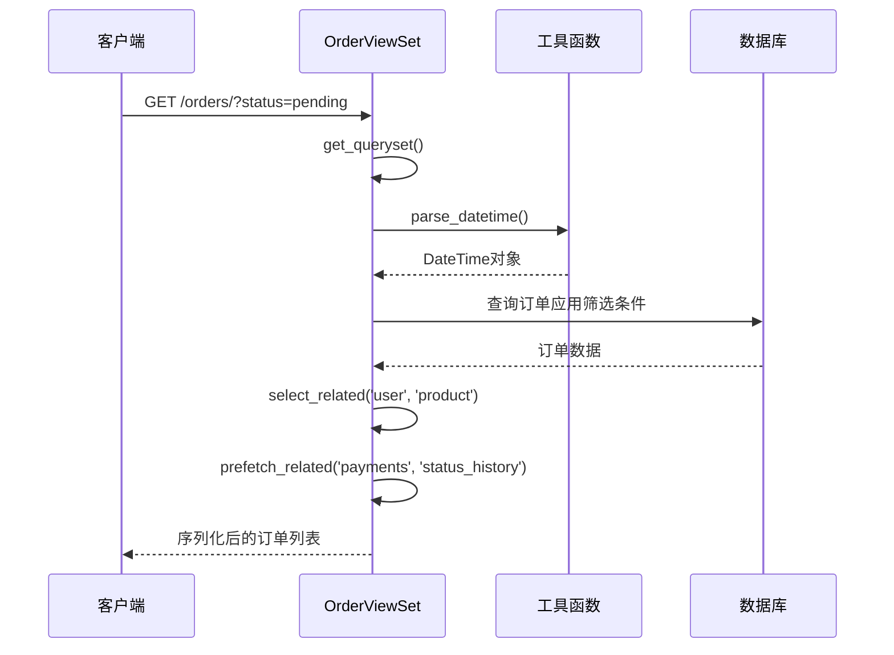
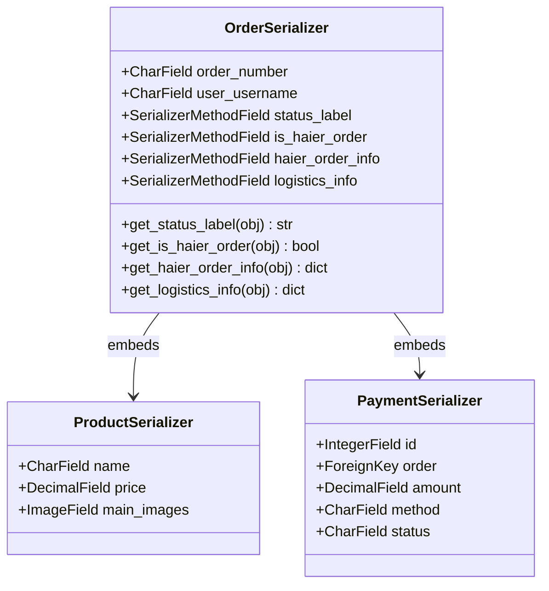
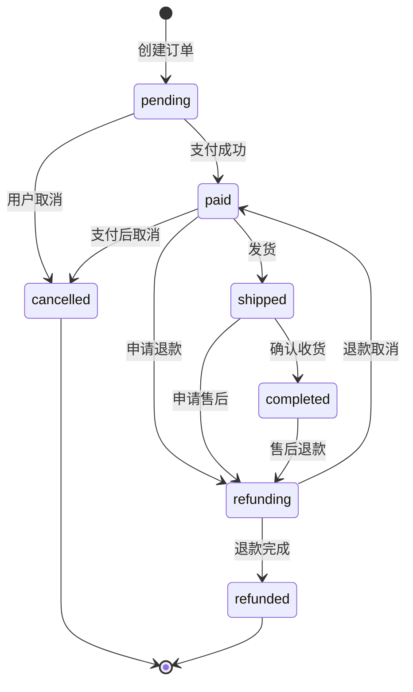
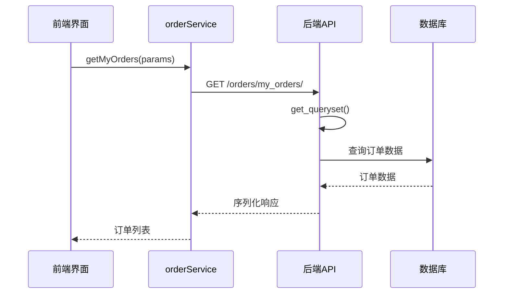

# 订单管理功能详细文档

<cite>
**本文档引用的文件**
- [backend/orders/views.py](file://backend/orders/views.py)
- [backend/orders/serializers.py](file://backend/orders/serializers.py)
- [backend/orders/models.py](file://backend/orders/models.py)
- [backend/orders/state_machine.py](file://backend/orders/state_machine.py)
- [backend/common/permissions.py](file://backend/common/permissions.py)
- [backend/common/utils.py](file://backend/common/utils.py)
- [frontend/src/pages/order-list/index.tsx](file://frontend/src/pages/order-list/index.tsx)
- [frontend/src/services/order.ts](file://frontend/src/services/order.ts)
- [merchant/src/pages/Orders/index.tsx](file://merchant/src/pages/Orders/index.tsx)
- [backend/orders/urls.py](file://backend/orders/urls.py)
</cite>

## 目录
1. [概述](#概述)
2. [项目架构](#项目架构)
3. [核心组件分析](#核心组件分析)
4. [权限控制系统](#权限控制系统)
5. [订单查询与筛选机制](#订单查询与筛选机制)
6. [订单序列化器详解](#订单序列化器详解)
7. [状态机管理](#状态机管理)
8. [前端集成](#前端集成)
9. [性能优化策略](#性能优化策略)
10. [实用示例与最佳实践](#实用示例与最佳实践)

## 概述

订单管理系统是电商业务的核心功能模块，负责处理从订单创建到完成的全生命周期管理。该系统采用RESTful API设计，支持多种查询参数筛选、权限控制和状态流转管理。

### 主要特性

- **智能权限控制**：基于用户角色的访问控制（普通用户vs管理员）
- **灵活查询筛选**：支持状态、订单号、商品名、用户名、时间范围等多种筛选条件
- **完整状态管理**：基于状态机的订单状态流转控制
- **关联数据丰富**：包含用户、商品、支付记录、状态历史等完整信息
- **性能优化**：预取关联对象，减少数据库查询次数

## 项目架构



**图表来源**
- [backend/orders/views.py](file://backend/orders/views.py#L23-L96)
- [backend/orders/models.py](file://backend/orders/models.py#L13-L322)

## 核心组件分析

### OrderViewSet - 订单视图集

OrderViewSet是订单管理的核心控制器，继承自Django REST Framework的ModelViewSet，提供了完整的CRUD操作和自定义动作。

#### 核心方法

1. **get_queryset方法** - 动态查询集管理
2. **my_orders动作** - 获取当前用户订单列表
3. **create_order动作** - 创建新订单
4. **状态管理动作** - 包括cancel、ship、complete等



**图表来源**
- [backend/orders/views.py](file://backend/orders/views.py#L23-L96)
- [backend/orders/models.py](file://backend/orders/models.py#L13-L322)

**章节来源**
- [backend/orders/views.py](file://backend/orders/views.py#L23-L96)

## 权限控制系统

### IsOwnerOrAdmin权限类

系统采用IsOwnerOrAdmin权限类实现基于角色的访问控制：



**图表来源**
- [backend/common/permissions.py](file://backend/common/permissions.py#L12-L67)

#### 权限验证逻辑

1. **管理员权限**：`is_staff=True`的用户可以访问所有订单
2. **用户权限**：普通用户只能访问自己的订单
3. **对象级权限**：通过`has_object_permission`方法验证资源所有权

**章节来源**
- [backend/common/permissions.py](file://backend/common/permissions.py#L12-L67)

## 订单查询与筛选机制

### get_queryset方法详解

get_queryset方法是订单查询的核心，实现了动态查询集构建和权限控制：

#### 查询参数支持

| 参数名 | 类型 | 描述 | 示例 |
|--------|------|------|------|
| `status` | 字符串 | 订单状态筛选 | `?status=pending` |
| `order_number` | 字符串 | 订单号模糊搜索 | `?order_number=123` |
| `product_name` | 字符串 | 商品名称模糊搜索 | `?product_name=手机` |
| `username` | 字符串 | 用户名模糊搜索（管理员） | `?username=admin` |
| `user_id` | 整数 | 按用户ID筛选（管理员） | `?user_id=123` |
| `created_after` | 日期时间 | 创建时间范围开始 | `?created_after=2024-01-01` |
| `created_before` | 日期时间 | 创建时间范围结束 | `?created_before=2024-12-31` |

#### 查询优化策略

1. **权限优化**：根据用户角色调整查询范围
2. **关联预取**：使用`select_related`和`prefetch_related`减少查询次数
3. **索引利用**：合理使用数据库索引加速查询



**图表来源**
- [backend/orders/views.py](file://backend/orders/views.py#L35-L96)
- [backend/common/utils.py](file://backend/common/utils.py#L28-L33)

**章节来源**
- [backend/orders/views.py](file://backend/orders/views.py#L35-L96)

## 订单序列化器详解

### OrderSerializer

OrderSerializer负责订单数据的序列化和反序列化，提供了丰富的关联数据展示：

#### 核心字段

| 字段名 | 类型 | 描述 | 是否只读 |
|--------|------|------|----------|
| `id` | 整数 | 订单ID | 是 |
| `order_number` | 字符串 | 订单号 | 是 |
| `user` | 外键 | 订单用户 | 是 |
| `user_username` | 字符串 | 用户名（计算字段） | 是 |
| `product` | 嵌套序列化器 | 商品信息 | 是 |
| `quantity` | 整数 | 商品数量 | 是 |
| `total_amount` | 十进制 | 总金额 | 是 |
| `actual_amount` | 十进制 | 实付金额 | 是 |
| `status` | 字符串 | 订单状态 | 是 |
| `status_label` | 字符串 | 状态标签（中文） | 是 |
| `created_at` | 日期时间 | 创建时间 | 是 |
| `updated_at` | 日期时间 | 更新时间 | 是 |

#### 计算字段

1. **status_label**：将英文状态映射为中文标签
2. **is_haier_order**：判断是否为海尔订单
3. **haier_order_info**：海尔订单相关信息
4. **logistics_info**：物流信息



**图表来源**
- [backend/orders/serializers.py](file://backend/orders/serializers.py#L8-L96)

**章节来源**
- [backend/orders/serializers.py](file://backend/orders/serializers.py#L8-L96)

## 状态机管理

### OrderStateMachine

订单状态机确保订单状态流转的合法性和业务逻辑的正确性：

#### 状态转换规则



**图表来源**
- [backend/orders/state_machine.py](file://backend/orders/state_machine.py#L33-L56)

#### 状态转换验证

1. **合法性检查**：验证目标状态是否在允许范围内
2. **事务处理**：确保状态转换的原子性
3. **历史记录**：记录状态变更历史
4. **业务逻辑**：执行状态转换后的业务操作

**章节来源**
- [backend/orders/state_machine.py](file://backend/orders/state_machine.py#L25-L289)

## 前端集成

### 订单列表页面

前端订单列表页面提供了完整的订单管理界面：

#### 功能特性

1. **状态标签导航**：支持按状态筛选订单
2. **无限滚动加载**：自动加载更多订单
3. **错误处理**：友好的错误提示和重试机制
4. **响应式设计**：适配不同屏幕尺寸

#### API集成

前端通过orderService与后端API交互：



**图表来源**
- [frontend/src/services/order.ts](file://frontend/src/services/order.ts#L28-L35)
- [frontend/src/pages/order-list/index.tsx](file://frontend/src/pages/order-list/index.tsx#L35-L68)

**章节来源**
- [frontend/src/pages/order-list/index.tsx](file://frontend/src/pages/order-list/index.tsx#L1-191)
- [frontend/src/services/order.ts](file://frontend/src/services/order.ts#L1-47)

## 性能优化策略

### 查询优化

1. **数据库索引**
   - `status`字段索引：加速状态筛选
   - `created_at`字段索引：加速时间范围查询
   - `user`字段索引：加速用户相关查询
   - `haier_order_no`和`haier_so_id`索引：加速海尔订单查询

2. **查询优化技术**
   - **select_related**：关联查询用户和商品信息
   - **prefetch_related**：预取支付记录和状态历史
   - **查询集缓存**：避免重复查询

3. **缓存策略**
   - 用户统计信息缓存（5分钟有效期）
   - 商品信息缓存（根据业务需求）

### 前端优化

1. **虚拟滚动**：大量数据时使用虚拟滚动
2. **懒加载**：图片和内容的懒加载
3. **防抖处理**：搜索输入的防抖处理
4. **错误边界**：组件级别的错误处理

## 实用示例与最佳实践

### 常见查询场景

#### 1. 获取用户所有订单
```bash
GET /orders/my_orders/?page=1&page_size=20
```

#### 2. 搜索特定状态的订单
```bash
GET /orders/my_orders/?status=paid&page=1&page_size=20
```

#### 3. 管理员查询所有订单
```bash
GET /orders/?status=shipped&created_after=2024-01-01&created_before=2024-12-31&page=1&page_size=20
```

#### 4. 海尔订单查询
```bash
GET /orders/?is_haier_order=true&status=paid&page=1&page_size=20
```

### 最佳实践建议

1. **权限控制**
   - 始终使用IsOwnerOrAdmin权限类
   - 避免硬编码权限逻辑
   - 定期审查权限配置

2. **查询优化**
   - 合理使用查询参数
   - 避免N+1查询问题
   - 监控查询性能

3. **状态管理**
   - 使用状态机确保状态流转合法
   - 记录状态变更历史
   - 处理并发状态更新

4. **错误处理**
   - 提供清晰的错误信息
   - 实现适当的重试机制
   - 记录详细的错误日志

### 故障排除指南

#### 常见问题及解决方案

1. **权限被拒绝**
   - 检查用户认证状态
   - 验证用户角色权限
   - 确认资源所有权

2. **查询性能问题**
   - 检查数据库索引
   - 优化查询参数
   - 考虑分页策略

3. **状态转换失败**
   - 验证状态转换规则
   - 检查前置条件
   - 查看状态历史记录

**章节来源**
- [backend/orders/views.py](file://backend/orders/views.py#L113-L134)
- [backend/orders/state_machine.py](file://backend/orders/state_machine.py#L118-L144)