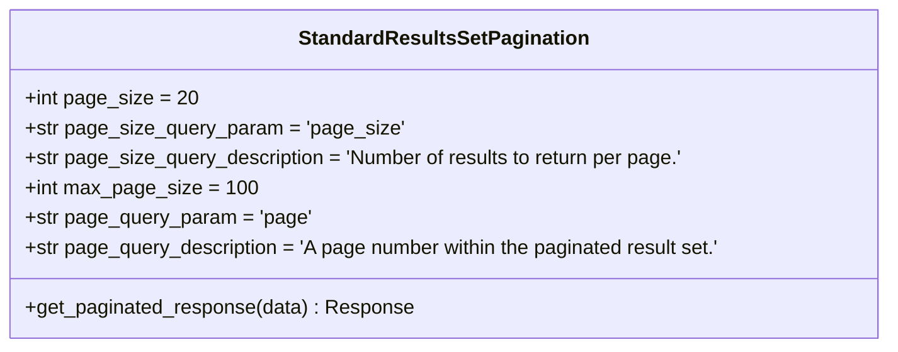
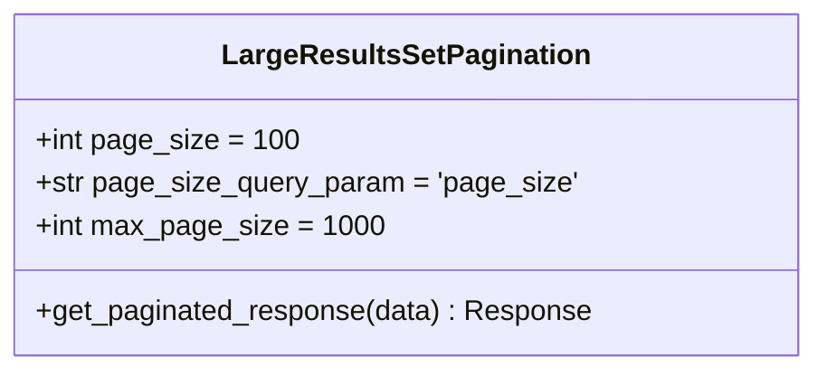
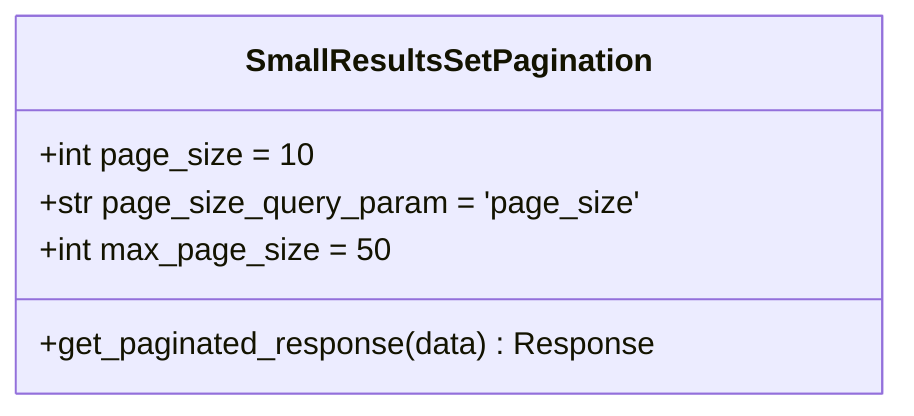
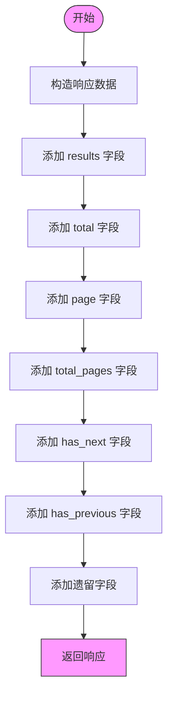
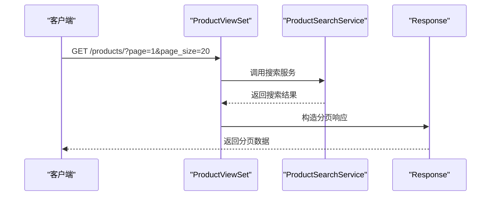
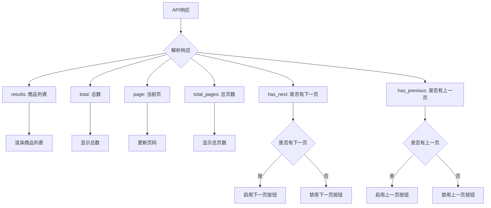

# 分页机制

<cite>
**本文档引用的文件**
- [pagination.py](file://backend/common/pagination.py)
- [base.py](file://backend/backend/settings/base.py)
- [views.py](file://backend/catalog/views.py)
- [responses.py](file://backend/common/responses.py)
- [product.ts](file://frontend/src/services/product.ts)
- [api.ts](file://merchant/src/services/api.ts)
</cite>

## 目录
1. [分页机制概述](#分页机制概述)
2. [分页策略实现](#分页策略实现)
3. [响应格式说明](#响应格式说明)
4. [使用场景与配置](#使用场景与配置)
5. [前端分页解析](#前端分页解析)
6. [性能优化建议](#性能优化建议)

## 分页机制概述

本系统采用Django REST Framework的分页机制，实现了三种不同的分页策略：标准分页、大分页和小分页。这些分页策略通过自定义的分页类实现，为不同业务场景提供灵活的分页支持。系统默认使用标准分页策略，所有分页类都继承自DRF的PageNumberPagination基类，并扩展了统一的响应格式。

**Section sources**
- [pagination.py](file://backend/common/pagination.py#L1-L99)
- [base.py](file://backend/backend/settings/base.py#L54-L55)

## 分页策略实现

系统实现了三种分页策略，分别适用于不同的业务场景：

### 标准分页策略

**Diagram sources**
- [pagination.py](file://backend/common/pagination.py#L8-L43)

### 大分页策略

**Diagram sources**
- [pagination.py](file://backend/common/pagination.py#L45-L71)

### 小分页策略

**Diagram sources**
- [pagination.py](file://backend/common/pagination.py#L73-L98)

**Section sources**
- [pagination.py](file://backend/common/pagination.py#L8-L98)

## 响应格式说明

所有分页类都重写了get_paginated_response方法，以提供统一的响应格式：

响应包含以下字段：
- **results**: 当前页的数据列表
- **total**: 数据总数
- **page**: 当前页码
- **total_pages**: 总页数
- **has_next**: 是否有下一页
- **has_previous**: 是否有上一页
- **count**: 数据总数（遗留字段，用于向后兼容）
- **next**: 下一页链接（遗留字段，用于向后兼容）
- **previous**: 上一页链接（遗留字段，用于向后兼容）

**Section sources**
- [pagination.py](file://backend/common/pagination.py#L27-L42)
- [pagination.py](file://backend/common/pagination.py#L55-L70)
- [pagination.py](file://backend/common/pagination.py#L83-L97)

## 使用场景与配置

### 配置参数说明

| 分页策略 | page_size | max_page_size | 适用场景 |
|--------|----------|--------------|--------|
| StandardResultsSetPagination | 20 | 100 | 商品列表、普通查询 |
| LargeResultsSetPagination | 100 | 1000 | 后台管理、数据导出 |
| SmallResultsSetPagination | 10 | 50 | 移动端、推荐列表 |

### 实际应用示例

在商品列表视图中，系统使用标准分页策略：

**Diagram sources**
- [views.py](file://backend/catalog/views.py#L83-L131)

**Section sources**
- [pagination.py](file://backend/common/pagination.py#L20-L23)
- [pagination.py](file://backend/common/pagination.py#L51-L53)
- [pagination.py](file://backend/common/pagination.py#L79-L81)

## 前端分页解析

前端通过服务层解析分页元数据，实现分页控件：

**Diagram sources**
- [product.ts](file://frontend/src/services/product.ts#L6-L13)
- [api.ts](file://merchant/src/services/api.ts#L30)

**Section sources**
- [product.ts](file://frontend/src/services/product.ts#L1-L64)
- [api.ts](file://merchant/src/services/api.ts#L1-L66)

## 性能优化建议

1. **合理设置page_size**: 避免设置过大的page_size，防止一次性查询过多数据导致数据库压力过大
2. **利用缓存**: 对于频繁访问的分页数据，建议使用缓存减少数据库查询
3. **索引优化**: 确保分页查询涉及的字段有适当的数据库索引
4. **避免深度分页**: 对于大数据集，避免访问过深的页码，可以考虑使用游标分页替代
5. **按需查询**: 根据实际需求选择合适的分页策略，移动端使用小分页，后台管理使用大分页

**Section sources**
- [pagination.py](file://backend/common/pagination.py#L20-L23)
- [pagination.py](file://backend/common/pagination.py#L51-L53)
- [pagination.py](file://backend/common/pagination.py#L79-L81)