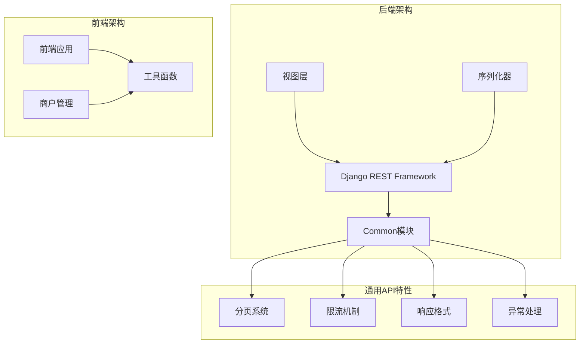
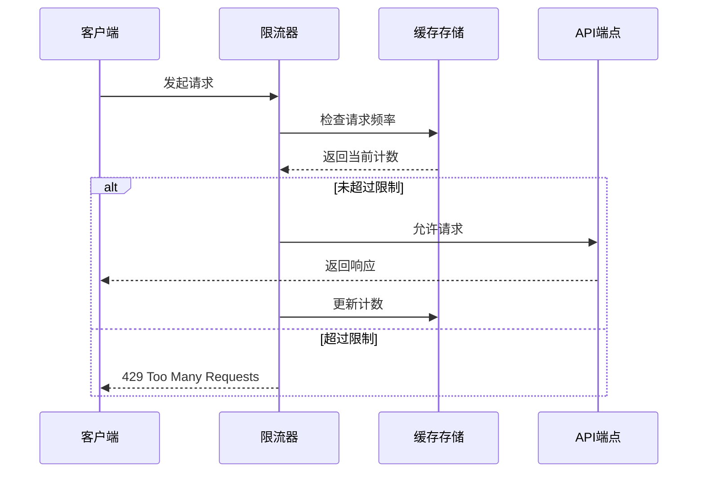
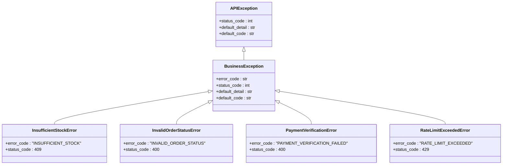
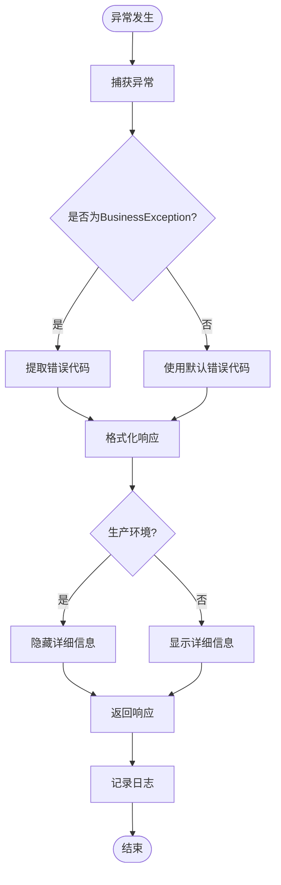
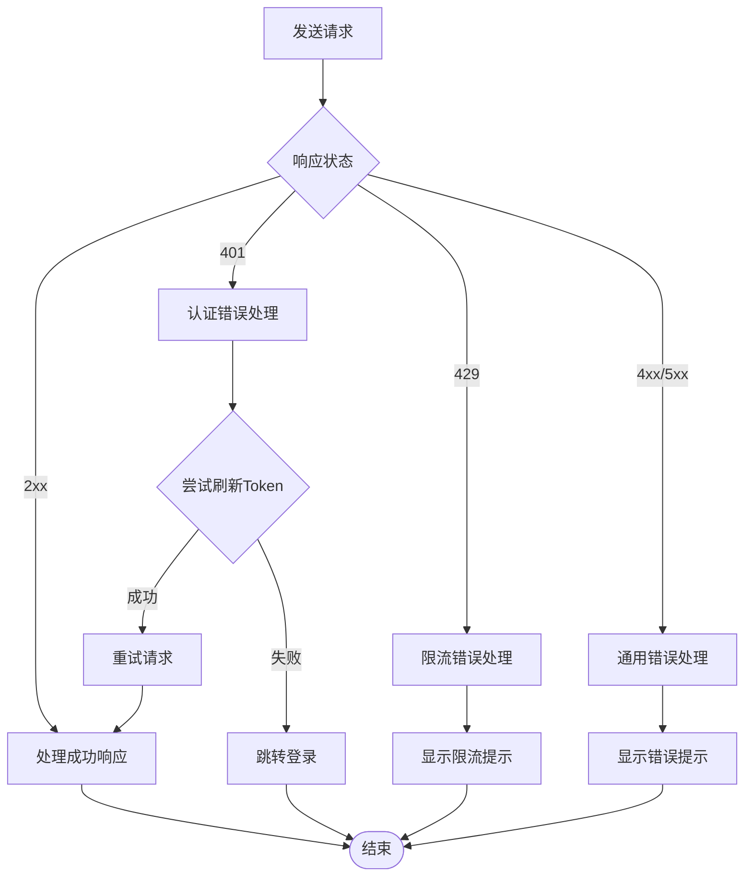

# 通用API特性

<cite>
**本文档引用的文件**
- [pagination.py](file://backend/common/pagination.py)
- [throttles.py](file://backend/common/throttles.py)
- [responses.py](file://backend/common/responses.py)
- [exceptions.py](file://backend/common/exceptions.py)
- [request.ts](file://frontend/src/utils/request.ts)
- [api.ts](file://merchant/src/services/api.ts)
- [views.py](file://backend/users/views.py)
- [views.py](file://backend/catalog/views.py)
</cite>

## 目录
1. [简介](#简介)
2. [项目架构概览](#项目架构概览)
3. [分页特性](#分页特性)
4. [限流机制](#限流机制)
5. [错误处理系统](#错误处理系统)
6. [统一响应格式](#统一响应格式)
7. [前端处理最佳实践](#前端处理最佳实践)
8. [总结](#总结)

## 简介

本文档详细介绍了Electric MiniProgram项目中的通用API特性，包括分页、限流和错误处理等跨领域功能。这些特性通过统一的设计模式和标准化的实现，确保了API的一致性和可维护性，同时为前端开发提供了良好的开发体验。

## 项目架构概览

项目采用Django REST Framework (DRF)作为后端框架，通过common模块提供通用的API特性支持：



**图表来源**
- [pagination.py](file://backend/common/pagination.py#L1-L99)
- [throttles.py](file://backend/common/throttles.py#L1-L78)
- [responses.py](file://backend/common/responses.py#L1-L322)
- [exceptions.py](file://backend/common/exceptions.py#L1-L504)

## 分页特性

### 标准分页策略

项目提供了三种不同类型的分页策略，每种都针对特定的使用场景进行了优化：

#### StandardResultsSetPagination（标准分页）

适用于大多数API端点的标准分页实现：

| 参数 | 默认值 | 描述 |
|------|--------|------|
| page_size | 20 | 每页默认结果数量 |
| max_page_size | 100 | 最大允许的页面大小 |
| page_query_param | 'page' | 页面参数名称 |
| page_size_query_param | 'page_size' | 页面大小参数名称 |

**核心特性：**
- 支持动态调整页面大小
- 提供完整的分页元数据
- 向后兼容传统分页字段

#### LargeResultsSetPagination（大型结果集分页）

专为返回大量数据的端点设计：

| 参数 | 默认值 | 描述 |
|------|--------|------|
| page_size | 100 | 每页默认结果数量 |
| max_page_size | 1000 | 最大允许的页面大小 |

**适用场景：**
- 商品列表查询
- 订单历史记录
- 数据导出接口

#### SmallResultsSetPagination（小型结果集分页）

针对移动端或返回少量数据的端点：

| 参数 | 默认值 | 描述 |
|------|--------|------|
| page_size | 10 | 每页默认结果数量 |
| max_page_size | 50 | 最大允许的页面大小 |

**适用场景：**
- 移动端API
- 关联数据查询
- 快速响应接口

### 分页响应格式

所有分页响应都遵循统一的格式：

```json
{
  "results": [...],
  "total": 1000,
  "page": 1,
  "total_pages": 100,
  "has_next": true,
  "has_previous": false,
  "count": 1000,
  "next": "/api/products/?page=2&page_size=20",
  "previous": null
}
```

**字段说明：**
- `results`: 当前页的数据列表
- `total`: 总记录数
- `page`: 当前页码
- `total_pages`: 总页数
- `has_next`: 是否有下一页
- `has_previous`: 是否有上一页
- `count`: （向后兼容）总记录数
- `next`: 下一页URL
- `previous`: 上一页URL

**章节来源**
- [pagination.py](file://backend/common/pagination.py#L8-L99)

## 限流机制

### 自定义限流类

项目实现了专门的限流机制，针对敏感操作提供更严格的速率控制：

#### LoginRateThrottle（登录限流）

保护登录端点免受暴力攻击：

| 用户类型 | 限制 | 说明 |
|----------|------|------|
| 已认证用户 | 5次/分钟 | 防止恶意登录尝试 |
| 匿名用户 | 5次/分钟 | 防止暴力破解 |

#### PaymentRateThrottle（支付限流）

保护支付操作的安全性：

| 用户类型 | 限制 | 说明 |
|----------|------|------|
| 已认证用户 | 10次/分钟 | 防止重复支付攻击 |
| 匿名用户 | 不允许 | 支付必须经过身份验证 |

#### 匿名用户专用限流

为匿名用户提供额外的安全保护：

| 类型 | 限制 | 说明 |
|------|------|------|
| 匿名登录 | 5次/分钟 | 防止暴力破解 |
| 匿名支付 | 10次/分钟 | 保护支付安全 |

### 限流实现原理



**图表来源**
- [throttles.py](file://backend/common/throttles.py#L11-L77)

**章节来源**
- [throttles.py](file://backend/common/throttles.py#L1-L78)

## 错误处理系统

### 统一异常处理架构

项目实现了完整的异常处理体系，确保所有错误都以一致的方式处理和响应：

#### 异常分类体系



**图表来源**
- [exceptions.py](file://backend/common/exceptions.py#L26-L244)

#### 错误处理流程



**图表来源**
- [exceptions.py](file://backend/common/exceptions.py#L251-L350)

### 环境感知的错误处理

系统根据运行环境自动调整错误信息的详细程度：

| 环境 | 错误详情 | 敏感信息 |
|------|----------|----------|
| 开发环境 | 完整堆栈跟踪 | 显示 |
| 测试环境 | 完整堆栈跟踪 | 显示 |
| 生产环境 | 简化错误消息 | 隐藏 |

**章节来源**
- [exceptions.py](file://backend/common/exceptions.py#L1-L504)

## 统一响应格式

### 成功响应格式

所有成功的API响应都遵循统一的格式：

```json
{
  "success": true,
  "code": 200,
  "message": "操作成功",
  "data": {...},
  "pagination": {...}
}
```

#### StandardResponse类方法

| 方法 | HTTP状态码 | 用途 |
|------|------------|------|
| success() | 200 | 通用成功响应 |
| created() | 201 | 资源创建成功 |
| no_content() | 204 | 操作成功但无内容返回 |

### 错误响应格式

所有错误响应都采用一致的结构：

```json
{
  "success": false,
  "code": 400,
  "message": "错误消息",
  "error_code": "ERROR_CODE",
  "errors": {...}
}
```

#### 错误响应类型

| HTTP状态码 | 响应方法 | 使用场景 |
|------------|----------|----------|
| 400 | bad_request() | 请求参数错误 |
| 401 | unauthorized() | 认证失败 |
| 403 | forbidden() | 权限不足 |
| 404 | not_found() | 资源不存在 |
| 409 | conflict() | 资源冲突 |
| 422 | unprocessable_entity() | 业务逻辑错误 |
| 500 | server_error() | 服务器内部错误 |

**章节来源**
- [responses.py](file://backend/common/responses.py#L1-L322)

## 前端处理最佳实践

### 请求封装和错误处理

前端通过统一的请求工具处理所有API通信：

#### Token管理

```typescript
// Token管理器示例
export const TokenManager = {
  getAccessToken(): string | null {
    return Taro.getStorageSync('access_token')
  },
  
  setTokens(access: string, refresh: string) {
    Taro.setStorageSync('access_token', access)
    Taro.setStorageSync('refresh_token', refresh)
  },
  
  async refreshAccessToken(): Promise<boolean> {
    // 自动刷新Token逻辑
  }
}
```

#### 统一错误处理

前端实现了智能的错误处理机制：



**图表来源**
- [request.ts](file://frontend/src/utils/request.ts#L61-L132)

#### 错误处理策略

| 错误类型 | 前端处理方式 | 用户体验 |
|----------|--------------|----------|
| 401认证失败 | 自动刷新Token，失败则跳转登录 | 无缝重新认证 |
| 429限流 | 显示友好提示，避免用户重复操作 | 避免用户困惑 |
| 4xx业务错误 | 显示具体错误信息 | 清楚了解问题原因 |
| 5xx服务器错误 | 显示通用错误提示 | 避免暴露技术细节 |

**章节来源**
- [request.ts](file://frontend/src/utils/request.ts#L1-L162)
- [api.ts](file://merchant/src/services/api.ts#L1-L66)

## 总结

Electric MiniProgram项目的通用API特性体系通过以下方式提升了开发效率和用户体验：

### 核心优势

1. **一致性**：所有API都遵循相同的分页、限流和错误处理规则
2. **可维护性**：通用特性集中管理，便于统一更新和维护
3. **安全性**：严格的限流机制保护敏感操作
4. **易用性**：统一的响应格式简化了前端开发
5. **可扩展性**：模块化设计支持新特性的轻松添加

### 最佳实践建议

1. **分页选择**：根据数据量选择合适的分页策略
2. **限流配置**：为敏感操作设置适当的限流参数
3. **错误处理**：使用业务异常类处理特定的业务逻辑错误
4. **前端适配**：充分利用统一的响应格式简化前端开发

这套通用API特性体系为构建高质量的Web应用程序提供了坚实的基础，确保了系统的稳定性、安全性和可维护性。