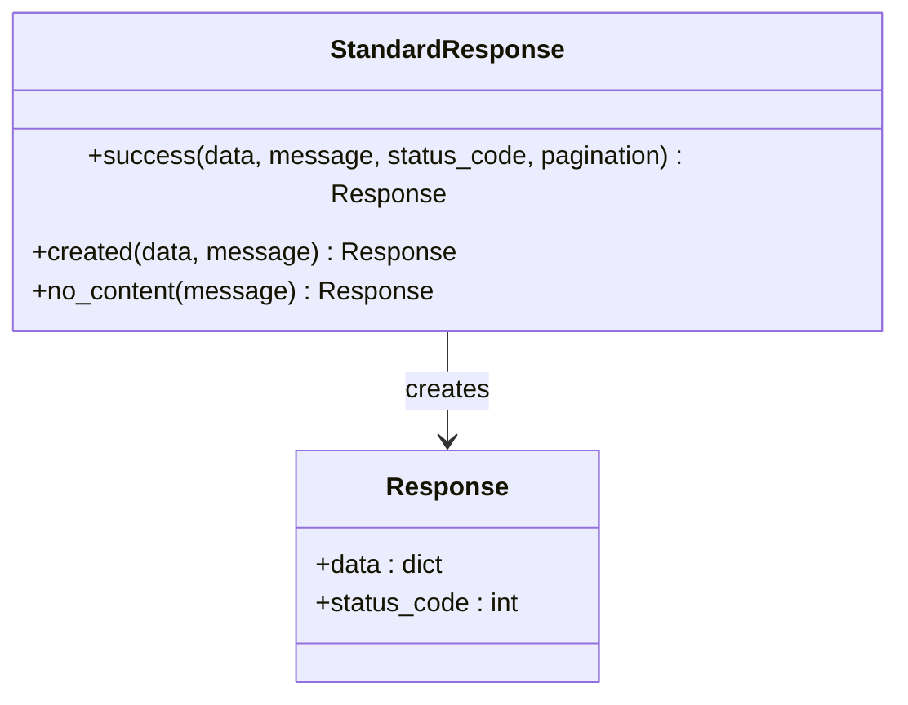
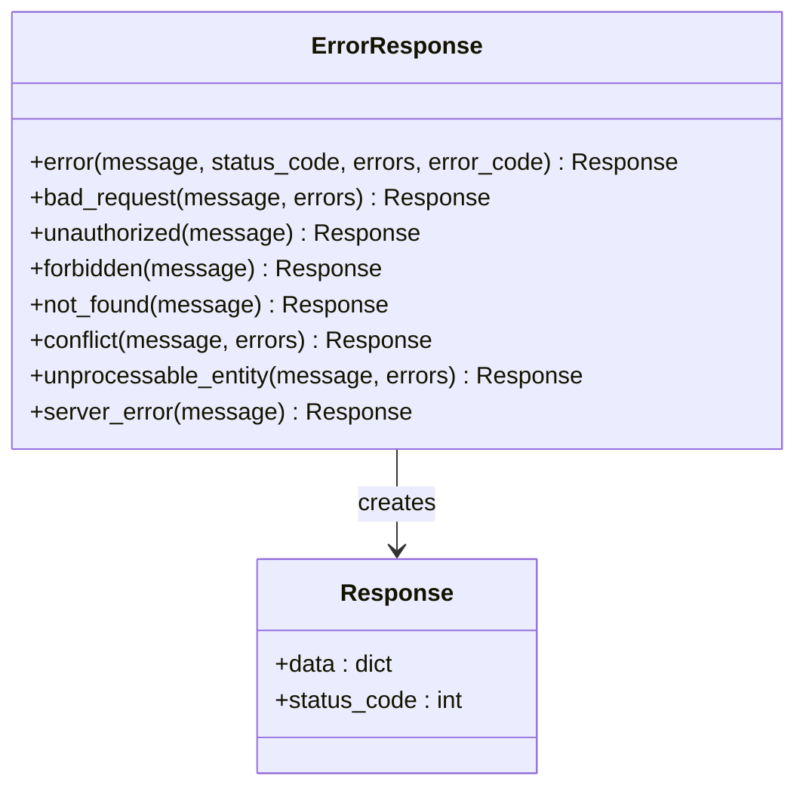
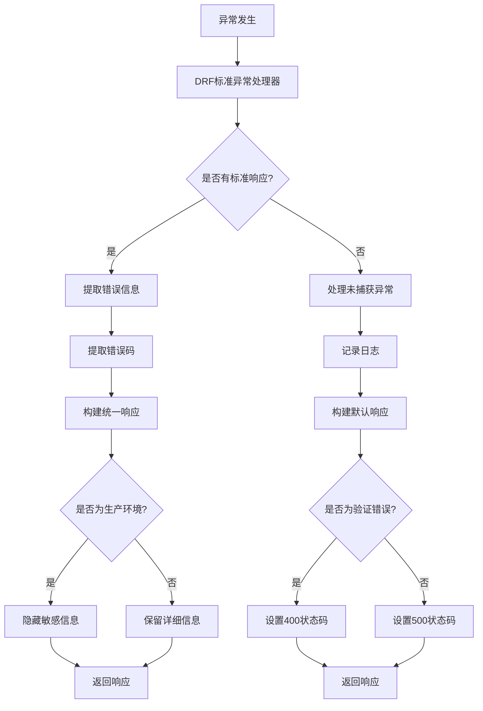
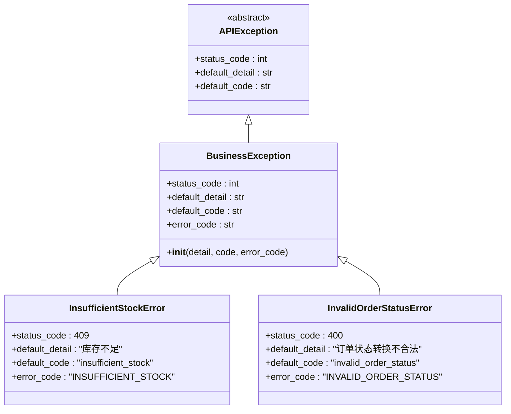
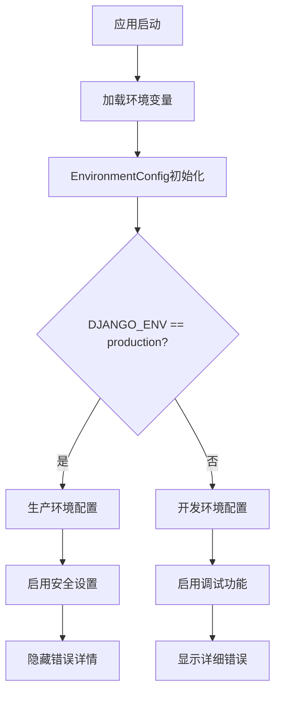
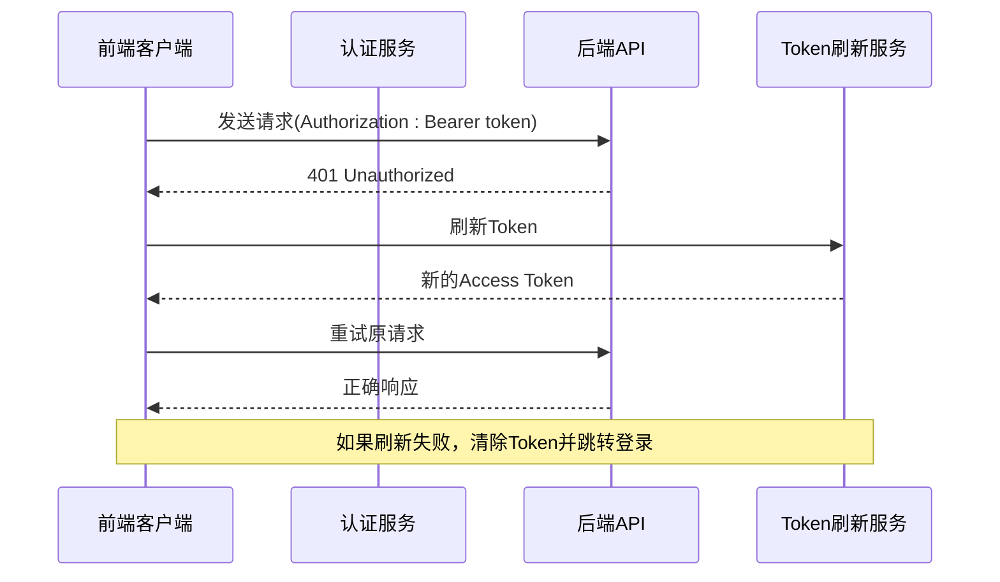
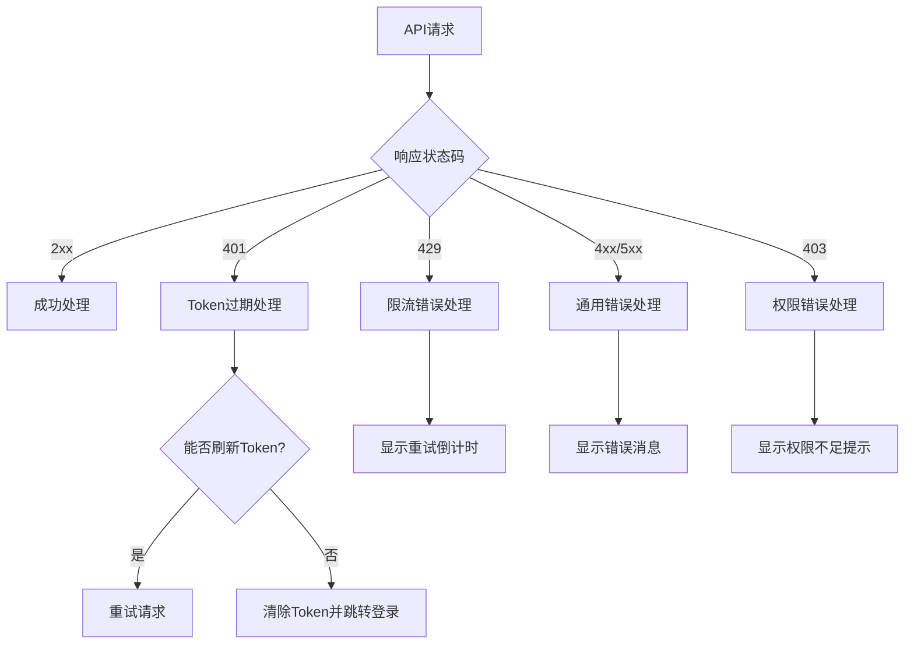

# 错误处理

<cite>
**本文档引用的文件**
- [responses.py](file://backend/common/responses.py)
- [exceptions.py](file://backend/common/exceptions.py)
- [api.md](file://api.md)
- [request.ts](file://frontend/src/utils/request.ts)
- [auth.ts](file://frontend/src/services/auth.ts)
- [env_config.py](file://backend/backend/settings/env_config.py)
</cite>

## 目录
1. [概述](#概述)
2. [统一响应格式设计](#统一响应格式设计)
3. [错误响应结构详解](#错误响应结构详解)
4. [业务错误码体系](#业务错误码体系)
5. [异常处理器架构](#异常处理器架构)
6. [生产环境脱敏策略](#生产环境脱敏策略)
7. [前端错误处理最佳实践](#前端错误处理最佳实践)
8. [常见错误场景分析](#常见错误场景分析)
9. [故障排查指南](#故障排查指南)
10. [总结](#总结)

## 概述

本项目采用统一的错误处理架构，通过StandardResponse和ErrorResponse类提供一致的API响应格式，确保前后端交互的可靠性和用户体验的一致性。系统支持多种错误类型，包括验证错误、认证错误、业务错误和限流错误，并在不同环境下采用不同的错误信息展示策略。

## 统一响应格式设计

### StandardResponse成功响应

StandardResponse类负责处理所有成功的API响应，提供统一的成功响应格式：



**图表来源**
- [responses.py](file://backend/common/responses.py#L15-L100)

成功响应包含以下核心字段：
- `success`: 布尔值，始终为true
- `code`: HTTP状态码
- `message`: 成功消息
- `data`: 响应数据
- `pagination`: 可选的分页信息

### ErrorResponse错误响应

ErrorResponse类处理所有类型的错误响应，提供详细的错误信息：



**图表来源**
- [responses.py](file://backend/common/responses.py#L102-L275)

**章节来源**
- [responses.py](file://backend/common/responses.py#L15-L275)

## 错误响应结构详解

### 基础错误响应格式

所有错误响应都遵循统一的结构：

| 字段名 | 类型 | 必需 | 描述 |
|--------|------|------|------|
| success | boolean | 是 | 始终为false |
| code | integer | 是 | HTTP状态码 |
| message | string | 是 | 用户友好的错误描述 |
| error_code | string | 否 | 业务错误码，用于前端逻辑处理 |
| errors | object | 否 | 详细的错误信息，包含字段级错误 |

### 错误响应示例

#### 验证错误
```json
{
  "success": false,
  "code": 400,
  "message": "请求数据验证失败",
  "error_code": "VALIDATION_ERROR",
  "errors": {
    "price": ["价格必须大于0"],
    "stock": ["库存不能为负数"]
  }
}
```

#### 认证错误
```json
{
  "success": false,
  "code": 401,
  "message": "无效的认证令牌",
  "error_code": "UNAUTHORIZED",
  "errors": {
    "reason": "Token已过期，请刷新"
  }
}
```

#### 业务错误
```json
{
  "success": false,
  "code": 400,
  "message": "库存不足",
  "error_code": "INSUFFICIENT_STOCK",
  "errors": {
    "product_id": 123,
    "requested": 10,
    "available": 5
  }
}
```

**章节来源**
- [api.md](file://api.md#L736-L788)

## 业务错误码体系

### HTTP状态码映射

系统定义了完整的HTTP状态码映射关系：

| HTTP状态码 | 错误码 | 语义 | 场景 |
|------------|--------|------|------|
| 200 | SUCCESS | 操作成功 | 所有成功的GET、POST、PUT、DELETE请求 |
| 201 | CREATED | 资源创建成功 | POST请求创建新资源 |
| 204 | NO_CONTENT | 操作成功但无内容 | DELETE请求成功删除资源 |
| 400 | BAD_REQUEST | 请求参数错误 | 参数验证失败、格式错误 |
| 401 | UNAUTHORIZED | 未授权 | 缺少Token、Token无效、Token过期 |
| 403 | FORBIDDEN | 权限拒绝 | 用户无相应权限 |
| 404 | NOT_FOUND | 资源不存在 | 请求的资源不存在 |
| 409 | CONFLICT | 资源冲突 | 删除有依赖的资源、重复操作 |
| 422 | UNPROCESSABLE_ENTITY | 业务逻辑错误 | 业务规则违反 |
| 429 | RATE_LIMIT_EXCEEDED | 请求过于频繁 | 触发限流机制 |
| 500 | INTERNAL_ERROR | 内部服务器错误 | 系统内部异常 |

### 业务错误码详解

#### 认证相关错误码
- **UNAUTHORIZED**: 无效的认证令牌
- **TOKEN_EXPIRED**: Token已过期
- **INVALID_CREDENTIALS**: 用户名或密码错误
- **PERMISSION_DENIED**: 无权限执行此操作

#### 验证相关错误码
- **VALIDATION_ERROR**: 字段验证失败
- **REQUIRED_FIELD**: 缺少必填字段
- **INVALID_FORMAT**: 字段格式不正确
- **FILE_TOO_LARGE**: 文件大小超过限制
- **INVALID_FILE_TYPE**: 不支持的文件类型

#### 业务相关错误码
- **NOT_FOUND**: 资源不存在
- **INSUFFICIENT_STOCK**: 库存不足
- **INVALID_ORDER_STATUS**: 订单状态不允许此操作
- **DUPLICATE_FAVORITE**: 商品已收藏
- **BRAND_HAS_PRODUCTS**: 品牌有关联商品

#### 限流相关错误码
- **RATE_LIMIT_EXCEEDED**: 请求过于频繁
- **LOGIN_RATE_LIMIT**: 登录尝试过于频繁
- **PAYMENT_RATE_LIMIT**: 支付请求过于频繁

**章节来源**
- [api.md](file://api.md#L697-L735)

## 异常处理器架构

### custom_exception_handler工作流程

系统实现了统一的异常处理器，能够捕获和格式化所有类型的异常：



**图表来源**
- [exceptions.py](file://backend/common/exceptions.py#L251-L396)

### BusinessException基类

所有业务逻辑异常都继承自BusinessException基类：



**图表来源**
- [exceptions.py](file://backend/common/exceptions.py#L26-L229)

**章节来源**
- [exceptions.py](file://backend/common/exceptions.py#L251-L396)

## 生产环境脱敏策略

### 环境检测机制

系统通过EnvironmentConfig类检测运行环境：



**图表来源**
- [env_config.py](file://backend/backend/settings/env_config.py#L37-L74)

### 脱敏策略实施

#### 5xx错误脱敏
在生产环境中，所有5xx错误都会被脱敏处理：
- 原始错误信息被替换为通用消息："服务器内部错误，请稍后重试"
- 错误堆栈和详细信息被隐藏
- 仅记录错误日志而不暴露给客户端

#### 开发环境保留详细信息
在开发环境中，系统会显示完整的错误信息：
- 包含原始异常类型和消息
- 显示详细的错误堆栈
- 方便开发者快速定位问题

**章节来源**
- [exceptions.py](file://backend/common/exceptions.py#L298-L307)

## 前端错误处理最佳实践

### Token自动刷新机制

前端实现了智能的Token刷新机制，处理认证相关的错误：



**图表来源**
- [request.ts](file://frontend/src/utils/request.ts#L94-L105)

### 错误处理流程

前端错误处理遵循以下流程：



**图表来源**
- [request.ts](file://frontend/src/utils/request.ts#L93-L121)

### 前端错误处理实现

#### Token管理器
TokenManager类负责管理认证Token：

| 方法 | 功能 | 返回值 |
|------|------|--------|
| getAccessToken() | 获取访问Token | string \| null |
| getRefreshToken() | 获取刷新Token | string \| null |
| setTokens(access, refresh) | 设置Token | void |
| clearTokens() | 清除所有Token | void |
| refreshAccessToken() | 刷新访问Token | boolean |

#### 错误响应处理
前端根据不同的错误码执行相应的处理逻辑：

| 错误码 | 处理方式 | 用户提示 |
|--------|----------|----------|
| UNAUTHORIZED | 自动刷新Token | 无特殊提示 |
| TOKEN_EXPIRED | 跳转登录页面 | "登录已过期" |
| RATE_LIMIT_EXCEEDED | 显示重试倒计时 | "请求过于频繁，请稍后再试" |
| VALIDATION_ERROR | 表单高亮错误字段 | 显示具体验证错误 |
| BUSINESS_ERROR | 显示业务错误信息 | 根据具体业务错误提示 |

**章节来源**
- [request.ts](file://frontend/src/utils/request.ts#L1-L162)
- [auth.ts](file://frontend/src/services/auth.ts#L1-L22)

## 常见错误场景分析

### 验证错误处理

验证错误是最常见的错误类型，通常发生在数据提交阶段：

#### 字段级验证错误
```json
{
  "success": false,
  "code": 400,
  "message": "请求数据验证失败",
  "error_code": "VALIDATION_ERROR",
  "errors": {
    "username": ["该用户名已存在"],
    "email": ["请输入有效的邮箱地址"],
    "password": ["密码长度必须在6-20个字符之间"]
  }
}
```

#### 业务规则验证
```json
{
  "success": false,
  "code": 422,
  "message": "库存不足",
  "error_code": "INSUFFICIENT_STOCK",
  "errors": {
    "product_id": 123,
    "requested": 10,
    "available": 5
  }
}
```

### 认证错误处理

认证错误涉及Token管理和权限验证：

#### Token过期处理
```json
{
  "success": false,
  "code": 401,
  "message": "Token已过期",
  "error_code": "TOKEN_EXPIRED",
  "errors": {
    "reason": "请使用刷新Token获取新访问Token"
  }
}
```

#### 权限不足处理
```json
{
  "success": false,
  "code": 403,
  "message": "无管理员权限",
  "error_code": "PERMISSION_DENIED",
  "errors": {
    "required_permission": "admin_access"
  }
}
```

### 业务错误处理

业务错误反映了应用程序的业务逻辑约束：

#### 库存不足
```json
{
  "success": false,
  "code": 409,
  "message": "库存不足",
  "error_code": "INSUFFICIENT_STOCK",
  "errors": {
    "product_id": 123,
    "requested": 10,
    "available": 5,
    "stock_lock": true
  }
}
```

#### 资源冲突
```json
{
  "success": false,
  "code": 409,
  "message": "品牌有关联商品，无法删除",
  "error_code": "RESOURCE_CONFLICT",
  "errors": {
    "brand_id": 456,
    "product_count": 15
  }
}
```

### 限流错误处理

系统实现了多层次的限流保护：

#### 请求频率限制
```json
{
  "success": false,
  "code": 429,
  "message": "请求过于频繁，请稍后再试",
  "error_code": "RATE_LIMIT_EXCEEDED",
  "errors": {
    "retry_after": 60,
    "current_rate": "100/min",
    "limit": "100/min"
  }
}
```

**章节来源**
- [api.md](file://api.md#L736-L808)

## 故障排查指南

### 错误日志分析

系统提供了完善的日志记录机制：

#### 日志级别分类
- **ERROR (500)**: 服务器内部错误，记录完整堆栈信息
- **WARNING (4xx)**: 客户端错误，记录请求上下文
- **INFO (2xx/3xx)**: 正常请求，记录基本请求信息

#### 关键日志字段
- `request_path`: 请求路径
- `request_method`: 请求方法
- `view_name`: 视图名称
- `status_code`: HTTP状态码
- `timestamp`: 时间戳

### 常见问题诊断

#### 401错误排查
1. 检查Authorization头是否正确设置
2. 验证Token格式是否符合Bearer规范
3. 确认Token是否已过期
4. 检查Token是否被撤销

#### 403错误排查
1. 验证用户权限级别
2. 检查用户所属的角色
3. 确认资源访问权限
4. 检查中间件配置

#### 500错误排查
1. 查看服务器错误日志
2. 检查数据库连接状态
3. 验证第三方服务可用性
4. 检查内存和CPU使用情况

### 性能监控

系统集成了性能监控指标：

#### 关键指标
- 响应时间分布
- 错误率统计
- API调用频率
- 资源使用情况

#### 监控告警
- 5xx错误率超过阈值
- 响应时间超过设定值
- 数据库连接超时
- 第三方服务不可用

## 总结

本项目的错误处理架构具有以下特点：

### 架构优势
1. **统一性**: 所有API响应都遵循相同的格式规范
2. **一致性**: 前后端错误处理逻辑保持一致
3. **可扩展性**: 支持新增错误类型和业务错误码
4. **安全性**: 生产环境自动脱敏敏感信息
5. **可观测性**: 完善的日志记录和监控机制

### 最佳实践总结
1. **前端处理**: 实现智能的错误恢复机制
2. **错误分类**: 合理划分不同类型的错误
3. **用户体验**: 提供清晰的错误提示和解决方案
4. **安全考虑**: 生产环境隐藏敏感错误信息
5. **开发效率**: 开发环境提供详细的错误信息

这套错误处理体系确保了系统的稳定性和用户体验，为项目的长期维护和发展奠定了坚实的基础。