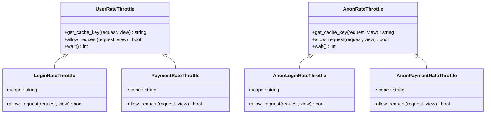

# 限流策略

<cite>
**本文档引用的文件**
- [throttles.py](file://backend/common/throttles.py)
- [views.py](file://backend/users/views.py)
- [views.py](file://backend/orders/views.py)
- [base.py](file://backend/backend/settings/base.py)
- [exceptions.py](file://backend/common/exceptions.py)
- [api.md](file://api.md)
</cite>

## 目录
1. [概述](#概述)
2. [限流器架构](#限流器架构)
3. [核心限流器详解](#核心限流器详解)
4. [配置与集成](#配置与集成)
5. [错误处理机制](#错误处理机制)
6. [前端应对策略](#前端应对策略)
7. [最佳实践](#最佳实践)
8. [故障排除](#故障排除)

## 概述

本系统实现了基于Django Rest Framework (DRF) 的多层次限流策略，通过自定义限流器保护关键业务操作免受恶意攻击和滥用。系统采用基于scope的限流机制，针对不同类型的API请求实施差异化的速率限制策略。

### 主要特性

- **多层级限流**：区分匿名用户和认证用户的不同限制策略
- **业务导向**：针对登录和支付等敏感操作实施更严格的限制
- **分布式支持**：通过Redis缓存实现分布式限流
- **智能错误处理**：提供详细的限流错误信息和重试指导

## 限流器架构

系统采用DRF内置的限流框架，通过继承基础限流类实现定制化功能。



**图表来源**
- [throttles.py](file://backend/common/throttles.py#L8-L78)

## 核心限流器详解

### LoginRateThrottle - 登录限流器

针对登录相关操作实施严格限制，保护系统免受暴力破解攻击。

#### 限制策略
- **认证用户**：5次/分钟
- **匿名用户**：5次/分钟

#### 应用场景
- 微信小程序登录接口
- 管理员密码登录接口

#### 实现特点
- 继承自`UserRateThrottle`基类
- 使用`scope = 'login'`标识特定的限流策略
- 集成到登录视图的`throttle_classes`属性

**节来源**
- [throttles.py](file://backend/common/throttles.py#L11-L29)
- [views.py](file://backend/users/views.py#L42-L43)
- [views.py](file://backend/users/views.py#L170-L171)

### PaymentRateThrottle - 支付限流器

保护支付流程免受重复支付和恶意攻击。

#### 限制策略
- **认证用户**：10次/分钟
- **匿名用户**：禁止访问（支付需要认证）

#### 应用场景
- 支付创建接口
- 支付状态更新接口

#### 实现特点
- 继承自`UserRateThrottle`基类
- 使用`scope = 'payment'`标识支付专用限流策略
- 强制要求用户认证

**节来源**
- [throttles.py](file://backend/common/throttles.py#L32-L51)
- [views.py](file://backend/orders/views.py#L794-L795)
- [views.py](file://backend/orders/views.py#L1146-L1147)

### AnonLoginRateThrottle - 匿名登录限流器

专门针对未认证用户的登录尝试实施限制。

#### 限制策略
- **匿名用户**：5次/分钟

#### 应用场景
- 未登录状态下的登录尝试
- 防止匿名用户进行大量无效登录请求

#### 实现特点
- 继承自`AnonRateThrottle`基类
- 专门针对登录操作的匿名用户限制
- 更严格的限制确保安全性

**节来源**
- [throttles.py](file://backend/common/throttles.py#L54-L65)

### AnonPaymentRateThrottle - 匿名支付限流器

针对未认证用户的支付尝试实施限制。

#### 限制策略
- **匿名用户**：10次/分钟

#### 应用场景
- 未登录状态下的支付尝试
- 支付流程的匿名用户保护

#### 实现特点
- 继承自`AnonRateThrottle`基类
- 使用`scope = 'payment'`标识支付专用匿名限流
- 虽然支付通常需要认证，但仍提供匿名保护层

**节来源**
- [throttles.py](file://backend/common/throttles.py#L67-L78)

## 配置与集成

### 全局限流配置

系统在DRF设置中定义了全局限流策略：

```python
REST_FRAMEWORK = {
    'DEFAULT_THROTTLE_CLASSES': [
        'rest_framework.throttling.AnonRateThrottle',
        'rest_framework.throttling.UserRateThrottle',
    ] if EnvironmentConfig.is_production() else [],
    'DEFAULT_THROTTLE_RATES': {
        'anon': '20/minute',
        'user': '100/minute',
        'login': '5/minute',
        'payment': '10/minute',
    },
}
```

### 缓存配置

限流器依赖Redis缓存实现分布式限流：

```python
CACHES = {
    'default': {
        'BACKEND': 'django.core.cache.backends.redis.RedisCache',
        'LOCATION': 'redis://127.0.0.1:6379/1',
        'OPTIONS': {
            'CLIENT_CLASS': 'django_redis.client.DefaultClient',
        }
    }
}
```

**节来源**
- [base.py](file://backend/backend/settings/base.py#L33-L53)
- [base.py](file://backend/backend/settings/base.py#L214-L221)

### 视图集成

限流器通过多种方式集成到视图中：

#### 装饰器方式
```python
@api_view(['POST'])
@throttle_classes([LoginRateThrottle])
def login(request):
    # 登录逻辑
```

#### 视图集方式
```python
class LoginViewSet(viewsets.ViewSet):
    throttle_classes = [LoginRateThrottle]
```

#### 视图类方式
```python
class WeChatLoginView(APIView):
    throttle_classes = [LoginRateThrottle]
```

## 错误处理机制

### RateLimitExceededError异常

系统定义了专门的限流异常类：

```python
class RateLimitExceededError(BusinessException):
    status_code = status.HTTP_429_TOO_MANY_REQUESTS
    default_detail = '请求过于频繁，请稍后再试'
    default_code = 'rate_limit_exceeded'
    error_code = 'RATE_LIMIT_EXCEEDED'
```

### 错误响应格式

当触发限流时，系统返回标准的错误响应：

```json
{
    "success": false,
    "code": 429,
    "message": "请求过于频繁，请稍后再试",
    "error_code": "RATE_LIMIT_EXCEEDED",
    "errors": {
        "retry_after": 60
    }
}
```

### Retry-After头信息

DRF会自动在响应头中添加`Retry-After`字段，指示客户端应该等待多久才能重试：

```
Retry-After: 60
```

**节来源**
- [exceptions.py](file://backend/common/exceptions.py#L232-L245)
- [api.md](file://api.md#L778-L787)

## 前端应对策略

### 重试倒计时实现

前端应该监听429状态码并显示重试倒计时：

```javascript
// 示例：处理限流错误
function handleRateLimitError(error) {
    if (error.response && error.response.status === 429) {
        const retryAfter = error.response.headers['retry-after'] || 60;
        showRetryCountdown(retryAfter);
        displayErrorMessage('请求过于频繁，请稍后再试');
    }
}

function showRetryCountdown(seconds) {
    // 显示倒计时UI
    const countdownElement = document.getElementById('retry-countdown');
    countdownElement.style.display = 'block';
    
    let remaining = seconds;
    const interval = setInterval(() => {
        countdownElement.textContent = `请等待 ${remaining} 秒后重试`;
        remaining--;
        if (remaining < 0) {
            clearInterval(interval);
            countdownElement.style.display = 'none';
        }
    }, 1000);
}
```

### 用户提示文案设计

根据不同类型的限流提供相应的用户提示：

| 限流类型 | 提示文案 | 建议行动 |
|---------|---------|---------|
| 登录限流 | "登录尝试过于频繁，请等待5分钟后重试" | 等待5分钟 |
| 支付限流 | "支付请求过于频繁，请稍后再试" | 等待后重试 |
| 通用限流 | "请求过于频繁，请稍后再试" | 查看重试倒计时 |

### 自动重试机制

实现智能的自动重试逻辑：

```javascript
class RateLimitHandler {
    constructor(maxRetries = 3) {
        this.maxRetries = maxRetries;
        this.retryCount = 0;
    }
    
    async handleRequest(apiCall, ...args) {
        try {
            return await apiCall(...args);
        } catch (error) {
            if (this.shouldRetry(error)) {
                return this.retryWithBackoff(apiCall, ...args);
            }
            throw error;
        }
    }
    
    shouldRetry(error) {
        return error.response?.status === 429 && 
               this.retryCount < this.maxRetries;
    }
    
    async retryWithBackoff(apiCall, ...args) {
        this.retryCount++;
        const delay = Math.min(2 ** this.retryCount * 1000, 30000); // 指数退避，最多30秒
        
        await new Promise(resolve => setTimeout(resolve, delay));
        return this.handleRequest(apiCall, ...args);
    }
}
```

## 最佳实践

### 限流策略优化

1. **动态调整限制**：根据系统负载动态调整限流阈值
2. **IP白名单**：为可信IP地址设置更高的限流阈值
3. **用户行为分析**：基于用户历史行为调整个性化限流策略

### 监控与告警

```python
# 限流监控示例
from django.core.cache import cache

def track_throttle_usage(scope, user_id=None):
    """跟踪限流使用情况"""
    key = f'throttle_usage:{scope}:{user_id or "anonymous"}'
    cache.incr(key)
    
    # 设置过期时间
    if not cache.get(key):
        cache.expire(key, 3600)  # 1小时过期
```

### 缓存优化

1. **使用Redis集群**：确保限流缓存的高可用性
2. **设置合适的过期时间**：平衡内存使用和准确性
3. **监控缓存命中率**：优化缓存策略

## 故障排除

### 常见问题及解决方案

#### 问题1：限流不生效
**症状**：即使达到限制次数，请求仍然被接受
**原因**：缓存配置错误或限流器未正确集成
**解决方案**：
1. 检查Redis连接配置
2. 确认限流器已正确添加到视图
3. 验证缓存键生成逻辑

#### 问题2：限流过于严格
**症状**：正常用户请求被错误限流
**原因**：限流阈值设置过低或缓存清理不及时
**解决方案**：
1. 调整限流阈值
2. 检查缓存过期时间设置
3. 实施用户行为分析

#### 问题3：分布式限流失效
**症状**：多实例部署下限流不准确
**原因**：缓存共享配置错误
**解决方案**：
1. 确保所有实例使用相同的Redis实例
2. 检查缓存键命名空间
3. 验证缓存序列化配置

### 调试工具

```python
# 限流调试辅助函数
def debug_throttle_state(scope, request):
    """调试限流状态"""
    from rest_framework.throttling import SimpleRateThrottle
    
    throttle = SimpleRateThrottle()
    throttle.scope = scope
    
    # 检查是否允许请求
    allow = throttle.allow_request(request, None)
    
    # 获取剩余等待时间
    wait = throttle.wait() if not allow else 0
    
    return {
        'allowed': allow,
        'wait_seconds': wait,
        'cache_key': throttle.get_cache_key(request, None)
    }
```

通过合理的限流策略配置和前端适配，系统能够有效抵御恶意攻击，同时为正常用户提供良好的使用体验。定期评估和优化限流策略是保障系统稳定运行的重要措施。