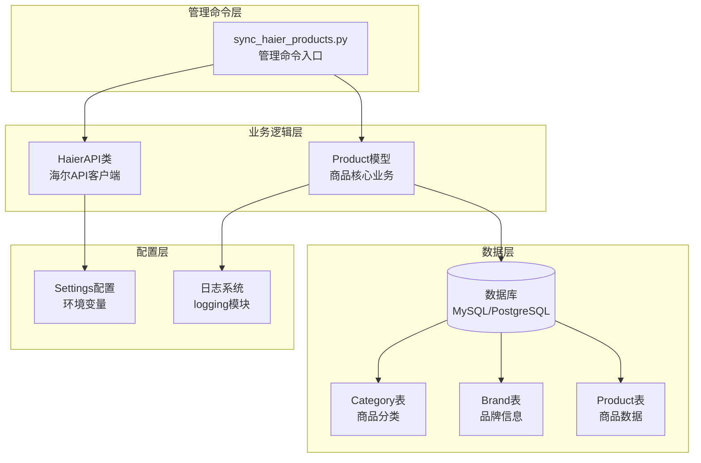
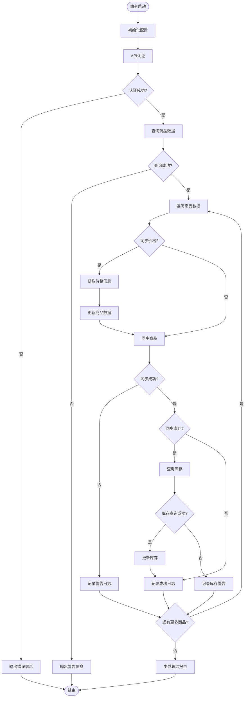
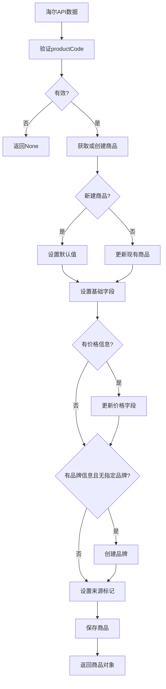
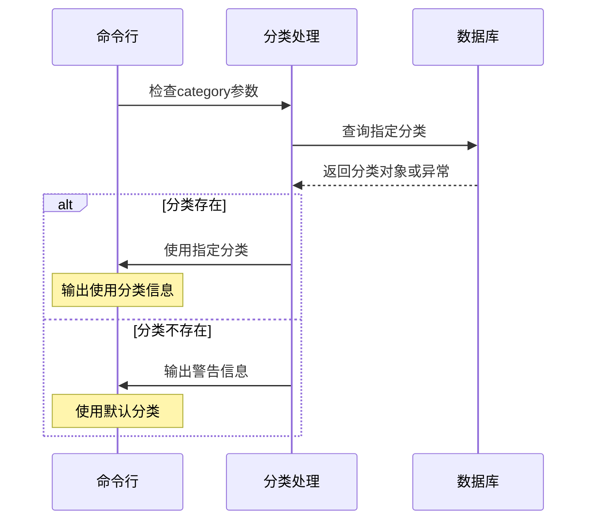
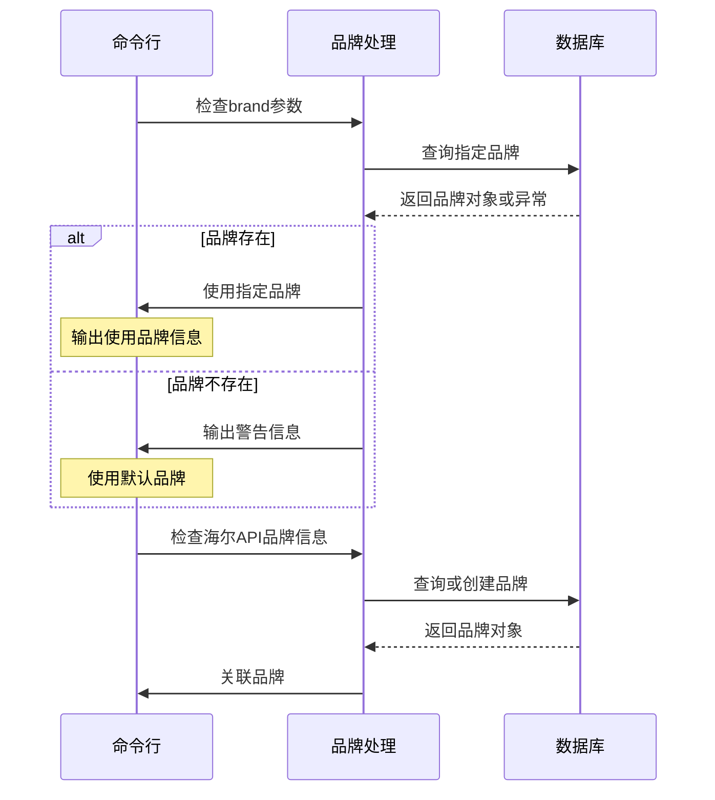
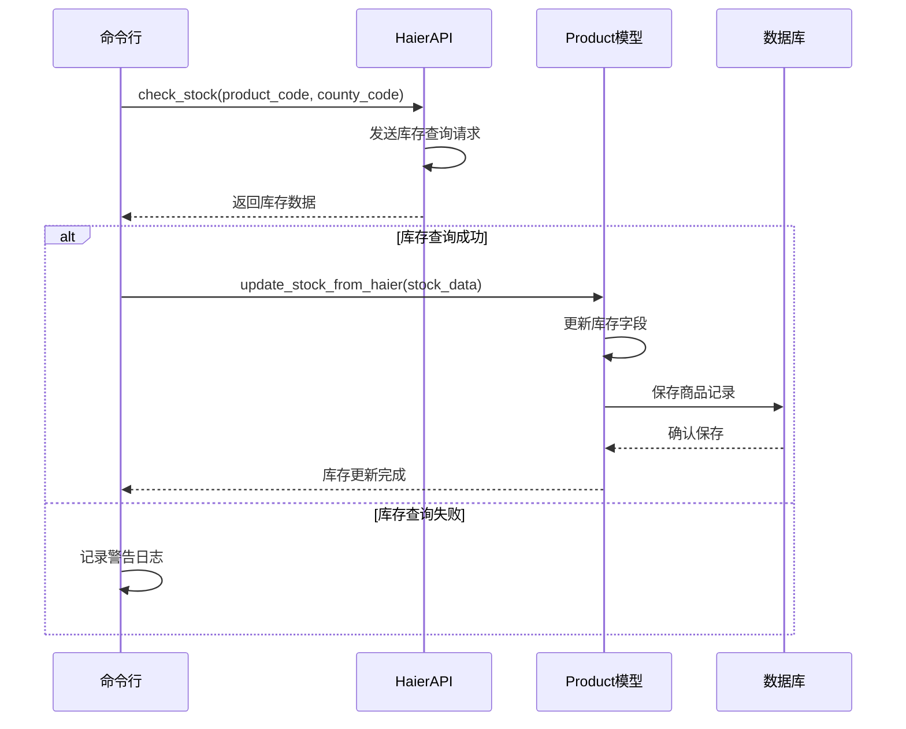
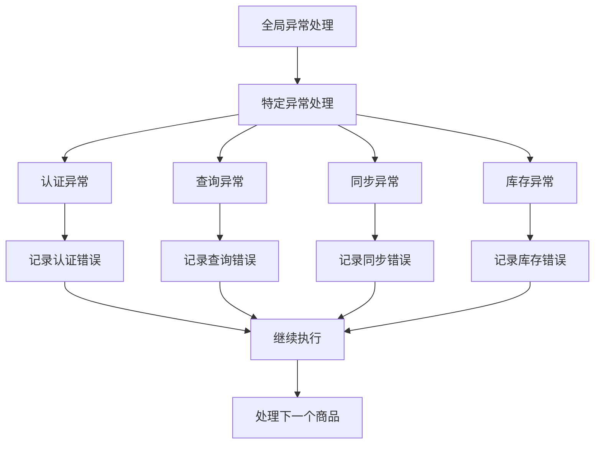

# 商品同步执行机制

<cite>
**本文档引用的文件**
- [sync_haier_products.py](file://backend/catalog/management/commands/sync_haier_products.py)
- [models.py](file://backend/catalog/models.py)
- [haierapi.py](file://backend/integrations/haierapi.py)
- [base.py](file://backend/backend/settings/base.py)
- [models.py](file://backend/integrations/models.py)
</cite>

## 目录
1. [概述](#概述)
2. [项目架构](#项目架构)
3. [命令行参数详解](#命令行参数详解)
4. [执行流程分析](#执行流程分析)
5. [商品数据映射机制](#商品数据映射机制)
6. [分类和品牌关联处理](#分类和品牌关联处理)
7. [库存同步机制](#库存同步机制)
8. [日志输出示例](#日志输出示例)
9. [错误处理机制](#错误处理机制)
10. [最佳实践建议](#最佳实践建议)

## 概述

`sync_haier_products.py` 是一个专门用于从海尔API同步商品数据的Django管理命令。该命令实现了完整的商品同步流程，包括全量同步和增量同步功能，支持多种同步选项，并提供了完善的错误处理和日志记录机制。

### 核心功能特性

- **多维度同步控制**：支持按产品编码、分类、品牌进行精确同步
- **灵活的价格同步**：可选择性同步价格信息
- **库存实时更新**：支持指定区域的库存查询和更新
- **智能数据映射**：自动将海尔API字段映射到本地模型
- **品牌自动创建**：缺失的品牌会自动创建并关联
- **完善的日志系统**：提供详细的执行状态和错误信息

## 项目架构



**图表来源**
- [sync_haier_products.py](file://backend/catalog/management/commands/sync_haier_products.py#L1-L156)
- [models.py](file://backend/catalog/models.py#L43-L312)
- [haierapi.py](file://backend/integrations/haierapi.py#L10-L214)

## 命令行参数详解

### 基础同步参数

| 参数名称 | 类型 | 默认值 | 功能描述 |
|---------|------|--------|----------|
| `--product-codes` | `List[str]` | `None` | 指定要同步的产品编码列表，支持多个编码 |
| `--category` | `str` | `None` | 指定商品分类名称，用于过滤特定分类的商品 |
| `--brand` | `str` | `None` | 指定品牌名称，用于过滤特定品牌的商品 |

### 价格同步参数

| 参数名称 | 类型 | 默认值 | 功能描述 |
|---------|------|--------|----------|
| `--sync-prices` | `bool` | `False` | 是否同步价格信息，启用后会额外查询价格数据 |

### 库存同步参数

| 参数名称 | 类型 | 默认值 | 功能描述 |
|---------|------|--------|----------|
| `--sync-stock` | `bool` | `False` | 是否同步库存信息，启用后会查询指定区域的库存 |
| `--county-code` | `str` | `'110101'` | 区域编码，用于库存查询，默认为北京东城区 |

### 参数使用示例

```bash
# 全量同步所有商品
python manage.py sync_haier_products

# 指定产品编码同步
python manage.py sync_haier_products --product-codes NQ0054000 NQ0054001

# 按分类同步
python manage.py sync_haier_products --category "空调"

# 按品牌同步
python manage.py sync_haier_products --brand "海尔"

# 同步价格和库存
python manage.py sync_haier_products --sync-prices --sync-stock --county-code "110101"
```

**章节来源**
- [sync_haier_products.py](file://backend/catalog/management/commands/sync_haier_products.py#L16-L48)

## 执行流程分析

### 主流程架构



**图表来源**
- [sync_haier_products.py](file://backend/catalog/management/commands/sync_haier_products.py#L50-L156)

### 详细执行步骤

1. **配置初始化阶段**
   - 从Django设置中读取海尔API配置
   - 创建HaierAPI实例并验证配置有效性

2. **认证阶段**
   - 调用OAuth2认证接口获取访问令牌
   - 验证认证结果并处理认证失败情况

3. **商品查询阶段**
   - 根据命令参数构建查询条件
   - 调用海尔API获取商品列表
   - 处理查询结果并验证数据完整性

4. **商品同步阶段**
   - 遍历每个商品数据
   - 条件性地获取价格信息
   - 调用Product.sync_from_haier方法同步商品
   - 处理同步结果并记录状态

5. **库存同步阶段（可选）**
   - 对每个成功同步的商品查询库存
   - 调用update_stock_from_haier方法更新库存信息
   - 记录库存同步状态

6. **结果汇总阶段**
   - 统计成功和失败的商品数量
   - 输出最终执行报告

**章节来源**
- [sync_haier_products.py](file://backend/catalog/management/commands/sync_haier_products.py#L50-L156)

## 商品数据映射机制

### Product.sync_from_haier方法详解

`sync_from_haier` 方法是商品数据同步的核心，负责将海尔API返回的数据映射到本地Product模型。

#### 数据映射关系表

| 海尔API字段 | 本地模型字段 | 映射规则 | 备注 |
|------------|-------------|----------|------|
| `productCode` | `product_code` | 直接映射 | 主键字段，唯一标识 |
| `productModel` | `name` | 直接映射 | 商品名称，使用model作为fallback |
| `productModel` | `product_model` | 直接映射 | 原始型号信息 |
| `productGroupNamd` | `product_group` | 直接映射 | 产品组名称 |
| `productImageUrl` | `product_image_url` | 直接映射 | 主图URL |
| `productLageUrls` | `product_page_urls` | 直接映射 | 拉页URL列表 |
| `isSales` | `is_sales` | 直接映射 | 可采状态 |
| `noSalesReason` | `no_sales_reason` | 直接映射 | 不可采原因 |
| `supplyPrice` | `supply_price` | 条件映射 | 供应价格 |
| `supplyPrice` | `price` | 条件映射 | 优先使用供应价格 |
| `invoicePrice` | `invoice_price` | 条件映射 | 开票价 |
| `stockRebatePolicy` | `stock_rebate` | 条件映射 | 库存返利政策 |
| `rebateMoney` | `rebate_money` | 条件映射 | 台返金额 |

#### 映射流程图



**图表来源**
- [models.py](file://backend/catalog/models.py#L118-L179)

#### 关键映射逻辑

1. **唯一性保证**：通过`product_code`字段确保商品的唯一性
2. **默认值处理**：为必填字段提供合理的默认值
3. **价格优先级**：优先使用`supplyPrice`作为商品价格
4. **品牌动态创建**：根据海尔API数据自动创建缺失的品牌
5. **来源标记**：明确标记商品来源于海尔API

**章节来源**
- [models.py](file://backend/catalog/models.py#L118-L179)

## 分类和品牌关联处理

### 分类处理策略



**图表来源**
- [sync_haier_products.py](file://backend/catalog/management/commands/sync_haier_products.py#L75-L89)

### 品牌处理策略



**图表来源**
- [sync_haier_products.py](file://backend/catalog/management/commands/sync_haier_products.py#L83-L90)
- [models.py](file://backend/catalog/models.py#L168-L172)

### 自动创建缺失品牌

当海尔API返回新的品牌信息且本地不存在该品牌时，系统会自动创建新品牌：

1. **品牌检测**：检查`productBrandName`字段是否存在
2. **品牌查询**：尝试从本地数据库查找对应品牌
3. **品牌创建**：如不存在则创建新品牌记录
4. **品牌关联**：将商品与新品牌关联

**章节来源**
- [models.py](file://backend/catalog/models.py#L168-L172)

## 库存同步机制

### 库存同步流程



**图表来源**
- [sync_haier_products.py](file://backend/catalog/management/commands/sync_haier_products.py#L125-L139)
- [models.py](file://backend/catalog/models.py#L181-L194)

### 库存数据映射

| 海尔API字段 | 本地模型字段 | 映射规则 | 备注 |
|------------|-------------|----------|------|
| `stock` | `stock` | 直接映射 | 库存数量，转换为整数 |
| `secCode` | `warehouse_code` | 直接映射 | 库位编码 |
| `warehouseGrade` | `warehouse_grade` | 直接映射 | 仓库等级 |
| `timelinessData` | `last_sync_at` | 时间戳更新 | 最后同步时间 |

### 库存同步条件判断

1. **启用检查**：只有当`--sync-stock`参数被启用时才执行库存同步
2. **数据验证**：确保库存查询返回有效的数据结构
3. **错误处理**：库存查询失败时记录警告而非中断流程
4. **原子操作**：库存更新采用原子操作确保数据一致性

**章节来源**
- [models.py](file://backend/catalog/models.py#L181-L194)

## 日志输出示例

### 完整执行日志示例

以下是一个典型的完整执行日志示例：

```
正在认证...
认证成功
使用分类: 空调
使用品牌: 海尔
正在查询商品... ['NQ0054000', 'NQ0054001']
查询到 2 个商品
正在查询价格: NQ0054000
正在查询价格: NQ0054001
正在查询库存...
  正在查询库存...
  ✓ 库存更新: 100件
  正在查询库存...
  ✓ 库存更新: 50件
✓ 同步成功: 海尔空调 (NQ0054000)
✓ 同步成功: 海尔冰箱 (NQ0054001)
同步完成: 2/2 个商品
```

### 错误处理日志示例

当遇到错误时，系统会输出相应的错误信息：

```
正在认证...
认证成功
正在查询商品... 全部
查询到 10 个商品
正在查询价格: NQ0054000
正在查询价格: NQ0054001
正在查询库存...
  正在查询库存...
  ✓ 库存更新: 100件
  正在查询库存...
  ! 库存查询失败
✓ 同步成功: 海尔空调 (NQ0054000)
✗ 同步失败: NQ0054001
✗ 错误: NQ0054002 - 商品不存在
同步完成: 1/10 个商品
```

### 日志级别说明

| 日志级别 | 符号 | 用途 | 示例 |
|---------|------|------|------|
| 成功 | ✓ | 表示操作成功完成 | `✓ 同步成功: 海尔空调` |
| 警告 | ! | 表示操作存在问题但继续执行 | `! 库存查询失败` |
| 错误 | ✗ | 表示操作失败或异常 | `✗ 同步失败: NQ0054001` |
| 信息 | - | 表示一般信息提示 | `正在查询商品... 全部` |

**章节来源**
- [sync_haier_products.py](file://backend/catalog/management/commands/sync_haier_products.py#L110-L155)

## 错误处理机制

### 异常处理层次



### 错误类型及处理策略

1. **认证失败**
   - 停止后续操作
   - 输出认证失败信息
   - 记录详细错误日志

2. **商品查询失败**
   - 跳过当前查询
   - 输出警告信息
   - 继续处理其他商品

3. **同步失败**
   - 跳过当前商品
   - 输出同步失败信息
   - 记录具体错误原因

4. **库存查询失败**
   - 跳过库存更新
   - 输出库存查询警告
   - 继续处理商品其他信息

### 错误恢复机制

- **重试机制**：对于临时性网络错误，系统会自动重试
- **降级处理**：部分功能失败不影响整体流程
- **状态保留**：成功同步的商品信息会被正确保存
- **日志记录**：所有错误都会被详细记录便于排查

**章节来源**
- [sync_haier_products.py](file://backend/catalog/management/commands/sync_haier_products.py#L147-L151)

## 最佳实践建议

### 性能优化建议

1. **批量处理**：合理使用`--product-codes`参数减少API调用次数
2. **分批执行**：对于大量商品，考虑分批次执行避免超时
3. **缓存策略**：利用本地缓存减少重复查询
4. **并发控制**：在高并发场景下注意数据库连接池配置

### 运维监控建议

1. **日志监控**：定期检查同步日志，及时发现异常
2. **性能监控**：监控API响应时间和数据库查询性能
3. **错误率监控**：建立同步成功率的监控指标
4. **容量规划**：根据商品数量增长预估资源需求

### 数据质量保证

1. **数据验证**：在同步前验证海尔API返回数据的完整性
2. **冲突解决**：建立本地数据与海尔数据的冲突解决机制
3. **版本控制**：对重要商品信息变更建立版本控制
4. **备份策略**：定期备份商品数据以防意外丢失

### 安全注意事项

1. **API密钥保护**：确保API认证信息的安全存储
2. **访问控制**：限制管理命令的执行权限
3. **审计日志**：记录所有同步操作的审计信息
4. **数据脱敏**：在日志中避免泄露敏感信息

通过遵循这些最佳实践，可以确保海尔商品同步系统的稳定运行和数据质量，同时提高系统的可维护性和可扩展性。