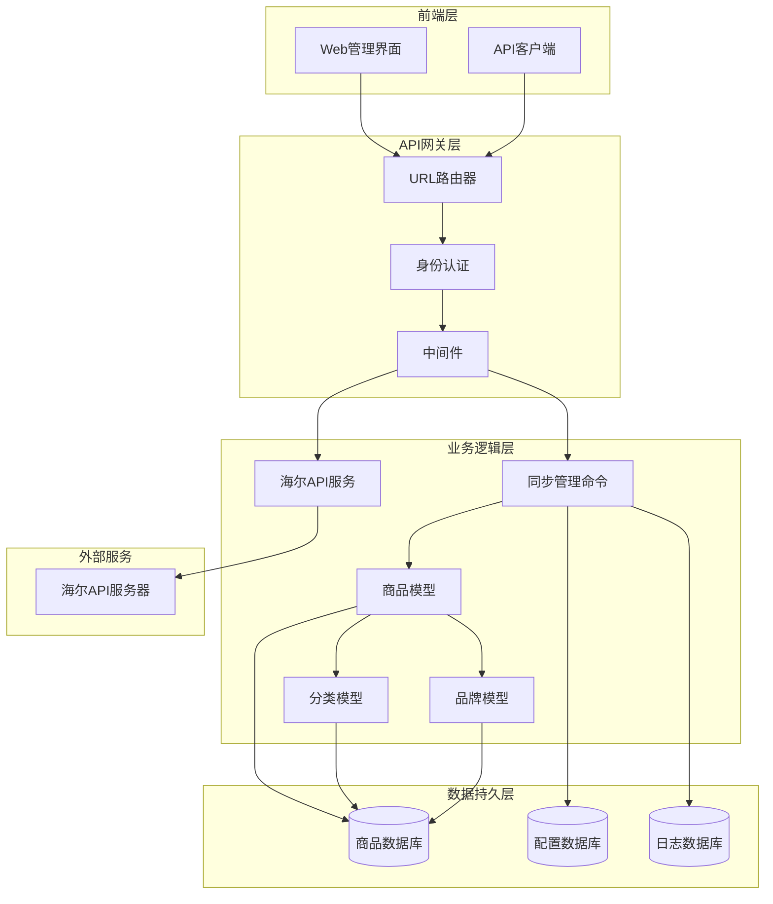
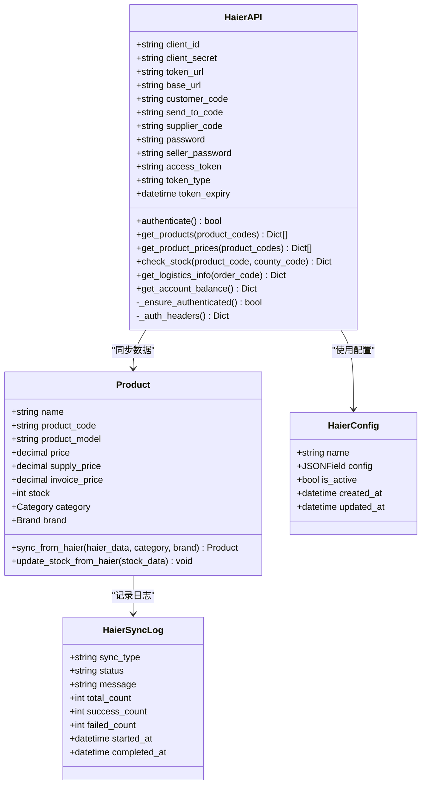
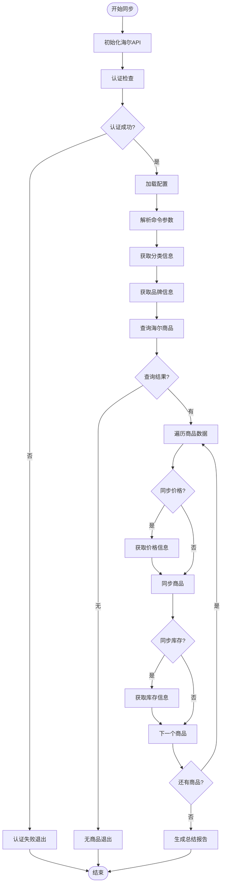
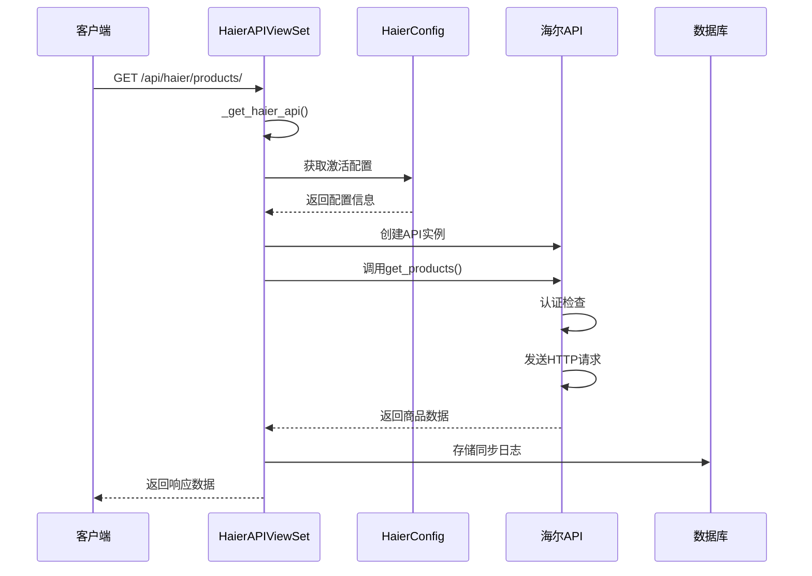
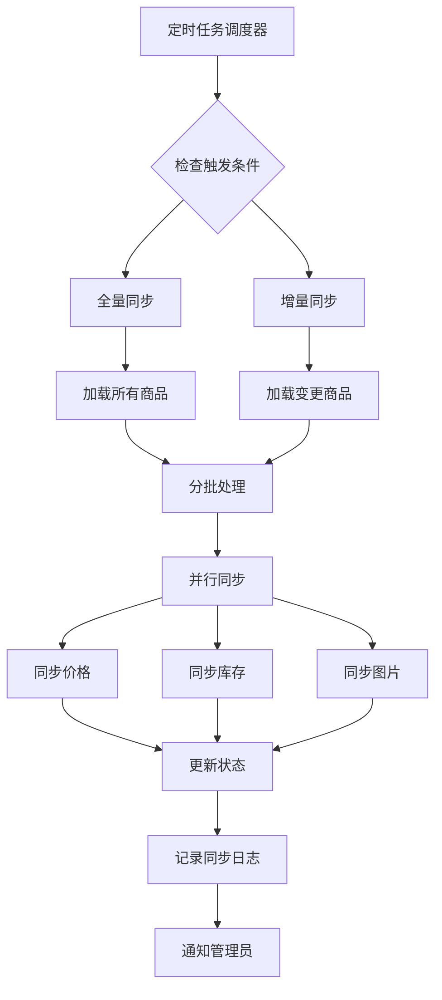
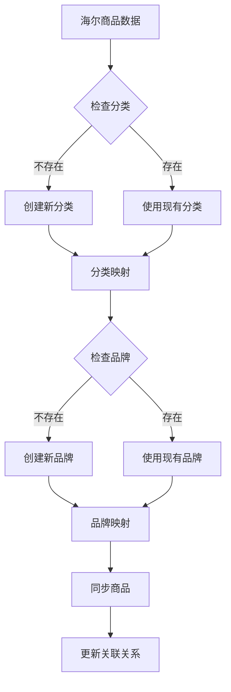
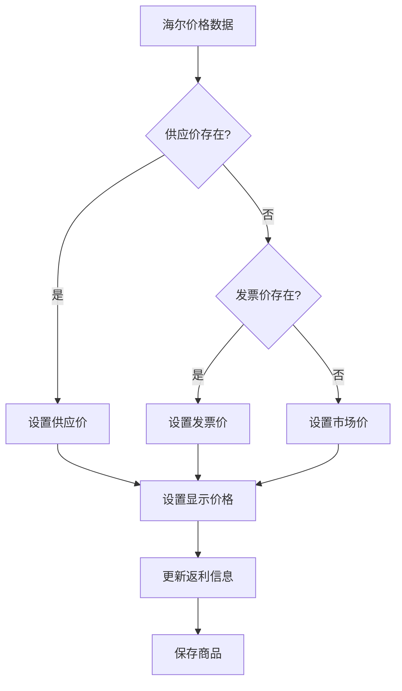
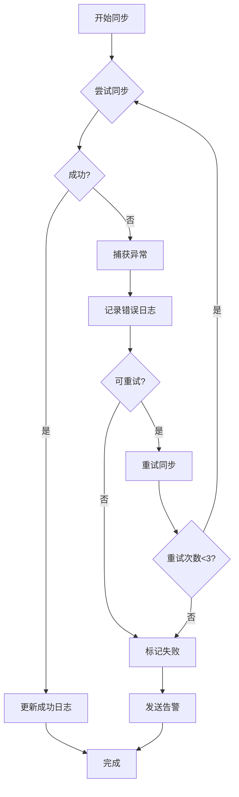
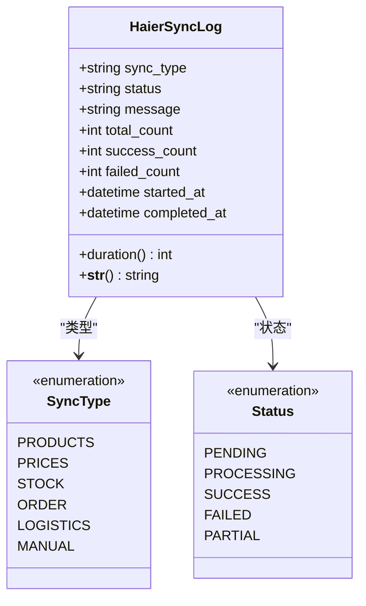

# 商品数据同步功能详细文档

<cite>
**本文档引用的文件**
- [sync_haier_products.py](file://backend/catalog/management/commands/sync_haier_products.py)
- [haierapi.py](file://backend/integrations/haierapi.py)
- [models.py](file://backend/catalog/models.py)
- [integrations/models.py](file://backend/integrations/models.py)
- [views.py](file://backend/integrations/views.py)
- [catalog/views.py](file://backend/catalog/views.py)
- [urls.py](file://backend/integrations/urls.py)
- [base.py](file://backend/backend/settings/base.py)
- [env_config.py](file://backend/backend/settings/env_config.py)
</cite>

## 目录
1. [概述](#概述)
2. [系统架构](#系统架构)
3. [核心组件分析](#核心组件分析)
4. [API接口详解](#api接口详解)
5. [同步机制实现](#同步机制实现)
6. [数据映射逻辑](#数据映射逻辑)
7. [错误处理与日志](#错误处理与日志)
8. [最佳实践指南](#最佳实践指南)
9. [故障排查](#故障排查)
10. [总结](#总结)

## 概述

本文档详细介绍了基于Django框架的海尔商品数据同步功能，重点阐述通过`/api/haier/products/`接口查询海尔可采商品的实现机制。该系统提供了完整的商品数据同步解决方案，包括全量同步与增量同步的触发条件、产品数据映射逻辑、以及完善的错误处理和日志记录机制。

### 主要特性

- **多维度同步支持**：支持商品信息、价格、库存的全量和增量同步
- **智能认证管理**：自动处理OAuth2.0令牌刷新和过期检测
- **灵活的过滤机制**：支持按产品编码、分类、品牌进行精确同步
- **完善的错误处理**：提供详细的错误日志和重试机制
- **实时状态监控**：通过同步日志跟踪每次操作的状态和结果

## 系统架构

**架构图源文件**
- [urls.py](file://backend/integrations/urls.py#L1-L15)
- [views.py](file://backend/integrations/views.py#L1-L50)
- [models.py](file://backend/catalog/models.py#L43-L110)

## 核心组件分析

### HaierAPI类设计

HaierAPI类是整个同步系统的核心，负责与海尔API的交互和数据处理。

**类图源文件**
- [haierapi.py](file://backend/integrations/haierapi.py#L10-L25)
- [models.py](file://backend/catalog/models.py#L43-L110)
- [integrations/models.py](file://backend/integrations/models.py#L4-L47)

### 同步管理命令

sync_haier_products.py提供了强大的命令行工具，支持多种同步场景。

**流程图源文件**
- [sync_haier_products.py](file://backend/catalog/management/commands/sync_haier_products.py#L50-L156)

**章节源文件**
- [sync_haier_products.py](file://backend/catalog/management/commands/sync_haier_products.py#L1-L156)
- [haierapi.py](file://backend/integrations/haierapi.py#L1-L214)

## API接口详解

### 海尔API端点

系统提供了完整的海尔API接口集合，支持各种业务场景。

| 接口路径 | 方法 | 功能描述 | 请求参数 | 响应格式 |
|---------|------|----------|----------|----------|
| `/api/haier/products/` | GET | 查询可采商品 | `product_codes` (可选) | `{success: true, data: []}` |
| `/api/haier/prices/` | GET | 查询商品价格 | `product_codes` (必需) | `{success: true, data: []}` |
| `/api/haier/stock/` | GET | 查询库存信息 | `product_code`, `county_code` | `{success: true, data: {}}` |
| `/api/haier/balance/` | GET | 查询账户余额 | 无 | `{success: true, data: {}}` |
| `/api/haier/logistics/` | GET | 查询物流信息 | `order_code` (必需) | `{success: true, data: {}}` |
| `/api/haier/logs/` | GET | 获取操作日志 | `sync_type`, `status`, `limit` | `{count: 10, results: []}` |

### 商品同步接口实现

**序列图源文件**
- [views.py](file://backend/integrations/views.py#L149-L174)

**章节源文件**
- [views.py](file://backend/integrations/views.py#L104-L327)
- [urls.py](file://backend/integrations/urls.py#L1-L15)

## 同步机制实现

### 全量同步与增量同步

系统支持两种同步模式，根据不同的业务需求选择合适的同步策略。

#### 全量同步触发条件

1. **首次部署**：系统初始化时进行全量同步
2. **配置变更**：海尔API配置更新后重新同步
3. **数据损坏**：本地数据完整性检查失败
4. **定期维护**：按计划执行的周期性同步

#### 增量同步触发条件

1. **定时任务**：每小时/每天自动检查更新
2. **价格变动**：检测到价格变化时同步
3. **库存预警**：库存低于阈值时主动同步
4. **手动触发**：管理员手动发起同步

### 异步执行流程

**流程图源文件**
- [sync_haier_products.py](file://backend/catalog/management/commands/sync_haier_products.py#L50-L156)

**章节源文件**
- [sync_haier_products.py](file://backend/catalog/management/commands/sync_haier_products.py#L16-L49)

## 数据映射逻辑

### 商品数据字段映射

系统实现了完整的海尔API数据到本地Product模型的映射逻辑。

| 海尔API字段 | 本地Product字段 | 映射规则 | 处理方式 |
|------------|----------------|----------|----------|
| `productCode` | `product_code` | 直接映射 | 唯一约束 |
| `productModel` | `product_model` | 直接映射 | 可为空 |
| `productName` | `name` | 直接映射 | 必填字段 |
| `productImageUrl` | `product_image_url` | 直接映射 | URL验证 |
| `productLageUrls` | `product_page_urls` | 列表映射 | JSON存储 |
| `supplyPrice` | `supply_price` | 直接映射 | 数值转换 |
| `invoicePrice` | `invoice_price` | 直接映射 | 数值转换 |
| `marketPrice` | `market_price` | 直接映射 | 数值转换 |
| `isSales` | `is_sales` | 字符映射 | '1'/'0' |
| `noSalesReason` | `no_sales_reason` | 直接映射 | 文本截断 |
| `stockRebatePolicy` | `stock_rebate` | 直接映射 | 数值转换 |
| `rebateMoney` | `rebate_money` | 直接映射 | 数值转换 |

### 分类和品牌关联映射

**流程图源文件**
- [models.py](file://backend/catalog/models.py#L118-L179)

### 价格同步逻辑

价格同步采用多层次的优先级策略，确保数据准确性。

**流程图源文件**
- [models.py](file://backend/catalog/models.py#L157-L167)

**章节源文件**
- [models.py](file://backend/catalog/models.py#L118-L179)

## 错误处理与日志

### 错误处理机制

系统实现了多层次的错误处理机制，确保同步过程的稳定性。

**流程图源文件**
- [sync_haier_products.py](file://backend/catalog/management/commands/sync_haier_products.py#L147-L151)

### 日志记录规范

系统采用结构化的日志记录方式，便于问题追踪和性能分析。

| 日志级别 | 记录场景 | 示例消息 | 包含信息 |
|---------|----------|----------|----------|
| INFO | 同步开始 | "开始同步海尔商品..." | 用户、时间、参数 |
| SUCCESS | 同步成功 | "✓ 同步成功: 产品名称 (编码)" | 成功数量、耗时 |
| WARNING | 部分失败 | "✗ 同步失败: 编码 - 原因" | 失败原因、影响范围 |
| ERROR | 完全失败 | "✗ 错误: 编码 - 异常信息" | 异常堆栈、上下文 |
| DEBUG | 调试信息 | "正在查询价格: 编码" | 详细执行步骤 |

### 同步日志模型

**类图源文件**
- [integrations/models.py](file://backend/integrations/models.py#L50-L150)

**章节源文件**
- [sync_haier_products.py](file://backend/catalog/management/commands/sync_haier_products.py#L147-L151)
- [integrations/models.py](file://backend/integrations/models.py#L50-L150)

## 最佳实践指南

### 同步频率建议

根据不同业务场景推荐以下同步频率：

| 场景类型 | 同步频率 | 触发条件 | 注意事项 |
|---------|----------|----------|----------|
| 新品上架 | 实时同步 | 商品新增 | 高并发处理 |
| 价格变动 | 1小时 | 价格变化检测 | 并发控制 |
| 库存预警 | 15分钟 | 库存低于阈值 | 低延迟要求 |
| 定期维护 | 每天 | 计划任务 | 批量处理 |
| 数据修复 | 手动触发 | 异常检测 | 人工确认 |

### 性能优化策略

1. **批量处理**：每次同步最多处理20个商品，避免单次请求过大
2. **并发控制**：使用异步处理减少等待时间
3. **缓存机制**：缓存认证令牌和常用配置
4. **分页查询**：大数据集采用分页方式处理
5. **连接池**：复用HTTP连接减少建立开销

### 安全配置建议

1. **环境隔离**：生产环境和开发环境使用不同配置
2. **敏感信息保护**：API密钥等敏感信息使用环境变量
3. **访问控制**：限制API访问权限，仅允许授权用户
4. **审计日志**：记录所有API调用和数据修改
5. **监控告警**：设置关键指标的监控和告警

**章节源文件**
- [haierapi.py](file://backend/integrations/haierapi.py#L41-L64)
- [sync_haier_products.py](file://backend/catalog/management/commands/sync_haier_products.py#L16-L49)

## 故障排查

### 常见问题及解决方案

#### 认证失败

**症状**：同步过程中出现认证错误
**原因**：
- API密钥配置错误
- 令牌过期
- 网络连接问题

**解决步骤**：
1. 检查环境变量配置
2. 验证API密钥有效性
3. 查看认证日志
4. 重新启动同步任务

#### 商品同步失败

**症状**：某些商品无法成功同步
**原因**：
- 海尔API返回空数据
- 数据格式不匹配
- 数据库约束冲突

**排查方法**：
1. 检查海尔API响应
2. 验证本地数据模型
3. 查看详细错误日志
4. 单独测试失败商品

#### 性能问题

**症状**：同步速度过慢或超时
**优化措施**：
1. 减少同时处理的商品数量
2. 优化网络连接配置
3. 增加服务器资源
4. 使用异步处理

### 调试工具和技巧

1. **日志分析**：使用Django的日志系统查看详细信息
2. **API测试**：直接调用海尔API验证接口可用性
3. **数据库检查**：验证数据完整性和索引性能
4. **监控仪表板**：使用系统监控工具跟踪性能指标

**章节源文件**
- [sync_haier_products.py](file://backend/catalog/management/commands/sync_haier_products.py#L147-L151)
- [views.py](file://backend/integrations/views.py#L150-L174)

## 总结

本文档全面介绍了海尔商品数据同步功能的实现机制，涵盖了从API接口设计到错误处理的完整技术栈。该系统具有以下核心优势：

1. **架构清晰**：采用分层架构设计，职责分离明确
2. **功能完整**：支持全量和增量同步，覆盖所有业务场景
3. **稳定可靠**：完善的错误处理和日志记录机制
4. **易于扩展**：模块化设计便于功能扩展和维护
5. **性能优化**：多层次的性能优化策略确保高效运行

通过遵循本文档的最佳实践和故障排查指南，开发者可以有效地部署和维护商品数据同步系统，确保业务的连续性和数据的准确性。系统的模块化设计也为未来的功能扩展和性能优化提供了良好的基础。