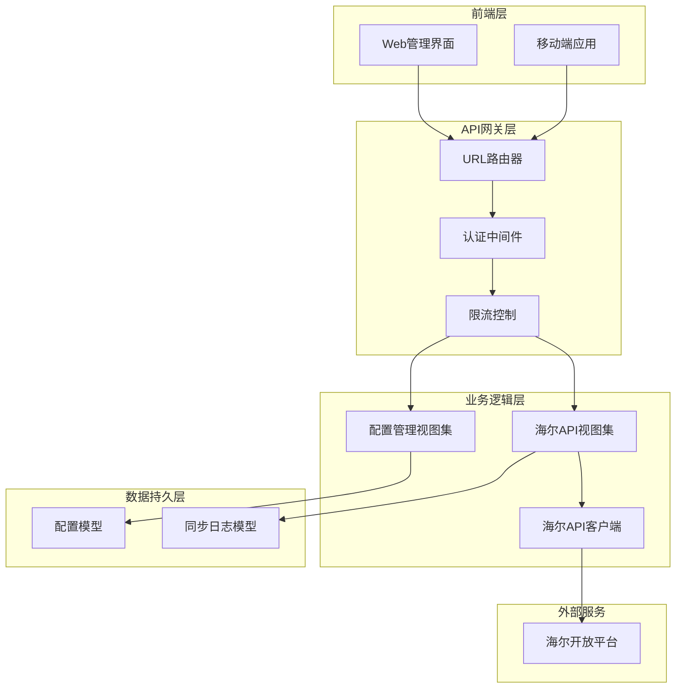
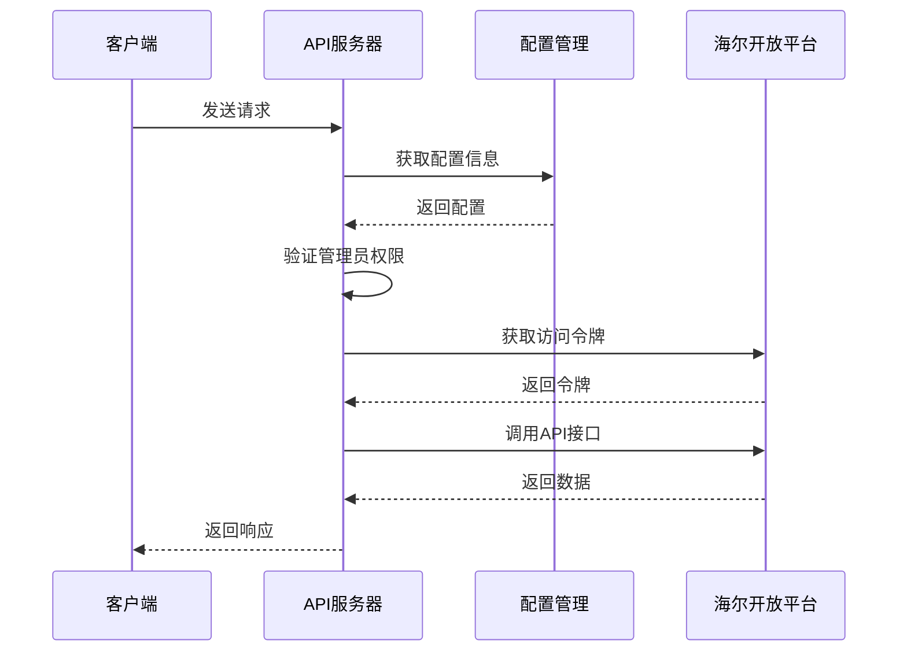
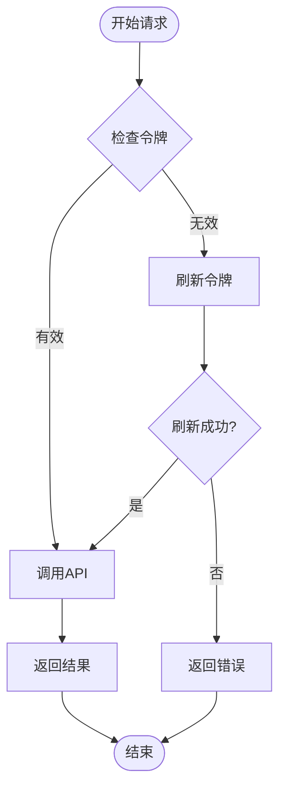
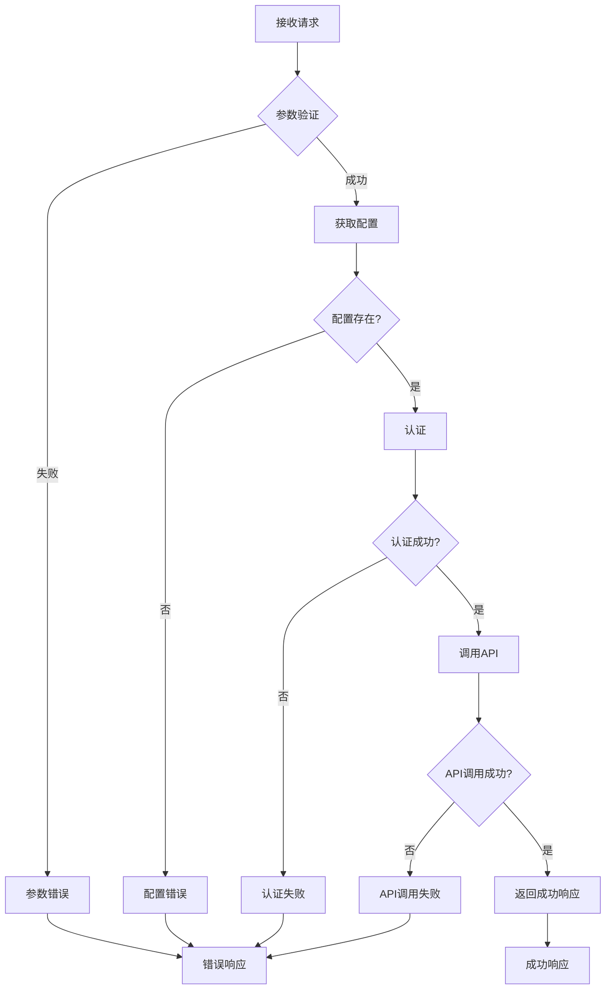

# 商品数据查询

<cite>
**本文档引用的文件**
- [backend/integrations/views.py](file://backend/integrations/views.py)
- [backend/integrations/urls.py](file://backend/integrations/urls.py)
- [backend/integrations/haierapi.py](file://backend/integrations/haierapi.py)
- [backend/integrations/models.py](file://backend/integrations/models.py)
- [backend/integrations/serializers.py](file://backend/integrations/serializers.py)
- [backend/common/responses.py](file://backend/common/responses.py)
- [backend/integrations/admin.py](file://backend/integrations/admin.py)
</cite>

## 目录
1. [简介](#简介)
2. [系统架构](#系统架构)
3. [API端点详解](#api端点详解)
4. [认证机制](#认证机制)
5. [错误处理](#错误处理)
6. [使用示例](#使用示例)
7. [常见问题排查](#常见问题排查)
8. [性能优化建议](#性能优化建议)

## 简介

海尔商品数据查询接口提供了完整的商品信息查询功能，包括商品基本信息、价格查询和库存查询。该API基于RESTful设计原则，采用管理员权限控制，确保数据安全性和准确性。

### 主要功能特性

- **商品查询**：支持按商品编码批量查询海尔商品信息
- **价格查询**：实时获取商品销售价格信息
- **库存查询**：查询指定地区和商品的可用库存
- **权限控制**：严格的管理员权限验证
- **错误处理**：完善的异常处理和错误响应机制

## 系统架构



**图表来源**
- [backend/integrations/views.py](file://backend/integrations/views.py#L104-L327)
- [backend/integrations/urls.py](file://backend/integrations/urls.py#L1-L15)

## API端点详解

### 商品查询端点

#### 端点地址
```
GET /api/haier/products/
```

#### 功能描述
查询可采购的商品信息，支持按商品编码批量查询。

#### 请求参数

| 参数名 | 类型 | 必填 | 默认值 | 说明 |
|--------|------|------|--------|------|
| product_codes | string | 否 | - | 逗号分隔的商品编码列表，最多支持20个商品 |

#### 请求示例
```bash
curl -X GET "https://your-domain.com/api/haier/products/?product_codes=GA0SZC00U,EC6001-HT3" \
  -H "Authorization: Bearer your-token"
```

#### 响应结构
```json
{
  "success": true,
  "data": [
    {
      "productCode": "GA0SZC00U",
      "productName": "海尔空调",
      "productDesc": "1.5匹变频冷暖空调",
      "categoryCode": "KJ01",
      "categoryName": "空调",
      "unit": "台",
      "specification": "1.5匹",
      "brand": "海尔"
    }
  ]
}
```

### 价格查询端点

#### 端点地址
```
GET /api/haier/prices/
```

#### 功能描述
查询指定商品的价格信息。

#### 请求参数

| 参数名 | 类型 | 必填 | 默认值 | 说明 |
|--------|------|------|--------|------|
| product_codes | string | 是 | - | 逗号分隔的商品编码列表，最多支持20个商品 |

#### 请求示例
```bash
curl -X GET "https://your-domain.com/api/haier/prices/?product_codes=GA0SZC00U,EC6001-HT3" \
  -H "Authorization: Bearer your-token"
```

#### 响应结构
```json
{
  "success": true,
  "data": [
    {
      "productCode": "GA0SZC00U",
      "supplyPrice": 2999.00,
      "retailPrice": 3299.00,
      "discountRate": 0.91,
      "currency": "CNY"
    }
  ]
}
```

### 库存查询端点

#### 端点地址
```
GET /api/haier/stock/
```

#### 功能描述
查询指定商品在特定地区的可用库存。

#### 请求参数

| 参数名 | 类型 | 必填 | 默认值 | 说明 |
|--------|------|------|--------|------|
| product_code | string | 是 | - | 商品编码 |
| county_code | string | 否 | 110101 | 地区编码，默认为北京 |

#### 请求示例
```bash
curl -X GET "https://your-domain.com/api/haier/stock/?product_code=GA0SZC00U&county_code=110101" \
  -H "Authorization: Bearer your-token"
```

#### 响应结构
```json
{
  "success": true,
  "data": {
    "productCode": "GA0SZC00U",
    "availableStock": 150,
    "warehouseCode": "BJ001",
    "warehouseName": "北京仓库",
    "countyCode": "110101",
    "countyName": "北京市"
  }
}
```

**章节来源**
- [backend/integrations/views.py](file://backend/integrations/views.py#L149-L240)

## 认证机制

### 认证流程



**图表来源**
- [backend/integrations/haierapi.py](file://backend/integrations/haierapi.py#L41-L69)
- [backend/integrations/views.py](file://backend/integrations/views.py#L122-L147)

### 配置管理

系统支持两种配置方式：

#### 数据库配置
通过管理界面配置海尔API参数：

```python
# 配置字段说明
{
    "client_id": "客户端ID",
    "client_secret": "客户端密钥",
    "token_url": "令牌获取地址",
    "base_url": "API基础地址",
    "customer_code": "客户编码",
    "send_to_code": "发送目标编码",
    "supplier_code": "供应商编码（默认1001）",
    "password": "通用密码",
    "seller_password": "卖家密码"
}
```

#### 环境变量配置
当数据库配置不存在时，系统会自动从环境变量加载：

```bash
HAIER_CLIENT_ID=your_client_id
HAIER_CLIENT_SECRET=your_client_secret
HAIER_TOKEN_URL=https://openplat-test.haier.net/oauth2/auth
HAIER_BASE_URL=https://openplat-test.haier.net
HAIER_CUSTOMER_CODE=your_customer_code
HAIER_SEND_TO_CODE=your_send_to_code
HAIER_SUPPLIER_CODE=1001
HAIER_PASSWORD=your_password
HAIER_SELLER_PASSWORD=your_seller_password
```

### 认证状态检查

系统会自动检查令牌有效性，如果令牌过期会自动重新获取：



**图表来源**
- [backend/integrations/haierapi.py](file://backend/integrations/haierapi.py#L66-L69)

**章节来源**
- [backend/integrations/haierapi.py](file://backend/integrations/haierapi.py#L10-L39)
- [backend/integrations/views.py](file://backend/integrations/views.py#L122-L147)

## 错误处理

### 错误响应格式

所有API错误都遵循统一的响应格式：

```json
{
  "success": false,
  "code": 400,
  "message": "错误描述信息",
  "error_code": "具体的错误代码"
}
```

### 常见错误码

| 错误码 | HTTP状态 | 说明 | 解决方案 |
|--------|---------|------|---------|
| CONFIG_ERROR | 500 | 海尔API配置错误 | 检查配置信息是否正确 |
| AUTH_FAILED | 401 | 认证失败 | 检查客户端凭据 |
| PARAM_REQUIRED | 400 | 参数必填 | 提供必需的参数 |
| INVALID_PARAMETER | 400 | 参数格式错误 | 检查参数格式 |
| API_CALL_FAILED | 400 | API调用失败 | 检查网络连接和API状态 |

### 异常处理流程



**图表来源**
- [backend/integrations/views.py](file://backend/integrations/views.py#L156-L174)
- [backend/integrations/views.py](file://backend/integrations/views.py#L183-L207)
- [backend/integrations/views.py](file://backend/integrations/views.py#L216-L240)

**章节来源**
- [backend/common/responses.py](file://backend/common/responses.py#L102-L273)
- [backend/integrations/views.py](file://backend/integrations/views.py#L169-L174)

## 使用示例

### Python示例

```python
import requests
import json

class HaierAPIClient:
    def __init__(self, base_url, access_token):
        self.base_url = base_url
        self.headers = {
            'Authorization': f'Bearer {access_token}',
            'Content-Type': 'application/json'
        }
    
    def get_products(self, product_codes):
        """查询商品信息"""
        params = {'product_codes': ','.join(product_codes)}
        response = requests.get(
            f'{self.base_url}/api/haier/products/',
            headers=self.headers,
            params=params
        )
        return response.json()
    
    def get_prices(self, product_codes):
        """查询商品价格"""
        params = {'product_codes': ','.join(product_codes)}
        response = requests.get(
            f'{self.base_url}/api/haier/prices/',
            headers=self.headers,
            params=params
        )
        return response.json()
    
    def get_stock(self, product_code, county_code='110101'):
        """查询库存"""
        params = {
            'product_code': product_code,
            'county_code': county_code
        }
        response = requests.get(
            f'{self.base_url}/api/haier/stock/',
            headers=self.headers,
            params=params
        )
        return response.json()

# 使用示例
client = HaierAPIClient('https://your-domain.com', 'your-access-token')

# 查询商品
products = client.get_products(['GA0SZC00U', 'EC6001-HT3'])
print(json.dumps(products, indent=2, ensure_ascii=False))

# 查询价格
prices = client.get_prices(['GA0SZC00U', 'EC6001-HT3'])
print(json.dumps(prices, indent=2, ensure_ascii=False))

# 查询库存
stock = client.get_stock('GA0SZC00U', '110101')
print(json.dumps(stock, indent=2, ensure_ascii=False))
```

### JavaScript示例

```javascript
class HaierAPI {
    constructor(baseUrl, accessToken) {
        this.baseUrl = baseUrl;
        this.accessToken = accessToken;
    }
    
    async getProducts(productCodes) {
        const params = new URLSearchParams({
            product_codes: productCodes.join(',')
        });
        
        const response = await fetch(
            `${this.baseUrl}/api/haier/products/?${params}`,
            {
                headers: {
                    'Authorization': `Bearer ${this.accessToken}`,
                    'Content-Type': 'application/json'
                }
            }
        );
        
        return response.json();
    }
    
    async getProductPrices(productCodes) {
        const params = new URLSearchParams({
            product_codes: productCodes.join(',')
        });
        
        const response = await fetch(
            `${this.baseUrl}/api/haier/prices/?${params}`,
            {
                headers: {
                    'Authorization': `Bearer ${this.accessToken}`,
                    'Content-Type': 'application/json'
                }
            }
        );
        
        return response.json();
    }
    
    async getStock(productCode, countyCode = '110101') {
        const params = new URLSearchParams({
            product_code: productCode,
            county_code: countyCode
        });
        
        const response = await fetch(
            `${this.baseUrl}/api/haier/stock/?${params}`,
            {
                headers: {
                    'Authorization': `Bearer ${this.accessToken}`,
                    'Content-Type': 'application/json'
                }
            }
        );
        
        return response.json();
    }
}

// 使用示例
const api = new HaierAPI('https://your-domain.com', 'your-access-token');

async function queryProducts() {
    try {
        const products = await api.getProducts(['GA0SZC00U', 'EC6001-HT3']);
        console.log('商品信息:', products);
        
        const prices = await api.getProductPrices(['GA0SZC00U', 'EC6001-HT3']);
        console.log('价格信息:', prices);
        
        const stock = await api.getStock('GA0SZC00U', '110101');
        console.log('库存信息:', stock);
    } catch (error) {
        console.error('查询失败:', error);
    }
}

queryProducts();
```

## 常见问题排查

### 配置错误

**问题现象**：返回"海尔API配置错误"

**可能原因**：
1. 数据库中未配置有效的海尔API参数
2. 环境变量配置不完整
3. 配置信息格式错误

**排查步骤**：
1. 检查数据库配置表是否有有效配置
2. 验证环境变量是否正确设置
3. 使用测试连接功能验证配置

**解决方案**：
```bash
# 检查配置
curl -X GET "https://your-domain.com/api/haier/config/" \
  -H "Authorization: Bearer your-token"

# 测试连接
curl -X POST "https://your-domain.com/api/haier/config/{id}/test/" \
  -H "Authorization: Bearer your-token"
```

### 认证失败

**问题现象**：返回"认证失败"或401错误

**可能原因**：
1. 客户端凭据错误
2. 令牌已过期
3. 网络连接问题

**排查步骤**：
1. 验证client_id和client_secret
2. 检查令牌获取接口是否正常
3. 确认网络连接状态

**解决方案**：
```python
# 手动测试认证
from integrations.haierapi import HaierAPI

config = {
    'client_id': 'your_client_id',
    'client_secret': 'your_client_secret',
    'token_url': 'your_token_url',
    'base_url': 'your_base_url'
}

api = HaierAPI(config)
success = api.authenticate()
print(f"认证{'成功' if success else '失败'}")
```

### 参数缺失

**问题现象**：返回"product_codes参数必填"或类似错误

**可能原因**：
1. 必填参数未提供
2. 参数格式不正确
3. 参数数量超限

**排查步骤**：
1. 检查请求参数是否完整
2. 验证参数格式是否符合要求
3. 确认参数数量限制

**解决方案**：
```bash
# 正确的请求格式
curl "https://your-domain.com/api/haier/products/?product_codes=GA0SZC00U,EC6001-HT3"

# 注意：参数之间用逗号分隔，不要有空格
```

### API调用失败

**问题现象**：返回API调用失败错误

**可能原因**：
1. 海尔开放平台服务异常
2. 网络连接超时
3. 请求频率过高

**排查步骤**：
1. 检查海尔开放平台状态
2. 验证网络连接稳定性
3. 查看请求频率是否合理

**解决方案**：
```python
# 添加重试机制
import time
import requests

def call_with_retry(api_method, max_retries=3):
    for i in range(max_retries):
        try:
            return api_method()
        except requests.exceptions.RequestException as e:
            if i == max_retries - 1:
                raise e
            time.sleep(2 ** i)  # 指数退避
```

### 性能问题

**问题现象**：API响应缓慢或超时

**可能原因**：
1. 海尔开放平台响应慢
2. 网络延迟高
3. 请求参数过多

**优化建议**：
1. 减少单次请求的商品数量
2. 实现本地缓存机制
3. 使用异步处理

**章节来源**
- [backend/integrations/views.py](file://backend/integrations/views.py#L156-L174)
- [backend/integrations/views.py](file://backend/integrations/views.py#L183-L207)
- [backend/integrations/views.py](file://backend/integrations/views.py#L216-L240)

## 性能优化建议

### 缓存策略

1. **商品信息缓存**：商品基本信息变化较少，可以设置较长的缓存时间
2. **价格信息缓存**：价格变动频繁，建议设置较短的缓存时间
3. **库存信息缓存**：库存实时性要求高，建议不缓存或缓存时间很短

### 批量处理优化

```python
def optimized_batch_query(product_codes, batch_size=10):
    """优化的批量查询"""
    results = []
    
    for i in range(0, len(product_codes), batch_size):
        batch = product_codes[i:i + batch_size]
        # 并行查询多个批次
        batch_results = parallel_query(batch)
        results.extend(batch_results)
    
    return results
```

### 监控和日志

1. **请求监控**：记录每个API的响应时间和成功率
2. **错误监控**：跟踪各类错误的发生频率和模式
3. **性能监控**：监控系统整体性能指标

### 容错机制

1. **降级策略**：当外部API不可用时，返回缓存数据
2. **熔断机制**：连续失败达到阈值时暂停调用
3. **重试策略**：对临时性错误实施指数退避重试

**章节来源**
- [backend/integrations/models.py](file://backend/integrations/models.py#L50-L149)